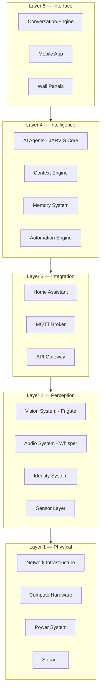
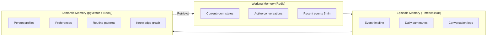
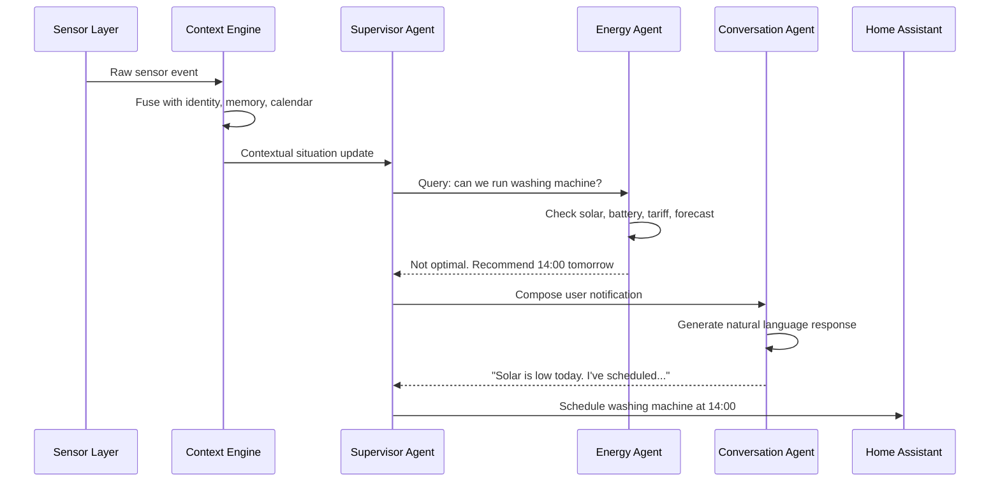
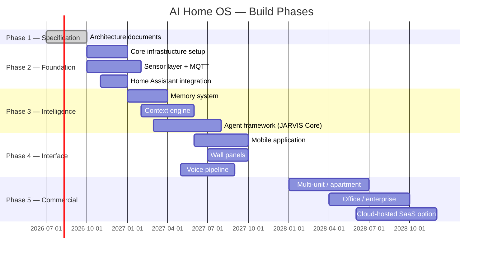

<div align="center">

# AI Home OS

### A Context-Aware Autonomous Intelligence Platform  
### for Smart Homes, Buildings, and Energy Management

---

> *"Not a smart home. Not an assistant. An intelligent building that understands you."*

---

[]()
[]()
[]()
[]()
[]()

</div>

---

## What Is AI Home OS?

AI Home OS is an **open design specification and reference implementation** for a next-generation autonomous intelligence layer for homes and buildings.

It is **not** Home Assistant.  
It is **not** Alexa.  
It is **not** Google Home.  
It is **not** a configuration layer.

It is an **AI Operating System** — an autonomous reasoning platform that:

- Perceives the physical environment through sensors, cameras, and microphones
- Identifies who is present using multi-modal identity fusion
- Remembers people, preferences, routines, and events over time
- Reasons over all available context using local and cloud AI models
- Predicts what will happen before it happens
- Acts on the physical world through Home Assistant and direct device APIs
- Speaks naturally and understands natural language
- Manages energy with world-class intelligence
- Monitors and responds to security events
- Gets smarter over time without being reprogrammed

The closest cultural reference is **JARVIS from Iron Man** — but built with real, available technology in 2026.

---

## Why This Project Exists

Most "smart home" platforms today are:

- **Reactive**, not proactive
- **Rule-based**, not reasoning-based
- **Device-centric**, not human-centric
- **Voice assistant thin layers**, not true intelligence
- **Cloud-dependent**, creating privacy risks
- **Siloed**, with no unified context across sensors

AI Home OS challenges all of these assumptions. It is designed as a **multi-year, community-built platform** with a published architecture specification that any engineer can read, contribute to, challenge, or implement.

---

## Project Philosophy

| Principle | What It Means |
|-----------|--------------|
| **Context over commands** | The AI should understand situations, not just execute commands |
| **Edge-first, cloud fallback** | All critical reasoning runs locally; cloud enhances but is never required |
| **Privacy by design** | No data leaves the home without explicit user consent |
| **Modularity** | Every subsystem is independently replaceable |
| **Home Assistant is a subsystem** | HA executes; AI Home OS reasons and decides |
| **Open architecture** | Every design decision is documented and challengeable |
| **Fail-safe always** | The home must remain functional even when AI is offline |
| **Human-in-the-loop** | The AI advises; humans approve critical actions |

---

## Architecture Overview

```
╔══════════════════════════════════════════════════════════════════════════╗
║                            AI HOME OS                                   ║
║                                                                          ║
║   ┌──────────────┐   ┌──────────────┐   ┌──────────────┐               ║
║   │  Conversation│   │   Planning   │   │   Security   │               ║
║   │    Agent     │   │    Agent     │   │    Agent     │               ║
║   └──────┬───────┘   └──────┬───────┘   └──────┬───────┘               ║
║          │                  │                  │                        ║
║   ┌──────▼───────┐   ┌──────▼───────┐   ┌──────▼───────┐               ║
║   │    Energy    │   │  Maintenance │   │    Health    │               ║
║   │    Agent     │   │    Agent     │   │    Agent     │               ║
║   └──────┬───────┘   └──────┬───────┘   └──────┬───────┘               ║
║          └──────────────────┼──────────────────┘                        ║
║                             ▼                                           ║
║              ┌──────────────────────────────┐                          ║
║              │      JARVIS CORE             │                          ║
║              │  Supervisor + Coordinator    │                          ║
║              │  Scheduler + Planner         │                          ║
║              └──────────────┬───────────────┘                          ║
║                             │                                           ║
║    ┌────────────────────────┼────────────────────────┐                 ║
║    ▼                        ▼                        ▼                 ║
║ ┌──────────┐         ┌──────────────┐         ┌──────────────┐        ║
║ │  Memory  │         │   Context    │         │  Automation  │        ║
║ │  Store   │         │   Engine     │         │   Engine     │        ║
║ └──────────┘         └──────────────┘         └──────────────┘        ║
╚══════════════════════════════════════════════════════════════════════════╝
                                   │
              ┌────────────────────┼────────────────────┐
              ▼                    ▼                    ▼
    ┌──────────────────┐  ┌──────────────────┐  ┌──────────────┐
    │  Home Assistant  │  │  ESPHome / MQTT  │  │  Cloud APIs  │
    │  (Action Layer)  │  │  (Sensor Layer)  │  │  (Enrichment)│
    └──────────────────┘  └──────────────────┘  └──────────────┘
              │                    │
    ┌─────────▼──────┐    ┌────────▼───────┐
    │ Physical Devices│    │  Sensor Nodes  │
    │ Lights, Locks,  │    │  mmWave, Temp, │
    │ HVAC, Blinds..  │    │  CO2, Energy.. │
    └─────────────────┘    └────────────────┘
```

---

## System Layers



---

## Technology Stack

### Core AI

| Component | Local Solution | Cloud Fallback |
|-----------|---------------|----------------|
| LLM Reasoning | Ollama + Llama 3.3 / Mistral / Phi-4 | GPT-4o / Claude 3.5 / Gemini 2.0 |
| Speech-to-Text | Whisper (faster-whisper) | Deepgram / Azure Speech |
| Text-to-Speech | Piper TTS | ElevenLabs / Azure Neural |
| Object Detection | Frigate + YOLO | Cloud Vision API |
| Face Recognition | DeepFace (local) | Azure Face API |
| Embeddings | Nomic Embed / BGE-M3 | OpenAI Embeddings |

### Infrastructure

| Layer | Technology |
|-------|-----------|
| Device Orchestration | Home Assistant |
| Sensor Firmware | ESPHome |
| Sensor Protocol | Zigbee2MQTT, Z-Wave JS, Matter, Thread, BLE |
| Message Bus | Mosquitto MQTT + Redis Pub/Sub |
| Time-Series DB | TimescaleDB (PostgreSQL extension) |
| Relational DB | PostgreSQL 16 |
| Vector DB | pgvector / Qdrant |
| Knowledge Graph | Neo4j |
| Cache | Redis 7 |
| Object Storage | MinIO |
| Container Runtime | Docker + k3s (Kubernetes edge) |
| Monitoring | Prometheus + Grafana |
| Log Aggregation | Loki + Grafana |
| API Gateway | Traefik |
| CI/CD | Gitea Actions (local) + GitHub Actions |

### Networking

| Role | Hardware |
|------|---------|
| Core Switch | UniFi Pro 24 PoE / Omada TL-SG3428X |
| WiFi | UniFi U6 Pro / Omada EAP670 (WPA3, 6 GHz) |
| Router/Firewall | UniFi Dream Machine Pro / pfSense |
| IoT VLAN Isolation | Dedicated VLAN per protocol class |
| Zigbee Coordinator | Sonoff Zigbee 3.0 USB Dongle Plus |
| Z-Wave Controller | Zooz 800 Series |

### Compute

| Role | Hardware |
|------|---------|
| Primary AI Server | Intel NUC 13 Pro / NUC 14 / Beelink EQ |
| GPU Inference | NVIDIA RTX 4070 / Coral TPU (edge) |
| NAS Storage | Synology DS923+ / TrueNAS Scale |
| Power Backup | APC Smart-UPS 1500VA |

---

## Specification Document Structure

This repository contains the complete design specification in 16 chapters. Each chapter is self-contained with architecture diagrams, design decisions, trade-offs, hardware/software recommendations, pseudo-code, and references.

| Chapter | Title | Status |
|---------|-------|--------|
| [Ch 01](docs/Chapter-01.md) | Physical Infrastructure | 🔄 In Progress |
| [Ch 02](docs/Chapter-02.md) | Sensor Layer | ⏳ Queued |
| [Ch 03](docs/Chapter-03.md) | Vision System | ⏳ Queued |
| [Ch 04](docs/Chapter-04.md) | Audio System | ⏳ Queued |
| [Ch 05](docs/Chapter-05.md) | Identity System | ⏳ Queued |
| [Ch 06](docs/Chapter-06.md) | Memory System | ⏳ Queued |
| [Ch 07](docs/Chapter-07.md) | AI Reasoning Engine | ⏳ Queued |
| [Ch 08](docs/Chapter-08.md) | Context Engine | ⏳ Queued |
| [Ch 09](docs/Chapter-09.md) | Automation Engine | ⏳ Queued |
| [Ch 10](docs/Chapter-10.md) | Energy Intelligence | ⏳ Queued |
| [Ch 11](docs/Chapter-11.md) | Security Architecture | ⏳ Queued |
| [Ch 12](docs/Chapter-12.md) | API & Integration Layer | ⏳ Queued |
| [Ch 13](docs/Chapter-13.md) | Mobile Application | ⏳ Queued |
| [Ch 14](docs/Chapter-14.md) | Wall Panels | ⏳ Queued |
| [Ch 15](docs/Chapter-15.md) | AI Conversation Examples | ⏳ Queued |
| [Ch 16](docs/Chapter-16.md) | Future Roadmap | ⏳ Queued |

---

## Key Design Concepts

### Context Fusion Example

The power of AI Home OS is understanding *situations*, not just *events*:

```
Camera detects person at front door
        │
        ▼
BLE beacon confirms it's Sadiq's phone
        │
        ▼
Voice pattern matches Sadiq (98.3% confidence)
        │
        ▼
Calendar shows work day ending at 18:00 (current time: 18:07)
        │
        ▼
Weather: rain in progress
        │
        ▼
Solar production: low (overcast)
        │
        ▼
Battery SOC: 35%
        │
        ▼
Context Engine concludes:
"Sadiq has arrived home from work in rain, carrying items (hands full detected).
 Unlock door automatically. Turn on entrance lights.
 Do NOT run dishwasher now (low battery). 
 Greet with weather-aware message."
```

No rule. No automation. **Reasoning.**

### Memory Architecture



### Agent Communication



---

## Energy Intelligence (Highlight)

AI Home OS treats energy as a first-class citizen — not an afterthought.

```
┌──────────────────────────────────────────────────────────┐
│                  ENERGY INTELLIGENCE                     │
│                                                          │
│  ┌─────────┐  ┌─────────┐  ┌─────────┐  ┌──────────┐  │
│  │  Solar  │  │ Battery │  │  Grid   │  │Generator │  │
│  │ Monitor │  │   SOC   │  │ Tariff  │  │  Status  │  │
│  └────┬────┘  └────┬────┘  └────┬────┘  └─────┬────┘  │
│       └────────────┴────────────┴──────────────┘       │
│                          │                              │
│                 ┌────────▼────────┐                    │
│                 │  Energy Planner │                    │
│                 │  (AI Agent)     │                    │
│                 └────────┬────────┘                    │
│                          │                             │
│   ┌──────────────────────┼──────────────────────────┐ │
│   ▼                      ▼                          ▼ │
│ Load              Peak Shaving              EV Charge │
│ Scheduling        Demand Response           Optimizer  │
│                                                        │
│   MSM Integration ──► HA Energy ──► Smart Plugs/EVSE  │
└──────────────────────────────────────────────────────────┘
```

Capabilities:
- Real-time solar yield tracking and forecasting
- Battery SOC management with degradation awareness
- Time-of-use tariff optimization
- EV charging scheduling around solar peaks
- Load shifting: dishwasher, washing machine, water heater
- Peak demand shaving for commercial installations
- Generator auto-start on grid failure with seamless transition
- MicroAccess Smart Metering (MSM) integration for utility-grade accuracy
- Carbon intensity optimization (run loads when grid is greenest)

---

## Conversation Intelligence

AI Home OS supports natural, contextual, multi-turn conversation — not command-response pairs.

**Example — Morning Routine:**
```
AI:    "Good morning, Sadiq. It's 6:47 AM. You have a meeting at 9 AM.
        The route to the office shows 34 minutes with current traffic.
        Solar is producing well — I've already started the dishwasher.
        Coffee machine is warming up. Shall I read your schedule?"

User:  "Yeah, what's on today?"

AI:    "You have three things: 9 AM product standup — 45 minutes.
        Lunch with Ahmed at 12:30, the Thai place on Sheikh Zayed.
        And a 4 PM review with the board. I've pre-cooled your car —
        it's already 39 degrees outside."

User:  "Remind me 20 minutes before the board meeting."

AI:    "Done. I'll also silence your phone during it automatically
        unless you'd like to keep it on?"
```

**Example — Security Alert:**
```
AI:    "Sadiq, I've detected movement in the backyard — 11:47 PM.
        Two people near the east wall. Cameras are recording.
        This doesn't match any known visitor profiles.
        Should I sound the alarm or alert security?"

User:  "Show me the camera."

AI:    [Pushes camera feed to phone and wall panel]
       "I'm keeping all external doors locked and have notified
        your neighbor Ahmed as your emergency contact.
        I can call the police — say 'yes' to confirm."
```

---

## Roadmap



---

## How to Contribute

This project is in its **architecture and specification phase**. Contributions are needed at every level.

### Ways to Contribute

| Area | What We Need |
|------|-------------|
| **Architecture Review** | Challenge design decisions, suggest alternatives, identify gaps |
| **Chapter Writing** | Help write or expand specification chapters |
| **Diagrams** | Improve Mermaid diagrams, create visual aids |
| **Prototype Code** | Implement proof-of-concept modules in Python/TypeScript |
| **Hardware Testing** | Test and report on specific sensor/device combinations |
| **AI/ML** | Improve agent designs, suggest better models, fine-tuning strategies |
| **Security Review** | Audit architecture for vulnerabilities and privacy risks |
| **Energy Engineering** | Improve energy intelligence models and algorithms |
| **Documentation** | Improve clarity, add examples, translate |
| **Community Building** | Help organize discussions, issues, and feature requests |

### Contribution Process

```bash
# 1. Fork the repository
git fork https://github.com/donzeg/AI-Home-OS

# 2. Clone your fork
git clone https://github.com/YOUR_USERNAME/AI-Home-OS.git
cd AI-Home-OS

# 3. Create a branch for your contribution
git checkout -b chapter/02-sensor-layer
# or
git checkout -b architecture/memory-system-redesign
# or
git checkout -b prototype/context-engine-poc

# 4. Make your changes
# 5. Commit with a meaningful message
git commit -m "feat(ch02): add mmWave sensor placement guidelines"

# 6. Push and open a Pull Request
git push origin chapter/02-sensor-layer
```

### Branch Naming Conventions

| Prefix | Use For |
|--------|---------|
| `chapter/` | Writing or editing specification chapters |
| `architecture/` | Proposing architectural changes |
| `prototype/` | Adding proof-of-concept code |
| `fix/` | Fixing errors or inconsistencies |
| `diagram/` | Adding or improving diagrams |
| `docs/` | General documentation improvements |

### Commit Message Format

We follow [Conventional Commits](https://www.conventionalcommits.org/):

```
feat(ch01): add PoE switch selection matrix
fix(ch03): correct Frigate GPU memory requirements  
docs(readme): improve contribution section
arch(memory): propose alternative vector DB strategy
```

### Discussion & Issues

- Use **GitHub Issues** for: bugs in the spec, questions, requests
- Use **GitHub Discussions** for: architecture debates, ideas, proposals
- Label your issues with the chapter tag (e.g., `chapter-02`, `energy`, `security`)

---

## Repository Structure

```
AI-Home-OS/
├── README.md                          ← You are here
├── AI Home OS — Table of Contents.md ← Master chapter index
│
├── docs/                              ← Specification chapters
│   ├── Chapter-01.md                  ← Physical Infrastructure
│   ├── Chapter-02.md                  ← Sensor Layer
│   ├── Chapter-03.md                  ← Vision System
│   ├── Chapter-04.md                  ← Audio System
│   ├── Chapter-05.md                  ← Identity System
│   ├── Chapter-06.md                  ← Memory System
│   ├── Chapter-07.md                  ← AI Reasoning Engine
│   ├── Chapter-08.md                  ← Context Engine
│   ├── Chapter-09.md                  ← Automation Engine
│   ├── Chapter-10.md                  ← Energy Intelligence
│   ├── Chapter-11.md                  ← Security Architecture
│   ├── Chapter-12.md                  ← API & Integration Layer
│   ├── Chapter-13.md                  ← Mobile Application
│   ├── Chapter-14.md                  ← Wall Panels
│   ├── Chapter-15.md                  ← AI Conversation Examples
│   └── Chapter-16.md                  ← Future Roadmap
│
├── prototypes/                        ← Proof-of-concept implementations
│   ├── context-engine/
│   ├── memory-system/
│   ├── agent-framework/
│   └── energy-optimizer/
│
├── diagrams/                          ← Architecture diagrams (source files)
│   ├── system-overview.mmd
│   ├── network-topology.mmd
│   ├── agent-communication.mmd
│   └── energy-flow.mmd
│
├── hardware/                          ← Hardware reference lists and BOM
│   ├── sensor-bom.md
│   ├── compute-bom.md
│   └── networking-bom.md
│
└── .github/
    ├── ISSUE_TEMPLATE/
    │   ├── architecture-proposal.md
    │   ├── chapter-review.md
    │   └── bug-report.md
    └── PULL_REQUEST_TEMPLATE.md
```

---

## Community Discussions We Want

We want this project to be a **serious engineering community**, not just a wishlist. These are the discussions we're actively inviting:

1. **Should the AI OS use a microkernel or monolithic agent architecture?**  
   (See Chapter 7 when published)

2. **Is Home Assistant the right executor layer, or should we build our own?**  
   The spec assumes HA, but this deserves debate.

3. **Which vector database performs best for semantic home memory at scale?**  
   pgvector vs Qdrant vs Weaviate vs Chroma

4. **What is the right LLM for edge reasoning in a home?**  
   Phi-4 vs Llama 3.3 vs Mistral vs Gemma 3 on 8–16 GB RAM

5. **How do we handle total AI failure gracefully?**  
   If JARVIS Core crashes, the home must still function safely.

6. **Privacy boundaries: what data should never leave the home, ever?**

7. **Multimodal models vs specialized models for each perception task?**

---

## Comparison With Existing Systems

| Feature | AI Home OS | Home Assistant | Alexa | Google Home |
|---------|-----------|----------------|-------|-------------|
| Autonomous reasoning | ✅ | ❌ | ❌ | ❌ |
| Long-term memory | ✅ | ❌ | Limited | Limited |
| Multi-agent architecture | ✅ | ❌ | ❌ | ❌ |
| Local-first AI | ✅ | Partial | ❌ | ❌ |
| Identity fusion (multi-modal) | ✅ | ❌ | ❌ | ❌ |
| Energy intelligence | ✅ | Partial | ❌ | ❌ |
| Proactive conversation | ✅ | ❌ | Limited | Limited |
| Predictive automation | ✅ | ❌ | ❌ | ❌ |
| Context-aware decisions | ✅ | ❌ | ❌ | ❌ |
| Open architecture | ✅ | ✅ | ❌ | ❌ |
| Edge + Cloud hybrid AI | ✅ | Partial | ❌ | ❌ |
| Privacy-first design | ✅ | ✅ | ❌ | ❌ |

---

## Acknowledgements

This project stands on the shoulders of the open-source community. Key projects that AI Home OS integrates with or draws inspiration from:

- [Home Assistant](https://www.home-assistant.io/) — The world's best open-source home automation platform
- [Frigate NVR](https://frigate.video/) — Local AI object detection for cameras
- [ESPHome](https://esphome.io/) — Firmware for custom ESP32/ESP8266 sensors
- [Whisper](https://github.com/openai/whisper) — OpenAI's open-source speech recognition
- [Piper TTS](https://github.com/rhasspy/piper) — Fast, local neural text-to-speech
- [Ollama](https://ollama.ai/) — Run large language models locally
- [Zigbee2MQTT](https://www.zigbee2mqtt.io/) — Zigbee to MQTT bridge
- [pgvector](https://github.com/pgvector/pgvector) — Vector similarity search for PostgreSQL
- [Qdrant](https://qdrant.tech/) — High-performance vector database
- [Neo4j](https://neo4j.com/) — Graph database for knowledge representation

---

## License

This project is licensed under the **MIT License** — see [LICENSE](LICENSE) for details.

The specification documents are also available under [Creative Commons Attribution 4.0 International (CC BY 4.0)](https://creativecommons.org/licenses/by/4.0/) — you are free to use, adapt, and build upon this work commercially as long as you give appropriate credit.

---

## Contact & Community

- **GitHub Discussions**: [AI Home OS Discussions](https://github.com/donzeg/AI-Home-OS/discussions)
- **Issues**: [Report issues or propose features](https://github.com/donzeg/AI-Home-OS/issues)
- **Pull Requests**: All contributions welcome

---

<div align="center">

**Built for engineers. Designed for homes. Open to everyone.**

*Star ⭐ the repo if you believe in the vision. Fork it if you want to build it.*

</div>
