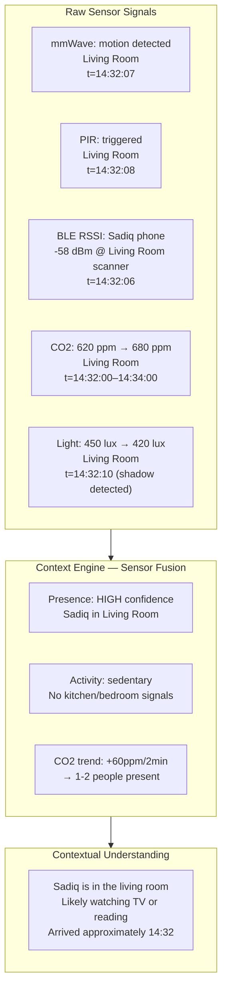
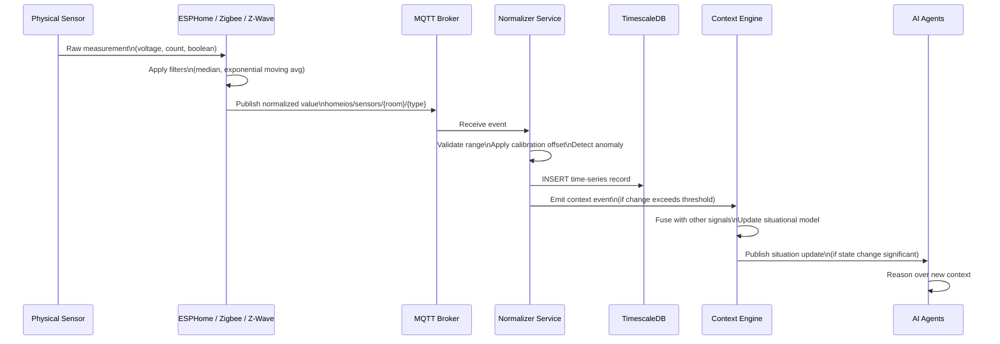
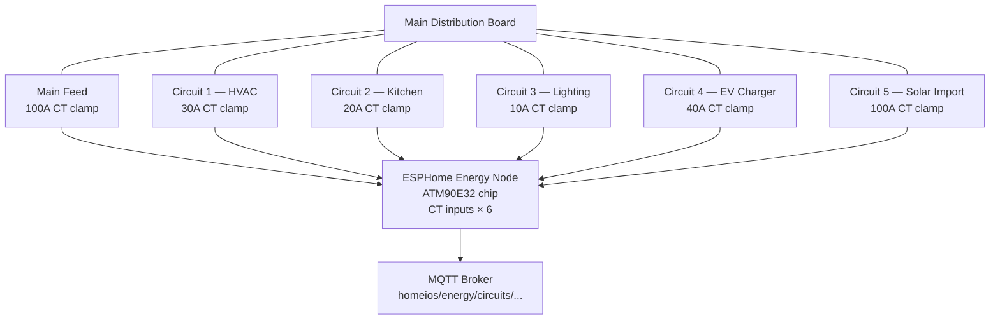
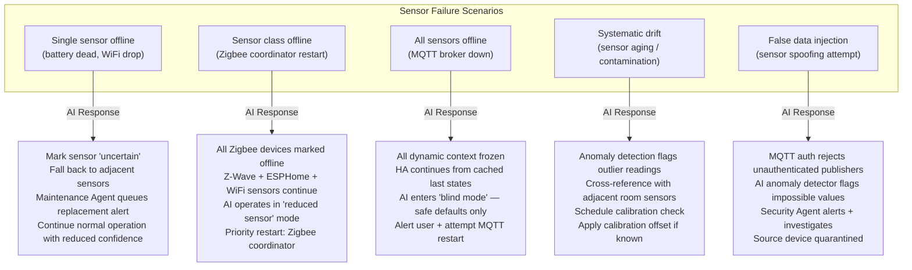

# Chapter 02 — Sensor Layer

**AI Home OS Internal Design Specification**  
**Classification:** Internal — Engineering  
**Status:** Draft v1.0  
**Date:** 2026-07-17

---

## Table of Contents

1. [Overview](#1-overview)
2. [Sensor Architecture Philosophy](#2-sensor-architecture-philosophy)
3. [Sensor Data Flow](#3-sensor-data-flow)
4. [Category 1 — Presence & Motion](#4-category-1--presence--motion)
5. [Category 2 — Environmental](#5-category-2--environmental)
6. [Category 3 — Safety & Alarm](#6-category-3--safety--alarm)
7. [Category 4 — Energy & Utilities](#7-category-4--energy--utilities)
8. [Category 5 — Occupancy & Sleep](#8-category-5--occupancy--sleep)
9. [Category 6 — Identity & Location](#9-category-6--identity--location)
10. [Category 7 — Vehicle & Exterior](#10-category-7--vehicle--exterior)
11. [Category 8 — Weather Station](#11-category-8--weather-station)
12. [Category 9 — Pool & Water Features](#12-category-9--pool--water-features)
13. [Category 10 — Agriculture & Garden](#13-category-10--agriculture--garden)
14. [Sensor Placement Map](#14-sensor-placement-map)
15. [Sensor Data Schema](#15-sensor-data-schema)
16. [Failure Mode Analysis](#16-failure-mode-analysis)
17. [Calibration & Maintenance](#17-calibration--maintenance)
18. [Complete Sensor BOM](#18-complete-sensor-bom)
19. [Design Decisions & Trade-offs](#19-design-decisions--trade-offs)
20. [Risks](#20-risks)
21. [Future Improvements](#21-future-improvements)
22. [References](#22-references)

---

## 1. Overview

The sensor layer is the sensory nervous system of AI Home OS. It is the platform's only connection to physical reality. Every decision made by the AI reasoning engine, every automation triggered, every conversation grounded in context — all of it depends on the quality, reliability, and density of sensor data.

This chapter defines every sensor category deployed in a full AI Home OS installation. For each sensor, we specify:

- **Purpose** — what it measures and why it matters to the AI
- **Placement** — where it must be installed for accurate data
- **Communication protocol** — how data reaches the MQTT broker
- **Update interval** — how frequently data is reported
- **Failure modes** — what goes wrong and how often
- **Redundancy** — how the system survives individual sensor failure

### Sensor Count — Reference 4-Bedroom Home

| Category | Sensor Count | Notes |
|----------|-------------|-------|
| Presence & Motion | 18–24 | mmWave + PIR per room |
| Environmental | 20–30 | Temperature, humidity, CO2, VOC, light per zone |
| Safety & Alarm | 12–16 | Smoke, gas, water, CO per zone |
| Energy & Utilities | 8–14 | CT clamps, smart meters, solar, water |
| Occupancy & Sleep | 6–10 | Bed sensors, seat sensors, sleep monitors |
| Identity & Location | 8–12 | BLE scanners, UWB anchors |
| Vehicle & Exterior | 4–6 | Driveway, garage, mailbox |
| Weather | 1 | Rooftop weather station |
| Pool & Water | 4–6 | pH, ORP, temp, flow |
| Garden & Agriculture | 4–8 | Soil moisture, irrigation flow |
| **Total** | **~95–130** | All sensors in a full installation |

This density is not optional. Sparse sensor coverage produces vague context. The AI cannot determine "Sadiq is cooking in the kitchen" from a single PIR sensor; it needs CO2 elevation, temperature rise, gas stove detection, and presence confirmation in the kitchen zone simultaneously.

---

## 2. Sensor Architecture Philosophy

### 2.1 Sensor Fusion Over Single Sensor Confidence

No single sensor is trusted in isolation. Every piece of contextual understanding is built from **fusion of multiple independent sensor signals**. This eliminates false positives and builds a probabilistic model of reality.



### 2.2 Sensor Hierarchy

Not all sensors are equal. The AI applies a confidence weight to each sensor type based on its reliability and specificity:

| Tier | Sensor Type | Confidence Weight | Rationale |
|------|-------------|-------------------|-----------|
| 1 (Highest) | UWB positioning | 0.95 | Sub-meter accuracy, unique device ID |
| 1 | Face recognition (camera) | 0.92 | Visual identity confirmation |
| 2 | BLE beacon (phone/wearable) | 0.80 | Device present, but not always person |
| 2 | mmWave presence | 0.78 | Detects any living body, not identity |
| 3 | PIR motion | 0.65 | Motion only, misses stationary people |
| 3 | CO2 elevation | 0.60 | Indicates occupancy, not identity |
| 4 | Door/window sensor | 0.55 | Entry/exit event, not room presence |
| 4 | Weight/pressure mat | 0.70 | Presence in specific spot |
| 5 (Lowest) | WiFi device scan | 0.45 | Device at home, not location |

### 2.3 Graceful Degradation

If a sensor fails, the AI does not halt. It:

1. Logs the failure and notifies the Maintenance Agent
2. Falls back to the next-best available signal
3. Increases uncertainty margin in context decisions
4. Notifies the user only if degradation affects a safety-critical function

```
Graceful Degradation Example — mmWave sensor fails in Living Room:

Normal:   mmWave + PIR + BLE + CO2 → HIGH confidence presence
Degraded: PIR + BLE + CO2 → MEDIUM confidence presence
          [AI continues to function, flags sensor for maintenance]
```

---

## 3. Sensor Data Flow



### 3.1 MQTT Topic Schema (Sensor Layer)

```
homeios/sensors/
├── {room}/
│   ├── presence/mmwave          # boolean + zone bitmap
│   ├── presence/pir             # boolean
│   ├── presence/confidence      # float 0.0-1.0 (fused)
│   ├── environment/temperature  # float °C
│   ├── environment/humidity     # float %RH
│   ├── environment/pressure     # float hPa
│   ├── environment/co2          # int ppm
│   ├── environment/voc_index    # int 0-500 (Sensirion VOC Index)
│   ├── environment/light        # int lux
│   ├── environment/noise        # int dB(A)
│   ├── contact/door_{id}        # boolean (open/closed)
│   ├── contact/window_{id}      # boolean
│   └── occupancy/bed            # boolean + weight float
│
├── energy/
│   ├── grid/import_w            # float W
│   ├── grid/export_w            # float W
│   ├── grid/voltage             # float V
│   ├── grid/frequency           # float Hz
│   ├── solar/yield_w            # float W
│   ├── solar/daily_kwh          # float kWh
│   ├── battery/soc              # float %
│   ├── battery/voltage          # float V
│   ├── battery/charge_w         # float W (+ charge, - discharge)
│   ├── circuits/{id}/power_w    # float W (per circuit CT clamp)
│   └── water/flow_lpm           # float L/min
│
├── safety/
│   ├── smoke/{id}               # boolean
│   ├── co/{id}                  # boolean + ppm int
│   ├── gas/{id}                 # boolean + %LEL float
│   ├── water_leak/{id}          # boolean
│   └── flood/{id}               # boolean + depth_mm int
│
├── weather/
│   ├── temperature              # float °C
│   ├── humidity                 # float %RH
│   ├── pressure                 # float hPa
│   ├── wind_speed               # float km/h
│   ├── wind_direction           # int degrees
│   ├── rainfall_mm              # float mm
│   ├── uv_index                 # int 0-11
│   └── solar_irradiance         # float W/m²
│
├── pool/
│   ├── temperature              # float °C
│   ├── ph                       # float 6.5-8.5
│   ├── orp                      # int mV
│   ├── tds                      # int ppm
│   └── water_level              # float %
│
└── garden/
    ├── soil_moisture/{zone}     # float %VWC
    └── irrigation/flow_{zone}   # float L/min
```

---

## 4. Category 1 — Presence & Motion

Presence sensing is the most critical sensor category. Without reliable presence data, the AI cannot know if anyone is home, which rooms are occupied, or when someone enters a space. Everything from lighting to HVAC to security depends on accurate presence.

### 4.1 mmWave Presence Radar

#### What It Is

mmWave (millimeter-wave) radar sensors detect the micro-motions of a living body — breathing movements, heartbeat vibrations — making them capable of detecting a **stationary person** sitting or sleeping. This distinguishes them fundamentally from PIR sensors, which only detect motion.

#### Why It Matters to AI Home OS

Without mmWave, the AI cannot distinguish:
- "Room is empty" from "person is sitting still reading"
- "Person fell asleep" from "room became unoccupied"
- "Person is in bed" from "bed is empty"

#### Recommended Hardware

| Sensor | Protocol | Range | Features | Cost |
|--------|----------|-------|----------|------|
| **Aqara FP2** | WiFi (HomeKit/MQTT via HA) | 5m radius | Multi-zone, 5 presence zones, fall detection | $90 |
| **Apollo Automation MSR-2** | ESPHome/MQTT | 6m | Multi-target tracking, zone detection, open source | $50 |
| **Everything Presence One (EP1)** | ESPHome/MQTT | 6m | mmWave + PIR + temp + humidity + light combo | $55 |
| **Seeed Studio MR60BHA1** | UART → ESPHome | 3m | Breathing + heart rate + presence | $35 |
| **Hi-Link HLK-LD2410C** | UART → ESPHome | 6m | Budget option, gate/sensitivity configurable | $8 |
| **DFRobot SEN0395** | UART → ESPHome | 9m | Long range, good for open plan spaces | $20 |

> **Recommendation:** Use **Apollo MSR-2** or **Everything Presence One** for standard rooms — they expose full ESPHome integration with zone-level presence, sensitivity adjustment, and multi-target tracking. Use **Aqara FP2** for rooms where Apple HomeKit integration is desired and multi-zone mapping is required (e.g., distinguishing desk vs. sofa vs. bed in the same room).

#### Placement

```
mmWave Sensor Placement Rules:

✓ Mount at ceiling center or high on wall (2.0–2.5m height)
✓ Ensure sensor "sees" the entire room without occlusion
✓ In rectangular rooms: mount on short wall, facing long axis
✓ Angle sensor 30–45° downward from horizontal for wall mount
✓ Avoid mounting above metallic reflective surfaces (reduces false positives)
✓ Keep 0.5m clearance from ceiling fans (fan creates false motion)

✗ Do NOT mount behind furniture or walls
✗ Do NOT aim at windows (outdoor movement causes false triggers)
✗ Do NOT mount directly above HVAC vents (airflow distorts readings)
```

**Placement per room type:**

| Room | Position | Mounting | Notes |
|------|----------|---------|-------|
| Living room | Ceiling center or TV wall | Ceiling / high wall | Zone config: sofa zone, entry zone |
| Kitchen | Over island or center ceiling | Ceiling | Zone: cooking area, dining area |
| Bedroom | Ceiling center | Ceiling | Zone: bed zone, desk zone |
| Bathroom | Corner at 2m height | High wall | Use non-imaging sensor for privacy |
| Study | Wall facing desk | Wall at desk height | |
| Hallway | End of corridor, facing | Ceiling or end wall | |
| Garage | Ceiling center | Ceiling | High ceiling (3m+) requires longer-range unit |

#### Communication Protocol

- **ESPHome sensors (LD2410, MSR-2, EP1):** Native API or MQTT over WiFi (IoT VLAN)
- **Aqara FP2:** WiFi to HomeKit → Home Assistant → MQTT bridge → AI Home OS

#### Update Intervals

| State | Update Frequency |
|-------|----------------|
| Presence state change (enter/exit) | Immediate (event-driven) |
| Zone change (moving between zones) | Immediate |
| Heartbeat (no change) | Every 30 seconds |
| Sensitivity/config telemetry | Every 5 minutes |

#### Failure Modes

| Failure | Cause | Detection | Recovery |
|---------|-------|-----------|---------|
| False positive (ghost presence) | Metal fan, HVAC vent, vibrating appliance nearby | CO2 + BLE disagree with mmWave | Adjust sensitivity zone, exclude target area |
| False negative (missed presence) | Person seated behind occlusion | PIR + CO2 confirm presence but mmWave misses | Zone adjustment, additional sensor node |
| WiFi dropout | Poor signal on IoT VLAN | MQTT Last Will and Testament → "offline" state | ESPHome auto-reconnects; AI marks presence as "uncertain" |
| Firmware hang | ESPHome watchdog timer | Device goes offline for >120s | Hardware watchdog resets MCU |

#### Redundancy

Each room has **both mmWave AND PIR** as independent presence signals. Loss of one still provides partial presence data. The Context Engine fuses both signals with CO2 trend and BLE data for a confidence-weighted presence decision.

---

### 4.2 PIR Motion Sensors

#### What It Is

Passive Infrared (PIR) sensors detect movement by measuring infrared radiation changes caused by a warm moving body crossing the sensor's field of view.

#### Limitations (Critical)

PIR sensors **cannot detect a stationary person**. A person sitting still for more than 60–90 seconds will cause a PIR sensor to report "no motion." This is why mmWave is required alongside PIR, not instead of it.

#### Where PIR Adds Value

Despite limitations, PIR remains valuable for:
- Instant wake trigger (faster response than mmWave in some units)
- Power-efficient monitoring of rarely-occupied areas (closets, storage)
- Redundant presence confirmation in high-traffic corridors
- Long-range outdoor motion detection (garden, driveway)

#### Recommended Hardware

| Sensor | Protocol | Range | Features | Cost |
|--------|----------|-------|----------|------|
| **Aqara Motion Sensor P1** | Zigbee 3.0 | 7m, 170° FOV | Adjustable sensitivity, light sensor | $22 |
| **Sonoff SNZB-03P** | Zigbee 3.0 | 6m, 110° FOV | Compact, good battery life | $12 |
| **IKEA VALLHORN** | Zigbee 3.0 | 8m, 120° FOV | Cheapest reliable option | $8 |
| **Zooz ZSE18** | Z-Wave | 5m, 110° FOV | Z-Wave for security-critical zones | $35 |
| **Bosch ISM-BLP1-P12G-01** | Wired/Zigbee | 15m, 90° | Professional-grade, dual-element | $45 |

#### Update Intervals

| Event | Frequency |
|-------|-----------|
| Motion detected (ON) | Immediate |
| Motion cleared (OFF) | After configured timeout (30s–5min, adjustable) |
| Battery report | Every 6 hours |
| Heartbeat | Every 30 minutes |

#### Failure Modes

| Failure | Cause | Recovery |
|---------|-------|---------|
| Stuck ON | Sensor hardware fault | mmWave disagrees → flag for replacement |
| Premature timeout | Timeout too short | Tune in Zigbee2MQTT config |
| Battery depletion | No low battery alert acted upon | Maintenance Agent tracks battery level, alerts at <20% |
| Blind spot | Animal or child below FOV | Lower mounting height or adjust angle |

---

### 4.3 Door & Window Contact Sensors

#### Purpose

Contact sensors detect the open/closed state of doors and windows. This is one of the highest-value low-cost sensors in the home because it:
- Tracks entry/exit events (who left when, through which door)
- Triggers security alerts for unexpected openings
- Enables energy logic (if window open → don't run AC)
- Creates room presence hypotheses (person opened bedroom door → likely entering)

#### Recommended Hardware

| Sensor | Protocol | Features | Cost |
|--------|----------|----------|------|
| **Aqara Door and Window Sensor P2** | Zigbee 3.0 | 2-year battery, sub-second response | $18 |
| **Sonoff SNZB-04P** | Zigbee 3.0 | Temperature sensor included | $10 |
| **Zooz ZSE41** | Z-Wave | Best for security-critical exterior doors | $20 |
| **Shelly Door/Window 2** | WiFi | Illuminance + tilt sensor, no hub needed | $25 |
| **IKEA PARASOLL** | Zigbee 3.0 | Very cheap, basic, 2-year battery | $7 |

#### Placement

**Install on every:**
- Exterior door (front, back, side, garage man door)
- Interior bedroom door (optional — privacy consideration, disable per user preference)
- All ground-floor windows
- Garage door (use tilt/vibration sensor or dedicated garage door sensor)
- Mailbox lid (special case — see Category 7)
- Server/equipment room door
- Medicine cabinet (Health Agent integration)

#### Update Intervals

| Event | Frequency |
|-------|-----------|
| State change (open/close) | Immediate (< 500ms) |
| Battery report | Every 6 hours |
| Heartbeat | Every 30 minutes |

#### Failure Modes

| Failure | Cause | Recovery |
|---------|-------|---------|
| False open (magnet displacement) | Magnet misaligned over time | Realign magnet; set door alignment tolerance in YAML |
| No signal on open | Dead battery | Maintenance Agent pre-empts with battery alerts |
| Missed rapid events | Door opened and closed faster than sensor de-bounce | Tune de-bounce in firmware |

---

### 4.4 Vibration Sensors

Vibration sensors detect physical shock or continuous vibration — valuable for:
- Detecting washing machine cycle start/end (vibration signature)
- Detecting door knock/impact (security)
- Detecting appliance running state (fridge compressor, HVAC)
- Fall detection (combined with mmWave in elderly monitoring)

| Sensor | Protocol | Cost |
|--------|----------|------|
| **Aqara Vibration Sensor** | Zigbee 3.0 | $20 |
| **Bosch BMA400** (ESP32 I2C) | ESPHome | $5 (chip) |
| **Everything Presence One** | ESPHome | Includes accelerometer |

---

## 5. Category 2 — Environmental

Environmental sensors give the AI a continuous, room-by-room model of air quality and comfort. This data is essential for:
- HVAC control decisions (not just "is it cold?" but "is CO2 rising, humidity dropping, and temperature 2°C above setpoint?")
- Air quality alerts
- Health tracking (CO2 and VOC correlate with cognitive performance and sleep quality)
- Detecting cooking, cleaning, or occupancy indirectly

### 5.1 Temperature & Humidity

#### Why Precision Matters

A ±2°C error in temperature measurement leads to HVAC systems fighting each other or overshooting setpoints. AI Home OS requires sensors accurate to ±0.3°C and ±2% RH.

#### Recommended Sensors

| Sensor / Chip | Accuracy | Protocol | Cost | Notes |
|---------------|----------|----------|------|-------|
| **Sensirion SHT40** | ±0.2°C, ±1.8%RH | I2C → ESPHome | $4 (chip) | Best-in-class accuracy |
| **Sensirion SHT31** | ±0.3°C, ±2%RH | I2C → ESPHome | $2 (chip) | Excellent value |
| **Bosch BME280** | ±0.5°C, ±3%RH + pressure | I2C → ESPHome | $3 (chip) | Adds barometric pressure |
| **Aqara Temperature and Humidity Sensor E1** | ±0.3°C, ±2%RH | Zigbee 3.0 | $18 | No ESPHome needed |
| **Sonoff SNZB-02D** | ±0.5°C, ±5%RH | Zigbee 3.0 | $12 | E-ink display included |
| **SwitchBot Meter Plus** | ±0.1°C, ±2%RH | BLE → SwitchBot Hub | $22 | Very accurate for price |

> **Recommendation:** Use **Sensirion SHT40** on custom ESPHome nodes for rooms where an ESPHome node is already deployed (combine with CO2 and VOC on the same board). Use **Aqara E1** for standalone rooms needing minimal installation complexity.

#### Placement

- Mount at **breathing zone height** — 1.0–1.5m from floor
- Keep 0.5m away from exterior walls (thermal bridging distorts readings)
- Keep 1.0m away from windows, HVAC vents, and appliances
- Avoid direct sunlight exposure on the sensor
- In bedrooms: mount on interior wall, away from exterior wall

#### Update Intervals

| Condition | Frequency |
|-----------|-----------|
| Rapid change (>0.5°C or >2%RH per minute) | Every 10 seconds |
| Slow change | Every 60 seconds |
| Stable (< change threshold) | Every 5 minutes (heartbeat) |

#### Failure Modes

| Failure | Cause | Detection | Recovery |
|---------|-------|-----------|---------|
| Reading stuck | I2C bus hang | Value unchanged for >10 min while HVAC active | ESPHome watchdog restarts node |
| Humidity offset drift | Sensor contamination | Cross-reference with adjacent room sensor | Calibrate or replace after 2-year cycle |
| Temperature spike | Sunlight hitting sensor | Outlier detection vs. surrounding rooms | Investigate placement |

---

### 5.2 CO2 Sensor

CO2 is one of the most informative environmental signals available. It directly measures:
- **Occupancy** — human breath raises CO2 levels predictably
- **Ventilation quality** — high CO2 means poor ventilation
- **Cognitive performance risk** — above 1000 ppm, cognitive performance degrades; above 2000 ppm, significant impairment
- **Sleep quality** — bedroom CO2 above 1000 ppm disrupts sleep

#### CO2 Interpretation Scale

| CO2 Level (ppm) | Interpretation | AI Action |
|-----------------|---------------|-----------|
| < 400 | Outdoor baseline / excellent ventilation | No action |
| 400–600 | Good indoor air quality | Monitor |
| 600–800 | Acceptable — room occupied | Monitor; note occupancy |
| 800–1000 | Suboptimal — increase ventilation | Open window or increase HVAC fresh air |
| 1000–1500 | Poor — impairs concentration | Alert user; activate ventilation |
| 1500–2000 | Very poor — significant impairment | Strong alert; force ventilation |
| > 2000 | Dangerous | Urgent alert; open all vents |

#### Sensor Technology

There are two types of CO2 sensors used in consumer electronics:

| Type | Technology | Accuracy | Pros | Cons |
|------|-----------|----------|------|------|
| **NDIR (Non-Dispersive Infrared)** | Measures actual CO2 via IR absorption | ±30–50 ppm | Accurate, reliable, measures actual CO2 | More expensive ($15–50) |
| **eCO2 (MOX-based estimate)** | Estimates CO2 from VOC proxy | ±200–500 ppm | Cheap ($2–10) | Not reliable; not real CO2 |

> **Critical:** Only use **NDIR CO2 sensors**. eCO2 sensors (CCS811, SGP30) are **not** CO2 sensors — they estimate CO2 from VOC content, producing wildly inaccurate readings unsuitable for AI reasoning.

#### Recommended NDIR CO2 Sensors

| Sensor / Chip | Accuracy | Protocol | Cost |
|---------------|----------|----------|------|
| **Sensirion SCD41** | ±40 ppm | I2C → ESPHome | $18 (chip) |
| **Sensirion SCD40** | ±50 ppm | I2C → ESPHome | $10 (chip) |
| **Sensirion SCD30** | ±30 ppm | I2C → ESPHome | $35 (chip) |
| **MH-Z19C** | ±50 ppm | UART → ESPHome | $15 (chip) |
| **MH-Z14A** | ±50 ppm | UART → ESPHome | $12 (chip) |
| **Aranet4** | ±30 ppm | BLE → HA | $100 | Premium standalone |

> **Recommendation:** **SCD41** is the best price/performance NDIR sensor. Compact (5mm²), I2C, 5-year expected lifespan, self-calibrating, supports pressure compensation for altitude accuracy. Deploy one per occupied room on the ESPHome node.

#### Update Intervals

| Condition | Frequency |
|-----------|-----------|
| Rapid rise (>10 ppm/min) | Every 30 seconds |
| Normal change | Every 60 seconds |
| Stable | Every 5 minutes |

#### Failure Modes

| Failure | Cause | Recovery |
|---------|-------|---------|
| Reading stuck at 400 ppm | ABC (automatic baseline calibration) in progress — resets to outdoor baseline | Expected behavior after 7-day ABC cycle; disable ABC if room is rarely ventilated |
| Elevated baseline drift | Sensor contamination or aging | Factory reset + recalibrate; replace after 5 years |
| Slow response | Long sampling interval | Set to 5s interval in SCD41 config |

---

### 5.3 VOC (Volatile Organic Compound) Sensor

VOC sensors detect the presence of hundreds of organic chemicals — paint solvents, cleaning products, cooking byproducts, new furniture off-gassing, perfumes, and more.

VOC data tells the AI:
- Someone is cleaning (strong VOC spike)
- Cooking with oils (VOC + CO2 + temperature rise = cooking context)
- New furniture/paint is off-gassing (sustained VOC elevation)
- A gas leak (some gas leaks produce detectable VOC signatures, though dedicated gas sensors are required for safety)

#### Recommended VOC Sensors

| Sensor | Index | Protocol | Cost | Notes |
|--------|-------|----------|------|-------|
| **Sensirion SGP41** | VOC Index + NOx Index (0–500) | I2C → ESPHome | $8 (chip) | Best-in-class, combines VOC + NOx |
| **Sensirion SGP40** | VOC Index (0–500) | I2C → ESPHome | $5 (chip) | VOC only, good budget option |
| **Bosch BME688** | VOC + IAQ Index | I2C → ESPHome | $6 (chip) | Also includes temp, humidity, pressure, gas resistance |
| **Sensirion SVM41** | VOC + NOx + Temp + Humidity | I2C → ESPHome | $25 (module) | All-in-one air quality module |

> **Note:** VOC sensors measure a proxy index, not specific chemical concentrations. For safety-grade chemical detection (gas leak, CO), dedicated sensors (Section 6) are required.

#### Sensirion VOC Index Interpretation

| VOC Index | Interpretation | AI Action |
|-----------|---------------|-----------|
| 0–100 | Clean air | Monitor |
| 100–150 | Slight deviation | Log |
| 150–250 | Moderate — cleaning products, cooking | Increase ventilation |
| 250–400 | High — strong odors, off-gassing | Alert + force ventilation |
| 400–500 | Very high — potentially harmful | Urgent alert |

---

### 5.4 Particulate Matter (PM2.5 / PM10)

PM2.5 (particles < 2.5μm) and PM10 (particles < 10μm) measure airborne particles — dust, pollen, smoke, cooking aerosols. High PM2.5 levels are associated with respiratory and cardiovascular health risks.

| Sensor | Measurement | Protocol | Cost |
|--------|-------------|----------|------|
| **Sensirion SPS30** | PM1.0, PM2.5, PM4.0, PM10, number concentration | I2C/UART → ESPHome | $35 |
| **Plantower PMS5003** | PM1.0, PM2.5, PM10 | UART → ESPHome | $10 |
| **Sensirion SEN54** | PM + VOC + Temp + Humidity | I2C → ESPHome | $45 (module) |

> **Deployment priority:** Kitchen (cooking aerosols) and bedroom (dust, pollen, sleep quality) are highest priority. Deploy in all rooms with budget allowing.

---

### 5.5 Barometric Pressure

Barometric pressure changes predict incoming weather and track elevation for CO2 sensor compensation.

- **Bosch BME280**: temperature + humidity + pressure on a single I2C chip ($3) — include on every ESPHome node automatically
- Sudden pressure drop (>3 hPa/hour) → storm incoming → AI notifies user, closes windows, pauses irrigation

---

### 5.6 Illuminance (Light Level)

Lux sensors allow the AI to:
- Understand natural daylight availability (adjust artificial lighting accordingly)
- Detect daylight/nighttime transitions for context (is it midnight or midday?)
- Control blinds/curtains based on direct sunlight intensity
- Detect lamp failure (light on but lux sensor reads zero)

| Sensor | Range | Protocol | Cost |
|--------|-------|----------|------|
| **BH1750** | 1–65535 lux | I2C → ESPHome | $1 (chip) |
| **VEML7700** | 0–120,000 lux | I2C → ESPHome | $3 (chip) |
| **TSL2591** | 188 μlux – 88,000 lux | I2C → ESPHome | $7 (chip) |

Deploy on every ESPHome node. The **VEML7700** handles both dim night readings and bright sunlight without saturation.

---

### 5.7 Noise Level Sensor

Ambient sound pressure level (dB SPL) monitoring — distinct from the audio/microphone system (Chapter 4) — provides room-level noise context:
- Detecting unusual sounds at night (security context)
- Monitoring baby room (infant crying, silence for too long)
- Detecting TV/music levels for auto-volume control suggestions
- Tracking sleep environment noise quality

| Sensor | Range | Protocol | Cost |
|--------|-------|----------|------|
| **INMP441 MEMS microphone** (I2S → ESP32) | 30–120 dB SPL | ESPHome custom | $2 |
| **DFRobot Gravity Sound Sensor** | 30–130 dB | Analog → ESPHome ADC | $8 |

> **Privacy note:** The noise sensor measures only sound pressure level (a single dB number). It does not record audio or transmit any waveform. This is distinct from the microphone array in Chapter 4. Keep them separate both physically and architecturally.

---

## 6. Category 3 — Safety & Alarm

Safety sensors are the highest-priority sensor category in terms of reliability requirements. A missed fire, gas leak, or CO event can be fatal. These sensors must:

- Report state changes within **< 1 second**
- Have **battery backup** (not WiFi-only — WiFi drops during power events)
- Be **independently alarming** (sirens that work without AI server)
- Never depend on the AI server for life-safety actions

> **Critical Principle:** The AI Home OS **monitors** safety sensors and provides intelligent response. But the safety sensor hardware must be certified (EN 14604, UL 217, UL 2034) and function completely independently of any software layer.

### 6.1 Smoke Detection

#### Technology Comparison

| Technology | Best At | Weakness |
|-----------|---------|---------|
| **Ionization** | Fast-flaming fires (paper, wood) | Slow on slow-smouldering fires; false alarms from cooking |
| **Photoelectric** | Slow-smouldering fires (upholstery, wiring) | Slightly slower on fast-flaming fires |
| **Dual-sensor (Ion + Photo)** | Both fire types | Higher cost |
| **Multi-criteria (heat + CO + smoke)** | Best overall detection; lowest false alarms | Most expensive |

> **Recommendation:** Use **multi-criteria detectors** (smoke + CO + heat) wherever possible. They dramatically reduce false alarms while improving detection of all fire types.

#### Recommended Devices

| Device | Type | Protocol | Cost |
|--------|------|----------|------|
| **Nest Protect (2nd gen)** | Photo + CO + heat | WiFi → HA integration | $120 |
| **Kidde i4618AC** | Dual-sensor + CO | Wired interconnect + Z-Wave module | $80 |
| **Ei650iW** | Multi-criteria | WiFi + Zigbee | $90 |
| **Fibaro Smoke Sensor** | Photo | Z-Wave | $60 |
| **Shelly Smoke** | Photo | WiFi (MQTT) | $35 |

#### Placement Rules

```
Smoke Detector Placement (per EN 14604 / NFPA 72):

MANDATORY:
✓ Every bedroom (one per room)
✓ Outside each sleeping area (hallway)
✓ Each floor of the home
✓ Basement (near stairway)
✓ Garage (use heat detector — smoke detectors false alarm from vehicle exhaust)

PLACEMENT:
✓ Ceiling center, minimum 50cm from walls
✓ In rooms with sloped ceilings: place at peak
✓ Interconnect all detectors (wired or wireless) — when one sounds, all sound

AVOID:
✗ Within 3m of cooking appliances (excessive false alarms)
✗ Bathrooms (steam false alarms)
✗ Garages (use heat detector instead)
```

#### Update Intervals

| Event | Frequency |
|-------|-----------|
| Alarm state (FIRE) | Immediate + repeat every 5s until cleared |
| Test status | Every 24 hours |
| Battery level | Every 6 hours |
| Heartbeat | Every 60 minutes |

---

### 6.2 Carbon Monoxide (CO) Detection

CO is a colorless, odorless gas produced by incomplete combustion. It is the leading cause of accidental poisoning death in many countries. Every home with gas appliances, a generator, or an attached garage **must** have CO detectors.

#### CO Alert Levels

| CO Level (ppm) | Action Required |
|----------------|----------------|
| < 10 ppm | Normal (outdoor background ~0.1 ppm) |
| 10–35 ppm | Elevated — investigate source |
| 35–70 ppm | Dangerous with prolonged exposure (8 hours) — alert |
| 70–150 ppm | Dangerous — headache, dizziness — evacuate |
| 150–400 ppm | Life-threatening — rapid evacuation |
| > 400 ppm | Fatal in hours — immediate evacuation, call emergency services |

#### AI Response to CO Events

```
CO Alert Response (automated):
  Level 1 (35-70 ppm):
    → Log + notify user
    → Open windows via smart actuators if available
    → Increase ventilation HVAC

  Level 2 (70-150 ppm):
    → Urgent voice alert via all speakers
    → Push notification to all registered phones
    → Unlock exterior doors
    → Notify emergency contacts

  Level 3 (>150 ppm):
    → All of Level 2
    → Automatically call emergency services (if configured)
    → Turn off gas supply (if smart gas valve installed)
    → Flash all lights (visual alert for hearing-impaired)
```

#### Recommended Devices

| Device | Protocol | CO Accuracy | Cost |
|--------|----------|-------------|------|
| **Nest Protect** | WiFi | ±5 ppm at 50 ppm | $120 |
| **Kidde 900-0076** | Z-Wave | Electrochemical | $65 |
| **Shelly Plus Smoke + CO** | WiFi (MQTT) | ±5% | $55 |
| **MQ-7 + ESP32** (DIY) | ESPHome | ±5% | $5 | Calibration required |

---

### 6.3 Gas Detection (Natural Gas / LPG / Propane)

Combustible gas detectors use catalytic bead or MOX sensors to detect flammable gases before they reach dangerous concentrations. The LEL (Lower Explosive Limit) is the minimum concentration at which gas can ignite.

#### Recommended Devices

| Device | Gas Type | Protocol | Cost |
|--------|----------|----------|------|
| **Shelly Gas** (LPG or NG version) | LPG or Natural Gas | WiFi MQTT | $45 |
| **Zigbee Gas Detector (Heiman)** | Natural Gas | Zigbee 3.0 | $30 |
| **MQ-2 + ESP32** (DIY) | Multiple gases | ESPHome | $5 |
| **Techem Gas** | Natural Gas | Wired | $120 |

#### Placement

```
Gas Detector Placement Rules:

NATURAL GAS (lighter than air - rises):
✓ Mount HIGH on wall (15-30cm from ceiling)
✓ In kitchen — near cooking appliances
✓ In utility room — near boiler
✓ In garage — if gas water heater present

LPG / PROPANE (heavier than air - sinks):
✓ Mount LOW on wall (15-30cm from floor)
✓ Near LPG appliances, cylinders, BBQ storage

GENERAL:
✓ One per zone with gas appliances
✓ Within 3m of appliance
✗ Avoid: near exhaust vents, near cooking steam
```

#### AI Integration

- Gas detector alarm → AI immediately: closes smart gas shutoff valve (if installed), alerts user with urgent voice + push notification, unlocks external doors, disables any electric ignition sources
- Smart gas shutoff valve: **Dome DMDP1** (Z-Wave) or **Watts 9D-LFSV series** (wired, dry contact trigger from gas sensor)

---

### 6.4 Water Leak & Flood Detection

Water damage is one of the most expensive home disasters and is almost entirely preventable with proper sensor placement.

#### Sensor Types

| Type | Description | Best For |
|------|-------------|---------|
| **Spot detector (puck)** | Detects water contact at sensor base | Under appliances, sink cabinets, near water heater |
| **Rope/cable detector** | Detects water anywhere along a cable (1–6m) | Around perimeter of rooms, under raised floors |
| **Flood depth sensor** | Measures water level depth | Basement, plant rooms, roof drains |
| **Flow anomaly** (water meter + AI) | Detects unexpected flow when no usage expected | Whole-house leak detection |

#### Recommended Devices

| Device | Type | Protocol | Cost |
|--------|------|----------|------|
| **Aqara Water Leak Sensor T1** | Spot | Zigbee 3.0 | $18 |
| **Fibaro Flood Sensor** | Spot + temp | Z-Wave | $45 |
| **Shelly Flood** | Spot + temp | WiFi MQTT | $20 |
| **Honeywell RWD21** | Rope (6m) | Wired → ESPHome | $35 |
| **Govee H5054** | Spot (3-pack) | WiFi | $25 |
| **FloodStop FS3/4V** | Spot + automatic shutoff valve | Wired | $120 |

#### Placement — Every Location

```
Water Leak Sensor Mandatory Locations:
✓ Under kitchen sink
✓ Under bathroom sinks (all)
✓ Under dishwasher
✓ Under washing machine
✓ Near water heater / boiler
✓ Under refrigerator (ice maker)
✓ Near any water softener or filtration system
✓ Basement floor (rope sensor around perimeter)
✓ Roof drainage inspection points
✓ Near pool equipment
✓ Near irrigation manifold

→ Total: 12–20 sensors for a fully protected home
```

#### AI Response

```
Water Leak Response Pipeline:

1. Sensor triggers → MQTT → AI Home OS
2. AI cross-references:
   - Is a washing machine or dishwasher running? (may be expected condensation)
   - Is it raining? (roof/exterior leak?)
   - Multiple sensors triggering simultaneously? (pipe burst vs. drip)
3. AI determines severity:
   - Single sensor, appliance running: "Possible condensation — monitoring"
   - Single sensor, no appliance running: "Unexpected water — alert user"
   - Multiple sensors: "Potential pipe burst — shut off main + emergency alert"
4. Actions:
   - Alert via push notification + voice
   - Shut off main water supply (smart valve: Dome DMDP1 or Moen Flo)
   - Alert emergency contacts
   - Log with timestamp and sensor ID for insurance
```

---

### 6.5 Flood Depth Sensor

For basement or low-lying areas at risk of significant flooding:

- **Ultrasonic sensor (JSN-SR04T) + ESP32**: Measures distance to water surface → derives depth
- **Resistive depth probe**: Multiple conductive probes at known heights detect rising water level
- Reports depth in mm via ESPHome → MQTT

---

## 7. Category 4 — Energy & Utilities

Energy sensing provides the data backbone for the Energy Intelligence layer (Chapter 10). Every watt, liter, and cubic meter must be accounted for.

### 7.1 Whole-Home Electricity Monitoring

#### Current Transformer (CT) Clamps

CT clamps clip around individual wires in the distribution board without breaking the circuit. They are the least invasive and most scalable method of monitoring electrical circuits.



#### Recommended Hardware

| Component | Model | Notes |
|-----------|-------|-------|
| **Energy monitoring chip** | **ATM90E32AS** | 3-phase capable, SPI, energy-grade accuracy (Class 0.5) |
| **CT clamps (100A)** | YHDC SCT-013-000 (100A:50mA) | Standard 3.5mm jack, non-invasive |
| **CT clamps (20A)** | YHDC SCT-013-020 (20A:1V) | Voltage output — no burden resistor needed |
| **Ready-made board** | **Emporia Vue Gen2** | Whole-home + 16 circuit monitoring, WiFi | $75 |
| **Ready-made board** | **Shelly Pro 3EM** | 3-phase 120A/phase, WiFi/Ethernet, MQTT | $90 |
| **DIY board** | **CircuitSetup.us Split Single Phase** | ATM90E32 + 2 CT clamp ports, ESPHome | $35 |

> **For AI Home OS reference design:** Use **Shelly Pro 3EM** for whole-home monitoring (3-phase or split-phase) + **CircuitSetup Split Single Phase** boards with ATM90E32 for per-circuit monitoring. This provides utility-grade accuracy with full MQTT/ESPHome integration.

#### Key Measurements

| Measurement | Unit | Update Rate | Purpose |
|-------------|------|-------------|---------|
| Active power | W | 1 second | Real-time load monitoring |
| Reactive power | VAR | 1 second | Power factor (motor/HVAC efficiency) |
| Apparent power | VA | 1 second | Total electrical demand |
| Power factor | 0–1 | 5 seconds | Grid efficiency |
| Voltage (RMS) | V | 1 second | Voltage sag detection |
| Current (RMS) | A | 1 second | Circuit loading |
| Frequency | Hz | 5 seconds | Grid stability |
| Energy (cumulative) | kWh | 1 minute | Billing accuracy |

---

### 7.2 Smart Plugs with Energy Monitoring

Smart plugs complement CT clamp monitoring by providing **appliance-level** granularity. They identify which specific device is drawing power within a circuit.

| Plug | Protocol | Accuracy | Cost |
|------|----------|----------|------|
| **Shelly Plug S** | WiFi MQTT | ±1W | $22 |
| **Shelly Plus Plug S** | WiFi MQTT + BT | ±0.5W | $25 |
| **NOUS A1T** | Zigbee 3.0 | ±2W | $15 |
| **Sonoff S31** | WiFi MQTT | ±1W | $12 |
| **Nous A1Z** | Zigbee 3.0 | ±2W | $15 |

**Deploy on every:**
- Washing machine
- Dishwasher
- Tumble dryer
- Electric kettle
- Coffee machine
- Desktop computer
- Any appliance to be smart-scheduled by the Energy Agent

---

### 7.3 Smart Electricity Meter Integration

In countries where smart meters expose local data (DSMR in Netherlands, P1 port, DLMS/COSEM via HAN port), this provides utility-grade billing data with 1–10 second resolution.

| Interface | Countries | Hardware |
|-----------|----------|---------|
| **P1 port (DSMR)** | Netherlands, Belgium | Slimmemeter P1 dongle → ESPHome → MQTT |
| **SML (Smart Message Language)** | Germany, Austria | IR read head → ESPHome |
| **HAN port** | Nordic countries | AMS-to-MQTT adapter |
| **Modbus TCP** | Commercial meters | ESP32 + RS485 → ESPHome |
| **Pulse output** | Most countries | S0 pulse output → ESPHome GPIO counter |
| **MicroAccess MSM** | Regional (MSM deployments) | MSM API → AI Home OS Energy Agent |

> **MicroAccess Smart Metering (MSM) Integration:** AI Home OS includes a dedicated MSM adapter service that polls the MSM API for consumption, tariff, and demand data. This data is normalized to the same MQTT topic schema as local sensors, giving the Energy Agent a unified view of all utility consumption. See Chapter 10 for detailed MSM integration design.

---

### 7.4 Water Flow Monitoring

#### Whole-Home Water Meter

A pulse-output water meter (or clamp-on ultrasonic meter) at the main water supply provides:
- Total daily consumption
- Flow rate (L/min) for leak detection
- Per-device consumption estimation (via timing + flow profile)

| Device | Type | Protocol | Cost |
|--------|------|----------|------|
| **Flume Smart Water Monitor** | Ultrasonic clamp-on | WiFi → cloud | $200 |
| **Moen Flo Smart Water Monitor** | Inline with shutoff | WiFi → cloud + local | $500 |
| **Contazara CZ-3000** (pulse) | Pulse output | ESPHome GPIO | $40 |
| **Shelly Water Flow Sensor** | Hall-effect pulse | WiFi MQTT | $55 |

#### Per-Zone Flow Monitoring

For irrigation, pool fill, and individual fixture monitoring:

- **YF-S201 Hall-effect sensor** (1–30 L/min, $3) → ESPHome → MQTT: ideal for irrigation zone monitoring
- **Shelly BLU TRV** with flow sensor: radiator flow monitoring for hydronic heating systems

#### AI Leak Detection Logic

```python
# Pseudo-code: AI leak detection algorithm

def check_for_leak(flow_lpm, time_of_day, active_appliances):
    NIGHT_FLOW_THRESHOLD = 0.5  # L/min — expected near-zero at night
    SUSTAINED_DURATION = 300    # 5 minutes sustained flow = suspicious

    if time_of_day in NIGHT_HOURS:  # 01:00–05:00
        if flow_lpm > NIGHT_FLOW_THRESHOLD:
            if sustained_for_seconds(flow_lpm, NIGHT_FLOW_THRESHOLD, SUSTAINED_DURATION):
                if not any_appliance_scheduled():  # dishwasher, irrigation, etc.
                    return LeakAlert(
                        severity="HIGH",
                        flow_lpm=flow_lpm,
                        message="Unexpected water flow at night — possible leak"
                    )
    return None
```

---

### 7.5 Gas Meter Monitoring

For homes with natural gas, a pulse counter on the gas meter provides consumption data for:
- Cooking gas usage
- Boiler/heating consumption
- Water heater usage

- **Reed switch pulse reader** + ESPHome GPIO: attaches magnetically to most residential pulse gas meters ($5 reed switch)
- Reports m³ consumed → AI converts to kWh equivalent based on calorific value

---

### 7.6 Solar Production Monitoring

Detailed solar monitoring is covered in Chapter 10 (Energy Intelligence). Key sensor data required:

| Parameter | Sensor / Source | Update Rate |
|-----------|----------------|-------------|
| PV array DC voltage (per string) | Inverter Modbus | 5 seconds |
| PV array DC current (per string) | Inverter Modbus | 5 seconds |
| AC output power | Inverter Modbus | 5 seconds |
| Battery SOC | BMS Modbus | 10 seconds |
| Battery voltage | BMS Modbus | 10 seconds |
| Battery charge/discharge power | BMS Modbus | 5 seconds |
| Grid import/export | Energy meter CT or inverter | 5 seconds |
| Daily yield (kWh) | Inverter Modbus | 60 seconds |
| Inverter temperature | Inverter Modbus | 60 seconds |
| Error/fault codes | Inverter Modbus | 10 seconds |

---

### 7.7 Battery SOC & Health Monitoring

The Energy Agent requires not just current SOC but battery health trajectory:

| Measurement | Source | Frequency | AI Use |
|-------------|--------|-----------|--------|
| State of Charge (%) | BMS | 10s | Dispatch decisions |
| State of Health (%) | BMS | Daily | Capacity planning, maintenance alerts |
| Cell voltage (per cell) | BMS | 60s | Detect weak cells before failure |
| Cell temperature (min/max) | BMS | 60s | Thermal protection |
| Total charge cycles | BMS | Daily | Lifecycle prediction |
| Charge/discharge current | BMS | 5s | Rate limiting |

---

## 8. Category 5 — Occupancy & Sleep

This category covers fine-grained human occupancy detection — not just "is someone in the room" but "are they sitting, lying down, sleeping, at the desk, or on the sofa."

### 8.1 Weight & Pressure Mat Sensors

Pressure-sensitive mats placed under furniture cushions, mattresses, or floor areas provide occupation confirmation for specific spots.

| Application | Sensor | Protocol | Cost |
|-------------|--------|----------|------|
| **Sofa/chair occupancy** | Bed occupancy sensor pad (50×30cm) | ESPHome ADC | $15 |
| **Bed occupancy** | Emfit QS / Withings Sleep Analyzer | WiFi/BLE | $150–200 |
| **Door mat (entry detection)** | Resistive pressure mat (100×60cm) | ESPHome ADC | $25 |
| **Baby seat occupancy** | Load cell (50g–5kg, HX711 ADC) | ESPHome | $5 |

#### Bed Occupancy and Sleep Monitoring

The most valuable occupancy sensor in the home. A sub-mattress sleep tracker provides:
- Bed occupied / unoccupied (without camera)
- Person count in bed
- Heart rate (resting)
- Respiration rate
- Sleep stage (light, deep, REM) — estimated from movement + HR + respiration
- Sleep score

**Recommended devices:**

| Device | Data Provided | Protocol | Cost |
|--------|--------------|----------|------|
| **Emfit QS** | Presence, HR, HRV, respiration, sleep stages | WiFi → MQTT | $200 |
| **Withings Sleep Analyzer** | Presence, HR, snoring, sleep cycles, SpO2 | WiFi → cloud (local HA integration) | $130 |
| **Sleepiz One** | Contactless (radar), HR, respiration | WiFi | $400 |
| **Eight Sleep Pod Cover** | Temp control + sleep tracking | WiFi → cloud | $800+ |
| **DIY: Seeed MR60BHA1** (mmWave) | Breath + HR + presence | UART → ESPHome | $35 |

> **Recommendation:** **Emfit QS** for those wanting local MQTT data with no cloud dependency. **Withings Sleep Analyzer** for those accepting cloud processing in exchange for a polished experience with SpO2 monitoring. For privacy-absolute deployments, use **Seeed MR60BHA1** mmWave radar mounted under the bed as a fully local solution.

#### AI Use of Sleep Data

```
Sleep data integrated into AI reasoning:

Morning:
  - Wake detected → start "morning routine" scene
  - If sleep quality was poor → AI adjusts tone (quieter, calmer)
  - If person sleeping in → delay morning announcements by 30 minutes

Evening:
  - 30 min before typical sleep time → dim lights, lower temperature
  - Bed occupied detected → activate sleep scene
  - HR or respiration anomaly during sleep → health alert to partner/emergency contact

Night:
  - Detect restlessness → note in daily health log
  - Detect absence from bed → "person is awake" state (bathroom, insomnia)
```

---

### 8.2 Seat Occupancy

Seat occupancy sensors distinguish between a room being "occupied" and a person being in a specific chair or sofa — valuable for:
- Directing audio and video to the right zone (voice comes from where person is sitting)
- Adjusting localized lighting to reading level at occupied seat
- Detecting if elderly resident has not moved from chair for an unusually long time (health check)

**Implementation:**
```python
# ESPHome config (pseudo) — FSR force-sensitive resistor under sofa cushion
sensor:
  - platform: adc
    pin: GPIO34
    name: Sofa Left Seat
    attenuation: 11db
    filters:
      - calibrate_linear:
          - 0.1 -> 0.0   # empty
          - 2.5 -> 1.0   # occupied
      - lambda: "return x > 0.5 ? 1.0 : 0.0;"  # threshold to binary
    update_interval: 5s
```

---

## 9. Category 6 — Identity & Location

Full identity sensing architecture is covered in Chapter 5 (Identity System). Here we define the sensor hardware components that feed the identity pipeline.

### 9.1 BLE Beacon Scanning

**Purpose:** Passive detection of BLE-advertising devices (phones, wearables, dedicated beacons) to confirm presence and estimate room-level location.

**ESPHome passive BLE scanner config:**
```yaml
esp32_ble_tracker:
  scan_parameters:
    interval: 200ms
    window: 150ms
    active: false  # passive — do not send scan requests

sensor:
  - platform: ble_rssi
    mac_address: "AA:BB:CC:DD:EE:FF"  # Sadiq's phone
    name: Sadiq Phone RSSI Living Room
    min_rssi: -90dBm
    filters:
      - exponential_moving_average:
          alpha: 0.3
          send_every: 5
```

**BLE scanner nodes per room:** As defined in Chapter 1. RSSI from minimum 3 scanners per target room enables trilateration.

---

### 9.2 UWB (Ultra-Wideband) Anchors

UWB provides centimeter-level indoor positioning — far superior to BLE RSSI trilateration. Apple AirTag, Apple iPhone (U1/U2 chip), and dedicated UWB tags use this technology.

| Hardware | Coverage | Cost | Notes |
|----------|---------|------|-------|
| **Qorvo DWM1001C** module | Per anchor: 10m radius | $35 | Dev kit available |
| **Sewio RTLS UWB system** | Full home coverage | $1,500+ | Enterprise-grade |
| **Estimote UWB** | Per anchor: 10m | $50/anchor | Developer-friendly |
| **Apple AirTag / iPhone U1** | Passive — requires Apple ecosystem | Varies | Range limited to ~10m, works with iPhone |

> **Design Decision:** UWB anchor infrastructure deployment in v2 of AI Home OS. In v1, BLE RSSI trilateration provides room-level (not cm-level) accuracy, which is sufficient for most context decisions. UWB is reserved for applications requiring exact position (robotics integration, precise speaker follow, elderly fall detection).

---

### 9.3 RFID Entry Points

RFID readers at entry points provide explicit identity confirmation on entry/exit:

| Hardware | Protocol | Cost | Notes |
|----------|----------|------|-------|
| **Aqara Smart Lock U100** | Zigbee 3.0 + fingerprint + NFC | $200 | Combines lock + identity |
| **MFRC522 reader + ESP32** | SPI → ESPHome | $5 | DIY — reads Mifare RFID tags |
| **ACR122U** | USB → AI server | $30 | Desktop RFID reader for equipment room |

---

## 10. Category 7 — Vehicle & Exterior

### 10.1 Vehicle Detection (Driveway)

**Purpose:** Detect when a vehicle is in the driveway, leaving, or arriving. Combined with camera LPR (Chapter 3), identify which vehicle.

| Method | Sensor | Protocol | Accuracy | Cost |
|--------|--------|----------|----------|------|
| **Ground-level mmWave** | Aqara FP2 / HLK-LD2450 | WiFi/ESPHome | High | $30–90 |
| **IR beam break** | Active IR sensor across driveway | ESPHome GPIO | High | $20 |
| **Magnetic loop detector** | Embedded in driveway surface | Wired → ESPHome | Very high | $150 |
| **Camera (primary)** | Frigate + YOLO vehicle class | PoE camera | Very high | (see Ch. 3) |
| **Ultrasonic (garage)** | JSN-SR04T | ESPHome | High | $5 |

**Garage door position sensor:**
```yaml
# ESPHome garage door monitor
binary_sensor:
  - platform: gpio
    pin: GPIO5
    name: Garage Door Open
    device_class: garage_door
    filters:
      - delayed_on: 500ms  # debounce

  - platform: gpio
    pin: GPIO6
    name: Garage Door Closed
    device_class: garage_door
```

---

### 10.2 Mailbox Detection

A sensor inside the mailbox lid detects mail delivery — a simple but highly valued AI feature.

**Implementation:**
- **Tilt sensor** (MPU6050 on ESP32-S2 with deep sleep): wakes on tilt (lid opening), publishes MQTT event, returns to deep sleep
- **Door contact sensor** (Zigbee): magnetic contact on mailbox lid
- **Weight sensor** (load cell + HX711): detects presence of mail by weight

**Power:** Solar panel (small 1W) + LiPo battery — the mailbox has no wired power.

```yaml
# ESPHome mailbox node (deep sleep + solar)
deep_sleep:
  run_duration: 10s
  sleep_duration: never  # wake on GPIO only

binary_sensor:
  - platform: gpio
    pin: GPIO4
    name: Mailbox Opened
    on_press:
      - mqtt.publish:
          topic: homeios/sensors/exterior/mailbox/opened
          payload: "true"
      - delay: 5s
      - deep_sleep.enter:
```

---

### 10.3 Package Detection

Detecting package delivery at the front door (distinct from person detection):

- **Camera + Frigate** (primary): YOLO object class "suitcase/package" detected at door, combined with "person departing" event
- **Pressure mat** (secondary): pressure mat at front step detects heavy package left on doorstep
- **Doorbell camera motion** (tertiary): triggered motion + no door open event = likely package delivery

---

## 11. Category 8 — Weather Station

A local weather station provides hyperlocal data unavailable from any internet service — the exact conditions **at the home**, not at the nearest weather station 10 km away.

### 11.1 Complete Weather Station

**Recommended:** **Ecowitt HP2550** or **Davis Vantage Pro 2**

For a budget local station: assemble from components on an ESPHome node.

| Measurement | Sensor | Protocol |
|-------------|--------|----------|
| Temperature (outdoor) | SHT40 (radiation-shielded enclosure) | ESPHome |
| Humidity (outdoor) | SHT40 | ESPHome |
| Barometric pressure | BME280 | ESPHome |
| Wind speed | Anemometer (cup type, pulse output) | ESPHome GPIO |
| Wind direction | Wind vane (potentiometer) | ESPHome ADC |
| Rainfall | Tipping bucket rain gauge (pulse output) | ESPHome GPIO |
| UV index | VEML6075 | ESPHome |
| Solar irradiance | ML8511 UV + BH1750 (proxy) or pyranometer | ESPHome |
| Dew point | Calculated from temp + humidity | ESPHome template sensor |

#### Complete Station Options

| Station | Measurements | Protocol | Cost |
|---------|-------------|----------|------|
| **Ecowitt HP2550** | All above + PM2.5 + lightning | WiFi → Ecowitt local API → HA | $200 |
| **Davis Vantage Vue** | All above | WiFi/WeatherLink IP | $400 |
| **Ambient Weather WS-2902** | All above | WiFi → local API | $180 |
| **DIY ESPHome station** | Configurable | MQTT native | $80–150 |

#### AI Use of Weather Data

```
Weather data drives:
  ├── HVAC setpoint prediction (cold front incoming → pre-heat)
  ├── Solar forecast adjustment (cloud cover → revise yield estimate)
  ├── Irrigation cancellation (rain detected or forecast)
  ├── Window close alert (rain imminent, wind speed >30 km/h)
  ├── Pool heating optimization (solar irradiance → pool heat gain)
  ├── Outdoor event context (hot day → guest arrival expected, pre-cool)
  └── Clothing recommendation (morning greeting with weather + outfit advice)
```

---

## 12. Category 9 — Pool & Water Features

### 12.1 Pool Water Quality Monitoring

Pool chemistry monitoring enables automated dosing control and prevents dangerous conditions (inadequate chlorination, unsafe pH).

| Parameter | Safe Range | Sensor | Protocol | Cost |
|-----------|-----------|--------|----------|------|
| Temperature | 26–30°C | DS18B20 waterproof probe | ESPHome | $3 |
| pH | 7.2–7.6 | Atlas Scientific EZO-pH | I2C → ESPHome | $150 |
| ORP (oxidation-reduction potential) | 650–750 mV | Atlas Scientific EZO-ORP | I2C → ESPHome | $150 |
| TDS (total dissolved solids) | <1500 ppm | Atlas Scientific EZO-EC | I2C → ESPHome | $150 |
| Free chlorine (indirect via ORP) | 1–3 ppm | Derived from ORP | Calculated | N/A |
| Water level | 85–100% | Ultrasonic JSN-SR04T | ESPHome | $8 |
| Filter pressure | <1.5 bar differential | 0–6 bar pressure sensor | ESPHome | $10 |

> **Note:** Atlas Scientific sensors are expensive but laboratory-grade. Budget alternative: **DFRobot pH/ORP sensors** at $40–60 each, with monthly calibration required vs. quarterly for Atlas.

#### Pool Automation via AI Home OS

```
Pool AI Logic (Energy Agent + Maintenance Agent):

pH drops below 7.2 → alert user → recommend CO2 or muriatic acid
ORP drops below 600 → alert → recommend chlorine shock
Temperature > 32°C → alert: "Pool may be too warm for comfortable swimming"
Solar production high → run pool heat pump to maximize solar use
Filter pressure differential > 1.5 bar → "Pool filter needs backwash"
Water level drops > 5% in 24h (no rain) → "Possible pool leak — investigate"
```

---

## 13. Category 10 — Agriculture & Garden

### 13.1 Soil Moisture Sensors

Soil moisture sensors enable intelligent irrigation — only watering when the soil is actually dry, not on a fixed schedule.

| Sensor | Technology | Measurement | Protocol | Cost |
|--------|-----------|-------------|----------|------|
| **Capacitive soil moisture** (v1.2) | Capacitive | % VWC (0–100) | Analog → ESPHome ADC | $3 |
| **Teros 12** | Capacitive | % VWC + EC + temp | SDI-12 → ESP32 | $120 |
| **Vegetronix VH400** | Capacitive | % VWC | Analog → ESPHome | $30 |
| **Chirp! (I2C)** | Capacitive | % VWC + light + temp | I2C → ESPHome | $15 |

> Deploy at **root depth** (15–20cm for most plants) and at **surface depth** (5cm) per irrigation zone. Use cheap capacitive sensors v1.2 for volume deployment across many garden zones.

#### Soil Moisture Thresholds

| Soil Moisture % VWC | Status | Irrigation Action |
|---------------------|--------|------------------|
| 0–15% | Very dry — stressed plants | Irrigate immediately |
| 15–25% | Dry — below field capacity | Begin irrigation |
| 25–35% | Optimal for most plants | No irrigation needed |
| 35–45% | Moist — adequate | No irrigation |
| > 45% | Saturated — risk of root rot | Stop all irrigation |

#### AI Irrigation Logic

```python
# Pseudo-code: smart irrigation decision

def should_irrigate(zone_id):
    soil_vwc = get_sensor(f"garden/soil_moisture/{zone_id}")
    rain_forecast_mm = get_weather_forecast_rain(hours=24)
    rain_today_mm = get_sensor("weather/rainfall_mm")
    soil_type = get_config(f"garden.zones.{zone_id}.soil_type")

    DRY_THRESHOLD = THRESHOLDS[soil_type]  # e.g., 25% for loam

    if soil_vwc < DRY_THRESHOLD:
        if rain_today_mm > 5:
            return False  # rain already fell today
        if rain_forecast_mm > 10:
            return False  # significant rain forecast — skip
        return True  # irrigate
    return False
```

### 13.2 Irrigation Flow Monitoring

A flow sensor on each irrigation zone valve validates that water is actually flowing (no blocked emitters) and measures consumption:

- **YF-S201 Hall effect flow sensor** (1–30 L/min) → ESPHome GPIO pulse count
- Mount inline on each zone supply pipe before the solenoid valve
- Reports: flow rate (L/min), total volume (L), flow anomaly (blocked = 0 flow when valve open)

---

## 14. Sensor Placement Map

### 14.1 Complete Room-by-Room Sensor Matrix

```
ROOM          │ mmW │ PIR │ Contact │ Temp+Hum │ CO2 │ VOC │ PM │ Lux │ Noise │ Leak │ Smoke │ CO
──────────────┼─────┼─────┼─────────┼──────────┼─────┼─────┼────┼─────┼───────┼──────┼───────┼────
Living Room   │  ✓  │  ✓  │ Win×2   │    ✓     │  ✓  │  ✓  │ ✓  │  ✓  │   ✓   │      │       │
Kitchen       │  ✓  │  ✓  │ Win×1   │    ✓     │  ✓  │  ✓  │ ✓  │  ✓  │   ✓   │  ✓   │  ✓    │  ✓
Master Bed    │  ✓  │  ✓  │ Door+Win│    ✓     │  ✓  │  ✓  │ ✓  │  ✓  │   ✓   │      │  ✓    │
Bedroom 2     │  ✓  │  ✓  │ Door+Win│    ✓     │  ✓  │     │    │     │       │      │  ✓    │
Bedroom 3     │  ✓  │  ✓  │ Door+Win│    ✓     │  ✓  │     │    │     │       │      │  ✓    │
Bathroom×2    │  ✓  │     │ Door    │    ✓     │     │     │    │     │       │  ✓   │       │
Study/Office  │  ✓  │  ✓  │ Door+Win│    ✓     │  ✓  │  ✓  │ ✓  │  ✓  │   ✓   │      │       │
Hallways×2    │     │  ✓  │         │    ✓     │     │     │    │     │       │      │  ✓    │
Garage        │  ✓  │  ✓  │ Door    │    ✓     │     │     │    │     │       │      │  ✗H   │  ✓
Utility Room  │  ✓  │  ✓  │ Door    │    ✓     │     │  ✓  │    │     │       │  ✓   │  ✓    │  ✓
Basement      │  ✓  │  ✓  │         │    ✓     │     │     │    │     │       │ Rope │  ✓    │  ✓
──────────────┼─────┼─────┼─────────┼──────────┼─────┼─────┼────┼─────┼───────┼──────┼───────┼────
TOTAL         │ 11  │ 11  │  ~20    │    11    │  8  │  6  │ 5  │  7  │   7   │  8   │  10   │ 5
```
*✗H = Use heat detector in garage instead of smoke detector*

---

## 15. Sensor Data Schema

### 15.1 TimescaleDB Schema — Sensor Readings

```sql
-- Hypertable for all sensor readings (time-series optimized)
CREATE TABLE sensor_readings (
    time        TIMESTAMPTZ         NOT NULL,
    sensor_id   UUID                NOT NULL,
    room_id     UUID                NOT NULL,
    sensor_type sensor_type_enum    NOT NULL,
    value       DOUBLE PRECISION    NOT NULL,
    unit        VARCHAR(20)         NOT NULL,
    quality     SMALLINT            DEFAULT 100,  -- 0-100 data quality score
    source      VARCHAR(50)         NOT NULL      -- 'mqtt', 'api', 'calculated'
);

SELECT create_hypertable('sensor_readings', 'time',
    chunk_time_interval => INTERVAL '1 day');

-- Compression policy: compress chunks older than 7 days
ALTER TABLE sensor_readings SET (
    timescaledb.compress,
    timescaledb.compress_segmentby = 'sensor_id, room_id'
);
SELECT add_compression_policy('sensor_readings',
    compress_after => INTERVAL '7 days');

-- Continuous aggregate: 1-minute resolution
CREATE MATERIALIZED VIEW sensor_1min
WITH (timescaledb.continuous) AS
SELECT
    time_bucket('1 minute', time) AS bucket,
    sensor_id,
    room_id,
    sensor_type,
    AVG(value) AS avg_value,
    MIN(value) AS min_value,
    MAX(value) AS max_value
FROM sensor_readings
GROUP BY bucket, sensor_id, room_id, sensor_type;

-- Continuous aggregate: 1-hour resolution
CREATE MATERIALIZED VIEW sensor_1hour
WITH (timescaledb.continuous) AS
SELECT
    time_bucket('1 hour', bucket) AS bucket,
    sensor_id,
    room_id,
    sensor_type,
    AVG(avg_value) AS avg_value
FROM sensor_1min
GROUP BY 1, sensor_id, room_id, sensor_type;
```

### 15.2 Sensor Registry Schema

```sql
CREATE TABLE sensors (
    id              UUID PRIMARY KEY DEFAULT gen_random_uuid(),
    name            VARCHAR(100) NOT NULL,
    room_id         UUID REFERENCES rooms(id),
    sensor_type     sensor_type_enum NOT NULL,
    protocol        VARCHAR(30) NOT NULL,   -- 'zigbee', 'esphome', 'zwave', etc.
    device_address  VARCHAR(100),           -- MAC, IEEE address, topic
    manufacturer    VARCHAR(50),
    model           VARCHAR(50),
    firmware_version VARCHAR(20),
    installed_at    TIMESTAMPTZ,
    last_seen       TIMESTAMPTZ,
    battery_level   SMALLINT,              -- % (NULL if mains powered)
    calibration     JSONB,                 -- {"offset": 0.3, "scale": 1.02}
    update_interval INTERVAL,
    is_active       BOOLEAN DEFAULT TRUE,
    tags            TEXT[]                 -- ['safety-critical', 'redundant']
);
```

---

## 16. Failure Mode Analysis



---

## 17. Calibration & Maintenance

### 17.1 Calibration Schedule

| Sensor Type | Calibration Required | Frequency | Method |
|-------------|---------------------|-----------|--------|
| Temperature | Yes (minor) | Annually | Cross-reference with certified thermometer |
| Humidity | Yes | Every 2 years | Saturated salt solution test |
| CO2 (NDIR, SCD4x) | ABC self-calibrating | Quarterly verification | Compare outdoor reading (should be ~420 ppm) |
| VOC (SGP41) | Self-calibrating baseline | None manual | Verify with known VOC source annually |
| pH (pool) | Yes — critical | Monthly | 2-point calibration with buffer solutions |
| ORP (pool) | Yes | Monthly | Reference solution calibration |
| Soil moisture | Yes | Seasonally | Oven dry method or volumetric standard |
| CT clamps (energy) | Verify | At installation | Compare with utility bill total monthly |

### 17.2 Maintenance Agent Integration

The Maintenance Agent (Chapter 7) tracks sensor health automatically:

```
Maintenance Agent sensor monitoring:

Daily checks:
  ├── Any sensor offline for >1 hour
  ├── Battery level < 20% (all battery sensors)
  ├── Anomalous readings (statistical outlier vs. room peers)
  └── Firmware version — alert if >3 versions behind latest

Weekly checks:
  ├── CO2 sensor baseline drift check (compare outdoor reading at window open)
  ├── Temperature cross-check (compare adjacent room at similar conditions)
  └── Water leak sensor test (manual probe with wet cloth, logged)

Monthly checks:
  ├── Smoke detector test (manual trigger + AI confirms signal received)
  ├── CO detector self-test initiation
  └── Pool sensor calibration verification

Annual checks:
  ├── Replace smoke detector batteries (even if battery >20%)
  ├── Replace CO detector if >5 years old
  └── Full sensor audit vs. physical inventory
```

---

## 18. Complete Sensor BOM

### 18.1 Reference 4-Bedroom Home — Full Sensor BOM

**Presence & Motion:**

| Item | Model | Qty | Unit $ | Total $ |
|------|-------|-----|--------|---------|
| mmWave presence (per room) | Apollo MSR-2 | 10 | $50 | $500 |
| mmWave presence (bathrooms - privacy) | HLK-LD2410C + ESP32 | 3 | $12 | $36 |
| PIR motion (Zigbee) | Aqara Motion P1 | 12 | $22 | $264 |
| Door/window contact (Zigbee) | Aqara P2 | 20 | $18 | $360 |
| Vibration sensor | Aqara Vibration | 4 | $20 | $80 |
| **Subtotal** | | | | **$1,240** |

**Environmental (per ESPHome node, SHT40+SCD41+SGP41+BME280+VEML7700):**

| Item | Model | Qty | Unit $ | Total $ |
|------|-------|-----|--------|---------|
| ESPHome environmental node | ESP32 + SHT40 + SCD41 + SGP41 + BH1750 | 10 | $35 | $350 |
| Standalone Zigbee temp/humidity | Aqara E1 | 5 | $18 | $90 |
| Particulate matter (PM2.5) | Plantower PMS5003 | 5 | $12 | $60 |
| **Subtotal** | | | | **$500** |

**Safety:**

| Item | Model | Qty | Unit $ | Total $ |
|------|-------|-----|--------|---------|
| Smoke + CO detector | Nest Protect | 8 | $120 | $960 |
| Gas detector (kitchen) | Shelly Gas | 2 | $45 | $90 |
| Gas detector (utility room) | Shelly Gas | 1 | $45 | $45 |
| Water leak (spot) | Aqara Water Leak T1 | 12 | $18 | $216 |
| Water leak (rope) | Honeywell RWD21 | 2 | $35 | $70 |
| Smart water shutoff valve | Dome DMDP1 | 1 | $120 | $120 |
| Smart gas shutoff valve | Watts dry-contact valve | 1 | $200 | $200 |
| **Subtotal** | | | | **$1,701** |

**Energy & Utilities:**

| Item | Model | Qty | Unit $ | Total $ |
|------|-------|-----|--------|---------|
| Whole-home energy monitor (3-phase) | Shelly Pro 3EM | 1 | $90 | $90 |
| Per-circuit CT monitor | CircuitSetup ATM90E32 | 2 | $40 | $80 |
| CT clamps 100A | YHDC SCT-013-000 | 6 | $8 | $48 |
| CT clamps 20A | YHDC SCT-013-020 | 10 | $6 | $60 |
| Smart plugs (energy monitoring) | Shelly Plug S | 10 | $22 | $220 |
| Water flow sensor | Shelly Water Flow | 1 | $55 | $55 |
| **Subtotal** | | | | **$553** |

**Occupancy & Sleep:**

| Item | Model | Qty | Unit $ | Total $ |
|------|-------|-----|--------|---------|
| Sleep tracker (under mattress) | Emfit QS | 2 | $200 | $400 |
| Bed occupancy (additional beds) | DIY load cell + HX711 | 2 | $20 | $40 |
| Seat occupancy (sofa) | DIY FSR + ESP32 | 3 | $15 | $45 |
| **Subtotal** | | | | **$485** |

**Exterior & Weather:**

| Item | Model | Qty | Unit $ | Total $ |
|------|-------|-----|--------|---------|
| Weather station | Ecowitt HP2550 | 1 | $200 | $200 |
| Mailbox sensor | DIY ESP32-S2 + tilt + solar | 1 | $30 | $30 |
| Driveway mmWave | HLK-LD2450 | 1 | $18 | $18 |
| Garage door sensor | Zooz ZSE41 | 2 | $20 | $40 |
| **Subtotal** | | | | **$288** |

**Pool:**

| Item | Model | Qty | Unit $ | Total $ |
|------|-------|-----|--------|---------|
| Pool pH sensor | Atlas EZO-pH | 1 | $150 | $150 |
| Pool ORP sensor | Atlas EZO-ORP | 1 | $150 | $150 |
| Pool temperature | DS18B20 waterproof | 2 | $5 | $10 |
| Pool water level | JSN-SR04T | 1 | $8 | $8 |
| ESP32 pool node | ESP32 DevKit | 1 | $10 | $10 |
| **Subtotal** | | | | **$328** |

**Garden:**

| Item | Model | Qty | Unit $ | Total $ |
|------|-------|-----|--------|---------|
| Soil moisture sensors | Capacitive v1.2 | 8 | $3 | $24 |
| Irrigation flow sensors | YF-S201 | 4 | $5 | $20 |
| ESP32 garden node | ESP32 DevKit | 2 | $10 | $20 |
| **Subtotal** | | | | **$64** |

**Grand Total — Sensor Layer:**

| Category | Cost |
|----------|------|
| Presence & Motion | $1,240 |
| Environmental | $500 |
| Safety | $1,701 |
| Energy & Utilities | $553 |
| Occupancy & Sleep | $485 |
| Exterior & Weather | $288 |
| Pool | $328 |
| Garden | $64 |
| **Total Sensor Layer** | **$5,159** |

---

## 19. Design Decisions & Trade-offs

### 19.1 Zigbee vs. Z-Wave vs. ESPHome for Sensors

| Factor | Zigbee | Z-Wave | ESPHome |
|--------|--------|--------|---------|
| Device cost | Low ($7–30) | Medium ($20–60) | Low ($5–30 DIY) |
| Battery life | Excellent (1–2 years) | Excellent (1–2 years) | Good (6mo–2yr) |
| Range | Good (10–100m mesh) | Excellent (30–100m mesh) | WiFi-dependent |
| Customization | Low | Low | Full control |
| Interference | 2.4 GHz shared | 868/908 MHz only | 2.4 GHz shared |
| Update interval flexibility | Limited by firmware | Limited by firmware | Fully configurable |
| OTA firmware updates | Via coordinator | Via Z-Wave controller | Fully supported |

**Decision:** Use **Zigbee** for volume deployment (contact sensors, PIR, temp) where low cost and simplicity matter. Use **Z-Wave** for security-critical sensors (door locks, exterior security) where interference immunity is paramount. Use **ESPHome** for custom multi-sensor nodes (environment, energy, garden) where full control and high update rates are required.

### 19.2 Commercial Sensors vs. DIY ESPHome Nodes

Commercial sensors (Aqara, Sonoff, Zooz) are easier to install but fixed in capability. ESPHome DIY nodes require soldering and configuration but provide:
- Multiple sensors on one device
- Custom update intervals
- Any combination of sensor chips
- Local control with zero cloud dependency
- Full telemetry and diagnostics

**Decision:** Use commercial sensors for single-purpose, battery-operated devices (contact sensors, PIR, door locks). Use ESPHome multi-sensor nodes for room environmental nodes where combining 5–7 sensor chips on one board saves cost and reduces cable runs.

### 19.3 Sensor Density — "Enough" vs. "Complete"

There is a strong temptation to minimize sensor count to reduce cost and complexity. However:

- A home with only PIR sensors cannot detect stationary occupants — the AI can't close the living room blinds because it thinks the room is empty when someone is reading
- A home with no CO2 sensors cannot use occupancy-as-CO2-proxy for subtle presence detection
- A home with no per-circuit energy monitoring cannot identify which appliance is responsible for a consumption spike

**Decision:** The reference design deploys the complete sensor matrix. Budget reductions should prioritize removing redundancy (e.g., only PIR, no mmWave in low-priority rooms) rather than removing entire sensor categories.

---

## 20. Risks

| Risk | Probability | Impact | Mitigation |
|------|-------------|--------|------------|
| Zigbee mesh instability from WiFi interference | Medium | Medium — sensor dropouts | Proper Zigbee channel selection (Ch. 1), mesh density |
| Battery sensor depletion without replacement | High (over time) | Medium — blind spots | Maintenance Agent battery monitoring, alert at <20% |
| False gas alarm causing unnecessary evacuation | Low | High — user stress, trust erosion | Use certified sensors, multi-criteria confirmation before alert |
| CO2 sensor ABC calibration resetting to wrong baseline | Medium | Low — incorrect CO2 readings | Disable ABC if room is never fully ventilated, manual calibration |
| Pool sensor drift causing incorrect chemical dosing | Low | High — pool chemistry dangerous | Monthly calibration, always confirm before dosing |
| Sleep sensor false data affecting health recommendations | Low | Medium | Cross-validate with multiple data sources |
| ESPHome node WiFi congestion on IoT VLAN | Medium | Low-medium | QoS on IoT VLAN, reduce update intervals during congestion |
| Sensor data used to infer private activity without consent | Low | High — privacy violation | Data minimization, per-sensor consent in user profile |

---

## 21. Future Improvements

| Improvement | Version | Description |
|-------------|---------|-------------|
| Thread-native sensors | v2 | As Matter/Thread sensors proliferate, migrate from Zigbee |
| UWB per-room anchor deployment | v2 | cm-level presence for robotics and precise audio following |
| Multimodal sensor fusion ML model | v2 | Replace rule-based sensor fusion with trained ML classifier |
| Embedded TinyML on ESP32-S3 | v2 | Run anomaly detection on the sensor node itself — reduce MQTT chatter |
| Hyperspectral air quality sensor | v3 | Identify specific chemical compounds, not just VOC index |
| Federated learning from sensor patterns | v3 | Share anonymized pattern models across AI Home OS installations to improve routine prediction |
| mmWave gait recognition | v3 | Identify individuals by walking gait pattern via mmWave — no camera needed |
| Sub-GHz (LoRa) for long-range outdoor sensors | v2 | Soil sensors at far end of large garden or farm |
| Sensor digital twins | v2 | Simulate expected sensor values based on known conditions — detect real anomalies vs. expected variation |

---

## 22. References

1. **Sensirion SCD41 Datasheet** — https://sensirion.com/products/catalog/SCD41/
2. **Sensirion SGP41 Datasheet** — https://sensirion.com/products/catalog/SGP41/
3. **Sensirion SHT40 Datasheet** — https://sensirion.com/products/catalog/SHT40/
4. **ESPHome BLE Tracker** — https://esphome.io/components/esp32_ble_tracker.html
5. **ESPHome ATM90E32** — https://esphome.io/components/sensor/atm90e32.html
6. **Atlas Scientific EZO Sensors** — https://atlas-scientific.com/
7. **Zigbee2MQTT Supported Devices** — https://www.zigbee2mqtt.io/supported-devices/
8. **Z-Wave Alliance Device Database** — https://devices.zwave-alliance.org/
9. **Ecowitt Weather Station API** — https://doc.ecowitt.net/
10. **Emfit QS MQTT API** — https://github.com/emfit/emfit-qs
11. **NFPA 72 — National Fire Alarm and Signaling Code** — https://www.nfpa.org/
12. **EN 14604:2005 — Smoke alarm devices** — https://standards.iteh.ai/
13. **UL 2034 — CO Alarms** — https://www.ul.com/
14. **TimescaleDB Compression** — https://docs.timescale.com/use-timescale/latest/compression/
15. **IEEE 802.15.4 — Zigbee PHY standard** — https://standards.ieee.org/
16. **ASHRAE 62.1 — Ventilation for Acceptable Indoor Air Quality** — https://www.ashrae.org/
17. **WHO Air Quality Guidelines** — https://www.who.int/news-room/fact-sheets/detail/ambient-(outdoor)-air-quality-and-health
18. **Sensirion Indoor Air Quality (IAQ) Index** — https://sensirion.com/media/documents/02232963/6294E043/Info_Note_VOC_Index.pdf

---

*Previous: [Chapter 01 — Physical Infrastructure](Chapter-01.md)*  
*Next: [Chapter 03 — Vision System](Chapter-03.md)*

---

> **Document maintained by:** AI Home OS Architecture Team  
> **Last updated:** 2026-07-17  
> **Chapter status:** Draft v1.0 — Open for community review
