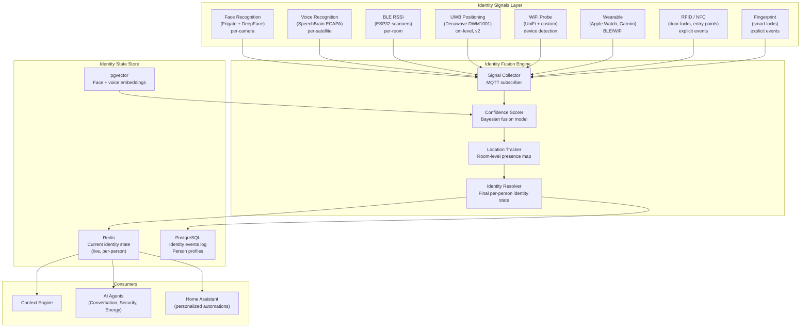
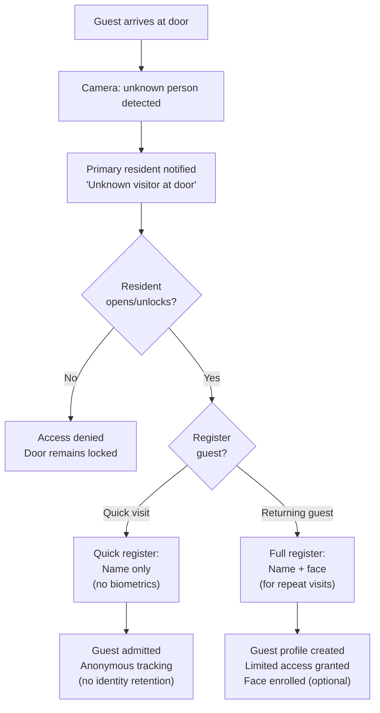
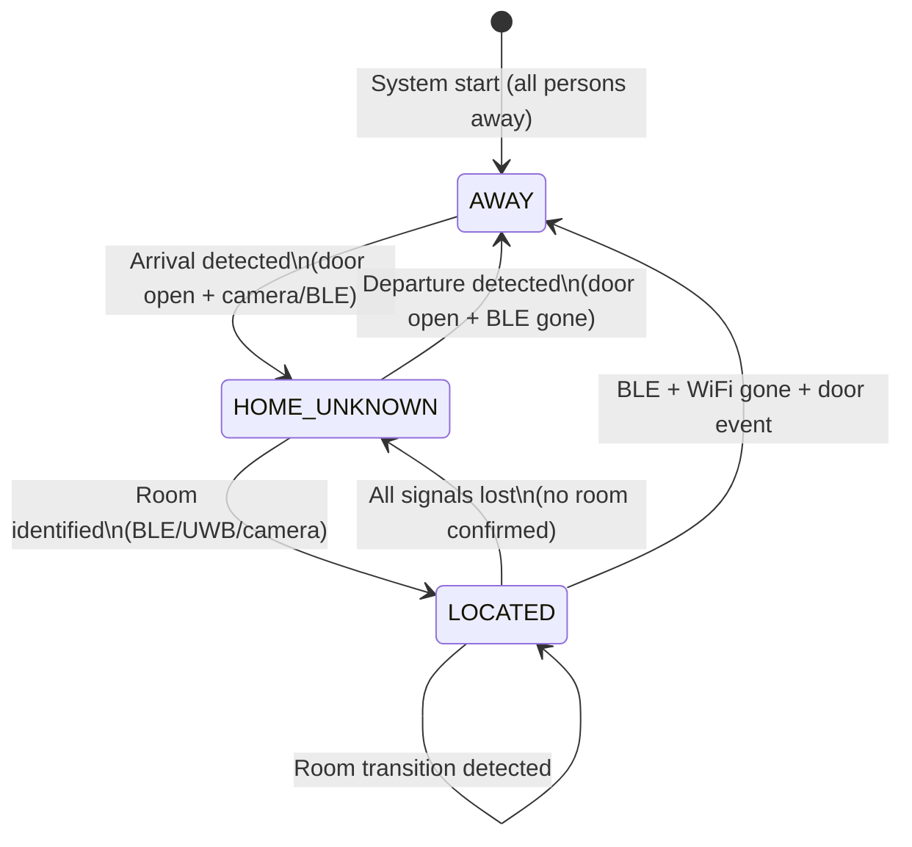

# Chapter 05 — Identity System

**AI Home OS Internal Design Specification**  
**Classification:** Internal — Engineering  
**Status:** Draft v1.0  
**Date:** 2026-07-17

---

## Table of Contents

1. [Overview](#1-overview)
2. [Design Philosophy](#2-design-philosophy)
3. [Identity Architecture](#3-identity-architecture)
4. [Identity Signals](#4-identity-signals)
5. [Multi-Modal Confidence Scoring](#5-multi-modal-confidence-scoring)
6. [Face Recognition Integration](#6-face-recognition-integration)
7. [Voice Recognition Integration](#7-voice-recognition-integration)
8. [BLE Presence & Trilateration](#8-ble-presence--trilateration)
9. [UWB Positioning](#9-uwb-positioning)
10. [WiFi Device Tracking](#10-wifi-device-tracking)
11. [Wearable Integration](#11-wearable-integration)
12. [RFID & NFC Entry Points](#12-rfid--nfc-entry-points)
13. [Fingerprint Authentication](#13-fingerprint-authentication)
14. [Person Profile System](#14-person-profile-system)
15. [Guest Handling](#15-guest-handling)
16. [Temporary Users](#16-temporary-users)
17. [Unknown Visitor Handling](#17-unknown-visitor-handling)
18. [Location Tracking & Room Presence](#18-location-tracking--room-presence)
19. [Privacy & Consent Architecture](#19-privacy--consent-architecture)
20. [Identity Database Schema](#20-identity-database-schema)
21. [Failure Modes & Redundancy](#21-failure-modes--redundancy)
22. [Design Decisions & Trade-offs](#22-design-decisions--trade-offs)
23. [Risks](#23-risks)
24. [Future Improvements](#24-future-improvements)
25. [References](#25-references)

---

## 1. Overview

The Identity System answers the most fundamental question the AI must know: **Who is here?**

Without knowing who is present, the AI cannot:
- Personalize greetings and responses
- Apply correct preferences (temperature, lighting, music)
- Make security decisions (is this person authorized to be here?)
- Deliver relevant reminders (Sadiq has a meeting at 9 AM)
- Adjust behavior based on which family members are home

The Identity System is not a single sensor or algorithm — it is a **fusion engine** that continuously combines multiple imperfect identity signals into a probabilistic confidence score for each known and unknown person in the building.

### Identity System Capabilities

| Capability | Description |
|-----------|-------------|
| **Person recognition** | Identify known occupants and registered visitors |
| **Location tracking** | Know which room each person is in, updated continuously |
| **Multi-modal fusion** | Combine face, voice, BLE, UWB, WiFi, wearable signals |
| **Confidence scoring** | Per-person confidence level: certain / probable / uncertain |
| **Guest management** | Temporary registrations with limited data retention |
| **Unknown visitor handling** | Cluster and track unrecognized individuals |
| **Privacy-preserving** | Minimum necessary data collection, user-controlled |
| **Graceful degradation** | Works with partial sensor data; acknowledges uncertainty |

---

## 2. Design Philosophy

### 2.1 Probabilistic, Not Binary

Identity is never "definitely Sadiq" or "definitely not Sadiq." It is always a probability. The system maintains confidence scores and actions taken depend on the confidence level:

```
Confidence 0.95+ → High certainty → Automatic personalization + security actions
Confidence 0.70–0.94 → Probable identity → Personalization; confirm before security actions
Confidence 0.40–0.69 → Possible identity → Ask: "Is that you, Sadiq?"
Confidence < 0.40 → Unknown → Guest/unknown person flow
```

### 2.2 Privacy by Minimum Necessity

The system collects only what is needed to answer "who is here and where." It does not:
- Track detailed movement patterns beyond room-level presence
- Store raw biometric data longer than needed
- Share identity data with any external service
- Build behavioral profiles beyond what improves personalization

### 2.3 Multiple Signals Are Better Than One

Any single identity signal can be wrong — BLE can be spoofed, faces can be obscured, voice can be misidentified in noise. The identity system gains robustness by **requiring agreement from multiple independent signals** before acting on high-confidence conclusions.

### 2.4 Identity Is Not Authentication

This distinction is critical:
- **Identity** = who is this person? (probabilistic)
- **Authentication** = has this person proven they are who they claim to be? (cryptographic)

The identity system supports security decisions through confidence scoring, but physical door unlock and sensitive data access require **authentication** — a deliberate action (fingerprint, PIN, NFC card) — not just identity recognition.

---

## 3. Identity Architecture



---

## 4. Identity Signals

### 4.1 Signal Taxonomy

| Signal | Type | Identifies Person | Identifies Location | Active/Passive | Privacy Impact |
|--------|------|------------------|--------------------|--------------------|----------------|
| Face recognition | Biometric | ★★★★★ | ★★★★ (camera zone) | Passive | High |
| Voice recognition | Biometric | ★★★★ | ★★★ (room) | Passive (on activation) | Medium |
| BLE RSSI | Device | ★★★ | ★★★ (room) | Passive | Low |
| UWB | Device | ★★★ | ★★★★★ (cm-level) | Active | Low |
| WiFi probe | Device | ★★★ | ★★ (building) | Passive | Low |
| Wearable | Device | ★★★★ (if unique) | ★★★ (room) | Passive | Low |
| RFID/NFC | Token | ★★★★ | ★★★★ (entry point) | Active (explicit) | Very low |
| Fingerprint | Biometric | ★★★★★ | ★★★★ (entry point) | Active (explicit) | Medium |
| Door contact | None (event) | ✗ | ★★ (hypothesis) | Passive | None |
| Pressure mat | None (event) | ✗ | ★★★ (specific spot) | Passive | Low |

### 4.2 Signal Update Rates

| Signal | Update Rate | Latency | Notes |
|--------|------------|---------|-------|
| Face recognition | On-detection (~1s when visible) | 500ms–2s | Only when person in camera view |
| Voice recognition | Per utterance | 1–3s | Only when person speaks |
| BLE RSSI | Every 1–3s | Near-real-time | Continuous while device present |
| UWB | 10–100Hz | <10ms | Extremely fast, always active |
| WiFi probe | Every 60s | 1–2s | Network scan interval |
| Wearable | Every 1–5s | Near-real-time | Continuous while in range |
| RFID/NFC | On event | <500ms | Explicit user action |
| Fingerprint | On event | <1s | Explicit user action |

---

## 5. Multi-Modal Confidence Scoring

### 5.1 Bayesian Fusion Model

The identity fusion engine uses a Bayesian approach to combine multiple signals. Each signal provides evidence for or against each person hypothesis.

```python
# Identity confidence fusion (pseudo-code)

from dataclasses import dataclass
from typing import Dict, List
import math

@dataclass
class IdentitySignal:
    source: str           # 'face', 'voice', 'ble', 'uwb', 'wifi', 'rfid'
    person_id: str        # who this signal says it is
    confidence: float     # 0.0–1.0 signal-level confidence
    timestamp: float      # unix timestamp
    location: str         # room or camera zone
    ttl: int              # seconds before this signal expires

class IdentityFusionEngine:
    # Signal reliability weights (tuned empirically)
    SIGNAL_WEIGHTS = {
        'rfid':        0.95,  # Very reliable (explicit action, unique token)
        'fingerprint': 0.98,  # Most reliable (biometric + deliberate)
        'face_high':   0.92,  # High-confidence face match
        'face_medium': 0.75,  # Medium-confidence face match
        'voice_high':  0.85,  # High-confidence voice match
        'voice_medium':0.65,  # Medium-confidence voice match
        'uwb':         0.88,  # UWB (device, not biometric — slightly lower)
        'ble_strong':  0.72,  # Strong BLE RSSI (close to scanner)
        'ble_weak':    0.45,  # Weak BLE RSSI (could be from adjacent room)
        'wearable':    0.80,  # Wearable (unique device, usually on person)
        'wifi':        0.40,  # WiFi (device at home, not necessarily carried)
    }

    def compute_identity_confidence(
        self,
        person_id: str,
        active_signals: List[IdentitySignal]
    ) -> float:
        """
        Compute fused confidence that active_signals match person_id.
        Uses log-odds Bayesian fusion.
        """
        # Prior: uniform (no preference before signals)
        log_odds = 0.0

        for signal in active_signals:
            if signal.is_expired():
                continue
            weight_key = self._get_weight_key(signal)
            weight = self.SIGNAL_WEIGHTS.get(weight_key, 0.5)

            if signal.person_id == person_id:
                # This signal supports this person
                log_odds += math.log(weight / (1 - weight))
            else:
                # This signal contradicts this person
                log_odds -= math.log(weight / (1 - weight)) * 0.5

        # Convert log-odds to probability
        probability = 1.0 / (1.0 + math.exp(-log_odds))
        return min(max(probability, 0.01), 0.99)

    def get_most_likely_person(
        self,
        active_signals: List[IdentitySignal],
        location: str
    ) -> IdentityResult:
        """Find the most likely person given all active signals."""
        scores = {}
        for person in self.get_all_persons():
            # Only consider signals from the same location
            location_signals = [s for s in active_signals
                                 if s.location == location or s.location == 'global']
            scores[person.id] = self.compute_identity_confidence(
                person.id, location_signals
            )

        best_person_id = max(scores, key=scores.get)
        best_confidence = scores[best_person_id]

        return IdentityResult(
            person_id=best_person_id,
            confidence=best_confidence,
            certainty=self._confidence_to_certainty(best_confidence),
            active_signals=[s.source for s in active_signals]
        )
```

### 5.2 Confidence Tiers and Actions

| Confidence | Label | AI Behavior |
|------------|-------|-------------|
| 0.95–1.00 | **Certain** | Full personalization + automatic security actions |
| 0.80–0.94 | **High** | Full personalization; confirm before door unlock |
| 0.60–0.79 | **Probable** | Limited personalization; "Is that you, [name]?" for security |
| 0.40–0.59 | **Possible** | Generic greeting; ask for confirmation |
| < 0.40 | **Unknown** | Unknown/guest flow; no personalization |

### 5.3 Signal Expiry and Decay

Signals expire and their contribution to confidence decays over time:

```python
# Signal TTL values (seconds)
SIGNAL_TTL = {
    'rfid':        300,    # RFID swipe: 5 minutes (explicit event)
    'fingerprint': 300,
    'face':        120,    # Face detection: 2 minutes (last seen)
    'voice':       300,    # Voice: 5 minutes
    'ble':         30,     # BLE RSSI: 30 seconds (must be continuously re-detected)
    'uwb':         10,     # UWB: 10 seconds (very fresh)
    'wearable':    60,     # Wearable: 1 minute
    'wifi':        300,    # WiFi probe: 5 minutes
}
```

When all signals for a person expire, their confidence drops to zero — they are considered "left" or "location unknown."

---

## 6. Face Recognition Integration

Full face recognition pipeline is defined in Chapter 3 (Vision System). The Identity System's role:

1. **Receive** face recognition events from the Vision Service via MQTT
2. **Convert** face recognition results into identity signals with confidence scores
3. **Update** the person's confidence state in the fusion engine
4. **Infer** location from which camera detected the face

```python
# Identity system — face recognition MQTT handler

def on_face_recognition_event(self, event: dict):
    camera = event['camera']
    person_id = event['identity']['person_id']
    face_confidence = event['identity']['confidence']
    certainty = event['identity']['certainty']

    # Convert face certainty to signal weight key
    if certainty == 'high':
        signal_type = 'face_high'
    else:
        signal_type = 'face_medium'

    # Infer location from camera
    location = self.camera_to_room_map.get(camera, 'unknown')

    signal = IdentitySignal(
        source='face',
        person_id=person_id,
        confidence=face_confidence,
        location=location,
        timestamp=time.time(),
        ttl=SIGNAL_TTL['face']
    )

    self.fusion_engine.add_signal(signal)
```

---

## 7. Voice Recognition Integration

Full voice recognition pipeline is defined in Chapter 4 (Audio System). The Identity System's role:

1. **Receive** speaker identification events from the STT service via MQTT
2. **Convert** speaker ID results into identity signals
3. **Update** person location (room where satellite is located)
4. **Use** voice ID to enrich context for the Conversation Agent

```python
# Identity system — voice recognition MQTT handler

def on_voice_identification_event(self, event: dict):
    satellite_id = event['satellite_id']
    person_id = event['speaker']['person_id']
    voice_confidence = event['speaker']['confidence']

    # Get room from satellite registry
    room = self.satellite_to_room_map[satellite_id]

    signal = IdentitySignal(
        source='voice',
        person_id=person_id,
        confidence=voice_confidence,
        location=room,
        timestamp=time.time(),
        ttl=SIGNAL_TTL['voice']
    )
    self.fusion_engine.add_signal(signal)
```

---

## 8. BLE Presence & Trilateration

### 8.1 How BLE Trilateration Works

Each BLE scanning node (ESP32 in each room) continuously reports the RSSI (signal strength) of all detected BLE devices. By comparing RSSI values across multiple scanners, the system estimates which room contains the device.

```
Scanner positions (example):
  Living Room scanner at (0, 0)
  Kitchen scanner at (8, 0)
  Hallway scanner at (4, 5)

Phone RSSI readings:
  Living Room: -55 dBm (strong — close)
  Kitchen: -75 dBm (weaker — farther)
  Hallway: -70 dBm (medium)

→ Trilateration estimate: (2, 1) → Living Room
```

### 8.2 RSSI-to-Distance Conversion

```python
# Path loss model for BLE RSSI to distance

def rssi_to_distance_meters(rssi: float, tx_power: float = -59) -> float:
    """
    Convert BLE RSSI to estimated distance using log-distance path loss model.
    
    tx_power: Measured RSSI at 1 meter (device-specific, typically -59 to -65 dBm)
    path_loss_exponent: 2.0 = free space, 3.0 = indoor
    """
    n = 2.5  # Indoor path loss exponent (2.0–4.0 depending on environment)
    distance = 10 ** ((tx_power - rssi) / (10 * n))
    return distance
```

### 8.3 Room-Level Presence Without Trilateration

For simpler deployments (single BLE scanner per room), room-level presence is determined by finding the scanner with the **strongest RSSI** for the device:

```python
def estimate_room_from_rssi(device_mac: str, rssi_readings: Dict[str, int]) -> str:
    """Simplest approach: person is in the room with strongest signal."""
    if not rssi_readings:
        return "unknown"

    # Filter out very weak signals (device might be adjacent room)
    MIN_RSSI = -85  # dBm — below this, too uncertain
    valid_readings = {room: rssi for room, rssi in rssi_readings.items()
                      if rssi > MIN_RSSI}

    if not valid_readings:
        return "away"  # All signals too weak = device not home

    return max(valid_readings, key=valid_readings.get)
```

### 8.4 BLE Device Registry

All tracked BLE devices must be registered with their owner:

```yaml
# BLE device registry (config)
ble_devices:
  - mac: "AA:BB:CC:DD:EE:FF"
    person_id: "sadiq"
    device_type: "phone"
    device_name: "Sadiq's iPhone"
    tx_power: -59  # calibrated at 1m

  - mac: "11:22:33:44:55:66"
    person_id: "sadiq"
    device_type: "watch"
    device_name: "Sadiq's Apple Watch"
    tx_power: -62

  - mac: "AA:BB:CC:11:22:33"
    person_id: "fatima"
    device_type: "phone"
    device_name: "Fatima's iPhone"
    tx_power: -60
```

**MAC address randomization (iOS/Android):**

Modern smartphones randomize their BLE MAC address to prevent tracking. AI Home OS handles this by:
1. Requiring explicit BLE beacon registration (dedicated beacon, not phone)
2. Using **companion app** that provides a stable identifier (UUID) even with random MAC
3. Using **Apple HomeKit** integration (which uses UUIDs, not MACs)
4. Deploying dedicated **BLE beacon tags** (Tile, Apple AirTag in passive mode, Chipolo)

**Recommended approach:** Deploy the AI Home OS companion mobile app which advertises a stable UUID over BLE for room-level tracking, even on iOS 14+ with randomized MACs.

### 8.5 Dedicated BLE Beacons

For household members who don't want to install the app (elderly relatives, young children):

| Beacon | Battery Life | Range | Cost | Notes |
|--------|-------------|-------|------|-------|
| **Tile Mate** | 1 year | 30m | $25 | Keychain form factor |
| **Chipolo One** | 2 years | 60m | $25 | Loud speaker for finding |
| **Apple AirTag** | 1 year | 10m local | $29 | Ecosystem-tied |
| **Nordic Thingy:52** (DIY) | 6 months | 30m | $40 | Programmable, custom UUID |
| **Kontakt.io S18-3** | 3 years | 30m | $15 | Industrial beacon, configurable |

---

## 9. UWB Positioning

### 9.1 Why UWB for Identity

UWB (Ultra-Wideband) provides centimeter-level positioning accuracy indoors — something BLE RSSI cannot reliably achieve. UWB uses time-of-flight measurements between anchors and tags to compute precise 3D coordinates.

**UWB advantages over BLE:**

| Factor | BLE RSSI | UWB |
|--------|---------|-----|
| Accuracy | ±1–3 meters | ±10–30 cm |
| Multipath resistance | Low | High |
| Update rate | 1–5 Hz | 10–100 Hz |
| Range | 30m | 50m |
| Power (tag) | Very low | Low |
| Cost | $5–30 | $30–100 |

### 9.2 UWB Infrastructure (v2 Feature)

**Architecture:**

```
UWB Anchor placement (4-anchor minimum for 3D):

[Anchor 1]                [Anchor 2]
Living Room ceiling       Kitchen ceiling
(0, 0, 2.5)              (8, 0, 2.5)

                [Anchor 3]
                Hallway
                (4, 4, 2.5)

[Anchor 4]
Study
(0, 8, 2.5)

UWB Tag (person carries):
  Tag reports distance to all 4 anchors
  TDOA (Time Difference of Arrival) used to compute 3D position
  Position published to MQTT every 100ms
```

**Hardware:**

| Component | Model | Cost |
|-----------|-------|------|
| UWB Anchor | Qorvo MDEK1001 DWM1001-DEV | $35/unit |
| UWB Tag (wearable) | Qorvo DWM1001C + Li-poly battery | $30 |
| Software | RTLS Toolkit (Qorvo) + custom Python positioning | Free |

### 9.3 UWB Integration with Identity System

```python
# UWB position → room mapping

def uwb_position_to_room(x: float, y: float, z: float) -> str:
    """Map 3D UWB coordinates to room name."""
    # Room boundaries defined during installation calibration
    for room, bounds in ROOM_BOUNDARIES.items():
        if (bounds['x_min'] <= x <= bounds['x_max'] and
            bounds['y_min'] <= y <= bounds['y_max'] and
            bounds['z_min'] <= z <= bounds['z_max']):
            return room
    return "hallway"  # default if between room boundaries

def on_uwb_event(self, event: dict):
    tag_id = event['tag_id']
    person_id = self.uwb_tag_registry.get(tag_id)

    if not person_id:
        return  # Unregistered tag

    room = uwb_position_to_room(event['x'], event['y'], event['z'])

    signal = IdentitySignal(
        source='uwb',
        person_id=person_id,
        confidence=0.88,
        location=room,
        timestamp=time.time(),
        ttl=SIGNAL_TTL['uwb']
    )
    self.fusion_engine.add_signal(signal)
```

---

## 10. WiFi Device Tracking

### 10.1 Home/Away Detection

The simplest and most reliable identity signal for **home vs. away** detection is WiFi: if a person's phone is connected to the home WiFi, they are likely home.

**Implementation options:**

| Method | Reliability | Privacy | Notes |
|--------|-------------|---------|-------|
| **Router DHCP lease** | High | Internal | Check active DHCP leases for registered MAC addresses |
| **UniFi client API** | High | Internal | UniFi exposes connected clients per AP with signal strength |
| **Ping / nmap scan** | Medium | Internal | Ping phone IP; phones sleep and stop responding |
| **Home Assistant device tracker** | High | Internal | HA has built-in WiFi device tracking integration |
| **Companion app (local API)** | Very high | Internal | App actively reports home/away |

**UniFi Network API integration:**

```python
# UniFi client tracker (pseudo-code)

import httpx

class UniFiTracker:
    BASE_URL = "https://192.168.20.1:8443"  # UniFi controller

    async def get_active_clients(self) -> List[UniFiClient]:
        async with httpx.AsyncClient(verify=False) as client:
            resp = await client.get(
                f"{self.BASE_URL}/api/s/default/stat/sta",
                headers={"Cookie": self.session_cookie}
            )
            return [UniFiClient(**c) for c in resp.json()['data']]

    async def is_device_home(self, mac: str) -> bool:
        clients = await self.get_active_clients()
        return any(c.mac == mac.lower() for c in clients)
```

### 10.2 Location Granularity from WiFi

WiFi can provide **AP-level** location granularity — which access point is the phone associated with:

```
AP associations → room inference:

  Phone connected to: AP-Main-Floor → on ground floor
  Phone connected to: AP-Upper-Floor → on upper floor
  Phone connected to: AP-Outdoor → in garden or garage area

This is coarser than BLE trilateration but useful when BLE is unavailable.
```

---

## 11. Wearable Integration

### 11.1 Supported Wearables

| Device | Protocol | Data Available | Integration |
|--------|----------|---------------|-------------|
| **Apple Watch** | BLE + WiFi | BLE beacon, heart rate (via HealthKit API) | BLE scanner + companion app |
| **Garmin** | BLE + WiFi | BLE beacon, activity, heart rate | BLE scanner |
| **Fitbit** | BLE + WiFi | BLE beacon, sleep, activity | BLE scanner + Fitbit API (cloud) |
| **Samsung Galaxy Watch** | BLE + WiFi | BLE beacon | BLE scanner |
| **Oura Ring** | BLE | Sleep, readiness, activity | Oura API (cloud) or BLE scanner |
| **Emfit QS** | WiFi (bed sensor) | Sleep stages, HR | ESPHome WiFi + MQTT |

Wearables serve two identity purposes:
1. **BLE beacon**: The wearable's BLE advertisement helps locate the person
2. **Health data source**: Heart rate, sleep quality, and activity data enriches the health context for the AI

### 11.2 Health Data Integration (Privacy-Sensitive)

Health data from wearables is stored in the Memory System (Chapter 6) under strict access control:
- Only the Health Agent and the person themselves can access it
- It is used for: morning briefing customization, proactive health suggestions, anomaly detection ("Your heart rate has been elevated for 3 hours — unusual for you")
- It is never shared with any other agent without explicit user consent

---

## 12. RFID & NFC Entry Points

### 12.1 Purpose

RFID and NFC provide **explicit, deliberate** identity events at entry points. Unlike passive presence detection, RFID requires the person to actively swipe a card or key fob — making it a reliable authentication signal (not just identity).

### 12.2 Hardware

| Device | Protocol | Form Factor | Cost |
|--------|----------|-------------|------|
| **Aqara Smart Lock U100** | Zigbee + NFC | Door lock | $200 |
| **Yale Assure Lock 2** | Z-Wave + NFC | Door lock | $220 |
| **MFRC522 reader + ESP32** | SPI + WiFi | Custom reader | $8 |
| **ACR122U** | USB (NFC) | Desktop reader | $30 |
| **Paxton Net2** | Wiegand | Professional | $150+ |

### 12.3 Card / Fob Registry

```sql
CREATE TABLE access_credentials (
    id              UUID PRIMARY KEY DEFAULT gen_random_uuid(),
    person_id       UUID REFERENCES persons(id),
    credential_type VARCHAR(20),    -- 'nfc_card', 'rfid_fob', 'pin', 'fingerprint'
    credential_id   TEXT NOT NULL,  -- NFC UID (hex), or hash of PIN
    reader_id       UUID,           -- Which reader this credential is valid for
    access_level    VARCHAR(20),    -- 'full', 'limited', 'single_use'
    valid_from      TIMESTAMPTZ,
    valid_until     TIMESTAMPTZ,    -- NULL = no expiry
    is_active       BOOLEAN DEFAULT TRUE,
    notes           TEXT
);
```

### 12.4 RFID Identity Event

When a card or fob is presented:

```python
# RFID identity event handler

def on_rfid_event(self, event: dict):
    uid = event['uid']           # NFC card UID
    reader_id = event['reader']  # Which reader (e.g., front_door_lock)

    credential = db.lookup_credential(uid=uid, reader_id=reader_id)

    if credential and credential.is_active and credential.is_valid_now():
        person_id = credential.person_id
        location = self.reader_to_room_map[reader_id]

        signal = IdentitySignal(
            source='rfid',
            person_id=person_id,
            confidence=0.95,  # RFID is highly reliable
            location=location,
            timestamp=time.time(),
            ttl=SIGNAL_TTL['rfid']
        )
        self.fusion_engine.add_signal(signal)
        self.access_control.log_access(person_id, reader_id, granted=True)

    else:
        self.access_control.log_access(None, reader_id, granted=False)
        self.security_agent.alert_denied_access(uid=uid, reader_id=reader_id)
```

---

## 13. Fingerprint Authentication

### 13.1 Role in Identity System

Fingerprint authentication provides the **highest-confidence** biometric identity event available at entry points. It is used for:
- Front door lock authentication (replacing or supplementing key fob)
- Safe or sensitive storage access
- Override of restricted automations (e.g., disable alarm system)

### 13.2 Hardware

| Device | Fingerprint Type | Protocol | Cost |
|--------|-----------------|----------|------|
| **Aqara Smart Lock U200** | Optical + NFC + PIN | Zigbee | $250 |
| **Yale Assure Lock 2** | Capacitive + NFC | Z-Wave | $220 |
| **Schlage Encode Plus** | Capacitive | WiFi + Matter | $280 |
| **R503 sensor + ESP32** | Capacitive (optical UART) | ESPHome UART | $12 |

### 13.3 Fingerprint Template Storage

Fingerprint templates are stored on the **lock device itself** — never on the AI server. The AI server only receives an anonymous match/no-match event with a user slot number. This is a critical privacy protection.

```
Lock authenticates fingerprint locally:
  → Match: publishes {event: "fingerprint_auth", slot: 3, status: "granted"}
  → Slot 3 is mapped to person_id in AI Home OS registry

AI Home OS never receives raw fingerprint data.
```

---

## 14. Person Profile System

### 14.1 Person Profile Structure

Each known person has a comprehensive profile that drives AI personalization:

```python
@dataclass
class PersonProfile:
    # Identity
    id: str                     # UUID
    display_name: str           # "Sadiq"
    role: str                   # 'primary_resident', 'resident', 'visitor', 'caretaker'

    # Biometrics (references, not raw data)
    face_profile_id: Optional[str]    # References face_profiles table
    voice_profile_id: Optional[str]   # References voice_profiles table

    # Devices
    ble_devices: List[BLEDevice]      # Registered phones, watches, beacons
    wifi_devices: List[WiFiDevice]    # Registered device MACs

    # Preferences
    temperature_preference: float     # °C preferred temperature
    lighting_preference: str          # 'warm', 'cool', 'neutral'
    language: str                     # Primary language
    wake_time: time                   # Typical wake time
    sleep_time: time                  # Typical sleep time
    music_preference: Dict            # Genres, artists, playlists per context

    # Schedule
    calendar_url: Optional[str]       # iCal URL (read-only)
    work_start_time: time
    work_end_time: time
    work_days: List[int]              # 0=Mon, 6=Sun

    # Health
    health_data_consent: bool         # User consented to health tracking
    wearable_ids: List[str]

    # Access
    access_level: str                 # 'admin', 'resident', 'limited'
    can_unlock_doors: bool
    can_arm_disarm_security: bool
    can_modify_automations: bool

    # Privacy
    face_recognition_enabled: bool    # User can opt out
    voice_recognition_enabled: bool
    location_tracking_enabled: bool

    # Metadata
    created_at: datetime
    last_seen: Optional[datetime]
    last_seen_room: Optional[str]
```

### 14.2 Preference Learning

The AI Home OS learns and refines preferences over time without explicit user input:

```python
# Preference learning system (pseudo-code)

class PreferenceLearner:
    """
    Observe patterns and update person preferences automatically.
    """
    def observe_manual_override(self, person_id: str, override: AutomationOverride):
        """When a person manually changes something the AI did automatically,
        learn from it."""
        if override.type == 'temperature':
            # Person changed temp from AI setpoint
            delta = override.new_value - override.ai_setpoint
            context = {
                'time': override.time,
                'weather': override.weather_context,
                'activity': override.detected_activity,
            }
            self.update_temperature_model(person_id, delta, context)

    def observe_accepted_suggestion(self, person_id: str, suggestion_id: str):
        """When a person accepts an AI suggestion, reinforce that pattern."""
        suggestion = db.get_suggestion(suggestion_id)
        self.reinforce_pattern(person_id, suggestion.context, suggestion.action)

    def observe_dismissed_suggestion(self, person_id: str, suggestion_id: str):
        """When a person dismisses a suggestion, weaken that pattern."""
        suggestion = db.get_suggestion(suggestion_id)
        self.weaken_pattern(person_id, suggestion.context, suggestion.action)
```

---

## 15. Guest Handling

### 15.1 Guest Registration Flow

When a guest arrives:



### 15.2 Guest Access Levels

| Level | Access |
|-------|--------|
| **Anonymous guest** | None — visitor leaves area; no AI personalization |
| **Named guest** | Basic greetings; no door access; no sensitive commands |
| **Trusted visitor** | Named + face/voice enrolled; can control some devices; temporary |
| **Caretaker** | Full access except security and admin commands |

### 15.3 Guest Data Retention

| Data Type | Retention |
|-----------|-----------|
| Name | Until explicitly deleted by host |
| Face enrollment | Deleted 48 hours after last visit (configurable) |
| Voice enrollment | Deleted 48 hours after last visit |
| Visit log (dates/times) | 30 days (configurable) |
| Camera recordings (guest visible) | Deleted within 7 days (GDPR-aligned) |
| Conversation logs | Not stored for anonymous guests |

---

## 16. Temporary Users

Temporary users are given time-limited access credentials — useful for:
- Airbnb / short-term rental guests
- Housekeeping staff
- Contractors / maintenance workers
- Pet sitters during vacation

### 16.1 Temporary Access Credential Generation

```python
# Temporary access credential (pseudo-code)

def create_temporary_access(
    name: str,
    access_level: str,
    valid_from: datetime,
    valid_until: datetime,
    access_points: List[str],  # Which doors/areas
    notes: str = ""
) -> TemporaryCredential:
    # Generate unique 6-digit PIN
    pin = generate_secure_pin(length=6)

    # Generate NFC token (if physical token provided)
    nfc_uid = generate_nfc_uid()

    credential = db.create_credential(
        person_id=None,           # No permanent profile
        credential_type='temp_pin',
        credential_value=hash_pin(pin),
        access_level=access_level,
        valid_from=valid_from,
        valid_until=valid_until,
        access_points=access_points,
        auto_delete_at=valid_until + timedelta(hours=1)
    )

    # Send credential to guest (WhatsApp, SMS, email)
    notification_service.send(
        to=guest_contact,
        message=f"Your access code for {property_name}: {pin}\n"
                f"Valid: {valid_from.strftime('%d %b %H:%M')} to "
                f"{valid_until.strftime('%d %b %H:%M')}"
    )

    return credential
```

### 16.2 Temporary User Restrictions

Temporary users cannot:
- Access security camera feeds
- Modify automations
- Arm/disarm the security system
- Access health data of permanent residents
- Create new users or credentials

---

## 17. Unknown Visitor Handling

### 17.1 The Unknown Person Problem

Not every person who appears at the home is registered. The system must handle:
- First-time delivery persons
- Strangers at the gate
- New neighbors
- Unexpected visitors

### 17.2 Unknown Person Clustering

When an unrecognized face appears multiple times, the system clusters these appearances to detect patterns:

```python
# Unknown person tracker (pseudo-code)

class UnknownPersonTracker:
    CLUSTER_THRESHOLD = 0.35  # Face embedding distance for clustering

    def process_unknown_face(self, embedding: np.ndarray, camera: str, timestamp: datetime):
        # Find existing unknown cluster with similar embedding
        matching_cluster = None

        for cluster in self.unknown_clusters:
            distance = cosine_distance(embedding, cluster.centroid)
            if distance < self.CLUSTER_THRESHOLD:
                matching_cluster = cluster
                break

        if matching_cluster:
            matching_cluster.add_sighting(embedding, camera, timestamp)
            # If seen 3+ times in 7 days → notify resident
            if matching_cluster.sighting_count >= 3:
                self.notify_frequent_unknown(matching_cluster)
        else:
            # New unknown cluster
            new_cluster = UnknownCluster(
                id=f"unknown_{uuid4().hex[:6]}",
                centroid=embedding,
                first_seen=timestamp,
                sightings=[(camera, timestamp)]
            )
            self.unknown_clusters.append(new_cluster)
```

### 17.3 Unknown Visitor Notification

```
Notification to resident:
  Title: "Frequent unknown visitor"
  Body: "Someone has visited your property 3 times this week.
         [View photos] [Add to contacts] [Block and alert]"
  Attachment: Best-quality snapshot from each visit
```

---

## 18. Location Tracking & Room Presence

### 18.1 The Presence State Machine

Each person's location state is tracked as a state machine:



### 18.2 Room Transition Logic

```python
# Room transition handler (pseudo-code)

class LocationTracker:
    TRANSITION_CONFIDENCE_THRESHOLD = 0.65

    def update_person_location(self, person_id: str, new_signals: List[IdentitySignal]):
        current_location = self.get_current_location(person_id)

        # Determine most likely room from all current signals
        room_confidence = {}
        for room in self.rooms:
            room_signals = [s for s in new_signals if s.location == room]
            confidence = self.fusion_engine.compute_room_confidence(person_id, room_signals)
            room_confidence[room] = confidence

        best_room = max(room_confidence, key=room_confidence.get)
        best_confidence = room_confidence[best_room]

        if best_confidence >= self.TRANSITION_CONFIDENCE_THRESHOLD:
            if best_room != current_location:
                # Room transition confirmed
                self.emit_transition_event(person_id, current_location, best_room)
                self.update_location(person_id, best_room)
                redis.set(
                    f"identity:location:{person_id}",
                    json.dumps({"room": best_room, "confidence": best_confidence}),
                    ex=60  # Expire if not refreshed
                )

    def emit_transition_event(self, person_id: str, from_room: str, to_room: str):
        mqtt.publish(
            f"homeios/identity/{person_id}/location",
            json.dumps({
                "person_id": person_id,
                "from_room": from_room,
                "to_room": to_room,
                "timestamp": datetime.utcnow().isoformat()
            })
        )
```

### 18.3 Away Detection

Away detection (all residents have left the home) is one of the most important identity states — it triggers:
- Security mode activation
- Energy saving mode (HVAC setback, non-essential devices off)
- Irrigation scheduling
- "Nobody home" state for automations

```python
def check_all_away(self):
    """Check if all registered residents have left."""
    for person in self.registered_residents:
        if self.get_person_state(person.id) != 'away':
            return False

    # All residents are away
    self.emit_all_away_event()
    return True

def confirm_all_away(self):
    """
    All-away requires multi-signal confirmation to avoid false positives:
    1. BLE: all registered devices gone from WiFi
    2. Door event: at least one departure in last 30 minutes
    3. mmWave: all rooms reading no presence for 10+ minutes
    """
    ble_away = all(not self.is_device_home(d.mac) for r in self.residents for d in r.ble_devices)
    recent_departure = self.was_recent_departure(minutes=30)
    mmwave_clear = all(not self.is_room_occupied(r) for r in self.rooms)

    if ble_away and recent_departure and mmwave_clear:
        return True
    return False
```

---

## 19. Privacy & Consent Architecture

### 19.1 Per-Person Privacy Settings

Each person controls what identity signals are used for them:

| Setting | Default | Can Disable |
|---------|---------|-------------|
| Face recognition | On | Yes — face is blurred in all recordings |
| Voice recognition | On | Yes — speaker ID not performed |
| BLE tracking | On | Yes — device removed from registry |
| Location tracking | On | Yes — location not stored or published |
| Health data collection | Off | Must explicitly enable |
| Preference learning | On | Yes — AI uses only defaults |

### 19.2 Right to Forget

Any registered person can request complete deletion of their identity data:

```python
def delete_person_data(self, person_id: str, requester_id: str):
    """GDPR-compliant deletion of all person data."""
    # Only primary admin or the person themselves can delete
    if requester_id != person_id and not is_admin(requester_id):
        raise PermissionError("Unauthorized deletion request")

    # Delete biometric data
    db.delete_face_profiles(person_id)
    db.delete_voice_profiles(person_id)
    db.delete_face_samples(person_id)

    # Delete credentials
    db.delete_credentials(person_id)

    # Delete BLE/WiFi device registrations
    db.delete_ble_devices(person_id)

    # Delete location history
    db.delete_location_events(person_id)

    # Delete preference data
    db.delete_preferences(person_id)

    # Delete person profile
    db.delete_person(person_id)

    # Clear from Redis
    redis.delete(f"identity:location:{person_id}")
    redis.delete(f"identity:confidence:{person_id}:*")

    # Log the deletion (without personal data)
    audit_log.record(f"Person data deleted: {hash(person_id)}", requester=requester_id)
```

### 19.3 Audit Logging

All identity events are logged for accountability:

```sql
CREATE TABLE identity_audit_log (
    id          UUID PRIMARY KEY DEFAULT gen_random_uuid(),
    event_type  VARCHAR(50) NOT NULL,  -- 'face_recognized', 'door_unlocked', 'location_updated'
    person_id   UUID,
    signal_type VARCHAR(30),
    confidence  FLOAT,
    location    VARCHAR(50),
    action_taken TEXT,
    timestamp   TIMESTAMPTZ DEFAULT now()
);

-- Retention: 90 days, then auto-deleted
```

---

## 20. Identity Database Schema

### 20.1 Core Tables

```sql
-- Persons table
CREATE TABLE persons (
    id              UUID PRIMARY KEY DEFAULT gen_random_uuid(),
    display_name    VARCHAR(100) NOT NULL,
    role            VARCHAR(30) DEFAULT 'resident',
    access_level    VARCHAR(20) DEFAULT 'resident',
    language        VARCHAR(10) DEFAULT 'en',
    created_at      TIMESTAMPTZ DEFAULT now(),
    last_seen       TIMESTAMPTZ,
    last_seen_room  VARCHAR(50),
    is_active       BOOLEAN DEFAULT TRUE
);

-- Person preferences
CREATE TABLE person_preferences (
    person_id           UUID REFERENCES persons(id) ON DELETE CASCADE,
    preference_key      VARCHAR(100) NOT NULL,
    preference_value    JSONB,
    confidence          FLOAT DEFAULT 1.0,  -- How confident we are in this preference
    source              VARCHAR(20),         -- 'explicit', 'learned', 'default'
    updated_at          TIMESTAMPTZ DEFAULT now(),
    PRIMARY KEY (person_id, preference_key)
);

-- BLE device registry
CREATE TABLE ble_devices (
    id              UUID PRIMARY KEY DEFAULT gen_random_uuid(),
    person_id       UUID REFERENCES persons(id),
    mac_address     VARCHAR(17),    -- NULL if using UUID-based tracking
    beacon_uuid     UUID,           -- For UUID-based BLE tracking
    device_type     VARCHAR(30),    -- 'phone', 'watch', 'beacon', 'wearable'
    device_name     VARCHAR(100),
    tx_power        SMALLINT DEFAULT -59,
    is_active       BOOLEAN DEFAULT TRUE
);

-- Location events (time-series)
CREATE TABLE location_events (
    time            TIMESTAMPTZ NOT NULL,
    person_id       UUID NOT NULL,
    room            VARCHAR(50) NOT NULL,
    confidence      FLOAT,
    source          VARCHAR(30),    -- 'ble', 'face', 'uwb', 'voice', 'fused'
    PRIMARY KEY (time, person_id)
);

SELECT create_hypertable('location_events', 'time',
    chunk_time_interval => INTERVAL '1 day');

-- Daily location summaries (continuous aggregate)
CREATE MATERIALIZED VIEW location_daily_summary
WITH (timescaledb.continuous) AS
SELECT
    time_bucket('1 day', time) AS day,
    person_id,
    room,
    COUNT(*) AS presence_count,
    AVG(confidence) AS avg_confidence
FROM location_events
GROUP BY 1, person_id, room;
```

---

## 21. Failure Modes & Redundancy

| Failure | Impact | Detection | Recovery |
|---------|--------|-----------|---------|
| Face recognition service crash | No visual identity | Docker restart | Fall back to BLE + voice only; reduced confidence |
| All BLE scanners offline (switch failure) | No passive presence | MQTT offline events | mmWave + door contacts + WiFi still provide home/away |
| Voice recognition unavailable | No speaker ID | Docker restart | Text-based interaction (wall panel) |
| Identity fusion engine crash | No identity state | Docker restart | Redis retains last known state; HA uses cached presence |
| WiFi device tracker fails | No device-level home/away | Health check | BLE + door events fill gap |
| Redis cache failure | No live identity state | Docker restart | Rebuild from MQTT signals on restart |

---

## 22. Design Decisions & Trade-offs

### 22.1 Biometric vs. Non-Biometric Tracking

| Approach | Privacy | Reliability | Cost |
|----------|---------|-------------|------|
| Full biometric (face + voice) | Lower | High | Medium (software) |
| Device-only (BLE/WiFi/UWB) | High | Medium (device != person) | Medium (hardware) |
| **Hybrid (this design)** | Balanced | Highest | Both |

**Decision:** Hybrid approach. Biometrics provide high-confidence identity; device tracking provides continuous location. Together they complement each other and each can be individually disabled by user preference.

### 22.2 Room-Level vs. Cm-Level Presence

| Granularity | Technology | Cost | AI Use |
|------------|-----------|------|--------|
| Room-level | BLE RSSI | Low | Sufficient for 95% of use cases |
| cm-level | UWB | Medium | Required for robotics, precise speaker follow |

**Decision:** Room-level (BLE) for v1. UWB anchors as an upgrade path in v2.

---

## 23. Risks

| Risk | Probability | Impact | Mitigation |
|------|-------------|--------|------------|
| False identity match → wrong personalization | Medium | Low | Confidence thresholds; biometric confirmation for high-stakes |
| Biometric data breach | Low | Very High | Encrypted storage; embeddings only (not raw images); access control |
| BLE spoofing (attacker replicates beacon MAC) | Low | Medium | Biometric confirmation required for security actions; BLE-only insufficient for access control |
| Twin/lookalike person confusion | Very Low | Low | Multi-modal fusion; voice + face required for high confidence |
| Child's phone triggering parent's identity | Low | Low | Per-device registration; child profiles separate |
| Tracking without consent (domestic abuse concern) | Low | Very High | Clear consent UI; user can check what signals are active; hard mute |

---

## 24. Future Improvements

| Improvement | Version | Description |
|-------------|---------|-------------|
| Gait recognition | v2 | Identify person by walking pattern via mmWave radar |
| Continuous authentication | v2 | Re-verify identity continuously during sensitive sessions |
| Federated identity (multi-property) | v3 | Same identity profile works across multiple AI Home OS installations |
| Emotion state detection | v2 | Detect person is stressed/tired and adapt AI behavior |
| Child safety profiles | v2 | Age-appropriate AI interaction, parental controls |
| Visitor pre-authorization | v2 | Share access QR code before visitor arrives |

---

## 25. References

1. **SpeechBrain ECAPA-TDNN** — Desplanques et al., 2020 — https://arxiv.org/abs/2005.07143
2. **ArcFace Speaker Recognition** — Deng et al., 2019 — https://arxiv.org/abs/1801.07698
3. **BLE Indoor Positioning Survey** — Zafari et al., 2019 — https://arxiv.org/abs/1811.11543
4. **UWB Indoor Positioning** — Decawave Application Note (Qorvo) — https://www.qorvo.com/
5. **pgvector** — https://github.com/pgvector/pgvector
6. **GDPR Article 4 — Personal Data Definition** — https://gdpr-info.eu/art-4-gdpr/
7. **GDPR Article 9 — Biometric Data** — https://gdpr-info.eu/art-9-gdpr/
8. **GDPR Article 17 — Right to Erasure** — https://gdpr-info.eu/art-17-gdpr/
9. **Home Assistant Device Tracker** — https://www.home-assistant.io/integrations/device_tracker/
10. **UniFi Network API** — https://ubntwiki.com/products/software/unifi-controller/api
11. **Apple Core Bluetooth Framework** — https://developer.apple.com/documentation/corebluetooth
12. **Bluetooth SIG — RSSI Guidelines** — https://www.bluetooth.com/
13. **Qorvo MDEK1001 DWM1001** — https://www.qorvo.com/products/p/DWM1001C

---

*Previous: [Chapter 04 — Audio System](Chapter-04.md)*  
*Next: [Chapter 06 — Memory System](Chapter-06.md)*

---

> **Document maintained by:** AI Home OS Architecture Team  
> **Last updated:** 2026-07-17  
> **Chapter status:** Draft v1.0 — Open for community review
