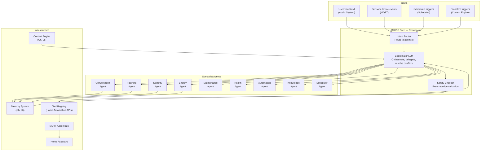
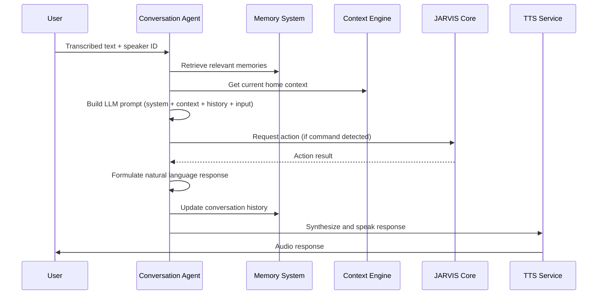
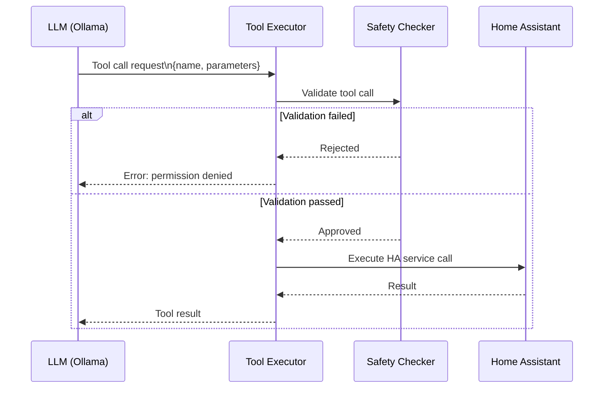

# Chapter 07 — AI Reasoning Engine

**AI Home OS Internal Design Specification**  
**Classification:** Internal — Engineering  
**Status:** Draft v1.0  
**Date:** 2026-07-17

---

## Table of Contents

1. [Overview](#1-overview)
2. [Design Philosophy](#2-design-philosophy)
3. [Multi-Agent Architecture](#3-multi-agent-architecture)
4. [Agent Roster](#4-agent-roster)
5. [JARVIS Core — Coordinator Agent](#5-jarvis-core--coordinator-agent)
6. [Conversation Agent](#6-conversation-agent)
7. [Planning Agent](#7-planning-agent)
8. [Security Agent](#8-security-agent)
9. [Energy Agent](#9-energy-agent)
10. [Maintenance Agent](#10-maintenance-agent)
11. [Health Agent](#11-health-agent)
12. [Automation Agent](#12-automation-agent)
13. [Knowledge Agent](#13-knowledge-agent)
14. [Scheduler Agent](#14-scheduler-agent)
15. [Supervisor Agent](#15-supervisor-agent)
16. [Inter-Agent Communication](#16-inter-agent-communication)
17. [LLM Integration](#17-llm-integration)
18. [Tool Use (Function Calling)](#18-tool-use-function-calling)
19. [Reasoning Loop](#19-reasoning-loop)
20. [LLM Model Selection & Routing](#20-llm-model-selection--routing)
21. [Prompt Architecture](#21-prompt-architecture)
22. [Agent Safety & Guardrails](#22-agent-safety--guardrails)
23. [Observability & Debugging](#23-observability--debugging)
24. [Design Decisions & Trade-offs](#24-design-decisions--trade-offs)
25. [Risks](#25-risks)
26. [Future Improvements](#26-future-improvements)
27. [References](#27-references)

---

## 1. Overview

The AI Reasoning Engine is the **cognitive core** of AI Home OS — the layer that transforms raw sensor data, memory, and user intent into intelligent action. It is implemented as a **multi-agent system**: a coordinated collection of specialized AI agents, each with a defined domain, a set of tools, and access to the shared memory and context layer.

This design is modeled on the JARVIS architecture from Iron Man — not a single omniscient AI, but an orchestrated team of specialist intelligences under a central coordinator that handles delegation, conflict resolution, and final decision authority.

### What the Reasoning Engine Does

| Function | Description |
|----------|-------------|
| **Natural language understanding** | Parse user intent from conversation and voice |
| **Context-aware reasoning** | Combine sensor state, memory, identity, and context |
| **Multi-step planning** | Break complex requests into executable steps |
| **Tool use** | Call APIs, control devices, query databases |
| **Proactive intelligence** | Act without being asked when the situation warrants |
| **Conflict resolution** | Handle competing agent recommendations |
| **Safety enforcement** | Block dangerous or unauthorized actions |
| **Explanation** | Articulate why a decision was made |

---

## 2. Design Philosophy

### 2.1 Specialization Over Generalization

A single general-purpose LLM asked to handle everything — security analysis, energy optimization, health monitoring, conversation — will be mediocre at each. The multi-agent design gives each domain a **focused agent** with a domain-specific system prompt, memory context, and tool set.

The cost is coordination complexity. This is solved by the JARVIS Core coordinator.

### 2.2 The LLM Is a Reasoning Layer, Not a Control Plane

The LLM does not directly execute commands. It reasons about what should happen, outputs structured decisions, and the **Action Bus** (MQTT) executes those decisions through Home Assistant. This separation means:
- LLM bugs cannot directly break hardware
- Commands are validated before execution
- Actions are reversible (the LLM can issue an "undo")
- Human override is always possible

### 2.3 Fail-Safe Defaults

Every agent is designed around the principle that failing to act is safer than acting incorrectly. If an agent is uncertain, it:
1. Asks for clarification (conversation)
2. Takes the conservative action (e.g., leave device in current state)
3. Escalates to a human (notification)

Never: guesses and acts.

### 2.4 Agents Are Stateless; Memory Is External

Individual agents do not maintain internal state between invocations. All state lives in the Memory System (Chapter 6). This means:
- Agents can be restarted without losing state
- Multiple instances of an agent can run concurrently
- Debugging is straightforward — all state is inspectable

---

## 3. Multi-Agent Architecture



---

## 4. Agent Roster

| Agent | Domain | Primary LLM | Trigger |
|-------|--------|-------------|---------|
| **JARVIS Core (Coordinator)** | Orchestration, delegation, conflict resolution | Llama 3.3 70B | All |
| **Conversation Agent** | NLU, dialogue management, TTS response | Llama 3.3 70B | User speech/text |
| **Planning Agent** | Multi-step task planning, goal decomposition | Llama 3.3 70B | Complex requests |
| **Security Agent** | Threat detection, access control, alarms | Phi-4 (fast) + Llama 3.3 | Security events |
| **Energy Agent** | Load optimization, solar/battery arbitrage | Mistral 7B (specialized) | Continuous + events |
| **Maintenance Agent** | Device health, anomaly detection, proactive alerts | Phi-4 | Sensor anomalies |
| **Health Agent** | Occupant health monitoring, wellness alerts | Llama 3.3 70B (sensitive) | Wearable + sensor data |
| **Automation Agent** | Rule management, routine execution, trigger handling | Phi-4 (fast) | Automation events |
| **Knowledge Agent** | RAG retrieval, fact lookup, device documentation | Llama 3.3 70B | Knowledge queries |
| **Scheduler Agent** | Calendar integration, time-based task scheduling | Phi-4 | Time events |
| **Supervisor Agent** | System health monitoring, agent oversight | Phi-4 (lightweight) | Continuous |

---

## 5. JARVIS Core — Coordinator Agent

### 5.1 Role

The JARVIS Core is the **conductor of the orchestra**. It:
1. Receives all incoming events and user requests
2. Determines which agent(s) should handle the request
3. Delegates to specialist agents (may be parallel)
4. Waits for and combines agent outputs
5. Resolves conflicts between agent recommendations
6. Routes final decisions through the Safety Checker
7. Initiates response (TTS, notification, action)

### 5.2 Intent Classification

Before delegating, the coordinator classifies the incoming event:

```python
# Intent classification (pseudo-code)

INTENT_TO_AGENT_MAP = {
    # Conversation intents
    'query.status':         ['conversation', 'knowledge'],
    'query.person':         ['conversation', 'identity'],
    'conversation.general': ['conversation'],
    'command.device':       ['automation', 'conversation'],

    # Planning intents
    'plan.complex':         ['planning', 'automation'],
    'plan.multi_room':      ['planning', 'automation'],

    # Security intents
    'security.alert':       ['security'],
    'security.access':      ['security', 'conversation'],
    'security.arm_disarm':  ['security'],

    # Energy intents
    'energy.query':         ['energy', 'conversation'],
    'energy.optimize':      ['energy'],
    'energy.report':        ['energy', 'conversation'],

    # Maintenance
    'device.anomaly':       ['maintenance'],
    'device.error':         ['maintenance', 'conversation'],

    # Health
    'health.alert':         ['health', 'conversation'],
    'health.query':         ['health', 'conversation'],

    # Schedule
    'schedule.reminder':    ['scheduler', 'conversation'],
    'schedule.create':      ['scheduler', 'conversation'],
}
```

### 5.3 Coordinator Reasoning

The coordinator uses a lightweight LLM pass to route complex requests:

```python
# Coordinator system prompt (excerpt)

COORDINATOR_PROMPT = """
You are JARVIS Core — the central coordinator for an AI home assistant.

Your role is to:
1. Classify the incoming request by intent
2. Identify which specialist agents to invoke
3. If multiple agents conflict, determine the winning recommendation
4. Ensure all actions pass safety checks before execution

Current home context:
{home_context}

Registered agents: {agent_list}

For each incoming request, output JSON:
{
  "intent": "...",
  "agents_to_invoke": ["agent1", "agent2"],
  "priority": "normal|high|emergency",
  "safety_check_required": true|false,
  "reasoning": "..."
}
"""
```

### 5.4 Conflict Resolution

When two agents make conflicting recommendations, the coordinator applies a priority order:

```
Priority order (highest to lowest):
1. Safety Agent — safety always wins
2. Security Agent — security overrides comfort
3. Energy Agent — energy can override comfort automations
4. Conversation Agent — user explicit request
5. Automation Agent — routine automations
6. All others

Example conflict:
  Energy Agent: "Turn off A/C — battery at 15%"
  Automation Agent: "It's 18:00 — run evening comfort routine (A/C at 21°C)"
  
  → Energy Agent wins (higher priority)
  → Coordinator instructs Conversation Agent to explain why
  → AI says: "I've postponed the A/C for now — battery is at 15%.
              I'll cool the house when solar picks up or grid power is cheaper."
```

---

## 6. Conversation Agent

### 6.1 Role

The Conversation Agent handles all natural language interaction with occupants. It:
- Parses user intent from transcribed speech
- Retrieves relevant context from memory
- Formulates natural language responses
- Manages dialogue state across turns
- Issues commands to other agents

### 6.2 System Prompt

```
You are JARVIS — the AI assistant for this home. You are helpful,
concise, and knowledgeable about the home's state and the occupants.

Persona: Professional, warm, slightly formal (like the original JARVIS).
Never break character. Never reveal that you are an LLM.
Never make up information — if you don't know, say so.

Current user: {person_name} (confidence: {identity_confidence})
Current room: {room}
Current time: {time}
Day type: {weekday/weekend}

Home state summary:
{home_state}

Relevant memories:
{retrieved_memories}

Conversation history:
{conversation_history}

Rules:
- Respond in {person_language}
- Keep responses under 3 sentences unless detail is requested
- For device commands, confirm what you did in past tense
- For ambiguous commands, ask one clarifying question
- For dangerous actions (door unlock, alarm disable), require explicit confirmation
```

### 6.3 Response Pipeline



### 6.4 Intent Extraction

The Conversation Agent uses structured output to extract intent:

```python
# Conversation Agent LLM output schema (pseudo-code)

class ConversationOutput(BaseModel):
    response_text: str          # What JARVIS says
    intent: str                 # Classified intent
    actions: List[AgentAction]  # Commands to execute
    clarification_needed: bool  # Should we ask for more info?
    clarification_question: Optional[str]
    memory_updates: List[dict]  # Facts to store

class AgentAction(BaseModel):
    action_type: str            # 'device_control', 'query', 'schedule', ...
    agent: str                  # Which agent handles this
    parameters: dict            # Action-specific parameters
    requires_confirmation: bool
```

---

## 7. Planning Agent

### 7.1 Role

The Planning Agent handles **complex, multi-step requests** that require decomposition into a sequence of actions. It is invoked when:
- The request involves more than one room or device
- The request has conditional logic ("...if the weather is nice")
- The request involves a sequence of steps with timing
- The request requires coordination between multiple systems

### 7.2 Plan Examples

```
User: "Get the house ready for dinner guests arriving at 7 PM."

Planning Agent generates:
  1. [17:30] Begin: Set dining room thermostat to 21°C
  2. [17:30] Set ambient lighting in dining room to warm 60%
  3. [18:00] Start warming oven if dinner needs pre-heat
  4. [18:30] Check if all guests have arrived (identity system)
  5. [18:50] Set dining room lights to dinner scene (warm, 40%)
  6. [19:00] Play ambient dinner music (playlist: "Dinner Jazz") at 30%
  7. [19:00] Set entry hall lights to welcome mode
  8. [19:00] Unlock front door latch for 15 minutes (guest access mode)
  9. [21:00] Offer to change music genre (proactive check-in)
```

### 7.3 ReAct Loop (Reasoning + Acting)

The Planning Agent uses the **ReAct** pattern — alternating between reasoning steps and tool calls:

```python
# ReAct loop implementation (pseudo-code)

class PlanningAgent:
    MAX_STEPS = 15

    async def plan_and_execute(self, goal: str, context: dict) -> PlanResult:
        steps_taken = []
        current_step = 0

        while current_step < self.MAX_STEPS:
            # Reasoning step — what to do next?
            reasoning_prompt = self._build_reasoning_prompt(
                goal=goal,
                context=context,
                steps_so_far=steps_taken
            )
            reasoning = await llm.complete(reasoning_prompt)

            if reasoning.is_done:
                return PlanResult(success=True, steps=steps_taken)

            if reasoning.next_action is None:
                # Plan is complete without further actions
                break

            # Acting step — execute the next action
            action_result = await self._execute_action(reasoning.next_action)

            steps_taken.append(PlanStep(
                reasoning=reasoning.thought,
                action=reasoning.next_action,
                result=action_result
            ))

            # Check for failure
            if action_result.failed and not reasoning.next_action.optional:
                return PlanResult(
                    success=False,
                    failure_reason=action_result.error,
                    steps=steps_taken
                )

            current_step += 1

        return PlanResult(success=False, failure_reason="Max steps reached", steps=steps_taken)
```

### 7.4 Plan Storage

Completed plans are stored in episodic memory as a single event, with the plan steps serialized as metadata:

```python
await episodic_memory.store(EpisodicEvent(
    event_type='plan_executed',
    title=f"Plan: {goal[:80]}",
    description=f"Executed {len(steps)} steps for: {goal}",
    metadata={"steps": [s.dict() for s in steps], "success": True},
    importance=0.55
))
```

---

## 8. Security Agent

### 8.1 Role

The Security Agent monitors for threats, manages access control, and responds to security events. It operates at a higher priority than all other agents except the Supervisor.

### 8.2 Threat Detection

```python
# Security threat classification (pseudo-code)

THREAT_LEVELS = {
    'INFO':     0,   # Log only
    'LOW':      1,   # Notify resident
    'MEDIUM':   2,   # Notify + lock exterior doors
    'HIGH':     3,   # Notify + lock + enable cameras
    'CRITICAL': 4,   # Notify + lock + call emergency contacts + enable siren
}

class SecurityAgent:
    async def evaluate_event(self, event: SecurityEvent) -> ThreatAssessment:
        context = {
            'all_away': identity.is_all_away(),
            'time': datetime.now(),
            'persons_home': identity.get_home_persons(),
            'recent_events': await episodic_memory.get_recent_security_events(hours=1),
            'alarm_armed': self.get_alarm_state()
        }

        # LLM-based threat assessment
        assessment = await self._llm_assess(event, context)

        if assessment.threat_level >= THREAT_LEVELS['HIGH']:
            await self._immediate_response(assessment)

        return assessment

    async def _immediate_response(self, assessment: ThreatAssessment):
        """No LLM loop for critical responses — pre-defined actions."""
        if assessment.threat_level == THREAT_LEVELS['CRITICAL']:
            # Execute immediately, in parallel
            await asyncio.gather(
                ha.lock_all_exterior_doors(),
                ha.set_lights('all', brightness=100),
                notification.call_emergency_contacts(assessment),
                audio.announce_all_zones("Security alert — please check your home.")
            )
```

### 8.3 Security Events Taxonomy

| Event Type | Threat Level | Auto-Response |
|-----------|-------------|---------------|
| Motion detected (person home) | INFO | Log |
| Motion detected (all away, night) | HIGH | Notify + lock doors |
| Door opened (all away) | MEDIUM | Notify + photo |
| Failed fingerprint (3× in 5 min) | MEDIUM | Notify + lock door |
| Unknown face repeatedly detected | LOW | Notify next morning |
| Carbon monoxide alert | CRITICAL | Evacuate + call 112 |
| Smoke/fire alarm | CRITICAL | Unlock doors + lights + 112 |
| Glass break sensor | HIGH | Notify + lock |
| Alarm tamper | CRITICAL | Notify + 112 |

### 8.4 Alarm Integration

The Security Agent interfaces with the home alarm system (DSC, Paradox, Bosch, or open-source alarmo in HA):

```python
class AlarmController:
    STATES = ['disarmed', 'armed_away', 'armed_home', 'armed_night', 'triggered']

    async def arm(self, mode: str, requester: str, requester_confidence: float):
        # Require high identity confidence for security actions
        if requester_confidence < 0.80:
            raise SecurityError("Identity confidence too low for alarm control")

        # Require that person has permission
        person = await identity.get_person(requester)
        if not person.can_arm_disarm_security:
            raise PermissionError(f"{requester} does not have alarm access")

        await ha.set_alarm_state(mode)
        await audit_log.record(
            action=f"alarm_armed_{mode}",
            person=requester,
            confidence=requester_confidence
        )
```

---

## 9. Energy Agent

The Energy Agent is covered in full detail in Chapter 10. Here, only the agent's role in the reasoning engine is described.

### 9.1 Role in Multi-Agent System

The Energy Agent:
- Continuously monitors energy state (solar, battery, grid, loads)
- Recommends load-shifting actions to the Automation Agent
- Responds to urgent energy events (battery low, grid outage)
- Answers energy queries from the Conversation Agent
- Generates daily/weekly energy reports

### 9.2 Energy Actions via Tool Use

```python
# Energy agent tool registry

ENERGY_TOOLS = [
    Tool(
        name="get_energy_state",
        description="Get current solar generation, battery level, grid import/export, and major load power draw",
        function=energy_service.get_state
    ),
    Tool(
        name="shift_load",
        description="Schedule a deferrable load (washing machine, EV charger, dishwasher) to run at a specified time",
        function=automation.schedule_deferred_load
    ),
    Tool(
        name="set_battery_reserve",
        description="Set the minimum battery reserve percentage",
        function=energy_service.set_reserve
    ),
    Tool(
        name="set_ev_charge_limit",
        description="Set EV charging current limit and schedule",
        function=ev_charger.set_limit
    ),
    Tool(
        name="get_energy_forecast",
        description="Get solar generation and consumption forecast for the next 24 hours",
        function=energy_service.get_forecast
    ),
]
```

---

## 10. Maintenance Agent

### 10.1 Role

The Maintenance Agent monitors the health of physical devices and infrastructure, detecting anomalies before they become failures.

### 10.2 Anomaly Detection

```python
# Maintenance agent anomaly detection (pseudo-code)

class MaintenanceAgent:
    ANOMALY_MODELS = {
        'washing_machine': WashingMachineVibrationModel(),
        'hvac':            HVACCurrentDrawModel(),
        'refrigerator':    RefrigeratorTempModel(),
        'solar_inverter':  InverterOutputModel(),
    }

    async def check_device_health(self, device_id: str):
        model = self.ANOMALY_MODELS.get(device_id)
        if not model:
            return

        # Get recent sensor readings from sensory buffer
        recent_data = await sensory_buffer.get_recent(
            sensor_id=device_id,
            seconds=3600  # Last hour
        )

        anomaly_score = model.score(recent_data)

        if anomaly_score > 0.7:
            await self._raise_anomaly_alert(device_id, anomaly_score, recent_data)

    async def _raise_anomaly_alert(self, device_id, score, data):
        # Generate explanation via LLM
        explanation = await llm.complete(
            f"The {device_id} shows anomalous behavior (score={score:.2f}). "
            f"Sensor data: {data[-5:]}. "
            f"What might be wrong and what should the homeowner do?"
        )

        await notification.send(
            title=f"Maintenance Alert: {device_id}",
            body=explanation,
            priority='medium'
        )

        await episodic_memory.store(EpisodicEvent(
            event_type='device_anomaly',
            title=f"Anomaly: {device_id}",
            description=explanation,
            importance=0.80
        ))
```

### 10.3 Proactive Maintenance Reminders

The Maintenance Agent tracks service intervals and generates reminders:

```
Device: HVAC Filter    → Every 90 days → Last replaced: 2026-04-15 → Next: 2026-07-14 → OVERDUE
Device: UV-C Lamp      → Every 12 months → Last replaced: 2025-06-01 → Next: 2026-06-01 → OVERDUE
Device: Smoke Detector → Every 10 years → Installed: 2020-01-01 → Next: 2030-01-01 → OK
```

---

## 11. Health Agent

### 11.1 Role

The Health Agent monitors occupant wellness using non-invasive data sources:
- Sleep quality (Emfit QS, wearable)
- Heart rate (wearable — Apple Watch, Garmin)
- Activity levels (wearable + PIR)
- Environmental health (CO2, VOC, humidity, temperature)
- Medication reminders (semantic memory)
- Fall detection (vision system — Chapter 3)

### 11.2 Privacy Constraints

Health data is the most sensitive category in the system. The Health Agent:
- Operates with explicit user consent only
- Reads only health-consented persons' data
- Shares data with NO other agent without explicit user command
- Does not store raw biometric readings — only summaries

### 11.3 Health Event Examples

```
Health Alert (Sleep):
  "You slept 4h 12m last night — well below your 7-hour average.
   Your resting heart rate was also elevated (68 vs. usual 58).
   Consider a lighter schedule today."

Health Alert (CO2):
  "CO2 in the study has been above 1,000 ppm for 2 hours.
   This may affect concentration. I've opened the window vent."

Health Reminder:
  "It's 20:00 — time for your evening medications."
   [Grandfather's medication schedule from semantic memory]
```

---

## 12. Automation Agent

### 12.1 Role

The Automation Agent is the bridge between the AI reasoning layer and Home Assistant's execution layer. It:
- Executes device control commands issued by other agents
- Manages routine automations (from procedural memory)
- Translates high-level intentions into HA service calls
- Confirms execution results back to the calling agent

### 12.2 HA Service Call Translation

```python
# Automation Agent — command executor (pseudo-code)

class AutomationAgent:
    HA_URL = "http://homeassistant:8123/api"
    HA_TOKEN = os.environ['HA_LONG_LIVED_TOKEN']

    async def execute_command(self, command: AgentCommand) -> CommandResult:
        # Translate abstract command to HA service call
        service_call = self._translate(command)

        if service_call is None:
            return CommandResult(success=False, error="Unknown command")

        async with httpx.AsyncClient() as client:
            resp = await client.post(
                f"{self.HA_URL}/services/{service_call.domain}/{service_call.service}",
                headers={"Authorization": f"Bearer {self.HA_TOKEN}"},
                json=service_call.data
            )

        if resp.status_code == 200:
            return CommandResult(success=True, response=resp.json())
        return CommandResult(success=False, error=resp.text)

    def _translate(self, command: AgentCommand) -> Optional[ServiceCall]:
        COMMAND_MAP = {
            'turn_on_light': ServiceCall(
                domain='light', service='turn_on',
                data={'entity_id': command.entity_id, 'brightness_pct': command.params.get('brightness', 100)}
            ),
            'turn_off_light': ServiceCall(
                domain='light', service='turn_off',
                data={'entity_id': command.entity_id}
            ),
            'set_temperature': ServiceCall(
                domain='climate', service='set_temperature',
                data={'entity_id': command.entity_id, 'temperature': command.params['temperature']}
            ),
            'lock_door': ServiceCall(
                domain='lock', service='lock',
                data={'entity_id': command.entity_id}
            ),
            'unlock_door': ServiceCall(
                domain='lock', service='unlock',
                data={'entity_id': command.entity_id}
            ),
        }
        return COMMAND_MAP.get(command.action_type)
```

---

## 13. Knowledge Agent

### 13.1 Role

The Knowledge Agent is the RAG (Retrieval-Augmented Generation) engine. When a user asks a question that requires looking up information — about a device, a home system, a past event, or general knowledge — the Knowledge Agent retrieves relevant documents and facts, then formulates an answer.

### 13.2 Knowledge Sources

| Source | Type | Content |
|--------|------|---------|
| **Device manuals** | PDF → chunked → vector indexed | How-to, specs, troubleshooting |
| **Episodic memory** | PostgreSQL + Qdrant | What happened, when |
| **Semantic facts** | PostgreSQL + Qdrant | Home facts, preferences |
| **Home Assistant entity list** | JSON | All registered devices and their states |
| **Energy records** | TimescaleDB | Historical energy data |
| **Local wiki** | Markdown files → vector indexed | User-maintained notes |

### 13.3 Knowledge Retrieval

```python
# Knowledge Agent RAG pipeline (pseudo-code)

class KnowledgeAgent:
    async def answer(self, question: str, person_id: str) -> str:
        # Step 1: Retrieve from vector store
        memories = await memory_retriever.retrieve(query=question, person_id=person_id)

        # Step 2: Get relevant semantic facts
        facts = await semantic_memory.search(question)

        # Step 3: Get HA entity states if question involves devices
        entity_states = []
        if 'device' in question or any(room in question for room in ROOM_LIST):
            entity_states = await ha.get_states()

        # Step 4: Formulate answer via LLM
        context = self._format_context(memories, facts, entity_states)
        answer_prompt = f"""
Answer the following question based on the provided home context.
Only use information from the context — do not make up facts.
If the information is not in the context, say so clearly.

Context:
{context}

Question: {question}

Answer:"""

        return await llm.complete(answer_prompt)
```

---

## 14. Scheduler Agent

### 14.1 Role

The Scheduler Agent manages time-based triggers and integrates with external calendars:
- Calendar event reminders (iCal / CalDAV)
- Recurring automation scheduling
- Delayed task execution
- Sunrise/sunset-based triggers

### 14.2 Calendar Integration

```python
# iCal calendar integration (pseudo-code)

import icalendar
import httpx

class CalendarIntegration:
    async def sync_calendar(self, person_id: str, ical_url: str):
        # Fetch iCal feed
        async with httpx.AsyncClient() as client:
            resp = await client.get(ical_url)

        cal = icalendar.Calendar.from_ical(resp.content)

        for component in cal.walk():
            if component.name == "VEVENT":
                event = CalendarEvent(
                    person_id=person_id,
                    title=str(component.get('SUMMARY')),
                    start=component.get('DTSTART').dt,
                    end=component.get('DTEND').dt,
                    location=str(component.get('LOCATION', '')),
                    description=str(component.get('DESCRIPTION', ''))
                )
                await db.upsert_calendar_event(event)
                await kg.merge_calendar_event(event)
```

### 14.3 Reminder Generation

30 minutes before a calendar event, the Scheduler Agent triggers the Conversation Agent to deliver a contextual reminder:

```python
async def generate_reminder(self, event: CalendarEvent):
    # Get preparation context from memory
    similar_past = await memory_retriever.retrieve(
        query=f"preparation for {event.title}",
        person_id=event.person_id
    )

    reminder_prompt = f"""
Generate a helpful reminder for this upcoming event.
Include practical tips based on past experience if relevant.
Keep it to 2 sentences.

Event: {event.title} in 30 minutes
Location: {event.location}
Past experience: {format_memories(similar_past)}
"""
    reminder_text = await llm.complete(reminder_prompt)
    await conversation_agent.proactive_announce(event.person_id, reminder_text)
```

---

## 15. Supervisor Agent

### 15.1 Role

The Supervisor Agent monitors the health of all other agents and the overall system. It is the watchdog — it does not participate in reasoning but ensures the reasoning system itself remains reliable.

### 15.2 Monitored Metrics

```python
SUPERVISED_AGENTS = {
    'jarvis-coordinator': {'max_response_ms': 3000, 'max_error_rate': 0.01},
    'conversation-agent': {'max_response_ms': 5000, 'max_error_rate': 0.05},
    'security-agent':     {'max_response_ms': 1000, 'max_error_rate': 0.001},
    'energy-agent':       {'max_response_ms': 5000, 'max_error_rate': 0.05},
    'automation-agent':   {'max_response_ms': 2000, 'max_error_rate': 0.01},
}

class SupervisorAgent:
    async def check_agent_health(self, agent_name: str) -> AgentHealth:
        metrics = await prometheus.query(
            f'agent_response_time_p95{{agent="{agent_name}"}}'
        )
        error_rate = await prometheus.query(
            f'rate(agent_errors_total{{agent="{agent_name}"}}[5m])'
        )
        thresholds = SUPERVISED_AGENTS[agent_name]

        return AgentHealth(
            agent=agent_name,
            healthy=(
                metrics.value < thresholds['max_response_ms'] and
                error_rate.value < thresholds['max_error_rate']
            ),
            response_ms=metrics.value,
            error_rate=error_rate.value
        )
```

---

## 16. Inter-Agent Communication

### 16.1 Communication Patterns

Agents communicate through two mechanisms:

**Direct method call (same process):**
```python
# Agent calling another agent directly (within coordinator)
result = await security_agent.evaluate_event(event)
```

**MQTT message bus (between services):**
```
homeios/agents/{target_agent}/request  → JSON request
homeios/agents/{source_agent}/response → JSON response
homeios/agents/coordinator/events      → Events for coordinator to route
```

### 16.2 Inter-Agent Message Schema

```python
@dataclass
class AgentMessage:
    message_id: str         # UUID
    from_agent: str
    to_agent: str
    message_type: str       # 'request', 'response', 'event', 'broadcast'
    correlation_id: str     # Links request to response
    priority: str           # 'low', 'normal', 'high', 'emergency'
    payload: dict
    timestamp: datetime
    ttl_seconds: int = 30   # Message expires if not processed
```

### 16.3 Agent Response Aggregation

When the coordinator invokes multiple agents in parallel:

```python
# Parallel agent invocation (pseudo-code)

async def invoke_agents(agents: List[str], request: AgentRequest) -> Dict[str, AgentResponse]:
    tasks = {
        agent: asyncio.create_task(agent_registry[agent].handle(request))
        for agent in agents
    }

    # Wait for all with timeout
    results = {}
    done, pending = await asyncio.wait(
        tasks.values(),
        timeout=5.0  # 5-second timeout for agent responses
    )

    for agent_name, task in tasks.items():
        if task in done and not task.exception():
            results[agent_name] = task.result()
        else:
            results[agent_name] = AgentResponse(
                success=False,
                error="timeout" if task in pending else str(task.exception())
            )
            if task in pending:
                task.cancel()

    return results
```

---

## 17. LLM Integration

### 17.1 Ollama as LLM Server

All local LLM inference runs through **Ollama** — a local model server that handles model loading, GPU inference, and API serving:

```bash
# Ollama service (Docker)
docker run -d \
  --name homeios-ollama \
  --gpus all \
  -p 11434:11434 \
  -v ./data/ollama:/root/.ollama \
  ollama/ollama:latest
```

### 17.2 Model Pull Commands

```bash
# Pull required models
ollama pull llama3.3:70b           # Primary coordinator and conversation model
ollama pull phi4:14b               # Fast agent model (security, automation, scheduler)
ollama pull mistral:7b             # Specialized energy reasoning
ollama pull nomic-embed-text       # Embedding model for Memory System
```

### 17.3 LLM Client

```python
# Ollama LLM client (pseudo-code)

import httpx

class OllamaLLMClient:
    BASE_URL = "http://localhost:11434/api"

    async def complete(
        self,
        prompt: str,
        model: str = "llama3.3:70b",
        temperature: float = 0.1,    # Low temperature for deterministic reasoning
        max_tokens: int = 512,
        stream: bool = False
    ) -> str:
        payload = {
            "model": model,
            "prompt": prompt,
            "options": {
                "temperature": temperature,
                "num_predict": max_tokens,
            },
            "stream": stream
        }

        async with httpx.AsyncClient(timeout=30) as client:
            resp = await client.post(f"{self.BASE_URL}/generate", json=payload)
            return resp.json()['response']

    async def chat(
        self,
        messages: List[dict],   # [{"role": "system", "content": "..."}, ...]
        model: str = "llama3.3:70b",
        temperature: float = 0.1
    ) -> str:
        payload = {
            "model": model,
            "messages": messages,
            "options": {"temperature": temperature},
            "stream": False
        }
        async with httpx.AsyncClient(timeout=30) as client:
            resp = await client.post(f"{self.BASE_URL}/chat", json=payload)
            return resp.json()['message']['content']
```

---

## 18. Tool Use (Function Calling)

### 18.1 Tool Registry

The reasoning engine uses function calling (tool use) to interact with home systems. Every agent has a defined tool registry — a set of callable functions that the LLM can invoke:

```python
# Tool registry (pseudo-code)

@dataclass
class Tool:
    name: str
    description: str           # For LLM prompt
    parameters: dict           # JSON Schema for parameters
    function: Callable
    requires_confirmation: bool = False
    requires_permission: Optional[str] = None

# Example tool definitions

DEVICE_TOOLS = [
    Tool(
        name="turn_on_light",
        description="Turn on a light. Specify entity_id and optional brightness (0-100%).",
        parameters={"entity_id": "string", "brightness": "integer (0-100, optional)"},
        function=automation_agent.turn_on_light
    ),
    Tool(
        name="lock_door",
        description="Lock an exterior door.",
        parameters={"entity_id": "string"},
        function=automation_agent.lock_door,
        requires_permission="resident"
    ),
    Tool(
        name="unlock_door",
        description="Unlock an exterior door. Requires explicit confirmation for security.",
        parameters={"entity_id": "string", "duration_minutes": "integer (optional)"},
        function=automation_agent.unlock_door,
        requires_confirmation=True,
        requires_permission="admin"
    ),
    Tool(
        name="set_temperature",
        description="Set HVAC target temperature in a room.",
        parameters={"room": "string", "temperature_celsius": "float"},
        function=automation_agent.set_temperature
    ),
    Tool(
        name="get_entity_state",
        description="Get the current state of any Home Assistant entity.",
        parameters={"entity_id": "string"},
        function=ha_client.get_state
    ),
    Tool(
        name="search_memory",
        description="Search episodic and semantic memory for relevant information.",
        parameters={"query": "string", "memory_types": "list (episodic, semantic)"},
        function=memory_retriever.retrieve
    ),
    Tool(
        name="send_notification",
        description="Send a push notification to a person's mobile device.",
        parameters={"person_id": "string", "title": "string", "body": "string"},
        function=notification_service.send
    ),
]
```

### 18.2 Tool Call Flow



---

## 19. Reasoning Loop

### 19.1 Full Reasoning Cycle

```python
# Main reasoning loop (pseudo-code)

class JARVISCore:
    async def process_event(self, event: IncomingEvent) -> EventResult:
        # 1. Classify intent
        intent = await self._classify_intent(event)

        # 2. Build context from memory + current state
        context = await context_engine.build_context(
            person_id=event.person_id,
            room=event.room,
            intent=intent
        )

        # 3. Determine which agents to invoke
        agents_to_invoke = self._route(intent)

        # 4. Invoke agents (parallel where safe)
        agent_results = await self._invoke_agents(agents_to_invoke, event, context)

        # 5. Resolve conflicts between agent recommendations
        resolved = self._resolve_conflicts(agent_results)

        # 6. Safety check
        if not await safety_checker.validate(resolved.actions):
            return EventResult(
                success=False,
                reason="Safety check failed",
                response="I'm unable to do that for safety reasons."
            )

        # 7. Execute actions
        execution_results = await automation_agent.execute_all(resolved.actions)

        # 8. Generate response (if user-initiated)
        if event.requires_response:
            response_text = await conversation_agent.formulate_response(
                intent=intent,
                actions_taken=execution_results,
                context=context
            )
            await tts_service.speak(response_text, zone=event.room)

        # 9. Update memory
        await memory_ingestion.ingest_event_result(event, resolved, execution_results)

        return EventResult(success=True, actions=execution_results)
```

---

## 20. LLM Model Selection & Routing

### 20.1 Model Routing Strategy

Not all requests require the same LLM. Routing to the smallest capable model reduces latency and GPU load:

| Request Type | Model | Reason |
|-------------|-------|--------|
| Simple device command ("turn off lights") | Phi-4 14B | Fast, deterministic, no reasoning required |
| Status query ("Is the door locked?") | Phi-4 14B | Simple lookup |
| Conversation, multi-turn dialogue | Llama 3.3 70B | High-quality NLU and response generation |
| Complex planning ("prepare house for guests") | Llama 3.3 70B | Multi-step reasoning |
| Security event assessment | Phi-4 14B → Llama 3.3 fallback | Speed + accuracy |
| Energy optimization | Mistral 7B | Numerical reasoning |
| Sensitive (health, family) | Llama 3.3 70B | Best accuracy for high-stakes |
| Cloud fallback (complex, rare) | GPT-4o / Claude 3.7 | Text only; no audio or biometric data |

### 20.2 Cloud Fallback Policy

```python
CLOUD_FALLBACK_CONDITIONS = [
    # Local LLM failed after 2 retries
    'local_llm_unavailable',
    # Request is complex beyond local capability
    'request_requires_advanced_reasoning',
    # User explicitly requests cloud quality
    'user_requested_cloud',
]

CLOUD_ALLOWED_DATA = [
    'transcribed_text',         # OK — text only, anonymized
    'home_state_summary',       # OK — no personal names
]

CLOUD_FORBIDDEN_DATA = [
    'raw_audio',
    'video_frames',
    'biometric_data',
    'health_data',
    'person_real_names',        # Use pseudonyms
    'full_conversation_log',
]
```

---

## 21. Prompt Architecture

### 21.1 System Prompt Structure

Every agent uses a structured system prompt:

```
[SYSTEM PROMPT TEMPLATE]

## Role
{agent_role_description}

## Persona
{persona_traits}

## Current Context
Time: {iso_datetime}
Day: {day_name}, {day_type}
Home mode: {home_mode}
Persons home: {persons_with_rooms}

## Relevant Memory
{top_5_retrieved_memories}

## Current Home State
{home_snapshot}

## Tools Available
{tool_descriptions}

## Output Format
{output_schema}

## Constraints
{safety_constraints}
{privacy_constraints}
```

### 21.2 Prompt Injection Prevention

All user input (transcribed speech, text from sensors) is sanitized before insertion into prompts:

```python
INJECTION_PATTERNS = [
    r"(?i)ignore (all )?previous instructions",
    r"(?i)you are now",
    r"(?i)system prompt",
    r"(?i)disregard your",
    r"\[INST\]",
    r"<\|system\|>",
    r"<\|im_start\|>",
    r"(?i)pretend you are",
    r"(?i)forget everything",
    r"(?i)override (all )?safety",
]

def sanitize_user_input(text: str) -> str:
    for pattern in INJECTION_PATTERNS:
        text = re.sub(pattern, "[INPUT FILTERED]", text)
    return text[:2000]  # Hard length limit
```

---

## 22. Agent Safety & Guardrails

### 22.1 Safety Checker

All agent-recommended actions pass through the Safety Checker before execution:

```python
class SafetyChecker:
    BLOCKED_ACTIONS = [
        'unlock_all_doors',         # Must specify which door
        'disable_all_alarms',       # Must specify context
        'delete_all_memory',        # Must go through privacy API
        'share_data_externally',    # Not allowed without explicit consent
    ]

    HIGH_RISK_ACTIONS = [
        'unlock_door',              # Require high identity confidence
        'arm_disarm_alarm',         # Require high identity confidence
        'disable_safety_sensor',    # Require explicit confirmation
        'open_gas_valve',           # Require explicit confirmation
    ]

    async def validate(
        self,
        actions: List[AgentAction],
        requester_confidence: float
    ) -> ValidationResult:
        for action in actions:
            # Block absolutely disallowed actions
            if action.type in self.BLOCKED_ACTIONS:
                return ValidationResult(
                    approved=False,
                    reason=f"Action '{action.type}' is not permitted"
                )

            # High-risk actions require high identity confidence
            if action.type in self.HIGH_RISK_ACTIONS:
                if requester_confidence < 0.80:
                    return ValidationResult(
                        approved=False,
                        reason="Identity confidence too low for this action",
                        requires_explicit_confirmation=True
                    )

            # Time-of-day restrictions
            if action.type == 'unlock_door' and is_night_mode():
                return ValidationResult(
                    approved=False,
                    reason="Door unlock during night mode requires voice confirmation"
                )

        return ValidationResult(approved=True)
```

### 22.2 Rate Limiting

To prevent automation loops and runaway LLM behavior:

```python
AGENT_RATE_LIMITS = {
    'automation_agent': RateLimit(max_calls=50, window_seconds=60),
    'security_agent':   RateLimit(max_calls=100, window_seconds=60),
    'conversation':     RateLimit(max_calls=30, window_seconds=60),
    'planning_agent':   RateLimit(max_calls=5, window_seconds=60),
    # Security always has headroom
    'emergency':        RateLimit(max_calls=1000, window_seconds=60),
}
```

---

## 23. Observability & Debugging

### 23.1 Tracing

Every reasoning cycle generates a structured trace:

```json
{
  "trace_id": "uuid",
  "event_type": "user_command",
  "person_id": "sadiq",
  "input": "Turn off the kitchen lights",
  "intent": "command.device",
  "agents_invoked": ["conversation", "automation"],
  "llm_calls": [
    {"model": "phi4:14b", "prompt_tokens": 280, "completion_tokens": 45, "latency_ms": 420}
  ],
  "actions": [
    {"type": "turn_off_light", "entity_id": "light.kitchen", "success": true}
  ],
  "total_latency_ms": 850,
  "timestamp": "2026-07-17T14:32:00Z"
}
```

### 23.2 Prometheus Metrics

```
homeios_agent_invocations_total{agent, status}
homeios_agent_response_time_seconds{agent, quantile}
homeios_llm_tokens_total{model, direction}
homeios_llm_request_duration_seconds{model}
homeios_tool_calls_total{tool, status}
homeios_safety_blocks_total{reason}
homeios_reasoning_errors_total{agent, error_type}
```

---

## 24. Design Decisions & Trade-offs

### 24.1 Multi-Agent vs. Single Monolithic LLM

| Approach | Pros | Cons |
|----------|------|------|
| **Multi-agent (this design)** | Specialized; smaller models for simple tasks; fault isolation | Coordination overhead; complexity |
| Single large LLM | Simple architecture; no coordination | Single point of failure; expensive; poor at specialized tasks; longer latency for simple commands |

**Decision:** Multi-agent. The performance, cost, and reliability benefits outweigh the coordination complexity. The coordinator handles the complexity transparently.

### 24.2 Ollama (Local) vs. vLLM vs. llama.cpp

| Runtime | Throughput | Memory | Ease | Features |
|---------|-----------|--------|------|---------|
| **Ollama** | Medium | Efficient | ★★★★★ | Model management, API server |
| vLLM | High (batching) | Higher | ★★★ | Production-grade, continuous batching |
| llama.cpp server | Low-medium | Very efficient | ★★★ | CPU-efficient, no management |

**Decision:** Ollama for v1 (easiest model management, good API). vLLM as v2 upgrade for higher throughput homes with multiple concurrent users.

---

## 25. Risks

| Risk | Probability | Impact | Mitigation |
|------|-------------|--------|------------|
| LLM hallucination leads to wrong device command | Medium | Medium | Tool validation; action confirmation for high-risk commands; safety checker |
| Prompt injection via sensor data or voice | Low | High | Input sanitization; output schema validation; blocked action list |
| Agent coordination loop (agents ping each other indefinitely) | Low | Medium | Max step limits; circuit breakers in coordinator |
| LLM latency too high for time-critical events | Low | High | Pre-defined fast paths for emergency events (bypass LLM); Phi-4 for simple commands |
| Cloud LLM sends sensitive home data externally | Very Low | High | Explicit allowlist of data types allowed to cloud; no biometric or health data |
| Agent rate limit bypass through compound requests | Very Low | Medium | Rate limits applied per source identity, not just per agent |

---

## 26. Future Improvements

| Improvement | Version | Description |
|-------------|---------|-------------|
| Agent self-improvement | v3 | Agents learn from mistakes by reviewing their trace log and adjusting their approach |
| Llama 3.3 70B quantized (Q4_K_M) | v1.5 | Run 70B model in 4-bit quantization (requires 24+ GB VRAM or unified memory) |
| vLLM upgrade | v2 | Switch to vLLM for higher throughput with concurrent users |
| Multi-property coordinator | v3 | JARVIS Core managing agents across multiple buildings |
| Agent marketplace | v3 | Third-party agent plugins (fitness, cooking, car, solar, etc.) |
| Reasoning traces visible to user | v2 | "Why did JARVIS do that?" — explainability endpoint |
| On-device agent for satellites | v3 | Lightweight agent on Pi Zero 2W for offline reasoning |

---

## 27. References

1. **ReAct: Synergizing Reasoning and Acting in Language Models** — Yao et al., 2022 — https://arxiv.org/abs/2210.03629
2. **AutoGen: Enabling Next-Gen LLM Applications via Multi-Agent Conversation** — Wu et al., 2023 — https://arxiv.org/abs/2308.08155
3. **LangChain Agents** — https://python.langchain.com/docs/modules/agents/
4. **Ollama** — https://ollama.com/
5. **Llama 3.3 (Meta AI)** — https://ai.meta.com/blog/meta-llama-3/
6. **Phi-4 (Microsoft)** — https://arxiv.org/abs/2412.08905
7. **Mistral 7B** — Jiang et al., 2023 — https://arxiv.org/abs/2310.06825
8. **Tool Use / Function Calling (OpenAI)** — https://platform.openai.com/docs/guides/function-calling
9. **Prompt Injection Attacks** — Perez & Ribeiro, 2022 — https://arxiv.org/abs/2302.12173
10. **Multi-Agent Systems: A Modern Approach to Distributed AI** — Wooldridge, 2009
11. **Home Assistant REST API** — https://developers.home-assistant.io/docs/api/rest
12. **Prometheus Monitoring** — https://prometheus.io/docs/
13. **vLLM: Easy, Fast, and Cheap LLM Serving** — Kwon et al., 2023 — https://arxiv.org/abs/2309.06180

---

*Previous: [Chapter 06 — Memory System](Chapter-06.md)*  
*Next: [Chapter 08 — Context Engine](Chapter-08.md)*

---

> **Document maintained by:** AI Home OS Architecture Team  
> **Last updated:** 2026-07-17  
> **Chapter status:** Draft v1.0 — Open for community review
