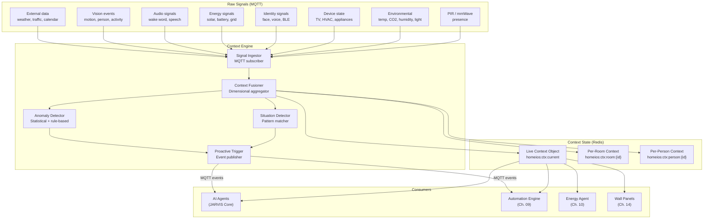
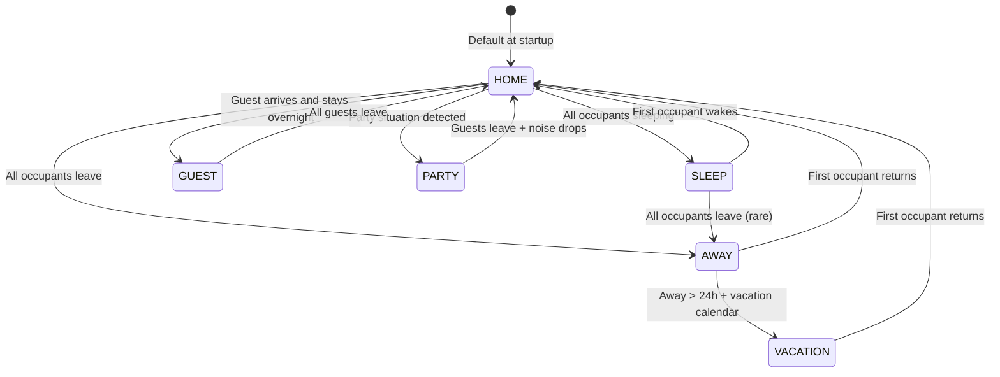

# Chapter 08 — Context Engine

**AI Home OS Internal Design Specification**  
**Classification:** Internal — Engineering  
**Status:** Draft v1.0  
**Date:** 2026-07-17

---

## Table of Contents

1. [Overview](#1-overview)
2. [Design Philosophy](#2-design-philosophy)
3. [Context Engine Architecture](#3-context-engine-architecture)
4. [Raw Signal Ingestion](#4-raw-signal-ingestion)
5. [Context Dimensions](#5-context-dimensions)
6. [Temporal Context](#6-temporal-context)
7. [Spatial Context](#7-spatial-context)
8. [Occupancy Context](#8-occupancy-context)
9. [Activity Context](#9-activity-context)
10. [Environmental Context](#10-environmental-context)
11. [Energy Context](#11-energy-context)
12. [Social Context](#12-social-context)
13. [Emotional Context](#13-emotional-context)
14. [External Context](#14-external-context)
15. [Context Fusion](#15-context-fusion)
16. [Situation Detection](#16-situation-detection)
17. [Context State Machine](#17-context-state-machine)
18. [Context API](#18-context-api)
19. [Anomaly Detection](#19-anomaly-detection)
20. [Proactive Trigger Engine](#20-proactive-trigger-engine)
21. [Context Persistence & History](#21-context-persistence--history)
22. [Failure Modes & Redundancy](#22-failure-modes--redundancy)
23. [Design Decisions & Trade-offs](#23-design-decisions--trade-offs)
24. [Risks](#24-risks)
25. [Future Improvements](#25-future-improvements)
26. [References](#26-references)

---

## 1. Overview

Raw sensor data is meaningless. A temperature of 24.2°C is just a number. But **context** transforms it: 24.2°C in the master bedroom at 11 PM when two people are sleeping — that is information the AI can act on.

The Context Engine is the **interpretive layer** between raw sensor data and intelligent action. It continuously ingests signals from every source in the home and synthesizes them into a unified, structured, human-meaningful model of what is happening right now.

It answers the foundational questions that drive all AI behavior:

| Question | Example Answer |
|----------|---------------|
| **Who?** | Sadiq + Fatima in the living room; Ahmed in the study |
| **Where?** | Living room active; bedrooms empty; kitchen idle |
| **When?** | 19:30 Thursday — weekday evening |
| **What?** | They are watching a movie together |
| **How?** | Relaxed, engaged — no urgency |
| **Why?** | It's their regular Thursday movie night |
| **What next?** | Movie ends in ~90 minutes; bedtime routine likely at 22:30 |

With this context, the AI can act intelligently and proactively — dimming lights when the movie starts, softening any alert volume, pre-cooling the bedroom, and queuing the bedtime routine without being asked.

---

## 2. Design Philosophy

### 2.1 Context Is Probabilistic, Not Definitive

The Context Engine never claims certainty about what is happening. It produces probability distributions over possible interpretations and passes these to the AI agents. A situation is labeled "movie night" with 87% probability — not as a fact.

### 2.2 Context Is Multi-Dimensional

No single signal defines context. A person sitting still in a dark room at night could be:
- Sleeping (if in bedroom + mmWave breathing detected)
- Watching TV (if TV is on + audio playing)
- Meditating (if no audio, not lying down)
- Reading (if reading lamp on)

The Context Engine resolves ambiguity by combining multiple signals simultaneously.

### 2.3 Context Changes Are Events

When the context changes significantly (a new situation is detected, a situation ends, an anomaly is found), the Context Engine publishes an event to the MQTT bus. These events drive proactive AI behavior — the AI does not poll context; it reacts to context changes.

### 2.4 Context Must Be Fast

The Context Engine must produce a current context snapshot in < 50ms for LLM prompt assembly. This means context is **always maintained in Redis** as a live object, updated incrementally as sensors fire — not computed on demand.

---

## 3. Context Engine Architecture



---

## 4. Raw Signal Ingestion

### 4.1 MQTT Subscription Map

The Context Engine subscribes to all relevant MQTT topics:

```python
CONTEXT_ENGINE_SUBSCRIPTIONS = [
    # Presence and motion
    "homeios/sensor/+/pir",
    "homeios/sensor/+/mmwave",
    "homeios/sensor/+/occupancy",

    # Environmental
    "homeios/sensor/+/temperature",
    "homeios/sensor/+/humidity",
    "homeios/sensor/+/co2",
    "homeios/sensor/+/voc",
    "homeios/sensor/+/lux",
    "homeios/sensor/+/noise_db",

    # Devices
    "homeios/device/+/state",
    "homeios/device/+/power_w",

    # Identity
    "homeios/identity/+/location",
    "homeios/identity/+/confidence",
    "homeios/identity/home_state",

    # Energy
    "homeios/energy/solar",
    "homeios/energy/battery",
    "homeios/energy/grid",

    # Vision
    "homeios/vision/+/person_detected",
    "homeios/vision/+/activity",

    # External
    "homeios/external/weather",
    "homeios/external/calendar/+",
    "homeios/external/traffic",
]
```

### 4.2 Signal Normalization

All incoming signals are normalized to a common format before fusion:

```python
@dataclass
class NormalizedSignal:
    signal_id: str          # Unique signal identifier
    signal_type: str        # Category: 'presence', 'environmental', 'device', etc.
    room: Optional[str]     # Room this signal is associated with
    person_id: Optional[str] # Person if signal is person-specific
    key: str                # What this measures: 'temperature', 'motion', 'tv_state'
    value: Any              # The current value
    unit: Optional[str]     # °C, ppm, lux, W, etc.
    confidence: float       # 0.0–1.0 (sensor reliability)
    timestamp: datetime
    ttl: int                # Seconds this reading remains valid
```

---

## 5. Context Dimensions

The Context Engine maintains a structured **context object** with 8 primary dimensions:

```python
@dataclass
class HomeContext:
    # Meta
    generated_at: datetime
    version: int            # Incremented on each update

    # Dimensions
    temporal: TemporalContext
    spatial: SpatialContext
    occupancy: OccupancyContext
    activity: ActivityContext
    environmental: EnvironmentalContext
    energy: EnergyContext
    social: SocialContext
    external: ExternalContext

    # Derived
    situation: SituationLabel      # High-level situation: 'movie_night', 'morning_routine', etc.
    situation_confidence: float
    anomalies: List[AnomalyEvent]
    home_mode: str                 # 'home', 'away', 'sleep', 'party', 'guest', 'vacation'
```

---

## 6. Temporal Context

### 6.1 Temporal Dimensions

```python
@dataclass
class TemporalContext:
    timestamp: datetime
    time_of_day: str        # 'early_morning', 'morning', 'midday', 'afternoon',
                            # 'evening', 'night', 'late_night'
    day_of_week: int        # 0=Monday, 6=Sunday
    day_type: str           # 'weekday', 'weekend', 'holiday', 'vacation'
    season: str             # 'spring', 'summer', 'autumn', 'winter'
    is_prayer_time: bool    # Applicable for Muslim households (fajr, dhuhr, asr, maghrib, isha)
    sunrise: datetime
    sunset: datetime
    solar_noon: datetime
    minutes_to_sunrise: int
    minutes_to_sunset: int
    is_dst: bool
```

### 6.2 Time-of-Day Buckets

```python
def get_time_of_day(hour: int) -> str:
    if 4 <= hour < 6:   return 'early_morning'
    if 6 <= hour < 9:   return 'morning'
    if 9 <= hour < 12:  return 'midday'
    if 12 <= hour < 17: return 'afternoon'
    if 17 <= hour < 20: return 'evening'
    if 20 <= hour < 23: return 'night'
    return 'late_night'  # 23:00–04:00
```

### 6.3 Prayer Time Integration

For households with Islamic prayer times, the Context Engine integrates prayer schedule from Adhan library or online API, adjusting AI behavior:

```python
# Prayer time context (pseudo-code using adhan-python)

from adhan import PrayerTimes, Coordinates, CalculationMethod, Date

class PrayerTimeContext:
    PRAYER_NAMES = ['fajr', 'dhuhr', 'asr', 'maghrib', 'isha']
    PRE_PRAYER_WINDOW_MINUTES = 15  # Quiet mode starts 15 min before prayer

    def get_prayer_context(self, lat: float, lon: float) -> PrayerContext:
        coords = Coordinates(lat, lon)
        params = CalculationMethod.MOON_SIGHTING_COMMITTEE.parameters()  # Gulf method

        times = PrayerTimes(coords, Date.today(), params)

        now = datetime.now()
        next_prayer = self._get_next_prayer(times, now)
        current_prayer = self._get_current_prayer(times, now)

        return PrayerContext(
            current_prayer=current_prayer,      # None if not in prayer time
            next_prayer=next_prayer.name,
            minutes_to_next_prayer=next_prayer.minutes_away,
            is_pre_prayer_quiet=next_prayer.minutes_away <= self.PRE_PRAYER_WINDOW_MINUTES,
            prayer_times={
                name: getattr(times, name)
                for name in self.PRAYER_NAMES
            }
        )
```

When `is_pre_prayer_quiet` is True, the Conversation Agent adjusts:
- TTS volume reduced by 20%
- Non-urgent notifications deferred until after prayer
- Ambient music volume reduced

---

## 7. Spatial Context

### 7.1 Room-Level Context

```python
@dataclass
class SpatialContext:
    active_rooms: List[str]         # Rooms with confirmed occupancy
    inactive_rooms: List[str]       # Rooms definitely unoccupied
    uncertain_rooms: List[str]      # Rooms where occupancy is unclear
    primary_activity_room: str      # Room with most activity right now
    room_contexts: Dict[str, RoomContext]

@dataclass
class RoomContext:
    room_id: str
    occupied: bool
    occupancy_confidence: float
    persons_present: List[str]
    last_motion: Optional[datetime]
    time_since_last_motion_minutes: float
    device_states: Dict[str, Any]   # TV on, lights on, etc.
    environment: RoomEnvironment    # temp, CO2, humidity, lux
```

### 7.2 Spatial Awareness Map

```
Current home spatial context (example, 19:30 Thursday):

┌──────────────────────────────────────────────────────────┐
│  FLOOR 1                                                 │
│                                                          │
│  [ENTRY HALL]          [LIVING ROOM] ← ACTIVE            │
│  Empty (5min ago)      Sadiq + Fatima                    │
│                        TV: ON — Netflix                  │
│                        Lights: 30% warm                  │
│                                                          │
│  [KITCHEN]             [DINING ROOM]                     │
│  Empty (1h ago)        Empty                             │
│                                                          │
│                                                          │
│  FLOOR 2                                                 │
│                                                          │
│  [MASTER BEDROOM]      [STUDY]       [BEDROOM 2]         │
│  Empty                 Ahmed         Empty               │
│                        Desk lamp on                      │
│                        Monitor on                        │
└──────────────────────────────────────────────────────────┘
```

---

## 8. Occupancy Context

### 8.1 Who Is Home

```python
@dataclass
class OccupancyContext:
    home_state: str                     # 'all_home', 'some_home', 'all_away', 'vacation'
    persons_home: List[PersonLocation]
    persons_away: List[str]
    total_persons_home: int
    all_asleep: bool
    any_asleep: bool
    sleeping_persons: List[str]
    children_home: bool
    elderly_persons_home: bool
    guests_present: bool
    guest_count: int

@dataclass
class PersonLocation:
    person_id: str
    room: str
    confidence: float
    activity: str               # 'watching_tv', 'sleeping', 'working', 'cooking', etc.
    last_seen: datetime
```

### 8.2 Sleep Detection

Sleep state is derived from multiple signals:

```python
def detect_sleep(person_id: str, room: str) -> SleepState:
    signals = {
        # Emfit QS or mmWave
        'bed_occupied': sensor.get(f"{room}/bed_pressure", False),
        'breathing_detected': sensor.get(f"{room}/mmwave_breathing", False),
        'hr_below_resting': wearable.get_hr(person_id, threshold='resting'),

        # Activity signals (absence of activity)
        'no_motion': sensor.minutes_since_motion(room) > 15,
        'lights_off': device.get_state(f"{room}/lights") == 'off',
        'phone_charging': identity.is_phone_charging(person_id),

        # Temporal
        'past_usual_sleep_time': temporal.is_past_sleep_time(person_id),
    }

    # Weighted vote
    sleep_evidence = (
        signals['bed_occupied'] * 0.35 +
        signals['breathing_detected'] * 0.30 +
        signals['hr_below_resting'] * 0.20 +
        signals['no_motion'] * 0.05 +
        signals['lights_off'] * 0.05 +
        signals['past_usual_sleep_time'] * 0.05
    )

    return SleepState(
        is_sleeping=sleep_evidence >= 0.60,
        confidence=sleep_evidence,
        person_id=person_id
    )
```

---

## 9. Activity Context

### 9.1 Activity Classification

Activity context answers: **what are people doing?** It is derived from a combination of device states, vision events, sensor readings, and temporal patterns.

```python
@dataclass
class ActivityContext:
    home_activity: str              # 'morning_routine', 'work_from_home', 'relaxing',
                                    # 'entertaining', 'sleeping', 'away', 'cooking', ...
    per_person_activity: Dict[str, PersonActivity]
    activity_duration_minutes: float
    activity_confidence: float

@dataclass
class PersonActivity:
    person_id: str
    activity: str                   # Fine-grained: 'watching_tv', 'cooking', 'exercising',
                                    # 'working_at_desk', 'reading', 'on_phone', 'sleeping'
    confidence: float
    since: datetime
    inferred_from: List[str]        # Which signals drove this inference
```

### 9.2 Activity Inference Rules

```python
# Activity inference engine (pseudo-code)

ACTIVITY_RULES = [
    ActivityRule(
        activity='watching_tv',
        required=['tv_on', 'person_in_room'],
        supporting=['lights_dim', 'no_motion_10min', 'evening_time'],
        base_confidence=0.75
    ),
    ActivityRule(
        activity='sleeping',
        required=['bed_occupied', 'lights_off'],
        supporting=['breathing_sensor', 'past_sleep_time', 'phone_charging'],
        base_confidence=0.80
    ),
    ActivityRule(
        activity='cooking',
        required=['person_in_kitchen'],
        supporting=['range_hood_on', 'high_humidity', 'noise_above_50db'],
        base_confidence=0.70
    ),
    ActivityRule(
        activity='exercising',
        required=['person_in_room'],
        supporting=['elevated_hr', 'repeated_motion', 'music_playing'],
        base_confidence=0.65
    ),
    ActivityRule(
        activity='working_at_desk',
        required=['person_in_study', 'monitor_on'],
        supporting=['keyboard_usb_active', 'daytime', 'desk_lamp_on'],
        base_confidence=0.80
    ),
    ActivityRule(
        activity='on_video_call',
        required=['working_at_desk'],
        supporting=['microphone_active', 'webcam_active', 'no_music'],
        base_confidence=0.75
    ),
]

def infer_activity(room: str, person: str, signals: dict) -> PersonActivity:
    best_match = None
    best_confidence = 0.0

    for rule in ACTIVITY_RULES:
        if not all(signals.get(req) for req in rule.required):
            continue  # Required signals not met

        support_score = sum(
            0.1 for s in rule.supporting if signals.get(s)
        )
        confidence = min(rule.base_confidence + support_score, 0.97)

        if confidence > best_confidence:
            best_confidence = confidence
            best_match = rule.activity

    return PersonActivity(
        person_id=person,
        activity=best_match or 'unknown',
        confidence=best_confidence,
        since=datetime.utcnow(),
        inferred_from=[k for k, v in signals.items() if v]
    )
```

### 9.3 Video Call Detection

Video calls require special handling — the AI should:
- Not interrupt with proactive announcements
- Reduce background noise levels
- Set a "do not disturb" context for that room

```python
class VideoCallDetector:
    """
    Detect active video calls from multiple signals.
    Uses ESPHome or Frigate + HA integration — not by accessing computer audio.
    """
    def detect(self, person_id: str, room: str) -> bool:
        signals = {
            'webcam_light': ha.get_state(f"binary_sensor.{room}_webcam_led"),
            'microphone_led': ha.get_state(f"binary_sensor.{room}_mic_led"),
            'usb_camera_active': ha.get_state(f"binary_sensor.{room}_usb_camera"),
            'zoom_process': ha.get_state("sensor.study_pc_active_app"),  # HA companion app
        }

        evidence = (
            (signals['webcam_light'] == 'on') * 0.40 +
            (signals['microphone_led'] == 'on') * 0.30 +
            (signals['usb_camera_active'] == 'on') * 0.20 +
            (signals['zoom_process'] in ['Zoom', 'Teams', 'Meet']) * 0.10
        )

        return evidence >= 0.50
```

---

## 10. Environmental Context

### 10.1 Environmental Aggregation

```python
@dataclass
class EnvironmentalContext:
    # Per-room environment
    rooms: Dict[str, RoomEnvironment]

    # Whole-home aggregates
    avg_temperature: float
    avg_co2: float
    avg_humidity: float
    outdoor_temp: float
    outdoor_aqi: int

    # Quality scores
    air_quality_score: float    # 0 (poor) – 1 (excellent)
    thermal_comfort_score: float
    noise_score: float

@dataclass
class RoomEnvironment:
    temperature: float          # °C
    humidity: float             # %RH
    co2_ppm: Optional[int]
    voc_index: Optional[int]
    lux: Optional[float]        # Illuminance
    noise_db: Optional[float]
    pm25: Optional[float]       # Particulate matter
    tvoc: Optional[float]

    # Derived quality indicators
    co2_level: str              # 'excellent' <600, 'good' <900, 'moderate' <1200, 'poor' >1200
    thermal_comfort: str        # 'cold', 'cool', 'comfortable', 'warm', 'hot'
    humidity_comfort: str       # 'dry' <30%, 'comfortable' 40-60%, 'humid' >65%
```

### 10.2 Air Quality Scoring

```python
def compute_air_quality_score(env: RoomEnvironment) -> float:
    """
    0.0 = dangerous, 1.0 = ideal
    Based on WHO and ASHRAE 62.1 thresholds
    """
    co2_score = {
        lambda x: x < 600:  1.00,
        lambda x: x < 800:  0.90,
        lambda x: x < 1000: 0.75,
        lambda x: x < 1200: 0.55,
        lambda x: x < 1500: 0.30,
        lambda x: x >= 1500: 0.10,
    }

    humidity_score = 1.0 - abs(env.humidity - 50) / 50  # Peak at 50%RH

    voc_score = max(0, 1.0 - (env.voc_index or 0) / 400)

    # Weighted combination
    return (
        0.50 * next(v for k, v in co2_score.items() if k(env.co2_ppm or 400)) +
        0.30 * humidity_score +
        0.20 * voc_score
    )
```

### 10.3 Automatic Remediation

When air quality degrades, the Context Engine publishes an event that triggers the Automation Engine:

```python
# Air quality remediation trigger

async def check_air_quality(room: str, env: RoomEnvironment):
    score = compute_air_quality_score(env)

    if env.co2_ppm and env.co2_ppm > 1200:
        await mqtt.publish(
            "homeios/ctx/event/air_quality",
            json.dumps({
                "room": room,
                "issue": "high_co2",
                "value": env.co2_ppm,
                "action": "open_window_vent",
                "severity": "moderate" if env.co2_ppm < 1500 else "high"
            })
        )
    if env.humidity and env.humidity > 70:
        await mqtt.publish(
            "homeios/ctx/event/air_quality",
            json.dumps({"room": room, "issue": "high_humidity",
                        "value": env.humidity, "action": "run_dehumidifier"})
        )
```

---

## 11. Energy Context

### 11.1 Energy State Summary

```python
@dataclass
class EnergyContext:
    # Generation
    solar_w: float              # Current solar generation (W)
    solar_daily_kwh: float      # Total solar today (kWh)
    solar_forecast_kwh: float   # Forecast for rest of today

    # Storage
    battery_pct: float          # Battery state of charge (%)
    battery_w: float            # Battery charge/discharge rate (+ charge, - discharge)
    battery_kwh_remaining: float
    estimated_runtime_hours: float  # How long until battery depleted

    # Grid
    grid_w: float               # Grid import (+ import, - export)
    grid_rate: float            # Current electricity rate ($/kWh)
    is_peak_rate: bool          # Peak tariff period

    # Loads
    total_consumption_w: float
    major_loads: List[LoadState]

    # Mode
    energy_mode: str            # 'solar_abundant', 'battery_normal', 'battery_low',
                                # 'grid_peak', 'grid_outage', 'export_optimal'
    can_run_deferrable_loads: bool
    ev_charge_optimal: bool
```

### 11.2 Energy Mode Classification

```python
def classify_energy_mode(ctx: EnergyContext) -> str:
    if ctx.grid_w == 0 and ctx.battery_pct < 5:
        return 'grid_outage'
    if ctx.battery_pct < 15:
        return 'battery_critical'
    if ctx.battery_pct < 30:
        return 'battery_low'
    if ctx.solar_w > ctx.total_consumption_w * 1.2 and ctx.battery_pct > 80:
        return 'solar_abundant'      # Solar exceeds needs, battery full
    if ctx.solar_w > ctx.total_consumption_w:
        return 'solar_surplus'
    if ctx.is_peak_rate and ctx.grid_w > 0:
        return 'grid_peak'          # Importing during peak tariff
    if not ctx.is_peak_rate and ctx.grid_w < 0:
        return 'export_optimal'     # Exporting during non-peak
    return 'battery_normal'
```

The energy mode feeds directly into the Automation Engine's decision logic — for example, deferrable loads (washing machine, dishwasher, EV charger) are only run when `energy_mode` is `solar_abundant` or `solar_surplus`.

---

## 12. Social Context

### 12.1 Social Dimensions

```python
@dataclass
class SocialContext:
    household_members_home: int
    guests_present: bool
    guest_count: int
    social_mode: str            # 'alone', 'couple', 'family', 'guests', 'party'
    children_awake: bool
    entertaining: bool          # Guests + living areas active
    family_meal_likely: bool    # Near meal time + multiple persons in kitchen/dining
    quiet_zone_active: bool     # Someone sleeping or studying
```

### 12.2 Social Mode Detection

```python
def detect_social_mode(occupancy: OccupancyContext) -> str:
    home_count = occupancy.total_persons_home
    has_guests = occupancy.guests_present

    if home_count == 0:
        return 'away'
    if home_count == 1 and not has_guests:
        return 'alone'
    if home_count == 2 and not has_guests:
        return 'couple'
    if home_count >= 2 and not has_guests:
        return 'family'
    if has_guests and occupancy.guest_count >= 4:
        return 'party'
    if has_guests:
        return 'guests'
    return 'family'
```

### 12.3 Social Context Influence on AI Behavior

| Social Mode | AI Adaptations |
|-------------|---------------|
| `alone` | More verbose AI responses; check-in proactively |
| `couple` | Reduce interruptions; romantic lighting suggestions |
| `family` | Child-safe content; meal time detection; coordinated routines |
| `guests` | Privacy mode for personal data; hospitality mode |
| `party` | Maximum entertainment mode; no sensitive announcements |
| `away` | Security mode; energy saving; pet care mode if applicable |

---

## 13. Emotional Context

### 13.1 Non-Invasive Emotion Detection

AI Home OS does not require users to self-report emotions. Instead, it infers emotional context from non-invasive proxies:

| Signal | Inferred State | Method |
|--------|---------------|--------|
| Elevated heart rate (wearable) | Stressed / exercising | Wearable API |
| Very slow heart rate (sleeping) | Resting | Wearable API |
| Raised voice (audio) | Agitated / excited | Audio energy level |
| Quiet speech + slow pace | Tired / sad | STT + pace analysis |
| Long time in one room, no activity | Possibly low mood | Behavioral pattern |
| Music genre change (to calm) | Seeking calm | Music Assistant |
| Early wake time vs. pattern | Possibly anxious | Identity + temporal |

### 13.2 Emotional Context Object

```python
@dataclass
class EmotionalContext:
    """
    Per-person emotional state estimates. Low confidence — used only
    to soften/adapt AI tone. Never stored as facts or shared.
    """
    per_person: Dict[str, PersonEmotionalState]

@dataclass
class PersonEmotionalState:
    person_id: str
    energy_level: str       # 'low', 'medium', 'high'
    stress_level: str       # 'relaxed', 'neutral', 'elevated', 'stressed'
    mood_indicator: str     # 'positive', 'neutral', 'subdued'
    confidence: float       # Always relatively low (0.30–0.60)
    source: List[str]       # Which signals contributed
```

### 13.3 Privacy Constraints

Emotional context is:
- **Never stored** in episodic or semantic memory
- **Never shared** with any external system
- **Only used** to modulate the Conversation Agent's tone in the current interaction
- **Always discarded** after the interaction ends

---

## 14. External Context

### 14.1 Weather Context

```python
@dataclass
class WeatherContext:
    temperature_c: float
    feels_like_c: float
    humidity_pct: float
    condition: str          # 'clear', 'cloudy', 'rain', 'thunderstorm', 'snow', 'fog'
    wind_kph: float
    uv_index: int
    aqi: int                # Air Quality Index
    is_rain_expected: bool  # In next 3 hours
    is_hot: bool            # > 35°C
    is_cold: bool           # < 10°C
    sunset_today: datetime
    sunrise_tomorrow: datetime
```

**Integration with Home Assistant:**
```yaml
# HA configuration.yaml excerpt — weather integration
weather:
  - platform: open_meteo     # Free, local-first, no API key needed
    name: "Home Weather"
    latitude: !secret home_lat
    longitude: !secret home_lon
```

### 14.2 Traffic Context

For households with regular commuters, traffic context informs departure timing:

```python
@dataclass
class TrafficContext:
    commute_routes: List[RouteStatus]

@dataclass
class RouteStatus:
    route_name: str             # "Sadiq to office"
    normal_duration_minutes: int
    current_duration_minutes: int
    delay_minutes: int
    traffic_level: str          # 'light', 'moderate', 'heavy', 'standstill'
    optimal_departure_time: datetime
```

When traffic is heavy and a person has a calendar commitment, the Context Engine triggers:
```
"Sadiq, there's heavy traffic toward the city this morning.
 You should leave by 07:45 instead of your usual 08:00 to reach
 the 09:00 meeting on time."
```

### 14.3 Calendar Context

```python
@dataclass
class CalendarContext:
    today_events: Dict[str, List[CalendarEvent]]  # per person
    next_event: Optional[CalendarEvent]
    time_to_next_event_minutes: Optional[int]
    is_busy_day: bool                             # 3+ events today
    vacation_mode: bool                           # All-day "Out of office" event
    school_day: bool                              # Relevant if children
```

---

## 15. Context Fusion

### 15.1 Fusion Pipeline

The Context Fusioner assembles the multi-dimensional context object every time a significant signal changes:

```python
class ContextFusioner:
    def __init__(self):
        self.signal_cache: Dict[str, NormalizedSignal] = {}
        self.current_context: HomeContext = HomeContext.default()

    async def on_signal(self, signal: NormalizedSignal):
        # Update signal cache
        self.signal_cache[signal.signal_id] = signal

        # Remove expired signals
        now = time.time()
        self.signal_cache = {
            k: v for k, v in self.signal_cache.items()
            if (now - v.timestamp.timestamp()) < v.ttl
        }

        # Determine if context needs re-computation
        if self._is_significant_change(signal):
            new_context = await self._compute_context()
            await self._publish_if_changed(new_context)

    async def _compute_context(self) -> HomeContext:
        signals = list(self.signal_cache.values())

        return HomeContext(
            generated_at=datetime.utcnow(),
            temporal=self._build_temporal(),
            spatial=self._build_spatial(signals),
            occupancy=self._build_occupancy(signals),
            activity=self._build_activity(signals),
            environmental=self._build_environmental(signals),
            energy=self._build_energy(signals),
            social=self._build_social(signals),
            external=self._build_external(),
            situation=self._detect_situation(signals),
            anomalies=await self._detect_anomalies(signals)
        )

    def _is_significant_change(self, signal: NormalizedSignal) -> bool:
        """Only recompute context for meaningful changes — not every sensor tick."""
        HIGH_PRIORITY_SIGNALS = {
            'presence', 'motion', 'identity', 'device_state', 'energy_mode'
        }
        LOW_PRIORITY_SIGNALS = {'temperature', 'humidity', 'lux'}

        if signal.signal_type in HIGH_PRIORITY_SIGNALS:
            return True  # Always recompute

        if signal.signal_type in LOW_PRIORITY_SIGNALS:
            # Only recompute if value changed by more than threshold
            prev = self.signal_cache.get(signal.signal_id)
            if prev:
                return abs(float(signal.value) - float(prev.value)) > 0.5
        return True
```

### 15.2 Context Update Latency

| Signal Type | Max Latency to Context Update |
|-------------|------------------------------|
| Motion / presence | < 1 second |
| Identity (face/voice) | < 2 seconds |
| Device state change | < 1 second |
| Environmental (temp, CO2) | < 5 seconds |
| Energy state | < 3 seconds |
| External (weather) | < 60 seconds (cached) |
| Calendar | < 5 minutes (synced periodically) |

---

## 16. Situation Detection

### 16.1 Situation Labels

The Context Engine reduces the multi-dimensional context into a single human-readable **situation label** — a high-level summary of what is happening in the home right now.

| Situation | Detection Criteria |
|-----------|-------------------|
| `morning_routine` | 06:00–09:00 + occupants waking + kitchen activity |
| `work_from_home` | Weekday + person at desk + multiple hours |
| `relaxing_evening` | 18:00–22:00 + multiple persons home + TV or music |
| `movie_night` | TV streaming + lights dim + > 1 person on sofa + evening |
| `family_meal` | Kitchen activity + dining room occupied + multiple persons |
| `entertaining_guests` | Guests present + social areas active + elevated noise |
| `home_alone` | 1 person home + rest of family away |
| `all_asleep` | All occupants sleeping + all major lights off |
| `all_away` | No occupants home |
| `vacation` | All away + calendar shows vacation |
| `guest_staying` | Guest present for multi-day period |
| `working_late` | Past 22:00 + person still active at desk |
| `sick_day` | Weekday + person home who is usually away + low activity |
| `exercise` | Elevated HR + exercise room occupied + music |
| `party` | Multiple guests + living areas + high noise + evening |

### 16.2 Situation Detection Engine

```python
# Situation detection (pseudo-code)

SITUATION_PATTERNS = [
    SituationPattern(
        name='movie_night',
        conditions=[
            lambda ctx: ctx.temporal.time_of_day in ['evening', 'night'],
            lambda ctx: any(
                d.get('tv_state') == 'on' and d.get('tv_input') in ['netflix', 'streaming']
                for d in ctx.spatial.room_contexts.get('living_room', {}).get('device_states', {}).values()
            ),
            lambda ctx: ctx.occupancy.total_persons_home >= 2,
            lambda ctx: ctx.environmental.rooms.get('living_room', RoomEnvironment()).lux < 50,
        ],
        confidence_weights=[0.20, 0.40, 0.20, 0.20]
    ),
    SituationPattern(
        name='all_asleep',
        conditions=[
            lambda ctx: ctx.occupancy.all_asleep,
            lambda ctx: ctx.temporal.time_of_day in ['night', 'late_night', 'early_morning'],
            lambda ctx: all(
                rc.device_states.get('lights_on', False) == False
                for rc in ctx.spatial.room_contexts.values()
            ),
        ],
        confidence_weights=[0.50, 0.30, 0.20]
    ),
]

def detect_situation(ctx: HomeContext) -> Tuple[str, float]:
    best_situation = 'normal'
    best_confidence = 0.0

    for pattern in SITUATION_PATTERNS:
        scores = []
        for condition, weight in zip(pattern.conditions, pattern.confidence_weights):
            try:
                met = condition(ctx)
                scores.append(weight if met else 0.0)
            except Exception:
                scores.append(0.0)

        pattern_confidence = sum(scores) / sum(pattern.confidence_weights)
        if pattern_confidence > best_confidence:
            best_confidence = pattern_confidence
            best_situation = pattern.name

    return best_situation, best_confidence
```

---

## 17. Context State Machine

### 17.1 Home Mode State Machine

The home mode is the highest-level abstraction of the home's current state:



### 17.2 Mode Transitions and Actions

Each mode transition triggers a set of automated responses:

```python
MODE_TRANSITION_HANDLERS = {
    ('HOME', 'AWAY'): [
        'activate_security_monitoring',
        'set_energy_saving_mode',
        'pause_non_essential_automations',
        'water_plants_check',             # Trigger irrigation if scheduled
        'close_all_windows_vents',
    ],
    ('AWAY', 'HOME'): [
        'welcome_home_greeting',
        'restore_comfort_settings',
        'deactivate_security_monitoring',
        'announce_any_events_while_away',
    ],
    ('HOME', 'SLEEP'): [
        'activate_night_mode',
        'lower_thermostat_to_sleep_temp',
        'lock_all_exterior_doors',
        'arm_perimeter_alarm',
        'disable_non_emergency_announcements',
    ],
    ('SLEEP', 'HOME'): [
        'activate_morning_routine',
        'restore_normal_thermostat',
        'disarm_perimeter_alarm',
        'morning_briefing',
    ],
}

async def handle_mode_transition(old_mode: str, new_mode: str, context: HomeContext):
    handlers = MODE_TRANSITION_HANDLERS.get((old_mode, new_mode), [])
    for handler_name in handlers:
        await automation_engine.execute(handler_name, context=context)
```

---

## 18. Context API

### 18.1 Redis Context Object

The live context is always available in Redis under a well-known key:

```python
# Context is stored as JSON in Redis with a 10-second TTL
# (refreshed continuously; TTL prevents stale context from persisting)

CONTEXT_REDIS_KEY = "homeios:ctx:current"
CONTEXT_TTL = 10  # seconds

async def publish_context(ctx: HomeContext):
    await redis.setex(
        CONTEXT_REDIS_KEY,
        CONTEXT_TTL,
        ctx.json()
    )
```

### 18.2 Context REST API

The Context Engine exposes a lightweight REST API for UI and agent consumption:

```
GET  /context                       → Full home context JSON
GET  /context/room/{room_id}        → Single room context
GET  /context/person/{person_id}    → Person's current context
GET  /context/situation             → Current situation + confidence
GET  /context/mode                  → Current home mode
POST /context/override              → Manually set home mode (admin only)
GET  /context/history?hours=24      → Context history from PostgreSQL
```

### 18.3 Context SDK (for AI Agents)

```python
# Context SDK used by all AI agents (pseudo-code)

class ContextClient:
    async def get_current(self) -> HomeContext:
        raw = await redis.get(CONTEXT_REDIS_KEY)
        if raw:
            return HomeContext.parse_raw(raw)
        return await self._fetch_from_engine()  # Fallback if Redis miss

    async def get_room(self, room_id: str) -> RoomContext:
        ctx = await self.get_current()
        return ctx.spatial.room_contexts.get(room_id)

    async def get_person_context(self, person_id: str) -> PersonContext:
        ctx = await self.get_current()
        return PersonContext(
            location=ctx.occupancy.persons_home.get(person_id),
            activity=ctx.activity.per_person_activity.get(person_id),
            emotion=ctx.emotional.per_person.get(person_id)
        )

    async def wait_for_situation(
        self,
        target_situation: str,
        timeout_seconds: int = 3600
    ) -> bool:
        """Block until a specific situation is detected or timeout."""
        deadline = time.time() + timeout_seconds
        async for event in mqtt.subscribe("homeios/ctx/event/situation_change"):
            if event['situation'] == target_situation:
                return True
            if time.time() > deadline:
                return False
        return False
```

---

## 19. Anomaly Detection

### 19.1 Statistical Anomaly Detection

The Context Engine performs ongoing anomaly detection across all sensor streams:

```python
class AnomalyDetector:
    """
    Detect anomalies by comparing current values against historical
    baselines (stored in TimescaleDB as continuous aggregates).
    """
    Z_SCORE_THRESHOLD = 3.0  # 3 standard deviations

    async def check_sensor(
        self,
        sensor_id: str,
        current_value: float
    ) -> Optional[AnomalyEvent]:
        # Get historical baseline (last 30 days, same time window)
        baseline = await db.query("""
            SELECT AVG(value) AS mean, STDDEV(value) AS stddev
            FROM sensor_readings
            WHERE sensor_id = %s
              AND time > NOW() - INTERVAL '30 days'
              AND EXTRACT(HOUR FROM time) BETWEEN %s AND %s
        """, (sensor_id, hour - 2, hour + 2))

        if not baseline.stddev or baseline.stddev == 0:
            return None  # Not enough history

        z_score = abs(current_value - baseline.mean) / baseline.stddev

        if z_score >= self.Z_SCORE_THRESHOLD:
            return AnomalyEvent(
                sensor_id=sensor_id,
                current_value=current_value,
                expected_value=baseline.mean,
                z_score=z_score,
                severity='high' if z_score >= 5 else 'medium'
            )
        return None
```

### 19.2 Rule-Based Anomalies

Some anomalies are better detected by explicit rules than statistics:

| Anomaly | Rule | Response |
|---------|------|---------|
| CO2 rising > 50 ppm/min | Rate-of-change exceeds threshold | Open vents immediately |
| Temperature rising > 5°C in 10 min | Fire? | Check smoke detector; alert |
| All motion sensors silent for > 8h (person home) | Person may have collapsed | Check camera; alert emergency contact |
| Front door open > 30 minutes | Door left open | Alert resident |
| Water flow sensor active 2h straight | Possible leak | Alert resident |
| No sleep detected by 04:00 | Insomnia? | Log; gentle inquiry next morning |

### 19.3 Compound Anomalies

Some anomalies only become significant when multiple unusual signals coincide:

```python
# Compound anomaly: possible fall detection (non-camera backup)
def check_fall_compound_anomaly(room: str, person_id: str, signals: dict) -> bool:
    """
    If vision-based fall detection is not available, infer from compound signals.
    Not as reliable as vision — used as backup.
    """
    return (
        signals.get(f'{room}/emergency_button') or (
            signals.get(f'{room}/impact_sensor') and           # Sharp vibration
            signals.get(f'{room}/mmwave_presence') and         # Person present
            not signals.get(f'{room}/motion_last_5min') and    # Not moving
            signals.get(f'person/{person_id}/elderly')         # Known elderly person
        )
    )
```

---

## 20. Proactive Trigger Engine

### 20.1 What Triggers Proactive Behavior

The Context Engine is the primary source of **proactive AI actions** — behaviors the AI initiates without being asked.

Triggers fall into three categories:

| Category | Example | Mechanism |
|----------|---------|-----------|
| **Situation transition** | Entering movie night → dim lights | Mode/situation state machine |
| **Anomaly detected** | CO2 rising → open vents + alert | Anomaly detector |
| **Scheduled + context** | 07:00 + person awake → morning briefing | Temporal + occupancy |

### 20.2 Trigger Event Publishing

```python
# Proactive trigger event schema

TRIGGER_EVENT_SCHEMA = {
    "trigger_id": "uuid",
    "trigger_type": "situation_start | situation_end | anomaly | threshold | schedule",
    "situation": "movie_night",         # If situation trigger
    "anomaly": {},                       # If anomaly trigger
    "context_snapshot": {},             # Relevant subset of current context
    "recommended_actions": [],          # Suggested responses (advisory)
    "urgency": "low | medium | high | emergency",
    "timestamp": "ISO-8601"
}
```

### 20.3 Proactive Action Examples

```
Trigger: Situation 'movie_night' detected (confidence: 0.88)
  → Automation: dim living room lights to 20% warm
  → Automation: mute non-urgent notifications for living room
  → Automation: close curtains if open and sun is still up

Trigger: Situation 'all_asleep' detected (confidence: 0.92)
  → Automation: lock all exterior doors
  → Automation: arm perimeter alarm
  → Automation: set thermostat to sleep temperature
  → Automation: disable all satellite microphones except emergency wake word

Trigger: Anomaly 'co2_high' in study (CO2: 1,450 ppm, z-score: 4.2)
  → Automation: open study window vent
  → Conversation: "The CO2 in the study is quite high — I've opened the window vent."

Trigger: Calendar event 'dentist_appointment' in 45 minutes
  → Traffic: check route (18 min, light traffic)
  → Conversation: "Your dentist appointment is in 45 minutes.
                   Traffic is light — you should leave by 14:15."
```

---

## 21. Context Persistence & History

### 21.1 Context History Storage

Context snapshots are stored periodically for historical analysis and preference learning:

```sql
-- Context history table (TimescaleDB)
CREATE TABLE context_history (
    time                TIMESTAMPTZ NOT NULL,
    home_mode           VARCHAR(30),
    situation           VARCHAR(50),
    situation_confidence FLOAT,
    persons_home        TEXT[],         -- Array of person IDs
    occupancy_count     INT,
    avg_temperature     FLOAT,
    avg_co2             INT,
    solar_w             FLOAT,
    battery_pct         FLOAT,
    energy_mode         VARCHAR(30),
    anomalies           JSONB DEFAULT '[]',
    full_context        JSONB           -- Full context JSON (compressed)
);

SELECT create_hypertable('context_history', 'time',
    chunk_time_interval => INTERVAL '1 day');

-- Compress chunks older than 7 days
ALTER TABLE context_history SET (
    timescaledb.compress,
    timescaledb.compress_segmentby = 'home_mode'
);
```

### 21.2 Context Retention Policy

| Data | Retention | Compression |
|------|-----------|-------------|
| Full context JSON | 7 days | Compressed after 24h |
| Context summary (key fields) | 1 year | Weekly aggregate after 30 days |
| Situation labels (only) | 2 years | Monthly aggregate after 90 days |
| Anomaly events | 2 years | Not compressed |

---

## 22. Failure Modes & Redundancy

| Failure | Impact | Detection | Recovery |
|---------|--------|-----------|---------|
| Context Engine crash | No context updates; agents use stale context | Docker health check | Restart; rebuild from Redis signals within 5s |
| Redis unavailable | Agents cannot read live context | Redis health check | Fall back to direct MQTT subscription in agents; reduced functionality |
| MQTT broker down | No signal ingestion | Broker health check | Context Engine buffers signals; reconnect within 30s |
| Individual sensor offline | One dimension degraded | MQTT Last Will | Context computed from remaining sensors; flagged as degraded |
| All presence sensors offline | Cannot detect occupancy | Health check | AI asks resident directly ("Is anyone home?"); defaults to HOME mode |
| Weather API unavailable | No external weather context | HTTP error logging | Use last cached weather; flag as stale |

---

## 23. Design Decisions & Trade-offs

### 23.1 Push (Event-Driven) vs. Poll (Periodic Refresh)

| Approach | Pros | Cons |
|----------|------|------|
| **Push — event-driven (this design)** | Immediate updates; low idle CPU | More complex; must handle signal bursts |
| Poll every N seconds | Simple; predictable load | Stale between polls; unnecessary computation |

**Decision:** Push-driven. Context updates within 1 second of a significant signal change. Polling is only used for external data (weather, traffic) that changes slowly.

### 23.2 Single Context Object vs. Per-Agent Context

| Approach | Pros | Cons |
|----------|------|------|
| **Shared context object (this design)** | Consistent across agents; single source of truth | All agents see the same context (minor coupling) |
| Per-agent context | Agents customize their own view | Inconsistency; duplication; harder to debug |

**Decision:** Shared context object in Redis. Agents may locally enrich the context for their specific domain (e.g., the Energy Agent adds energy-specific context not in the main object).

---

## 24. Risks

| Risk | Probability | Impact | Mitigation |
|------|-------------|--------|------------|
| Context engine fails to detect situation → AI acts incorrectly | Medium | Medium | Confidence thresholds; agents fall back to rule-based behavior |
| Stale context misleads agent during sensor dropout | Low | Medium | TTL expiry on signals; degraded-mode flag in context |
| Emotional context misread → inappropriate AI response | Medium | Low | Emotional context confidence always low; AI tones are subtle not dramatic |
| Situation mislabeling during edge cases | Medium | Low | Multiple conditions required per situation; minimum confidence threshold |
| Privacy violation through context inference | Very Low | High | Emotional context not stored; context access requires authentication |
| Context update storm (many sensors firing simultaneously) | Medium | Low | Debounce: significant-change filter before recompute; rate limit recomputation |

---

## 25. Future Improvements

| Improvement | Version | Description |
|-------------|---------|-------------|
| ML-based situation classification | v2 | Replace rule-based situation detection with a trained classifier using 6+ months of context history |
| Per-room context display on wall panels | v1.5 | Show room context card on wall panel (Chapter 14) |
| Predictive context | v2 | "In 30 minutes, situation 'family_meal' is likely" — allows pre-emptive preparation |
| Multi-property context | v3 | Merge context from multiple homes (vacation property, office) |
| Context explanation API | v2 | "Why does JARVIS think I'm watching a movie?" — full signal transparency |
| Acoustic scene context | v2 | Use audio classification to infer context from sound (background TV, cooking sounds, music genre) |

---

## 26. References

1. **Context-Aware Computing** — Dey & Abowd, 2000 — https://doi.org/10.1007/3-540-40846-9_1
2. **Situation Recognition Survey** — Ye et al., 2012 — https://doi.org/10.1145/2337542.2337548
3. **Open-Meteo Weather API** — https://open-meteo.com/
4. **Adhan-Python Prayer Times** — https://github.com/batoulapps/adhan-python
5. **ASHRAE 62.1 — Ventilation for IAQ** — https://www.ashrae.org/
6. **WHO Indoor Air Quality Guidelines** — https://www.who.int/publications/i/item/9789241548885
7. **TimescaleDB Continuous Aggregates** — https://docs.timescale.com/use-timescale/latest/continuous-aggregates/
8. **Redis Pub/Sub** — https://redis.io/docs/manual/pubsub/
9. **Z-Score Anomaly Detection** — Grubbs, 1969 — https://www.jstor.org/stable/1266541
10. **Silero VAD** (used for audio-based context signals) — https://github.com/snakers4/silero-vad
11. **Home Assistant Weather Integration** — https://www.home-assistant.io/integrations/weather/
12. **ISO 7730 — Thermal Comfort** — Fanger, 1970

---

*Previous: [Chapter 07 — AI Reasoning Engine](Chapter-07.md)*  
*Next: [Chapter 09 — Automation Engine](Chapter-09.md)*

---

> **Document maintained by:** AI Home OS Architecture Team  
> **Last updated:** 2026-07-17  
> **Chapter status:** Draft v1.0 — Open for community review
