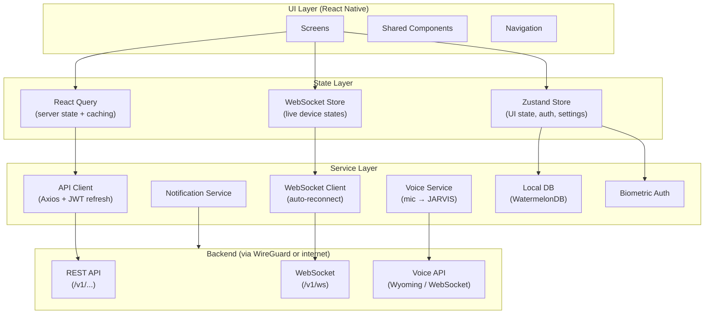

# Chapter 13 — Mobile Application

**AI Home OS Internal Design Specification**  
**Classification:** Internal — Engineering  
**Status:** Draft v1.0  
**Date:** 2026-07-17

---

## Table of Contents

1. [Overview](#1-overview)
2. [Design Philosophy & Visual Language](#2-design-philosophy--visual-language)
3. [Technology Stack](#3-technology-stack)
4. [App Architecture](#4-app-architecture)
5. [Navigation Structure](#5-navigation-structure)
6. [Screen: Onboarding & Authentication](#6-screen-onboarding--authentication)
7. [Screen: Home Dashboard](#7-screen-home-dashboard)
8. [Screen: JARVIS Voice Interface](#8-screen-jarvis-voice-interface)
9. [Screen: Rooms & Devices](#9-screen-rooms--devices)
10. [Screen: Device Detail](#10-screen-device-detail)
11. [Screen: Automations](#11-screen-automations)
12. [Screen: Energy Dashboard](#12-screen-energy-dashboard)
13. [Screen: Security & Cameras](#13-screen-security--cameras)
14. [Screen: Persons & Identity](#14-screen-persons--identity)
15. [Screen: Notifications & Alerts](#15-screen-notifications--alerts)
16. [Screen: Settings](#16-screen-settings)
17. [State Management](#17-state-management)
18. [Real-Time Data (WebSocket)](#18-real-time-data-websocket)
19. [Offline Mode](#19-offline-mode)
20. [Push Notifications](#20-push-notifications)
21. [Biometric Authentication](#21-biometric-authentication)
22. [Home Screen Widgets](#22-home-screen-widgets)
23. [Accessibility](#23-accessibility)
24. [Performance Targets](#24-performance-targets)
25. [Local Database Schema](#25-local-database-schema)
26. [Design Decisions & Trade-offs](#26-design-decisions--trade-offs)
27. [Risks](#27-risks)
28. [Future Improvements](#28-future-improvements)
29. [References](#29-references)

---

## 1. Overview

The AI Home OS mobile app is the primary interface for household members to interact with JARVIS away from the home, review home status, control devices, manage automations, and respond to security alerts. It is a **companion** to the always-on JARVIS voice interface — not a replacement.

### App Capabilities Summary

| Capability | Description |
|-----------|-------------|
| **Live home status** | See who is home, what is on, energy state, at a glance |
| **Voice commands** | Talk to JARVIS from anywhere via app microphone |
| **Device control** | Control any device in any room |
| **Automation management** | Create, edit, enable, and monitor automations |
| **Energy monitoring** | Live power flows, forecasts, EV charge status, cost |
| **Security** | Live camera feeds, alert management, alarm control |
| **Notifications** | Real-time alerts, energy reports, presence events |
| **Presence** | See where each family member is (home/away/room) |
| **Offline mode** | View cached state and queue commands when away from VPN |

---

## 2. Design Philosophy & Visual Language

### 2.1 Core Design Principles

| Principle | Application |
|-----------|------------|
| **Clarity over decoration** | Every UI element has a clear purpose. No decorative elements. |
| **Information first** | Status and data visible immediately — no buried menus |
| **Dark theme default** | Command centres and control panels are dark; dark reduces eye strain at night |
| **Flat, solid colours** | No gradients. Colour communicates meaning (state, severity) not aesthetics |
| **Touch efficiency** | Critical actions reachable in 2 taps or less from any screen |
| **Readable data** | Numbers, times, and units are large and clearly formatted |

### 2.2 Colour Palette

```
Background:
  Primary bg:    #0F0F11   (near-black)
  Surface:       #1A1A1F   (card background)
  Surface alt:   #24242B   (elevated card / modal)
  Border:        #2E2E38

Text:
  Primary text:  #F0F0F5   (near-white)
  Secondary:     #9090A0
  Disabled:      #505060

Semantic colours (flat, no gradient):
  Active/On:     #2ECC71   (solid green)
  Off/Idle:      #505060   (muted grey)
  Warning:       #F39C12   (amber)
  Danger/Alert:  #E74C3C   (red)
  Info/AI:       #3498DB   (blue — JARVIS accent)
  Energy:        #F1C40F   (solar/energy yellow)
  Security:      #9B59B6   (purple)
  Guest:         #1ABC9C   (teal)

Status indicator dot sizes:
  Small (16px): device state indicators
  Medium (24px): room occupancy
  Large (32px): home mode indicator
```

### 2.3 Typography

```
Font: Inter (variable weight)

Headings:
  H1: 28px / Bold   — screen title
  H2: 22px / SemiBold — section header
  H3: 18px / SemiBold — card title

Body:
  Body:   16px / Regular
  Small:  13px / Regular
  Micro:  11px / Medium — labels, badges

Data/Numbers:
  Metric: 36px / Bold (Tabular Numbers) — energy readings, temps
  Label:  12px / Medium — unit labels under metrics
```

---

## 3. Technology Stack

| Concern | Choice | Rationale |
|---------|--------|-----------|
| **Framework** | React Native (Expo SDK 52) | Single codebase for iOS + Android; large ecosystem; strong navigation |
| **Language** | TypeScript | Type safety; better IDE support; catches errors at compile time |
| **Navigation** | React Navigation 7 (native stack) | Native transitions; screen tracking |
| **State** | Zustand + React Query | Zustand for global UI state; React Query for server state + caching |
| **WebSocket** | Native WebSocket + reconnecting wrapper | Real-time device/energy/presence updates |
| **HTTP client** | Axios (with interceptors) | JWT auto-refresh; retry; request logging |
| **Local DB** | WatermelonDB (SQLite) | Efficient offline caching of home state |
| **Voice** | Expo Audio + WebSocket streaming | Mic access → stream to Wyoming/JARVIS |
| **Push notifications** | Expo Notifications + APNs + FCM | Cross-platform push |
| **Biometrics** | Expo LocalAuthentication | FaceID / TouchID / fingerprint |
| **VPN** | WireGuard-kt / NetworkExtension | In-app VPN tunnel activation (optional) |
| **Camera streaming** | WebRTC (react-native-webrtc) | Low-latency live camera feed |
| **Charts** | Victory Native (SVG) | Energy charts, flat design, no gradient fills |
| **Icons** | Lucide React Native | Consistent, clear icon set |
| **Testing** | Jest + React Native Testing Library + Detox | Unit + integration + E2E |

---

## 4. App Architecture



---

## 5. Navigation Structure

```
Root Navigator (Stack)
├── Auth Stack
│   ├── WelcomeScreen
│   ├── LoginScreen
│   └── MFAScreen
│
└── Main Tab Navigator
    ├── Tab: Home (house icon)
    │   └── HomeScreen
    │       ├── → RoomScreen (room tap)
    │       │   └── → DeviceDetailScreen (device tap)
    │       └── → AlertDetailScreen (alert tap)
    │
    ├── Tab: JARVIS (microphone icon)
    │   └── VoiceScreen
    │
    ├── Tab: Energy (lightning icon)
    │   └── EnergyScreen
    │       └── → EnergyHistoryScreen
    │
    ├── Tab: Security (shield icon)
    │   ├── SecurityScreen
    │   │   ├── → CameraFeedScreen (camera tap)
    │   │   └── → AlertDetailScreen
    │   └── AlertsScreen
    │
    └── Tab: Menu (grid icon)
        ├── AutomationsScreen
        │   ├── → AutomationDetailScreen
        │   └── → AutomationEditorScreen
        ├── PersonsScreen
        │   └── → PersonDetailScreen
        ├── NotificationsScreen
        └── SettingsScreen
            ├── IntegrationsScreen
            ├── SecuritySettingsScreen
            └── AppearanceScreen
```

---

## 6. Screen: Onboarding & Authentication

### 6.1 Welcome Screen

```
┌─────────────────────────────────────┐
│                                     │
│                                     │
│         ●  AI Home OS              │
│                                     │
│    Your home. Intelligent.          │
│                                     │
│                                     │
│    [  Connect to your home  ]       │
│                                     │
│    Don't have a setup yet?          │
│    View setup guide                 │
│                                     │
└─────────────────────────────────────┘

Background: #0F0F11
Logo: solid white circle + "AI Home OS" wordmark
Button: solid #3498DB, rounded 12px
```

### 6.2 Login Screen

```
┌─────────────────────────────────────┐
│  ←                                  │
│                                     │
│  Sign in                            │
│                                     │
│  ┌─────────────────────────────────┐│
│  │ ahmad@home.local                ││
│  └─────────────────────────────────┘│
│                                     │
│  ┌─────────────────────────────────┐│
│  │ Password              [👁]       ││
│  └─────────────────────────────────┘│
│                                     │
│  ┌─────────────────────────────────┐│
│  │         Sign In                 ││
│  └─────────────────────────────────┘│
│                                     │
│  ──────── or ────────               │
│                                     │
│  [  Face ID / Fingerprint  ]        │
│                                     │
│  Forgot password?                   │
└─────────────────────────────────────┘
```

### 6.3 MFA Screen

```
┌─────────────────────────────────────┐
│  ←  Two-factor authentication       │
│                                     │
│  Enter the 6-digit code from        │
│  your authenticator app.            │
│                                     │
│  ┌─────────────────────────────────┐│
│  │     [ ]  [ ]  [ ]  [ ]  [ ]  [ ]││
│  └─────────────────────────────────┘│
│                                     │
│  Code expires in  28s               │
│                                     │
│  Didn't receive it? Resend          │
│                                     │
│  [       Verify       ]             │
└─────────────────────────────────────┘
```

### 6.4 Authentication Flow (Code)

```typescript
// src/screens/auth/LoginScreen.tsx

export function LoginScreen() {
  const { login, loginWithBiometrics } = useAuthStore();
  const [email, setEmail] = useState('');
  const [password, setPassword] = useState('');
  const [error, setError] = useState<string | null>(null);
  const [loading, setLoading] = useState(false);

  const handleLogin = async () => {
    setLoading(true);
    setError(null);
    try {
      const result = await login(email, password);
      if (result.requires_mfa) {
        navigation.navigate('MFA', { session_token: result.session_token });
      } else {
        navigation.replace('Main');
      }
    } catch (e: any) {
      setError(e.message || 'Sign-in failed. Please try again.');
    } finally {
      setLoading(false);
    }
  };

  const handleBiometricLogin = async () => {
    const result = await loginWithBiometrics();
    if (result.success) {
      navigation.replace('Main');
    } else {
      setError('Biometric authentication failed');
    }
  };

  return (
    <SafeAreaView style={styles.container}>
      <Text style={styles.title}>Sign in</Text>

      <TextInput
        style={styles.input}
        value={email}
        onChangeText={setEmail}
        placeholder="Email or username"
        autoCapitalize="none"
        keyboardType="email-address"
        placeholderTextColor={colors.secondary}
      />
      <PasswordInput value={password} onChange={setPassword} />

      {error && <ErrorBanner message={error} />}

      <PrimaryButton
        title="Sign In"
        onPress={handleLogin}
        loading={loading}
      />

      <BiometricButton onPress={handleBiometricLogin} />
    </SafeAreaView>
  );
}
```

---

## 7. Screen: Home Dashboard

The Home Dashboard is the **primary screen** — users see it immediately after login. It must communicate the complete home state in a single glance.

### 7.1 Home Dashboard Wireframe

```
┌─────────────────────────────────────┐
│  Good morning, Ahmad         14:22  │
│  ● Home · 2 people · Sunny 32°C    │
│                                     │
│ ┌───────────────────────────────┐   │
│ │  ⚡ Solar  3.4 kW             │   │
│ │  🔋 Battery  78%              │   │
│ │  Grid  –0.8 kW (exporting)   │   │
│ └───────────────────────────────┘   │
│                                     │
│  Rooms                    See all   │
│ ┌──────────────┐  ┌──────────────┐  │
│ │  Living Room │  │    Kitchen   │  │
│ │  ● 1 person  │  │  ● 1 person  │  │
│ │  🌡 24°C     │  │  🌡 25°C     │  │
│ │  💡 4 lights  │  │  💡 2 lights  │  │
│ └──────────────┘  └──────────────┘  │
│ ┌──────────────┐  ┌──────────────┐  │
│ │    Office    │  │    Master    │  │
│ │  ● Ahmad     │  │  ○ empty     │  │
│ │  🌡 22°C     │  │  🌡 23°C     │  │
│ │  💡 1 light   │  │  💡 off      │  │
│ └──────────────┘  └──────────────┘  │
│                                     │
│  Recent Activity                    │
│  14:20  Living room lights turned   │
│         off (Ahmad, voice)          │
│  13:45  Front door opened  (Sara)   │
│  09:30  Washing machine started     │
│                                     │
│  ⚠ 1 alert  →  View                │
│                                     │
│ [Home]  [JARVIS]  [Energy] [Security] [Menu] │
└─────────────────────────────────────┘
```

### 7.2 Home Dashboard Implementation

```typescript
// src/screens/home/HomeScreen.tsx

export function HomeScreen() {
  const { data: homeState, isLoading } = useQuery({
    queryKey: ['home-state'],
    queryFn: api.getHomeState,
    refetchInterval: 60_000,       // Fallback poll every 60s
    staleTime: 30_000,             // Consider stale after 30s
  });

  // Live updates via WebSocket (primary source of truth)
  const liveState = useWebSocketStore(s => s.homeState);
  const state = liveState ?? homeState;

  const { data: energyNow } = useQuery({
    queryKey: ['energy-now'],
    queryFn: api.getEnergyNow,
    refetchInterval: 30_000,
  });

  const { data: rooms } = useQuery({
    queryKey: ['rooms'],
    queryFn: api.getRooms,
    staleTime: 300_000,
  });

  if (isLoading) return <LoadingSkeleton />;

  return (
    <ScrollView style={styles.container} refreshControl={<RefreshControl />}>
      <HomeHeader person={state.current_user} homeMode={state.home_mode} />
      <WeatherBar weather={state.weather} />
      <EnergyBanner energy={energyNow} />
      <RoomsGrid rooms={rooms} onRoomPress={(id) => navigate('Room', { id })} />
      <ActivityFeed events={state.recent_events} />
      {state.active_alerts.length > 0 && (
        <AlertBanner
          count={state.active_alerts.length}
          topAlert={state.active_alerts[0]}
          onPress={() => navigate('Alerts')}
        />
      )}
    </ScrollView>
  );
}
```

### 7.3 Home Status Cards

```typescript
// EnergyBanner — flat card, no gradient
function EnergyBanner({ energy }: { energy: EnergyNow }) {
  const isExporting = energy.grid_w < 0;

  return (
    <View style={styles.energyCard}>
      <EnergyRow
        icon="sun"
        label="Solar"
        value={`${(energy.solar_w / 1000).toFixed(1)} kW`}
        color={colors.energy}
      />
      <EnergyRow
        icon="battery"
        label="Battery"
        value={`${energy.battery_soc}%`}
        color={energy.battery_soc > 30 ? colors.active : colors.warning}
      />
      <EnergyRow
        icon="zap"
        label="Grid"
        value={isExporting
          ? `${(-energy.grid_w / 1000).toFixed(1)} kW exporting`
          : `${(energy.grid_w / 1000).toFixed(1)} kW importing`}
        color={isExporting ? colors.active : colors.secondary}
      />
    </View>
  );
}
```

---

## 8. Screen: JARVIS Voice Interface

The Voice screen is the primary way to give complex commands. It mirrors the JARVIS audio experience on the phone.

### 8.1 Voice Screen Wireframe

```
┌─────────────────────────────────────┐
│                              [✕]    │
│                                     │
│                                     │
│         ╔═══════════════╗           │
│         ║               ║           │
│         ║   JARVIS      ║           │
│         ║               ║           │
│         ╚═══════════════╝           │
│                                     │
│     Tap and speak, or type below.   │
│                                     │
│         ┌─────────────┐             │
│         │  ( hold )   │             │  ← Hold-to-talk microphone button
│         └─────────────┘             │     Solid blue when active
│                                     │
│  ───────────────────────────────    │
│                                     │
│  Previous:                          │
│  ╭─────────────────────────────╮   │
│  │ You: Turn off the living     │   │
│  │      room lights.            │   │
│  ╰─────────────────────────────╯   │
│  ╭─────────────────────────────╮   │
│  │ JARVIS: Done — all 4 lights  │   │
│  │ in the living room are off.  │   │
│  ╰─────────────────────────────╯   │
│                                     │
│  ┌─────────────────────────────┐   │
│  │ Type a command...       [→] │   │
│  └─────────────────────────────┘   │
└─────────────────────────────────────┘

States:
  Idle:      Blue ring, static
  Listening: Animated ring pulses (no gradient — opacity animation only)
  Processing: Ring spins
  Speaking:  Audio waveform bars (flat amplitude bars, no fill gradient)
```

### 8.2 Voice Recording Implementation

```typescript
// src/screens/voice/VoiceScreen.tsx

export function VoiceScreen() {
  const [state, setState] = useState<VoiceState>('idle');
  const [transcript, setTranscript] = useState('');
  const [conversation, setConversation] = useState<Turn[]>([]);
  const ws = useRef<WebSocket | null>(null);
  const recording = useRef<Audio.Recording | null>(null);

  const startListening = async () => {
    await Audio.requestPermissionsAsync();
    await Audio.setAudioModeAsync({ allowsRecordingIOS: true });

    setState('listening');

    // Open WebSocket to voice endpoint
    ws.current = new WebSocket(`${WS_VOICE_URL}?token=${getToken()}`);

    ws.current.onmessage = (event) => {
      const msg = JSON.parse(event.data);

      if (msg.type === 'transcript') {
        setTranscript(msg.text);
      } else if (msg.type === 'response') {
        setState('speaking');
        setConversation(prev => [
          ...prev,
          { role: 'user', text: msg.input_text },
          { role: 'jarvis', text: msg.response_text }
        ]);
        // Play audio response
        playTTSAudio(msg.audio_url);
      } else if (msg.type === 'done') {
        setState('idle');
      }
    };

    // Start recording + stream audio to WebSocket
    const { recording: rec } = await Audio.Recording.createAsync(
      RECORDING_OPTIONS_16K_MONO
    );
    recording.current = rec;

    // Stream audio chunks as they come in
    rec.setOnRecordingStatusUpdate(async (status) => {
      if (status.isRecording && ws.current?.readyState === WebSocket.OPEN) {
        const { sound, status: playStatus } = await rec.createNewLoadedSoundAsync();
        // In production: use proper audio streaming via MediaStream or chunks
      }
    });
  };

  const stopListening = async () => {
    if (recording.current) {
      await recording.current.stopAndUnloadAsync();
      const uri = recording.current.getURI();
      // Upload audio for transcription
      const formData = new FormData();
      formData.append('audio', { uri, type: 'audio/wav', name: 'voice.wav' } as any);
      const resp = await api.transcribeAndExecute(formData);
      setConversation(prev => [
        ...prev,
        { role: 'user', text: resp.transcript },
        { role: 'jarvis', text: resp.response_text }
      ]);
      setState('idle');
    }
  };

  return (
    <View style={styles.container}>
      <JARVISAvatar state={state} />
      <ConversationHistory turns={conversation} />
      <MicButton
        state={state}
        onPressIn={startListening}
        onPressOut={stopListening}
      />
      <TextCommandInput
        onSubmit={(text) => submitTextCommand(text)}
      />
    </View>
  );
}
```

### 8.3 JARVIS Avatar Component

```typescript
// Animated JARVIS indicator — uses opacity and scale only, no gradient
function JARVISAvatar({ state }: { state: VoiceState }) {
  const ringOpacity = useRef(new Animated.Value(1)).current;
  const ringScale = useRef(new Animated.Value(1)).current;

  useEffect(() => {
    if (state === 'listening') {
      Animated.loop(
        Animated.sequence([
          Animated.timing(ringOpacity, { toValue: 0.3, duration: 600, useNativeDriver: true }),
          Animated.timing(ringOpacity, { toValue: 1.0, duration: 600, useNativeDriver: true }),
        ])
      ).start();
    } else {
      ringOpacity.setValue(1);
    }
  }, [state]);

  return (
    <View style={styles.avatarContainer}>
      {/* Outer ring — opacity animation only, solid colour */}
      <Animated.View style={[styles.outerRing, {
        borderColor: '#3498DB',
        opacity: ringOpacity,
        transform: [{ scale: ringScale }]
      }]} />
      {/* Inner circle — solid */}
      <View style={[styles.innerCircle, { backgroundColor: '#3498DB' }]}>
        <Text style={styles.avatarText}>AI</Text>
      </View>
    </View>
  );
}
```

---

## 9. Screen: Rooms & Devices

### 9.1 Rooms Screen Wireframe

```
┌─────────────────────────────────────┐
│  Rooms                    [+ Add]   │
│                                     │
│  ┌───────────────────────────────┐  │
│  │ 🔍 Search rooms or devices... │  │
│  └───────────────────────────────┘  │
│                                     │
│  Ground Floor                       │
│ ┌─────────────────────────────────┐ │
│ │  Living Room          ● Ahmad   │ │
│ │  3 on / 6 total  ·  24°C  65%  │ │
│ │  ░░░░░░░░░░░░░░░░░░░░░░░░░░░ → │ │
│ └─────────────────────────────────┘ │
│ ┌─────────────────────────────────┐ │
│ │  Kitchen              ● Sara    │ │
│ │  2 on / 5 total  ·  25°C  68%  │ │
│ │  ░░░░░░░░░░░░░░░░░░░░░░░░░░░ → │ │
│ └─────────────────────────────────┘ │
│ ┌─────────────────────────────────┐ │
│ │  Entrance             ○ empty   │ │
│ │  0 on / 3 total  ·  24°C       │ │
│ │  ░░░░░░░░░░░░░░░░░░░░░░░░░░░ → │ │
│ └─────────────────────────────────┘ │
│                                     │
│  First Floor                        │
│ ┌─────────────────────────────────┐ │
│ │  Office               ● Ahmad   │ │
│ ...                                 │
└─────────────────────────────────────┘
```

### 9.2 Room Detail Screen Wireframe

```
┌─────────────────────────────────────┐
│  ←  Living Room          ● Ahmad   │
│                                     │
│  24°C   65%RH   420ppm CO₂   Normal│
│                                     │
│  Lights                 All off  ⌄  │
│  ┌────────────┐  ┌────────────┐    │
│  │  Main      │  │  Lamp      │    │
│  │  ●  ON     │  │  ●  ON     │    │
│  │  [——●——]   │  │  [——●——]   │    │  ← brightness slider
│  │  75%  3k K │  │  100% 2.7k │    │
│  └────────────┘  └────────────┘    │
│  ┌────────────┐  ┌────────────┐    │
│  │  Ceiling   │  │  Bookcase  │    │
│  │  ○  OFF    │  │  ○  OFF    │    │
│  │  [●——————] │  │  [●——————] │    │
│  └────────────┘  └────────────┘    │
│                                     │
│  Climate                            │
│  ┌─────────────────────────────┐   │
│  │  A/C   ●  Cooling   [-] 23 [+]  │
│  └─────────────────────────────┘   │
│                                     │
│  Scenes                             │
│  [Movie]  [Dinner]  [Relax]  [Off] │
│                                     │
│  Say something...   🎤              │
└─────────────────────────────────────┘
```

---

## 10. Screen: Device Detail

### 10.1 Light Detail Wireframe

```
┌─────────────────────────────────────┐
│  ←  Main Light — Living Room        │
│                                     │
│         ●  ON                       │
│    [  Turn Off  ]                   │
│                                     │
│  Brightness                     75% │
│  ┌─────────────────────────────┐   │
│  │   ●─────────────────────── │   │  ← flat track
│  └─────────────────────────────┘   │
│                                     │
│  Colour Temperature            3000K│
│  Warm ──────●───────────────── Cool │
│  2700K                        6500K │
│                                     │
│  Schedule                           │
│  ┌─────────────────────────────┐   │
│  │  On at 18:30  weekdays      │   │
│  │  Off at 23:00               │   │
│  │                  [Edit]     │   │
│  └─────────────────────────────┘   │
│                                     │
│  History (today)                    │
│  14:22  Turned off  (Ahmad, voice)  │
│  14:00  Turned on   (automation)    │
│  12:00  Turned off  (Sara, app)     │
│                                     │
│  Device info                        │
│  IKEA TRADFRI E26  ·  Zigbee        │
│  Firmware: 2.3.087  ·  VLAN: 30    │
└─────────────────────────────────────┘
```

### 10.2 Device Control Implementation

```typescript
// src/screens/devices/DeviceDetailScreen.tsx

export function DeviceDetailScreen({ route }: Props) {
  const { deviceId } = route.params;

  const { data: device } = useQuery({
    queryKey: ['device', deviceId],
    queryFn: () => api.getDevice(deviceId),
  });

  // Live state from WebSocket
  const liveState = useWebSocketStore(s => s.deviceStates[deviceId]);
  const state = liveState ?? device?.state;

  const mutation = useMutation({
    mutationFn: (update: DeviceStateUpdate) => api.updateDeviceState(deviceId, update),
    // Optimistic update — update UI immediately, revert on error
    onMutate: async (update) => {
      await queryClient.cancelQueries({ queryKey: ['device', deviceId] });
      const previous = queryClient.getQueryData(['device', deviceId]);
      queryClient.setQueryData(['device', deviceId], (old: any) => ({
        ...old,
        state: { ...old.state, ...update }
      }));
      return { previous };
    },
    onError: (_err, _vars, context) => {
      queryClient.setQueryData(['device', deviceId], context?.previous);
    },
  });

  const setBrightness = useDebouncedCallback(
    (value: number) => mutation.mutate({ brightness: value }),
    300
  );

  return (
    <ScrollView style={styles.container}>
      <DeviceStatusBadge state={state} />
      <ToggleButton
        on={state?.on}
        onToggle={() => mutation.mutate({ state: state?.on ? 'off' : 'on' })}
      />

      {device?.capabilities.includes('brightness') && (
        <Section title="Brightness" value={`${state?.brightness ?? 0}%`}>
          <FlatSlider
            value={state?.brightness ?? 0}
            onValueChange={setBrightness}
            minimumTrackTintColor={colors.active}
            thumbTintColor={colors.active}
          />
        </Section>
      )}

      {device?.capabilities.includes('color_temp') && (
        <Section title="Colour Temperature" value={`${state?.color_temp_k}K`}>
          <FlatSlider
            value={state?.color_temp_k ?? 3000}
            minimumValue={2700}
            maximumValue={6500}
            onValueChange={(v) => mutation.mutate({ color_temp: v })}
          />
        </Section>
      )}

      <DeviceHistory deviceId={deviceId} />
      <DeviceInfo device={device} />
    </ScrollView>
  );
}
```

---

## 11. Screen: Automations

### 11.1 Automations List Wireframe

```
┌─────────────────────────────────────┐
│  Automations               [+ New]  │
│                                     │
│  [All]  [Active]  [Learned]         │
│                                     │
│  ┌─────────────────────────────┐   │
│  │  🌅 Morning Routine         │   │
│  │  Weekdays 06:30  ·  Always  │   │
│  │  Last run: Today 06:30      │   │
│  │                      ● ─── │   │  ← toggle switch
│  └─────────────────────────────┘   │
│  ┌─────────────────────────────┐   │
│  │  🚗 Arrival — Ahmad         │   │
│  │  When Ahmad arrives home    │   │
│  │  Last run: Today 18:14      │   │
│  │                      ● ─── │   │
│  └─────────────────────────────┘   │
│  ┌─────────────────────────────┐   │
│  │  ☀ Solar Surplus Washer     │   │
│  │  AI learned · 3.2 kW solar  │   │
│  │  Last run: Yesterday 14:00  │   │
│  │                      ● ─── │   │
│  └─────────────────────────────┘   │
│                                     │
│  Create from voice:                 │
│  ┌─────────────────────────────┐   │
│  │ 🎤 "When I get home, turn   │   │
│  │     on the living room..."  │   │
│  └─────────────────────────────┘   │
└─────────────────────────────────────┘
```

### 11.2 Automation Editor Screen

```
┌─────────────────────────────────────┐
│  ←  Edit Automation          [Save] │
│                                     │
│  Name                               │
│  ┌─────────────────────────────┐   │
│  │ Morning Routine             │   │
│  └─────────────────────────────┘   │
│                                     │
│  TRIGGER  ┌──────────────────────┐ │
│  ▼         │  Time  06:30         │ │
│            │  Days: Mon–Fri       │ │
│            └──────────────────────┘ │
│            [+ Add trigger]          │
│                                     │
│  CONDITIONS                         │
│  ▼  ┌────────────────────────────┐ │
│     │ Someone is home            │ │
│     └────────────────────────────┘ │
│     [+ Add condition]               │
│                                     │
│  ACTIONS                            │
│  ▼  ┌────────────────────────────┐ │
│  1  │ Set bedroom lights 20%     │ │
│     │ Transition: 10 min          │ │
│     └────────────────────────────┘ │
│  ┌────────────────────────────┐    │
│  2  │ Play news briefing       │    │
│     └────────────────────────┘     │
│  ┌────────────────────────────┐    │
│  3  │ Set A/C to 22°C          │    │
│     └────────────────────────┘     │
│  [+ Add action]                     │
│                                     │
│  [  Dry Run  ]  [  Delete  ]        │
└─────────────────────────────────────┘
```

---

## 12. Screen: Energy Dashboard

### 12.1 Energy Dashboard Wireframe

```
┌─────────────────────────────────────┐
│  Energy                   Today  ⌄  │
│                                     │
│  ┌─────────────────────────────┐   │
│  │  LIVE                       │   │
│  │                             │   │
│  │   Solar    Battery   Grid   │   │
│  │   ☀ 3.4kW  🔋 78%  ─0.8kW  │   │
│  │              ↕              │   │
│  │         Home: 1.8 kW        │   │
│  └─────────────────────────────┘   │
│                                     │
│  Today                              │
│  ┌─────────────────────────────┐   │
│  │  Generated:    14.7 kWh ☀  │   │
│  │  Used:         11.2 kWh 🏠  │   │
│  │  Exported:      3.5 kWh →   │   │
│  │  Imported:      0.0 kWh ←   │   │
│  │  Net cost:   −0.30 AED  ✓   │   │
│  └─────────────────────────────┘   │
│                                     │
│  Generation (today)                 │
│  ┌─────────────────────────────┐   │
│  │ kW                          │   │
│  │  8│     ▄▄▄▄               │   │
│  │  6│   ▄▄    ▄▄             │   │
│  │  4│  ▄        ▄            │   │  ← solid bar chart (no gradient)
│  │  2│ ▄          ▄           │   │
│  │  0└──────────────────────  │   │
│  │   6  9  12  15  18  21    │   │
│  └─────────────────────────────┘   │
│                                     │
│  Consumption by device              │
│  HVAC       ████████░░░░   4.2 kWh │
│  EV         ██████░░░░░░   3.1 kWh │
│  Pool       ████░░░░░░░░   1.8 kWh │
│  Kitchen    ███░░░░░░░░░   1.2 kWh │
│  Other      ███░░░░░░░░░   0.9 kWh │
│                                     │
│  EV Charging                        │
│  ┌─────────────────────────────┐   │
│  │  Tesla Model 3              │   │
│  │  ⬛⬛⬛⬛⬛⬛⬛⬛⬛░░░  78%    │   │
│  │  Charging  ·  3.4 kW solar  │   │
│  │  Ready by  07:00 (100%)     │   │
│  └─────────────────────────────┘   │
└─────────────────────────────────────┘
```

### 12.2 Power Flow Diagram Component

```typescript
// Real-time power flow visualization — flat, no gradients
function PowerFlowDiagram({ energy }: { energy: EnergyNow }) {
  const solarActive  = energy.solar_w > 100;
  const exporting    = energy.grid_w < -100;
  const importing    = energy.grid_w > 100;
  const charging     = energy.battery_w > 50;
  const discharging  = energy.battery_w < -50;

  return (
    <View style={styles.flowContainer}>
      {/* Solar → Home arrow */}
      <FlowNode
        icon="sun"
        label="Solar"
        value={`${(energy.solar_w / 1000).toFixed(1)} kW`}
        active={solarActive}
        color={colors.energy}
      />
      <FlowArrow active={solarActive} direction="down" />

      {/* Centre: Home consumption */}
      <View style={styles.homeNode}>
        <Text style={styles.homeLabel}>Home</Text>
        <Text style={styles.homeValue}>
          {(energy.home_load_w / 1000).toFixed(1)} kW
        </Text>
      </View>

      {/* Battery flow */}
      <FlowArrow active={charging || discharging}
                 direction={charging ? 'into-battery' : 'out-of-battery'} />
      <FlowNode
        icon="battery"
        label={`Battery ${energy.battery_soc}%`}
        value={charging
          ? `+${(energy.battery_w / 1000).toFixed(1)} kW`
          : `−${(-energy.battery_w / 1000).toFixed(1)} kW`}
        active={charging || discharging}
        color={energy.battery_soc > 30 ? colors.active : colors.warning}
      />

      {/* Grid flow */}
      <FlowArrow active={importing || exporting}
                 direction={exporting ? 'to-grid' : 'from-grid'} />
      <FlowNode
        icon="zap"
        label={exporting ? 'Exporting' : 'Importing'}
        value={`${Math.abs(energy.grid_w / 1000).toFixed(1)} kW`}
        active={importing || exporting}
        color={exporting ? colors.active : colors.warning}
      />
    </View>
  );
}
```

---

## 13. Screen: Security & Cameras

### 13.1 Security Overview Wireframe

```
┌─────────────────────────────────────┐
│  Security                           │
│                                     │
│  Alarm                              │
│  ┌─────────────────────────────┐   │
│  │  ● Armed — Away             │   │
│  │  Triggered by: nobody home  │   │
│  │  [  Disarm  ]  (MFA needed) │   │
│  └─────────────────────────────┘   │
│                                     │
│  Active Alerts  (1)                 │
│  ┌─────────────────────────────┐   │
│  │  ⚠ MEDIUM                  │   │
│  │  Unknown IoT device         │   │
│  │  MAC d8:3a:dd:xx  ·  09:11  │   │
│  │  [Acknowledge]  [Details]   │   │
│  └─────────────────────────────┘   │
│                                     │
│  Cameras                  [2×2] [⊞]│
│                                     │
│  ┌──────────────┐  ┌──────────────┐│
│  │  Front Door  │  │  Back Garden │││
│  │  [live feed] │  │  [live feed] │││
│  │  ● No motion │  │  ● Motion    │││
│  └──────────────┘  └──────────────┘│
│  ┌──────────────┐  ┌──────────────┐│
│  │  Garage      │  │  Entrance    │││
│  │  [live feed] │  │  [live feed] │││
│  │  ● Idle      │  │  ● Person    │││
│  └──────────────┘  └──────────────┘│
│                                     │
│  Recent events                      │
│  14:20  Ahmad — Front Door          │
│  13:58  Motion — Back Garden        │
└─────────────────────────────────────┘
```

### 13.2 Camera Feed Screen

```typescript
// Live camera feed via WebRTC (low latency)
export function CameraFeedScreen({ route }: Props) {
  const { cameraId } = route.params;
  const { data: camera } = useQuery({ queryKey: ['camera', cameraId], queryFn: () => api.getCamera(cameraId) });

  const [streamUrl, setStreamUrl] = useState<string | null>(null);
  const [isFullscreen, setIsFullscreen] = useState(false);

  useEffect(() => {
    // Request stream URL (authenticated, short-lived signed URL)
    api.getCameraStreamUrl(cameraId).then(({ url }) => setStreamUrl(url));
  }, [cameraId]);

  return (
    <View style={[styles.container, isFullscreen && styles.fullscreen]}>
      <TouchableOpacity onPress={() => setIsFullscreen(!isFullscreen)}>
        {streamUrl ? (
          <RTSPPlayer
            source={{ uri: streamUrl }}
            style={isFullscreen ? styles.playerFullscreen : styles.player}
            resizeMode="contain"
          />
        ) : (
          <CameraPlaceholder />
        )}
      </TouchableOpacity>

      {!isFullscreen && (
        <>
          <Text style={styles.cameraName}>{camera?.name}</Text>
          <CameraEventList cameraId={cameraId} />
          <View style={styles.controls}>
            <IconButton icon="maximize" onPress={() => setIsFullscreen(true)} />
            <IconButton icon="download" onPress={() => downloadSnapshot(cameraId)} />
          </View>
        </>
      )}
    </View>
  );
}
```

---

## 14. Screen: Persons & Identity

### 14.1 Persons List Wireframe

```
┌─────────────────────────────────────┐
│  People                    [+]      │
│                                     │
│  HOME NOW (2)                       │
│  ┌────────────────────────────────┐ │
│  │  🟢 Ahmad                      │ │
│  │  Office  ·  Confidence: High   │ │
│  │  Last seen: now  ·  Owner      │ │
│  └────────────────────────────────┘ │
│  ┌────────────────────────────────┐ │
│  │  🟢 Sara                       │ │
│  │  Kitchen  ·  Confidence: High  │ │
│  │  Last seen: 2 min ago          │ │
│  └────────────────────────────────┘ │
│                                     │
│  AWAY (1)                           │
│  ┌────────────────────────────────┐ │
│  │  ⚫ Khalid                      │ │
│  │  Last home: 3 hours ago        │ │
│  └────────────────────────────────┘ │
│                                     │
│  GUESTS (1)                         │
│  ┌────────────────────────────────┐ │
│  │  🔵 John (Guest)               │ │
│  │  Expires: Today 23:00          │ │
│  └────────────────────────────────┘ │
└─────────────────────────────────────┘
```

---

## 15. Screen: Notifications & Alerts

### 15.1 Notifications Screen Wireframe

```
┌─────────────────────────────────────┐
│  Notifications              [Clear] │
│                                     │
│  Today                              │
│  ┌─────────────────────────────┐   │
│  │  🔴 MEDIUM ALERT         09:11  │
│  │  Unknown device on IoT VLAN     │
│  │  MAC d8:3a:dd:xx                │
│  └─────────────────────────────┘   │
│  ┌─────────────────────────────┐   │
│  │  ⚡ Energy              14:00  │
│  │  Solar surplus: running         │
│  │  washing machine now            │
│  └─────────────────────────────┘   │
│  ┌─────────────────────────────┐   │
│  │  🚗 EV Charging         08:00  │
│  │  Tesla charged to 80%.          │
│  │  Used 24 kWh solar (free).      │
│  └─────────────────────────────┘   │
│  ┌─────────────────────────────┐   │
│  │  🌅 Good morning        06:30  │
│  │  Briefing: 32°C, sunny.         │
│  │  No meetings today.             │
│  └─────────────────────────────┘   │
│                                     │
│  Yesterday                          │
│  ...                                │
└─────────────────────────────────────┘
```

---

## 16. Screen: Settings

### 16.1 Settings Screen Wireframe

```
┌─────────────────────────────────────┐
│  Settings                           │
│                                     │
│  Account                            │
│  ┌─────────────────────────────┐   │
│  │  Ahmad Al-Rashidi           │   │
│  │  Owner  ·  ahmad@home.local │   │
│  │  [Manage account]        →  │   │
│  └─────────────────────────────┘   │
│                                     │
│  Security                           │
│  Change password               →    │
│  Two-factor authentication  ● ON →  │
│  Active sessions               →    │
│                                     │
│  Connections                        │
│  Home server         Connected  ●   │
│  VPN (WireGuard)       Auto  ● ON   │
│  Notifications         Enabled  ●   │
│                                     │
│  Integrations                       │
│  Google Calendar     Connected  →   │
│  Spotify             Connected  →   │
│  Tibber              Connected  →   │
│  [+ Add integration]                │
│                                     │
│  Appearance                         │
│  Theme:  [Dark]  [Light]  [System]  │
│  Language:  English  →              │
│                                     │
│  Data & Privacy                     │
│  My data & privacy             →    │
│  Delete my account             →    │
│                                     │
│  App                                │
│  Version: 1.0.0 (build 142)        │
│  [Send feedback]                    │
└─────────────────────────────────────┘
```

---

## 17. State Management

### 17.1 Zustand Auth Store

```typescript
// src/store/authStore.ts
import { create } from 'zustand';
import { persist, createJSONStorage } from 'zustand/middleware';
import * as SecureStore from 'expo-secure-store';

interface AuthState {
  accessToken: string | null;
  refreshToken: string | null;
  person: Person | null;
  isAuthenticated: boolean;

  login: (email: string, password: string) => Promise<LoginResult>;
  loginWithBiometrics: () => Promise<{ success: boolean }>;
  logout: () => Promise<void>;
  refreshAccessToken: () => Promise<boolean>;
}

export const useAuthStore = create<AuthState>()(
  persist(
    (set, get) => ({
      accessToken: null,
      refreshToken: null,
      person: null,
      isAuthenticated: false,

      login: async (email, password) => {
        const resp = await apiClient.post('/v1/auth/login', { email, password });
        if (resp.data.requires_mfa) {
          return { requires_mfa: true, session_token: resp.data.session_token };
        }
        set({
          accessToken: resp.data.access_token,
          refreshToken: resp.data.refresh_token,
          person: resp.data.person,
          isAuthenticated: true,
        });
        // Store refresh token in SecureStore (keychain/keystore)
        await SecureStore.setItemAsync('refresh_token', resp.data.refresh_token);
        return { requires_mfa: false };
      },

      loginWithBiometrics: async () => {
        const { LocalAuthentication } = await import('expo-local-authentication');
        const result = await LocalAuthentication.authenticateAsync({
          promptMessage: 'Authenticate to access your home',
          cancelLabel: 'Cancel',
        });
        if (!result.success) return { success: false };

        // Use stored refresh token to get new access token
        const refreshToken = await SecureStore.getItemAsync('refresh_token');
        if (!refreshToken) return { success: false };

        const newToken = await get().refreshAccessToken();
        return { success: newToken };
      },

      logout: async () => {
        await apiClient.post('/v1/auth/logout');
        await SecureStore.deleteItemAsync('refresh_token');
        set({ accessToken: null, refreshToken: null, person: null, isAuthenticated: false });
      },

      refreshAccessToken: async () => {
        try {
          const refreshToken = await SecureStore.getItemAsync('refresh_token');
          const resp = await apiClient.post('/v1/auth/refresh', { refresh_token: refreshToken });
          set({ accessToken: resp.data.access_token });
          return true;
        } catch {
          set({ isAuthenticated: false, accessToken: null });
          return false;
        }
      },
    }),
    {
      name: 'auth-storage',
      storage: createJSONStorage(() => ({
        // Sensitive fields excluded — only non-sensitive metadata persisted
        getItem: (key) => SecureStore.getItemAsync(key),
        setItem: (key, value) => SecureStore.setItemAsync(key, value),
        removeItem: (key) => SecureStore.deleteItemAsync(key),
      })),
      partialize: (state) => ({
        person: state.person,
        isAuthenticated: state.isAuthenticated,
        // accessToken and refreshToken handled separately via SecureStore
      }),
    }
  )
);
```

### 17.2 WebSocket Store

```typescript
// src/store/wsStore.ts — Live state from WebSocket events

interface WSStore {
  deviceStates: Record<string, DeviceState>;
  roomOccupancy: Record<string, RoomOccupancy>;
  homeState: HomeState | null;
  energyLive: EnergyNow | null;
  connected: boolean;

  handleEvent: (event: WSEvent) => void;
}

export const useWebSocketStore = create<WSStore>()((set) => ({
  deviceStates: {},
  roomOccupancy: {},
  homeState: null,
  energyLive: null,
  connected: false,

  handleEvent: (event) => {
    switch (event.channel + '.' + event.type) {
      case 'devices.state_changed':
        set(state => ({
          deviceStates: {
            ...state.deviceStates,
            [event.payload.device_id]: event.payload.state
          }
        }));
        break;

      case 'presence.person_moved':
        set(state => ({
          roomOccupancy: {
            ...state.roomOccupancy,
            [event.payload.from_room]: {
              ...state.roomOccupancy[event.payload.from_room],
              persons: state.roomOccupancy[event.payload.from_room]?.persons
                ?.filter(p => p.person_id !== event.payload.person_id) ?? []
            }
          }
        }));
        break;

      case 'energy.power_update':
        set({ energyLive: event.payload });
        break;
    }
  },
}));
```

---

## 18. Real-Time Data (WebSocket)

### 18.1 WebSocket Client with Auto-Reconnect

```typescript
// src/services/wsClient.ts

class WSClient {
  private ws: WebSocket | null = null;
  private reconnectDelay = 1000;
  private maxDelay = 30000;
  private heartbeatTimer: ReturnType<typeof setInterval> | null = null;

  connect(token: string) {
    const url = `${WS_URL}?token=${encodeURIComponent(token)}`;
    this.ws = new WebSocket(url);

    this.ws.onopen = () => {
      console.log('[WS] Connected');
      this.reconnectDelay = 1000;  // Reset backoff
      useWebSocketStore.setState({ connected: true });

      // Subscribe to all channels
      this.ws!.send(JSON.stringify({
        type: 'subscribe',
        channels: ['devices', 'presence', 'alerts', 'energy', 'system']
      }));

      // Heartbeat
      this.heartbeatTimer = setInterval(() => {
        if (this.ws?.readyState === WebSocket.OPEN) {
          this.ws.send(JSON.stringify({ type: 'ping' }));
        }
      }, 30000);
    };

    this.ws.onmessage = (event) => {
      const msg = JSON.parse(event.data);
      if (msg.type === 'pong') return;
      useWebSocketStore.getState().handleEvent(msg);
    };

    this.ws.onclose = () => {
      useWebSocketStore.setState({ connected: false });
      if (this.heartbeatTimer) clearInterval(this.heartbeatTimer);
      // Exponential backoff reconnect
      setTimeout(() => {
        this.reconnectDelay = Math.min(this.reconnectDelay * 2, this.maxDelay);
        const token = useAuthStore.getState().accessToken;
        if (token) this.connect(token);
      }, this.reconnectDelay);
    };

    this.ws.onerror = (error) => {
      console.error('[WS] Error:', error);
    };
  }

  disconnect() {
    this.ws?.close();
    if (this.heartbeatTimer) clearInterval(this.heartbeatTimer);
  }
}

export const wsClient = new WSClient();
```

---

## 19. Offline Mode

When the phone cannot reach the home server (no VPN, no internet), the app enters offline mode:

```typescript
// src/hooks/useConnectivity.ts

export function useConnectivity() {
  const [isOnline, setIsOnline] = useState(true);
  const [isServerReachable, setIsServerReachable] = useState(true);

  useEffect(() => {
    // Network state from expo-network
    const unsub = Network.addNetworkStateListener(state => {
      setIsOnline(state.isConnected ?? false);
    });

    // Ping home server every 30s
    const pingInterval = setInterval(async () => {
      try {
        await apiClient.get('/health', { timeout: 3000 });
        setIsServerReachable(true);
      } catch {
        setIsServerReachable(false);
      }
    }, 30000);

    return () => { unsub.remove(); clearInterval(pingInterval); };
  }, []);

  return { isOnline, isServerReachable };
}
```

```typescript
// Offline banner shown when server unreachable
function OfflineBanner() {
  const { isServerReachable } = useConnectivity();
  if (isServerReachable) return null;

  return (
    <View style={styles.offlineBanner}>
      <Icon name="wifi-off" size={16} color={colors.warning} />
      <Text style={styles.offlineText}>
        Showing cached data — commands will queue until reconnected
      </Text>
    </View>
  );
}
```

**Offline capabilities:**

| Capability | Offline behaviour |
|-----------|------------------|
| View device states | Shows last cached state (WatermelonDB) |
| Send commands | Queued in local DB; sent when reconnected |
| View energy history | Available from local cache |
| View automations | Available from local cache |
| Receive notifications | Disabled (no server connection) |
| Camera feeds | Unavailable |
| Voice commands | Queued as text; processed on reconnect |

---

## 20. Push Notifications

### 20.1 Notification Categories

| Category | Priority | Sound | Wake |
|----------|---------|-------|------|
| `security.critical` | High | Alarm tone | Yes (bypass DND) |
| `security.alert` | High | Alert tone | Yes |
| `presence.arrival` | Normal | Soft chime | No |
| `energy.report` | Normal | None | No |
| `automation.completed` | Low | None | No |
| `system.maintenance` | Low | None | No |

### 20.2 Push Notification Handler

```typescript
// src/services/notifications.ts

export async function setupNotifications() {
  const { status } = await Notifications.requestPermissionsAsync();
  if (status !== 'granted') return;

  // Register device token with server
  const token = await Notifications.getExpoPushTokenAsync({
    projectId: EXPO_PROJECT_ID
  });
  await api.registerPushToken(token.data);

  // Define notification categories (for action buttons)
  await Notifications.setNotificationCategoryAsync('security.alert', [
    { identifier: 'view', buttonTitle: 'View', options: { opensAppToForeground: true } },
    { identifier: 'acknowledge', buttonTitle: 'Acknowledge', options: { opensAppToForeground: false } },
  ]);

  // Handle notification taps
  Notifications.addNotificationResponseReceivedListener(async (response) => {
    const { notification, actionIdentifier } = response;
    const data = notification.request.content.data;

    if (actionIdentifier === 'acknowledge' && data.alert_id) {
      await api.acknowledgeAlert(data.alert_id);
      return;
    }

    // Navigate to relevant screen
    if (data.screen) {
      navigationRef.current?.navigate(data.screen, data.params);
    }
  });
}
```

---

## 21. Biometric Authentication

```typescript
// src/services/biometrics.ts

export async function isBiometricAvailable(): Promise<boolean> {
  const compatible = await LocalAuthentication.hasHardwareAsync();
  const enrolled = await LocalAuthentication.isEnrolledAsync();
  return compatible && enrolled;
}

export async function authenticateWithBiometrics(
  promptMessage: string = 'Authenticate to continue'
): Promise<boolean> {
  const result = await LocalAuthentication.authenticateAsync({
    promptMessage,
    disableDeviceFallback: false,    // Allow PIN fallback
    cancelLabel: 'Use Password',
  });
  return result.success;
}

// Require biometric for sensitive actions in the app
export function withBiometricGuard(action: () => Promise<void>, prompt: string) {
  return async () => {
    if (await isBiometricAvailable()) {
      const ok = await authenticateWithBiometrics(prompt);
      if (!ok) return;
    }
    await action();
  };
}

// Usage:
const disarmAlarm = withBiometricGuard(
  () => api.alarmDisarm(),
  'Authenticate to disarm the alarm'
);
```

---

## 22. Home Screen Widgets

### 22.1 iOS Widget (WidgetKit via Expo)

```typescript
// Small widget (2×2): Home status + solar
function SmallWidget() {
  return (
    <View style={widgetStyles.container}>
      <Text style={widgetStyles.title}>Home</Text>
      <View style={widgetStyles.row}>
        <Dot color={homeState.persons_home > 0 ? '#2ECC71' : '#505060'} />
        <Text style={widgetStyles.label}>
          {homeState.persons_home} home
        </Text>
      </View>
      <View style={widgetStyles.row}>
        <Icon name="sun" size={12} color="#F1C40F" />
        <Text style={widgetStyles.label}>
          {(solarW / 1000).toFixed(1)} kW
        </Text>
      </View>
      <View style={widgetStyles.row}>
        <Icon name="battery" size={12} color="#2ECC71" />
        <Text style={widgetStyles.label}>{batterySoc}%</Text>
      </View>
    </View>
  );
}

// Medium widget (4×2): Rooms occupancy + energy
function MediumWidget() {
  return (
    <View style={widgetStyles.mediumContainer}>
      <HomeStatusRow homeMode={homeMode} personsHome={personsHome} />
      <EnergyRow solar={solarW} battery={batterySoc} grid={gridW} />
      <RoomRow rooms={occupiedRooms.slice(0, 3)} />
    </View>
  );
}
```

---

## 23. Accessibility

| Feature | Implementation |
|---------|--------------|
| **Dynamic type** | All text scales with system font size |
| **VoiceOver / TalkBack** | `accessibilityLabel` on all interactive elements |
| **Colour contrast** | All text/background pairs meet WCAG AA (4.5:1) |
| **Touch targets** | Minimum 44×44 pt (Apple HIG) |
| **Semantic elements** | `accessibilityRole` set on buttons, headers, toggles |
| **No colour-only information** | Icons + text alongside colour indicators |
| **Motion reduction** | `reduceMotion` check before running animations |

```typescript
// Accessible toggle component
<Switch
  value={device.state.on}
  onValueChange={onToggle}
  accessibilityLabel={`${device.name}, currently ${device.state.on ? 'on' : 'off'}`}
  accessibilityHint="Double tap to toggle"
  accessibilityRole="switch"
/>
```

---

## 24. Performance Targets

| Metric | Target | Measurement |
|--------|--------|------------|
| **App launch (cold)** | < 2.0 s | Expo startup time |
| **Home Dashboard render** | < 200 ms | React Native Profiler |
| **Device state update (WS)** | < 100 ms | WebSocket → UI re-render |
| **Command submission → response** | < 3.0 s | API latency P95 |
| **Camera feed start** | < 3.0 s | WebRTC negotiation |
| **JS bundle size** | < 2 MB | Metro bundler output |
| **Memory usage (idle)** | < 80 MB | Xcode Instruments |
| **Battery impact (background)** | < 1%/hr | iOS Battery usage report |

### 24.1 Performance Strategies

```typescript
// Memoize expensive list renders
const RoomsGrid = React.memo(({ rooms, onRoomPress }) => (
  <FlatList
    data={rooms}
    keyExtractor={r => r.room_id}
    renderItem={({ item }) => <RoomCard room={item} onPress={() => onRoomPress(item.room_id)} />}
    numColumns={2}
    // Virtualization — only render visible rooms
    initialNumToRender={6}
    maxToRenderPerBatch={4}
    windowSize={5}
    removeClippedSubviews={true}
  />
));

// Use React Query's staleTime to prevent redundant fetches
const { data } = useQuery({
  queryKey: ['rooms'],
  queryFn: api.getRooms,
  staleTime: 5 * 60 * 1000,    // Consider fresh for 5 minutes
  gcTime: 30 * 60 * 1000,      // Keep in cache for 30 minutes
});

// Virtualized activity feed (potentially hundreds of events)
const ActivityFeed = () => (
  <FlashList
    data={events}
    estimatedItemSize={70}
    renderItem={({ item }) => <ActivityItem event={item} />}
    keyExtractor={e => e.event_id}
  />
);
```

---

## 25. Local Database Schema

WatermelonDB (SQLite-backed) for offline state caching:

```typescript
// src/db/schema.ts
import { appSchema, tableSchema } from '@nozbe/watermelondb';

export const schema = appSchema({
  version: 1,
  tables: [
    tableSchema({
      name: 'devices',
      columns: [
        { name: 'server_id', type: 'string', isIndexed: true },
        { name: 'name', type: 'string' },
        { name: 'room_id', type: 'string', isIndexed: true },
        { name: 'device_type', type: 'string' },
        { name: 'state_json', type: 'string' },   // JSON blob
        { name: 'capabilities_json', type: 'string' },
        { name: 'is_available', type: 'boolean' },
        { name: 'updated_at', type: 'number' },
      ],
    }),
    tableSchema({
      name: 'rooms',
      columns: [
        { name: 'server_id', type: 'string', isIndexed: true },
        { name: 'name', type: 'string' },
        { name: 'floor', type: 'string' },
        { name: 'occupancy_json', type: 'string' },
        { name: 'sensor_json', type: 'string' },
        { name: 'updated_at', type: 'number' },
      ],
    }),
    tableSchema({
      name: 'notifications',
      columns: [
        { name: 'server_id', type: 'string', isIndexed: true },
        { name: 'category', type: 'string' },
        { name: 'title', type: 'string' },
        { name: 'body', type: 'string' },
        { name: 'data_json', type: 'string' },
        { name: 'is_read', type: 'boolean' },
        { name: 'created_at', type: 'number' },
      ],
    }),
    tableSchema({
      name: 'queued_commands',
      columns: [
        { name: 'text', type: 'string' },
        { name: 'params_json', type: 'string' },
        { name: 'created_at', type: 'number' },
        { name: 'status', type: 'string' },   // pending, sent, failed
      ],
    }),
    tableSchema({
      name: 'energy_readings',
      columns: [
        { name: 'solar_w', type: 'number' },
        { name: 'battery_soc', type: 'number' },
        { name: 'grid_w', type: 'number' },
        { name: 'home_load_w', type: 'number' },
        { name: 'timestamp', type: 'number', isIndexed: true },
      ],
    }),
  ],
});
```

---

## 26. Design Decisions & Trade-offs

### 26.1 React Native vs. Flutter vs. Native

| Framework | Code reuse | Performance | Ecosystem | Team fit |
|-----------|-----------|-------------|----------|---------|
| **React Native (choice)** | 95% shared | Very Good | Large (npm) | TypeScript-first team |
| Flutter | 95% shared | Excellent | Growing (Dart) | Requires Dart expertise |
| Native (Swift + Kotlin) | 0% | Best | Platform native | 2× development cost |

**Decision:** React Native with Expo — fastest cross-platform development, Expo SDK handles hardware access (biometrics, audio, camera), large community.

### 26.2 Zustand + React Query vs. Redux + RTK Query

| Approach | Boilerplate | Learning curve | Server state | UI state |
|----------|-------------|---------------|-------------|---------|
| **Zustand + React Query** | Minimal | Low | Excellent | Good |
| Redux + RTK Query | High | Medium | Good | Excellent |
| Jotai + SWR | Low | Low | Good | Good |

**Decision:** Zustand for UI state (auth, settings) — zero boilerplate, tiny bundle. React Query for server state — caching, refetching, mutation with optimistic updates out of the box.

### 26.3 Flat Design (No Gradients)

Per project requirements, all UI colours are solid. This enforces:
- Colour communicates **meaning** (green = on, red = alert), not aesthetics
- Strong contrast for readability in daylight and at night
- Simpler implementation (no need for gradient libraries)

---

## 27. Risks

| Risk | Probability | Impact | Mitigation |
|------|-------------|--------|------------|
| iOS App Store rejection (camera/mic access) | Medium | High | Provide clear privacy usage descriptions; review Apple guidelines |
| Push notification delivery failure (DND, battery saver) | High | Medium | Critical alerts use APNs critical notifications (bypass DND) |
| WireGuard VPN battery drain on mobile | Medium | Medium | VPN connects only when home server unreachable without it |
| WebSocket reconnect loop on flaky network | Medium | Medium | Exponential backoff + jitter; max 30s delay |
| Local DB corruption (WatermelonDB) | Low | Medium | DB migration versioning; fallback to server fetch on DB error |
| Biometric bypass on jailbroken device | Low | High | SecureStore uses secure enclave; cannot be bypassed without physical access |

---

## 28. Future Improvements

| Improvement | Version | Description |
|-------------|---------|-------------|
| Apple CarPlay / Android Auto | v2 | Control home from car infotainment |
| Siri / Google Assistant shortcuts | v2 | "Hey Siri, tell JARVIS to turn off lights" |
| Apple Watch / Wear OS companion | v2 | Quick status + basic controls on wrist |
| Live Activities (iOS 16+) | v2 | Show EV charging progress on Lock Screen |
| 3D Touch / Haptic Engine | v2 | Quick actions from app icon |
| Augmented Reality room view | v3 | Point phone at room to see device overlays |
| Local processing fallback | v2 | Whisper.cpp on-device STT when server unreachable |
| Family sharing / multi-account | v2 | Seamless account switching for multiple homes |

---

## 29. References

1. **React Native** — https://reactnative.dev/
2. **Expo SDK 52** — https://docs.expo.dev/
3. **React Navigation 7** — https://reactnavigation.org/
4. **Zustand** — https://github.com/pmndrs/zustand
5. **React Query (TanStack)** — https://tanstack.com/query/latest
6. **WatermelonDB** — https://github.com/Nozbe/WatermelonDB
7. **Expo LocalAuthentication** — https://docs.expo.dev/sdk/local-authentication/
8. **Expo Notifications** — https://docs.expo.dev/sdk/notifications/
9. **Expo SecureStore** — https://docs.expo.dev/sdk/securestore/
10. **Victory Native** — https://commerce.nearform.com/open-source/victory-native/
11. **FlashList** — https://shopify.github.io/flash-list/
12. **Lucide React Native** — https://lucide.dev/
13. **WCAG 2.1 — Accessibility Guidelines** — https://www.w3.org/TR/WCAG21/
14. **Apple Human Interface Guidelines** — https://developer.apple.com/design/
15. **Material Design 3** — https://m3.material.io/ (Android reference)

---

*Previous: [Chapter 12 — API & Integration Layer](Chapter-12.md)*  
*Next: [Chapter 14 — Wall Panels](Chapter-14.md)*

---

> **Document maintained by:** AI Home OS Architecture Team  
> **Last updated:** 2026-07-17  
> **Chapter status:** Draft v1.0 — Open for community review
