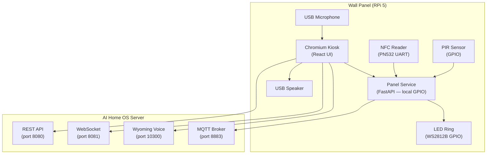

# Chapter 14 — Wall Panels

**AI Home OS Internal Design Specification**  
**Classification:** Internal — Engineering  
**Status:** Draft v1.0  
**Date:** 2026-07-17

---

## Table of Contents

1. [Overview](#1-overview)
2. [Design Philosophy](#2-design-philosophy)
3. [Hardware Platform](#3-hardware-platform)
4. [Panel Placement Strategy](#4-panel-placement-strategy)
5. [Physical Installation](#5-physical-installation)
6. [Software Stack](#6-software-stack)
7. [Panel Architecture](#7-panel-architecture)
8. [Idle / Ambient Display](#8-idle--ambient-display)
9. [Wake-on-Approach](#9-wake-on-approach)
10. [Screen: Room Control (Primary)](#10-screen-room-control-primary)
11. [Screen: JARVIS Voice Interface](#11-screen-jarvis-voice-interface)
12. [Screen: Scene Selector](#12-screen-scene-selector)
13. [Screen: Climate Control](#13-screen-climate-control)
14. [Screen: Energy Status](#14-screen-energy-status)
15. [Screen: Security Panel](#15-screen-security-panel)
16. [Screen: Who Is Home](#16-screen-who-is-home)
17. [Screen: Settings & Admin](#17-screen-settings--admin)
18. [Entry Panel (Front Door)](#18-entry-panel-front-door)
19. [Navigation Model](#19-navigation-model)
20. [Kiosk Mode Setup](#20-kiosk-mode-setup)
21. [Touch Interaction Design](#21-touch-interaction-design)
22. [Auto-Brightness & Night Mode](#22-auto-brightness--night-mode)
23. [NFC / RFID Integration](#23-nfc--rfid-integration)
24. [Multi-Panel Synchronisation](#24-multi-panel-synchronisation)
25. [Offline Mode](#25-offline-mode)
26. [Hardware BOM](#26-hardware-bom)
27. [Design Decisions & Trade-offs](#27-design-decisions--trade-offs)
28. [Risks](#28-risks)
29. [Future Improvements](#29-future-improvements)
30. [References](#30-references)

---

## 1. Overview

Wall panels are the **physical command centres** of AI Home OS — always-on, room-contextual, zero-latency touchscreens that control every aspect of the room they are installed in. Unlike the mobile app (used from anywhere), a wall panel is **aware of its physical location** and defaults its UI to the room it is mounted in.

Panels serve four distinct roles:

| Role | Description |
|------|-------------|
| **Room controller** | Lights, climate, scenes, blinds for this room |
| **JARVIS terminal** | Always-on voice + text interface to AI engine |
| **Home status hub** | Who is home, energy state, alerts, weather |
| **Entry authenticator** | Front door panel: face recognition, PIN entry, doorbell |

A home with 9 rooms (per the reference architecture) would deploy **7–9 panels** — one per main room plus a dedicated front-door entry panel.

---

## 2. Design Philosophy

### 2.1 Panel Design Principles

| Principle | Application |
|-----------|------------|
| **Instant readability** | State visible from 2 metres away. Large text, high contrast. |
| **Glanceable at night** | Dim ambient mode shows only essential info |
| **Zero-login room control** | Anyone in the room can control lights/climate without auth |
| **Auth for sensitive actions** | Alarm, cameras, user settings require face scan or PIN |
| **Context-aware default** | Panel shows controls for its own room by default |
| **No gradients** | Flat, solid colours only. No decorative elements. |
| **Portrait and landscape** | 10" panels: portrait for room controllers; landscape for energy/home status |

### 2.2 Colour Language (Panel-Specific)

```
Panel background:     #0A0A0D   (deeper black than mobile — panel is always lit)

Active indicator:     #2ECC71   (solid green)
Off indicator:        #2A2A35   (very dark — subtle, not distracting)
Alert:                #E74C3C   (solid red)
Warning:              #F39C12   (amber)
JARVIS accent:        #3498DB   (blue)
Energy/solar:         #F1C40F   (yellow)

Text on panel:
  Primary:            #FFFFFF
  Secondary:          #8888A0
  Dim (ambient mode): #404050
```

---

## 3. Hardware Platform

### 3.1 Primary Panel: Raspberry Pi 5 + Touchscreen

The recommended wall panel hardware is based on a Raspberry Pi 5 running a Chromium kiosk browser, connected to a PoE-powered IPS touchscreen:

| Component | Selection | Reason |
|-----------|----------|--------|
| **SBC** | Raspberry Pi 5 (4 GB) | Enough RAM for Chromium kiosk; good thermals; GPIO for extras |
| **Display** | Waveshare 10.1" IPS HDMI 1280×800 | IPS panel (wide viewing angle), VESA mountable, capacitive touch |
| **Touch controller** | Built-in USB HID (panel) | Plug-and-play with Raspberry Pi OS |
| **Power** | PoE+ Hat (Pi 5) + PoE switch port | Single Cat6A cable — power + data |
| **Audio** | USB speaker + mic (JST connector) | For JARVIS voice at the panel |
| **NFC reader** | PN532 (UART/SPI to Pi GPIO) | Tag reading for entry panels |
| **PIR sensor** | HC-SR501 to GPIO | Wake-on-approach |
| **LED indicator** | WS2812B strip (5 LEDs, VLAN 70 GPIO) | Ambient status ring around panel |
| **Enclosure** | Custom 3D-printed or aluminium flush mount | Clean wall integration |

### 3.2 Alternative Panel Options

| Option | Display | Cost | Use Case |
|--------|---------|------|---------|
| **Raspberry Pi 5 + Waveshare 10.1"** | 10" IPS 1280×800 | ~$180 | Standard room panel (recommended) |
| **Raspberry Pi 5 + 7" official** | 7" 800×480 | ~$100 | Small rooms, secondary panels |
| **Repurposed Android tablet** | Varies | ~$80–150 | Budget option; Android kiosk mode |
| **Loxone Touch** | 4.3" TFT | ~$280 | Premium option, integrated |
| **Crestron TSW-570** | 5.7" | ~$900 | Commercial / ultra-premium |
| **Amazon Fire HD 10** | 10" 1920×1200 | ~$150 | Very budget-friendly; limited GPIO |

### 3.3 Front-Door Entry Panel: Enhanced Hardware

The front door panel has additional hardware for authentication:

| Component | Model | Purpose |
|-----------|-------|---------|
| **Camera** | Arducam 12MP IMX708 | Local face recognition at entry |
| **IR illuminator** | 850nm LED array | Night-time face recognition |
| **NFC reader** | PN532 | Key fob / NFC card access |
| **Doorbell button** | Wired momentary switch to GPIO | Physical doorbell |
| **Electric lock** | Espressif ESP32 relay module | Lock/unlock via relay |
| **Speaker (external)** | Waterproof 5W speaker | JARVIS voice at entry |
| **Display** | Waveshare 7" IPS (IP54 rated) | Entry display |

---

## 4. Panel Placement Strategy

```
Home Layout — Panel Placement

Ground Floor:
  Front Door (Entry Panel)     ← Face recognition, keypad, doorbell
  Living Room (near entrance)  ← Main room controller
  Kitchen (backsplash wall)    ← Climate + appliances + recipes
  Entrance Hall (interior)     ← Who's home, security overview

First Floor:
  Master Bedroom (bedside)     ← Sleep controls, night mode, alarm
  Office (desk wall)           ← Work mode, DND, focus controls
  Bathroom (inside, waterproof) ← Climate, music, timer
  
Utility:
  Garage/Main electrical panel ← Energy overview, generator, EV charger
```

### 4.1 Panel Placement Rules

```
Standard room panels:
  - Mount at 145 cm from floor (adult eye level)
  - Adjacent to main light switch (replace or alongside)
  - Visible from primary seating position

Entry panel (front door):
  - Mount at 160 cm (camera at face height)
  - Exterior: weatherproof enclosure (IP54 minimum)
  - Illuminated at night (IR + white LED)

Bedroom panel:
  - Mount at 100 cm (usable from bed)
  - Lower brightness maximum (max 40% at night)
  - Auto-dim to ambient mode after 22:00
```

---

## 5. Physical Installation

### 5.1 In-Wall Wiring

```
Wall cavity:

  [Cat6A — PoE+]
       │
       ▼
  [PoE Splitter]
   │         │
  [Data]   [12V DC]
   │         │
  [Pi 5]   [Screen + Speaker]

  (Optional) 
  [Zigbee / Z-Wave stick → USB → Pi]
  [NFC → UART/SPI → Pi GPIO]
  [PIR → GPIO]
  [LED strip → GPIO PWM]
```

### 5.2 Network Configuration

Each wall panel joins **VLAN 70 (Voice/Panels)** and can only reach:
- AI server REST API (port 8080)
- AI server WebSocket (port 8081)
- Wyoming voice protocol (port 10300)
- MQTT broker (port 8883, TLS)
- DNS resolver (VLAN 10 gateway)

Wall panels have no internet access and cannot reach IoT devices directly.

---

## 6. Software Stack

| Layer | Technology | Reason |
|-------|-----------|--------|
| **OS** | Raspberry Pi OS Lite (64-bit) | Minimal; headless base |
| **Display server** | Wayfire (Wayland) | Lightweight, no compositor overhead |
| **Browser (kiosk)** | Chromium 124 (kiosk flags) | Web-based UI, auto-updates from server |
| **UI framework** | React 18 + Vite | Same ecosystem as mobile; fast HMR |
| **UI components** | Custom design system (no UI lib) | Full control over flat design |
| **State** | Zustand + SWR | Lightweight for panel |
| **WebSocket** | Native WebSocket | Live state updates |
| **Voice** | Web Speech API → Wyoming WebSocket | VAD + streaming |
| **Panel service** | Python (FastAPI) | Local GPIO control (PIR, LED, NFC) |
| **Auto-update** | Panel fetches UI from AI server at startup | Single source of truth for UI |

### 6.1 Chromium Kiosk Launch

```bash
#!/bin/bash
# /usr/local/bin/start-panel.sh
# Runs at boot via systemd

# Wait for network
until ping -c1 api.home.local &>/dev/null; do sleep 2; done

# Disable screen blanking
xset s off
xset -dpms
xset s noblank

# Start Chromium in kiosk mode
chromium-browser \
    --kiosk \
    --noerrdialogs \
    --disable-infobars \
    --no-first-run \
    --check-for-update-interval=31536000 \
    --disable-features=TranslateUI \
    --overscroll-history-navigation=0 \
    --disable-pinch \
    --disable-context-menu \
    --app="https://panel.home.local?room=${PANEL_ROOM_ID}&panel=${PANEL_ID}" \
    --window-size=1280,800 \
    --window-position=0,0
```

### 6.2 Panel Environment Configuration

```bash
# /etc/ai-home-os/panel.env
# Loaded by systemd — injected into browser URL at launch

PANEL_ROOM_ID=living_room
PANEL_ID=panel-living-room-01
PANEL_ROLE=room_controller    # room_controller | entry | energy | bedroom
```

---

## 7. Panel Architecture



---

## 8. Idle / Ambient Display

When no one is interacting with the panel, it switches to an **ambient display** after 60 seconds of inactivity. This shows essential information without blinding occupants at night.

### 8.1 Ambient Mode Wireframe (10" panel, portrait)

```
┌─────────────────────────────────────┐
│                                     │
│                                     │
│               14:23                 │ ← Large clock, primary
│            Thursday                 │
│           17 July 2026              │
│                                     │
│          ─────────────              │
│                                     │
│     🌡 24°C  💧 62%  420 ppm       │ ← Current room sensors
│                                     │
│     ☀ 3.4 kW   🔋 78%             │ ← Solar + battery summary
│                                     │
│     ● Ahmad  Living Room            │ ← Who is in this room
│     ● Sara   Kitchen                │
│                                     │
│                                     │
│         Sunny · 32°C outside        │
│                                     │
│                                     │
│  ┌─────────────────────────────┐   │
│  │    Touch or say "JARVIS"    │   │ ← Subtle prompt at bottom
│  └─────────────────────────────┘   │
└─────────────────────────────────────┘

Brightness: 5–15% (auto-dimmed by LDR)
Colours: dim whites/greys on near-black
Clock: 80px Bold, white
Sensor data: 20px, secondary colour (#8888A0)
```

### 8.2 Ambient Mode Implementation

```typescript
// src/components/AmbientDisplay.tsx

function AmbientDisplay({ room }: { room: Room }) {
  const [brightness, setBrightness] = useState(10);
  const time = useClock();               // Updates every minute
  const sensors = useRoomSensors(room.id);
  const energy = useEnergyLive();
  const presence = useHomePresence();

  // Ambient brightness controlled by time of day
  useEffect(() => {
    const hour = new Date().getHours();
    if (hour >= 22 || hour < 6)  setBrightness(3);   // Night: very dim
    else if (hour < 8)           setBrightness(8);   // Early morning
    else                         setBrightness(15);  // Daytime
  }, [time.hour]);

  return (
    <View style={[styles.ambient, { opacity: brightness / 100 }]}>
      <Text style={styles.clockTime}>
        {time.format('HH:mm')}
      </Text>
      <Text style={styles.clockDate}>
        {time.format('dddd · D MMMM YYYY')}
      </Text>

      <Divider />

      <SensorRow icon="thermometer" value={`${sensors.temp_c}°C`} />
      <SensorRow icon="droplets"   value={`${sensors.humidity}%`} />
      <SensorRow icon="wind"       value={`${sensors.co2_ppm} ppm CO₂`} />

      <Divider />

      <EnergyRow solar={energy.solar_w} battery={energy.battery_soc} />

      <PresenceList persons={presence.persons_home.slice(0, 3)} />

      <TouchPrompt />
    </View>
  );
}
```

---

## 9. Wake-on-Approach

### 9.1 PIR-Based Wake

The PIR sensor wakes the panel when motion is detected within 2–3 metres:

```python
# panel_service/gpio_controller.py

import RPi.GPIO as GPIO
import asyncio
import httpx

PIR_PIN = 17   # BCM GPIO 17

class PIRController:
    def __init__(self):
        GPIO.setmode(GPIO.BCM)
        GPIO.setup(PIR_PIN, GPIO.IN)
        self.panel_awake = False

    def start(self):
        GPIO.add_event_detect(
            PIR_PIN,
            GPIO.RISING,
            callback=self._on_motion,
            bouncetime=2000
        )

    def _on_motion(self, channel):
        if not self.panel_awake:
            asyncio.create_task(self._wake_panel())

    async def _wake_panel(self):
        """POST to the panel's local browser service to exit ambient mode."""
        async with httpx.AsyncClient() as client:
            await client.post('http://localhost:3001/api/wake')
        self.panel_awake = True

        # Auto-sleep after 60s of no touch
        await asyncio.sleep(60)
        await self._sleep_panel()

    async def _sleep_panel(self):
        async with httpx.AsyncClient() as client:
            await client.post('http://localhost:3001/api/sleep')
        self.panel_awake = False
```

### 9.2 Face Recognition on Approach

When the panel wakes, it requests a face recognition check to personalise the UI:

```typescript
// Wake event received from PIR service
async function onPanelWake() {
  setMode('active');

  // Request face scan to identify who approached
  const scan = await api.requestFaceScan({ camera: 'panel', room: PANEL_ROOM_ID });

  if (scan.person) {
    setCurrentUser(scan.person);
    showPersonalisedGreeting(scan.person);
  } else {
    setCurrentUser(null);  // Unknown person — show public controls only
  }
}

function showPersonalisedGreeting(person: Person) {
  // Context-aware greeting
  const hour = new Date().getHours();
  const greeting = hour < 12 ? 'Good morning' : hour < 17 ? 'Good afternoon' : 'Good evening';

  setGreeting(`${greeting}, ${person.name}.`);
  setTimeout(() => setGreeting(null), 5000);
}
```

---

## 10. Screen: Room Control (Primary)

This is the default screen shown when the panel wakes. It shows all controllable elements in the current room.

### 10.1 Room Control Wireframe (10" Portrait)

```
┌─────────────────────────────────────┐
│  Living Room             14:23  ⚙  │
│  ● Ahmad  ·  24°C  ·  62%  ·  420  │
│                                     │
│  Lights                   All off  │
│  ┌────────────┐  ┌────────────┐    │
│  │  Main      │  │  Lamp      │    │
│  │  ●  ON     │  │  ●  ON     │    │
│  │  ████████░ │  │  ██████████│    │  ← brightness bar (flat)
│  │  75%       │  │  100%      │    │
│  └────────────┘  └────────────┘    │
│  ┌────────────┐  ┌────────────┐    │
│  │  Ceiling   │  │  Bookcase  │    │
│  │  ○  OFF    │  │  ○  OFF    │    │
│  │  ░░░░░░░░░ │  │  ░░░░░░░░░ │    │
│  └────────────┘  └────────────┘    │
│                                     │
│  Climate                            │
│  ┌─────────────────────────────┐   │
│  │  A/C  ● Cooling  [−] 23 [+]│   │
│  │  ████████████░░░░  Fan: Auto│   │
│  └─────────────────────────────┘   │
│                                     │
│  Scenes                             │
│  ┌──────┐ ┌──────┐ ┌──────┐ ┌────┐│
│  │Movie │ │Dinner│ │Relax │ │OFF ││
│  └──────┘ └──────┘ └──────┘ └────┘│
│                                     │
│  ┌───────────────────────────────┐ │
│  │  🎤  Say a command...         │ │
│  └───────────────────────────────┘ │
│                                     │
│ [Room] [JARVIS] [Energy] [Security] │
└─────────────────────────────────────┘
```

### 10.2 Room Control Implementation

```typescript
// src/screens/RoomControlScreen.tsx

export function RoomControlScreen() {
  const roomId = usePanelConfig().roomId;

  const { data: room } = useSWR(`/v1/rooms/${roomId}`, fetcher, {
    refreshInterval: 30000
  });
  const { data: devices } = useSWR(`/v1/rooms/${roomId}/devices`, fetcher);
  const liveStates = useWebSocketStore(s => s.deviceStates);

  const lights = devices?.filter(d => d.type === 'light') ?? [];
  const climate = devices?.find(d => d.type === 'climate');
  const scenes = room?.scenes ?? [];

  return (
    <View style={styles.screen}>
      <RoomHeader
        name={room?.name}
        occupancy={room?.occupancy}
        sensors={room?.sensors}
      />

      <Section title="Lights" action={<AllOffButton roomId={roomId} />}>
        <DeviceGrid devices={lights} liveStates={liveStates} columns={2} />
      </Section>

      {climate && (
        <Section title="Climate">
          <ClimateCard device={climate} liveState={liveStates[climate.device_id]} />
        </Section>
      )}

      <Section title="Scenes">
        <SceneRow scenes={scenes} onScenePress={activateScene} />
      </Section>

      <VoiceCommandBar roomId={roomId} />

      <BottomNav activeTab="room" />
    </View>
  );
}
```

### 10.3 Device Tile Component

```typescript
// Large, finger-friendly device tile optimised for touchscreen
function DeviceTile({ device, liveState, onPress, onLongPress }: DeviceTileProps) {
  const state = liveState ?? device.state;
  const isOn = state?.on === true || state?.state === 'on';

  return (
    <TouchableOpacity
      style={[styles.tile, isOn ? styles.tileOn : styles.tileOff]}
      onPress={onPress}
      onLongPress={onLongPress}
      activeOpacity={0.7}
      accessibilityRole="button"
      accessibilityLabel={`${device.name}, ${isOn ? 'on' : 'off'}`}
    >
      <DeviceIcon type={device.type} active={isOn} size={32} />
      <Text style={[styles.tileName, !isOn && styles.textDim]}>
        {device.name}
      </Text>
      <View style={styles.tileStatus}>
        <View style={[styles.dot, { backgroundColor: isOn ? '#2ECC71' : '#2A2A35' }]} />
        <Text style={styles.stateText}>{isOn ? 'ON' : 'OFF'}</Text>
      </View>
      {isOn && device.capabilities.includes('brightness') && (
        <BrightnessBar value={state.brightness ?? 100} />
      )}
    </TouchableOpacity>
  );
}

// Brightness bar — flat horizontal fill
function BrightnessBar({ value }: { value: number }) {
  return (
    <View style={styles.brightnessTrack}>
      <View style={[styles.brightnessFill, { width: `${value}%`, backgroundColor: '#F1C40F' }]} />
    </View>
  );
}
```

---

## 11. Screen: JARVIS Voice Interface

The JARVIS screen on a wall panel is designed to be spoken to from across the room. It features large text for readability at distance.

### 11.1 JARVIS Voice Screen Wireframe

```
┌─────────────────────────────────────┐
│  ←  Living Room             14:23  │
│                                     │
│                                     │
│    ┌─────────────────────────┐     │
│    │                         │     │
│    │        JARVIS           │     │  ← Large panel display
│    │                         │     │
│    └─────────────────────────┘     │
│                                     │
│   ●  Listening...                   │  ← State indicator
│                                     │
│   ┌─────────────────────────────┐  │
│   │  "Turn off all lights and   │  │  ← Live transcript, large font
│   │   set temperature to 22°C"  │  │
│   └─────────────────────────────┘  │
│                                     │
│   ─────────────────────────────    │
│                                     │
│   JARVIS:                           │
│   ┌─────────────────────────────┐  │
│   │  Done. Lights off. A/C set  │  │  ← Response, large font
│   │  to 22°C — cooling now.     │  │
│   └─────────────────────────────┘  │
│                                     │
│                                     │
│ [Room] [JARVIS] [Energy] [Security] │
└─────────────────────────────────────┘

Voice always active on JARVIS tab — no tap-to-speak needed
Wake word: "JARVIS" (openWakeWord via ESP32 satellite OR panel mic)
Activation: openWakeWord detects → Wyoming streams audio → STT → AI engine
```

### 11.2 Panel Voice Service

```typescript
// Panel connects to Wyoming voice protocol on AI server
class PanelVoiceService {
  private ws: WebSocket | null = null;
  private mediaRecorder: MediaRecorder | null = null;

  async startListening() {
    const stream = await navigator.mediaDevices.getUserMedia({
      audio: {
        sampleRate: 16000,
        channelCount: 1,
        echoCancellation: true,
        noiseSuppression: true,
      }
    });

    // Connect to Wyoming (voice protocol) on AI server
    this.ws = new WebSocket(`wss://api.home.local/v1/voice/stream?panel=${PANEL_ID}`);

    this.ws.onopen = () => {
      // Start streaming audio chunks
      this.mediaRecorder = new MediaRecorder(stream, { mimeType: 'audio/webm;codecs=opus' });
      this.mediaRecorder.ondataavailable = (e) => {
        if (this.ws?.readyState === WebSocket.OPEN && e.data.size > 0) {
          this.ws.send(e.data);
        }
      };
      this.mediaRecorder.start(100);  // 100ms chunks
    };

    this.ws.onmessage = (event) => {
      const msg = JSON.parse(event.data);
      switch (msg.type) {
        case 'transcript':
          useVoiceStore.setState({ transcript: msg.text, state: 'processing' });
          break;
        case 'response':
          useVoiceStore.setState({
            response: msg.response_text,
            state: 'speaking',
            transcript: msg.input_text
          });
          this.playAudio(msg.audio_url);
          break;
        case 'done':
          useVoiceStore.setState({ state: 'idle' });
          break;
      }
    };
  }

  private playAudio(url: string) {
    const audio = new Audio(url);
    audio.play();
  }
}
```

---

## 12. Screen: Scene Selector

### 12.1 Scene Selector Wireframe (Full-screen overlay)

```
┌─────────────────────────────────────┐
│  ✕  Scenes — Living Room           │
│                                     │
│  ┌─────────────┐  ┌─────────────┐  │
│  │             │  │             │  │
│  │   🎬 Movie  │  │  🍽 Dinner  │  │
│  │             │  │             │  │
│  │  Dim 20%    │  │  Warm 60%   │  │
│  │  Warm 2700K │  │  3000K      │  │
│  └─────────────┘  └─────────────┘  │
│                                     │
│  ┌─────────────┐  ┌─────────────┐  │
│  │             │  │             │  │
│  │   😌 Relax  │  │   📖 Read   │  │
│  │             │  │             │  │
│  │  40% warm   │  │  70% cool   │  │
│  │  2700K      │  │  4000K      │  │
│  └─────────────┘  └─────────────┘  │
│                                     │
│  ┌─────────────┐  ┌─────────────┐  │
│  │             │  │             │  │
│  │  ☀ Bright  │  │   ⚫ All Off │  │
│  │             │  │             │  │
│  │  100% 5000K │  │  Everything │  │
│  └─────────────┘  └─────────────┘  │
│                                     │
│  [+ Create scene]                   │
│                                     │
└─────────────────────────────────────┘

Tile size: 180×160px — large for easy finger tap
Active scene: solid green border
```

---

## 13. Screen: Climate Control

### 13.1 Climate Control Wireframe

```
┌─────────────────────────────────────┐
│  ←  Climate — Living Room           │
│                                     │
│  ┌─────────────────────────────┐   │
│  │  Air Conditioning           │   │
│  │                             │   │
│  │  ● COOLING                  │   │
│  │                             │   │
│  │            23               │   │  ← Large setpoint temperature
│  │           ──°C──            │   │
│  │                             │   │
│  │   [  −  ]          [  +  ] │   │  ← Large +/− buttons (48px)
│  │                             │   │
│  │  Current: 24.2°C            │   │
│  │  Target:  23.0°C            │   │
│  │  Cooling to target...       │   │
│  │                             │   │
│  │  Fan:   [Auto] [Low] [High] │   │
│  │  Mode:  [Cool] [Heat] [Fan] │   │
│  │                             │   │
│  │  Schedule                   │   │
│  │  22:00 → Off (sleep mode)   │   │
│  │  06:30 → 22°C (weekdays)    │   │
│  │                   [Manage]  │   │
│  └─────────────────────────────┘   │
│                                     │
│  Room Sensors                       │
│  ┌─────────────────────────────┐   │
│  │  Temp:  24.2°C              │   │
│  │  Humid: 62%                 │   │
│  │  CO₂:   418 ppm  ● Normal   │   │
│  └─────────────────────────────┘   │
└─────────────────────────────────────┘
```

---

## 14. Screen: Energy Status

The energy screen on the wall panel gives a real-time view of home energy flows — ideal for the kitchen or main living area.

### 14.1 Energy Panel Wireframe (Landscape 10")

```
┌──────────────────────────────────────────────────────────────────┐
│  Energy                                           14:23  Thu 17  │
│                                                                   │
│  ┌──────────────┐  ┌──────────────┐  ┌──────────────┐           │
│  │  ☀ SOLAR     │  │  🔋 BATTERY  │  │  ⚡ GRID      │           │
│  │              │  │              │  │              │           │
│  │   3.4 kW     │  │    78%       │  │  −0.8 kW     │           │
│  │              │  │  ██████████░ │  │  Exporting   │           │
│  │  14.7 today  │  │  10.5 kWh    │  │  0.3 kWh exp │           │
│  └──────────────┘  └──────────────┘  └──────────────┘           │
│                                                                   │
│  Home consuming  1.8 kW                                          │
│                                                                   │
│  ──────────────────────────────────────────────────────────────  │
│                                                                   │
│  Generation today                   Consuming now                 │
│   kW                                HVAC:      0.9 kW            │
│   6│  ████                          Kitchen:   0.4 kW            │
│   4│ ██  ██                         Lights:    0.3 kW            │
│   2│██    ██                        Other:     0.2 kW            │
│   0└────────────── →                                             │
│     6  9  12  15  18                                             │
│                                                                   │
│  EV   ████████████░░░░   78% · Charging 3.4 kW · Ready 06:45    │
└──────────────────────────────────────────────────────────────────┘
```

---

## 15. Screen: Security Panel

### 15.1 Security Panel Wireframe

```
┌─────────────────────────────────────┐
│  Security                    14:23  │
│                                     │
│  ALARM                              │
│  ┌─────────────────────────────┐   │
│  │  ● ARMED — HOME             │   │  ← Current state, large
│  │                             │   │
│  │  [  Disarm  ]  [  Away  ]   │   │  ← Action buttons
│  │  (PIN required)             │   │
│  └─────────────────────────────┘   │
│                                     │
│  Alerts  (1 active)                 │
│  ┌─────────────────────────────┐   │
│  │  ⚠ MEDIUM                  │   │
│  │  Unknown IoT device — 09:11 │   │
│  │  [View]  [Acknowledge]      │   │
│  └─────────────────────────────┘   │
│                                     │
│  Cameras                            │
│  ┌────────────┐  ┌────────────┐    │
│  │ Front Door │  │  Garage    │    │
│  │ [preview]  │  │ [preview]  │    │
│  │ ● Idle     │  │ ● Motion   │    │
│  └────────────┘  └────────────┘    │
│                                     │
│  Locks                              │
│  Front Door  ●Locked    [Unlock]    │
│  Garage Door ●Locked    [Unlock]    │
│                                     │
│ [Room] [JARVIS] [Energy] [Security] │
└─────────────────────────────────────┘
```

### 15.2 Alarm Control with PIN Entry

Security actions on the panel always require a PIN or face recognition:

```typescript
function AlarmControl({ alarm }: { alarm: AlarmState }) {
  const [showPIN, setShowPIN] = useState(false);
  const [pendingAction, setPendingAction] = useState<AlarmAction | null>(null);

  const requestAlarmAction = (action: AlarmAction) => {
    setPendingAction(action);
    setShowPIN(true);
  };

  const onPINComplete = async (pin: string) => {
    setShowPIN(false);
    try {
      await api.alarmAction(pendingAction!, { pin });
    } catch (e: any) {
      showError(e.message);
    }
  };

  if (showPIN) {
    return (
      <PINEntryOverlay
        prompt={`Enter PIN to ${pendingAction}`}
        onComplete={onPINComplete}
        onCancel={() => setShowPIN(false)}
      />
    );
  }

  return (
    <View style={styles.alarmCard}>
      <AlarmStateBadge state={alarm.state} />
      <AlarmActionButtons
        onDisarm={() => requestAlarmAction('disarm')}
        onArmHome={() => requestAlarmAction('arm_home')}
        onArmAway={() => requestAlarmAction('arm_away')}
      />
    </View>
  );
}

// Large PIN pad optimised for touchscreen
function PINEntryOverlay({ prompt, onComplete, onCancel }: PINProps) {
  const [digits, setDigits] = useState<string[]>([]);

  const addDigit = (d: string) => {
    const next = [...digits, d];
    if (next.length === 4) {
      onComplete(next.join(''));
    } else {
      setDigits(next);
    }
  };

  return (
    <Modal transparent animationType="fade">
      <View style={styles.pinOverlay}>
        <Text style={styles.pinPrompt}>{prompt}</Text>
        <PINDots filled={digits.length} total={4} />
        <NumPad onPress={addDigit} onBackspace={() => setDigits(d => d.slice(0, -1))} />
        <TouchableOpacity onPress={onCancel}>
          <Text style={styles.cancel}>Cancel</Text>
        </TouchableOpacity>
      </View>
    </Modal>
  );
}

// 3×4 number grid — 80×80px keys for reliable finger press
function NumPad({ onPress, onBackspace }: NumPadProps) {
  const keys = ['1','2','3','4','5','6','7','8','9','','0','⌫'];
  return (
    <View style={styles.numpad}>
      {keys.map((k, i) => (
        k === '' ? <View key={i} style={styles.numpadSpacer} /> :
        k === '⌫' ? (
          <TouchableOpacity key={i} style={styles.numpadKey} onPress={onBackspace}>
            <Text style={styles.numpadKeyText}>⌫</Text>
          </TouchableOpacity>
        ) : (
          <TouchableOpacity key={i} style={styles.numpadKey} onPress={() => onPress(k)}>
            <Text style={styles.numpadKeyText}>{k}</Text>
          </TouchableOpacity>
        )
      ))}
    </View>
  );
}
```

---

## 16. Screen: Who Is Home

A dedicated full-screen presence overview — useful mounted in entrance hall or main living area.

### 16.1 Who Is Home Wireframe

```
┌─────────────────────────────────────┐
│  Who's Home                  14:23  │
│                                     │
│  ● HOME (2 people)                  │
│                                     │
│  ┌─────────────────────────────┐   │
│  │  ●  Ahmad                   │   │
│  │     Office · since 09:00    │   │
│  │     Working                 │   │
│  └─────────────────────────────┘   │
│                                     │
│  ┌─────────────────────────────┐   │
│  │  ●  Sara                    │   │
│  │     Kitchen · since 13:30   │   │
│  │     Cooking                 │   │
│  └─────────────────────────────┘   │
│                                     │
│  ─── AWAY ───────────────────────   │
│                                     │
│  ┌─────────────────────────────┐   │
│  │  ⚫  Khalid                  │   │
│  │     Last home: 3 hrs ago    │   │
│  └─────────────────────────────┘   │
│                                     │
│  ─── GUESTS ──────────────────────  │
│  ┌─────────────────────────────┐   │
│  │  🔵  John                   │   │
│  │     Visiting · Guest zone   │   │
│  │     Access until 23:00      │   │
│  └─────────────────────────────┘   │
│                                     │
│ [Room] [JARVIS] [Energy] [Security] │
└─────────────────────────────────────┘
```

---

## 17. Screen: Settings & Admin

Admin access requires face recognition or owner PIN.

### 17.1 Settings Screen Wireframe

```
┌─────────────────────────────────────┐
│  Panel Settings              [✓]   │
│  ●  Ahmad (Owner)                   │
│                                     │
│  This Panel                         │
│  Room:         Living Room     →    │
│  Panel ID:     panel-lr-01          │
│  Brightness:   [AUTO]  [+] 80 [-]  │
│  Sleep after:  60 seconds      →    │
│  Wake by PIR:  ● ON                 │
│                                     │
│  Display                            │
│  Theme:        ● Dark  ○ Light      │
│  Clock format: ● 24h  ○ 12h        │
│                                     │
│  Voice                              │
│  Wake word:    ● JARVIS             │
│  Microphone:   ● Enabled            │
│  Volume:       [──●──────]  65%    │
│                                     │
│  Panel Info                         │
│  OS:       RPi OS 64-bit           │
│  UI ver:   1.0.0 (fetched live)    │
│  IP:       192.168.70.12           │
│  Connected: ● Yes                   │
│                                     │
│  [Restart Panel]  [Factory Reset]   │
│                                     │
└─────────────────────────────────────┘
```

---

## 18. Entry Panel (Front Door)

The entry panel is the most capable panel in the system. It manages access control, video doorbell, and guest registration.

### 18.1 Entry Panel Idle Screen

```
┌─────────────────────────────────────┐
│                                     │
│                                     │
│                                     │
│           AI Home OS                │
│                                     │
│         Good afternoon.             │
│                                     │
│                                     │
│    ┌─────────────────────────┐     │
│    │   Approach to unlock    │     │  ← Face recognition prompt
│    │   or enter your PIN     │     │
│    └─────────────────────────┘     │
│                                     │
│         [  Enter PIN  ]             │
│                                     │
│         [ 🔔 Ring Bell ]            │
│                                     │
│                                     │
│  ─────────────────────────────     │
│  For deliveries:  [ Leave Package ] │
│                                     │
└─────────────────────────────────────┘
```

### 18.2 Entry Panel: Face Recognition Flow

```
Face Recognised → Known Person:
┌─────────────────────────────────────┐
│                                     │
│         Welcome back, Ahmad!        │
│                                     │
│    ●●●●●●●●●●  Unlocking...         │
│                                     │
│    Front door unlocked.             │
│                                     │
│    [  Skip unlock  ]                │
└─────────────────────────────────────┘

Face Recognised → Unknown Person:
┌─────────────────────────────────────┐
│                                     │
│      Hello. Please enter PIN        │
│      or ring the doorbell.          │
│                                     │
│    [  Enter PIN  ]                  │
│                                     │
│    [ 🔔 Ring Doorbell ]             │
│                                     │
└─────────────────────────────────────┘
```

### 18.3 Doorbell Handler

```typescript
// Entry panel doorbell tap
async function onDoorbellPress() {
  // 1. Sound chime on all inside speakers via MQTT
  await mqtt.publish('ai/command', JSON.stringify({
    action: 'announce_doorbell',
    parameters: { sound: 'chime', message: 'Someone is at the front door.' }
  }));

  // 2. Trigger camera event (capture + face detection)
  await api.triggerCameraCapture({ camera: 'front_door', save: true });

  // 3. Send push notification to all household members
  await api.broadcastNotification({
    title: 'Doorbell',
    body: 'Someone is at the front door.',
    data: { screen: 'SecurityCameras', camera_id: 'front_door' },
    category: 'doorbell',
    image_url: '/api/cameras/front_door/snapshot'
  });

  // 4. Show visual confirmation on entry panel
  setDoorbellRung(true);
  setTimeout(() => setDoorbellRung(false), 5000);
}
```

### 18.4 Guest Registration at Entry Panel

```
Delivery / Visitor Flow:

1. Visitor presses "Ring Bell"
2. Panel shows: "JARVIS: Good afternoon. How can I help?"
3. Visitor says "Delivery for Ahmad"
4. JARVIS notifies Ahmad on mobile/speakers
5. Ahmad responds via mobile: "Let them in, 5 minutes access"
6. Panel: "Please wait — Ahmad will buzz you in shortly."
7. Ahmad taps "Unlock" on mobile → door opens
8. Guest log created
```

---

## 19. Navigation Model

```
Panel Navigation (Bottom Tab Bar — 4 tabs)

Always visible in full brightness:
┌──────────┬──────────┬──────────┬──────────┐
│  Room    │  JARVIS  │  Energy  │ Security │
│  [icon]  │  [mic]   │  [bolt]  │ [shield] │
└──────────┴──────────┴──────────┴──────────┘

Tab behaviours:
  Room:     Defaults to this panel's room. Tap again → all rooms list.
  JARVIS:   Opens full-screen voice interface. Microphone auto-activates.
  Energy:   Live energy flows + today's summary.
  Security: Alarm state + cameras + active alerts.

Gestures:
  Swipe left/right:   Navigate between main tabs
  Swipe up from any:  Quick shortcut overlay (scenes, all-off, away mode)
  Long-press device:  Device settings / schedule

Quick Shortcut Overlay (swipe up):
┌─────────────────────────────────────┐
│  Quick Actions                  [✕]│
│                                     │
│  [All lights off]  [Away mode]     │
│  [Movie scene  ]  [Goodnight]      │
│  [Guest access ]  [Energy save]    │
│                                     │
└─────────────────────────────────────┘
```

---

## 20. Kiosk Mode Setup

### 20.1 Raspberry Pi OS Hardening for Kiosk

```bash
# /etc/ai-home-os/setup-kiosk.sh

# 1. Disable screen saver (handled by our PIR service instead)
sudo raspi-config nonint do_blanking 1

# 2. Configure auto-login to panel user (non-root, no sudo)
sudo raspi-config nonint do_boot_behaviour B2   # Desktop autologin disabled
# Create panel user
sudo useradd -m -s /bin/bash panel
sudo usermod -aG video,audio,gpio panel

# 3. Disable unnecessary services
sudo systemctl disable bluetooth
sudo systemctl disable avahi-daemon
sudo systemctl disable cups

# 4. Read-only filesystem for root (panel state in tmpfs)
# /boot/cmdline.txt: add ro
# /etc/fstab: tmpfs overlays for /var/log, /tmp, /var/tmp

# 5. Watchdog (auto-restart Chromium if it crashes)
sudo systemctl enable watchdog
echo "RuntimeWatchdogSec=15" | sudo tee -a /etc/systemd/system.conf

# 6. Auto-update panel UI (fetched from server, not local files)
# Panel always loads: https://panel.home.local/kiosk
# UI is served by the AI server — single deployment updates all panels

# 7. Prevent right-click and context menus (done in Chromium flags)
# --disable-features=ContextMenus (set in launch script)
```

### 20.2 Systemd Service

```ini
# /etc/systemd/system/ai-panel.service

[Unit]
Description=AI Home OS Panel UI
After=network-online.target
Wants=network-online.target

[Service]
Type=simple
User=panel
Environment=DISPLAY=:0
Environment=PANEL_ROOM_ID=living_room
Environment=PANEL_ID=panel-lr-01
ExecStartPre=/bin/sleep 5
ExecStart=/usr/local/bin/start-panel.sh
Restart=always
RestartSec=5
StandardOutput=journal
StandardError=journal

[Install]
WantedBy=graphical.target
```

```ini
# /etc/systemd/system/ai-panel-service.service (Python GPIO service)

[Unit]
Description=AI Home OS Panel GPIO Service
After=network.target

[Service]
Type=simple
User=root
ExecStart=/usr/bin/python3 /opt/ai-panel/panel_service/main.py
Restart=always
RestartSec=3

[Install]
WantedBy=multi-user.target
```

---

## 21. Touch Interaction Design

### 21.1 Touch Target Specifications

```
Touch target minimum sizes (IEC 62366 / Apple HIG):

  Standard button:        minimum 48×48 px at 160 DPI
  Primary action button:  minimum 64×64 px
  Toggle switch:          minimum 48×32 px
  Slider thumb:           minimum 44×44 px (finger-friendly)
  Number pad key:         80×80 px (large for security contexts)
  Device tile:            entire tile tappable (180×160 px)

Spacing between touch targets:
  Minimum 8 px between adjacent interactive elements
  Preferred 16 px for daily-use controls

Response feedback:
  Visual: opacity change on press (0.7 opacity)
  No haptic (RPi lacks haptic engine; Android tablets may have it)
  State change: immediate optimistic update
```

### 21.2 Gesture Handling

```typescript
// Swipe gestures for quick navigation
import { GestureDetector, Gesture } from 'react-native-gesture-handler';

function PanelGestureWrapper({ children }) {
  const swipeLeft = Gesture.Pan()
    .onEnd((event) => {
      if (event.velocityX < -500 && Math.abs(event.velocityX) > Math.abs(event.velocityY)) {
        navigation.navigate('next-tab');
      }
    });

  const swipeUp = Gesture.Pan()
    .onEnd((event) => {
      if (event.velocityY < -500 && Math.abs(event.velocityY) > Math.abs(event.velocityX)) {
        showQuickActions();
      }
    });

  const composed = Gesture.Simultaneous(swipeLeft, swipeUp);

  return (
    <GestureDetector gesture={composed}>
      {children}
    </GestureDetector>
  );
}
```

---

## 22. Auto-Brightness & Night Mode

### 22.1 LDR-Based Brightness Control

```python
# panel_service/brightness_controller.py
# Uses MCP3008 ADC to read LDR light level → controls screen brightness

import spidev
import subprocess

class BrightnessController:
    MAX_BRIGHTNESS = 255
    MIN_BRIGHTNESS = 10     # Never fully off (ambient clock still visible)
    NIGHT_MAX = 40          # Night mode ceiling (22:00–06:00)

    def __init__(self):
        self.spi = spidev.SpiDev()
        self.spi.open(0, 0)
        self.spi.max_speed_hz = 1350000

    def read_ldr(self, channel: int = 0) -> int:
        """Read 10-bit ADC value from LDR (0 = dark, 1023 = bright)."""
        adc = self.spi.xfer2([1, (8 + channel) << 4, 0])
        return ((adc[1] & 3) << 8) + adc[2]

    async def auto_adjust(self):
        """Run periodically — adjust screen brightness to ambient light."""
        from datetime import datetime
        hour = datetime.now().hour
        is_night = hour >= 22 or hour < 6

        ldr_value = self.read_ldr()

        # Map LDR to brightness (0–1023 → MIN–MAX)
        raw_brightness = int(
            self.MIN_BRIGHTNESS +
            (ldr_value / 1023) * (self.MAX_BRIGHTNESS - self.MIN_BRIGHTNESS)
        )

        # Apply night mode ceiling
        max_allowed = self.NIGHT_MAX if is_night else self.MAX_BRIGHTNESS
        brightness = min(raw_brightness, max_allowed)

        # Apply via Raspberry Pi screen backlight
        subprocess.run([
            'bash', '-c',
            f'echo {brightness} > /sys/class/backlight/rpi_backlight/brightness'
        ])
```

---

## 23. NFC / RFID Integration

### 23.1 NFC Tag Actions

NFC tags placed near the panel or at entry points can trigger automations:

| Tag Location | Action |
|-------------|--------|
| Front door panel | Authenticate user (RFID card → identity check) |
| Bedside | Activate night mode |
| Kitchen | Start morning routine |
| Exit point | Activate away mode |

```python
# panel_service/nfc_controller.py

import board
from adafruit_pn532.uart import PN532_UART

class NFCController:
    def __init__(self):
        uart = board.UART()
        self.pn532 = PN532_UART(uart, debug=False)
        self.pn532.SAM_configuration()

    async def poll(self):
        """Poll for NFC tags. When found, look up in registry and trigger action."""
        while True:
            uid = self.pn532.read_passive_target(timeout=0.5)
            if uid:
                uid_hex = uid.hex()
                await self._handle_tag(uid_hex)
            await asyncio.sleep(0.1)

    async def _handle_tag(self, uid_hex: str):
        """Resolve tag UID to action and dispatch."""
        async with httpx.AsyncClient() as client:
            # Lookup tag in home server registry
            resp = await client.post(
                'https://api.home.local/v1/nfc/scan',
                json={
                    'uid': uid_hex,
                    'panel_id': PANEL_ID,
                    'room_id': PANEL_ROOM_ID,
                },
                headers={'Authorization': f'Bearer {PANEL_TOKEN}'}
            )
        if resp.status_code == 200:
            result = resp.json()['data']
            # Flash LED to confirm
            await led_controller.flash(color='green', count=2)
```

---

## 24. Multi-Panel Synchronisation

All panels share live state via the WebSocket API. When a device is controlled from any panel, all other panels update within 200 ms.

```typescript
// State synchronisation via shared WebSocket store
// All panels connect to the same WebSocket hub → same event stream

// Panel A: User turns on living room lights
await api.updateDeviceState('light.living_room_main', { state: 'on', brightness: 80 });

// WebSocket event flows:
//   1. API updates HA → HA fires state_changed
//   2. HA bridge forwards to MQTT
//   3. WebSocket hub broadcasts to ALL connected panels
//   4. Panel B (kitchen) receives 'devices.state_changed' event
//   5. Panel B's Zustand store updates deviceStates['light.living_room_main']
//   6. Panel B's UI re-renders (if that device is visible)
// Total: < 200 ms

// Conflict resolution: Last Write Wins (LWW) with server timestamp
// Server always authoritative — panels optimistically update but
// reconcile with server state on next WebSocket event
```

---

## 25. Offline Mode

If the panel loses connection to the AI server (network issue, server restart):

```typescript
// Panel offline behaviour
function useConnectionState() {
  const [serverReachable, setServerReachable] = useState(true);
  const [wsConnected, setWsConnected] = useState(true);

  // Show offline banner when disconnected
  // Allow viewing cached device states
  // Disable voice commands (require server)
  // Disable camera feeds (require server)
  // Allow local scene activation via MQTT direct (if MQTT reachable)

  return { serverReachable, wsConnected };
}

// Offline banner
function ConnectionBanner() {
  const { serverReachable } = useConnectionState();
  if (serverReachable) return null;
  return (
    <View style={styles.offlineBanner}>
      <Text style={styles.offlineText}>
        Offline — showing last known state
      </Text>
    </View>
  );
}
```

**Offline capability matrix:**

| Feature | Behaviour when offline |
|---------|----------------------|
| View device states | Shows last WebSocket snapshot |
| Light/device control | Attempt MQTT direct (if broker reachable) |
| Climate control | Attempt MQTT direct |
| Voice commands | Disabled — "Server unavailable" |
| Camera feeds | Disabled |
| Alarm control | Disabled (safety policy) |
| Ambient clock | Always works (local) |
| Scene activation | Attempt MQTT direct |

---

## 26. Hardware BOM

### 26.1 Standard Room Panel (×7)

| Component | Model | Unit $ | ×7 Total $ |
|-----------|-------|--------|-----------|
| **SBC** | Raspberry Pi 5 (4 GB) | $60 | $420 |
| **Display** | Waveshare 10.1" IPS HDMI Touch | $75 | $525 |
| **PoE+ Hat** | Waveshare PoE HAT (E) for Pi 5 | $25 | $175 |
| **USB Speaker + Mic** | Jabra Speak2 40 (compact) | $60 | $420 |
| **PIR Sensor** | HC-SR501 | $3 | $21 |
| **MicroSD** | SanDisk Industrial 32GB | $15 | $105 |
| **Enclosure** | Custom 3D print or aluminium flush | $20 | $140 |
| **Cat6A Patch (in wall)** | — | $5 | $35 |
| **LED ring** | WS2812B strip (5 pixels + diffuser) | $5 | $35 |

**Room panel subtotal: ~$1,876** (7 panels)

---

### 26.2 Front Door Entry Panel (×1)

| Component | Model | Unit $ |
|-----------|-------|--------|
| **SBC** | Raspberry Pi 5 (4 GB) | $60 |
| **Display** | Waveshare 7" IPS (IP54 rated) | $55 |
| **Camera** | Arducam 12MP IMX708 | $35 |
| **IR illuminator** | 850nm LED array | $15 |
| **NFC reader** | Adafruit PN532 breakout | $40 |
| **PoE+ Hat** | Waveshare PoE HAT (E) | $25 |
| **Outdoor speaker** | IP66 5W | $25 |
| **PIR** | HC-SR501 | $3 |
| **Weatherproof enclosure** | Aluminium IP54 box | $50 |
| **Door relay module** | Espressif relay for electric strike | $12 |
| **Electric strike** | YLI YS-132NC | $40 |

**Entry panel subtotal: ~$360**

---

### 26.3 Total Panel Hardware Cost

| Category | Cost |
|----------|------|
| 7× Room panels | $1,876 |
| 1× Entry panel | $360 |
| PoE switch upgrade (8 additional PoE+ ports) | $120 |
| **Grand total** | **~$2,356** |

---

## 27. Design Decisions & Trade-offs

### 27.1 Raspberry Pi 5 vs. Dedicated Smart Panel Hardware

| Option | Cost | Flexibility | Maintenance | Local control |
|--------|------|------------|-------------|--------------|
| **RPi 5 + display (choice)** | $135 | Full (Linux) | Software only | Full GPIO |
| Amazon Fire HD 10 | $150 | Limited | App store | No GPIO |
| Brilliant Smart Home | $299 | Fixed | Cloud dependent | No |
| Crestron TSW-570 | $900 | Full | Proprietary | Partial |

**Decision:** RPi 5 — best balance of cost, flexibility, and local control. Full Linux means the panel service runs natively. No cloud dependency. Can be reprogrammed completely.

### 27.2 Browser-Based UI vs. Native App

| Approach | Update mechanism | Consistency | Performance |
|----------|----------------|-------------|------------|
| **Chromium kiosk (choice)** | Auto (served from server) | Identical across all panels | Very Good |
| Native app (React Native) | Per-device OTA | Requires deploy to each | Best |
| Qt application | Full deploy | Full | Best |

**Decision:** Browser-based UI served from AI server. All 7 panels load the same UI from the server — a single code deployment updates all panels simultaneously. No per-device deployment.

### 27.3 Touch vs. Voice-Only Panel

Some rooms (bedroom, bathroom) might prefer a voice-only interface with no screen. The current design uses a screen + voice hybrid because:
- Screen provides always-on status (clock, sensors, presence)
- Touch is faster than voice for simple toggles
- Voice is better for complex commands
- Redundancy: if voice fails, touch still works

---

## 28. Risks

| Risk | Probability | Impact | Mitigation |
|------|-------------|--------|------------|
| RPi 5 overheats in enclosed wall box | Medium | Medium | Passive heatsink + vent holes in enclosure; CPU governor = conservative |
| Display burn-in (always-on OLED/LCD) | Low | Medium | IPS LCD (not OLED) selected; ambient mode shifts pixels slowly |
| Panel offline → no room control | Low | Medium | MQTT direct control remains when server down; physical wall switches always functional |
| Chromium crash → black screen | Medium | Low | Systemd watchdog restarts within 15s |
| SD card corruption (frequent writes) | Medium | Medium | Read-only root filesystem; logs in tmpfs; SD only for OS |
| Unauthorised alarm disarm at panel | Low | High | PIN + face recognition required; wrong PIN lock (5 attempts) |
| NFC cloning (attacker clones tag) | Low | Medium | Server validates UID against registered tags; time-limited tokens |

---

## 29. Future Improvements

| Improvement | Version | Description |
|-------------|---------|-------------|
| OLED display support | v2 | OLED panels for true blacks; with pixel-shift to prevent burn-in |
| Liveness detection at entry | v2 | Anti-spoofing (blink detection) for face recognition at front door |
| In-wall touchscreen (KNX/Loxone) | v3 | Deeper wall integration for luxury installs |
| Bluetooth LE panel proximity | v2 | Detect approach via BLE from phone/wearable as wake alternative |
| Dynamic wallpaper | v2 | Ambient art display during idle (local Stable Diffusion generated) |
| Panel-to-panel intercom | v2 | Two-way audio between panels (living room → bedroom) |
| ARCore room scanning | v3 | Use panel camera for 3D room model updates |

---

## 30. References

1. **Raspberry Pi 5** — https://www.raspberrypi.com/products/raspberry-pi-5/
2. **Waveshare 10.1" Display** — https://www.waveshare.com/10.1inch-hdmi-lcd-b.htm
3. **Chromium Kiosk Mode** — https://www.chromium.org/chromium-os/chromium-os-design-docs/
4. **React 18** — https://react.dev/
5. **Zustand** — https://github.com/pmndrs/zustand
6. **Adafruit PN532** — https://learn.adafruit.com/adafruit-pn532-rfid-nfc
7. **WS2812B LED Control** — https://github.com/jgarff/rpi_ws281x
8. **HC-SR501 PIR** — https://www.mpja.com/download/31227sc.pdf
9. **RPi GPIO** — https://gpiozero.readthedocs.io/
10. **IEC 62366 — Usability** (touch target standards) — https://www.iso.org/standard/69455.html
11. **Web Speech API** — https://developer.mozilla.org/en-US/docs/Web/API/Web_Speech_API
12. **SpiDev Python** — https://github.com/doceme/py-spidev
13. **Wyoming Protocol** — https://github.com/rhasspy/wyoming
14. **Systemd** — https://systemd.io/

---

*Previous: [Chapter 13 — Mobile Application](Chapter-13.md)*  
*Next: [Chapter 15 — AI Conversation Examples](Chapter-15.md)*

---

> **Document maintained by:** AI Home OS Architecture Team  
> **Last updated:** 2026-07-17  
> **Chapter status:** Draft v1.0 — Open for community review
