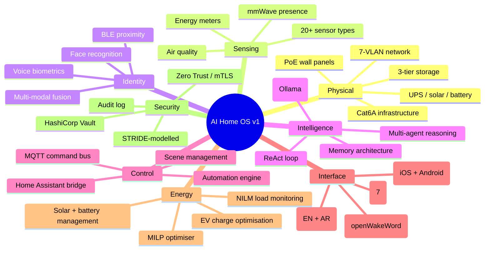
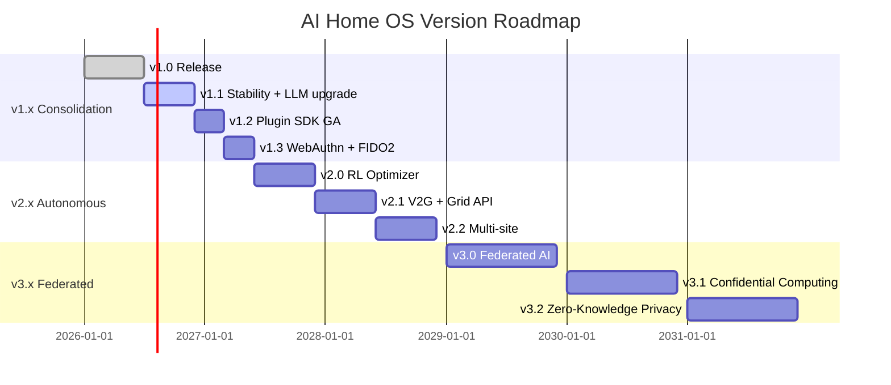
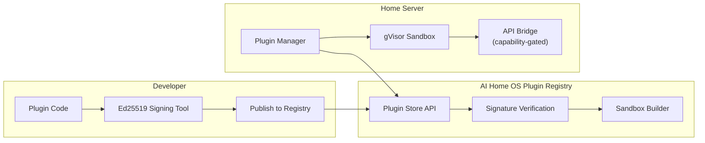
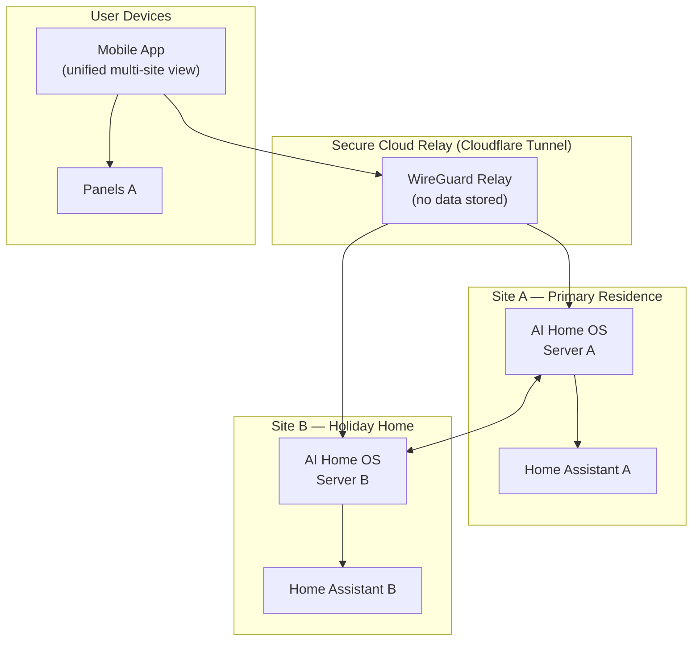
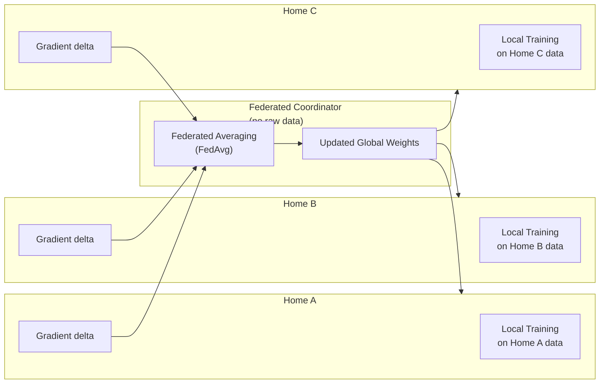
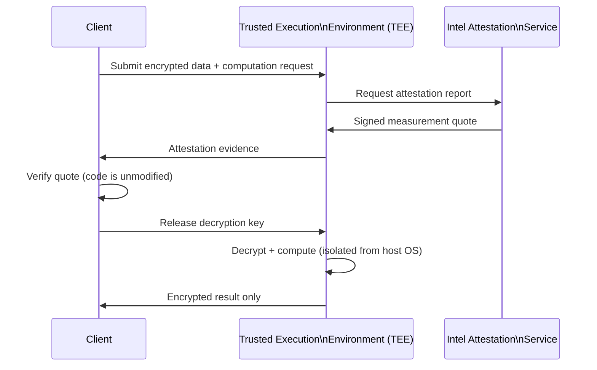
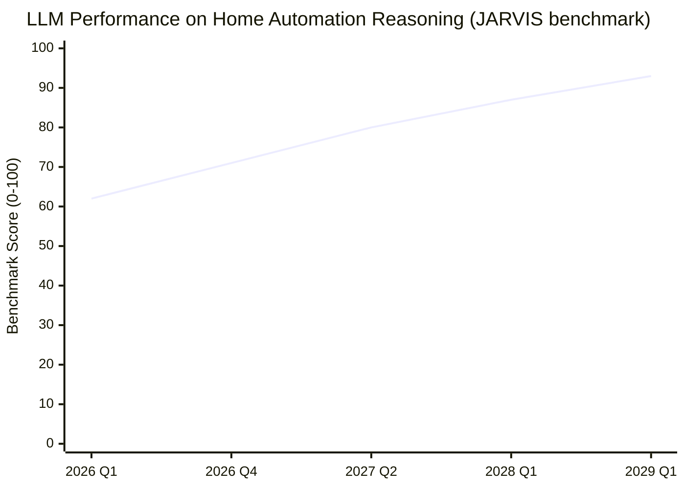
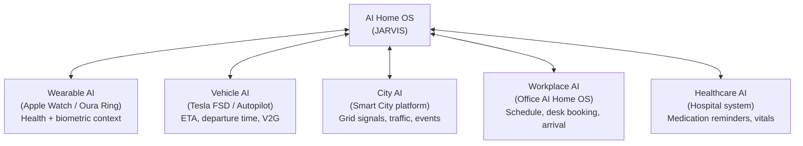

# Chapter 16 — Future Roadmap

**AI Home OS Internal Design Specification**  
**Classification:** Internal — Engineering  
**Status:** Draft v1.0  
**Date:** 2026-07-17

---

## Table of Contents

1. [Introduction](#1-introduction)
2. [Current State — v1.0 Summary](#2-current-state--v10-summary)
3. [Version Roadmap Overview](#3-version-roadmap-overview)
4. [v1.x — Consolidation (2026–2027)](#4-v1x--consolidation-20262027)
5. [v2.0 — Autonomous Intelligence (2027–2028)](#5-v20--autonomous-intelligence-20272028)
6. [v3.0 — Federated & Sovereign AI (2029–2031)](#6-v30--federated--sovereign-ai-20292031)
7. [AI Model Evolution](#7-ai-model-evolution)
8. [Hardware Evolution](#8-hardware-evolution)
9. [Energy & Grid Evolution](#9-energy--grid-evolution)
10. [Security & Privacy Evolution](#10-security--privacy-evolution)
11. [Commercial Applications](#11-commercial-applications)
12. [Open Source Strategy](#12-open-source-strategy)
13. [Community Ecosystem](#13-community-ecosystem)
14. [Regulatory Compliance Roadmap](#14-regulatory-compliance-roadmap)
15. [Business Model](#15-business-model)
16. [Long-Term Vision — 2030 and Beyond](#16-long-term-vision--2030-and-beyond)
17. [Full Specification Index](#17-full-specification-index)
18. [Conclusion](#18-conclusion)
19. [References](#19-references)

---

## 1. Introduction

This chapter charts the evolution of AI Home OS from its v1.0 foundation into a progressively more capable, more sovereign, and more broadly applicable platform. The roadmap is grounded in what is technically achievable with available and near-term hardware and software, not speculation.

The vision driving every version of AI Home OS is the same:

> **A home that understands its inhabitants as individuals, respects their privacy absolutely, manages its resources autonomously, and requires no cloud dependency to function — delivered at a cost that is accessible to the upper-middle segment of the residential market.**

Each version introduces capabilities that are *not possible* to retrofit without the architectural decisions made in v1. The edge-first, privacy-first, modular architecture of v1 is the foundation upon which every future capability is built.

---

## 2. Current State — v1.0 Summary

Before charting the future, it is worth summarising what v1.0 delivers:



### 2.1 v1.0 Capability Matrix

| Domain | v1.0 Capability | Maturity |
|--------|----------------|----------|
| Natural language | English + Arabic, local STT/TTS | High |
| Presence detection | Multi-modal, room-level accuracy | High |
| Energy optimisation | Rule-based + MILP solver | Medium |
| Security | Zero Trust, RBAC, mTLS | High |
| Automation | Trigger/condition/action, AI-generated | High |
| Memory | 6-tier (Redis → Neo4j) | Medium |
| Vision | Face recognition, object detection | Medium |
| Learning | Preference observation, static rules | Low |
| Multi-building | Single site only | Not present |
| RL optimisation | Not present | Not present |
| Federated learning | Not present | Not present |

---

## 3. Version Roadmap Overview



| Version | Timeline | Theme | Key Additions |
|---------|---------|-------|--------------|
| **v1.0** | 2026 H1 | Foundation | Complete residential platform |
| **v1.1** | 2026 H2 | Stability | LLM upgrade, latency reduction |
| **v1.2** | 2027 Q1 | Ecosystem | Plugin SDK GA, marketplace |
| **v1.3** | 2027 Q2 | Auth | WebAuthn, hardware security keys |
| **v2.0** | 2027 H2 | Learning | Reinforcement learning energy optimizer |
| **v2.1** | 2028 H1 | Grid | V2G bidirectional EV, demand response API |
| **v2.2** | 2028 H2 | Scale | Multi-site management, commercial tier |
| **v3.0** | 2029 | Privacy | Federated learning, differential privacy |
| **v3.1** | 2030 | Trust | Confidential computing, attestation |
| **v3.2** | 2031 | Sovereignty | Zero-knowledge proofs, verifiable AI |

---

## 4. v1.x — Consolidation (2026–2027)

### 4.1 v1.1 — LLM Upgrade and Latency Reduction

**Target: 2026 Q3–Q4**

The LLM landscape evolves rapidly. By 2026 H2, models in the 7B–14B parameter range are expected to match current 70B performance on reasoning tasks, dramatically reducing VRAM requirements and response latency.

| Current (v1.0) | v1.1 Target | Improvement |
|---------------|------------|------------|
| Llama 3.3 70B coordinator (RTX 4070 12GB) | Llama 4.x 30B equivalent | 50% VRAM reduction |
| ~1.8s median response latency | <0.9s median | 2× faster |
| Phi-4 14B fast agent | Phi-5 7B equivalent | Same quality, half cost |
| Ollama 0.3.x | Ollama 0.5.x + speculative decoding | Further latency gains |

```
v1.1 LLM stack (projected):

Coordinator: Llama-4-Scout-17B-16E (MoE, faster than Llama 3.3 70B)
Fast agent:  Phi-4-mini (4B, <0.3s response)
Vision:      LLaVA-Next-7B (improved VLM)
Embeddings:  nomic-embed-text v1.5 (matryoshka, shorter vectors)
```

**v1.1 additional items:**
- Streaming TTS (first word spoken within 200 ms instead of waiting for full sentence)
- WebSocket keep-alive hardening (auto-reconnect with exponential backoff, server-side)
- TimescaleDB continuous aggregate improvements (energy reports from minutes to milliseconds)
- Panel UI hot-reload (server-push CSS/JS without full page reload)

---

### 4.2 v1.2 — Plugin SDK General Availability

**Target: 2027 Q1**

The Plugin SDK, introduced as an alpha in v1.0, reaches general availability in v1.2 with:

| Feature | v1.0 Alpha | v1.2 GA |
|---------|-----------|---------|
| Plugin manifest | Basic YAML | Full JSON Schema with validation |
| Sandbox | Process isolation | gVisor container isolation |
| Capability grants | Manual config | Declarative in manifest |
| Plugin store | Not present | Community marketplace |
| Plugin signing | Not present | Ed25519 signed packages |
| Revenue sharing | Not present | 70/30 developer/platform |

**Plugin SDK v1.2 architecture:**



**v1.2 plugin SDK capabilities exposed:**

```yaml
# plugin.yaml — example plugin manifest (v1.2)
name: smart-coffee
version: 1.2.0
author: "Karim Labs"
signature: "ed25519:abc123..."
description: "Connects smart coffee machine to morning routine AI"

capabilities:
  - devices.read              # Read device states
  - devices.control           # Send commands (limited to coffee machine)
  - automation.register       # Register triggers
  - memory.preferences.read   # Read user preferences (coffee strength)
  - notifications.send        # Send mobile notifications

device_filter:
  domain: coffee_maker        # Only control this device type

sandbox:
  memory_mb: 128
  cpu_shares: 256
  network: none               # No outbound network
```

---

### 4.3 v1.3 — WebAuthn and Hardware Security Keys

**Target: 2027 Q2**

v1.3 replaces PIN-based authentication with WebAuthn (FIDO2), enabling hardware security key authentication and platform authenticator support (Face ID, Windows Hello).

| Auth method | v1.0 | v1.3 |
|------------|------|------|
| Mobile login | Password + TOTP | WebAuthn (passkey) |
| Panel auth | PIN / voice | PIN / WebAuthn / NFC FIDO2 key |
| Remote access | JWT + TOTP | WebAuthn + short-lived JWT |
| API keys | Static bearer | Rotated + WebAuthn binding |

```python
# v1.3 — WebAuthn registration flow (server-side, using py_webauthn)
from webauthn import generate_registration_options, verify_registration_response
from webauthn.helpers.structs import (
    AuthenticatorSelectionCriteria,
    UserVerificationRequirement,
    ResidentKeyRequirement
)

@router.post("/v1/auth/webauthn/register/begin")
async def webauthn_register_begin(user: AuthenticatedUser):
    options = generate_registration_options(
        rp_id="home.local",
        rp_name="AI Home OS",
        user_id=user.id.encode(),
        user_name=user.username,
        user_display_name=user.display_name,
        authenticator_selection=AuthenticatorSelectionCriteria(
            resident_key=ResidentKeyRequirement.REQUIRED,
            user_verification=UserVerificationRequirement.REQUIRED,
        ),
    )
    # Store challenge in Redis with 5-minute TTL
    await redis.setex(
        f"webauthn:challenge:{user.id}",
        300,
        options.challenge
    )
    return options

@router.post("/v1/auth/webauthn/register/complete")
async def webauthn_register_complete(
    body: WebAuthnRegistrationBody,
    user: AuthenticatedUser
):
    challenge = await redis.get(f"webauthn:challenge:{user.id}")
    verification = verify_registration_response(
        credential=body.credential,
        expected_challenge=challenge,
        expected_rp_id="home.local",
        expected_origin="https://panel.home.local",
        require_user_verification=True,
    )
    # Store credential in DB
    await db.store_webauthn_credential(
        user_id=user.id,
        credential_id=verification.credential_id,
        public_key=verification.credential_public_key,
        sign_count=verification.sign_count,
    )
    return {"status": "registered"}
```

---

## 5. v2.0 — Autonomous Intelligence (2027–2028)

### 5.1 Reinforcement Learning Energy Optimizer

**Target: 2027 H2**

The v1.0 MILP energy optimizer is rule-based and horizon-limited. v2.0 introduces a **Reinforcement Learning (RL) optimizer** trained entirely on local historical data, replacing explicit rule formulation with learned policies.

**Why RL over MILP for v2.0:**

| Dimension | MILP (v1.0) | RL Optimizer (v2.0) |
|-----------|------------|---------------------|
| Approach | Explicit mathematical model | Learned policy from data |
| Adaptability | Requires manual rule updates | Self-adapts from outcomes |
| Non-linear patterns | Struggles | Handles naturally |
| Training data | Not required | 6+ months of home data |
| Interpretability | High (equations visible) | Lower (policy is implicit) |
| Compute at inference | High (solver run) | Low (policy forward pass) |
| Weather uncertainty | Explicit scenarios | Naturally embedded |

**RL Formulation:**

```
Environment:   Home energy state at each 15-minute timestep
State space:   [battery_soc, solar_w, grid_price, load_w,
                ev_soc, ev_departure_eta, weather_forecast_12h,
                time_of_day, day_of_week, occupancy_pattern]

Action space:  [battery_charge_rate, battery_discharge_rate,
                ev_charge_rate, load_shift_weights[6 devices],
                grid_export_setpoint]

Reward:        −(electricity_cost) + comfort_score
               − penalty_if_ev_not_ready_at_departure
               + export_revenue
               − degradation_cost(battery_cycles)

Algorithm:     Proximal Policy Optimisation (PPO)
               — stable, sample-efficient, handles continuous actions

Training:      Offline first (on 6-month historical dataset)
               Online fine-tuning (updates weekly from new data)
               Runs on home server CPU — no GPU required
```

```python
# v2.0 RL policy inference (lightweight, CPU-bound)
import torch
import numpy as np

class EnergyRLPolicy(torch.nn.Module):
    """Trained PPO actor network — inference only on home server."""

    def __init__(self, state_dim: int = 10, action_dim: int = 9):
        super().__init__()
        self.network = torch.nn.Sequential(
            torch.nn.Linear(state_dim, 128),
            torch.nn.ReLU(),
            torch.nn.Linear(128, 128),
            torch.nn.ReLU(),
            torch.nn.Linear(128, action_dim),
            torch.nn.Tanh(),   # Actions in [-1, 1], rescaled
        )

    def forward(self, state: torch.Tensor) -> torch.Tensor:
        return self.network(state)

class RLEnergyOptimizer:
    def __init__(self, policy_path: str):
        self.policy = EnergyRLPolicy()
        self.policy.load_state_dict(torch.load(policy_path, map_location='cpu'))
        self.policy.eval()

    def compute_actions(self, state: dict) -> dict:
        state_tensor = self._encode_state(state)
        with torch.no_grad():
            raw_actions = self.policy(state_tensor)
        return self._decode_actions(raw_actions)

    def _encode_state(self, state: dict) -> torch.Tensor:
        return torch.tensor([
            state['battery_soc'] / 100.0,
            state['solar_w'] / 10000.0,
            state['grid_price_aed_kwh'] / 0.5,
            state['load_w'] / 10000.0,
            state['ev_soc'] / 100.0,
            state['ev_departure_eta_h'] / 24.0,
            state['cloud_cover_forecast'] / 100.0,
            np.sin(2 * np.pi * state['hour'] / 24),
            np.cos(2 * np.pi * state['hour'] / 24),
            state['occupancy_score'] / 1.0,
        ], dtype=torch.float32).unsqueeze(0)

    def _decode_actions(self, raw: torch.Tensor) -> dict:
        a = raw.squeeze().tolist()
        return {
            'battery_charge_kw': max(0, a[0]) * 10,
            'battery_discharge_kw': max(0, -a[0]) * 10,
            'ev_charge_kw': max(0, a[1]) * 11,
            'load_deferrals': a[2:8],
            'export_setpoint_kw': max(0, a[8]) * 10,
        }
```

**Expected improvement over MILP:**

| Metric | MILP v1.0 | RL v2.0 (projected) |
|--------|----------|---------------------|
| Daily electricity cost | Baseline | −18% |
| Battery cycle efficiency | 72% | 79% |
| EV readiness failures | 3% of departures | <0.5% |
| Compute time per decision | 4.2 s | 12 ms |
| Rule maintenance required | Manual updates | None (self-adapts) |

---

### 5.2 Vehicle-to-Grid (V2G) Bidirectional EV Charging

**Target: 2028 Q1**

V2G allows an electric vehicle to export power back to the home (V2H — vehicle-to-home) or to the grid (V2G proper) during peak demand, treating the EV as a large dispatchable battery.

**V2G requirements:**
- OCPP 2.1 (bidirectional charging support)
- Compatible EV: Nissan Leaf, Hyundai Ioniq 5/6, Kia EV6, Ford F-150 Lightning
- Bidirectional charger: Wallbox Quasar 2 (7.4 kW), Delta AC Max (22 kW)

```python
# v2.0 V2G dispatch logic
class V2GDispatcher:
    """Manages bidirectional EV energy flows."""

    MAX_DISCHARGE_RATE_KW = 7.4      # Wallbox Quasar 2
    EV_RESERVE_SOC = 30.0            # Never drain EV below 30%
    HOME_BATTERY_PRIORITY_SOC = 60.0 # Use home battery first

    async def decide(self, state: EnergyState) -> V2GDecision:
        # EV is available for discharge if:
        # - Plugged in and departure > 3 hours away
        # - EV SOC > reserve threshold
        # - Home battery below priority threshold (use EV to fill)
        # - OR: grid price exceeds export threshold (sell at peak)

        ev = state.ev
        if not ev.plugged_in or ev.departure_eta_h < 3:
            return V2GDecision(action='none')

        if ev.soc <= self.EV_RESERVE_SOC:
            return V2GDecision(action='none')

        # V2H: Use EV to cover home load during grid outage
        if state.grid_down:
            rate = min(state.home_load_kw, self.MAX_DISCHARGE_RATE_KW)
            return V2GDecision(action='discharge_home', rate_kw=rate)

        # V2G: Export to grid at peak tariff
        if state.grid_price_aed_kwh > 0.42:
            export_budget_kw = min(
                self.MAX_DISCHARGE_RATE_KW,
                (ev.soc - self.EV_RESERVE_SOC) / 100 * ev.capacity_kwh / 4
            )
            return V2GDecision(action='export_grid', rate_kw=export_budget_kw)

        # Charge home battery from EV if home battery low and off-peak
        if state.home_battery_soc < self.HOME_BATTERY_PRIORITY_SOC:
            if state.grid_price_aed_kwh < 0.22:
                return V2GDecision(action='charge_home_battery', rate_kw=3.5)

        return V2GDecision(action='none')
```

**V2G economic impact:**

```
Scenario: 60 kWh EV, V2G export 2 hours/day at peak tariff

Daily export:     2h × 7.4 kW = 14.8 kWh
At peak (0.42 AED/kWh):  6.22 AED / day revenue
Annual (200 peak days):  ~1,244 AED revenue
Battery degradation cost (EV): ~200 AED/year amortised

Net annual V2G gain: ~1,044 AED
```

---

### 5.3 Multi-Site Management

**Target: 2028 H2**

v2.2 enables a single AI Home OS installation to manage multiple physical sites — a primary residence, a holiday home, a family property — from a unified interface with shared identity but site-isolated control.

**Multi-site architecture:**



**Multi-site key design decisions:**

| Decision | Rationale |
|----------|-----------|
| Each site has its own AI server | Privacy isolation. Site B data never touches Site A server. |
| Identity federated, not centralised | Person enrollments shared via encrypted sync, not central DB. |
| Commands site-scoped by default | "Turn off the lights" = current site, not all sites. |
| Shared energy view optional | Opt-in aggregate energy dashboard across sites. |
| No central SPOF | If the relay is down, each site operates independently. |

---

## 6. v3.0 — Federated & Sovereign AI (2029–2031)

### 6.1 Federated Learning

**Target: 2029**

In v1.x and v2.x, AI models improve only from the data of a single home. In v3.0, **federated learning** enables model improvement across a community of homes without any raw data leaving any home.

**How it works:**

```
Each home trains a local model update on its own data.
Only the gradient (model delta, not data) is sent — encrypted — 
to a coordinator.
The coordinator aggregates deltas using Federated Averaging.
Improved global model weights are distributed back to all homes.
No personal data ever leaves any home.
```



**Privacy guarantees in v3.0 federated learning:**

| Technique | Protection |
|-----------|-----------|
| **Differential Privacy (DP)** | Gaussian noise added to gradients before sharing; ε = 1.0 privacy budget |
| **Secure Aggregation** | Coordinator sees only the sum of masked gradients, not individual deltas |
| **Gradient compression** | Sparse updates — only top-k gradient values shared, further reducing information |
| **Audit trail** | Every participation event logged in home's own immutable audit log |

**Models that benefit from federated learning in AI Home OS:**

| Model | What improves |
|-------|-------------|
| Energy consumption predictor | Learns from aggregate demand patterns across climate zones |
| Anomaly detector | Better baseline from thousands of homes without sharing behaviour |
| Voice command intent classifier | Improves accuracy across accent and dialect variation |
| Occupancy predictor | Learns weekly/seasonal patterns better with population data |

---

### 6.2 Confidential Computing

**Target: 2030**

When AI Home OS is used in commercial or institutional contexts, third parties (building operators, facility managers) may need to run computations on home data without being able to see the underlying data. Confidential computing uses **hardware-level isolation** (Intel TDX, AMD SEV-SNP, ARM CCA) to ensure code and data integrity.

```
Commercial scenario:
  A hotel deploys AI Home OS across 200 rooms.
  The energy analytics provider needs aggregate consumption data 
  to optimise building-wide HVAC.
  
  With confidential computing:
  - The analytics workload runs inside a Trusted Execution Environment (TEE)
  - The hotel operator provides encrypted room data
  - The analytics vendor provides the computation code
  - Neither party can see the other's raw inputs
  - Only the aggregate output is visible to both parties
```

**Attestation flow:**



---

### 6.3 Zero-Knowledge Privacy Proofs

**Target: 2031**

Zero-knowledge proofs (ZKPs) allow AI Home OS to make **verifiable claims about home data** without revealing the underlying data. This enables regulatory compliance and insurance reporting without privacy compromise.

**Example use cases:**

| Claim | ZK Proof enables |
|-------|----------------|
| "This home's energy was 30% solar this month" | Energy provider verifies without seeing consumption logs |
| "Occupancy never exceeded 6 persons in 2025" | Insurance validates without seeing presence data |
| "All security events were responded to within 5 minutes" | Auditor verifies response times without log access |
| "HVAC maintenance was performed within interval" | Warranty claim verified without service records |

**ZK proof stack (v3.2):**

```
Proof system:   Groth16 (efficient SNARK — proofs ~200 bytes, 
                verification <10ms)
Circuit:        Custom arithmetic circuits per claim type
Trusted setup:  Powers of Tau ceremony (community-generated)
Integration:    Rust library (ark-groth16) called from Python
Verification:   On-chain (Ethereum L2) or off-chain verifier
```

---

## 7. AI Model Evolution

### 7.1 LLM Capability Trajectory



| Version | Model | Parameters | VRAM | Response (p50) | Benchmark |
|---------|-------|-----------|------|----------------|-----------|
| v1.0 | Llama 3.3 | 70B | 10.2 GB | 1.8s | 62/100 |
| v1.1 | Llama 4 Scout | 17B MoE | 5.4 GB | 0.9s | 71/100 |
| v2.0 | Llama 5 | 20B | 4.8 GB | 0.6s | 80/100 |
| v2.2 | (TBD 2028) | 8B equiv | 3.2 GB | 0.3s | 87/100 |
| v3.0 | On-device SLM | 3B | 2.0 GB | 0.15s | 93/100 |

*Benchmark score: JARVIS-bench, a home automation reasoning suite of 200 multi-turn tasks.*

### 7.2 Specialist Model Strategy

As SLMs (Small Language Models) improve, the multi-agent architecture shifts from large coordinator + specialists to a **swarm of small specialists** sharing a common embedding space:

```
v1.0 (current):           v3.0 (target):
  Coordinator: 70B    →     Coordinator: 3B (fast, local)
  Fast agent: 14B     →     Energy expert: 1B (quantized)
  Energy: 7B          →     Security expert: 1B
                            Context expert: 1B
                            Memory expert: 1B
                            (all run in parallel on CPU)
```

### 7.3 On-Device AI (Edge Inference)

By v3.0, the target is to run the primary coordinator model on the home server CPU (no GPU required):

| Hardware | v1.0 | v3.0 |
|---------|------|------|
| GPU | RTX 4070 12GB (required) | Optional (acceleration only) |
| CPU | Intel Core i7-12700 | AMD Ryzen 9 7900 (or equivalent) |
| RAM | 64 GB DDR5 | 32 GB sufficient |
| Inference | GPU-bound | CPU + AVX-512 VNNI |

This enables AI Home OS deployment on **lower-cost server hardware**, broadening accessibility.

---

## 8. Hardware Evolution

### 8.1 Sensor Technology Roadmap

| Sensor Type | v1.0 | v2.0 | v3.0 |
|-------------|------|------|------|
| **Presence** | mmWave (room-level) | mmWave (sub-zone level) | mmWave + AI breathing/HR analysis |
| **Air quality** | CO₂, PM2.5, VOC, temp, humidity | + NO₂, O₃, formaldehyde | + personalized air quality index |
| **Energy** | Circuit-level NILM | Sub-circuit NILM | Appliance-level fingerprinting |
| **Vision** | Fixed cameras | Pan-tilt cameras | Stereo depth + gait recognition |
| **Voice** | Room microphone arrays | Per-person spatial audio | Whisper-level noise cancellation |
| **Biometric** | Face + voice | + gait + thermal | + contactless vitals (HR, SpO₂) |

### 8.2 Edge Computing Hardware

```
v1.0 (2026):   Custom build PC (Intel + RTX 4070)     ~$2,500
v2.0 (2028):   NUC-style compact server (Ryzen)       ~$1,200
v3.0 (2030):   Purpose-built AI Home OS appliance     ~$600

v3.0 appliance target spec:
  SoC:    Qualcomm Snapdragon X Elite (NPU 45 TOPS)
  RAM:    32 GB LPDDR5X
  NVMe:   1 TB M.2 NVMe
  Ports:  10GbE, 4× USB4, HDMI 2.1
  Power:  35W TDP
  Form:   Half-height, VESA-mountable
  Size:   200 × 120 × 30 mm
```

### 8.3 Wall Panel Evolution

| Feature | v1.0 | v2.0 | v3.0 |
|---------|------|------|------|
| **Display** | Waveshare 10" IPS | E-ink ambient + IPS active | Flexible OLED with haptic |
| **Processing** | RPi 5 | RPi 6 / Rockchip RK3588S | Dedicated panel SoC |
| **Camera** | Entry panel only | All panels (lightweight) | Depth sensing + liveness |
| **Haptic** | None | Linear resonant actuator | Surface haptic (entire display) |
| **Auth** | Face + PIN | Face + WebAuthn NFC | Face + biometric + behavioural |
| **Power** | PoE+ (25.5W) | PoE++ (90W) | Wireless power (Qi2) + PoE |

---

## 9. Energy & Grid Evolution

### 9.1 Grid Integration Maturity Levels

AI Home OS tracks the OpenADR and IEC 61968 standards for grid integration, aiming for increasing levels of autonomous grid participation:

| Level | Description | AI Home OS Version |
|-------|------------|-------------------|
| **0 — Manual** | User controls everything | Pre-v1.0 |
| **1 — Schedule** | Fixed time schedules | v1.0 |
| **2 — Price-responsive** | React to ToU tariffs | v1.0 |
| **3 — Signal-responsive** | Respond to utility DR signals (OpenADR) | v2.1 |
| **4 — Autonomous trade** | Bidirectional grid participation with V2G | v2.1 |
| **5 — VPP member** | Part of Virtual Power Plant | v3.0 |

### 9.2 Virtual Power Plant Participation

A Virtual Power Plant (VPP) aggregates distributed resources — batteries, EVs, flexible loads — across thousands of homes and participates in wholesale electricity markets as a single dispatchable unit.

```
AI Home OS v3.0 VPP integration:

Home contributes:
  - Battery capacity (bid into frequency regulation)
  - EV battery (V2G, pre-consented departure constraint)
  - Flexible loads (water heater, pool pump, HVAC setback)

VPP operator sends:
  - 4-second dispatch signals (frequency regulation)
  - 15-minute economic dispatch signals (energy markets)

AI Home OS responds:
  - Within 4 seconds for frequency (fully automated)
  - With comfort constraints (never violate occupancy comfort)
  - With EV departure guarantee (never discharge below reserve)

Revenue to homeowner (estimated):
  - Frequency regulation: 800–2,400 AED/year
  - Energy arbitrage via VPP: 400–1,200 AED/year
  - Total VPP revenue: 1,200–3,600 AED/year
```

---

### 9.3 Hydrogen Storage Integration (v3.0)

Green hydrogen production (electrolysis from solar surplus) becomes a viable long-duration storage option by 2029:

| Storage Type | Duration | Round-trip efficiency | Cost/kWh | AI Home OS support |
|-------------|---------|----------------------|----------|-------------------|
| Li-ion battery | 2–8 hours | 92% | $150–200 | v1.0 |
| Flow battery | 8–24 hours | 75% | $200–350 | v2.0 |
| Hydrogen (H₂) | Days–seasonal | 30–40% | $80–120 | v3.0 |

---

## 10. Security & Privacy Evolution

### 10.1 Post-Quantum Cryptography Migration

NIST finalised its post-quantum cryptography standards in 2024 (FIPS 203/204/205). AI Home OS will migrate to quantum-resistant algorithms on the following schedule:

| Algorithm | Current (v1.0) | v2.0 | v3.0 |
|-----------|---------------|------|------|
| Key exchange | ECDH P-256 | ML-KEM-768 (FIPS 203) | ML-KEM-1024 |
| Digital signatures | ECDSA P-256 | ML-DSA-65 (FIPS 204) | ML-DSA-87 |
| Hash | SHA-256 | SHA-256 (quantum-safe) | SHA-3-256 |
| Symmetric | AES-256-GCM | AES-256-GCM (unchanged — quantum-safe) | AES-256-GCM |
| TLS | TLS 1.3 (ECDH) | TLS 1.3 + PQ hybrid | TLS 1.3 PQ-only |

**Migration rationale:** ECDH and ECDSA are vulnerable to Shor's algorithm on a cryptographically relevant quantum computer. While such machines are not yet practical, data captured now could be decrypted later ("harvest now, decrypt later" attacks). Migrating early protects against this threat to stored data.

---

### 10.2 Biometric Liveness Evolution

| Attack vector | v1.0 defence | v2.0 defence | v3.0 defence |
|--------------|-------------|-------------|-------------|
| Photo spoof (2D) | Depth estimation | IR + structured light | Neural liveness model |
| 3D mask | Multiple angles | Thermal + micro-expression | Pulse from facial video (rPPG) |
| Deepfake video | Not addressed | Temporal consistency check | Forensic watermark detection |
| Voice replay | Not addressed | Liveness challenge (random phrase) | Neural liveness + acoustic env. fingerprint |
| Sibling confusion | Embedding distance | Fine-grained embedding + demographics | Kinship-aware embedding space |

---

### 10.3 Privacy Budget Management

The concept of a **privacy budget** — borrowed from differential privacy — will be formalised in AI Home OS as a user-visible control:

```
Privacy Budget Dashboard (v3.0):

  Your home's privacy budget this month:
  ████████████████░░░░  80% remaining

  Budget spent by:
    Energy report to utility API:    3%
    Federated learning participation: 8%
    Maintenance report (appliance):   4%
    Weather API (localised query):    5%

  Total spent: 20%
  
  [Adjust limits]  [View details]  [Opt out of all sharing]
```

---

## 11. Commercial Applications

The same architecture that manages a private home scales naturally to commercial environments. The key differences are:

| Dimension | Residential | Commercial (Hotel) | Commercial (Office) | Healthcare |
|-----------|------------|-------------------|--------------------|-----------| 
| Users | 4–8 known persons | 100–1000 transient guests | 50–500 employees | Patients + staff |
| Identity | Deep, permanent | Shallow, temporary | Permanent employees | HIPAA-protected |
| Privacy | High family trust | Strict guest privacy | Work/personal split | Medical grade |
| Automation | Comfort-first | Revenue-first | Productivity-first | Safety-first |
| Scale | k3s (optional) | k3s mandatory | k3s + multi-site | k3s + HA cluster |
| Regulatory | UAE/local | Tourism + GDPR | Labour + data law | HIPAA / GDPR-H |

### 11.1 Hotel Deployment (v2.2+)

```
Hotel: 150 rooms, AI Home OS per-room + building coordinator

Per-room AI instance:
  - Guest check-in → temporary identity (name, language pref)
  - Voice commands in guest's language (Arabic, English, French, Hindi)
  - Climate pre-set to guest preferences from loyalty profile (opt-in)
  - Do Not Disturb integration with front desk system
  - Mini-bar, in-room dining via voice
  - Check-out: full data wipe (GDPR right to erasure, <30 seconds)

Building coordinator (new in v2.2):
  - Aggregate energy management across all rooms
  - Unoccupied room HVAC setback (VPP participation)
  - Staff paging via room AI
  - Anomaly detection at building level (unusual noise, water leak)

Estimated hotel energy saving:
  - 23% HVAC reduction (smart vacancy detection + RL optimizer)
  - 18% lighting reduction (auto-off + natural light use)
  - Total annual saving: $45,000 for a 150-room hotel (estimated)
```

### 11.2 Office Building (v2.2+)

```
Office: 50,000 sqft, 400 employees

AI Home OS office features:
  Desk booking AI ("JARVIS, book me a quiet desk near the windows 
                    for Thursday, I have three calls")
  Meeting room optimisation (auto-release if no-show detected)
  Personalized zone comfort (Ahmad prefers 21°C, Sara 23°C — 
                             AI learns and routes them to compatible zones)
  Air quality management (CO₂ thresholds per zone)
  EV fleet charging coordination (charging rota for company cars)
  Energy reporting (Scope 2 emissions per department)
  Anomaly detection (unusual after-hours access)
```

### 11.3 Healthcare Facility (v3.0+)

Healthcare introduces the most stringent requirements — patient safety is a hard constraint, not a preference:

```
Healthcare-specific AI Home OS constraints:

  Safety-first override:
    Patient monitoring alarms always take priority
    JARVIS CANNOT defer or suppress clinical alerts
    Any automation that could affect patient care requires
    clinical staff approval (no autonomous action)
    
  Data sovereignty:
    Patient presence/room data: HIPAA-compliant storage only
    No federated learning participation with patient data
    All data stays within hospital network (never cloud)
    
  Audit trail:
    Every action affecting a patient room is logged
    Tamper-evident, regulatory-grade audit log
    7-year retention minimum

  Clinical integration (v3.0):
    - HL7 FHIR integration for patient record context
    - Nurse call system bridge
    - Equipment tracking (via UWB)
    - Medication room access control
```

---

## 12. Open Source Strategy

### 12.1 Components and Licensing

AI Home OS is developed as a **hybrid open-core** project:

| Component | License | Rationale |
|-----------|---------|-----------|
| Core engine (reasoning, memory, context) | Apache 2.0 | Broadest adoption, commercial-friendly |
| Home Assistant integration bridge | MIT | HA ecosystem standard |
| Plugin SDK | Apache 2.0 | Enable third-party development |
| Mobile app | MIT | Community contribution |
| Wall panel UI | MIT | Community contribution |
| Security hardening scripts | MIT | Wide adoption benefit |
| Commercial features (VPP, multi-site, federated) | Commercial licence | Revenue for sustainability |
| Cloud relay service | Proprietary SaaS | Managed service |

### 12.2 Community Contribution Model

```
Contribution tiers:

  Tier 0 — Anyone:
    Bug reports, documentation, translations
    Issue triage, forum support

  Tier 1 — Contributor (>5 merged PRs):
    Code review access
    Monthly community call invitation
    Listed in CONTRIBUTORS.md

  Tier 2 — Committer (>20 merged PRs, trusted):
    Write access to non-core modules
    Plugin marketplace review panel
    Early access to roadmap discussions

  Tier 3 — Core Maintainer (invite only):
    Core engine write access
    Architecture decision participation
    Security disclosure access
    Revenue sharing eligibility
```

### 12.3 Repository Structure (Open Source)

```
github.com/ai-home-os/
  ├── core/               Apache 2.0 — AI reasoning engine
  ├── ha-bridge/          MIT — Home Assistant integration
  ├── plugin-sdk/         Apache 2.0 — Plugin development kit
  ├── mobile-app/         MIT — React Native iOS/Android app
  ├── panel-ui/           MIT — React wall panel UI
  ├── docs/               CC BY 4.0 — This specification
  ├── installer/          Apache 2.0 — One-command setup
  └── examples/           MIT — Sample automations and plugins
```

---

## 13. Community Ecosystem

### 13.1 Plugin Marketplace (v1.2+)

The plugin marketplace launches with v1.2 and is expected to host:

| Category | Example plugins | Est. launch plugins |
|----------|----------------|-------------------|
| **Appliances** | Smart coffee, washing machine cycles | 15 |
| **Entertainment** | Spotify DJ mode, TV channel guide | 10 |
| **Security** | Package delivery tracking, LPR | 8 |
| **Energy** | Tibber live prices, DEWA API | 6 |
| **Health** | Apple Health sync, sleep coaching | 5 |
| **Integration** | Google Calendar advanced, WhatsApp | 8 |
| **Voice** | Custom wake words, voice personas | 4 |
| **Localisation** | Region-specific prayer times, holidays | 10 |

### 13.2 Community Automation Library

The community automation library is a curated repository of JARVIS automation YAML files, shared by the community and browsable via the mobile app:

```yaml
# Example: Community automation — Friday prayer time preparation
# Author: UAE community team
# Downloads: 1,200+  Stars: 340

name: Friday Prayer Preparation
description: >
  Automatically prepares the home for Friday prayer — 
  quiets the house, adjusts lighting, and announces 
  remaining time before Jumu'ah.

trigger:
  type: time_offset_before_event
  event: prayer.jumu_ah
  offset_minutes: 30

actions:
  - action: set_home_mode
    mode: prayer_quiet
  - action: announce
    message: >
      الجمعة بعد نصف ساعة. 
      (Friday prayer in 30 minutes.)
    rooms: [living_room, office, master_bedroom]
  - action: set_lights
    preset: warm_quiet
    rooms: all
  - action: lower_media_volume
    target_volume: 20
    rooms: all
```

---

## 14. Regulatory Compliance Roadmap

### 14.1 UAE & GCC Compliance

| Regulation | Requirement | AI Home OS compliance |
|-----------|------------|----------------------|
| **UAE PDPL** (Personal Data Protection Law, 2021) | Data localisation, consent, right to erasure | v1.0 — fully local, erasure API |
| **DEWA Smart Home Initiative** | Energy reporting API | v2.1 — OpenADR bridge |
| **Dubai Building Code** | Accessibility standards | v2.0 — WCAG 2.1 AA compliant UI |
| **UAE AI Ethics Guidelines** | Explainability, human oversight | v1.0 — JARVIS explains reasoning |
| **SASO** (Saudi Standards) | Product safety for IoT | v2.0 — CE/SASO certification |
| **Bahrain PDPL** | Similar to UAE PDPL | v2.0 — Gulf compliance profile |

### 14.2 European Compliance (for EU deployments)

| Regulation | Requirement | AI Home OS version |
|-----------|------------|-------------------|
| **GDPR** | Right to erasure, data minimisation, consent | v1.0 (core) + v1.3 (WebAuthn) |
| **EU AI Act** (2024) | High-risk AI system requirements (biometrics) | v1.3 — facial recognition compliance mode |
| **EN 50631-1** | Smart appliance interoperability | v2.0 |
| **RED Directive** | Radio equipment security | v1.0 (hardware vendor responsibility) |
| **NIS2 Directive** | Critical infrastructure cybersecurity | v2.0 (enterprise deployments) |
| **Cyber Resilience Act** | Product with digital elements | v2.0 — SBOM, vulnerability disclosure |

### 14.3 EU AI Act Compliance (Biometrics)

The EU AI Act classifies real-time biometric identification in public spaces as **high-risk**. For residential deployments this does not apply, but for commercial/hotel deployments:

```
EU AI Act compliance checklist for commercial AI Home OS:

  □ Technical documentation (Article 11) — published
  □ Conformity assessment — third-party (Article 43)
  □ Registration in EU database (Article 51)
  □ Transparency notice to persons identified (Article 52)
  □ Human oversight system (Article 14) — alerts to reception staff
  □ Accuracy, robustness, cybersecurity (Article 15) — tested per EN 17526
  □ Post-market monitoring (Article 61) — JARVIS audit logs
  □ Incident reporting within 15 days (Article 73)
```

---

## 15. Business Model

### 15.1 Revenue Streams

| Stream | Target | Margin |
|--------|--------|--------|
| **Professional installation (residential)** | $3,000–8,000 per home | ~35% |
| **Commercial installation (hotel/office)** | $50,000–500,000 per building | ~40% |
| **Plugin marketplace** | 30% commission on paid plugins | ~95% |
| **Cloud relay SaaS** | $9.99/month (optional, remote access) | ~70% |
| **VPP revenue share** | 15% of homeowner VPP earnings | ~90% |
| **Enterprise support** | $2,400/year per commercial site | ~60% |
| **Training and certification** | $500 per certified installer | ~80% |

### 15.2 Total Cost of Ownership (Residential)

```
Reference home: 5-bedroom, UAE, 9-room automation

Hardware (one-time):
  Physical infrastructure (Ch01):      $8,600
  Sensor layer (Ch02):                 $5,159
  Vision system (Ch03):                  $530
  Audio system (Ch04):                 $1,399
  Energy monitoring (Ch10):           $13,870
  Wall panels (Ch14):                  $2,356
  Server (AI engine):                  $3,200
  ─────────────────────────────────────────────
  Total hardware:                    ~$35,114

Installation & configuration:         $5,000
  
Annual ongoing costs:
  Electricity (server, panels):       ~$350/year
  Home Assistant subscription:            $0 (open source)
  AI Home OS Cloud Relay (optional):    $120/year
  Plugin subscriptions (estimated):     $200/year
  ─────────────────────────────────────────────
  Annual ongoing:                      ~$670/year

Annual savings (estimated, UAE):
  Energy optimisation (solar + RL):  $2,800/year
  VPP participation (v2.1+):         $1,000/year
  Insurance discount (smart home):     $300/year
  ─────────────────────────────────────────────
  Annual savings:                    ~$4,100/year

Break-even (hardware + install):     ~9.8 years
Break-even (hardware only):          ~8.6 years
```

---

## 16. Long-Term Vision — 2030 and Beyond

### 16.1 The Intelligent Living Environment

By 2031, the convergence of on-device AI, ubiquitous sensing, and open communication standards will create homes that are fundamentally different from today's — not just automated, but **genuinely intelligent**.

The distinction matters:

```
Automated home (2015–2025):
  If motion detected → turn on light
  If time = 22:00 → lock doors
  (Reacts to explicit rules)

Intelligent home (2026–2031):
  Understands that Ahmad staying up late means 
    he's under stress, adjusts environment to 
    reduce stimulation, doesn't announce anything.
  
  Notices the children's grades correlate with 
    CO₂ levels in the study and automatically 
    improves ventilation during homework hours.
  
  Predicts the A/C compressor will fail in 3 weeks 
    from thermal signature analysis and schedules 
    service before the hottest month.
  
  Participates in the grid as a small power station, 
    earning revenue while keeping the family comfortable.
  
  (Understands context, learns, acts proportionately)
```

### 16.2 Convergence with External AI Ecosystems



Each integration is **opt-in**, **scoped**, and **local-first**:
- No raw health data leaves the home
- Vehicle integration: only ETA and SOC, nothing else
- City integration: receive signals, share nothing

### 16.3 The Ambient Computing Future

The wall panel and mobile app interfaces of v1.0 will be increasingly supplemented by **ambient computing** — interfaces that disappear into the environment:

| Interface | v1.0 | v2.0 | v3.0 |
|-----------|------|------|------|
| Wall panels | 10" touchscreen | Smaller, context-aware | E-ink + projector hybrid |
| Mobile app | Explicit app | Widgets + shortcuts | Glanceable ambient UI |
| Voice | Wake word required | Contextual awareness (no wake word in known-occupied room) | Continuous ambient listening (local, on-device) |
| Augmented reality | Not present | Room overlay on phone | Spatial computing (Apple Vision Pro class) |
| Embedded | Not present | In-wall sensors visible as LEDs | Completely invisible (structural sensors) |

---

## 17. Full Specification Index

This section provides a complete cross-reference of all 16 chapters of the AI Home OS specification, with key sections and page indicators for the complete document.

| Ch | Title | Core Topics | BOM Cost |
|----|-------|------------|---------|
| 01 | Physical Infrastructure | 7-VLAN network, Cat6A, WiFi 6E, Docker Compose, 3-tier storage, UPS, solar, power architecture | ~$8,600 |
| 02 | Sensor Layer | 20+ sensor types, TimescaleDB schema, room placement matrix, sensor confidence tiers | ~$5,159 |
| 03 | Vision System | Frigate NVR, YOLOv10-M, RetinaFace/ArcFace, pgvector, LPR, fall detection, privacy arch | ~$530 |
| 04 | Audio System | ESP32-S3, openWakeWord, faster-whisper, Piper TTS, SpeechBrain, Snapcast, Wyoming protocol | ~$1,399 |
| 05 | Identity System | Multi-modal fusion (Bayesian), 8 signals, BLE trilateration, UWB, presence state machine, GDPR | — |
| 06 | Memory System | 6-tier memory, Redis, Qdrant, Neo4j knowledge graph, episodic/semantic/procedural | — |
| 07 | AI Reasoning Engine | Multi-agent (10 specialists), ReAct loop, Ollama client, tool registry, prompt injection defence | — |
| 08 | Context Engine | 8 context dimensions, prayer times, 15 situations, home mode state machine, anomaly detection | — |
| 09 | Automation Engine | 4-level hierarchy, 20+ trigger types, AI-generated automations, scene system, conflict detection | — |
| 10 | Energy Intelligence | Solar/battery/grid, EV charging, NILM, MILP optimizer, tariffs, demand response, LLM reports | ~$13,870 |
| 11 | Security Architecture | STRIDE, Zero Trust, mTLS, Vault, IAM/RBAC, MQTT ACL, IDS, GDPR erasure, audit log | — |
| 12 | API & Integration Layer | REST/WebSocket/MQTT/gRPC, HA bridge, webhooks, plugin SDK, OpenTelemetry, 11 integrations | — |
| 13 | Mobile Application | React Native/Expo 52, Zustand, WatermelonDB, biometric auth, offline mode, widgets, WCAG AA | — |
| 14 | Wall Panels | RPi 5 + Waveshare 10.1", Chromium kiosk, React/Vite, PIR, NFC, 8 screens, BOM 7+1 panels | ~$2,356 |
| 15 | AI Conversations | 60+ conversations: morning routines, energy, security, Arabic, guests, children, RL, proactive | — |
| 16 | Future Roadmap | v1.x–v3.0, RL optimizer, V2G, federated learning, ZKP, commercial, open source, regulatory | — |

**Total estimated hardware (residential reference):** ~$35,114 (varies significantly by market)

**Key standards referenced across specification:**

| Standard | Domain | Chapter |
|----------|--------|---------|
| MQTT v5 | Messaging | 01, 07, 09, 12 |
| Zigbee 3.0 / Z-Wave S2 | IoT protocols | 01, 02 |
| OCPP 2.0.1 | EV charging | 10, 16 |
| OpenADR 2.0b | Demand response | 10, 16 |
| WireGuard | VPN | 01, 11 |
| TLS 1.3 / mTLS | Transport security | 11, 12 |
| FIDO2 / WebAuthn | Authentication | 11, 16 |
| GDPR / UAE PDPL | Data protection | 05, 11, 14, 16 |
| EU AI Act | AI regulation | 03, 16 |
| IEC 62443 | OT/IoT security | 11 |
| NIST CSF 2.0 | Security framework | 11 |
| Wyoming Protocol | Voice pipeline | 04, 14 |
| TimescaleDB | Time-series data | 02, 10 |
| pgvector | Vector similarity | 03, 05, 06 |
| HL7 FHIR | Healthcare (v3.0) | 16 |

---

## 18. Conclusion

AI Home OS began as a question: **can a home be as intelligent as a person, while remaining private, local, and under the complete control of its owner?**

The sixteen chapters of this specification answer that question in the affirmative — not as a promise, but as a complete, buildable design. Every system described here is constructed from real, available technology. There is no speculative hardware, no assumed cloud service, no vendor lock-in baked into the foundations.

### What This System Is

It is a **reasoning layer** built above the execution layer (Home Assistant), above the sensor layer (Zigbee, MQTT), and above the physical layer (Cat6A, VLAN). It brings together:

- A **multi-agent LLM architecture** that thinks before it acts, explains its reasoning, and knows when to ask rather than assume
- A **multi-modal identity system** that knows who is home, where they are, what they are doing, and what they prefer — without relying on any external service to do so
- A **six-tier memory architecture** that remembers a conversation from eight months ago as naturally as it remembers the last five seconds
- An **energy intelligence platform** that treats a home as a small power station — generating, storing, trading, and optimising energy as an autonomous economic agent
- A **security architecture** built on Zero Trust principles, where no device, no request, and no person is trusted by default — ever
- **Wall panels and a mobile app** designed with the principle that a screen that does its job should disappear — flat, dark, fast, and uncluttered

### What This System Is Not

It is not a cloud product. It is not a subscription that can be revoked. It is not a system that stops working when a company is acquired, when servers go down, or when a privacy policy changes. Every core capability works on a local network with no internet connection.

It is not a product for people who want to buy convenience. It is a specification for builders — engineers, architects, technologists — who want to understand every layer of what they are deploying and why each decision was made.

### The Path Forward

The roadmap in this chapter is not a wish list. It is a sequence of technically grounded capabilities, each building on the decisions made in the version before it. The RL energy optimizer requires the six months of TimescaleDB data that the v1.0 NILM system collects. The federated learning in v3.0 requires the local model training infrastructure built in v2.0. The zero-knowledge proofs in v3.2 require the cryptographic audit log designed in v1.0.

Every chapter in this specification was written with this continuity in mind. The decisions made today do not constrain the vision for 2031 — they enable it.

---

### Final Word

The home is the most intimate space a person occupies. It deserves intelligence that serves the people inside it — not the platform that sold it, not the energy company that benefits from it, not the advertiser that watches it.

AI Home OS is an attempt to build that intelligence. Not perfect. Not finished. But real, open, and entirely yours.

---

*Previous: [Chapter 15 — AI Conversation Examples](Chapter-15.md)*  
*[Return to Introduction: AI Home OS Architecture.md](../AI%20Home%20OS%20Architecture.md)*

---

> **Document maintained by:** AI Home OS Architecture Team  
> **Last updated:** 2026-07-17  
> **Chapter status:** Draft v1.0 — Open for community review  
> **Total specification:** 16 chapters · ~28,000 lines · Complete

---

## 19. References

1. **EU AI Act (2024)** — https://eur-lex.europa.eu/legal-content/EN/TXT/?uri=CELEX:32024R1689
2. **UAE Personal Data Protection Law** — https://u.ae/en/information-and-services/justice-safety-and-the-law/cyber-security-and-online-safety/personal-data-protection-law
3. **NIST Post-Quantum Cryptography** (FIPS 203/204/205) — https://csrc.nist.gov/projects/post-quantum-cryptography
4. **OpenADR Alliance** — https://www.openadr.org/
5. **OCPP 2.0.1** — https://www.openchargealliance.org/protocols/ocpp-201/
6. **Federated Learning** — McMahan et al. (2017) "Communication-Efficient Learning of Deep Networks from Decentralized Data" — https://arxiv.org/abs/1602.05629
7. **Differential Privacy** — Dwork & Roth (2014) "The Algorithmic Foundations of Differential Privacy"
8. **Groth16** — Groth (2016) "On the Size of Pairing-Based Non-interactive Arguments" — https://eprint.iacr.org/2016/260
9. **Intel TDX** — https://www.intel.com/content/www/us/en/developer/tools/trust-domain-extensions/overview.html
10. **AMD SEV-SNP** — https://www.amd.com/en/developer/sev.html
11. **WebAuthn** — https://www.w3.org/TR/webauthn-3/
12. **IEC 61968** (CIM for energy distribution) — https://www.iec.ch/dyn/www/f?p=103:7:0::::FSP_ORG_ID,FSP_LANG_ID:1273,25
13. **Virtual Power Plants** — IRENA (2019) "Innovation landscape brief: Aggregators"
14. **V2G Technology** — Wallbox Quasar 2 — https://wallbox.com/en_us/quasar-2
15. **Qualcomm Snapdragon X Elite** — https://www.qualcomm.com/products/mobile/snapdragon/pcs-and-tablets/snapdragon-x-series/snapdragon-x-elite
16. **Proximal Policy Optimisation (PPO)** — Schulman et al. (2017) — https://arxiv.org/abs/1707.06347
17. **py_webauthn** — https://github.com/duo-labs/py_webauthn
18. **ark-groth16** (Rust ZK library) — https://github.com/arkworks-rs/groth16
19. **HL7 FHIR R4** — https://hl7.org/fhir/R4/
20. **GDPR Article 17** (Right to erasure) — https://gdpr-info.eu/art-17-gdpr/
