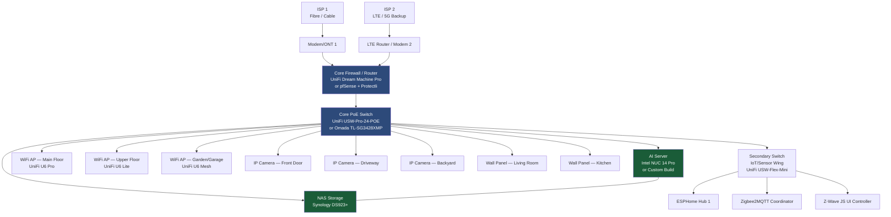
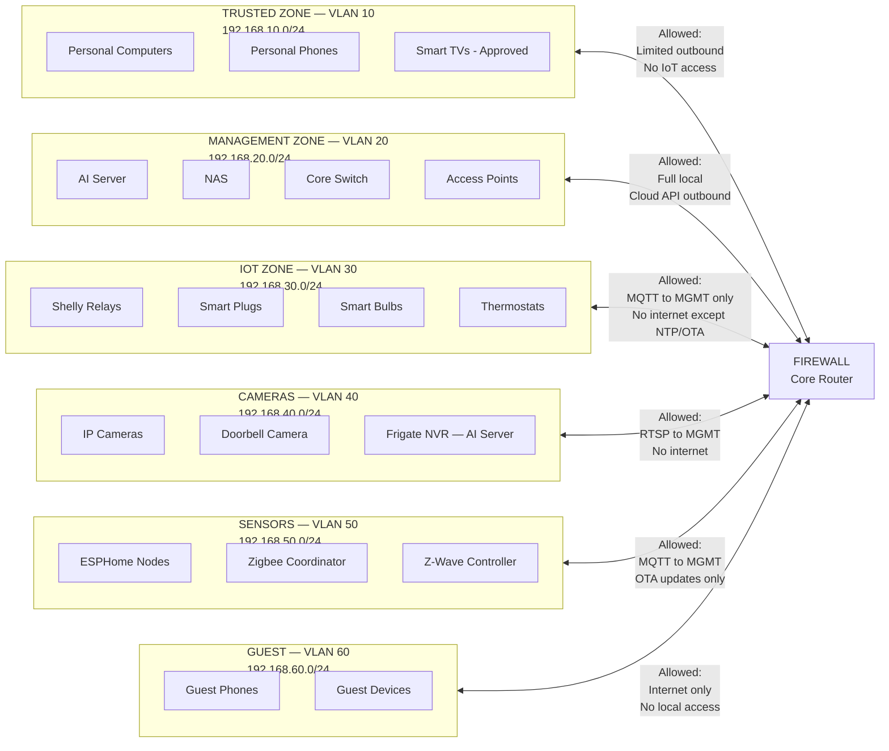
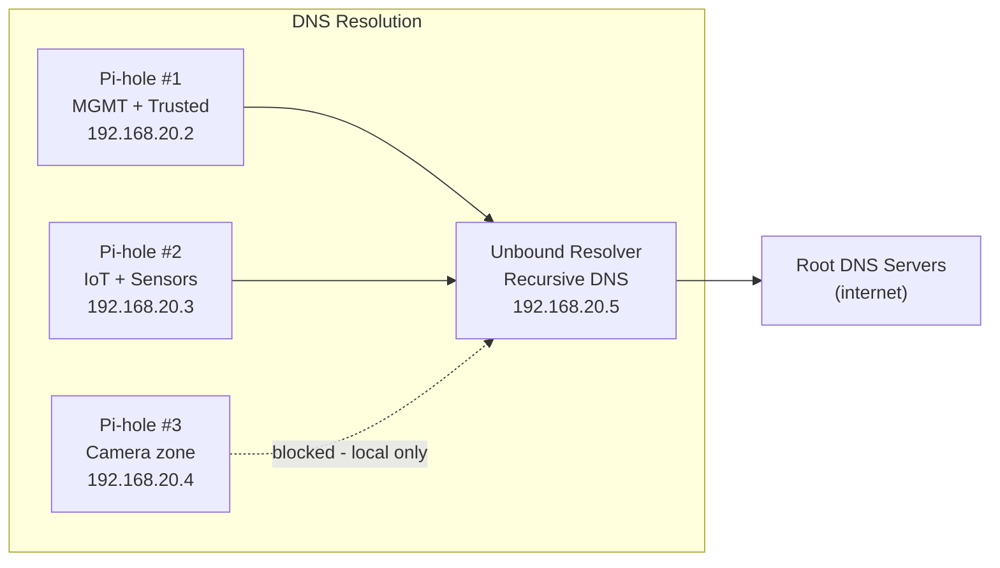
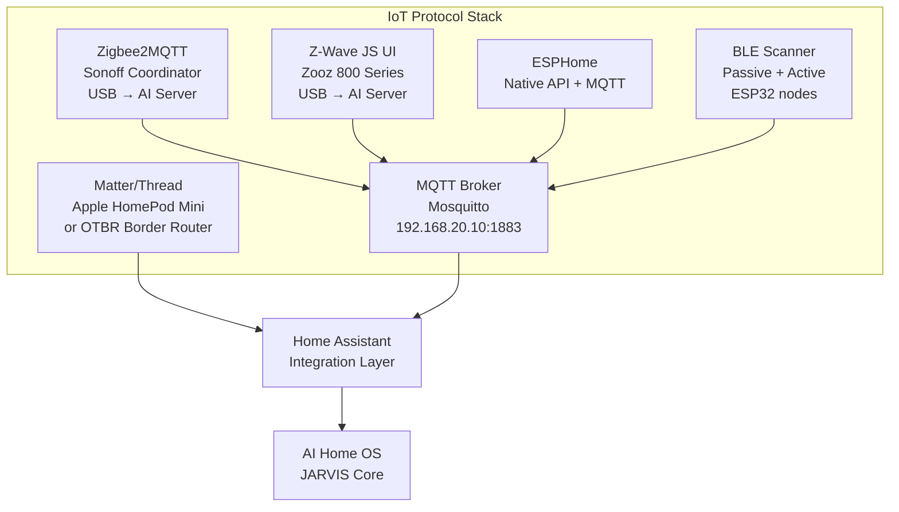
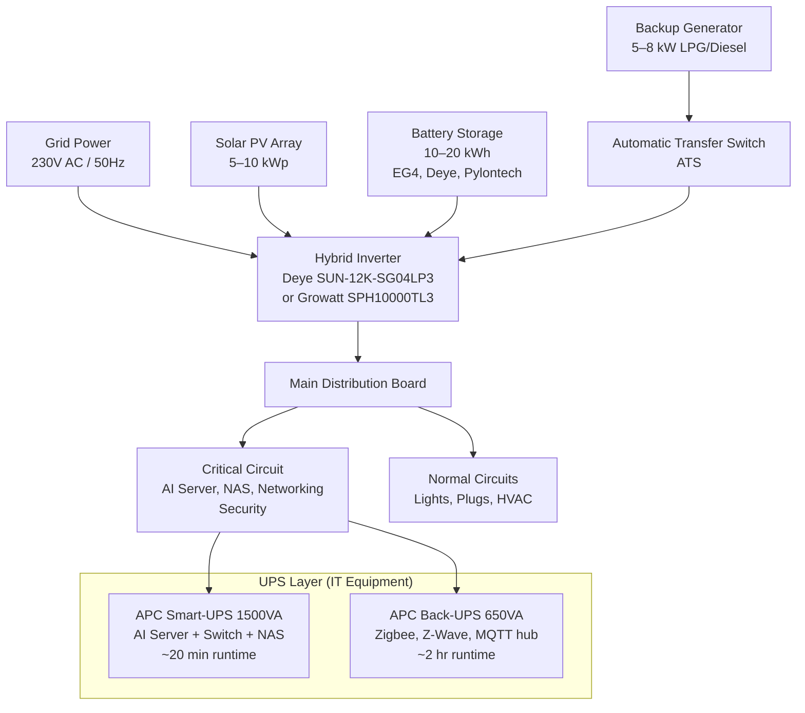
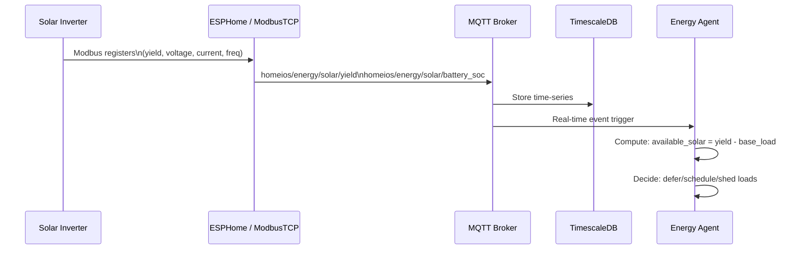
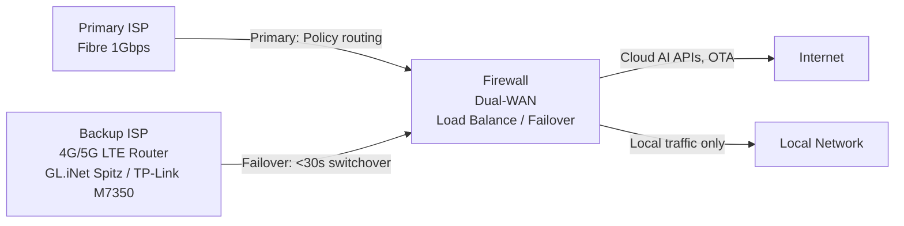
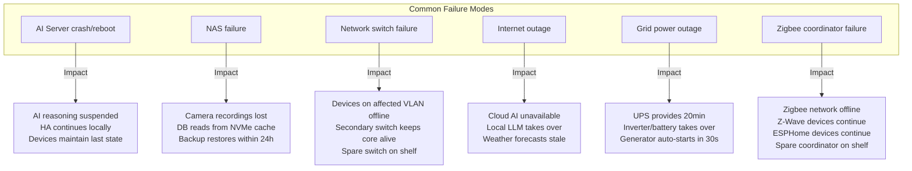

# Chapter 01 — Physical Infrastructure

**AI Home OS Internal Design Specification**  
**Classification:** Internal — Engineering  
**Status:** Draft v1.0  
**Date:** 2026-07-17

---

## Table of Contents

1. [Overview](#1-overview)
2. [Design Philosophy](#2-design-philosophy)
3. [Network Topology](#3-network-topology)
4. [VLAN Architecture & Security Zones](#4-vlan-architecture--security-zones)
5. [Wired Infrastructure](#5-wired-infrastructure)
6. [Wireless Infrastructure](#6-wireless-infrastructure)
7. [IoT Protocol Infrastructure](#7-iot-protocol-infrastructure)
8. [Compute Hardware](#8-compute-hardware)
9. [Storage Architecture](#9-storage-architecture)
10. [Power Infrastructure](#10-power-infrastructure)
11. [Solar & Battery Integration](#11-solar--battery-integration)
12. [Generator Integration](#12-generator-integration)
13. [Internet Redundancy](#13-internet-redundancy)
14. [Physical Security of Infrastructure](#14-physical-security-of-infrastructure)
15. [Hardware Bill of Materials](#15-hardware-bill-of-materials)
16. [Design Decisions & Trade-offs](#16-design-decisions--trade-offs)
17. [Deployment Considerations](#17-deployment-considerations)
18. [Failure Modes & Redundancy](#18-failure-modes--redundancy)
19. [Risks](#19-risks)
20. [Future Improvements](#20-future-improvements)
21. [References](#21-references)

---

## 1. Overview

Physical infrastructure is the bedrock upon which every layer of AI Home OS depends. No amount of software intelligence compensates for an unreliable network, underpowered compute, or a power system that fails during a storm. This chapter defines the complete physical layer — from Ethernet cables to solar panels — with enough specificity to procure, install, and maintain a production-grade AI Home OS deployment.

The infrastructure must satisfy these non-negotiable requirements:

| Requirement | Rationale |
|-------------|-----------|
| **Always-on networking** | AI Home OS processes sensor data continuously; any network gap means lost context |
| **VLAN isolation** | IoT devices must never reach personal computers or cloud credentials |
| **PoE availability** | Cameras, access points, VoIP panels, and some sensors require PoE power |
| **Low-latency local communication** | AI inference and sensor fusion must complete in <200ms for real-time response |
| **Edge compute capable of GPU inference** | Local LLM, vision, and voice processing all require significant compute |
| **Graceful degradation** | If the AI server fails, Home Assistant must continue operating autonomously |
| **Power resilience** | UPS + solar + battery must sustain the system through an 8-hour grid outage |
| **Internet redundancy** | Cloud fallback AI (GPT-4o, Claude) requires internet; two independent paths needed |
| **Physical security** | Network equipment and compute hardware must be protected from physical tampering |

### Scope of This Chapter

This chapter covers the **physical and network layer only**. Software running on this infrastructure is defined in subsequent chapters. References to Home Assistant, MQTT, Frigate, and similar services are made for context but are not fully specified here.

---

## 2. Design Philosophy

### 2.1 Edge-First

All critical AI reasoning, sensor processing, and device control runs locally. The internet is an enhancement, not a dependency. The home must be fully operational with zero internet connectivity.

### 2.2 Layered Security

Network segmentation is not optional. IoT devices are fundamentally untrusted. A compromised smart bulb must not be able to reach the AI server's management interface, the NAS, or any personal device.

### 2.3 Compute Headroom

Underprovisioning compute is the most common failure mode in smart home deployments. AI Home OS requires substantial headroom for simultaneous workloads: vision inference (Frigate), LLM reasoning (Ollama), STT (Whisper), TTS (Piper), and database queries.

### 2.4 Structured Cabling

Wi-Fi is unreliable for critical infrastructure. Every fixed device — cameras, access points, the AI server, NAS, and wall panels — must be wired. Wi-Fi is reserved for mobile devices and sensors that cannot be wired.

### 2.5 Hot-Swap Redundancy

Wherever possible, components should be hot-swappable. UPS battery packs, NAS drives, and network switches should be replaceable without service interruption.

---

## 3. Network Topology

### 3.1 Physical Network Architecture



### 3.2 Logical Network Overview

The network is divided into distinct trust zones implemented through VLANs. Each zone has its own IP subnet, firewall ruleset, and DNS scope. No cross-zone traffic is permitted except through explicit firewall rules.



---

## 4. VLAN Architecture & Security Zones

### 4.1 VLAN Definitions

| VLAN ID | Name | Subnet | Purpose | Internet Access | Inter-VLAN Access |
|---------|------|--------|---------|-----------------|-------------------|
| 10 | TRUSTED | 192.168.10.0/24 | Personal devices (PCs, phones, approved TVs) | Full | Read-only to AI dashboard |
| 20 | MANAGEMENT | 192.168.20.0/24 | AI server, NAS, network gear | Selective (cloud AI APIs, NTP, updates) | Full internal mesh |
| 30 | IOT | 192.168.30.0/24 | WiFi-connected smart devices | NTP + OTA only | MQTT port 1883/8883 to MGMT only |
| 40 | CAMERAS | 192.168.40.0/24 | IP cameras and doorbell | None | RTSP port 554 to MGMT only |
| 50 | SENSORS | 192.168.50.0/24 | ESPHome, Zigbee/Z-Wave coordinators | OTA firmware only | MQTT port 1883/8883 to MGMT only |
| 60 | GUEST | 192.168.60.0/24 | Temporary visitor devices | Full internet only | None |
| 70 | VOICE | 192.168.70.0/24 | VoIP, wall panels, speaker nodes | None | WebSocket/API to MGMT only |

### 4.2 Firewall Rule Philosophy

```
Rule Priority (highest to lowest):

1. DENY all inter-VLAN traffic by default
2. ALLOW established/related sessions (stateful firewall)
3. ALLOW specific services:
   - IoT → MGMT: TCP/UDP 1883 (MQTT), 8883 (MQTT TLS)
   - Camera → MGMT: TCP 554 (RTSP), UDP 5004 (RTP)
   - Sensor → MGMT: TCP/UDP 1883, 8883
   - Voice → MGMT: TCP 6789 (WS), 443 (HTTPS API)
   - Trusted → MGMT: TCP 443 (dashboard only)
4. ALLOW outbound internet for MGMT (selective by destination)
5. DENY all else
```

### 4.3 DNS Architecture

Each VLAN has its own DNS resolver to prevent cross-zone discovery:

- **MGMT zone**: Unbound DNS with local overrides + Pi-hole for ad/malware blocking
- **IoT zone**: Pi-hole instance with restricted upstream — blocks cloud telemetry endpoints
- **Camera zone**: Pi-hole — strictly local resolution only, no upstream
- **Guest zone**: Standard ISP DNS or Cloudflare 1.1.1.1 with no local host resolution
- **Trusted zone**: Pi-hole with local host resolution for dashboard, wall panels, AI API



> **Design Decision:** Running three Pi-hole instances (as Docker containers on the AI server) provides zone-specific DNS filtering. The Camera VLAN Pi-hole has no upstream configured — cameras resolve only hostnames defined in its local hosts file (e.g., `frigate.local → 192.168.20.x`). This prevents cameras from reaching home manufacturer cloud servers.

---

## 5. Wired Infrastructure

### 5.1 Cabling Standards

| Specification | Required | Notes |
|---------------|----------|-------|
| Cable type | Cat6A minimum | Supports 10GbE for future AI server NAS link |
| Camera runs | Cat6A | Cameras draw up to 25W PoE — thinner cable causes voltage drop |
| Maximum run length | 90m permanent link | Standard 802.3 limit; use fiber for longer runs |
| Wall socket type | Keystone Jack (568B) | Toolless preferred for field termination |
| Patch panels | 24-port Cat6A | One per equipment rack |
| Fiber (server room) | OM4 multimode | For 10GbE AI server ↔ NAS link if > 30m |
| Conduit | EMT metal conduit | Protects in-wall runs; required in commercial installs |

### 5.2 Structured Cabling Layout

Every fixed device in the home runs a dedicated home run to the central patch panel. Star topology — no daisy chaining.

```
Home Run Topology:

[Device]
    │
    │  Cat6A — dedicated run
    ▼
[Patch Panel — Equipment Room]
    │
    │  Patch cord
    ▼
[PoE Switch Port]
```

**Minimum cabling requirements for a 4-bedroom home:**

| Device Category | Quantity | Notes |
|-----------------|----------|-------|
| IP Cameras (indoor) | 6–8 | One per key room + hallways |
| IP Cameras (outdoor) | 4–6 | Front, rear, driveway, side gates |
| WiFi Access Points | 3–5 | One per floor + garden/garage |
| Wall Panels | 3–5 | Kitchen, living room, master bedroom + key areas |
| AI Server (dual NIC) | 2 | Separate management + data interfaces |
| NAS | 2 | 10GbE to AI server, 1GbE to switch |
| Network switches | 2–3 | Core + secondary distribution |
| VoIP / intercom | 2–4 | Optional, door stations |
| Spare pulls | 4–6 | Always pull spares during construction |

### 5.3 Equipment Room (Rack Layout)

```
╔═══════════════════════════════════════════╗
║          EQUIPMENT RACK (12U open frame)  ║
╠═══════════════════════════════════════════╣
║  1U  │ Patch Panel A — Cameras (24-port)  ║
║  1U  │ Patch Panel B — General (24-port)  ║
║  1U  │ Core PoE Switch (24-port)          ║
║  1U  │ Secondary Switch (8-port Flex)     ║
║  1U  │ Firewall / Router (1U appliance)   ║
║  2U  │ AI Server (NUC on shelf or 2U)     ║
║  1U  │ Zigbee + Z-Wave USB hub (shelf)    ║
║  1U  │ Patch Panel C — Sensors (12-port)  ║
║  2U  │ UPS (APC Smart-UPS 1500VA)         ║
║  1U  │ Cable management (horizontal)      ║
╚═══════════════════════════════════════════╝
```

**Notes:**
- UPS sits at the **bottom** of the rack (weight distribution)
- AI server and NAS at **middle height** (ease of access, airflow)
- Switches and patch panels at **top** (easy cable management)
- All power from UPS; UPS plugs into wall circuit
- Rack must be in a ventilated, locked enclosure or dedicated room

---

## 6. Wireless Infrastructure

### 6.1 WiFi Architecture

WiFi serves mobile devices, tablet wall panels running on battery, and IoT devices that cannot be wired. The WiFi infrastructure must support:

- **WPA3-Personal** for trusted and guest SSIDs
- **WPA3-Enterprise** optional for high-security environments
- **802.11ax (Wi-Fi 6)** minimum; Wi-Fi 6E preferred for 6 GHz band
- **Band steering** to push capable devices to 5 GHz or 6 GHz
- **SSID-to-VLAN mapping** — each SSID is bound to a specific VLAN

### 6.2 SSID Plan

| SSID | Band | VLAN | Security | Clients |
|------|------|------|----------|---------|
| `HomeNet` | 2.4 / 5 / 6 GHz | TRUSTED (10) | WPA3 | Phones, laptops, tablets |
| `HomeIoT` | 2.4 GHz only | IOT (30) | WPA2/WPA3 | Smart plugs, bulbs, thermostats |
| `HomeCamNet` | 5 GHz | CAMERAS (40) | WPA3 | WiFi cameras only (prefer PoE) |
| `HomeVoice` | 5 GHz | VOICE (70) | WPA3 | Wall panels on WiFi, speaker nodes |
| `HomeGuest` | 2.4 / 5 GHz | GUEST (60) | WPA3 | Visitor devices |

> **Design Decision:** IoT SSID is **2.4 GHz only**. This is intentional — most cheap IoT devices do not support 5 GHz, and restricting them to 2.4 GHz prevents them from competing with high-throughput devices on 5/6 GHz bands.

> **Design Decision:** Cameras should be **wired via PoE whenever possible**. WiFi cameras are acceptable only for locations where cabling is genuinely impossible (e.g., external detached garage). WiFi cameras degrade during high interference, have higher latency, and consume AP airtime needed by other devices.

### 6.3 Access Point Placement

```
Floor Plan Coverage (conceptual):

[UPPER FLOOR]
  ┌────────────────────────────────┐
  │  Bedroom 1  │  Bedroom 2       │
  │     ·       │                  │
  │         AP (Upper)             │
  │  Bedroom 3  │  Bathroom        │
  └────────────────────────────────┘

[GROUND FLOOR]
  ┌────────────────────────────────┐
  │  Kitchen    │  Living Room     │
  │             │                  │
  │        AP (Main) ·             │
  │  Study      │  Dining Room     │
  └────────────────────────────────┘

[OUTDOOR / GARAGE]
  ┌────────────────────────────────┐
  │  Garden     │  Driveway        │
  │       AP (Outdoor/Mesh)        │
  │  Garage     │  Side Gate       │
  └────────────────────────────────┘
```

**Coverage guidelines:**
- Maximum 15m between AP and client for reliable throughput
- Use -67 dBm or better signal strength as target for critical devices (wall panels, cameras)
- Overlap coverage cells by 15–20% for seamless roaming (802.11r/k/v enabled)
- Outdoor APs must be IP65-rated minimum

### 6.4 Wireless Hardware Recommendations

| Role | Recommended | Alternative | PoE Required |
|------|-------------|-------------|--------------|
| Primary indoor AP | UniFi U6 Pro | Omada EAP670 | 802.3at (25.5W) |
| Secondary indoor AP | UniFi U6 Lite | TP-Link EAP615-Wall | 802.3af (15.4W) |
| Outdoor AP | UniFi U6 Mesh | Omada EAP620-HD-Outdoor | 802.3at (25.5W) |
| WiFi controller | UniFi Network App | Omada Controller | Runs on AI server |

---

## 7. IoT Protocol Infrastructure

AI Home OS must support all major IoT protocols in use today. A fragmented IoT ecosystem means no single protocol covers all use cases.

### 7.1 Protocol Overview



### 7.2 Protocol Selection Guide

| Protocol | Range | Speed | Power | Best For | Avoid For |
|----------|-------|-------|-------|----------|-----------|
| **Zigbee** | 10–100m mesh | Low | Very low | Sensors, locks, switches, bulbs | High-bandwidth |
| **Z-Wave** | 30–100m mesh | Low | Very low | Door locks, garage, security | High density (max 232 nodes) |
| **Thread / Matter** | 10–50m mesh | Medium | Low | New devices, Apple/Google ecosystem | Legacy devices |
| **WiFi** | 30–100m | High | High | Cameras, complex devices, stream audio | Battery sensors |
| **BLE** | 1–30m | Low | Very low | Presence detection, beacons, wearables | Reliable two-way control |
| **ESPHome** | WiFi-based | High | Medium | Custom DIY sensors, high update rate sensors | Mass deployment |
| **MQTT** | N/A (transport) | N/A | N/A | Message bus for all local protocols | External cloud |
| **433 MHz** | 50–200m | Very low | Very low | Legacy doorbells, weather stations | New deployments |

### 7.3 Zigbee Infrastructure

**Coordinator Hardware:**

| Hardware | Chip | Notes |
|----------|------|-------|
| Sonoff Zigbee 3.0 USB Dongle Plus | EFR32MG21 | Recommended — excellent range, active firmware |
| SLZB-06 (PoE Zigbee coordinator) | EFR32MG21 | Best choice — Ethernet-connected, no USB reliability issues |
| Sonoff Zigbee USB Dongle-E | EFR32MG21 | Budget alternative |

> **Strong Recommendation:** Use the **SLZB-06 Ethernet Zigbee coordinator** instead of USB-connected coordinators. USB-connected coordinators are vulnerable to USB hub failures, USB power fluctuations, and physical disconnection. The SLZB-06 connects via Ethernet (its own IP) and is far more reliable in production deployments.

**Zigbee Network Design:**

```
Zigbee Mesh Topology:

[Coordinator — SLZB-06]
        │
    ────┴────────────────────────────
    │               │               │
[Router 1]      [Router 2]      [Router 3]
Ikea Bulb       Shelly Plug     Sonoff ZBMINI
Living Room     Kitchen         Hallway
    │               │
[End Device]   [End Device]
Door Sensor    Temp Sensor
```

**Rules for Zigbee mesh health:**
- Maintain at least 1 router device per 10m radius
- Prefer mains-powered devices as routers (never battery devices)
- Keep total end devices below 200 (Zigbee coordinator limit varies: 50–200+)
- Avoid Zigbee channel overlap with WiFi 2.4 GHz channels:
  - WiFi channel 1 → avoid Zigbee channels 11–14
  - WiFi channel 6 → avoid Zigbee channels 16–21
  - WiFi channel 11 → avoid Zigbee channels 22–24
  - **Recommended: Zigbee channel 15 or 20 with WiFi on channel 1 and 11**

### 7.4 Z-Wave Infrastructure

Z-Wave is used for security-critical devices — door locks, garage openers, motion detectors — where mesh reliability and interference resistance are paramount. Z-Wave operates at 868 MHz (Europe) or 908 MHz (US), completely separate from WiFi and Zigbee.

| Hardware | Notes |
|----------|-------|
| Zooz ZST39 800 Series (USB) | Recommended — Z-Wave 800 chip, Long Range support |
| Aeotec Z-Stick 7 (USB) | Alternative — Z-Wave 700 series |

**Z-Wave device recommendations:**

| Device Type | Recommended Device |
|-------------|-------------------|
| Door/window sensor | Zooz ZSE41 / Aeotec Door/Window Sensor 7 |
| Door lock | Schlage BE469ZP / Yale Assure Lock 2 |
| Garage controller | Zooz ZEN17 relay |
| Motion + presence | Zooz ZSE40 / Aeotec MultiSensor 7 |
| Siren / alarm | Dome Siren DMSS1 |

### 7.5 Matter & Thread Infrastructure

Matter is the emerging unified smart home protocol backed by Apple, Google, Amazon, and Samsung. Thread is the underlying mesh network protocol for Matter devices.

**Thread Border Router options:**

| Hardware | Notes |
|----------|-------|
| Apple HomePod mini | Best Thread border router for Apple ecosystem |
| Apple TV 4K (3rd gen) | Alternative Apple border router |
| Google Nest Hub (2nd gen) | Google ecosystem border router |
| OpenThread Border Router (OTBR) | DIY on Raspberry Pi — integrates with Home Assistant |
| SLZB-07 (Ethernet Thread coordinator) | Ethernet-connected OTBR — recommended for production |

> **Design Decision:** Do not rely solely on Apple or Google devices as Thread border routers. These are consumer products that may be discontinued, updated with breaking firmware, or require an active Apple/Google account. Deploy an **OTBR (OpenThread Border Router)** on the AI server or a dedicated Raspberry Pi for production reliability.

**Matter integration path:**
```
Matter Device
    │
    ▼
Thread Border Router (OTBR)
    │
    ▼
Home Assistant (Matter Integration)
    │
    ▼
MQTT → AI Home OS
```

### 7.6 ESPHome Sensor Network

ESPHome runs on ESP32 microcontrollers and provides high-frequency, custom sensor data that commercial sensors cannot offer.

**ESPHome deployment model:**

```yaml
# Example ESPHome node definition (pseudo-config)
# Node: living_room_environment

esphome:
  name: living-room-env
  platform: esp32

wifi:
  ssid: HomeIoT
  password: !secret wifi_password

mqtt:
  broker: 192.168.20.10
  port: 1883
  topic_prefix: homeios/sensors/living_room

sensor:
  - platform: bme280
    temperature:
      name: Living Room Temperature
      filters: [median: window_size: 5]
    humidity:
      name: Living Room Humidity
    pressure:
      name: Living Room Pressure
    update_interval: 30s

  - platform: ccs811
    eco2:
      name: Living Room eCO2
    tvoc:
      name: Living Room TVOC
    update_interval: 60s
```

**ESPHome node placement (reference 4-bedroom home):**

| Node | Location | Sensors |
|------|----------|---------|
| env-living | Living room ceiling | Temp, humidity, CO2, VOC, light, PIR |
| env-kitchen | Kitchen cabinet | Temp, humidity, CO2, gas |
| env-master | Master bedroom | Temp, humidity, CO2, PIR |
| env-bed2 | Bedroom 2 | Temp, humidity |
| env-bed3 | Bedroom 3 | Temp, humidity |
| env-study | Study/office | Temp, CO2, VOC, light |
| env-garage | Garage | Temp, humidity, gas, door contact |
| env-outdoor | External wall | Temp, humidity, barometric pressure, rain |
| energy-main | DB room | CT clamps, voltage monitoring |
| energy-solar | Inverter room | DC voltage, current, AC output |

### 7.7 BLE Presence Infrastructure

Bluetooth Low Energy is used for **passive presence detection** — detecting the BLE advertisements broadcast by phones, wearables, and dedicated BLE beacons to determine who is home and where in the home they are.

**BLE Scanner hardware:**

| Option | Notes |
|--------|-------|
| ESP32 with Bluetooth | ESPHome passive BLE scanner — cheapest option |
| Shelly BLU Gateway | Dedicated BLE gateway with good range |
| UniFi Access Points | UniFi APs can scan BLE — no extra hardware if UniFi deployed |

**BLE scanner placement for room-level presence:**

```
BLE Scanner Nodes (minimum for room-level resolution):

Living Room ──── [BLE Node 1]
Kitchen ──────── [BLE Node 2]  
Hallway ─────── [BLE Node 3]  ← critical — triangulation anchor
Master Bedroom ─ [BLE Node 4]
Bedroom 2 ────── [BLE Node 5]
Study ────────── [BLE Node 6]
Outdoors ──────── [BLE Node 7]
```

Room-level presence is achieved through **RSSI trilateration**: comparing signal strength from multiple scanners to estimate device location. Full UWB-based room-level presence is covered in Chapter 5 (Identity System).

### 7.8 MQTT Broker Configuration

MQTT is the backbone message bus for all sensor data, device states, and internal service communication within AI Home OS.

```
MQTT Topic Hierarchy:

homeios/
├── sensors/
│   ├── {room}/
│   │   ├── temperature
│   │   ├── humidity
│   │   ├── co2
│   │   ├── presence
│   │   └── ...
│   └── energy/
│       ├── solar/yield
│       ├── battery/soc
│       └── grid/consumption
├── cameras/
│   └── {camera_id}/
│       ├── motion
│       └── detections
├── identity/
│   └── {person_id}/
│       ├── location
│       └── confidence
├── agents/
│   └── {agent_name}/
│       ├── commands
│       └── responses
└── homeassistant/
    └── (standard HA MQTT discovery topics)
```

**Mosquitto configuration best practices:**

```conf
# /etc/mosquitto/mosquitto.conf (reference)

listener 1883 192.168.20.10        # Internal MQTT (no TLS, trusted VLAN only)
listener 8883 192.168.20.10        # MQTT with TLS (for IoT VLAN devices)
certfile /etc/mosquitto/certs/server.crt
keyfile  /etc/mosquitto/certs/server.key
cafile   /etc/mosquitto/certs/ca.crt
require_certificate true           # Mutual TLS for IoT devices

allow_anonymous false
password_file /etc/mosquitto/passwd

persistence true
persistence_location /var/lib/mosquitto/
log_dest file /var/log/mosquitto/mosquitto.log

max_queued_messages 10000
max_inflight_messages 100
```

---

## 8. Compute Hardware

### 8.1 AI Server — Primary Compute Node

The AI server is the most critical piece of hardware in the entire deployment. It runs:

- Home Assistant (containerized)
- Frigate NVR (GPU-accelerated vision inference)
- Ollama (local LLM inference)
- Whisper STT (local speech recognition)
- Piper TTS (local text-to-speech)
- PostgreSQL + TimescaleDB (sensor history and memory)
- pgvector / Qdrant (vector memory)
- Neo4j (knowledge graph)
- Redis (cache + pub/sub)
- Mosquitto MQTT broker
- Zigbee2MQTT + Z-Wave JS
- All Docker/Kubernetes services

This is not a Raspberry Pi workload. This requires a real server.

**Recommended primary configuration:**

| Component | Specification | Notes |
|-----------|---------------|-------|
| CPU | Intel Core Ultra 9 185H / AMD Ryzen 9 7940HS | 16+ cores, integrated NPU preferred |
| RAM | 64 GB DDR5 (minimum 32 GB) | Ollama 7B needs 8GB; 13B needs 16GB; 32B+ needs 32GB+ |
| GPU | NVIDIA GeForce RTX 4070 / 4080 (12–16 GB VRAM) | Required for Frigate + Ollama GPU inference |
| Primary SSD | 1 TB NVMe Gen4 (OS + Docker) | Samsung 990 Pro / WD Black SN850X |
| Secondary SSD | 2 TB NVMe Gen4 (model storage, vector DB) | Ollama models alone: 4–20 GB each |
| NIC | 2× 2.5GbE or 1× 10GbE | One management, one data/camera |
| Form factor | Mini-PC / NUC / Tower | NUC 14 Pro, Beelink GTR7 Pro, or custom mATX |

**Alternative: Custom mATX server build**

For maximum GPU capability, a custom Mini-ITX or mATX build with a full-length RTX card outperforms any NUC-style system:

| Component | Recommendation |
|-----------|---------------|
| Motherboard | ASRock Z790M-ITX/ax (Mini-ITX) |
| CPU | Intel Core i7-13700 / i9-13900 |
| RAM | 64 GB DDR5-5600 (2× 32 GB) |
| GPU | NVIDIA RTX 4070 Ti SUPER (16 GB VRAM) |
| PSU | 650W SFX (Corsair SF750) |
| Case | Fractal Design Node 304 / Sliger SM580 |

> **Design Decision:** VRAM is the critical constraint. Frigate using YOLO + object detection requires 2–4 GB VRAM. Ollama running Llama 3.3 70B quantized (Q4) requires approximately 40 GB — either GPU VRAM or system RAM (slow). For a budget build, a 12 GB GPU + 64 GB RAM allows Frigate to use GPU while Ollama runs smaller models. For a premium build, 2× RTX 3090 (24 GB each) enables running 34B+ models with room for vision.

### 8.2 Alternative: Coral TPU for Frigate

If a full NVIDIA GPU is not in budget, a Google Coral TPU can accelerate Frigate object detection with extremely low power consumption:

| Coral Device | Interface | Performance | Power |
|-------------|-----------|-------------|-------|
| Coral USB Accelerator | USB 3.0 | 4 TOPS | 2W |
| Coral M.2 Accelerator (A+E key) | M.2 slot | 4 TOPS | 2W |
| Coral PCIe Accelerator | PCIe x1 | 4 TOPS | 4W |
| Dual Coral (two devices) | USB/PCIe | 8 TOPS | 4–8W |

> **Limitation:** Coral TPU **only** accelerates object detection (Frigate). It cannot run LLMs. If choosing Coral, still budget for a capable CPU (Intel Core i7+) for Whisper STT and Ollama CPU inference.

### 8.3 Compute Sizing by Deployment Scale

| Scale | CPU | RAM | GPU | Storage |
|-------|-----|-----|-----|---------|
| Studio / 1-bed apartment | Core i5-13600H | 32 GB | Coral USB | 512 GB NVMe |
| 2–3 bedroom home | Core i7-13700H | 64 GB | RTX 3060 12 GB | 1 TB NVMe |
| 4–5 bedroom home (**reference design**) | Core Ultra 9 / Ryzen 9 | 64 GB | RTX 4070 12 GB | 2 TB NVMe |
| Large home / villa | Xeon W / Ryzen Threadripper | 128 GB | RTX 4090 24 GB | 4 TB NVMe |
| Commercial / office | Dual server, Kubernetes cluster | 256 GB | 2× RTX 4090 or A4000 | NAS-backed |

### 8.4 Containerization Strategy

All services run in **Docker containers**, orchestrated by **Docker Compose** for a single-node residential deployment, or **k3s (lightweight Kubernetes)** for multi-node or commercial deployments.

```yaml
# docker-compose.yml (abbreviated reference)
version: "3.9"
services:

  homeassistant:
    image: ghcr.io/home-assistant/home-assistant:stable
    network_mode: host
    volumes:
      - ./ha-config:/config
    restart: unless-stopped
    privileged: true

  mosquitto:
    image: eclipse-mosquitto:2
    ports: ["1883:1883", "8883:8883"]
    volumes:
      - ./mosquitto/config:/mosquitto/config
      - ./mosquitto/data:/mosquitto/data
    restart: unless-stopped

  frigate:
    image: ghcr.io/blakeblackshear/frigate:stable
    privileged: true
    volumes:
      - ./frigate-config:/config
      - /dev/bus/usb:/dev/bus/usb  # Coral USB
    deploy:
      resources:
        reservations:
          devices:
            - driver: nvidia
              count: 1
              capabilities: [gpu]
    restart: unless-stopped

  ollama:
    image: ollama/ollama:latest
    deploy:
      resources:
        reservations:
          devices:
            - driver: nvidia
              count: 1
              capabilities: [gpu]
    volumes:
      - ./ollama-models:/root/.ollama
    restart: unless-stopped

  postgres:
    image: timescale/timescaledb-ha:pg16
    environment:
      POSTGRES_PASSWORD: ${DB_PASSWORD}
      POSTGRES_DB: homeios
    volumes:
      - ./postgres-data:/home/postgres/pgdata/data
    restart: unless-stopped

  redis:
    image: redis:7-alpine
    command: redis-server --requirepass ${REDIS_PASSWORD}
    restart: unless-stopped

  qdrant:
    image: qdrant/qdrant:latest
    volumes:
      - ./qdrant-data:/qdrant/storage
    restart: unless-stopped

  neo4j:
    image: neo4j:5
    environment:
      NEO4J_AUTH: neo4j/${NEO4J_PASSWORD}
    volumes:
      - ./neo4j-data:/data
    restart: unless-stopped
```

### 8.5 Service Resource Allocation

| Service | CPU | RAM | GPU VRAM | Storage |
|---------|-----|-----|----------|---------|
| Home Assistant | 1 core | 512 MB | 0 | 1 GB |
| Frigate (4 cameras) | 2 cores | 2 GB | 2–4 GB | 500 GB (recordings) |
| Ollama (Llama 3.3 8B) | 4 cores | 8 GB | 8 GB | 5 GB (model) |
| Ollama (Llama 3.3 70B Q4) | 8 cores | 4 GB | 40 GB | 40 GB (model) |
| Whisper (base/small) | 2 cores | 1 GB | 1 GB | 200 MB |
| Whisper (large-v3) | 4 cores | 3 GB | 3 GB | 3 GB |
| Piper TTS | 1 core | 256 MB | 0 | 50 MB |
| PostgreSQL + TimescaleDB | 2 cores | 4 GB | 0 | 50–500 GB |
| Redis | 0.5 core | 1 GB | 0 | 1 GB |
| Qdrant | 1 core | 2 GB | 0 | 5–20 GB |
| Neo4j | 1 core | 2 GB | 0 | 5 GB |
| Mosquitto | 0.5 core | 256 MB | 0 | 1 GB |
| Zigbee2MQTT | 0.5 core | 256 MB | 0 | 100 MB |
| Z-Wave JS | 0.5 core | 256 MB | 0 | 100 MB |
| AI Agents (JARVIS Core) | 4 cores | 4 GB | 0 | 1 GB |
| **Total (8B model)** | **~22 cores** | **~30 GB** | **~16 GB** | **~600 GB** |
| **Total (70B model)** | **~26 cores** | **~30 GB** | **~50 GB** | **~650 GB** |

---

## 9. Storage Architecture

### 9.1 Storage Tiers

```mermaid
graph LR
    subgraph HOT["Hot Tier — NVMe SSD"]
        OS[OS + Docker images]
        DB[PostgreSQL + Redis]
        MODELS[AI Models - Ollama]
        VECTOR[Vector DB - Qdrant]
    end

    subgraph WARM["Warm Tier — NAS HDD / SSD"]
        RECORDINGS[Camera Recordings\n7–30 day rolling]
        SNAPSHOTS[Motion Snapshots]
        BACKUPS[Database Backups]
        ARCHIVES[Historical Sensor Data]
    end

    subgraph COLD["Cold Tier — Offsite / Cloud"]
        LONGTERM[Long-term archives\n90+ days]
        DRBACKUP[Disaster Recovery Backup]
    end

    HOT -->|"Daily sync"| WARM
    WARM -->|"Weekly sync"| COLD
```



### 9.2 NAS Configuration

**Recommended NAS:** Synology DS923+ (4-bay) or DS1522+ (5-bay)

| Configuration | Notes |
|---------------|-------|
| Drive slots | 4–6 bays minimum |
| RAID type | SHR-2 (Synology Hybrid RAID, 2-drive fault tolerance) or RAID 6 |
| Drive type | Seagate IronWolf Pro 8TB or WD Red Pro 8TB — NAS-rated drives mandatory |
| SSD cache | 2× 500GB NVMe SSD in read-write cache (dramatically improves camera write performance) |
| RAM | Upgrade to 32 GB for concurrent Synology apps + cache management |
| 10GbE card | Add 10GbE card for AI server connection (Synology E10G21-F2) |
| Synology apps | Surveillance Station (optional), Hyper Backup, Active Backup |

**Storage allocation (8-camera system, 30-day retention):**

| Purpose | Size | Notes |
|---------|------|-------|
| Camera recordings (8 cameras, 30 days, 1080p H.265) | 8–12 TB | Highly variable by motion frequency |
| Motion snapshots (Frigate) | 200 GB | 30-day rolling |
| Database backups (daily, 90-day retention) | 200 GB | PostgreSQL dump compressed |
| Historical sensor data (1 year, TimescaleDB export) | 100 GB | Compressed columnar format |
| AI model archive | 100 GB | Backup of downloaded models |
| **Total recommended NAS** | **~14–16 TB usable** | After RAID overhead |

### 9.3 Backup Strategy

```
3-2-1 Backup Rule Applied:

3 copies of data:
  ├── Primary: AI Server NVMe (live)
  ├── Secondary: NAS (daily sync, on-premises)
  └── Tertiary: Offsite cloud (weekly sync)

2 different storage types:
  ├── NVMe SSD (AI server)
  └── HDD RAID (NAS)

1 offsite copy:
  └── Backblaze B2 / Wasabi / AWS S3 Glacier
      (encrypted before upload — AES-256)
```

**Backup schedule:**

| Data | Frequency | Destination | Retention |
|------|-----------|-------------|-----------|
| PostgreSQL full dump | Daily 02:00 | NAS + cloud | 90 days |
| PostgreSQL WAL archiving | Continuous | NAS | 7 days |
| Home Assistant config | Daily | NAS + cloud | 90 days |
| Frigate recordings | Real-time write | NAS | 30 days rolling |
| AI model weights | On change | NAS | Indefinite |
| Docker volumes | Daily | NAS | 30 days |
| Neo4j dump | Daily | NAS + cloud | 90 days |

---

## 10. Power Infrastructure

### 10.1 Power Architecture Overview



### 10.2 UPS Configuration

Two UPS units protect the IT infrastructure:

**UPS 1 — Primary IT UPS (APC Smart-UPS 1500VA/1000W):**
- Protects: AI server, core PoE switch, NAS
- Runtime at 50% load: ~20 minutes (bridge time for inverter/generator switchover)
- Management: USB or network card for graceful shutdown signaling
- AI server monitors UPS via `apcupsd` or NUT (Network UPS Tools)

**UPS 2 — Networking UPS (APC Back-UPS 650VA/400W):**
- Protects: Firewall/router, secondary switch, Zigbee/Z-Wave coordinators
- Runtime at 50% load: ~45–60 minutes
- Intentionally separate from primary UPS — if AI server crashes, networking survives

> **Critical Design Decision:** Separate the **networking UPS** from the **server UPS**. If the server UPS fails or triggers an overload shutdown, the network must remain online so that battery-powered IoT devices continue working and the firewall can accept remote management.

### 10.3 Power Consumption Budget

| Device | Typical Draw | Max Draw |
|--------|-------------|----------|
| AI Server (Core Ultra 9 + RTX 4070) | 120–180W | 350W |
| NAS (Synology DS923+, 4 drives) | 40–60W | 100W |
| Core PoE Switch (24-port, 4 cameras) | 60–80W | 250W |
| Secondary Switch (8-port) | 5–10W | 30W |
| Firewall/Router | 15–25W | 40W |
| WiFi APs (3× U6 Pro) | 15–25W total | 75W total |
| IP Cameras (8× PoE, avg 10W each) | 60–80W | 200W |
| Zigbee/Z-Wave coordinators | 2–5W | 10W |
| **Total IT Load** | **~320–450W** | **~1000W** |

> UPS 1 (1000W/1500VA) provides sufficient headroom for the primary IT load at 50–70% capacity. At full load, runtime drops to ~10 minutes — acceptable as a bridge for generator start or inverter switchover.

### 10.4 Critical vs. Non-Critical Circuit Planning

```
Critical Circuit (must have power at all times):
├── AI Server
├── NAS
├── Core networking (switch, firewall, APs)
├── Security cameras
├── Door locks (powered strike plates)
├── Fire alarm control panel
├── HVAC control (safety-critical in extreme climates)
└── Lighting (minimum one circuit per floor — emergency)

Normal Circuit (can shed load during power events):
├── Entertainment (TV, audio)
├── Kitchen appliances
├── EV charger
├── Washing machine
├── Pool pump
└── Irrigation system
```

### 10.5 Automatic Transfer Switch (ATS)

The ATS is essential for seamless transition between grid power and generator power during outages.

| ATS Feature | Requirement |
|-------------|------------|
| Transfer time | < 30ms for UPS-backed loads (standard ATS: 2–10 seconds) |
| Type | Open transition (break-before-make) for residential; closed transition optional for commercial |
| Rating | Size to generator capacity + 25% headroom |
| Monitoring | Dry contact status to AI server for outage detection |
| Manual bypass | Always include for maintenance |

**Recommended:** Changeover switch with dry contact output → ESPHome node → MQTT → AI Home OS energy agent receives real-time notification of grid outage, battery status, and generator status.

---

## 11. Solar & Battery Integration

### 11.1 Solar System Overview

Solar integration is a first-class feature of AI Home OS. The AI reasoning engine uses real-time and forecast solar production data to make energy-intelligent decisions.

**Recommended inverter models:**

| Inverter | Rating | Notes |
|----------|--------|-------|
| Deye SUN-12K-SG04LP3 | 12 kW | Excellent Modbus/RS485, SolarMan API, widely used |
| Growatt SPH10000TL3 | 10 kW | Good HA integration via ShineMon or ModbusTCP |
| SMA Sunny Boy | 5–10 kW | Industry-grade, SunSpec Modbus, premium |
| Huawei SUN2000 | 5–20 kW | Excellent monitoring, FusionSolar API, enterprise grade |
| Fronius Symo | 6–24 kW | SolarAPI (REST-based), excellent HA integration |

> **Recommendation:** **Deye** and **Growatt** inverters offer the best combination of Home Assistant integration, local Modbus access, and cost. Huawei is recommended for commercial installations where enterprise-grade monitoring and warranties are required.

### 11.2 Solar Data Integration Path



**Key Modbus registers to monitor (Deye example):**

| Register | Description | Update Rate |
|----------|-------------|-------------|
| 0x003C | PV Power (W) | 5 seconds |
| 0x00BA | Battery SOC (%) | 10 seconds |
| 0x00B9 | Battery Voltage (V) | 10 seconds |
| 0x00C4 | Battery Charge Power (W) | 5 seconds |
| 0x0250 | Grid Import Power (W) | 5 seconds |
| 0x0251 | Grid Export Power (W) | 5 seconds |
| 0x00AC | Total Daily Yield (kWh) | 60 seconds |

### 11.3 Battery System

| Parameter | Specification |
|-----------|---------------|
| Chemistry | LFP (LiFePO4) preferred — safer, longer cycle life (3000–6000 cycles) |
| Capacity | 10 kWh (minimum) — 20 kWh recommended for overnight backup |
| Voltage | 48V (most hybrid inverters) or 51.2V LFP stack |
| BMS | Must expose SOC, SOH, temperature, cell voltages via CAN or RS485 |
| Brands | Pylontech US5000, EG4 LL-S, BYD Battery Box, Dyness |
| Max charge rate | 0.5C (5 kW for 10 kWh) — prevents degradation |
| Min SOC reserve | 20% (AI Home OS never discharges below this without explicit override) |
| Degradation monitoring | AI Maintenance Agent tracks SOH monthly via capacity tests |

---

## 12. Generator Integration

### 12.1 Generator Selection

| Type | Fuel | Pros | Cons | Best For |
|------|------|------|------|---------|
| Inverter generator | Petrol | Clean sine wave, quiet, portable | Fuel storage, short run time | Occasional outage, portable |
| Standby generator | LPG/Natural Gas | Auto-start, unlimited fuel, reliable | Installation cost, permanent | Frequent outages, critical systems |
| Standby generator | Diesel | Long run time, high power | Fuel storage, emissions | Commercial, extended outages |

**Recommended for residential AI Home OS:** LPG standby generator, 5–8 kW, with automatic start.

**Brands:** Generac Guardian, Kohler, Champion 8000W, Briggs & Stratton

### 12.2 Generator Monitoring

```yaml
# ESPHome node: generator-monitor
binary_sensor:
  - platform: gpio
    pin: GPIO4
    name: Generator Running
    device_class: running
    on_press:
      - mqtt.publish:
          topic: homeios/energy/generator/status
          payload: "running"

sensor:
  - platform: adc
    pin: GPIO34
    name: Generator Fuel Level
    attenuation: 11db
    filters:
      - calibrate_linear:
          - 0.5 -> 0.0    # empty
          - 3.2 -> 100.0  # full
```

---

## 13. Internet Redundancy

### 13.1 Dual-WAN Configuration



**Failover policy:**
- Primary: Fibre/cable ISP (1 Gbps) — all outbound traffic
- Failover trigger: Primary WAN health check fails (ping to 1.1.1.1 + 8.8.8.8, 3 failures in 10 seconds)
- Failover target: LTE/5G router (SIM-based)
- Switchover time: < 30 seconds (most software-defined failover)
- AI Home OS logs WAN failover events and notifies the user

**LTE/5G backup router options:**

| Device | Notes |
|--------|-------|
| GL.iNet Spitz AX (GL-X3000) | WiFi 6, 5G SA/NSA, OpenWrt — excellent for failover |
| TP-Link Archer MR600 | 4G LTE, easy to configure, lower cost |
| Huawei B818 | 4G LTE, excellent modem quality |
| Peplink MAX Transit | Enterprise-grade, carrier bonding — for commercial |

### 13.2 Services That Require Internet

| Service | Internet Required | Notes |
|---------|------------------|-------|
| Cloud LLM fallback (GPT-4o, Claude) | Yes | Used when local LLM is insufficient |
| Weather forecast API | Yes | OpenWeatherMap, Meteomatics |
| Calendar sync (Google, Outlook) | Yes | Read-only, cached locally |
| Mobile app remote access | Yes (optional) | Wireguard VPN tunnel home |
| OTA firmware updates | Yes | Scheduled, not time-critical |
| Cloud CCTV backup | Yes (optional) | Privacy risk — not recommended |
| Voice cloud fallback (Deepgram) | Yes | Only when Whisper quality is insufficient |

### 13.3 Remote Access Architecture

Remote access uses **WireGuard VPN** — not port forwarding, not cloud relay services that have privacy implications.

```
Remote Access Flow:

[User Phone - away from home]
    │
    ▼
[WireGuard VPN Client on Phone]
    │
    │  Encrypted tunnel over internet
    ▼
[WireGuard Server on Firewall]
    │
    ▼
[Home Internal Network — full access]
```

**WireGuard setup:**
- Server: runs on the firewall (UniFi Dream Machine Pro has built-in WireGuard, or pfSense WireGuard package)
- Clients: WireGuard app on iOS/Android, WireGuard app on macOS/Windows/Linux
- Each person gets a unique WireGuard key pair (no shared credentials)
- Remote access permissions enforced by the Identity System (Chapter 5)

---

## 14. Physical Security of Infrastructure

### 14.1 Equipment Room Security

| Control | Implementation |
|---------|---------------|
| Locked enclosure | Rack cabinet with physical key lock |
| Access logging | Door sensor on equipment room + AI Home OS logs all entries |
| Camera coverage | At least one camera inside equipment room |
| Tamper detection | Intrusion sensor on rack enclosure door |
| Kensington locks | AI server and NAS locked to rack shelf |

### 14.2 Device Anti-Tamper

| Device Type | Protection |
|-------------|-----------|
| Outdoor cameras | Mounted out of reach (3m+ height), tamper-resistant screws |
| Access points | Ceiling-mounted with security Torx screws |
| Smart locks | Deadbolt reinforcement, strike plate with 3" screws |
| UPS | In locked equipment room |

### 14.3 Supply Chain Security

- Only purchase network equipment and cameras from **authorized resellers**
- Verify firmware integrity (checksum from manufacturer) before deployment
- Flash IoT devices with ESPHome custom firmware to eliminate vendor cloud dependency
- Do not use devices that require manufacturer cloud accounts for local operation

---

## 15. Hardware Bill of Materials

### 15.1 Reference BOM — 4-Bedroom Home

**Networking:**

| Item | Model | Qty | Unit Cost (USD) | Total |
|------|-------|-----|----------------|-------|
| Firewall/Router | UniFi Dream Machine Pro | 1 | $380 | $380 |
| Core PoE Switch | UniFi USW-Pro-24-POE (400W) | 1 | $520 | $520 |
| Secondary Switch | UniFi USW-Flex-Mini | 2 | $30 | $60 |
| WiFi AP — Indoor | UniFi U6 Pro | 3 | $180 | $540 |
| WiFi AP — Outdoor | UniFi U6 Mesh | 1 | $199 | $199 |
| LTE Backup Router | GL.iNet Spitz AX | 1 | $250 | $250 |
| **Networking Subtotal** | | | | **$1,949** |

**Compute:**

| Item | Model | Qty | Unit Cost | Total |
|------|-------|-----|-----------|-------|
| AI Server (NUC) | Intel NUC 14 Pro (Core Ultra 9, 64 GB, 2TB NVMe) | 1 | $1,100 | $1,100 |
| GPU | NVIDIA RTX 4070 12 GB (external Thunderbolt eGPU or internal) | 1 | $600 | $600 |
| NAS | Synology DS923+ | 1 | $700 | $700 |
| NAS Drives | Seagate IronWolf Pro 8TB | 4 | $230 | $920 |
| NAS NVMe Cache | Samsung 990 Pro 500GB | 2 | $80 | $160 |
| 10GbE NIC (NAS) | Synology E10G21-F2 | 1 | $100 | $100 |
| **Compute Subtotal** | | | | **$3,580** |

**IoT Coordinators:**

| Item | Model | Qty | Unit Cost | Total |
|------|-------|-----|-----------|-------|
| Zigbee Coordinator | SLZB-06 (Ethernet) | 1 | $50 | $50 |
| Z-Wave Controller | Zooz ZST39 800 (USB) | 1 | $40 | $40 |
| ESPHome Nodes (env) | ESP32 DevKit + sensors | 8 | $25 | $200 |
| BLE Scanner Nodes | ESP32 BLE Scanner | 6 | $15 | $90 |
| **Coordinator Subtotal** | | | | **$380** |

**Power:**

| Item | Model | Qty | Unit Cost | Total |
|------|-------|-----|-----------|-------|
| Primary UPS | APC Smart-UPS 1500VA LCD | 1 | $650 | $650 |
| Network UPS | APC Back-UPS 650VA | 1 | $120 | $120 |
| **Power Subtotal** | | | | **$770** |

**Cameras (baseline, cameras chapter for full spec):**

| Item | Model | Qty | Unit Cost | Total |
|------|-------|-----|-----------|-------|
| PoE IP Camera (4MP H.265) | Reolink RLC-810A | 6 | $50 | $300 |
| PoE IP Camera (8MP 4K) | Amcrest IP8M-2493EW | 2 | $100 | $200 |
| **Camera Subtotal** | | | | **$500** |

**Grand Total (Reference 4-bedroom):**

| Category | Cost |
|----------|------|
| Networking | $1,949 |
| Compute | $3,580 |
| IoT Coordinators | $380 |
| Power | $770 |
| Cameras (baseline) | $500 |
| Cabling + installation | ~$800–2,000 |
| **Total (excluding solar, sensors, audio)** | **~$8,000–9,200** |

> **Note:** This BOM covers physical infrastructure only. Sensors (Chapter 2), audio (Chapter 4), and energy systems (Chapter 10) are additional. A fully-equipped 4-bedroom AI Home OS deployment with all layers is estimated at $15,000–$25,000 in hardware.

---

## 16. Design Decisions & Trade-offs

### 16.1 UniFi vs. Omada vs. pfSense + Open Source

| Factor | UniFi | Omada | pfSense + Managed Switch |
|--------|-------|-------|--------------------------|
| Ease of setup | ★★★★★ | ★★★★ | ★★ |
| Features | ★★★★ | ★★★ | ★★★★★ |
| Cost | ★★★ | ★★★★ | ★★ |
| Cloud dependency | Optional (local controller) | Optional | None |
| Enterprise readiness | ★★★★ | ★★★ | ★★★★★ |
| Community / docs | Excellent | Good | Excellent |

**Decision:** UniFi is recommended for residential and small commercial deployments due to its ease of use, excellent VLAN support, and strong community. For enterprise or privacy-critical deployments where no vendor cloud should ever be contacted, pfSense + OPNsense on a Protectli appliance with a managed switch is preferred.

### 16.2 Single AI Server vs. Clustered Compute

| Factor | Single Server | k3s Cluster (2–3 nodes) |
|--------|--------------|-------------------------|
| Cost | Lower | Higher (×2–3) |
| Complexity | Low | High |
| Redundancy | None | Service can failover |
| GPU sharing | Single GPU | Per-node GPU |
| Maintenance | Simple | Requires cluster management |

**Decision:** Single server for residential deployments. k3s cluster for commercial/enterprise deployments where uptime SLA is required. Chapter 16 (Roadmap) covers the cluster migration path.

### 16.3 NUC vs. Custom Tower Server

| Factor | Intel NUC / Mini-PC | Custom Tower |
|--------|---------------------|-------------|
| Size | Small | Large |
| Noise | Very quiet | Moderate |
| GPU support | Limited (eGPU via TB4) | Full PCIe |
| Expandability | Limited | Excellent |
| Cost at spec | Higher per core | Lower per core |
| Power | Lower | Higher |

**Decision:** NUC/Mini-PC with Thunderbolt 4 eGPU for residential (acceptable noise, small form factor). Custom mATX tower with full PCIe GPU for deployments requiring large GPU (24 GB+) for 70B+ model inference.

### 16.4 Local LLM vs. Cloud LLM

| Factor | Local (Ollama) | Cloud (GPT-4o/Claude) |
|--------|----------------|----------------------|
| Privacy | ★★★★★ | ★★ |
| Latency | 200ms–3s | 500ms–5s |
| Quality (7–13B) | ★★★ | ★★★★★ |
| Quality (70B+) | ★★★★ | ★★★★★ |
| Cost | Hardware only | Per-token billing |
| Offline operation | ★★★★★ | ★ |

**Decision:** Local LLM (Ollama) for all real-time inference — sensor reasoning, routine decisions, local conversations. Cloud LLM as fallback for: complex reasoning requiring broad knowledge (medical, legal), natural language generation requiring high quality, and as graceful degradation when local LLM is overwhelmed.

---

## 17. Deployment Considerations

### 17.1 New Construction vs. Retrofit

| Scenario | Considerations |
|----------|---------------|
| **New construction** | Ideal — run Cat6A to every location, install conduit, plan equipment room location, add dedicated 20A circuit for rack |
| **Retrofit existing home** | Use existing wall cavities, fish tape for runs, consider MoCA 2.5 adapters over coax for locations where new cable runs are impractical |
| **Apartment** | Wireless-first sensor deployment, single-board AI compute (NUC), cloud-only or hybrid LLM due to limited infrastructure control |

### 17.2 Installation Order

```
Step 1: Plan and procure all hardware
Step 2: Install structured cabling (during renovation if possible)
Step 3: Install and configure networking (firewall, switch, APs)
Step 4: Install and configure AI server (Docker, base services)
Step 5: Install and configure NAS (RAID, Synology apps)
Step 6: Connect and test UPS
Step 7: Deploy Zigbee, Z-Wave coordinators
Step 8: Deploy ESPHome sensor nodes
Step 9: Install cameras and configure Frigate
Step 10: Install Home Assistant and verify device discovery
Step 11: Deploy AI agents and JARVIS Core
Step 12: Configure wall panels and mobile app
```

### 17.3 Labeling and Documentation

Every physical component must be labeled:

- **Patch panel ports**: labeled by room and device
- **Switch ports**: labeled by VLAN and device
- **Network cables**: labeled at both ends (dymo label maker + heat shrink)
- **UPS outlets**: labeled by connected device
- **Circuit breakers**: labeled by circuit (equipment room, cameras, IoT)

---

## 18. Failure Modes & Redundancy

### 18.1 Failure Mode Analysis



### 18.2 Recovery Procedures

| Failure | Automatic Recovery | Manual Steps |
|---------|-------------------|-------------|
| AI server crash | Docker `restart: unless-stopped` auto-restarts services | Investigate root cause via logs |
| NAS drive failure | RAID provides continued operation | Replace failed drive, rebuild array |
| Power outage | UPS + inverter/battery auto-switch | Monitor battery SOC, start generator if extended |
| Zigbee coordinator failure | None — coordinator is single point of failure | Swap spare coordinator, re-pair may not be needed with SLZB-06 (network-based) |
| Internet outage | LTE failover kicks in within 30s | Verify LTE SIM is active and has data |
| Network switch failure | Secondary switch keeps routing alive | Replace failed switch, restore port config from backup |

### 18.3 Mean Time to Restore (MTTR) Targets

| Component | MTTR Target | Strategy |
|-----------|-------------|---------|
| AI services (software) | < 5 minutes | Docker auto-restart |
| AI server hardware | < 4 hours | Spare NUC pre-configured, clone via Clonezilla |
| Network switch | < 1 hour | Spare switch + config backup |
| Zigbee network | < 30 minutes | Spare coordinator, SLZB-06 Ethernet version |
| NAS | < 24 hours | RAID survives 1–2 drive failures; full restore from backup |
| Internet connectivity | < 30 seconds | LTE failover |

---

## 19. Risks

| Risk | Probability | Impact | Mitigation |
|------|-------------|--------|------------|
| AI server overheating | Medium | High — service outage | Proper ventilation, monitor temps via Prometheus, case airflow |
| Zigbee mesh instability | Medium | Medium — sensor data gaps | Good mesh design, avoid 2.4 GHz WiFi interference |
| NAS drive failure | Medium | High — data loss | RAID + regular backup verification |
| VLAN misconfiguration creating security hole | Low | Very High — IoT breach | Validate rules with firewall audit tool (pfSense pfBlockerNG, or UniFi threat management) |
| GPU VRAM exhaustion | Medium | Medium — LLM/Frigate degraded | Set per-container VRAM limits, monitor Prometheus GPU metrics |
| Power surge damaging equipment | Low | High — total loss | UPS surge protection, proper grounding |
| LTE SIM expiry / data cap | Medium | Low — internet failover unavailable | Monitor SIM balance, set auto-renew |
| Vendor lock-in (UniFi ecosystem) | Low | Medium — replacement cost | Document all configs, export to standard formats periodically |

---

## 20. Future Improvements

| Improvement | Version | Notes |
|-------------|---------|-------|
| 10GbE switching backbone | v2 | As camera count and AI server bandwidth grows, 1GbE becomes a bottleneck |
| Multi-node k3s cluster | v2 | Full HA for AI services; active-standby AI server |
| Dedicated GPU inference server | v2 | Separate the LLM inference GPU from the vision GPU |
| UWB indoor positioning infrastructure | v2 | Decawave/Apple UWB for cm-level presence (Chapter 5) |
| Fiber-to-the-rack backbone | v3 | 25GbE/40GbE fiber spine for very large deployments |
| Solar-powered outdoor sensor nodes | v2 | Solar + LiPo battery for cable-free outdoor sensor placement |
| Edge AI at the camera | v3 | Cameras with onboard NPU (e.g., Ambarella, Hailo) reduce NVR bandwidth |
| Network time synchronization (PTP/PPS) | v2 | Precise timestamping across all sensor nodes for accurate event correlation |
| Zigbee-to-Thread migration | v3 | As Matter/Thread ecosystem matures, gradually migrate Zigbee devices |

---

## 21. References

1. **UniFi Documentation** — https://help.ui.com/hc/en-us
2. **Zigbee2MQTT Documentation** — https://www.zigbee2mqtt.io/
3. **Z-Wave JS UI** — https://zwave-js.github.io/zwave-js-ui/
4. **ESPHome Documentation** — https://esphome.io/
5. **Frigate NVR** — https://docs.frigate.video/
6. **Mosquitto MQTT Broker** — https://mosquitto.org/documentation/
7. **OpenThread Border Router** — https://openthread.io/guides/border-router
8. **TimescaleDB Documentation** — https://docs.timescale.com/
9. **pgvector** — https://github.com/pgvector/pgvector
10. **Qdrant Vector DB** — https://qdrant.tech/documentation/
11. **Network UPS Tools (NUT)** — https://networkupstools.org/
12. **WireGuard VPN** — https://www.wireguard.com/
13. **Home Assistant Documentation** — https://www.home-assistant.io/docs/
14. **NIST Cybersecurity Framework** — https://www.nist.gov/cyberframework
15. **IEEE 802.3bt PoE Standard** — 4-pair PoE (90W per port)
16. **SunSpec Modbus Specification** — https://sunspec.org/sunspec-modbus-specification/
17. **Deye Inverter Modbus Register Map** — Deye Engineering Reference
18. **Conventional Commits** — https://www.conventionalcommits.org/

---

*Next: [Chapter 02 — Sensor Layer](Chapter-02-Sensor-Layer.md)*

---

> **Document maintained by:** AI Home OS Architecture Team  
> **Last updated:** 2026-07-17  
> **Chapter status:** Draft v1.0 — Open for community review
