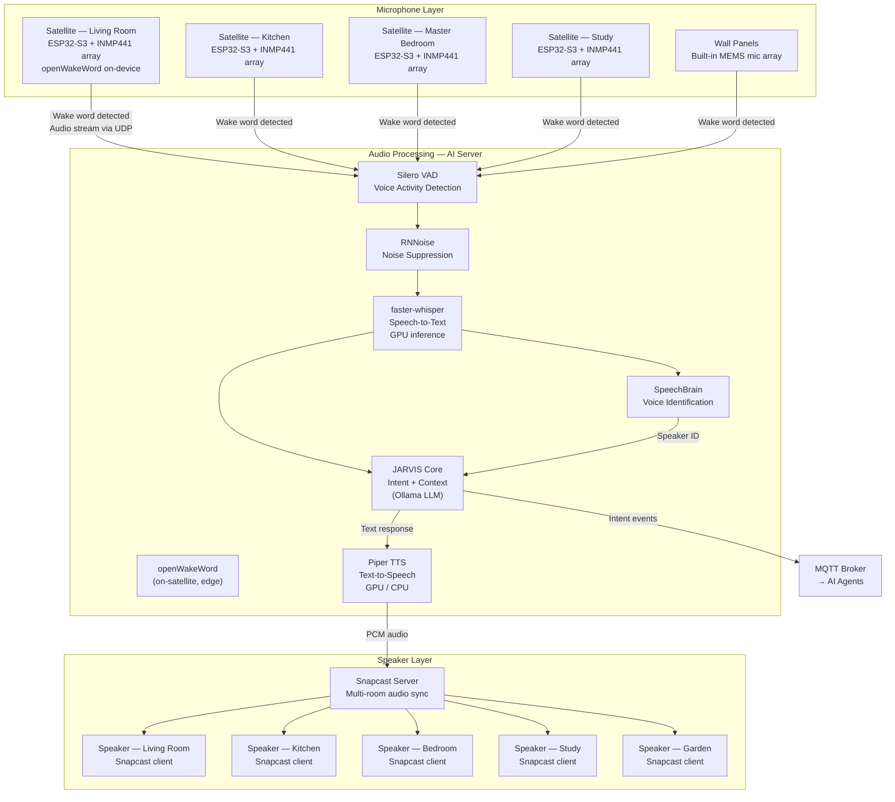
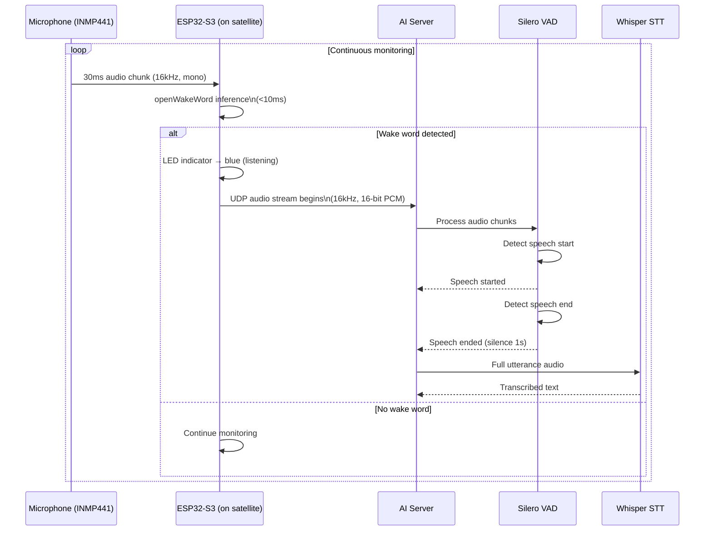
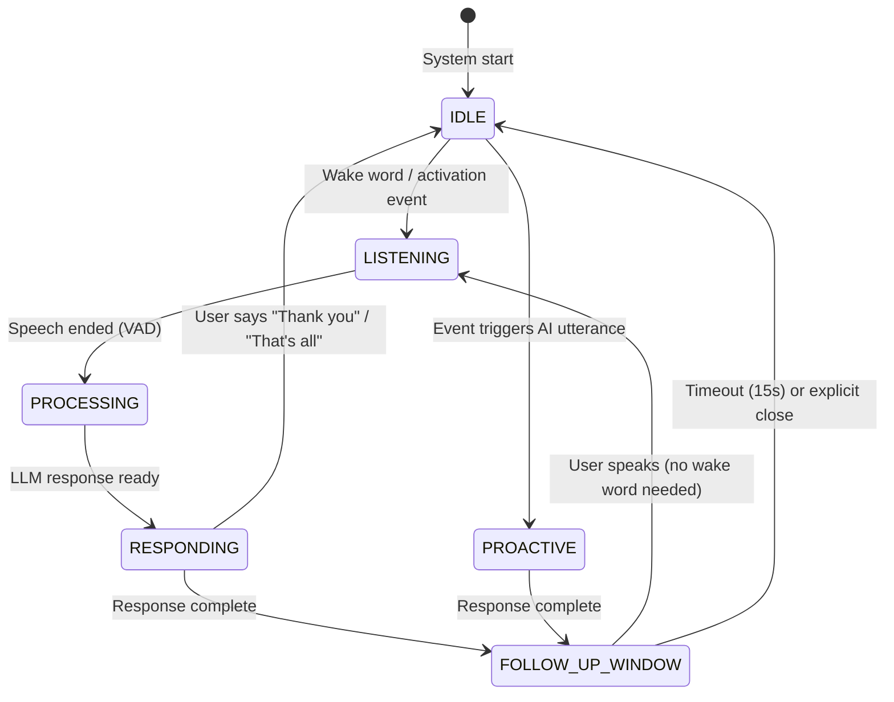

# Chapter 04 — Audio System

**AI Home OS Internal Design Specification**  
**Classification:** Internal — Engineering  
**Status:** Draft v1.0  
**Date:** 2026-07-17

---

## Table of Contents

1. [Overview](#1-overview)
2. [Design Philosophy](#2-design-philosophy)
3. [Audio System Architecture](#3-audio-system-architecture)
4. [Microphone Infrastructure](#4-microphone-infrastructure)
5. [Beamforming & Noise Suppression](#5-beamforming--noise-suppression)
6. [Wake Word Detection](#6-wake-word-detection)
7. [Speaker Zone Architecture](#7-speaker-zone-architecture)
8. [Speech-to-Text Pipeline](#8-speech-to-text-pipeline)
9. [Voice Identification](#9-voice-identification)
10. [Text-to-Speech Pipeline](#10-text-to-speech-pipeline)
11. [Conversation Continuity](#11-conversation-continuity)
12. [Natural Interruptions](#12-natural-interruptions)
13. [Context-Aware Audio Behavior](#13-context-aware-audio-behavior)
14. [Multi-Room Audio](#14-multi-room-audio)
15. [Audio Privacy Architecture](#15-audio-privacy-architecture)
16. [Failure Modes & Redundancy](#16-failure-modes--redundancy)
17. [Audio System BOM](#17-audio-system-bom)
18. [Design Decisions & Trade-offs](#18-design-decisions--trade-offs)
19. [Risks](#19-risks)
20. [Future Improvements](#20-future-improvements)
21. [References](#21-references)

---

## 1. Overview

The audio system is how AI Home OS speaks and listens. It is the primary human-computer interface for the platform — more natural, more ambient, and more capable than any screen-based interface. Unlike commercial voice assistants (Alexa, Google Assistant, Siri), the AI Home OS audio system is:

- **Always local** — voice never leaves the home network for processing
- **Conversation-capable** — multi-turn dialogue, not single command-response
- **Context-aware** — the AI knows who is speaking, where they are, what they were doing
- **Ambient** — the system listens softly everywhere and speaks appropriately to the room
- **Private** — audio is processed locally, never stored as raw audio, never transmitted

The audio pipeline transforms raw microphone signals into structured intent, and LLM responses into natural speech — entirely within the home.

### Audio System Capabilities Summary

| Capability | Implementation |
|-----------|---------------|
| Whole-home listening | Distributed microphone satellites (ESP32 + INMP441) |
| Beam-forming | Software beamforming per satellite cluster |
| Wake word detection | openWakeWord (local, low-latency) |
| Speech-to-text | Whisper (faster-whisper, local GPU) |
| Voice identification | SpeechBrain speaker embeddings |
| Text-to-speech | Piper TTS (local, GPU-accelerated) |
| Multi-room speaker | Snapcast + Squeezelite / Home Assistant Music Assistant |
| Noise suppression | RNNoise / Silero VAD |
| Conversation continuity | AI Home OS dialogue manager |

---

## 2. Design Philosophy

### 2.1 Audio Is Not a Feature — It Is the Primary Interface

In the eventual state of AI Home OS, most human-AI interaction happens through voice. The audio system therefore must be:
- **Reliable**: Wake word detection must work 95%+ of the time with <1% false activation
- **Fast**: Response latency from "JARVIS" to first spoken syllable < 1.5 seconds
- **Natural**: TTS must not sound robotic; speech must match the emotional tone of the message
- **Contextual**: "Turn it up" is valid without specifying what device, because the AI knows what is playing

### 2.2 No Audio Leaves the Home

The full pipeline — wake word detection, VAD, STT, NLU, TTS — runs locally. The only exception is when the user explicitly invokes a cloud LLM for complex reasoning, in which case only the **text transcription** leaves the home (never raw audio).

### 2.3 The AI Listens Softly

The microphone network is always receiving audio at the edge (wake word detection on the satellite). No audio is transmitted over the network until a wake word or activation condition is met. This is architecturally distinct from sending audio to a server continuously — audio processing is local on the satellite MCU.

### 2.4 Voice Is Not the Only Channel

The audio system integrates with the vision system, sensor layer, and conversation agent. The AI may speak proactively (not always in response to a question) — for example:
- "Good morning, Sadiq. Your coffee is ready."
- "The washing machine has finished."
- "There's someone at the front door."

These are AI-initiated utterances triggered by events, not by a user wake word.

---

## 3. Audio System Architecture



---

## 4. Microphone Infrastructure

### 4.1 Microphone Satellite Design

Each room is covered by one or more **microphone satellites** — small, dedicated devices that perform local wake word detection and stream audio to the AI server only when activated.

**Reference satellite hardware (DIY ESP32 design):**

```
┌─────────────────────────────────────────────────────────┐
│                 AI Home OS Mic Satellite                 │
│                                                          │
│  ┌──────────────┐    ┌──────────────────────────────┐   │
│  │ INMP441 #1   │    │         ESP32-S3             │   │
│  │ MEMS Mic     ├───►│  ┌────────────────────────┐  │   │
│  │ (front)      │    │  │ openWakeWord (TFLite)   │  │   │
│  └──────────────┘    │  │ Silero VAD              │  │   │
│  ┌──────────────┐    │  │ WiFi UDP audio stream   │  │   │
│  │ INMP441 #2   │    │  └────────────────────────┘  │   │
│  │ MEMS Mic     ├───►│                              │   │
│  │ (side)       │    │  GPIO LED ring (feedback)    │   │
│  └──────────────┘    │  USB-C power                 │   │
│  ┌──────────────┐    └──────────────────────────────┘   │
│  │ INMP441 #3   │                                        │
│  │ MEMS Mic     ├──► (optional — 3-mic beamforming)      │
│  │ (back)       │                                        │
│  └──────────────┘                                        │
│                                                          │
│  Size: ~80mm diameter disk    Power: 5V USB-C (0.5W)    │
└─────────────────────────────────────────────────────────┘
```

### 4.2 Microphone Hardware Options

#### INMP441 MEMS Microphone (I2S)

The **INMP441** is the gold standard for DIY voice satellite microphones:

| Specification | Value |
|---------------|-------|
| Interface | I2S digital |
| Frequency response | 60 Hz – 15 kHz |
| SNR | 61 dB |
| Sensitivity | -26 dBFS (at 94 dB SPL) |
| Power supply | 1.8–3.3V |
| Dimensions | 4 × 3 × 1mm |
| Cost | $1.50 per unit |

**I2S wiring to ESP32-S3:**
```
INMP441 → ESP32-S3:
  VDD → 3.3V
  GND → GND
  SD  → GPIO 2  (Data)
  WS  → GPIO 1  (Word Select / L-R Clock)
  SCK → GPIO 4  (Serial Clock)
  L/R → GND (left channel)
```

#### Alternative Microphone Modules

| Module | Type | Cost | Pros | Cons |
|--------|------|------|------|------|
| **INMP441** | I2S MEMS | $1.50 | Best SNR, digital, no noise | DIY soldering required |
| **ICS-43434** | I2S MEMS | $2 | Slightly better low-freq response | Same form factor |
| **SPH0645LM4H** | I2S MEMS | $1.50 | Very compact | Slightly lower SNR |
| **WM8960** module | I2S codec | $8 | Includes amplifier output | Overkill for mic-only |

#### Ready-Made Satellite Options (No DIY)

| Device | Mic Array | Wake Word | Protocol | Cost |
|--------|-----------|-----------|----------|------|
| **Wyoming Satellite (Pi Zero 2W)** | ReSpeaker 2-mic HAT | openWakeWord | Wyoming protocol | $35 |
| **Assist Satellite (ESPHome)** | INMP441 | microWakeWord | ESPHome native | $15 |
| **M5Stack ATOM Echo** | PDM MEMS | Custom | ESPHome | $14 |
| **ReSpeaker Mic Array v2.1** | 4-mic circular | Snowboy/custom | USB | $80 |
| **seeed ReSpeaker Lite** | 2-mic I2S | XMOS DSP | I2C/UART | $35 |

> **Recommendation for production deployment:** Use **Wyoming Satellite on Raspberry Pi Zero 2W** with a **ReSpeaker 2-mic HAT** for rooms where installation quality matters (living room, kitchen). Use **ESPHome Assist Satellite** (ESP32 + INMP441) for budget rooms where compact size matters (utility room, hallway). The Wyoming protocol integrates natively with Home Assistant's Assist pipeline, which feeds into AI Home OS.

### 4.3 Microphone Placement

```
Microphone Placement Rules:

✓ Mount at ceiling center or within 2m of ceiling (captures downward speech)
✓ Keep 1m clearance from TV, speakers (acoustic interference)
✓ Keep 0.5m clearance from HVAC vents (fan noise)
✓ Avoid mounting in cupboards or enclosed spaces (reverb)
✓ In large rooms (>30m²): install 2 satellites
✓ Place satellite within 3m of primary seating area for best pickup

Per-room satellite count (reference):
  Living room (40m²):   2 satellites
  Kitchen (20m²):       1 satellite
  Master bedroom:       1 satellite
  Bedroom 2–3:          1 each
  Study:                1 satellite
  Hallways:             1 (for passing commands)
  Garden/outdoor:       1 weather-resistant outdoor satellite
```

### 4.4 Wiring and Power

All microphone satellites are powered via **USB-C** (5V, 0.5W). They communicate over the **Voice VLAN (70)** WiFi (dedicated 5 GHz SSID `HomeVoice`).

**Alternative: PoE-powered satellites**

For ceiling-mounted satellites, a PoE splitter converts PoE power to 5V USB-C:
- **PoE to USB-C splitter (Tycon PoE-PUSB-BT)**: $15 — plug into PoE switch port, power the satellite without any power adapter in the room

---

## 5. Beamforming & Noise Suppression

### 5.1 Beamforming

Beamforming uses multiple microphones to **focus audio pickup in a specific direction**, suppressing noise from other directions. This dramatically improves speech recognition accuracy in noisy environments (TV playing, kids, cooking sounds).

**Software beamforming pipeline (on AI server):**

```python
# Beamforming with multiple mics (pseudo-code using PyAudio + custom MVDR)

from speexdsp import EchoCanceller
import numpy as np

class SatelliteBeamformer:
    def __init__(self, mic_positions: List[Tuple[float, float, float]]):
        """
        mic_positions: 3D positions of each mic in meters
        e.g., [(0, 0, 0), (0.05, 0, 0), (-0.05, 0, 0)] for 3-mic linear array
        """
        self.mic_positions = mic_positions
        self.sample_rate = 16000

    def beamform(self, multi_channel_audio: np.ndarray, direction: Tuple[float, float]) -> np.ndarray:
        """
        Apply Delay-and-Sum beamforming toward detected speaker direction.
        Returns single-channel beamformed audio.
        """
        azimuth, elevation = direction  # Speaker direction (from DoA estimator)
        delays = self.compute_delays(azimuth, elevation)

        # Apply fractional sample delays to each channel
        output = np.zeros(multi_channel_audio.shape[1])
        for i, (channel, delay) in enumerate(zip(multi_channel_audio, delays)):
            output += np.roll(channel, -int(delay * self.sample_rate))

        return output / len(self.mic_positions)
```

For a 2-microphone satellite (minimum beamforming array), software Delay-and-Sum achieves 6–10 dB noise rejection from the opposite direction.

### 5.2 Voice Activity Detection (VAD)

After wake word detection, VAD determines when speech has started and ended — preventing the STT model from processing silence or noise.

**Silero VAD (recommended):**

| Parameter | Value |
|-----------|-------|
| Model size | 1.8 MB |
| Inference time | <1ms per 30ms chunk (CPU) |
| Accuracy | 96%+ in noisy conditions |
| Language | Language-independent (voice vs. non-voice) |
| Integration | Python, ONNX runtime |

```python
# Silero VAD integration (pseudo-code)

import torch
from silero_vad import load_silero_vad, VADIterator

model, utils = torch.hub.load('snakers4/silero-vad', 'silero_vad')
vad_iterator = VADIterator(model, threshold=0.5, sampling_rate=16000)

def process_audio_chunk(chunk: np.ndarray) -> Optional[np.ndarray]:
    """Process 30ms chunk, returns chunk if speech detected, None otherwise."""
    speech_dict = vad_iterator(chunk, return_seconds=True)
    if speech_dict:
        return chunk  # Speech detected
    return None
```

### 5.3 Acoustic Echo Cancellation (AEC)

When the AI Home OS speaker is playing audio (TTS response, music) in the same room as a microphone, the microphone will pick up that audio — called acoustic echo. Without AEC, this causes the STT model to "hear" its own speech and attempt to transcribe it.

**AEC implementation:**
- **speexdsp library** (C, with Python bindings): classic, low-latency AEC
- **WebRTC AEC** (via `webrtc-audio-processing`): production-grade, used in Chrome/Teams
- **RNNoise + AEC3**: Deep learning-based noise and echo suppression

The AEC reference signal is the TTS audio being played — this is sent to the AEC processor along with the microphone signal to allow cancellation.

### 5.4 Noise Suppression

After AEC, RNNoise provides additional background noise reduction:

```python
# RNNoise integration (pseudo-code)
from rnnoise import RNNoise

denoiser = RNNoise()

def denoise(audio_chunk: np.ndarray) -> np.ndarray:
    """
    Apply RNNoise to 10ms audio chunks (480 samples at 48kHz).
    Returns denoised audio.
    """
    return denoiser.process_frame(audio_chunk)
```

**RNNoise characteristics:**
- Neural network trained on thousands of noise types
- 5ms latency (one 10ms frame lookahead)
- Works well on: HVAC, traffic, TV background, music
- Model size: 90 KB

---

## 6. Wake Word Detection

### 6.1 Architecture

Wake word detection runs **on the satellite MCU (ESP32-S3)** — not on the AI server. This means:
- No audio is transmitted over the network until the wake word is heard
- Even if the AI server is offline, the satellite is listening
- Power is only ~0.5W for continuous monitoring

### 6.2 openWakeWord

openWakeWord is an open-source wake word detection library designed for embedded and edge deployment:

| Feature | Value |
|---------|-------|
| Framework | TensorFlow Lite (runs on ESP32-S3) |
| False activation rate | < 0.5 per hour |
| True detection rate | > 95% in tested environments |
| Supported wake words | "Hey Jarvis", "OK Jarvis", "Hey Home", custom trainable |
| Model size | 100–300 KB (TFLite) |
| Inference time | < 10ms (ESP32-S3) |
| Audio processing | 16 kHz, mono |

**Custom wake word training:**

openWakeWord supports training custom wake words using only 10–30 sample recordings. Training is done on the AI server using the openWakeWord training toolkit.

```bash
# Train custom wake word "Hey Jarvis" (on AI server)
python train_wake_word.py \
    --wake-word "hey jarvis" \
    --positive-samples ./samples/hey_jarvis/ \
    --negative-samples ./samples/background/ \
    --output ./models/hey_jarvis.tflite \
    --epochs 20
```

### 6.3 Alternative Wake Word Systems

| System | Platform | False Activation | Accuracy | Cost |
|--------|----------|-----------------|----------|------|
| **openWakeWord** | Python + TFLite | Low | 95%+ | Free |
| **microWakeWord** | ESPHome | Medium | 90%+ | Free |
| **Picovoice Porcupine** | MCU + Python | Very low | 97%+ | Free tier / $5/device |
| **Snowboy** | Linux (deprecated) | Medium | 90% | Abandoned |
| **Custom LSTM** | ESP32-S3 | Tunable | Tunable | Free |

> **Recommendation:** **openWakeWord** for standard deployments. **Picovoice Porcupine** when absolute lowest false activation rate is required (e.g., library, meditation room) — it has the lowest false activation rate of any tested system at slightly higher complexity.

### 6.4 Wake Word Activation Flow



### 6.5 Contextual Activation (No Wake Word Required)

In some contexts, the wake word should not be required:
- **Doorbell pressed** → AI is listening immediately at the intercom
- **User is on a wall panel touchscreen** → Tap microphone icon → listening without wake word
- **Morning greeting mode** → AI speaks first; user can respond without wake word for 30 seconds
- **In-call mode** → Continuous two-way audio without wake word

These are handled by the Conversation Agent sending an "open mic" command to the satellite.

---

## 7. Speaker Zone Architecture

### 7.1 Zone Design

The home is divided into audio zones — groups of speakers that can play independently or in synchronization.

```
Audio Zone Map (reference 4-bedroom home):

Zone 1: Living Room    → Floor speaker (left) + (right) + ceiling fill
Zone 2: Kitchen        → Under-cabinet speaker or small bookshelf
Zone 3: Master Bedroom → Bedside speaker pair
Zone 4: Bedroom 2      → Single bookshelf speaker
Zone 5: Bedroom 3      → Single bookshelf speaker
Zone 6: Study          → Desktop speaker pair
Zone 7: Garden         → Outdoor weather-resistant speaker pair
Zone 8: Bathroom       → Moisture-resistant ceiling speaker
Zone 9: Hallways       → Small ceiling speaker (alert/announcement only)
```

### 7.2 Speaker Hardware

**Powered speakers (self-amplified):**

| Speaker | Type | Wattage | Cost | Notes |
|---------|------|---------|------|-------|
| **Sonos Era 100** | WiFi + Ethernet | 35W | $250 | Native Snapcast / Sonos API |
| **HomePod mini** | WiFi (AirPlay2) | 20W | $99 | Best TTS quality; Apple ecosystem |
| **KEF LSX II** | WiFi + Ethernet | 70W | $1,100 | Reference quality, living room |
| **IKEA SYMFONISK** | WiFi (SONOS-based) | 15W | $100 | Budget, good quality |
| **Volumio Primo** | WiFi/Ethernet | Passive + amp | $400 | High-fi focused |

**Passive speakers + amplifier (best quality/cost):**

| Component | Example | Cost |
|-----------|---------|------|
| Passive bookshelf speaker | KEF Q150 / Wharfedale Diamond 12.1 | $150–300/pair |
| Class D amplifier | Fosi Audio V3 / Topping PA5 | $80–150 |
| Raspberry Pi Snapcast client | Raspberry Pi 4 + HiFiBerry DAC+ | $60 + $30 |

**Ceiling speakers (in-wall/in-ceiling installation):**

| Speaker | Impedance | Power | Cost | Notes |
|---------|-----------|-------|------|-------|
| Klipsch R-1650-C | 8Ω | 50W | $75/pair | Good quality ceiling |
| Polk Audio RC60i | 8Ω | 100W | $120/pair | Premium ceiling |
| Monoprice 6.5" ceiling | 8Ω | 50W | $30/pair | Budget, acceptable |

### 7.3 Snapcast — Multi-Room Audio Synchronization

**Snapcast** is the recommended multi-room audio server for AI Home OS. It synchronizes audio playback across all rooms with sub-millisecond precision — no echo or delay heard when walking between rooms.

**Architecture:**

```
┌─────────────────────────────────────────────────────────┐
│                    Snapcast Server                       │
│                  (running on AI server)                  │
│                                                          │
│  Input streams:                                          │
│    /tmp/snapcast_pipe_tts   ← Piper TTS output          │
│    /tmp/snapcast_pipe_music ← Mopidy / Music Assistant   │
│    /tmp/snapcast_pipe_alert ← System alerts              │
│                                                          │
│  Client management:         Priority mixing:             │
│    Zone routing             TTS > alerts > music         │
│    Volume per zone          Ducking (music → -12dB)     │
│    Latency compensation     when TTS plays               │
└──────────────────────┬──────────────────────────────────┘
                       │ TCP
        ┌──────────────┼─────────────────┐
        ▼              ▼                 ▼
 [Snapcast client] [Snapcast client] [Snapcast client]
  Living Room        Kitchen           Bedroom
  Raspberry Pi 4     Raspberry Pi Zero  HomePod mini
  + HiFiBerry DAC   + USB DAC          (AirPlay bridge)
```

**Snapcast configuration reference:**

```json
// /etc/snapserver.conf
{
  "server": {
    "http_port": 1780,
    "jsonrpc_port": 1705
  },
  "streams": [
    {
      "uri": "pipe:///tmp/snapfifo_tts?name=tts&mode=read",
      "name": "TTS",
      "priority": 100
    },
    {
      "uri": "pipe:///tmp/snapfifo_music?name=music&mode=read",
      "name": "Music",
      "priority": 50
    }
  ]
}
```

### 7.4 Audio Priority and Ducking

When the AI needs to speak (TTS), music or other audio is automatically **ducked** (reduced in volume) and restored after:

```python
# Audio ducking manager (pseudo-code)

class AudioDuckingManager:
    TTS_DUCK_LEVEL = -15  # dB reduction during TTS
    FADE_TIME_MS = 300    # Smooth fade in/out

    async def play_tts(self, audio_data: bytes, zones: List[str]):
        # 1. Gradually reduce music volume in target zones
        for zone in zones:
            await snapcast.set_volume(zone, self.TTS_DUCK_LEVEL, fade_ms=self.FADE_TIME_MS)

        # 2. Play TTS through high-priority stream
        await tts_stream.write(audio_data)

        # 3. Wait for TTS to finish
        await asyncio.sleep(len(audio_data) / (16000 * 2))  # PCM duration

        # 4. Restore music volume
        await asyncio.sleep(0.5)  # Brief pause after TTS
        for zone in zones:
            await snapcast.restore_volume(zone, fade_ms=self.FADE_TIME_MS)
```

---

## 8. Speech-to-Text Pipeline

### 8.1 Whisper

OpenAI's Whisper is the state-of-the-art open-source STT model. AI Home OS runs **faster-whisper** — a highly optimized CTranslate2 port of Whisper that delivers 2–4× faster inference than the original.

### 8.2 Model Selection

| Model | Parameters | VRAM | WER (EN) | RTF (GPU) | RTF (CPU) | Notes |
|-------|-----------|------|----------|-----------|-----------|-------|
| `tiny` | 39M | 1 GB | 14.4% | 0.05 | 0.25 | Very fast, low accuracy |
| `base` | 74M | 1 GB | 11.0% | 0.07 | 0.50 | Fast, acceptable accuracy |
| `small` | 244M | 1 GB | 8.8% | 0.13 | 1.0 | Good balance |
| `medium` | 769M | 2 GB | 6.7% | 0.25 | 3.0 | High accuracy |
| **`large-v3`** | 1550M | 4 GB | **4.3%** | 0.50 | 8.0 | Best accuracy |
| `large-v3-turbo` | 809M | 3 GB | 4.8% | 0.30 | 5.0 | Best accuracy/speed |

*WER = Word Error Rate (lower is better). RTF = Real-Time Factor (1.0 = processes audio at 1× speed).*

> **Recommendation:** Use `large-v3-turbo` with GPU acceleration (RTX 4070). This provides near-large-v3 accuracy at 0.3× RTF — meaning a 5-second utterance is transcribed in 1.5 seconds. For GPU-constrained setups, use `small` which achieves sub-second transcription.

### 8.3 faster-whisper Configuration

```python
# faster-whisper STT service (pseudo-code)

from faster_whisper import WhisperModel

class STTService:
    def __init__(self):
        self.model = WhisperModel(
            "large-v3-turbo",
            device="cuda",
            compute_type="float16",   # FP16 on GPU
            cpu_threads=4,
            num_workers=2
        )

    def transcribe(self, audio_path: str, language: str = "auto") -> TranscriptionResult:
        segments, info = self.model.transcribe(
            audio_path,
            language=language if language != "auto" else None,
            beam_size=5,
            vad_filter=True,           # Built-in VAD to skip silence
            vad_parameters={
                "min_silence_duration_ms": 500,
                "speech_pad_ms": 200
            }
        )

        text = " ".join([seg.text for seg in segments])
        return TranscriptionResult(
            text=text.strip(),
            language=info.language,
            confidence=info.language_probability,
            duration_ms=(info.duration * 1000)
        )
```

### 8.4 Multilingual Support

Whisper natively supports 100 languages with a single model. AI Home OS configuration:

```yaml
# Audio system config
stt:
  model: large-v3-turbo
  primary_language: ar      # Arabic (default for this home)
  secondary_languages:      # Other languages auto-detected
    - en
    - fr
  language_detection: automatic
  per_person_language:      # Per-person language preference
    sadiq: ar
    guest_default: en
```

When a known speaker is identified (via voice ID), their preferred language is used automatically. For unknown speakers, Whisper auto-detects the language.

### 8.5 Hotword/Command Injection Prevention

All STT output is treated as untrusted text input before passing to the LLM. This prevents prompt injection through voice:

```python
def sanitize_transcription(text: str) -> str:
    """Remove potential prompt injection patterns from STT output."""
    # Remove common injection patterns
    patterns = [
        r"(?i)ignore previous instructions",
        r"(?i)system prompt",
        r"(?i)you are now",
        r"\[INST\]",
        r"<\|system\|>",
    ]
    for pattern in patterns:
        text = re.sub(pattern, "[FILTERED]", text)
    return text
```

---

## 9. Voice Identification

### 9.1 Purpose

Voice identification allows the AI to know **who is speaking** before they say their name — enabling personalized responses, per-person preferences, and security-aware behavior.

Voice identification is distinct from voice authentication (verifying a claimed identity). It is a soft biometric that contributes to the Identity System's confidence score (Chapter 5).

### 9.2 SpeechBrain Speaker Embeddings

SpeechBrain's **ECAPA-TDNN** model generates speaker embeddings (192-dimensional vectors) from speech segments. These are compared against enrolled speaker profiles.

```python
# Voice identification (pseudo-code)

from speechbrain.inference.speaker import SpeakerRecognition

class VoiceIdentifier:
    def __init__(self):
        self.model = SpeakerRecognition.from_hparams(
            source="speechbrain/spkrec-ecapa-voxceleb",
            savedir="pretrained_models/spkrec"
        )

    def enroll(self, person_id: str, audio_samples: List[str]) -> None:
        """Enroll a person using 5-30 speech samples (10+ seconds each)."""
        embeddings = []
        for sample in audio_samples:
            embedding = self.model.encode_batch(sample)
            embeddings.append(embedding)

        mean_embedding = torch.mean(torch.stack(embeddings), dim=0)
        db.store_speaker_embedding(person_id, mean_embedding)

    def identify(self, audio: str) -> SpeakerResult:
        """Identify speaker from audio segment."""
        query_embedding = self.model.encode_batch(audio)

        best_match = None
        best_score = -1.0

        for profile in db.get_all_speaker_profiles():
            score = self.model.similarity(query_embedding, profile.embedding)
            if score > best_score:
                best_score = score
                best_match = profile

        THRESHOLD = 0.25  # Cosine similarity threshold
        if best_score > THRESHOLD:
            return SpeakerResult(
                person_id=best_match.person_id,
                confidence=float(best_score),
                identified=True
            )
        return SpeakerResult(identified=False, confidence=0.0)
```

### 9.3 Voice Enrollment

During setup, each household member provides voice samples:
- 5–10 natural speech samples (reading sentences, answering questions)
- Minimum 30 seconds of total speech per person
- Varied: normal volume, slightly louder, slightly softer, different distances from mic

The AI proactively improves speaker models over time by re-training on confirmed utterances (when face recognition and voice ID agree on identity).

### 9.4 Voice ID in Security Context

Voice identification contributes to security decisions:
- **Low confidence (< 0.25)**: Unknown speaker — treat as visitor/guest
- **Medium confidence (0.25–0.45)**: Probable [name] — allow standard commands, not sensitive
- **High confidence (> 0.45)**: Confirmed [name] — allow sensitive commands (unlock doors, access financial info)

Voice ID **alone** is never used for security-critical actions. It must be combined with other identity signals (Chapter 5).

---

## 10. Text-to-Speech Pipeline

### 10.1 Piper TTS

**Piper** is a fast, local, neural text-to-speech system developed by the Home Assistant / Rhasspy team. It produces natural-sounding speech locally with zero cloud dependency.

| Feature | Value |
|---------|-------|
| Architecture | VITS (Variational Inference for Text-to-Speech) |
| Latency | < 200ms first audio (streaming) |
| Quality | Excellent — indistinguishable from cloud TTS in many voices |
| Languages | 30+ languages, 80+ voices |
| Model size | 40–130 MB per voice |
| GPU acceleration | CUDA support (via ONNX runtime) |

### 10.2 Voice Selection

| Voice | Language | Quality | Character | Best For |
|-------|----------|---------|-----------|---------|
| `en_GB-alan-medium` | English GB | ★★★★ | Male, clear, authoritative | JARVIS-like character |
| `en_US-libritts-high` | English US | ★★★★★ | Neutral, natural | General use |
| `en_GB-jenny-diphone` | English GB | ★★★ | Female, warm | Friendly greetings |
| `ar-joanna-medium` | Arabic | ★★★★ | Female, clear | Arabic-primary homes |
| `de_DE-thorsten-high` | German | ★★★★ | Male, professional | German homes |

> **Recommendation for this project:** Use `en_GB-alan-medium` for the JARVIS character voice — it has a British male quality that fits the JARVIS aesthetic. Pair with `ar-joanna-medium` for Arabic responses.

### 10.3 Piper TTS Server

Piper runs as a Docker service exposing a simple HTTP API:

```bash
# Piper Docker deployment
docker run -d \
  --name piper-tts \
  --gpus all \
  -v ./piper-voices:/data \
  -p 10200:10200 \
  rhasspy/piper:latest \
  --voice en_GB-alan-medium \
  --output-raw \
  --streaming
```

```python
# TTS client (pseudo-code)

class TTSService:
    PIPER_URL = "http://localhost:10200"

    async def synthesize(
        self,
        text: str,
        voice: str = "en_GB-alan-medium",
        rate: float = 1.0,      # Speaking rate (0.5–2.0)
        pitch: float = 0.0,     # Pitch adjustment in semitones
    ) -> AsyncIterator[bytes]:
        """
        Stream TTS audio chunks for real-time playback.
        Yields PCM audio chunks as they are generated.
        """
        payload = {
            "text": text,
            "voice": voice,
            "speakingRate": rate,
            "pitch": pitch,
            "outputFormat": "pcm_16000"
        }
        async with aiohttp.ClientSession() as session:
            async with session.post(f"{self.PIPER_URL}/api/tts", json=payload) as resp:
                async for chunk in resp.content.iter_chunked(4096):
                    yield chunk
```

### 10.4 Emotion-Aware TTS

The Conversation Agent adjusts TTS parameters based on the emotional tone of the message:

| Message Type | Rate | Pitch | Voice Volume | Example |
|-------------|------|-------|-------------|---------|
| Normal greeting | 1.0 | 0 | 100% | "Good morning, Sadiq." |
| Urgent alert | 1.15 | +1 | 110% | "Water leak detected in kitchen!" |
| Gentle reminder | 0.9 | -0.5 | 85% | "Your meeting starts in 10 minutes." |
| Emergency | 1.2 | +2 | 120% | "Fire alarm activated — please evacuate." |
| Bedtime | 0.85 | -1 | 70% | "Goodnight. I've locked all doors." |
| Good news | 1.05 | +0.5 | 100% | "Your package has arrived!" |

```python
# Emotion-aware synthesis (pseudo-code)

def determine_tts_params(message_type: str) -> TTSParams:
    profiles = {
        "normal":    TTSParams(rate=1.0,  pitch=0.0,  volume=1.0),
        "urgent":    TTSParams(rate=1.15, pitch=1.0,  volume=1.1),
        "gentle":    TTSParams(rate=0.9,  pitch=-0.5, volume=0.85),
        "emergency": TTSParams(rate=1.2,  pitch=2.0,  volume=1.2),
        "bedtime":   TTSParams(rate=0.85, pitch=-1.0, volume=0.7),
    }
    return profiles.get(message_type, profiles["normal"])
```

### 10.5 Cloud TTS Fallback

For languages or voices not supported by Piper, AI Home OS falls back to cloud TTS:

| Service | Languages | Quality | Cost |
|---------|----------|---------|------|
| **ElevenLabs** | 30+ | ★★★★★ (human-like) | $5/month (starter) |
| **Azure Neural TTS** | 100+ languages, 400+ voices | ★★★★★ | $4/1M chars |
| **Google Cloud TTS** | 40 languages, 220+ voices | ★★★★ | $4/1M chars |
| **Amazon Polly** | 30 languages | ★★★★ | $4/1M chars |

> Cloud TTS sends only the **text string** (not audio) to the cloud. This is acceptable from a privacy standpoint — only the text of AI responses leaves the home, not any recorded speech.

---

## 11. Conversation Continuity

### 11.1 The Problem with Single-Turn Interactions

Commercial voice assistants treat every interaction as independent. This forces unnatural, explicit commands:
- "Alexa, turn off the living room lights"
- "Alexa, also turn off the kitchen lights"
- "Alexa, what's the temperature in the living room?"

AI Home OS maintains **conversation context** across multiple turns:
- "JARVIS, turn off the lights" → [AI: "Which room?"] → "The living room"
- "Now the kitchen too"
- "What's the temperature in there?"

### 11.2 Dialogue State Machine



### 11.3 Context Window Management

The conversation agent maintains a sliding context window of recent exchanges:

```python
# Conversation context manager (pseudo-code)

class ConversationSession:
    MAX_TURNS = 10          # Maximum number of turns to keep in context
    CONTEXT_TIMEOUT = 120   # Seconds of silence before context is cleared

    def __init__(self, person_id: str, room: str):
        self.person_id = person_id
        self.room = room
        self.turns: List[DialogueTurn] = []
        self.last_activity = time.time()
        self.current_entities = {}   # Entities mentioned in this session
        # e.g., {"room": "living room", "device": "lights"}

    def add_turn(self, role: str, content: str):
        self.turns.append(DialogueTurn(role=role, content=content))
        self.last_activity = time.time()

        # Trim old turns
        if len(self.turns) > self.MAX_TURNS:
            self.turns = self.turns[-self.MAX_TURNS:]

    def build_prompt(self, user_input: str) -> str:
        """Build LLM prompt with conversation history."""
        context = self._get_home_context()   # Sensor state, time, weather
        history = self._format_history()

        return f"""
You are JARVIS, the AI assistant for this home.
Current home context: {context}

Conversation history:
{history}

User ({self.person_id}, in {self.room}): {user_input}
JARVIS:"""

    def is_expired(self) -> bool:
        return (time.time() - self.last_activity) > self.CONTEXT_TIMEOUT
```

### 11.4 Pronoun and Reference Resolution

The conversation agent resolves implicit references from context:

| User says | Resolution | Context used |
|-----------|-----------|-------------|
| "Turn it down" | "it" = currently playing music | Audio session active |
| "Make it warmer" | "it" = room temperature | Person in living room, HVAC active |
| "Is she home yet?" | "she" = Sadiq's wife Fatima | Household members known |
| "Lock it" | "it" = front door | Last mentioned device was front door |
| "Check on him" | "him" = grandfather | Elderly family member in guest room |

---

## 12. Natural Interruptions

### 12.1 Barge-In Capability

When the AI is speaking (TTS playback), the user should be able to interrupt mid-sentence:

```
AI: "Good morning, Sadiq. The weather today is—"
User: [interrupts] "What time is my first meeting?"
AI: [stops immediately] "Your 9 AM standup starts in 47 minutes."
```

**Implementation:**

```python
# Barge-in handler (pseudo-code)

class BargeInController:
    def __init__(self, tts_stream, microphone):
        self.tts_stream = tts_stream
        self.microphone = microphone

    async def play_with_barge_in(self, audio: bytes, zone: str):
        """Play TTS audio while monitoring for user speech."""
        play_task = asyncio.create_task(self.tts_stream.play(audio, zone))
        listen_task = asyncio.create_task(self.microphone.listen_for_speech())

        done, pending = await asyncio.wait(
            {play_task, listen_task},
            return_when=asyncio.FIRST_COMPLETED
        )

        if listen_task in done and play_task not in done:
            # User spoke — barge-in detected
            play_task.cancel()
            await self.tts_stream.stop(zone)
            audio_chunk = listen_task.result()
            return BargeInResult(interrupted=True, audio=audio_chunk)

        for task in pending:
            task.cancel()
        return BargeInResult(interrupted=False)
```

The satellite microphone's AEC (Acoustic Echo Cancellation) is critical here — without AEC, the satellite would pick up its own TTS output and report false "barge-in" events.

### 12.2 Pause and Resume

For long AI responses (e.g., reading a recipe, morning briefing), the user can pause and resume:

```
User: "JARVIS, read me the recipe"
AI: "To make biryani, start by..."  [1 minute of recipe steps]
User: "JARVIS, pause"
AI: [pauses immediately]
... 5 minutes later ...
User: "JARVIS, continue"
AI: "...then add the saffron and let it simmer for 20 minutes."
```

---

## 13. Context-Aware Audio Behavior

### 13.1 Automatic Volume Adjustment

The audio system adapts volume to context automatically:

| Context | Volume Behavior |
|---------|---------------|
| Night (22:00–07:00) | Maximum 30% volume; TTS whispers |
| Someone sleeping in bedroom (Emfit QS detects) | That zone muted; adjacent zones reduced 40% |
| Music playing | TTS ducks music by 15 dB during speech |
| Loud background noise detected (noise sensor) | Increase TTS volume by 10–20% |
| Baby sleeping (nursery mmWave shows occupancy + sleep) | All zones near nursery silenced |
| TV audio active | TTS announced after brief pause in TV audio (if HDMI-CEC available) |

### 13.2 Room-Aware Response

The AI delivers responses through the speaker zone closest to the person who spoke:

```python
# Room-aware audio routing (pseudo-code)

def route_tts_response(person_id: str, response_text: str):
    # Where is the person right now?
    person_location = identity_system.get_location(person_id)
    zone = room_to_zone_map[person_location]

    # Should we broadcast to all zones?
    if response_text.is_announcement():
        target_zones = ["all"]
    else:
        target_zones = [zone]  # Just their room

    # Adjust volume based on time and context
    volume = context_engine.get_appropriate_volume(zone)

    tts_service.play(
        text=response_text,
        zones=target_zones,
        volume=volume,
        voice=get_person_preferred_voice(person_id)
    )
```

### 13.3 Proactive Audio Announcements

AI Home OS speaks proactively for important events — no wake word required:

| Trigger Event | Example Announcement | Zone |
|---------------|---------------------|------|
| Person arrives home | "Welcome home, Sadiq. It's 18:32. Ahmed is already here." | Entry hall |
| Washing machine done | "The washing machine has finished." | Nearest to person |
| Package delivered | "A package has arrived at the front door." | Person's current zone |
| Solar battery low | "Battery is at 15%. I'm reducing non-essential loads." | All zones |
| Doorbell pressed | "Someone is at the front door." | All zones + show camera |
| Meeting in 30 min | "Your board meeting starts in 30 minutes." | Person's current zone |
| Security alert | "Motion detected in the backyard." | All zones |
| Morning briefing | [Full morning report — see Ch. 15] | Bedroom |

### 13.4 Do Not Disturb Mode

Users can set DND mode for any zone or time period:

```
"JARVIS, do not disturb"
  → All announcements suppressed for 60 minutes (default)
  → Emergency alerts still pass through (fire, CO, security)
  → Timer shows on wall panel

"JARVIS, do not disturb until 9 AM"
  → Suppressed until specified time

"JARVIS, do not disturb — bedroom only"
  → Bedroom zone only; other zones unaffected
```

---

## 14. Multi-Room Audio

### 14.1 Music Streaming Integration

Beyond TTS, the audio system handles whole-home music streaming:

| Service | Protocol | Integration |
|---------|----------|-------------|
| Spotify | Spotify Connect | Home Assistant Music Assistant → Snapcast |
| Apple Music | AirPlay 2 | HomePod mini or AirPlay-capable Snapcast client |
| Tidal | DLNA / REST | Music Assistant plugin |
| Local library | DLNA / Squeezelite | Mopidy + Snapcast |
| Radio | Icecast/HTTP streams | Mopidy-Stream |
| Podcast | Mopidy-Podcast | Mopidy + Snapcast |

### 14.2 Music Assistant Integration

**Home Assistant Music Assistant** handles music discovery and playback control, feeding into Snapcast for synchronized multi-room output:

```
User: "JARVIS, play jazz in the living room and kitchen"
    ↓
Conversation Agent → Music Assistant API:
  play(genre="jazz", zones=["living_room", "kitchen"])
    ↓
Music Assistant → Spotify/Tidal API → PCM stream
    ↓
Snapcast → Living room + kitchen speakers (synchronized)
```

### 14.3 Party Mode

```
"JARVIS, party mode"
  → All zones synchronized
  → Volume: 65%
  → Disable voice alerts (except emergency)
  → Disable DND override
  → Play: [person's party playlist]
```

---

## 15. Audio Privacy Architecture

### 15.1 What Is Never Stored

| Data | Policy |
|------|--------|
| Raw microphone audio | **Never stored** — processed in RAM only; discarded after STT |
| Wake word audio (short buffer before wake word) | **Discarded immediately** after wake word confirmed |
| STT transcriptions | Stored in conversation log (encrypted, user can delete) |
| Voice embeddings | Stored encrypted in PostgreSQL (user can delete/re-enroll) |
| TTS audio | Ephemeral — generated on demand, not stored |

### 15.2 Hardware Mute Switch

Each microphone satellite includes a **hardware mute** — a physical switch that disconnects power to the microphone array at the hardware level, not software:

- Physical mute cannot be overridden by software
- LED indicator shows red when muted (visual confirmation)
- Wall panel shows mute status for all satellites
- "JARVIS, mute all microphones" triggers hardware GPIO on all satellites via MQTT

### 15.3 Audio Privacy Indicator

Every satellite has a **multicolor LED ring** (WS2812B NeoPixel):

| LED State | Meaning |
|-----------|---------|
| Off | Idle — monitoring for wake word only |
| Blue pulse | Listening (wake word detected, awaiting speech) |
| Green brief flash | Response ready |
| White dim | Playing TTS response |
| Red solid | Hardware muted |
| Yellow | Processing (STT/LLM in progress) |
| Red blink | Error / satellite offline |

### 15.4 Conversation Log Access Control

All conversation transcriptions are stored encrypted. Access control:
- **Primary occupant**: Full read/delete access to all logs
- **Other occupants**: Read access to their own conversations only
- **Guests**: No log storage (explicitly disabled for guest sessions)
- **Remote access**: Requires VPN + re-authentication for log access
- **Law enforcement**: Requires warrant; all data encrypted at rest

---

## 16. Failure Modes & Redundancy

| Failure | Impact | Detection | Recovery |
|---------|--------|-----------|---------|
| Satellite WiFi dropout | That room loses voice input | MQTT Last Will + satellite heartbeat | Auto-reconnect within 30s; other rooms unaffected |
| AI server STT crash | No speech recognition | Docker health check | Auto-restart; wall panel falls back to touch input |
| Piper TTS crash | No voice output | Docker health check | Auto-restart; notifications delivered as push instead |
| Snapcast server crash | No multi-room audio | Docker health check | Auto-restart; individual speakers fall back to direct WiFi |
| Wake word false activation | Unintended listening | VAD clears within 3s if no speech follows | Tune sensitivity; log false activations for model improvement |
| AEC failure (echo) | STT hears itself | Detected by VAD detecting speech when no one is home | Recalibrate AEC reference signal |
| GPU unavailable for Whisper | STT unavailable | CUDA error in logs | Fall back to `small` model on CPU (4× slower) |
| NLP context loss (server restart) | Conversation history lost | After restart | Graceful session end; user must re-initiate |

### 16.1 Offline Fallback

If the AI server is completely offline:
- Satellites continue monitoring for wake word
- On wake word: satellite plays local audio file: "JARVIS is temporarily offline. Basic home controls are available on the wall panels."
- Home Assistant continues operating independently for device control

---

## 17. Audio System BOM

### 17.1 Reference 4-Bedroom Home — Audio BOM

**Microphone Satellites:**

| Item | Model | Qty | Unit $ | Total $ |
|------|-------|-----|--------|---------|
| Mic satellite (living room) | Wyoming Satellite — Pi Zero 2W + ReSpeaker 2-mic | 2 | $50 | $100 |
| Mic satellite (kitchen) | Wyoming Satellite — Pi Zero 2W + ReSpeaker 2-mic | 1 | $50 | $50 |
| Mic satellite (bedrooms) | ESPHome Assist Satellite — ESP32-S3 + INMP441×2 | 4 | $20 | $80 |
| Mic satellite (study) | Wyoming Satellite — Pi Zero 2W | 1 | $50 | $50 |
| Outdoor mic satellite | M5Stack ATOM Echo (weather-resistant enclosure) | 1 | $20 | $20 |
| **Mic subtotal** | | **9** | | **$300** |

**Speakers:**

| Item | Model | Qty | Unit $ | Total $ |
|------|-------|-----|--------|---------|
| Living room (primary) | Sonos Era 100 (pair) | 1 | $500 | $500 |
| Kitchen | IKEA SYMFONISK | 1 | $100 | $100 |
| Master bedroom | HomePod mini | 1 | $99 | $99 |
| Bedroom 2–3 | Raspberry Pi Zero 2W + USB DAC + passive speaker | 2 | $60 | $120 |
| Study | IKEA SYMFONISK | 1 | $100 | $100 |
| Outdoor | Polk Audio Atrium 4 (outdoor, passive) + amp | 1 | $120 | $120 |
| Hallway / alert speaker | Small ceiling speaker (passive) + mini amp | 2 | $30 | $60 |
| **Speaker subtotal** | | | | **$1,099** |

**Audio Server Software (all free/open source):**

| Software | Cost |
|----------|------|
| Snapcast | Free |
| Piper TTS | Free |
| faster-whisper | Free |
| openWakeWord | Free |
| SpeechBrain | Free |
| Home Assistant Music Assistant | Free |
| Mopidy | Free |

**Audio System Total: ~$1,399**

---

## 18. Design Decisions & Trade-offs

### 18.1 Distributed Satellites vs. Centralized Mic Array

| Approach | Pros | Cons |
|----------|------|------|
| **Distributed satellites (this design)** | Coverage everywhere, no dead zones, each room independent | More hardware, WiFi dependency per satellite |
| **Single centralized mic array** | One device, simple | Only covers one room or open plan; useless in bedrooms |
| **Hybrid: central array + remote satellites** | Best coverage | Complex synchronization |

**Decision:** Distributed satellites. Each room is independent — if one satellite fails, other rooms continue working. This also means no audio is streamed from room to room (only wake-word detected segments).

### 18.2 Whisper vs. Vosk vs. DeepSpeech vs. Commercial STT

| System | WER (EN) | Latency | Privacy | Languages |
|--------|---------|---------|---------|-----------|
| **faster-whisper (large-v3)** | 4.3% | ~1.5s | ★★★★★ | 100 |
| Vosk | ~8–10% | ~0.5s | ★★★★★ | 20 |
| DeepSpeech | ~10%+ | ~1s | ★★★★★ | English primary |
| Google Cloud STT | ~5% | ~0.8s | ★★ | 125 |
| Azure Speech | ~4.5% | ~0.8s | ★★ | 100+ |

**Decision:** faster-whisper large-v3-turbo. Best accuracy while remaining fully local. The 1.5s latency is acceptable and will improve with hardware advances.

### 18.3 Piper vs. Coqui TTS vs. ElevenLabs (Local) vs. Commercial

| System | Quality | Latency | Privacy | Languages |
|--------|---------|---------|---------|-----------|
| **Piper** | ★★★★ | <200ms | ★★★★★ | 30+ |
| Coqui TTS | ★★★ | ~400ms | ★★★★★ | 20+ |
| XTTS (Coqui) | ★★★★★ | ~1s | ★★★★★ | 17 |
| ElevenLabs (cloud) | ★★★★★ | ~0.5s | ★★★ | 30+ |
| Azure Neural | ★★★★★ | ~0.5s | ★★ | 100+ |

**Decision:** Piper as primary (best latency, good quality). XTTS as optional upgrade for highest-quality voice output (at cost of higher latency). Cloud TTS for unsupported languages only.

---

## 19. Risks

| Risk | Probability | Impact | Mitigation |
|------|-------------|--------|------------|
| Wake word false activation rate too high | Medium | Medium — erodes trust, causes unintended actions | Tune sensitivity; require both wake word + VAD before streaming audio |
| STT misinterprets command (e.g., "lights off" → "lights on") | Low-medium | Medium | Confirmation for irreversible actions; low-confidence triggers clarification |
| Voice cloning attack (deepfake voice to issue commands) | Low (2026) | High | Voice ID for non-critical commands; require physical presence (wall panel) for security-critical actions |
| Conversation logs accessed by unauthorized party | Low | High | Encryption at rest; access control; regular deletion |
| Satellite offline in bedroom during emergency | Low | High | Wall panel backup input; push notification fallback |
| Audio fingerprinting by adversary (listening to satellite WiFi traffic patterns) | Very low | Medium | DTLS encryption on audio UDP stream; VLAN isolation |
| Children unintentionally triggering commands | Medium | Low | Child profile — restricted command set; require wake word + PIN for sensitive actions in children's profile |

---

## 20. Future Improvements

| Improvement | Version | Description |
|-------------|---------|-------------|
| On-device STT (ESP32-S3) | v2 | Embedded Whisper-tiny for offline STT on satellite (no network needed) |
| Emotion recognition from voice | v2 | Detect frustration, urgency, sadness from voice features to adapt AI tone |
| Custom TTS voice cloning | v2 | Allow users to clone their own voice for TTS (read to children in parent's voice) |
| Sound event detection | v2 | Detect non-speech sounds: glass breaking, dog barking, baby crying, alarm — without always-on STT |
| Acoustic scene classification | v2 | Classify the acoustic environment (party, quiet evening, cooking) to adapt AI behavior |
| Real-time translation | v3 | Translate speech in real-time for guests speaking other languages |
| XTTS voice cloning | v2 | Use XTTS for higher-quality personalized voice synthesis |
| Whisper large-v4 | v2 | Upgrade model when available |
| Neural AEC | v2 | Replace speexdsp with deep learning AEC for better echo cancellation in complex acoustic environments |

---

## 21. References

1. **Whisper (OpenAI)** — Radford et al., 2022 — https://github.com/openai/whisper
2. **faster-whisper** — https://github.com/SYSTRAN/faster-whisper
3. **Piper TTS** — https://github.com/rhasspy/piper
4. **openWakeWord** — https://github.com/dscripka/openWakeWord
5. **SpeechBrain** — Ravanelli et al., 2021 — https://speechbrain.github.io/
6. **ECAPA-TDNN Speaker Embeddings** — Desplanques et al., 2020 — https://arxiv.org/abs/2005.07143
7. **Silero VAD** — https://github.com/snakers4/silero-vad
8. **RNNoise** — Valin, 2018 — https://jmvalin.ca/demo/rnnoise/
9. **Snapcast** — https://github.com/badaix/snapcast
10. **Wyoming Protocol (Home Assistant)** — https://github.com/rhasspy/wyoming
11. **Home Assistant Music Assistant** — https://music-assistant.io/
12. **WebRTC AEC** — https://webrtc.github.io/webrtc-org/
13. **INMP441 Datasheet** — InvenSense — https://invensense.tdk.com/products/digital/inmp441/
14. **VITS TTS Paper** — Kim et al., 2021 — https://arxiv.org/abs/2106.06103
15. **Picovoice Porcupine** — https://picovoice.ai/docs/porcupine/
16. **CTranslate2** — https://github.com/OpenNMT/CTranslate2
17. **Mopidy Music Server** — https://mopidy.com/
18. **XTTS (Coqui TTS)** — https://github.com/coqui-ai/TTS

---

*Previous: [Chapter 03 — Vision System](Chapter-03-Vision-System.md)*  
*Next: [Chapter 05 — Identity System](Chapter-05-Identity-System.md)*

---

> **Document maintained by:** AI Home OS Architecture Team  
> **Last updated:** 2026-07-17  
> **Chapter status:** Draft v1.0 — Open for community review
