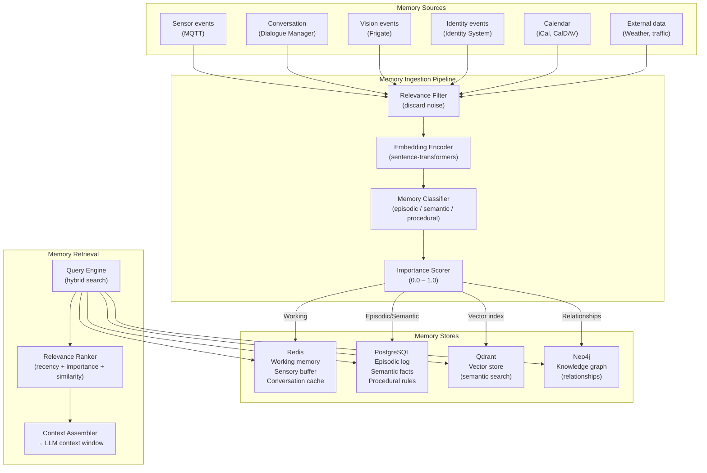
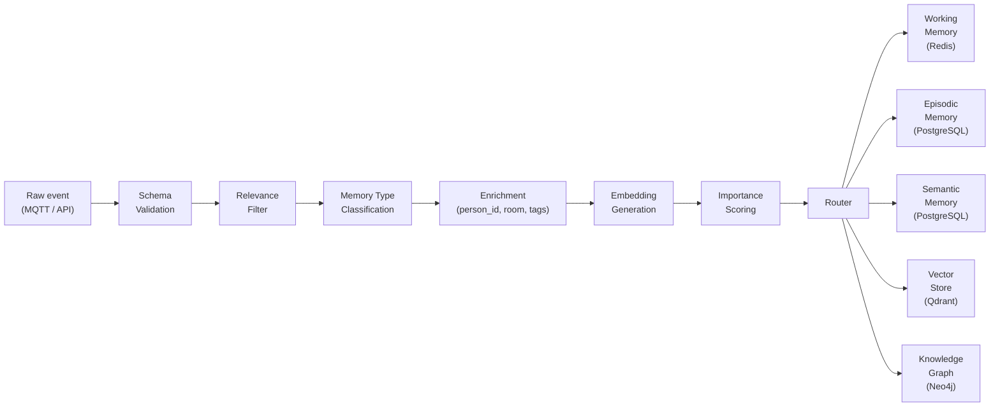

# Chapter 06 — Memory System

**AI Home OS Internal Design Specification**  
**Classification:** Internal — Engineering  
**Status:** Draft v1.0  
**Date:** 2026-07-17

---

## Table of Contents

1. [Overview](#1-overview)
2. [Design Philosophy](#2-design-philosophy)
3. [Memory Architecture](#3-memory-architecture)
4. [Working Memory](#4-working-memory)
5. [Episodic Memory](#5-episodic-memory)
6. [Semantic Memory](#6-semantic-memory)
7. [Procedural Memory](#7-procedural-memory)
8. [Conversational Memory](#8-conversational-memory)
9. [Sensory Memory Buffer](#9-sensory-memory-buffer)
10. [Vector Store — Qdrant](#10-vector-store--qdrant)
11. [Knowledge Graph — Neo4j](#11-knowledge-graph--neo4j)
12. [Memory Ingestion Pipeline](#12-memory-ingestion-pipeline)
13. [Memory Retrieval](#13-memory-retrieval)
14. [Memory Aging & Forgetting](#14-memory-aging--forgetting)
15. [Preference Learning from Memory](#15-preference-learning-from-memory)
16. [Routine Detection](#16-routine-detection)
17. [Memory Privacy & Access Control](#17-memory-privacy--access-control)
18. [Database Schema](#18-database-schema)
19. [Failure Modes & Redundancy](#19-failure-modes--redundancy)
20. [Design Decisions & Trade-offs](#20-design-decisions--trade-offs)
21. [Risks](#21-risks)
22. [Future Improvements](#22-future-improvements)
23. [References](#23-references)

---

## 1. Overview

Memory is what separates an intelligent assistant from a reactive automation system. Without memory, the AI treats every interaction as if it had no history — it cannot learn, cannot anticipate, cannot know that "Sadiq always lowers the thermostat at 10 PM" or that "the family had guests last Tuesday and preferred the lights at 40% brightness."

AI Home OS Memory System is a **multi-tier, purpose-built memory architecture** modeled loosely on human memory structures:

| Memory Tier | Human Analog | AI Home OS Implementation | Timescale |
|------------|-------------|--------------------------|-----------|
| Working memory | Short-term focus | Redis — in-memory, ephemeral | Seconds–minutes |
| Episodic memory | Autobiographical events | PostgreSQL + TimescaleDB | Days–years |
| Semantic memory | General knowledge + facts | PostgreSQL + vector store (Qdrant) | Permanent until superseded |
| Procedural memory | Learned routines and skills | PostgreSQL automation rule store | Permanent |
| Conversational memory | Dialogue context | Redis + PostgreSQL (session log) | Session + 90 days |
| Sensory buffer | Immediate raw perception | Redis streams | 10–60 seconds |

The Memory System is the central repository that all AI agents query and write to. It transforms the AI from a stateless question-answerer into a genuine household intelligence with history, knowledge, and learned behavior.

---

## 2. Design Philosophy

### 2.1 Memory Enables Personalization

Without memory, the AI cannot:
- Know that Sadiq drinks coffee in the morning but tea in the afternoon
- Remember that the guest bedroom window was left open during last week's rain
- Detect that the washing machine has been unusually noisy for 3 days
- Know that the family has a dinner reservation tonight (from calendar)

Every useful personalized action the AI takes is driven by memory.

### 2.2 Not All Memories Are Equal

Some memories are more valuable than others and should be retained longer. The memory system assigns **importance scores** based on:
- Emotional salience (emergency events > routine events)
- Frequency (repeated patterns strengthen in memory)
- Recency (recent memories weighted higher)
- Explicit marking (user says "remember this")

### 2.3 Memory Decays Gracefully

Like human memory, facts that are never reinforced fade over time. The system implements **memory aging** — unused semantic facts are given lower retrieval priority, and episodic events beyond a configurable retention window are summarized and compressed rather than deleted outright.

### 2.4 Memory Is Private

Memory data is among the most sensitive in the system. It contains the behavioral history of every person in the home. Access is strictly compartmentalized: each AI agent accesses only the memory it needs, and no memory leaves the home network without explicit user consent.

---

## 3. Memory Architecture



---

## 4. Working Memory

### 4.1 Purpose

Working memory is the AI's **current attention** — what is happening right now. It is fast, volatile, and small. It answers questions like:
- Who is currently in which room?
- What is the HVAC doing right now?
- What did Sadiq just ask for?
- What was the last automation triggered?

Working memory lives entirely in **Redis** with short TTLs (time-to-live). Nothing in working memory is intended to survive a restart — it is rebuilt from MQTT state and sensor readings on startup.

### 4.2 Working Memory Keys

```
homeios:wm:person:{id}:location        → {"room": "living_room", "confidence": 0.87}
homeios:wm:person:{id}:activity        → {"activity": "watching_tv", "since": 1720000000}
homeios:wm:person:{id}:identity_conf   → {"confidence": 0.91, "signals": ["face", "ble"]}
homeios:wm:home:state                  → {"mode": "home", "all_asleep": false, "tv_on": true}
homeios:wm:room:{room}:presence        → {"occupied": true, "persons": ["sadiq"]}
homeios:wm:room:{room}:env             → {"temp": 22.5, "co2": 680, "humidity": 48}
homeios:wm:automation:last             → {"id": "uuid", "name": "...", "triggered_at": ...}
homeios:wm:energy:now                  → {"solar_w": 2400, "battery_pct": 78, "grid_w": -500}
homeios:wm:conversation:{person_id}    → {last 10 dialogue turns, JSON}
homeios:wm:alerts:active               → [list of active alert objects]
```

### 4.3 Working Memory TTLs

| Key Pattern | TTL | Reason |
|-------------|-----|--------|
| Person location | 60s | Re-set on every identity update |
| Person activity | 300s | Activity inferred every 5 minutes |
| Home state | 30s | Frequently refreshed from sensors |
| Room environment | 60s | Sensor polling interval |
| Energy now | 15s | High-frequency power data |
| Active conversation | 120s | Cleared after conversation ends |
| Active alerts | No TTL | Manually cleared when alert resolved |

### 4.4 Working Memory API

```python
# Working memory interface (pseudo-code)

class WorkingMemory:
    def __init__(self, redis_client):
        self.redis = redis_client

    def set(self, key: str, value: dict, ttl: int = 60):
        self.redis.setex(
            f"homeios:wm:{key}",
            ttl,
            json.dumps(value)
        )

    def get(self, key: str) -> Optional[dict]:
        raw = self.redis.get(f"homeios:wm:{key}")
        return json.loads(raw) if raw else None

    def get_home_snapshot(self) -> dict:
        """Get a complete snapshot of current home state for LLM context."""
        return {
            "home_mode": self.get("home:state"),
            "persons": {
                p: self.get(f"person:{p}:location")
                for p in self.get_registered_person_ids()
            },
            "rooms": {
                r: self.get(f"room:{r}:env")
                for r in ROOM_LIST
            },
            "energy": self.get("energy:now"),
            "active_alerts": self.get("alerts:active") or []
        }
```

---

## 5. Episodic Memory

### 5.1 Purpose

Episodic memory stores **what happened** — a timestamped journal of significant events in the home. It answers questions like:
- "When was the last time the upstairs bathroom was used?"
- "How long was the front door open this morning?"
- "What was the peak solar generation day this week?"
- "When did Sadiq last water the garden?"
- "How many times did the motion sensor trigger in the backyard last night?"

### 5.2 Event Classification

Not every sensor reading is stored as an episodic memory — that would create billions of records. The ingestion pipeline classifies events into **significant** (stored) and **noise** (discarded):

| Event Category | Store? | Retention | Example |
|----------------|--------|-----------|---------|
| Person arrival/departure | Yes | 1 year | "Sadiq arrived home at 18:32" |
| Security events | Yes | 5 years | "Motion at backyard at 02:15" |
| Device failure/anomaly | Yes | 2 years | "Washing machine vibration anomaly" |
| Environmental extremes | Yes | 1 year | "CO2 reached 1,200 ppm in study" |
| Major automations triggered | Yes | 90 days | "Good morning routine ran at 07:00" |
| Conversation summaries | Yes | 90 days | "User asked about energy report" |
| Calendar events (completed) | Yes | 1 year | "Board meeting 09:00–11:00" |
| Energy generation records | Yes | 5 years | "Daily solar: 18.4 kWh" |
| Routine sensor readings | No | — | "Temp 22.5°C at 14:30:00" |
| High-frequency sensor noise | No | — | "PIR trigger #4,271 today" |

### 5.3 Episodic Event Schema

```python
@dataclass
class EpisodicEvent:
    id: str                     # UUID
    event_type: str             # 'arrival', 'departure', 'security', 'anomaly', 'conversation', ...
    timestamp: datetime
    person_id: Optional[str]    # Person involved (if any)
    location: Optional[str]     # Room or zone
    title: str                  # Human-readable summary: "Sadiq arrived home"
    description: str            # Detailed description for LLM context
    metadata: dict              # Structured data (sensor readings, camera ref, etc.)
    importance: float           # 0.0–1.0 (drives retention and retrieval priority)
    embedding: Optional[List[float]]  # Vector embedding of description (for semantic search)
    tags: List[str]             # ['security', 'sadiq', 'arrival', 'evening']
    source: str                 # Which service generated this event
```

### 5.4 Importance Scoring

```python
# Episodic importance scorer (pseudo-code)

def score_event_importance(event: RawEvent) -> float:
    base_scores = {
        'security_alert':      0.95,
        'person_arrival':      0.70,
        'person_departure':    0.70,
        'device_failure':      0.85,
        'environmental_alarm': 0.90,
        'energy_record':       0.60,
        'conversation':        0.50,
        'automation_run':      0.30,
        'routine_sensor':      0.05,
    }

    score = base_scores.get(event.type, 0.40)

    # Boost if involves emergency keywords
    EMERGENCY_KEYWORDS = ['smoke', 'fire', 'flood', 'intrusion', 'leak', 'co2']
    if any(kw in event.description.lower() for kw in EMERGENCY_KEYWORDS):
        score = max(score, 0.92)

    # Boost if involves a known person
    if event.person_id:
        score += 0.10

    # Decay for highly routine events (same event seen >5 times today)
    if event_frequency_today(event.type) > 5:
        score *= 0.6

    return min(score, 1.0)
```

---

## 6. Semantic Memory

### 6.1 Purpose

Semantic memory stores **general knowledge and facts** about the home, its occupants, and the world — things that are true regardless of when they happened. It answers questions like:
- "What is Sadiq's preferred temperature?"
- "What are the home's WiFi networks and passwords?"
- "What appliances are in the kitchen?"
- "What medications does the grandfather take?"
- "What time does the garbage truck usually come?"

### 6.2 Fact Structure

```python
@dataclass
class SemanticFact:
    id: str                     # UUID
    subject: str                # 'sadiq', 'kitchen', 'home', 'washing_machine'
    predicate: str              # 'prefers_temperature', 'contains', 'model_number'
    object: str                 # '21.5', 'Samsung WF45R', 'Tuesdays at 07:30'
    confidence: float           # 0.0–1.0
    source: str                 # 'user_stated', 'learned', 'manual_entry', 'calendar'
    created_at: datetime
    last_confirmed: datetime    # When was this fact last verified/used?
    embedding: Optional[List[float]]  # For semantic retrieval
    tags: List[str]
```

### 6.3 Fact Sources and Confidence

| Source | Example | Confidence |
|--------|---------|------------|
| **Explicitly stated by user** | "Remember I don't like cold air blowing on me" | 0.95 |
| **Learned from repeated behavior** | Thermostat always raised to 22 at 7 PM | 0.75 |
| **Calendar integration** | "Dentist appointment every 6 months" | 0.90 |
| **Device metadata** | "Washing machine model: Samsung WF45R6100" | 1.00 |
| **Sensor data analysis** | "Average morning wake time: 07:14" | 0.70 |
| **LLM extraction from conversation** | User mentioned "my parents visit every summer" | 0.60 |

### 6.4 Semantic Fact Update and Contradiction Handling

When a new fact contradicts an existing one, the system does not blindly overwrite:

```python
# Semantic fact update logic (pseudo-code)

def update_semantic_fact(new_fact: SemanticFact):
    existing = db.find_fact(
        subject=new_fact.subject,
        predicate=new_fact.predicate
    )

    if not existing:
        db.insert_fact(new_fact)
        return

    # Contradiction detected
    if existing.object != new_fact.object:
        if new_fact.confidence > existing.confidence:
            # New fact is more reliable — supersede
            db.deprecate_fact(existing.id, reason="superseded")
            db.insert_fact(new_fact)

        elif new_fact.source == 'user_stated':
            # User explicitly corrected — always trust user
            db.deprecate_fact(existing.id, reason="user_correction")
            db.insert_fact(new_fact)
            conversation_agent.acknowledge("Got it — I've updated that.")

        else:
            # Keep both, lower confidence on both
            db.lower_confidence(existing.id, factor=0.85)
            new_fact.confidence *= 0.85
            db.insert_fact(new_fact)
```

---

## 7. Procedural Memory

### 7.1 Purpose

Procedural memory stores **how to do things** — learned and explicit routines, automation rules, and action sequences. It is the bridge between the Memory System and the Automation Engine (Chapter 9).

| Type | Example | Source |
|------|---------|--------|
| **Learned routine** | "At 07:15 on weekdays, start coffee machine, increase bedroom blinds 50%, set thermostat to 21°C" | Detected from repeated behavior |
| **Explicit automation** | "When front door opens after 22:00, turn on hallway light at 30%" | User-defined |
| **LLM-generated plan** | "When Sadiq is working from home, reduce Zoom notification interruptions" | AI Planning Agent |
| **Emergency procedure** | "On smoke alarm trigger: unlock all doors, turn on all lights at 100%, call emergency services" | System defined |

### 7.2 Routine Schema

```python
@dataclass
class ProceduralMemory:
    id: str
    name: str                   # Human-readable: "Sadiq Morning Routine"
    trigger: RoutineTrigger     # What starts this routine
    conditions: List[Condition] # Optional conditions that must hold
    actions: List[Action]       # What to do
    confidence: float           # How certain we are this is wanted (learned routines)
    origin: str                 # 'user_defined', 'learned', 'ai_suggested'
    confirmed_by_user: bool     # Did user explicitly approve this routine?
    execution_count: int        # How many times this has run
    last_executed: Optional[datetime]
    success_rate: float         # % of executions that ran without user override
```

### 7.3 Routine Learning

The Routine Detector (section 16) observes repeated patterns and generates candidate procedural memories. These are presented to the user for confirmation before being added to the active store.

---

## 8. Conversational Memory

### 8.1 Short-Term Conversational Context (Redis)

Within an active dialogue session, the last N turns are stored in Redis for immediate LLM access (Chapter 4 — Conversation Continuity):

```
homeios:wm:conversation:{person_id} → [
    {"role": "user",      "content": "Turn off the lights"},
    {"role": "assistant", "content": "Done — lights off in the living room."},
    {"role": "user",      "content": "And lower the blinds"},
    {"role": "assistant", "content": "Lowering living room blinds to 0%."},
]
TTL: 120 seconds from last message
```

### 8.2 Long-Term Conversation Log (PostgreSQL)

After a conversation session ends, the session is **summarized** by the LLM and stored in long-term conversational memory:

```python
# Conversation session summarizer (pseudo-code)

async def close_conversation_session(session: ConversationSession):
    if len(session.turns) < 2:
        return  # No meaningful conversation to store

    # Summarize the conversation
    summary_prompt = f"""
Summarize this conversation between the AI home assistant and {session.person_name} in 2-3 sentences.
Include: what was discussed, what actions were taken, any important information revealed.

Conversation:
{session.format_turns()}

Summary:"""

    summary = await llm.complete(summary_prompt, max_tokens=150)

    # Extract key facts from the conversation
    facts_prompt = f"""
Extract any new facts about the user or home mentioned in this conversation.
Return as JSON array of {{subject, predicate, object}} triples.

Conversation:
{session.format_turns()}

Facts:"""

    facts = await llm.complete(facts_prompt, max_tokens=200)

    # Store summary as episodic memory
    await episodic_memory.store(EpisodicEvent(
        event_type='conversation',
        timestamp=session.started_at,
        person_id=session.person_id,
        title=f"Conversation with {session.person_name}",
        description=summary,
        importance=0.45,
        tags=['conversation', session.person_id]
    ))

    # Store extracted facts as semantic memory
    for fact in parse_facts(facts):
        await semantic_memory.update_fact(fact)
```

### 8.3 Conversation History Retrieval

When a user references something from a past conversation ("Like I said last week..."), the system retrieves relevant past sessions:

```python
async def retrieve_relevant_conversations(
    person_id: str,
    query: str,
    limit: int = 3
) -> List[ConversationSummary]:
    # Vector search in conversation summaries
    query_embedding = encoder.encode(query)

    return await vector_store.search(
        collection="conversation_summaries",
        vector=query_embedding,
        filter={"person_id": person_id},
        limit=limit
    )
```

---

## 9. Sensory Memory Buffer

### 9.1 Purpose

Sensory memory is an ultra-short-term buffer of raw sensor readings — the equivalent of the retina's persistence. It allows the AI to ask "what was the temperature in the kitchen 45 seconds ago?" without hitting the database.

**Implementation: Redis Streams**

Redis Streams provide an ordered, timestamped log of recent sensor readings with automatic expiry:

```python
# Sensory buffer writer (pseudo-code)

class SensoryBuffer:
    MAX_ENTRIES_PER_SENSOR = 120    # 2 minutes at 1-second intervals
    BUFFER_TTL = 3600               # Overall stream retention: 1 hour

    async def push(self, sensor_id: str, value: dict):
        stream_key = f"homeios:sensory:{sensor_id}"
        await self.redis.xadd(
            stream_key,
            value,
            maxlen=self.MAX_ENTRIES_PER_SENSOR,
            approximate=True
        )

    async def get_recent(
        self,
        sensor_id: str,
        seconds: int = 60
    ) -> List[dict]:
        stream_key = f"homeios:sensory:{sensor_id}"
        min_timestamp = int((time.time() - seconds) * 1000)

        entries = await self.redis.xrange(
            stream_key,
            min=min_timestamp,
            max='+'
        )
        return [entry[1] for entry in entries]
```

The sensory buffer feeds into the **Context Engine** (Chapter 8) for anomaly detection — for example, detecting that CO2 has been rising continuously for the last 10 minutes.

---

## 10. Vector Store — Qdrant

### 10.1 Why a Vector Store

Semantic search over text — "find memories related to when the guests came over" or "what did Sadiq say about his diet?" — requires **embedding-based similarity search**. Traditional SQL full-text search (LIKE, tsvector) cannot understand semantic similarity; it only matches keywords.

Qdrant is a high-performance, open-source vector database that stores embeddings and supports fast approximate nearest-neighbor search.

### 10.2 Qdrant Architecture

```
┌─────────────────────────────────────────────────────────┐
│                        Qdrant                            │
│                                                          │
│  Collections:                                            │
│    episodic_events     → 1,536-dim vectors               │
│    semantic_facts      → 1,536-dim vectors               │
│    conversation_summaries → 1,536-dim vectors            │
│    device_manuals      → 1,536-dim vectors               │
│    knowledge_base      → 1,536-dim vectors               │
│                                                          │
│  Each vector includes:                                   │
│    - Embedding (float32 array)                           │
│    - Payload: {id, person_id, timestamp, tags, ...}      │
│                                                          │
│  Index: HNSW (Hierarchical Navigable Small World)        │
│  Similarity: Cosine                                      │
└─────────────────────────────────────────────────────────┘
```

### 10.3 Embedding Model

**sentence-transformers/all-MiniLM-L6-v2** (384 dimensions, local):
- Model size: 80 MB
- Inference: < 5ms per sentence (CPU)
- Accuracy: Good for English short-to-medium sentences
- Language: English-primary

**text-embedding-3-small (OpenAI, 1,536 dimensions)** — cloud fallback:
- Only used when local model is insufficient
- Only text embeddings sent to cloud (no raw sensor data)
- Cost: $0.02 per 1M tokens

**nomic-embed-text (Ollama, local, 768 dimensions)** — recommended for multilingual:
- Runs locally via Ollama
- Supports Arabic, English, French, and 40+ languages
- Model size: 274 MB
- Better for multilingual households

```python
# Embedding service (pseudo-code)

from sentence_transformers import SentenceTransformer

class EmbeddingService:
    def __init__(self):
        # Primary: local sentence-transformers
        self.local_model = SentenceTransformer('all-MiniLM-L6-v2')

        # Secondary: Ollama nomic-embed (multilingual)
        self.ollama_url = "http://localhost:11434/api/embeddings"

    def encode(self, text: str, language: str = 'en') -> List[float]:
        if language != 'en':
            # Use Ollama nomic-embed for non-English
            return self._encode_ollama(text, model='nomic-embed-text')
        return self.local_model.encode(text).tolist()

    def _encode_ollama(self, text: str, model: str) -> List[float]:
        resp = httpx.post(
            self.ollama_url,
            json={"model": model, "prompt": text}
        )
        return resp.json()['embedding']
```

### 10.4 Qdrant Docker Deployment

```yaml
# docker-compose.yml excerpt
qdrant:
  image: qdrant/qdrant:v1.9.0
  container_name: homeios-qdrant
  restart: unless-stopped
  ports:
    - "6333:6333"
    - "6334:6334"
  volumes:
    - ./data/qdrant:/qdrant/storage
  environment:
    QDRANT__SERVICE__GRPC_PORT: 6334
    QDRANT__SERVICE__HTTP_PORT: 6333
    QDRANT__STORAGE__STORAGE_PATH: /qdrant/storage
  mem_limit: 2g
  cpus: 2
```

### 10.5 Collection Setup

```python
# Qdrant collection initialization (pseudo-code)

from qdrant_client import QdrantClient
from qdrant_client.models import (
    Distance, VectorParams, HnswConfigDiff
)

client = QdrantClient(host="localhost", port=6333)

# Create episodic events collection
client.create_collection(
    collection_name="episodic_events",
    vectors_config=VectorParams(
        size=384,               # all-MiniLM-L6-v2 dimensions
        distance=Distance.COSINE
    ),
    hnsw_config=HnswConfigDiff(
        m=16,                   # HNSW connectivity parameter
        ef_construct=100        # Build-time quality
    )
)

# Create semantic facts collection
client.create_collection(
    collection_name="semantic_facts",
    vectors_config=VectorParams(size=384, distance=Distance.COSINE)
)

# Create conversation summaries collection
client.create_collection(
    collection_name="conversation_summaries",
    vectors_config=VectorParams(size=384, distance=Distance.COSINE)
)
```

---

## 11. Knowledge Graph — Neo4j

### 11.1 Why a Knowledge Graph

Relationships between entities in the home are complex and multi-dimensional:
- Sadiq **owns** the iPhone
- The iPhone **is associated with** the guest network
- The guest network **is on** VLAN 60
- Sadiq **lives in** the master bedroom
- The master bedroom **has** a Dyson fan
- The Dyson fan **is connected to** the IoT VLAN
- Sadiq **prefers** 21°C in the bedroom

A relational database can store these facts in tables, but querying multi-hop relationships ("What devices does Sadiq use that are on the IoT VLAN?") requires complex JOINs. A **knowledge graph** (Neo4j) makes these queries natural and fast.

### 11.2 Node Types

```
(:Person {id, name, role})
(:Device {id, name, type, manufacturer, model, firmware})
(:Room {id, name, floor, area_m2})
(:Sensor {id, name, type, room_id})
(:Automation {id, name, trigger, last_run})
(:Event {id, type, timestamp, description})
(:Preference {key, value, confidence})
(:Schedule {day_of_week, time, recurring})
(:Network {ssid, vlan_id, subnet})
(:Calendar {event_id, title, start, end})
```

### 11.3 Relationship Types

```
(:Person)-[:LIVES_IN]->(:Room)
(:Person)-[:OWNS]->(:Device)
(:Person)-[:HAS_PREFERENCE]->(:Preference)
(:Person)-[:FOLLOWS_SCHEDULE]->(:Schedule)
(:Device)-[:LOCATED_IN]->(:Room)
(:Device)-[:CONNECTED_TO]->(:Network)
(:Device)-[:CONTROLLED_BY]->(:Automation)
(:Room)-[:HAS_SENSOR]->(:Sensor)
(:Room)-[:ADJACENT_TO]->(:Room)
(:Event)-[:INVOLVES]->(:Person)
(:Event)-[:OCCURRED_IN]->(:Room)
(:Automation)-[:TRIGGERED_BY]->(:Event)
(:Automation)-[:CONTROLS]->(:Device)
```

### 11.4 Example Knowledge Graph Queries

```cypher
// Find all devices in rooms Sadiq uses
MATCH (p:Person {name: "Sadiq"})-[:LIVES_IN]->(r:Room)
      <-[:LOCATED_IN]-(d:Device)
RETURN d.name, d.type, r.name;

// Find all automations that affect Sadiq's bedroom
MATCH (a:Automation)-[:CONTROLS]->(d:Device)-[:LOCATED_IN]->
      (r:Room)<-[:LIVES_IN]-(p:Person {name: "Sadiq"})
RETURN a.name, d.name;

// Find which persons were home during a security event
MATCH (e:Event {type: "security_alert"})-[:OCCURRED_IN]->(r:Room),
      (p:Person)-[:LIVES_IN]->(r)
WHERE e.timestamp > datetime("2026-07-15")
RETURN p.name, e.description, e.timestamp;

// Find Sadiq's morning schedule and the devices it uses
MATCH (p:Person {name: "Sadiq"})-[:FOLLOWS_SCHEDULE]->(s:Schedule)
      -[:TRIGGERS]->(a:Automation)-[:CONTROLS]->(d:Device)
WHERE s.time.hour < 10
RETURN s.time, a.name, d.name, d.type;
```

### 11.5 Neo4j Docker Deployment

```yaml
# docker-compose.yml excerpt
neo4j:
  image: neo4j:5.19-community
  container_name: homeios-neo4j
  restart: unless-stopped
  ports:
    - "7474:7474"   # Browser UI
    - "7687:7687"   # Bolt protocol
  volumes:
    - ./data/neo4j:/data
    - ./data/neo4j-logs:/logs
  environment:
    NEO4J_AUTH: neo4j/${NEO4J_PASSWORD}
    NEO4J_PLUGINS: '["apoc", "graph-data-science"]'
    NEO4J_dbms_memory_heap_initial__size: 512m
    NEO4J_dbms_memory_heap_max__size: 1g
    NEO4J_dbms_memory_pagecache_size: 512m
  mem_limit: 2g
```

---

## 12. Memory Ingestion Pipeline

### 12.1 Pipeline Overview

Every event that enters the Memory System passes through a structured pipeline:



### 12.2 Ingestion Worker

```python
# Memory ingestion worker (pseudo-code)

class MemoryIngestionWorker:
    def __init__(self, working_mem, episodic_mem, semantic_mem, vector_store, kg):
        self.wm = working_mem
        self.em = episodic_mem
        self.sm = semantic_mem
        self.vs = vector_store
        self.kg = kg

    async def ingest(self, raw_event: dict):
        # 1. Validate schema
        event = self._validate(raw_event)
        if not event:
            return

        # 2. Filter noise
        if not self._is_relevant(event):
            return

        # 3. Classify memory type
        mem_types = self._classify(event)

        # 4. Enrich with context
        event = await self._enrich(event)

        # 5. Score importance
        event.importance = self._score_importance(event)

        # 6. Route to stores
        # Always update working memory for relevant sensor events
        if 'sensor' in mem_types or 'state' in mem_types:
            await self.wm.update(event)

        # Store significant events in episodic memory
        if 'episodic' in mem_types and event.importance >= 0.30:
            episode = await self.em.store(event)

            # Index in vector store for semantic retrieval
            embedding = embedding_service.encode(event.description)
            await self.vs.upsert(
                collection="episodic_events",
                id=episode.id,
                vector=embedding,
                payload={
                    "event_type": event.event_type,
                    "person_id": event.person_id,
                    "timestamp": event.timestamp.isoformat(),
                    "tags": event.tags
                }
            )

        # Store facts in semantic memory
        if 'semantic' in mem_types:
            for fact in event.extracted_facts:
                await self.sm.update_fact(fact)

        # Update knowledge graph relationships
        if 'knowledge_graph' in mem_types:
            await self.kg.merge_event(event)
```

---

## 13. Memory Retrieval

### 13.1 Hybrid Retrieval

The most powerful memory retrieval combines **keyword search** (exact match), **vector search** (semantic similarity), and **structured filtering** (date range, person, room):

```python
# Hybrid memory retrieval (pseudo-code)

class MemoryRetriever:
    async def retrieve(
        self,
        query: str,
        person_id: Optional[str] = None,
        time_range: Optional[Tuple[datetime, datetime]] = None,
        memory_types: List[str] = ['episodic', 'semantic'],
        limit: int = 10
    ) -> List[MemoryResult]:

        results = []

        # 1. Vector search (semantic)
        query_embedding = embedding_service.encode(query)
        filter_dict = {}
        if person_id:
            filter_dict["person_id"] = person_id
        if time_range:
            filter_dict["timestamp"] = {
                "gte": time_range[0].isoformat(),
                "lte": time_range[1].isoformat()
            }

        if 'episodic' in memory_types:
            vector_results = await vector_store.search(
                collection="episodic_events",
                vector=query_embedding,
                filter=filter_dict,
                limit=limit
            )
            results.extend(vector_results)

        if 'semantic' in memory_types:
            semantic_results = await vector_store.search(
                collection="semantic_facts",
                vector=query_embedding,
                filter=filter_dict,
                limit=limit // 2
            )
            results.extend(semantic_results)

        # 2. Keyword search (PostgreSQL full-text)
        keyword_results = await db.fulltext_search(
            query=query,
            person_id=person_id,
            time_range=time_range,
            limit=limit
        )
        results.extend(keyword_results)

        # 3. Rank: combine relevance + recency + importance
        ranked = self._rank(results, query_embedding)

        # 4. Deduplicate and return top-k
        return deduplicate(ranked)[:limit]

    def _rank(self, results, query_embedding) -> List[MemoryResult]:
        for r in results:
            recency_score = 1.0 / (1.0 + days_since(r.timestamp))
            r.final_score = (
                0.50 * r.vector_similarity +
                0.25 * recency_score +
                0.25 * r.importance
            )
        return sorted(results, key=lambda r: r.final_score, reverse=True)
```

### 13.2 Context Assembly for LLM

When the LLM needs to respond to a user query, the Memory System assembles a context block:

```python
# LLM context assembler (pseudo-code)

async def assemble_llm_context(
    user_query: str,
    person_id: str,
    room: str
) -> str:
    # Retrieve relevant memories
    memories = await memory_retriever.retrieve(
        query=user_query,
        person_id=person_id,
        limit=5
    )

    # Get current home state
    home_state = working_memory.get_home_snapshot()

    # Get recent conversation
    conversation = working_memory.get(f"conversation:{person_id}") or []

    # Get user preferences
    prefs = semantic_memory.get_preferences(person_id)

    context = f"""
Current home state:
{json.dumps(home_state, indent=2)}

User preferences (from memory):
{json.dumps(prefs, indent=2)}

Relevant memories:
{format_memories(memories)}

Recent conversation:
{format_conversation(conversation)}
"""
    return context
```

---

## 14. Memory Aging & Forgetting

### 14.1 Retention Policies

The memory system implements configurable retention policies per memory type:

```python
RETENTION_POLICIES = {
    'episodic': {
        'security_event':      365 * 5,   # 5 years
        'energy_record':       365 * 5,
        'device_failure':      365 * 2,
        'person_arrival':      365,
        'environmental_alarm': 365,
        'conversation':        90,
        'automation_run':      90,
        'routine_sensor':      1,          # Raw readings: 24 hours
    },
    'semantic': {
        'user_preference':     None,       # Never expires
        'home_fact':           None,
        'learned_preference':  365 * 2,
    },
    'conversation': {
        'session_summary':     90,
        'raw_transcript':      7,          # Raw conversation text: 7 days
    }
}
```

### 14.2 Memory Compression

Rather than deleting old episodic events, the system **compresses** them — replacing many individual events with a statistical summary:

```python
# Memory compression (pseudo-code)

async def compress_old_episodes(person_id: str, older_than_days: int = 90):
    """
    Replace individual episodic events older than N days with
    compressed summaries (weekly/monthly summaries).
    """
    old_events = await db.get_episodes(
        person_id=person_id,
        older_than_days=older_than_days,
        min_importance=0.0,  # All events
        max_importance=0.6   # Only low-to-medium importance
    )

    # Group by week
    weekly_groups = group_by_week(old_events)

    for week, events in weekly_groups.items():
        # Generate weekly summary via LLM
        summary = await llm.summarize(
            f"Summarize these home events from the week of {week}: "
            + format_events(events)
        )

        # Store compressed summary
        await db.store_episode(EpisodicEvent(
            event_type='weekly_summary',
            timestamp=week,
            person_id=person_id,
            description=summary,
            importance=0.50,
            tags=['summary', 'weekly']
        ))

        # Delete originals
        await db.delete_episodes(ids=[e.id for e in events])
```

### 14.3 Importance-Based Pruning

Very low-importance events (< 0.30 importance score) that have never been retrieved are pruned after their retention window:

```python
async def prune_low_importance_events():
    """
    Scheduled daily: Remove episodic events that are:
    1. Below importance threshold
    2. Past their retention window
    3. Never retrieved (retrieval_count = 0)
    """
    await db.execute("""
        DELETE FROM episodic_events
        WHERE importance < 0.30
          AND created_at < NOW() - (retention_days || ' days')::INTERVAL
          AND retrieval_count = 0
    """)
```

---

## 15. Preference Learning from Memory

### 15.1 Learning Thermostat Preferences

```python
# Thermostat preference learner (pseudo-code)

class ThermostatPreferenceLearner:
    MIN_OBSERVATIONS = 5    # Need at least 5 overrides before learning

    def learn_preferences(self, person_id: str) -> Optional[ThermostatPreference]:
        # Get all manual thermostat overrides by this person in last 90 days
        overrides = db.get_manual_overrides(
            person_id=person_id,
            device_type='thermostat',
            days=90
        )

        if len(overrides) < self.MIN_OBSERVATIONS:
            return None

        # Cluster by context
        patterns = {}
        for override in overrides:
            ctx_key = (
                override.time_of_day_bucket,    # morning/afternoon/evening/night
                override.day_type,              # weekday/weekend
                override.season,
                override.weather_hot            # True if > 30°C outside
            )
            patterns.setdefault(ctx_key, []).append(override.target_temp)

        # Build preference model
        pref = {}
        for ctx, temps in patterns.items():
            if len(temps) >= 3:
                mean_temp = sum(temps) / len(temps)
                pref[ctx] = {
                    'preferred_temp': round(mean_temp, 1),
                    'confidence': min(len(temps) / 10.0, 0.85),
                    'sample_count': len(temps)
                }

        semantic_memory.update_fact(SemanticFact(
            subject=person_id,
            predicate='thermostat_preference',
            object=json.dumps(pref),
            confidence=0.75,
            source='learned'
        ))
        return pref
```

### 15.2 Learning Wake/Sleep Times

```python
# Wake time learner (pseudo-code)

def learn_wake_times(person_id: str):
    """
    Detect wake time from: first motion in bedroom after 05:00,
    first voice interaction after 05:00, first room transition.
    """
    wake_events = db.query("""
        SELECT EXTRACT(EPOCH FROM time)::int AS wake_ts,
               EXTRACT(DOW FROM time) AS day_of_week
        FROM location_events
        WHERE person_id = %s
          AND room != 'master_bedroom'
          AND time::time > '05:00'
          AND time::time < '11:00'
          AND time > NOW() - INTERVAL '60 days'
        GROUP BY date_trunc('day', time), day_of_week
        ORDER BY date_trunc('day', time), wake_ts
    """, (person_id,))

    # Compute median wake time by day of week
    by_dow = {}
    for event in wake_events:
        by_dow.setdefault(event.day_of_week, []).append(event.wake_ts)

    learned_times = {}
    for dow, times in by_dow.items():
        if len(times) >= 4:
            median = sorted(times)[len(times) // 2]
            learned_times[dow] = datetime.fromtimestamp(median).strftime('%H:%M')

    semantic_memory.update_fact(SemanticFact(
        subject=person_id,
        predicate='wake_time_by_day',
        object=json.dumps(learned_times),
        confidence=0.70,
        source='learned'
    ))
```

---

## 16. Routine Detection

### 16.1 What Is a Routine?

A routine is a **temporal pattern of actions** that a person performs consistently in the same context. Examples:
- Every weekday at 07:15, Sadiq goes to the kitchen and turns on the coffee machine
- Every Sunday evening, the family gathers in the living room and watches TV
- Every time Sadiq comes home, he goes to the bathroom within 3 minutes

### 16.2 Routine Detection Algorithm

```python
# Routine detector (pseudo-code)

from collections import defaultdict

class RoutineDetector:
    MIN_OCCURRENCES = 5     # Pattern must occur 5+ times to qualify
    CONSISTENCY_THRESHOLD = 0.75  # Must match 75% of the time

    def detect_routines(self, person_id: str, days: int = 60) -> List[CandidateRoutine]:
        events = db.get_location_and_device_events(person_id, days=days)
        routines = []

        # Discretize time into 15-minute buckets
        time_buckets = self._discretize_events(events, bucket_size_minutes=15)

        # Detect frequent sequential patterns (AprioriAll-inspired)
        patterns = defaultdict(list)
        for day_events in time_buckets:
            for i, event in enumerate(day_events):
                # Build pattern key: (day_type, time_bucket, action_sequence)
                context = self._get_context(event, day_events)
                pattern_key = (
                    context.day_type,
                    context.time_bucket,
                    event.action_type
                )
                patterns[pattern_key].append({
                    'date': event.date,
                    'details': event.details
                })

        # Filter by occurrence count and consistency
        for pattern_key, occurrences in patterns.items():
            occurrence_count = len(occurrences)
            total_possible = days // 7 * 5 if pattern_key[0] == 'weekday' else days // 7

            consistency = occurrence_count / max(total_possible, 1)

            if occurrence_count >= self.MIN_OCCURRENCES and consistency >= self.CONSISTENCY_THRESHOLD:
                routines.append(CandidateRoutine(
                    pattern=pattern_key,
                    occurrence_count=occurrence_count,
                    consistency=consistency,
                    description=self._describe_pattern(pattern_key, occurrences)
                ))

        return sorted(routines, key=lambda r: r.consistency, reverse=True)
```

### 16.3 Routine Confirmation

Detected routines are **never activated automatically** without user confirmation:

```
AI: "I've noticed that on weekdays around 07:15, you go to the kitchen
     and start the coffee machine. Would you like me to automate this —
     start the coffee machine at 07:10 so it's ready when you arrive?"

User: "Yes, do that."
  → ProceduralMemory created, confirmed_by_user=True

User: "No thanks."
  → CandidateRoutine marked as declined, not proposed again for 30 days
```

---

## 17. Memory Privacy & Access Control

### 17.1 Access Control Matrix

| Memory Type | Conversation Agent | Security Agent | Energy Agent | Health Agent | Primary User | Other Residents |
|-------------|:-----------------:|:--------------:|:------------:|:------------:|:------------:|:---------------:|
| Working memory (home state) | ✓ | ✓ | ✓ | ✓ | ✓ | Read-only |
| Episodic (own events) | ✓ | ✓ | ✓ | ✓ | ✓ | None |
| Episodic (security events) | Read | ✓ | None | None | ✓ | None |
| Semantic (preferences) | ✓ | None | ✓ | ✓ | ✓ | None |
| Health data | None | None | None | ✓ | ✓ | None |
| Conversation logs | Own | None | None | None | ✓ | None |
| Knowledge graph (relationships) | ✓ | ✓ | ✓ | ✓ | ✓ | Limited |

### 17.2 Memory Access Audit Log

All access to sensitive memory types is logged:

```sql
CREATE TABLE memory_access_log (
    id          UUID PRIMARY KEY DEFAULT gen_random_uuid(),
    accessor    VARCHAR(50) NOT NULL,   -- agent name or user_id
    memory_type VARCHAR(30) NOT NULL,
    operation   VARCHAR(10) NOT NULL,   -- 'read', 'write', 'delete'
    record_id   UUID,
    person_id   UUID,                   -- whose data was accessed
    purpose     TEXT,
    timestamp   TIMESTAMPTZ DEFAULT now()
);
```

### 17.3 Export and Deletion

Users can request a full export of their memory data in JSON format, or request deletion of all memory data associated with their profile (extends the Identity System's right-to-forget):

```python
async def export_memory_data(person_id: str) -> dict:
    return {
        "episodic_events": await db.get_all_episodes(person_id),
        "semantic_facts": await db.get_all_facts(person_id),
        "conversation_summaries": await db.get_all_conversations(person_id),
        "preferences": await db.get_preferences(person_id),
        "routines": await db.get_routines(person_id),
        "exported_at": datetime.utcnow().isoformat()
    }

async def delete_memory_data(person_id: str):
    await db.delete_all_episodes(person_id)
    await db.delete_all_facts(person_id)
    await db.delete_all_conversations(person_id)
    await vector_store.delete_by_filter({"person_id": person_id})
    await kg.delete_person_nodes(person_id)
```

---

## 18. Database Schema

### 18.1 Episodic Events (PostgreSQL + TimescaleDB)

```sql
CREATE TABLE episodic_events (
    id              UUID PRIMARY KEY DEFAULT gen_random_uuid(),
    event_type      VARCHAR(50) NOT NULL,
    timestamp       TIMESTAMPTZ NOT NULL,
    person_id       UUID REFERENCES persons(id),
    location        VARCHAR(50),
    title           TEXT NOT NULL,
    description     TEXT NOT NULL,
    metadata        JSONB DEFAULT '{}',
    importance      FLOAT DEFAULT 0.5 CHECK (importance BETWEEN 0 AND 1),
    tags            TEXT[] DEFAULT '{}',
    source          VARCHAR(50),
    retrieval_count INT DEFAULT 0,
    retention_days  INT DEFAULT 90,
    created_at      TIMESTAMPTZ DEFAULT now()
);

SELECT create_hypertable('episodic_events', 'timestamp',
    chunk_time_interval => INTERVAL '7 days');

CREATE INDEX ON episodic_events (person_id, timestamp DESC);
CREATE INDEX ON episodic_events USING GIN (tags);
CREATE INDEX ON episodic_events USING GIN (to_tsvector('english', description));
```

### 18.2 Semantic Facts (PostgreSQL)

```sql
CREATE TABLE semantic_facts (
    id              UUID PRIMARY KEY DEFAULT gen_random_uuid(),
    subject         VARCHAR(100) NOT NULL,
    predicate       VARCHAR(100) NOT NULL,
    object          TEXT NOT NULL,
    confidence      FLOAT DEFAULT 1.0,
    source          VARCHAR(30) DEFAULT 'user_stated',
    is_active       BOOLEAN DEFAULT TRUE,
    created_at      TIMESTAMPTZ DEFAULT now(),
    last_confirmed  TIMESTAMPTZ DEFAULT now(),
    tags            TEXT[] DEFAULT '{}',
    UNIQUE (subject, predicate, object)
);

CREATE INDEX ON semantic_facts (subject, predicate);
CREATE INDEX ON semantic_facts (is_active);
```

### 18.3 Conversation Sessions (PostgreSQL)

```sql
CREATE TABLE conversation_sessions (
    id          UUID PRIMARY KEY DEFAULT gen_random_uuid(),
    person_id   UUID REFERENCES persons(id),
    room        VARCHAR(50),
    started_at  TIMESTAMPTZ NOT NULL,
    ended_at    TIMESTAMPTZ,
    turn_count  INT DEFAULT 0,
    summary     TEXT,                -- LLM-generated summary
    raw_log     JSONB               -- Full turn log (purged after 7 days)
);

CREATE TABLE conversation_turns (
    id              UUID PRIMARY KEY DEFAULT gen_random_uuid(),
    session_id      UUID REFERENCES conversation_sessions(id) ON DELETE CASCADE,
    sequence        INT NOT NULL,
    role            VARCHAR(20) NOT NULL,  -- 'user' or 'assistant'
    content         TEXT NOT NULL,
    timestamp       TIMESTAMPTZ DEFAULT now()
);
```

### 18.4 Routines (Procedural Memory)

```sql
CREATE TABLE procedural_routines (
    id                  UUID PRIMARY KEY DEFAULT gen_random_uuid(),
    name                VARCHAR(200) NOT NULL,
    person_id           UUID REFERENCES persons(id),
    trigger_config      JSONB NOT NULL,     -- When this routine fires
    conditions          JSONB DEFAULT '[]', -- Additional conditions
    actions             JSONB NOT NULL,     -- What to do
    confidence          FLOAT DEFAULT 0.8,
    origin              VARCHAR(30) DEFAULT 'user_defined',
    confirmed_by_user   BOOLEAN DEFAULT FALSE,
    is_active           BOOLEAN DEFAULT TRUE,
    execution_count     INT DEFAULT 0,
    success_rate        FLOAT DEFAULT 1.0,
    last_executed       TIMESTAMPTZ,
    created_at          TIMESTAMPTZ DEFAULT now()
);
```

---

## 19. Failure Modes & Redundancy

| Failure | Impact | Detection | Recovery |
|---------|--------|-----------|---------|
| Redis crash | Working memory lost | Docker health check | Restart Redis; rebuild state from MQTT subscriptions in ~30s |
| PostgreSQL crash | No episodic/semantic storage | Docker health check | Restart; events buffered in Redis during downtime |
| Qdrant crash | No semantic search | Docker health check | Restart; re-index from PostgreSQL (automated script) |
| Neo4j crash | No relationship queries | Docker health check | Restart; graph rebuilt from PostgreSQL on next query |
| Embedding service crash | No new memory indexing | Health check | Events stored in PostgreSQL without vector index; re-indexed on recovery |
| Disk full | Memory writes fail | Disk monitoring (Prometheus) | Alert; trigger compression job; expand storage |
| Memory corruption | Incorrect AI behavior | Periodic consistency check | Restore from backup; validate against sensor ground truth |

### 19.1 Backup Strategy

| Store | Backup Method | Frequency | Retention |
|-------|-------------|-----------|-----------|
| PostgreSQL | pg_dump to NAS | Daily | 30 days |
| Qdrant | Volume snapshot | Weekly | 4 weeks |
| Neo4j | neo4j-admin dump | Weekly | 4 weeks |
| Redis | RDB snapshot | Every 15 min | 24 hours |

---

## 20. Design Decisions & Trade-offs

### 20.1 Why Multiple Stores vs. One Unified Database

| Approach | Pros | Cons |
|----------|------|------|
| **Multi-store (this design)** | Each store optimized for its use case; best performance | Operational complexity; multiple services to manage |
| Single PostgreSQL | Simple; one backup target; familiar | Poor vector search; no graph traversal; slower |
| MongoDB + Atlas Search | Flexible schema; decent search | Requires cloud for vector search; weaker time-series |

**Decision:** Multi-store. Redis for speed, TimescaleDB for time-series, Qdrant for vectors, Neo4j for relationships. Each component is best-in-class for its purpose. The ingestion pipeline abstracts the complexity from agents.

### 20.2 Local Embedding vs. Cloud Embedding

| Approach | Privacy | Cost | Quality |
|----------|---------|------|---------|
| **Local (all-MiniLM-L6-v2)** | ★★★★★ | Free | ★★★ |
| **Ollama (nomic-embed-text)** | ★★★★★ | Free | ★★★★ |
| **OpenAI text-embedding-3** | ★★ (text leaves home) | $0.02/1M | ★★★★★ |

**Decision:** Local embedding as primary (nomic-embed-text via Ollama for multilingual support). Cloud embedding available as opt-in for users who want higher accuracy.

### 20.3 Memory Decay vs. Permanent Storage

| Approach | Pros | Cons |
|----------|------|------|
| **Decay + compress (this design)** | Storage controlled; mirrors human memory; irrelevant facts don't persist | Might lose data user later wants |
| Permanent storage (no deletion) | Nothing lost | Unbounded storage; older facts dilute retrieval relevance |

**Decision:** Decay + compress. Storage grows linearly over years. Old summaries are more useful than thousands of stale individual events.

---

## 21. Risks

| Risk | Probability | Impact | Mitigation |
|------|-------------|--------|------------|
| Memory store corruption leading to wrong AI behavior | Low | High | Automated consistency checks; backups; human override always available |
| Sensitive memory accessed by unauthorized agent | Low | High | Access control matrix enforced at API layer; audit logging |
| Preference learning reinforces incorrect behavior | Medium | Medium | Confidence threshold; user confirmation for automations; easy override |
| Storage exhaustion from unbounded event logging | Low | Medium | Retention policies; compression jobs; disk monitoring + alerts |
| LLM extracts incorrect facts from conversation | Medium | Low | Low confidence assigned to LLM-extracted facts; user can review and correct |
| Memory used to profile user without consent | Very Low | Very High | Privacy architecture; all access logged; user-accessible audit trail |

---

## 22. Future Improvements

| Improvement | Version | Description |
|-------------|---------|-------------|
| Federated memory (multi-site) | v3 | Memory shared across multiple AI Home OS installations (with user consent) |
| Memory summarization by LLM on demand | v2 | User can ask "summarize my week" — LLM reads episodic events |
| Proactive memory surface | v2 | "On this day last year..." style reminders |
| Multi-modal memory (image storage) | v2 | Store vision event thumbnails alongside episodic events |
| Generative memory (creative recall) | v3 | AI synthesizes coherent narratives from episodic facts |
| On-device memory for satellites | v3 | Store last-N conversations locally on satellite for offline context |
| Memory confidence decay | v2 | Confidence of semantic facts decays if not confirmed for 12+ months |

---

## 23. References

1. **Redis Streams** — https://redis.io/docs/data-types/streams/
2. **TimescaleDB** — https://docs.timescale.com/
3. **Qdrant Vector DB** — https://qdrant.tech/documentation/
4. **pgvector** — https://github.com/pgvector/pgvector
5. **Neo4j Graph Database** — https://neo4j.com/docs/
6. **sentence-transformers** — Reimers & Gurevych, 2019 — https://arxiv.org/abs/1908.10084
7. **nomic-embed-text** — https://ollama.com/library/nomic-embed-text
8. **HNSW Index** — Malkov & Yashunin, 2018 — https://arxiv.org/abs/1603.09320
9. **Episodic Memory in AI** — Tulving, 1972 (psychology basis)
10. **AprioriAll Frequent Sequence Mining** — Agrawal & Srikant, 1995
11. **MemoryGPT / MemGPT** — Packer et al., 2023 — https://arxiv.org/abs/2310.08560
12. **Retrieval-Augmented Generation (RAG)** — Lewis et al., 2020 — https://arxiv.org/abs/2005.11401
13. **GDPR Article 5 — Data Minimisation** — https://gdpr-info.eu/art-5-gdpr/

---

*Previous: [Chapter 05 — Identity System](Chapter-05-Identity-System.md)*  
*Next: [Chapter 07 — AI Reasoning Engine](Chapter-07-AI-Reasoning-Engine.md)*

---

> **Document maintained by:** AI Home OS Architecture Team  
> **Last updated:** 2026-07-17  
> **Chapter status:** Draft v1.0 — Open for community review
