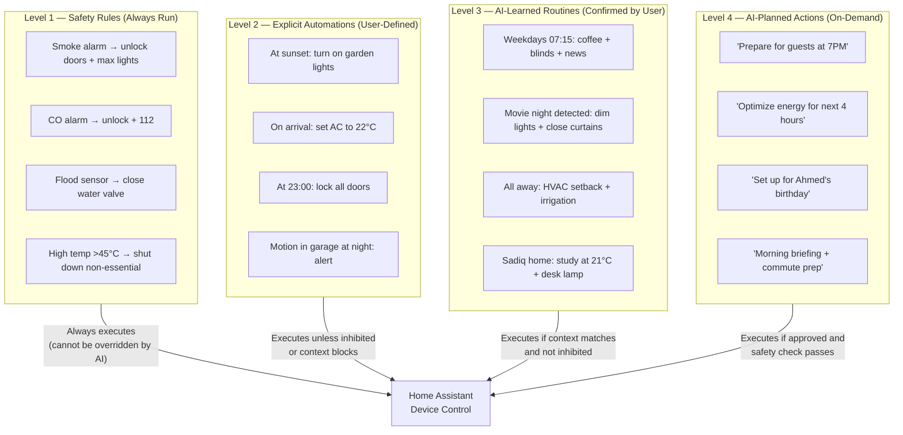
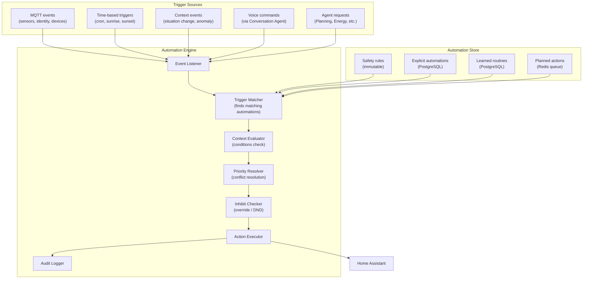

# Chapter 09 — Automation Engine

**AI Home OS Internal Design Specification**  
**Classification:** Internal — Engineering  
**Status:** Draft v1.0  
**Date:** 2026-07-17

---

## Table of Contents

1. [Overview](#1-overview)
2. [Design Philosophy](#2-design-philosophy)
3. [Automation Hierarchy](#3-automation-hierarchy)
4. [Automation Engine Architecture](#4-automation-engine-architecture)
5. [Trigger System](#5-trigger-system)
6. [Condition System](#6-condition-system)
7. [Action System](#7-action-system)
8. [Rule-Based Automations](#8-rule-based-automations)
9. [AI-Generated Automations](#9-ai-generated-automations)
10. [Scene System](#10-scene-system)
11. [Routine Engine](#11-routine-engine)
12. [Home Assistant Integration](#12-home-assistant-integration)
13. [Automation Conflict Resolution](#13-automation-conflict-resolution)
14. [Override and Inhibit System](#14-override-and-inhibit-system)
15. [Automation Testing & Dry-Run](#15-automation-testing--dry-run)
16. [Automation Lifecycle Management](#16-automation-lifecycle-management)
17. [Voice-Commanded Automation](#17-voice-commanded-automation)
18. [Automation Audit & Explainability](#18-automation-audit--explainability)
19. [Database Schema](#19-database-schema)
20. [Failure Modes & Redundancy](#20-failure-modes--redundancy)
21. [Design Decisions & Trade-offs](#21-design-decisions--trade-offs)
22. [Risks](#22-risks)
23. [Future Improvements](#23-future-improvements)
24. [References](#24-references)

---

## 1. Overview

The Automation Engine is the **execution backbone** of AI Home OS — the layer that translates decisions from the AI Reasoning Engine and rules from users into physical actions on devices.

While Home Assistant provides the low-level device control primitives (turn on light, set temperature, lock door), the AI Home OS Automation Engine sits above it, providing:

- **Hierarchy**: Four levels of automation from simple rules to AI-generated plans
- **Context-awareness**: Every automation evaluates the current context before executing
- **Conflict resolution**: When two automations want to do conflicting things, a priority system resolves the conflict
- **Overrides**: Users can always override AI decisions instantly, and the AI learns from it
- **Explainability**: The system can explain why any automation ran or did not run
- **Testing**: Automations can be dry-run before deployment

### Automation Engine vs. Home Assistant Native Automations

| Feature | HA Native | AI Home OS Automation Engine |
|---------|-----------|------------------------------|
| Context awareness | Limited (state-based) | Full (situation, activity, identity, energy) |
| AI-generated automations | No | Yes |
| Conflict resolution | No | Yes (priority system) |
| Learning from overrides | No | Yes |
| Voice-commanded automation creation | No | Yes |
| Dry-run testing | No | Yes |
| Explainability | Minimal | Full audit trail + natural language explanation |
| Routine detection | No | Yes (from memory system) |

---

## 2. Design Philosophy

### 2.1 The Four-Level Hierarchy

Not all automations are equal. AI Home OS organizes automation into four levels, each with different characteristics:

```
Level 4: AI-Planned Actions     ← Most intelligent, least predictable
Level 3: AI-Suggested Routines  ← Learned, confirmed by user
Level 2: Explicit Automations   ← User-defined rules
Level 1: Device Safety Rules    ← Hard-coded, always run
```

Higher levels are smarter but less predictable. Lower levels are simpler but always reliable. Safety rules always run regardless of what AI decides.

### 2.2 Context Is Not Optional

Every automation checks the current context before executing. A "turn on lights at sunset" rule will check:
- Is anyone home? (If no, skip)
- Is the room already lit manually? (If yes, skip)
- Is there a guest present who has privacy mode enabled? (If yes, skip)

Context prevents automations from firing in inappropriate circumstances.

### 2.3 User Is Always in Control

Every AI action can be:
- **Paused**: "JARVIS, stop automating the living room lights for tonight"
- **Overridden**: Manual device control always takes precedence
- **Reversed**: "JARVIS, undo that"
- **Explained**: "JARVIS, why did you turn the lights off?"

The system treats user manual overrides as learning signals — if the user overrides the same automation 3× in a week, the automation is flagged for review.

---

## 3. Automation Hierarchy



---

## 4. Automation Engine Architecture



---

## 5. Trigger System

### 5.1 Trigger Types

```python
class TriggerType(str, Enum):
    # Time-based
    TIME_OF_DAY     = "time_of_day"       # Fixed time (07:00)
    SUNRISE         = "sunrise"           # Sunrise ± offset
    SUNSET          = "sunset"            # Sunset ± offset
    CRON            = "cron"              # Cron expression
    INTERVAL        = "interval"          # Every N minutes

    # State-based
    DEVICE_STATE    = "device_state"      # Device changes state
    SENSOR_ABOVE    = "sensor_above"      # Sensor exceeds threshold
    SENSOR_BELOW    = "sensor_below"      # Sensor falls below threshold
    SENSOR_RATE     = "sensor_rate"       # Rate of change exceeds threshold

    # Identity / Presence
    PERSON_ARRIVES  = "person_arrives"    # Person returns home
    PERSON_LEAVES   = "person_leaves"     # Person leaves home
    PERSON_ENTERS   = "person_enters_room" # Person enters a room
    PERSON_EXITS    = "person_exits_room"  # Person leaves a room
    ALL_AWAY        = "all_away"          # All residents have left
    FIRST_HOME      = "first_home"        # First person arrives home

    # Context / Situation
    SITUATION_START = "situation_start"   # Situation detected
    SITUATION_END   = "situation_end"     # Situation ends
    HOME_MODE       = "home_mode_change"  # Home mode transitions
    ANOMALY         = "anomaly_detected"  # Anomaly event

    # External
    WEATHER_CHANGE  = "weather_change"    # Weather condition change
    SOLAR_THRESHOLD = "solar_threshold"   # Solar generation crosses threshold
    CALENDAR_EVENT  = "calendar_event"    # Calendar event approaching

    # Manual
    VOICE_COMMAND   = "voice_command"     # Explicit voice trigger
    BUTTON_PRESS    = "button_press"      # Physical button
    WEBHOOK         = "webhook"           # HTTP POST to trigger endpoint
```

### 5.2 Trigger Definition Schema

```yaml
# Example automation trigger definition (YAML format for config)

automations:
  - id: "sunset_garden_lights"
    name: "Garden Lights at Sunset"
    level: 2
    trigger:
      type: sunset
      offset_minutes: -10    # 10 minutes before sunset
    conditions:
      - type: someone_home
      - type: context_mode
        modes: ["home", "guest"]
    actions:
      - type: turn_on
        entity: light.garden_front
        brightness: 80
      - type: turn_on
        entity: light.garden_rear
        brightness: 60

  - id: "sadiq_arrival"
    name: "Sadiq Arrives Home"
    level: 3
    trigger:
      type: person_arrives
      person_id: sadiq
    conditions:
      - type: time_range
        start: "16:00"
        end: "23:00"
    actions:
      - type: scene
        scene_id: "sadiq_welcome"
      - type: tts
        text: "Welcome home, Sadiq. It's {{ now().strftime('%H:%M') }}."
        zone: entry_hall
```

### 5.3 Trigger Matching

```python
class TriggerMatcher:
    async def find_matching_automations(
        self,
        event: AutomationEvent
    ) -> List[Automation]:
        matches = []

        # Load all active automations
        automations = await db.get_active_automations()

        for auto in automations:
            if await self._trigger_matches(auto.trigger, event):
                matches.append(auto)

        # Sort by level (safety first), then priority within level
        return sorted(matches, key=lambda a: (-a.level, -a.priority))

    async def _trigger_matches(self, trigger: TriggerDef, event: AutomationEvent) -> bool:
        if trigger.type == TriggerType.TIME_OF_DAY:
            current_time = datetime.now().strftime('%H:%M')
            return current_time == trigger.time

        if trigger.type == TriggerType.PERSON_ARRIVES:
            return (
                event.type == 'person_arrives' and
                event.person_id == trigger.person_id
            )

        if trigger.type == TriggerType.SENSOR_ABOVE:
            return (
                event.type == 'sensor_update' and
                event.sensor_id == trigger.sensor_id and
                float(event.value) > trigger.threshold
            )

        if trigger.type == TriggerType.SITUATION_START:
            return (
                event.type == 'situation_change' and
                event.new_situation == trigger.situation and
                event.confidence >= trigger.min_confidence
            )

        return False
```

---

## 6. Condition System

### 6.1 Condition Types

Conditions gate automation execution — all conditions must pass for the automation to run:

```python
class ConditionType(str, Enum):
    # Time conditions
    TIME_RANGE          = "time_range"          # Current time within range
    DAY_OF_WEEK         = "day_of_week"         # Specific day(s)
    DAY_TYPE            = "day_type"            # weekday / weekend / holiday

    # Presence conditions
    SOMEONE_HOME        = "someone_home"
    PERSON_HOME         = "person_home"         # Specific person is home
    PERSON_IN_ROOM      = "person_in_room"
    ALL_AWAY            = "all_away"
    GUEST_PRESENT       = "guest_present"

    # State conditions
    DEVICE_STATE        = "device_state"        # Device in specific state
    SENSOR_RANGE        = "sensor_range"        # Sensor value in range

    # Context conditions
    HOME_MODE           = "home_mode"           # Home mode matches
    SITUATION           = "situation"           # Situation matches
    ENERGY_MODE         = "energy_mode"         # Energy mode matches

    # Environmental
    WEATHER             = "weather"             # Weather condition
    TEMPERATURE_RANGE   = "temperature_range"   # Outdoor temp range

    # Inhibit conditions
    NOT_INHIBITED       = "not_inhibited"       # No active inhibit for this automation
    NOT_RECENTLY_RUN    = "not_recently_run"    # Not run within N minutes
```

### 6.2 Condition Evaluator

```python
class ConditionEvaluator:
    def __init__(self, context: HomeContext):
        self.ctx = context

    async def evaluate_all(self, conditions: List[Condition]) -> ConditionResult:
        for condition in conditions:
            result = await self._evaluate(condition)
            if not result.passed:
                return ConditionResult(
                    passed=False,
                    failed_condition=condition,
                    reason=result.reason
                )
        return ConditionResult(passed=True)

    async def _evaluate(self, condition: Condition) -> ConditionCheck:
        if condition.type == ConditionType.SOMEONE_HOME:
            passed = self.ctx.occupancy.total_persons_home > 0
            return ConditionCheck(passed=passed, reason="No one home" if not passed else "")

        if condition.type == ConditionType.HOME_MODE:
            passed = self.ctx.home_mode in condition.allowed_modes
            return ConditionCheck(
                passed=passed,
                reason=f"Home mode '{self.ctx.home_mode}' not in {condition.allowed_modes}"
            )

        if condition.type == ConditionType.ENERGY_MODE:
            passed = self.ctx.energy.energy_mode in condition.allowed_modes
            return ConditionCheck(passed=passed)

        if condition.type == ConditionType.NOT_RECENTLY_RUN:
            last_run = await db.get_last_execution(condition.automation_id)
            if last_run:
                elapsed = (datetime.utcnow() - last_run).total_seconds() / 60
                passed = elapsed >= condition.min_gap_minutes
            else:
                passed = True
            return ConditionCheck(
                passed=passed,
                reason=f"Ran {elapsed:.0f} min ago, minimum gap is {condition.min_gap_minutes} min"
            )

        return ConditionCheck(passed=True)
```

---

## 7. Action System

### 7.1 Action Types

```python
class ActionType(str, Enum):
    # Lighting
    LIGHT_ON            = "light_on"
    LIGHT_OFF           = "light_off"
    LIGHT_BRIGHTNESS    = "light_brightness"
    LIGHT_COLOR         = "light_color"
    LIGHT_SCENE         = "light_scene"         # Kelvin color temperature

    # Climate
    SET_TEMPERATURE     = "set_temperature"
    SET_HVAC_MODE       = "set_hvac_mode"       # heat, cool, auto, off
    SET_FAN_MODE        = "set_fan_mode"
    OPEN_VENT           = "open_vent"
    CLOSE_VENT          = "close_vent"

    # Security
    LOCK_DOOR           = "lock_door"
    UNLOCK_DOOR         = "unlock_door"
    ARM_ALARM           = "arm_alarm"
    DISARM_ALARM        = "disarm_alarm"

    # Audio
    TTS_SPEAK           = "tts_speak"
    PLAY_MUSIC          = "play_music"
    STOP_MUSIC          = "stop_music"
    SET_VOLUME          = "set_volume"

    # Blinds / Covers
    BLIND_OPEN          = "blind_open"
    BLIND_CLOSE         = "blind_close"
    BLIND_POSITION      = "blind_position"      # 0–100%

    # Notifications
    PUSH_NOTIFY         = "push_notify"
    EMAIL_NOTIFY        = "email_notify"

    # Energy
    DEFER_LOAD          = "defer_load"
    START_LOAD          = "start_load"
    SET_EV_CHARGE       = "set_ev_charge"

    # Scene & Routine
    ACTIVATE_SCENE      = "activate_scene"
    RUN_SCRIPT          = "run_script"          # HA script

    # AI
    INVOKE_AGENT        = "invoke_agent"        # Ask an AI agent to do something
    DELAY               = "delay"              # Wait N seconds between actions
    CONDITION_CHECK     = "condition_check"    # Inline condition inside action sequence
```

### 7.2 Action Executor

```python
class ActionExecutor:
    def __init__(self, ha_client, tts_service, notification_service):
        self.ha = ha_client
        self.tts = tts_service
        self.notify = notification_service

    async def execute(
        self,
        actions: List[Action],
        context: HomeContext,
        automation_id: str
    ) -> ExecutionResult:
        results = []

        for action in actions:
            try:
                result = await self._execute_single(action, context)
                results.append(result)

                # Handle delay between actions
                if action.delay_after_seconds:
                    await asyncio.sleep(action.delay_after_seconds)

            except Exception as e:
                results.append(ActionResult(
                    action=action,
                    success=False,
                    error=str(e)
                ))
                if action.abort_on_failure:
                    break

        # Audit every execution
        await self._audit(automation_id, actions, results, context)

        success_count = sum(1 for r in results if r.success)
        return ExecutionResult(
            success=success_count == len(actions),
            results=results
        )

    async def _execute_single(self, action: Action, ctx: HomeContext) -> ActionResult:
        if action.type == ActionType.LIGHT_ON:
            resp = await self.ha.call_service(
                "light", "turn_on",
                entity_id=action.entity_id,
                brightness_pct=action.params.get('brightness', 100),
                kelvin=action.params.get('kelvin')
            )
            return ActionResult(success=resp.ok, action=action)

        if action.type == ActionType.TTS_SPEAK:
            # Resolve dynamic text (templates)
            text = self._render_template(action.text, ctx)
            zone = action.params.get('zone', self._infer_zone(ctx))
            await self.tts.speak(text, zone=zone)
            return ActionResult(success=True, action=action)

        if action.type == ActionType.SET_TEMPERATURE:
            resp = await self.ha.call_service(
                "climate", "set_temperature",
                entity_id=action.entity_id,
                temperature=action.params['temperature']
            )
            return ActionResult(success=resp.ok, action=action)

        if action.type == ActionType.DEFER_LOAD:
            await energy_agent.defer_load(
                device=action.entity_id,
                defer_until=action.params.get('optimal_time') or 'next_solar_surplus'
            )
            return ActionResult(success=True, action=action)

        raise ValueError(f"Unknown action type: {action.type}")
```

### 7.3 Template Rendering

Action text and values can include dynamic templates:

```yaml
# Template examples in automation actions

actions:
  - type: tts_speak
    text: "Good morning, {{ person.display_name }}. It is {{ now().strftime('%H:%M') }}.
           The temperature outside is {{ weather.temperature_c }}°C.
           You have {{ calendar.next_event_name }} at {{ calendar.next_event_time }}."

  - type: set_temperature
    entity: climate.master_bedroom
    temperature: "{{ person.preferred_sleep_temp }}"

  - type: push_notify
    title: "Energy Alert"
    body: "Battery at {{ energy.battery_pct | round }}%. 
           Estimated runtime: {{ energy.estimated_runtime_hours | round(1) }} hours."
```

---

## 8. Rule-Based Automations

### 8.1 Core Automation Library

The following automations come pre-built with AI Home OS (can be enabled/disabled per household):

**Presence & Arrival:**

| ID | Name | Trigger | Action |
|----|------|---------|--------|
| `first_arrival` | First Person Home | `first_home` | Welcome announcement + restore comfort settings |
| `last_departure` | All Away | `all_away` | Security mode + energy saving + close vents |
| `guest_arrival` | Guest Arrives | `guest_arrives` | Notify residents + guest welcome message |
| `person_enters_bedroom` | Bedroom Entry | `person_enters_room:bedroom` | Set lighting for time of day |

**Time-Based:**

| ID | Name | Trigger | Action |
|----|------|---------|--------|
| `sunrise_blinds` | Open Blinds at Sunrise | `sunrise+30min` | Open east-facing blinds if occupied |
| `sunset_lights` | Exterior Lights at Sunset | `sunset-10min` | Turn on garden and entry lights |
| `night_lock` | Nightly Door Lock | `23:00` | Lock all exterior doors + notification |
| `sleep_mode` | Sleep Mode | `all_asleep detected` | Night thermostat + arm perimeter |

**Environmental:**

| ID | Name | Trigger | Action |
|----|------|---------|--------|
| `co2_ventilation` | CO2 High Ventilation | `co2 > 1200 ppm` | Open window vent if room occupied |
| `humidity_hvac` | High Humidity HVAC | `humidity > 70%` | Run dehumidifier if energy allows |
| `freeze_protection` | Freeze Protection | `outdoor_temp < 2°C` | Set minimum indoor temp 15°C |
| `heat_alert` | Indoor Heat Alert | `indoor_temp > 30°C` | Max AC + close blinds |

**Energy:**

| ID | Name | Trigger | Action |
|----|------|---------|--------|
| `solar_abundant_loads` | Run Deferrable Loads | `solar_abundant mode` | Start washing machine / dishwasher queue |
| `battery_low_shedding` | Battery Low Load Shedding | `battery < 20%` | Reduce non-essential loads |
| `ev_solar_charge` | EV Solar Charging | `solar_abundant + EV connected` | Start EV charge at max solar rate |

### 8.2 Room-Level Lighting Automations

```python
# Auto-generated lighting automation per room (pseudo-code)

def generate_room_lighting_automation(room: str) -> List[Automation]:
    """Generate standard lighting automations for a room."""
    return [
        Automation(
            id=f"{room}_lights_on_entry",
            name=f"{room.title()} Lights on Entry",
            level=2,
            trigger=TriggerDef(type=TriggerType.PERSON_ENTERS, room=room),
            conditions=[
                Condition(type=ConditionType.TIME_RANGE, start="18:00", end="07:00"),
                Condition(type=ConditionType.SENSOR_RANGE,
                          sensor=f"{room}/lux", max_value=50)
            ],
            actions=[
                Action(type=ActionType.LIGHT_ON, entity_id=f"light.{room}",
                       params={'brightness': get_room_brightness_preset(room),
                               'kelvin': get_kelvin_for_time()})
            ]
        ),
        Automation(
            id=f"{room}_lights_off_empty",
            name=f"{room.title()} Lights Off When Empty",
            level=2,
            trigger=TriggerDef(type=TriggerType.SENSOR_ABOVE,
                               sensor_id=f"{room}/no_motion_minutes",
                               threshold=15),
            conditions=[
                Condition(type=ConditionType.DEVICE_STATE,
                          entity=f"light.{room}", state='on'),
                Condition(type=ConditionType.NOT_RECENTLY_RUN, min_gap_minutes=20)
            ],
            actions=[
                Action(type=ActionType.LIGHT_OFF, entity_id=f"light.{room}")
            ]
        )
    ]
```

---

## 9. AI-Generated Automations

### 9.1 Voice-to-Automation

Users can create automations in natural language:

```
User: "JARVIS, whenever Fatima comes home from work on weekdays,
       turn the kitchen lights to warm and start the kettle."

Planning Agent:
  → Parses intent into automation definition
  → Creates Automation:
     Trigger: person_arrives(Fatima) + weekday + time_range(14:00–20:00)
     Actions: [light_on(kitchen, warm, 70%), start(smart_kettle)]
  → Presents to user for confirmation

JARVIS: "Done — I've set it up. When Fatima arrives on weekday afternoons,
         I'll turn the kitchen lights to warm and start the kettle.
         Want me to test it now?"
```

### 9.2 Automation Generation Pipeline

```python
# Voice-to-automation pipeline (pseudo-code)

class AutomationGenerationPipeline:
    async def from_natural_language(
        self,
        text: str,
        person_id: str
    ) -> AutomationDraft:
        # Step 1: Extract automation intent via LLM
        extraction_prompt = f"""
Extract an automation definition from this natural language request.
Return as JSON with fields: trigger, conditions, actions.

Available triggers: {json.dumps(TRIGGER_TYPES)}
Available actions: {json.dumps(ACTION_TYPES)}
Known entities: {json.dumps(await ha.get_entity_list())}
Known persons: {json.dumps(await identity.get_person_names())}

Request: "{text}"

Automation JSON:"""

        raw_json = await llm.complete(extraction_prompt, model='llama3.3:70b')
        auto_def = AutomationDefinition.parse_raw(raw_json)

        # Step 2: Validate entities exist in HA
        for action in auto_def.actions:
            if action.entity_id and not await ha.entity_exists(action.entity_id):
                # Try to find closest match
                similar = await ha.find_similar_entity(action.entity_id)
                if similar:
                    action.entity_id = similar.entity_id
                else:
                    raise EntityNotFoundError(action.entity_id)

        # Step 3: Present for user confirmation
        human_description = await self._describe_automation(auto_def)
        return AutomationDraft(
            definition=auto_def,
            human_description=human_description,
            confidence=0.80,
            needs_confirmation=True
        )
```

### 9.3 Automation Suggestion (Proactive)

The AI proactively suggests automations based on observed patterns from the Memory System:

```
JARVIS (morning): "I've noticed that on weekday mornings, you usually
                   open the study window around 09:30. Would you like
                   me to automate this? I can open it automatically
                   when the outdoor temperature is above 18°C."

User: "Yes, do that."
   → Automation created, Level 3, confirmed_by_user=True
```

---

## 10. Scene System

### 10.1 What Is a Scene

A scene is a **named collection of device states** that can be activated as a single action. Scenes describe the desired end state — not the sequence of steps.

```yaml
# Scene definition example

scenes:
  movie_night:
    name: "Movie Night"
    description: "Dim, warm lighting for watching movies"
    entities:
      light.living_room:
        state: on
        brightness: 15
        kelvin: 2700      # Warm white
      light.living_room_accent:
        state: on
        brightness: 8
        kelvin: 2400
      light.kitchen:
        state: off
      cover.living_room_curtain:
        state: closed
      climate.living_room:
        temperature: 22

  morning_bright:
    name: "Morning Bright"
    description: "High, cool lighting to aid waking up"
    entities:
      light.master_bedroom:
        state: on
        brightness_pct: 80
        kelvin: 5500      # Cool daylight
      cover.master_bedroom_blind:
        position: 40      # Partial open

  sadiq_work_focus:
    name: "Sadiq Work Focus"
    description: "Study optimized for deep focus"
    entities:
      light.study:
        state: on
        brightness_pct: 90
        kelvin: 4500      # Neutral white
      light.study_accent:
        state: off
      climate.study:
        temperature: 21
      media_player.study_speaker:
        state: paused
```

### 10.2 Dynamic Scenes

Dynamic scenes are scenes where the values are computed at activation time from context:

```python
@dataclass
class DynamicScene:
    name: str

    async def compute(self, context: HomeContext) -> StaticScene:
        """Compute scene values based on current context."""
        raise NotImplementedError

class AdaptiveLightingScene(DynamicScene):
    """Lighting adapted to time of day, circadian rhythm, and person."""
    name = "adaptive_lighting"

    async def compute(self, ctx: HomeContext) -> StaticScene:
        hour = ctx.temporal.timestamp.hour

        # Circadian lighting curve
        if 6 <= hour < 9:
            kelvin, brightness = 5500, 80   # Cool, bright — wake up
        elif 9 <= hour < 17:
            kelvin, brightness = 4000, 90   # Neutral — work
        elif 17 <= hour < 20:
            kelvin, brightness = 3000, 70   # Warm — evening
        elif 20 <= hour < 23:
            kelvin, brightness = 2700, 50   # Warm, dim — relaxation
        else:
            kelvin, brightness = 2200, 20   # Very warm, dim — pre-sleep

        # Reduce brightness if anyone is sleeping in adjacent room
        if ctx.occupancy.any_asleep:
            brightness = min(brightness, 40)

        return StaticScene(
            entities={
                room_light: EntityState(brightness_pct=brightness, kelvin=kelvin)
                for room_light in ctx.spatial.active_room_lights
            }
        )
```

---

## 11. Routine Engine

### 11.1 Morning Routine Architecture

The morning routine is the most complex built-in automation — a multi-step sequence that adapts to the day type, person's schedule, and current context:

```python
# Morning routine (pseudo-code)

class MorningRoutine:
    async def execute(self, person_id: str, wake_time: datetime):
        ctx = await context_client.get_current()
        person = await identity.get_person(person_id)
        calendar = await calendar_service.get_today(person_id)

        # Step 1: Gentle wake (at -30min before wake time)
        await asyncio.sleep(until=wake_time - timedelta(minutes=30))
        await ha.call_service("light", "turn_on", entity_id=f"light.{person.bedroom}",
                              brightness_pct=5, kelvin=2200)

        # Step 2: Gradual brighten (sunrise simulation over 20 min)
        for i in range(20):
            brightness = int(5 + (i / 20) * 75)
            kelvin = int(2200 + (i / 20) * 3300)
            await ha.call_service("light", "turn_on",
                                  entity_id=f"light.{person.bedroom}",
                                  brightness_pct=brightness, kelvin=kelvin)
            await asyncio.sleep(60)

        # Step 3: Morning briefing at wake time
        await asyncio.sleep(until=wake_time)
        briefing = await self._build_morning_briefing(person_id, ctx, calendar)
        await tts_service.speak(briefing, zone=person.bedroom, rate=0.9)

        # Step 4: Coffee machine (if weekday and person has preference)
        if ctx.temporal.day_type == 'weekday' and person.preferences.get('morning_coffee'):
            await ha.call_service("switch", "turn_on",
                                  entity_id="switch.coffee_machine")

        # Step 5: Open bedroom blinds after briefing
        await asyncio.sleep(until=wake_time + timedelta(minutes=5))
        await ha.call_service("cover", "set_cover_position",
                              entity_id=f"cover.{person.bedroom}_blind",
                              position=60)

    async def _build_morning_briefing(
        self, person_id: str, ctx: HomeContext, calendar: List[CalendarEvent]
    ) -> str:
        """Build a personalized morning briefing via LLM."""
        prompt = f"""
Generate a warm, concise morning briefing for {person_id}.
Include: time greeting, weather summary, today's calendar highlights,
any important home events from last night, energy status if notable.
Keep it under 60 seconds of speaking time.

Context:
  Time: {ctx.temporal.timestamp.strftime('%H:%M')}
  Day: {ctx.temporal.day_of_week_name}, {ctx.temporal.day_type}
  Weather: {ctx.external.weather.condition}, {ctx.external.weather.temperature_c}°C
  Calendar today: {[e.title + ' at ' + e.start.strftime('%H:%M') for e in calendar[:3]]}
  Home events: {await episodic_memory.get_overnight_events(person_id)}
  Energy: Solar forecast {ctx.energy.solar_forecast_kwh:.1f} kWh, Battery {ctx.energy.battery_pct:.0f}%

Briefing:"""

        return await llm.complete(prompt, model='llama3.3:70b', temperature=0.7)
```

### 11.2 Bedtime Routine

```python
# Bedtime routine triggers

BEDTIME_TRIGGERS = [
    # Manual: "JARVIS, goodnight"
    TriggerDef(type=TriggerType.VOICE_COMMAND, phrase='goodnight'),

    # Automatic: past usual sleep time + low activity detected
    TriggerDef(type=TriggerType.SITUATION_START, situation='all_asleep'),

    # Scheduled: configured bedtime (fallback)
    TriggerDef(type=TriggerType.TIME_OF_DAY, time='23:30'),
]

BEDTIME_ACTIONS = [
    Action(type=ActionType.TTS_SPEAK,
           text="Goodnight. I've locked all doors and armed the perimeter. Sleep well."),
    Action(type=ActionType.LOCK_DOOR, entity_id='lock.front_door'),
    Action(type=ActionType.LOCK_DOOR, entity_id='lock.back_door'),
    Action(type=ActionType.LOCK_DOOR, entity_id='lock.garage'),
    Action(type=ActionType.ARM_ALARM, mode='armed_night'),
    Action(type=ActionType.LIGHT_OFF, entity_id='light.all_except_bedrooms'),
    Action(type=ActionType.SET_TEMPERATURE, entity_id='climate.master_bedroom',
           params={'temperature': 20}),  # Sleep temperature
    Action(type=ActionType.BLIND_CLOSE, entity_id='cover.master_bedroom_blind'),
]
```

---

## 12. Home Assistant Integration

### 12.1 HA as the Execution Layer

Home Assistant executes all device commands. AI Home OS never communicates directly with Zigbee, Z-Wave, or other protocol-level devices — it always goes through HA's abstraction layer:

```
AI Home OS Automation Engine
    ↓ (REST API call)
Home Assistant
    ↓ (Zigbee2MQTT / Z-Wave JS / ESPHome)
Physical Devices
```

### 12.2 HA Service Call API

```python
class HomeAssistantClient:
    def __init__(self, base_url: str, token: str):
        self.base_url = base_url
        self.headers = {
            "Authorization": f"Bearer {token}",
            "Content-Type": "application/json"
        }

    async def call_service(
        self, domain: str, service: str, **kwargs
    ) -> HAServiceResponse:
        async with httpx.AsyncClient(timeout=10) as client:
            resp = await client.post(
                f"{self.base_url}/api/services/{domain}/{service}",
                headers=self.headers,
                json=kwargs
            )
            resp.raise_for_status()
            return HAServiceResponse(ok=True, data=resp.json())

    async def get_state(self, entity_id: str) -> EntityState:
        async with httpx.AsyncClient(timeout=5) as client:
            resp = await client.get(
                f"{self.base_url}/api/states/{entity_id}",
                headers=self.headers
            )
            resp.raise_for_status()
            return EntityState(**resp.json())

    async def get_entity_list(self) -> List[str]:
        async with httpx.AsyncClient(timeout=10) as client:
            resp = await client.get(
                f"{self.base_url}/api/states",
                headers=self.headers
            )
            return [e['entity_id'] for e in resp.json()]

    async def subscribe_events(self) -> AsyncIterator[HAEvent]:
        """Subscribe to HA event stream via Server-Sent Events."""
        async with httpx.AsyncClient() as client:
            async with client.stream(
                'GET',
                f"{self.base_url}/api/stream",
                headers=self.headers
            ) as response:
                async for line in response.aiter_lines():
                    if line.startswith('data:'):
                        yield HAEvent(**json.loads(line[5:]))
```

### 12.3 HA Entity Naming Conventions

AI Home OS requires a consistent HA entity naming convention:

```
light.{room}_{fixture}          → light.living_room_main
light.{room}_{fixture}_left     → light.master_bedroom_bedside_left
climate.{room}                  → climate.study
cover.{room}_{type}             → cover.kitchen_roller_blind
switch.{device_name}            → switch.coffee_machine
lock.{location}_{door}          → lock.front_door, lock.garage_door
sensor.{room}_{measurement}     → sensor.kitchen_co2
binary_sensor.{room}_{type}     → binary_sensor.living_room_motion
media_player.{room}_{type}      → media_player.living_room_tv
```

---

## 13. Automation Conflict Resolution

### 13.1 Conflict Detection

A conflict occurs when two automations want to set the same device to different states at the same time:

```python
class ConflictDetector:
    async def find_conflicts(
        self,
        pending: List[Automation],
        context: HomeContext
    ) -> List[AutomationConflict]:
        conflicts = []
        entity_claims: Dict[str, List[Tuple[str, Any]]] = {}

        for auto in pending:
            for action in auto.actions:
                if action.entity_id:
                    claims = entity_claims.setdefault(action.entity_id, [])
                    claims.append((auto.id, action.desired_state))

        for entity_id, claims in entity_claims.items():
            if len(claims) > 1:
                unique_states = set(str(c[1]) for c in claims)
                if len(unique_states) > 1:
                    conflicts.append(AutomationConflict(
                        entity_id=entity_id,
                        competing_automations=claims,
                        conflict_type='state_conflict'
                    ))

        return conflicts
```

### 13.2 Conflict Resolution Strategy

```python
class ConflictResolver:
    # Priority order (highest wins)
    PRIORITY_ORDER = [
        'safety',       # Level 1 — always wins
        'security',     # Security agent decisions
        'user_manual',  # User just manually set this
        'energy',       # Energy constraint decisions
        'user_voice',   # User just asked via voice
        'scheduled',    # Time-based automations
        'learned',      # AI-learned routines
        'suggested',    # AI suggestions
    ]

    def resolve(
        self,
        conflict: AutomationConflict,
        context: HomeContext
    ) -> ResolvedAction:
        # Sort competing automations by priority
        sorted_autos = sorted(
            conflict.competing_automations,
            key=lambda a: self._get_priority(a[0]),
            reverse=True  # Highest priority first
        )

        winner = sorted_autos[0]
        losers = sorted_autos[1:]

        # Log the conflict and resolution for explainability
        audit_log.record(
            event_type='conflict_resolved',
            entity_id=conflict.entity_id,
            winner=winner[0],
            losers=[l[0] for l in losers],
            reason=self._explain_resolution(winner, losers)
        )

        return ResolvedAction(
            automation_id=winner[0],
            desired_state=winner[1]
        )
```

---

## 14. Override and Inhibit System

### 14.1 Manual Override

When a user manually controls a device (via physical switch, wall panel, or voice), the Automation Engine respects this:

```python
class OverrideManager:
    OVERRIDE_DURATION_MINUTES = {
        'voice_command': 120,   # Voice override lasts 2 hours
        'physical_switch': 60,  # Physical switch override: 1 hour
        'wall_panel': 120,
        'mobile_app': 180,
    }

    async def register_override(
        self,
        entity_id: str,
        source: str,           # 'voice', 'physical', 'wall_panel', 'app'
        person_id: Optional[str]
    ):
        duration = self.OVERRIDE_DURATION_MINUTES.get(source, 60)
        await redis.setex(
            f"homeios:override:{entity_id}",
            duration * 60,
            json.dumps({
                "source": source,
                "person_id": person_id,
                "overridden_at": datetime.utcnow().isoformat()
            })
        )

    async def is_overridden(self, entity_id: str) -> bool:
        return await redis.exists(f"homeios:override:{entity_id}")
```

### 14.2 Automation Inhibit

Users can pause automations at different scopes:

```
Voice commands:
"JARVIS, stop automating the living room lights for tonight"
  → Inhibit all light automations in living_room for 8 hours

"JARVIS, pause all automations for 2 hours"
  → Global inhibit for 2 hours (except safety rules)

"JARVIS, stop the evening routine"
  → Inhibit specific automation by name

"JARVIS, do not adjust the temperature while I'm home today"
  → Inhibit all climate automations today
```

```python
@dataclass
class InhibitRule:
    scope: str              # 'entity', 'room', 'automation', 'global', 'category'
    scope_id: str           # entity_id / room / automation_id / 'all' / category name
    until: datetime
    reason: str
    created_by: str         # person_id or 'system'
    allow_safety: bool = True   # Safety rules always pass through
```

---

## 15. Automation Testing & Dry-Run

### 15.1 Dry-Run Mode

Before activating a new automation (especially AI-generated ones), it can be tested without executing device actions:

```python
async def dry_run(automation: Automation, context: HomeContext) -> DryRunResult:
    """
    Simulate automation execution without performing real actions.
    Returns a description of what would happen.
    """
    results = []

    # Evaluate triggers (pretend they fired)
    trigger_result = TriggerResult(fired=True, simulated=True)

    # Evaluate conditions against current context
    condition_result = await condition_evaluator.evaluate_all(
        automation.conditions, context
    )

    if not condition_result.passed:
        return DryRunResult(
            would_run=False,
            blocked_by=condition_result.failed_condition,
            reason=condition_result.reason
        )

    # Simulate actions
    for action in automation.actions:
        results.append(DryRunAction(
            action_type=action.type,
            entity_id=action.entity_id,
            would_do=f"Turn on {action.entity_id} at {action.params.get('brightness', 100)}%",
            current_state=await ha.get_state(action.entity_id)
        ))

    return DryRunResult(
        would_run=True,
        simulated_actions=results,
        estimated_duration_seconds=sum(a.delay_after_seconds or 0 for a in automation.actions)
    )
```

---

## 16. Automation Lifecycle Management

### 16.1 Automation States

```
draft → active → paused → archived
  ↓              ↓
  active       active  (resume from pause)
```

| State | Description |
|-------|-------------|
| `draft` | Created but not yet confirmed by user |
| `active` | Running — will execute when triggered |
| `paused` | Temporarily disabled (user request or inhibit) |
| `archived` | Permanently disabled but kept for history |

### 16.2 Automation Health Monitoring

Automations are monitored for health indicators:

```python
class AutomationHealthMonitor:
    async def check_health(self, automation: Automation) -> AutomationHealth:
        # Get execution history
        history = await db.get_executions(automation.id, days=30)

        if not history:
            # Never ran — check if trigger would ever fire
            return AutomationHealth(
                status='never_ran',
                recommendation='Check trigger conditions'
            )

        # Check success rate
        success_rate = sum(1 for e in history if e.success) / len(history)

        # Check override rate — if users frequently override, something is wrong
        overrides = await db.get_overrides_for_automation(automation.id, days=30)
        override_rate = len(overrides) / max(len(history), 1)

        if override_rate > 0.4:
            return AutomationHealth(
                status='frequently_overridden',
                override_rate=override_rate,
                recommendation='Review automation conditions — users often override this'
            )

        if success_rate < 0.8:
            return AutomationHealth(
                status='unreliable',
                success_rate=success_rate,
                recommendation='Check entity availability and HA connection'
            )

        return AutomationHealth(
            status='healthy',
            success_rate=success_rate,
            override_rate=override_rate
        )
```

---

## 17. Voice-Commanded Automation

### 17.1 Instant Automation Commands

Users can trigger any automation by voice:

```
"JARVIS, run the movie night scene"
"JARVIS, start the morning routine"
"JARVIS, activate guest mode"
"JARVIS, run the energy saving mode"
```

### 17.2 One-Time Instructions

For one-off instructions (not stored as automations):

```
"JARVIS, in 30 minutes, remind me to call Khalid"
  → Scheduler creates a one-time reminder event

"JARVIS, turn off all lights at midnight tonight"
  → One-time scheduled action (not stored as automation)

"JARVIS, if it rains today, close the upstairs windows"
  → One-time conditional action stored in working memory
```

```python
# One-time instruction handler (pseudo-code)

class OneTimeInstructionEngine:
    async def handle(self, instruction: str, context: HomeContext) -> OneTimeAction:
        # Extract via LLM
        parsed = await llm.complete(f"""
Parse this one-time instruction into trigger + action.
Return JSON: {{"trigger": {{}}, "action": {{}}, "expires_at": "ISO datetime or null"}}

Instruction: "{instruction}"
Current time: {context.temporal.timestamp.isoformat()}
""")
        one_time = OneTimeAction(**json.loads(parsed))

        # Store in Redis with TTL
        await redis.setex(
            f"homeios:one_time:{uuid4()}",
            int((one_time.expires_at - datetime.utcnow()).total_seconds()),
            one_time.json()
        )
        return one_time
```

---

## 18. Automation Audit & Explainability

### 18.1 Audit Log

Every automation execution is logged:

```sql
CREATE TABLE automation_executions (
    id              UUID PRIMARY KEY DEFAULT gen_random_uuid(),
    automation_id   UUID,
    automation_name VARCHAR(200),
    automation_level INT,
    triggered_at    TIMESTAMPTZ DEFAULT now(),
    trigger_type    VARCHAR(50),
    trigger_data    JSONB,
    conditions_evaluated JSONB,     -- Which conditions were checked
    context_snapshot    JSONB,      -- Context at time of execution (subset)
    actions_executed    JSONB,      -- What actions ran
    success         BOOLEAN,
    error           TEXT,
    duration_ms     INT,
    overridden_by   UUID,           -- person_id if user overrode
    override_at     TIMESTAMPTZ
);
```

### 18.2 Explainability Queries

```
User: "JARVIS, why did you turn off the kitchen lights?"

JARVIS retrieves:
  Last execution for: light.kitchen_off
  Automation: "Lights Off When Empty"
  Triggered: sensor.kitchen_no_motion_minutes = 20
  Conditions: light.kitchen = on ✓, time = 19:45 ✓
  Context: No one in kitchen for 20 minutes; Fatima in living room

JARVIS responds:
  "I turned off the kitchen lights because no one had been in there for
   20 minutes. Fatima is in the living room, so I assumed the kitchen
   was done for now. Want me to turn them back on?"
```

```python
async def explain_last_action(entity_id: str) -> str:
    last_exec = await db.get_last_execution_for_entity(entity_id)
    if not last_exec:
        return "I don't have a record of changing that recently."

    explanation_prompt = f"""
Explain in one or two plain-English sentences why this automation ran.
Be specific about what triggered it and what conditions were met.

Automation: {last_exec.automation_name}
Triggered by: {last_exec.trigger_data}
Conditions that passed: {last_exec.conditions_evaluated}
Context at time: {last_exec.context_snapshot}

Explanation:"""

    return await llm.complete(explanation_prompt)
```

---

## 19. Database Schema

```sql
-- Automations store
CREATE TABLE automations (
    id              UUID PRIMARY KEY DEFAULT gen_random_uuid(),
    name            VARCHAR(200) NOT NULL,
    description     TEXT,
    level           INT NOT NULL DEFAULT 2,     -- 1=safety, 2=explicit, 3=learned, 4=planned
    priority        INT DEFAULT 50,             -- Within level (0-100)
    trigger_config  JSONB NOT NULL,
    conditions      JSONB DEFAULT '[]',
    actions         JSONB NOT NULL,
    origin          VARCHAR(30) DEFAULT 'user_defined',  -- 'user_defined', 'ai_generated', 'default'
    confirmed_by    UUID REFERENCES persons(id),
    state           VARCHAR(20) DEFAULT 'active',   -- 'draft', 'active', 'paused', 'archived'
    execution_count INT DEFAULT 0,
    success_count   INT DEFAULT 0,
    last_executed   TIMESTAMPTZ,
    created_at      TIMESTAMPTZ DEFAULT now(),
    updated_at      TIMESTAMPTZ DEFAULT now()
);

-- Scenes store
CREATE TABLE scenes (
    id              UUID PRIMARY KEY DEFAULT gen_random_uuid(),
    name            VARCHAR(100) NOT NULL UNIQUE,
    description     TEXT,
    entity_states   JSONB NOT NULL,     -- {entity_id: {state, attributes}}
    is_dynamic      BOOLEAN DEFAULT FALSE,
    created_at      TIMESTAMPTZ DEFAULT now()
);

-- Inhibit rules
CREATE TABLE inhibit_rules (
    id              UUID PRIMARY KEY DEFAULT gen_random_uuid(),
    scope           VARCHAR(30) NOT NULL,
    scope_id        TEXT NOT NULL,
    until           TIMESTAMPTZ NOT NULL,
    reason          TEXT,
    created_by      UUID REFERENCES persons(id),
    allow_safety    BOOLEAN DEFAULT TRUE,
    created_at      TIMESTAMPTZ DEFAULT now()
);
```

---

## 20. Failure Modes & Redundancy

| Failure | Impact | Detection | Recovery |
|---------|--------|-----------|---------|
| Automation Engine crash | No automations run | Docker health check | Restart; HA safety rules still execute independently |
| HA unavailable | Actions not executed | HTTP timeout | Queue actions; retry with exponential backoff; alert |
| Trigger missed (MQTT disconnect) | Automation doesn't fire | MQTT Last Will; reconnect handler | Reconnect + replay recent MQTT events from buffer |
| Condition evaluator crash | All automations blocked | Health check | Restart; default to pass all conditions for safety-level automations |
| Conflict resolver deadlock | Actions not executed | Timeout detector | Default to safety priority; log deadlock for investigation |

### 20.1 Home Assistant Offline Fallback

When HA is temporarily unavailable, the Automation Engine queues non-critical actions and retries:

```python
class ActionQueue:
    MAX_RETRY = 3
    RETRY_DELAY_SECONDS = 30

    async def enqueue_with_retry(self, action: Action):
        for attempt in range(self.MAX_RETRY):
            try:
                await self.executor.execute_single(action)
                return
            except HAConnectionError:
                if attempt < self.MAX_RETRY - 1:
                    await asyncio.sleep(self.RETRY_DELAY_SECONDS * (2 ** attempt))
                else:
                    await audit_log.record_failure(action, "HA unavailable after retries")
```

---

## 21. Design Decisions & Trade-offs

### 21.1 HA Integration vs. Direct Device Control

| Approach | Pros | Cons |
|----------|------|------|
| **HA as execution layer (this design)** | Vast device compatibility; battle-tested; easy UI | Additional latency (~100ms); HA dependency |
| Direct protocol control (Zigbee2MQTT, Z-Wave JS) | Lower latency; fewer dependencies | Need to implement all protocol handlers |

**Decision:** HA as execution layer. The latency overhead (< 200ms for non-time-critical automations) is acceptable, and the vast HA integration library is a major advantage. Critical safety rules (smoke, CO, flood) also have direct ESPHome fallback.

### 21.2 YAML Config vs. Database for Automations

| Approach | Pros | Cons |
|----------|------|------|
| YAML config files | Version-controlled; human readable | Cannot be modified by AI at runtime |
| **Database + dynamic (this design)** | AI can create/modify automations; user-friendly | Harder to version control |
| Hybrid | Both | Complexity |

**Decision:** Database-primary with YAML import/export. The AI needs to create automations at runtime from voice commands. YAML export is provided for backup and version control.

---

## 22. Risks

| Risk | Probability | Impact | Mitigation |
|------|-------------|--------|------------|
| AI-generated automation does unexpected thing | Medium | Medium | Mandatory dry-run + user confirmation; 30-day grace period with easy delete |
| Automation loop (triggers itself) | Low | High | Loop detection: if same automation fires > 3× in 60s, auto-disable and alert |
| Conflict resolution picks wrong winner | Low | Medium | Override priority; user can always force any automation; audit log |
| HA unavailable → critical automations miss | Low | High | Safety-level rules have ESPHome direct fallback; health monitoring + alerting |
| User says "undo" and cannot revert multi-step plan | Medium | Low | Undo stack: store device states before execution; revert available for 5 minutes |

---

## 23. Future Improvements

| Improvement | Version | Description |
|-------------|---------|-------------|
| Automation marketplace | v2 | Community-shared automation templates with one-click install |
| Simulation environment | v2 | Run automations in a simulated home (digital twin) before live deployment |
| A/B testing for automations | v3 | Test two automation variants and measure which users prefer |
| Natural language automation export | v2 | Export any automation as a plain English description |
| Cross-property automation sync | v3 | Sync automations across multiple AI Home OS installations |
| Automation versioning (git-like) | v2 | Full version history for every automation with rollback |

---

## 24. References

1. **Home Assistant Automation Docs** — https://www.home-assistant.io/docs/automation/
2. **Home Assistant REST API** — https://developers.home-assistant.io/docs/api/rest
3. **Zigbee2MQTT** — https://www.zigbee2mqtt.io/
4. **Z-Wave JS** — https://zwave-js.github.io/
5. **ESPHome** — https://esphome.io/
6. **ReAct (Reasoning + Acting)** — Yao et al., 2022 — https://arxiv.org/abs/2210.03629
7. **Home Automation Design Patterns** — Domotica Labs, 2021
8. **Jinja2 Templating (used in HA and AI Home OS)** — https://jinja.palletsprojects.com/
9. **httpx (async HTTP client)** — https://www.python-httpx.org/
10. **AsyncIO (Python concurrency)** — https://docs.python.org/3/library/asyncio.html

---

*Previous: [Chapter 08 — Context Engine](Chapter-08-Context-Engine.md)*  
*Next: [Chapter 10 — Energy Intelligence](Chapter-10-Energy-Intelligence.md)*

---

> **Document maintained by:** AI Home OS Architecture Team  
> **Last updated:** 2026-07-17  
> **Chapter status:** Draft v1.0 — Open for community review
