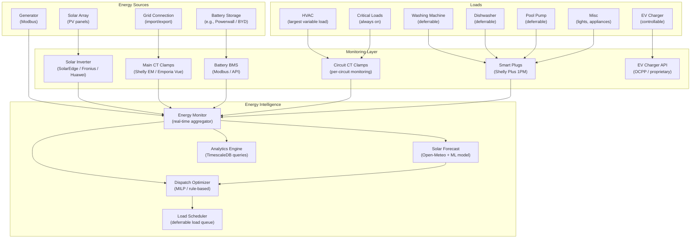

# Chapter 10 — Energy Intelligence

**AI Home OS Internal Design Specification**  
**Classification:** Internal — Engineering  
**Status:** Draft v1.0  
**Date:** 2026-07-17

---

## Table of Contents

1. [Overview](#1-overview)
2. [Design Philosophy](#2-design-philosophy)
3. [Energy System Architecture](#3-energy-system-architecture)
4. [Solar Generation](#4-solar-generation)
5. [Battery Storage](#5-battery-storage)
6. [Grid Integration & Tariffs](#6-grid-integration--tariffs)
7. [Generator Integration](#7-generator-integration)
8. [EV Charging Intelligence](#8-ev-charging-intelligence)
9. [Load Monitoring & Classification](#9-load-monitoring--classification)
10. [Energy Forecasting](#10-energy-forecasting)
11. [Optimization Engine](#11-optimization-engine)
12. [Demand Response](#12-demand-response)
13. [Energy Reporting & Analytics](#13-energy-reporting--analytics)
14. [Energy Alerts & Anomalies](#14-energy-alerts--anomalies)
15. [Virtual Power Plant (VPP) Ready](#15-virtual-power-plant-vpp-ready)
16. [Energy Database Schema](#16-energy-database-schema)
17. [Hardware BOM — Energy Monitoring](#17-hardware-bom--energy-monitoring)
18. [Failure Modes & Redundancy](#18-failure-modes--redundancy)
19. [Design Decisions & Trade-offs](#19-design-decisions--trade-offs)
20. [Risks](#20-risks)
21. [Future Improvements](#21-future-improvements)
22. [References](#22-references)

---

## 1. Overview

Energy intelligence is one of the highest-value capabilities of AI Home OS. A well-optimized home energy system — solar generation, battery storage, smart load scheduling, EV charging, and grid arbitrage — can reduce electricity bills by 60–85% and achieve grid independence for 8–10 months per year in many climates.

The AI Home OS Energy Intelligence system goes far beyond simple solar monitoring. It is a **real-time energy optimizer** that:

- Monitors every watt entering and leaving the home
- Forecasts solar generation 24–48 hours ahead
- Schedules deferrable loads (washing machine, dishwasher, EV charger, pool pump) to consume solar surplus
- Manages battery state of charge to maximize self-consumption and grid arbitrage
- Protects critical loads during outages
- Provides actionable energy reports with natural language summaries
- Integrates with utility demand response programs
- Learns household consumption patterns to improve forecasts over time

### Energy System Capabilities Summary

| Capability | Description |
|-----------|-------------|
| **Real-time monitoring** | Whole-home + per-circuit power measurement |
| **Solar forecasting** | 24-hour ahead forecast using weather + ML |
| **Battery dispatch** | Optimal charge/discharge scheduling |
| **Load scheduling** | Defer deferrable loads to solar surplus periods |
| **EV smart charging** | Solar-matched, tariff-aware EV charging |
| **Grid arbitrage** | Buy cheap, sell expensive (where permitted) |
| **Outage resilience** | Automatic islanding + critical load prioritization |
| **Energy reports** | Daily, weekly, monthly summaries with AI narrative |
| **Anomaly detection** | Detect energy theft, device faults, unusual consumption |

---

## 2. Design Philosophy

### 2.1 Every Watt Matters

The system tracks energy at three levels:
- **Whole-home level**: Total import/export via main meter CT clamps
- **Circuit level**: Per-circuit monitoring (major appliances, EV charger, HVAC, lighting)
- **Device level**: Per-device smart plugs for smaller devices

This granularity enables the AI to identify exactly which device caused a spike, calculate per-device cost, and make precise load scheduling decisions.

### 2.2 Solar First, Grid Last

The dispatch priority is always:
```
1. Solar generation (free, green)
2. Battery discharge (stored solar)
3. Grid import (paid, last resort)
```

The optimizer arranges loads, battery state of charge, and EV charging around this hierarchy.

### 2.3 Comfort Is Never Sacrificed

Energy optimization never compromises occupant comfort without explicit permission. The AI will:
- Defer a washing machine cycle, not cancel it
- Pre-cool the house during solar surplus rather than turning off the A/C at a critical moment
- Ask the user before deferring a load that was manually started

### 2.4 The AI Explains Every Energy Decision

Energy is money. The AI always explains why it made an energy decision:
- "I started the washing machine now because we have 2.8 kW of solar surplus and the battery is full."
- "I've reduced the A/C setpoint by 1°C — the battery is at 18% and there's no more solar today."

---

## 3. Energy System Architecture



---

## 4. Solar Generation

### 4.1 Inverter Integration

AI Home OS integrates with all major solar inverter brands:

| Inverter Brand | Protocol | Integration Method |
|---------------|---------|-------------------|
| **SolarEdge** | Modbus TCP / REST API | HA integration + direct Modbus |
| **Fronius** | REST API (Fronius Solar API v1) | HA Fronius integration |
| **Huawei SUN2000** | Modbus TCP | homeassistant-huawei-solar |
| **Enphase IQ** | Envoy local API | HA Enphase integration |
| **Solis** | Modbus RS485 → TCP | Solis integration |
| **Victron** | Modbus TCP / VE.Direct | HA Victron integration |
| **SMA** | Modbus / Speedwire | HA SMA integration |
| **Growatt** | Modbus / cloud API | HA Growatt integration |

### 4.2 Solar Monitoring Data Points

```python
@dataclass
class SolarData:
    timestamp: datetime

    # Generation
    pv_power_w: float           # Current generation (W)
    pv_energy_today_kwh: float  # Energy generated today (kWh)
    pv_energy_total_kwh: float  # Lifetime generation (kWh)

    # Inverter status
    inverter_status: str        # 'generating', 'idle', 'fault', 'updating'
    inverter_temp_c: float      # Inverter temperature
    dc_voltage_v: float         # PV string voltage
    dc_current_a: float         # PV string current

    # String-level data (if available)
    string_data: Optional[List[PVString]]  # Per-string power for MPPT tracking

    # Performance
    specific_yield: float       # Wh/Wp — normalized generation
    performance_ratio: float    # Actual/expected generation (0–1)
```

### 4.3 Solar Modbus Register Map (SolarEdge Example)

```python
# SolarEdge Modbus register map (key registers)
SOLAREDGE_REGISTERS = {
    # SunSpec common block
    'ac_power':             (40083, 'int16'),   # W — current AC output
    'ac_energy_total':      (40093, 'uint32'),  # Wh — lifetime generation
    'dc_power':             (40101, 'int16'),   # W — DC input from PV
    'inverter_status':      (40107, 'uint16'),  # Status code
    'inverter_temp':        (40103, 'int16'),   # °C × 100

    # Battery registers (StorEdge)
    'battery_soc':          (62852, 'uint16'),  # % × 100
    'battery_power':        (62836, 'int16'),   # W (+ charge, - discharge)
    'battery_status':       (62854, 'uint16'),  # Status code
}

async def read_solaredge(host: str, unit_id: int = 1) -> SolarData:
    from pymodbus.client import AsyncModbusTcpClient
    async with AsyncModbusTcpClient(host, port=1502) as client:
        result = await client.read_holding_registers(40083, count=30, slave=unit_id)
        return SolarData(
            pv_power_w=result.registers[0] * 0.001,  # Scale factor from register
            ac_energy_total_kwh=result.registers[10] / 1000.0,
            # ... parse remaining registers
        )
```

### 4.4 PV Array Configuration

```yaml
# Solar system configuration
energy:
  solar:
    system_size_kw: 10.0        # Total installed capacity
    panel_count: 25
    panel_watt_peak: 400        # Wp per panel
    inverter_brand: solaredge
    inverter_model: "SE10K"
    inverter_host: "192.168.20.50"
    tilt_degrees: 25
    azimuth_degrees: 180        # 180 = south-facing
    location:
      latitude: 25.2048
      longitude: 55.2708        # Dubai example
    shading_factor: 0.95        # 5% shading losses

    # String configuration (for MPPT performance monitoring)
    strings:
      - name: "South roof"
        panels: 15
        orientation: 180
        tilt: 25
      - name: "East roof"
        panels: 10
        orientation: 90
        tilt: 20
```

### 4.5 Generation Performance Monitoring

```python
class SolarPerformanceMonitor:
    def compute_performance_ratio(
        self,
        actual_kwh: float,
        system_kw: float,
        peak_sun_hours: float,
        weather_correction: float = 1.0
    ) -> float:
        """
        Performance Ratio (PR) = Actual / Expected generation.
        PR < 0.70 indicates a significant issue (fault, soiling, shading).
        """
        expected_kwh = system_kw * peak_sun_hours * weather_correction
        return actual_kwh / expected_kwh if expected_kwh > 0 else 0.0

    async def detect_underperformance(self, system_id: str) -> Optional[Alert]:
        today = await self._get_today_performance(system_id)
        if today.performance_ratio < 0.70 and today.peak_sun_hours > 4:
            return Alert(
                type='solar_underperformance',
                message=f"Solar generation is {today.performance_ratio:.0%} of expected. "
                        f"Possible causes: soiling, shading, inverter fault.",
                severity='medium',
                action='check_panel_cleanliness'
            )
        return None
```

---

## 5. Battery Storage

### 5.1 Supported Battery Systems

| System | Chemistry | Capacity | Protocol | Integration |
|--------|-----------|---------|----------|-------------|
| **Tesla Powerwall 3** | LFP | 13.5 kWh | Local API | HA Powerwall |
| **BYD Battery-Box HV** | LFP | 5.1–25.6 kWh | Modbus | HA BYD |
| **SENEC Home V3** | LFP | 5.0–20.0 kWh | Local REST | HA SENEC |
| **Victron MultiPlus-II** | Any (external) | Configurable | VE.Bus + Modbus | HA Victron |
| **SolarEdge Home Battery** | LFP | 9.7 kWh | Modbus | SolarEdge integration |
| **Alpha ESS** | LFP | 5.7–22.8 kWh | Modbus TCP | HA Alpha ESS |
| **Fronius GEN24 + BYD** | LFP | 5.1 kWh+ | REST API | HA Fronius |

### 5.2 Battery Monitoring Data Points

```python
@dataclass
class BatteryData:
    timestamp: datetime

    # State
    soc_pct: float              # State of charge (%)
    soe_kwh: float              # State of energy (kWh remaining)
    capacity_kwh: float         # Usable capacity (kWh)

    # Power flow
    power_w: float              # + charging, - discharging
    charge_power_limit_w: float
    discharge_power_limit_w: float

    # Health
    state_of_health_pct: float  # Battery health (100% = new)
    cycle_count: int
    max_cell_temp_c: float
    min_cell_voltage_v: float
    max_cell_voltage_v: float
    cell_voltage_delta_mv: float  # Max - min (> 50mV indicates imbalance)

    # Status
    status: str                 # 'charging', 'discharging', 'idle', 'fault'
    fault_code: Optional[int]
```

### 5.3 Battery Dispatch Strategy

The battery dispatch strategy determines when to charge and discharge:

```python
class BatteryDispatchStrategy:
    """
    Priority-ordered dispatch rules evaluated every 5 minutes.
    First matching rule is applied.
    """

    async def compute_setpoint(
        self,
        battery: BatteryData,
        solar: SolarData,
        grid: GridData,
        forecast: SolarForecast,
        tariff: TariffData,
        loads: List[LoadData]
    ) -> BatterySetpoint:

        # 1. Emergency: Critical fault — go to safe state
        if battery.fault_code:
            return BatterySetpoint(mode='safe', power_w=0)

        # 2. Grid outage — island mode, protect critical loads
        if grid.is_outage:
            critical_load_w = sum(l.power_w for l in loads if l.is_critical)
            available_solar = solar.pv_power_w
            if available_solar >= critical_load_w:
                return BatterySetpoint(mode='charge', power_w=min(
                    available_solar - critical_load_w,
                    battery.charge_power_limit_w
                ))
            else:
                shortfall = critical_load_w - available_solar
                return BatterySetpoint(mode='discharge', power_w=min(
                    shortfall, battery.discharge_power_limit_w
                ))

        # 3. Battery critically low — stop discharging regardless
        if battery.soc_pct <= 10:
            return BatterySetpoint(mode='charge', power_w=battery.charge_power_limit_w)

        # 4. Solar surplus + battery not full → charge
        net_solar = solar.pv_power_w - sum(l.power_w for l in loads)
        if net_solar > 200 and battery.soc_pct < 95:
            charge_power = min(net_solar, battery.charge_power_limit_w)
            return BatterySetpoint(mode='charge', power_w=charge_power)

        # 5. Peak tariff + battery above reserve → discharge to avoid import
        if tariff.is_peak and battery.soc_pct > tariff.reserve_at_peak:
            import_w = max(0, sum(l.power_w for l in loads) - solar.pv_power_w)
            discharge_power = min(import_w, battery.discharge_power_limit_w)
            return BatterySetpoint(mode='discharge', power_w=discharge_power)

        # 6. Off-peak tariff + battery below target → charge from grid (grid arbitrage)
        if (not tariff.is_peak and
            tariff.buy_price < tariff.sell_price * 0.8 and
            battery.soc_pct < 80):
            return BatterySetpoint(mode='charge', power_w=battery.charge_power_limit_w)

        # 7. Default: idle / self-consumption mode
        return BatterySetpoint(mode='self_consumption', power_w=0)
```

### 5.4 Battery Reserve Configuration

```yaml
energy:
  battery:
    min_reserve_pct: 10         # Never discharge below 10%
    peak_tariff_reserve_pct: 30 # Keep 30% for peak hours
    outage_reserve_pct: 50      # Keep 50% for grid outage events
    vacation_reserve_pct: 80    # Keep 80% when all away on vacation
    storm_reserve_pct: 90       # Keep 90% when storm forecast
```

---

## 6. Grid Integration & Tariffs

### 6.1 Tariff Models

The Energy Intelligence system supports all common electricity tariff structures:

| Tariff Type | Description | Strategy |
|------------|-------------|---------|
| **Flat rate** | Single price per kWh, all times | Maximize self-consumption |
| **Time-of-Use (ToU)** | Different rates by time period | Discharge during peak; charge during off-peak |
| **Dynamic pricing** | Hourly prices (Agile, Amber, Tibber) | Optimize against hourly forecast |
| **Feed-in tariff (FiT)** | Price received for grid export | Maximize export during high-price periods |
| **Net metering** | Export credited 1:1 against import | Maximize total self-consumption |
| **Demand charge** | Peak demand charge (commercial) | Limit peak demand |

### 6.2 Tariff Configuration

```yaml
energy:
  tariff:
    currency: AED               # Local currency code
    provider: "DEWA"            # Utility provider name

    # Time-of-Use periods
    peak_periods:
      - days: [0, 1, 2, 3, 4]  # Mon–Fri
        start: "12:00"
        end: "17:00"
        buy_rate: 0.38          # AED/kWh
        sell_rate: 0.20         # AED/kWh (feed-in)

    off_peak_periods:
      - days: [0, 1, 2, 3, 4]
        start: "22:00"
        end: "07:00"
        buy_rate: 0.18
        sell_rate: 0.10

      - days: [5, 6]            # Sat–Sun (all day off-peak)
        start: "00:00"
        end: "23:59"
        buy_rate: 0.18
        sell_rate: 0.10

    shoulder_periods:
      - days: [0, 1, 2, 3, 4]
        start: "07:00"
        end: "12:00"
        buy_rate: 0.26
        sell_rate: 0.15
```

### 6.3 Dynamic Pricing Integration

For utilities offering real-time pricing (Octopus Agile, Tibber, Amber Electric):

```python
class DynamicTariffClient:
    """Fetch hourly electricity prices and integrate into dispatch optimization."""

    async def get_tibber_prices(self, api_key: str) -> List[HourlyPrice]:
        query = """
        {
          viewer {
            homes {
              currentSubscription {
                priceInfo {
                  today { total startsAt }
                  tomorrow { total startsAt }
                }
              }
            }
          }
        }
        """
        async with httpx.AsyncClient() as client:
            resp = await client.post(
                "https://api.tibber.com/v1-beta/gql",
                headers={"Authorization": f"Bearer {api_key}"},
                json={"query": query}
            )
        data = resp.json()['data']['viewer']['homes'][0]
        prices = data['currentSubscription']['priceInfo']
        return [
            HourlyPrice(
                starts_at=p['startsAt'],
                price=p['total']
            )
            for p in prices['today'] + prices['tomorrow']
        ]

    async def find_cheapest_hours(
        self,
        prices: List[HourlyPrice],
        duration_hours: int
    ) -> List[datetime]:
        """Find the N cheapest consecutive hours for load scheduling."""
        sorted_prices = sorted(prices, key=lambda p: p.price)
        return [p.starts_at for p in sorted_prices[:duration_hours]]
```

### 6.4 Grid Metering

```python
@dataclass
class GridData:
    timestamp: datetime

    # Power flow (+ = importing, - = exporting)
    power_w: float
    reactive_power_var: float
    power_factor: float

    # Voltage and frequency
    voltage_v: float
    frequency_hz: float
    is_outage: bool

    # Tariff state
    current_tariff_period: str  # 'peak', 'off_peak', 'shoulder'
    current_buy_rate: float     # AED/kWh
    current_sell_rate: float    # AED/kWh

    # Daily totals
    import_today_kwh: float
    export_today_kwh: float
    import_cost_today: float    # In local currency
    export_revenue_today: float
```

---

## 7. Generator Integration

### 7.1 Automatic Transfer Switch (ATS) Architecture

```
┌─────────────────────────────────────────────────────────┐
│                    ATS Panel                             │
│                                                          │
│    Grid ──────────►  ATS Controller  ◄────── Generator  │
│                              │                           │
│                              ▼                           │
│                    Home Distribution Panel               │
│                    (all loads)                           │
│                                                          │
│    AI Home OS monitors:                                  │
│      - Grid voltage (via CT / smart meter)               │
│      - Generator running state (dry contact → ESP32)     │
│      - Generator fuel level (analog sensor)              │
│      - ATS position (dry contact → ESP32)                │
└─────────────────────────────────────────────────────────┘
```

### 7.2 Generator Monitoring

```python
@dataclass
class GeneratorData:
    timestamp: datetime

    # Status
    running: bool
    ats_position: str           # 'grid', 'generator', 'transferring'
    fuel_level_pct: Optional[float]
    fuel_remaining_hours: Optional[float]

    # Output (when running)
    power_w: Optional[float]
    voltage_v: Optional[float]
    frequency_hz: Optional[float]
    load_pct: Optional[float]   # % of rated capacity

    # Runtime
    runtime_hours_total: float
    last_service_hours: float
    hours_since_service: float
    next_service_hours: float   # When next oil change is due
```

### 7.3 Generator Control Logic

```python
class GeneratorController:
    # When to start generator (battery backup scenario)
    START_CONDITIONS = {
        'battery_low_no_solar': lambda e: (
            e.battery.soc_pct < 20 and
            e.solar.pv_power_w < 100 and
            e.grid.is_outage
        ),
        'critical_loads_unmet': lambda e: (
            e.grid.is_outage and
            e.battery.discharge_power_limit_w < e.critical_load_w
        ),
        'extended_outage': lambda e: (
            e.grid.is_outage and
            e.grid.outage_duration_hours > 4 and
            e.battery.soc_pct < 40
        ),
    }

    STOP_CONDITIONS = {
        'grid_restored': lambda e: not e.grid.is_outage,
        'battery_full': lambda e: e.battery.soc_pct >= 90 and not e.grid.is_outage,
    }

    async def evaluate(self, energy_state: EnergyState):
        should_start = any(
            cond(energy_state) for cond in self.START_CONDITIONS.values()
        )
        should_stop = any(
            cond(energy_state) for cond in self.STOP_CONDITIONS.values()
        )

        if should_start and not energy_state.generator.running:
            await self._start_generator(energy_state)

        elif should_stop and energy_state.generator.running:
            # Minimum runtime: 30 minutes (prevent short cycling)
            if energy_state.generator.runtime_this_session_minutes >= 30:
                await self._stop_generator(energy_state)
```

---

## 8. EV Charging Intelligence

### 8.1 Supported EV Charger Protocols

| Protocol | Standard | Charger Examples |
|----------|---------|-----------------|
| **OCPP 1.6J** | Open | Easee, ABB Terra, Schneider EVlink |
| **OCPP 2.0.1** | Open | Latest generation chargers |
| **EEBus / SPINE** | Open | Mennekes, KEBA, Webasto |
| **Modbus TCP** | Proprietary | Fronius Wattpilot, SMA EV Charger |
| **REST API** | Proprietary | Tesla Wall Connector, Wallbox Pulsar |
| **ESPHome** | DIY | Custom EVSE with ESP32 + OpenEVSE |

### 8.2 EV Charging Modes

| Mode | Description | When Used |
|------|-------------|-----------|
| **Solar-only** | Charge only when solar surplus ≥ 1.4 kW (min single-phase) | Solar abundant + battery full |
| **Solar + battery** | Charge from solar, top up from battery if needed | Normal solar day |
| **Solar + grid** | Fill gap with grid up to maximum grid rate | When departure time demands |
| **Fast charge** | Maximum charge rate from all sources | Emergency, manual request |
| **Schedule** | Charge during cheapest tariff window | Overnight, flat-rate tariff |
| **Off** | No charging | Battery critical, grid outage, manual |

### 8.3 Smart EV Charging Algorithm

```python
class EVChargingController:
    MIN_CHARGE_POWER_W = 1400   # Minimum 1.4 kW (single-phase, 6A minimum)
    MAX_CHARGE_POWER_W = 11000  # Maximum 11 kW (3-phase, 16A)

    async def compute_charge_setpoint(
        self,
        ev: EVData,
        solar: SolarData,
        battery: BatteryData,
        grid: GridData,
        tariff: TariffData,
        departure_time: Optional[datetime]
    ) -> EVChargeSetpoint:

        if not ev.connected:
            return EVChargeSetpoint(enabled=False, power_w=0)

        if ev.soc_pct >= ev.target_soc_pct:
            return EVChargeSetpoint(enabled=False, power_w=0, reason="Target SOC reached")

        # Calculate available solar surplus
        home_load_w = sum(l.power_w for l in loads if not l.is_ev_charger)
        solar_surplus_w = solar.pv_power_w - home_load_w

        # Solar-only mode: only use surplus
        if solar_surplus_w >= self.MIN_CHARGE_POWER_W:
            # Taper charge power to match surplus
            charge_power = max(
                self.MIN_CHARGE_POWER_W,
                min(solar_surplus_w, self.MAX_CHARGE_POWER_W)
            )
            return EVChargeSetpoint(
                enabled=True,
                power_w=charge_power,
                mode='solar_only',
                reason=f"Solar surplus {solar_surplus_w:.0f}W available"
            )

        # Departure-constrained: need to charge by departure time
        if departure_time:
            energy_needed_kwh = (
                (ev.target_soc_pct - ev.soc_pct) / 100 * ev.battery_capacity_kwh
            )
            hours_until_departure = (departure_time - datetime.now()).total_seconds() / 3600
            required_power_w = (energy_needed_kwh / hours_until_departure) * 1000

            if required_power_w > solar_surplus_w:
                # Must use grid to meet deadline
                grid_supplement = required_power_w - max(solar_surplus_w, 0)
                grid_cost = grid_supplement / 1000 * tariff.current_buy_rate
                return EVChargeSetpoint(
                    enabled=True,
                    power_w=required_power_w,
                    mode='deadline_constrained',
                    grid_supplement_w=grid_supplement,
                    estimated_cost=grid_cost,
                    reason=f"Need {energy_needed_kwh:.1f} kWh before {departure_time.strftime('%H:%M')}"
                )

        # Off-peak window: charge at full rate (cheap grid)
        if not tariff.is_peak and tariff.current_buy_rate < 0.20:
            return EVChargeSetpoint(
                enabled=True,
                power_w=self.MAX_CHARGE_POWER_W,
                mode='off_peak_schedule',
                reason="Charging during cheap off-peak window"
            )

        # Not enough solar, not off-peak, no deadline → wait
        return EVChargeSetpoint(
            enabled=False,
            power_w=0,
            reason="Waiting for solar surplus or off-peak window"
        )
```

### 8.4 EV Data Model

```python
@dataclass
class EVData:
    vehicle_id: str
    owner_person_id: str
    connected: bool
    charging: bool

    # State
    soc_pct: float              # Current state of charge
    target_soc_pct: float       # Desired charge level (user-set)
    battery_capacity_kwh: float
    range_km: float

    # Charging session
    session_energy_kwh: float
    session_cost: float
    charge_power_w: float
    max_charge_power_w: float

    # Schedule
    next_departure: Optional[datetime]
    usual_departure_time: Optional[time]

    # Vehicle info
    make: str
    model: str
    year: int
```

### 8.5 EV Charging Conversation Examples

```
User: "JARVIS, charge the car to 80% before 7 AM"
  → EV Agent: Calculate energy needed from current SOC
  → Compute required start time and power level
  → Schedule charge session
  → Reply: "I'll start charging at 23:30 using the cheapest off-peak 
            rate. The car will be at 80% by 06:45."

User: "How much did it cost to charge the car last month?"
  → Energy Reporter: Query TimescaleDB for EV charger energy in period
  → Calculate cost at applicable tariff rates
  → Reply: "EV charging in June used 187 kWh — 134 kWh from solar 
            (free) and 53 kWh from grid at 0.18 AED/kWh = 9.54 AED total."
```

---

## 9. Load Monitoring & Classification

### 9.1 Circuit-Level Monitoring

Reference hardware for circuit-level power monitoring:

| Device | Circuits | Protocol | Cost | Notes |
|--------|----------|---------|------|-------|
| **Shelly EM3** | 3 circuits | WiFi | $45 | 120A CT clamps, 3-phase support |
| **Emporia Vue 2** | 16 circuits | WiFi | $80 | US market, includes app |
| **Sense Energy Monitor** | Whole-home | WiFi | $300 | AI-based device detection |
| **SolarEdge Home Gateway** | 3 circuits | Modbus | $0 (bundled) | Included with SE inverter |
| **Shelly Plus 1PM** | 1 circuit | WiFi | $20 | Per-device, DIN rail mount |

### 9.2 Non-Intrusive Load Monitoring (NILM)

For homes without per-circuit monitoring, AI Home OS can infer individual device consumption from the whole-home signal using **Non-Intrusive Load Monitoring**:

```python
class NILMEngine:
    """
    Disaggregate whole-home power into individual device signatures
    using event detection and pattern matching.
    """

    DEVICE_SIGNATURES = {
        'washing_machine': DeviceSignature(
            startup_spike_w=200,
            steady_state_w=(400, 600),  # Range during wash cycle
            cycle_duration_min=(60, 90),
            has_periodic_variation=True  # Agitator motor cycles
        ),
        'dishwasher': DeviceSignature(
            startup_spike_w=100,
            steady_state_w=(1200, 1800),  # Heating element
            cycle_duration_min=(90, 120),
            has_heating_phase=True
        ),
        'oven': DeviceSignature(
            startup_spike_w=50,
            steady_state_w=(1500, 3000),
            duty_cycle=0.4  # Thermostat cycles on/off
        ),
        'ev_charger': DeviceSignature(
            startup_spike_w=0,
            steady_state_w=(1400, 11000),  # Min 1.4kW, max 11kW
            constant_during_charge=True
        ),
        'hvac_compressor': DeviceSignature(
            startup_spike_w=500,
            steady_state_w=(800, 3500),
            duty_cycle=0.6  # Cycles with thermostat
        ),
    }

    def detect_device_events(
        self,
        power_stream: List[PowerReading]
    ) -> List[DeviceEvent]:
        events = []
        for i in range(1, len(power_stream)):
            delta = power_stream[i].power_w - power_stream[i-1].power_w
            if abs(delta) > 100:  # Significant step change
                matched = self._match_signature(delta, power_stream[i:i+60])
                if matched:
                    events.append(DeviceEvent(
                        device=matched.device,
                        event_type='on' if delta > 0 else 'off',
                        power_w=abs(delta),
                        timestamp=power_stream[i].timestamp
                    ))
        return events
```

### 9.3 Load Classification

All loads are classified by their controllability:

```python
class LoadCategory(str, Enum):
    CRITICAL        = "critical"        # Must always have power (medical, server)
    DEFERRABLE      = "deferrable"      # Can shift timing (washer, dishwasher)
    SCHEDULABLE     = "schedulable"     # Can be scheduled within a window (EV, pool)
    CONTROLLABLE    = "controllable"    # Can be modulated (HVAC setpoint, EV power)
    UNCONTROLLED    = "uncontrolled"    # Cannot be controlled by AI (fixed appliances)

LOAD_CLASSIFICATION = {
    'medical_equipment':    LoadCategory.CRITICAL,
    'network_infrastructure': LoadCategory.CRITICAL,
    'refrigerator':         LoadCategory.UNCONTROLLED,
    'freezer':              LoadCategory.UNCONTROLLED,
    'washing_machine':      LoadCategory.DEFERRABLE,
    'dishwasher':           LoadCategory.DEFERRABLE,
    'dryer':                LoadCategory.DEFERRABLE,
    'ev_charger':           LoadCategory.SCHEDULABLE,
    'pool_pump':            LoadCategory.SCHEDULABLE,
    'hvac':                 LoadCategory.CONTROLLABLE,
    'water_heater':         LoadCategory.SCHEDULABLE,
    'garden_irrigation':    LoadCategory.SCHEDULABLE,
}
```

---

## 10. Energy Forecasting

### 10.1 Solar Generation Forecast

The solar forecast uses **Open-Meteo** (free, local API, no key required) weather data combined with a site-specific correction model:

```python
class SolarForecastEngine:
    def __init__(self, system_config: SolarSystemConfig):
        self.config = system_config

    async def get_forecast(self) -> SolarForecast:
        # Fetch weather forecast from Open-Meteo
        weather = await self._fetch_open_meteo()

        # Compute GHI-based generation forecast
        hourly_generation = []
        for hour_data in weather.hourly:
            ghi = hour_data.shortwave_radiation  # Global Horizontal Irradiance (W/m²)
            temp_c = hour_data.temperature_2m

            # Apply plane-of-array irradiance conversion (tilt + azimuth)
            poa = self._ghi_to_poa(
                ghi=ghi,
                tilt=self.config.tilt_degrees,
                azimuth=self.config.azimuth_degrees,
                latitude=self.config.location.latitude,
                hour=hour_data.hour
            )

            # Temperature derating (panels lose ~0.4%/°C above 25°C)
            temp_derating = 1 - max(0, (temp_c - 25) * 0.004)

            # Estimated generation
            generation_w = (
                poa / 1000 *           # Normalize to 1.0 at STC (1000 W/m²)
                self.config.system_size_kw * 1000 *
                self.config.shading_factor *
                temp_derating *
                0.96  # Inverter + wiring efficiency
            )

            hourly_generation.append(HourlyForecast(
                hour=hour_data.hour,
                generation_w=max(0, generation_w),
                ghi=ghi,
                cloud_cover=hour_data.cloud_cover
            ))

        # Apply learned correction factor (ML model trained on historical data)
        corrected = await self._apply_ml_correction(hourly_generation)

        return SolarForecast(
            hourly=corrected,
            total_day_kwh=sum(h.generation_w for h in corrected) / 1000,
            peak_power_w=max(h.generation_w for h in corrected),
            confidence=self._compute_confidence(weather.cloud_cover_variance)
        )
```

### 10.2 Consumption Forecast

```python
class ConsumptionForecastEngine:
    async def forecast_consumption(
        self,
        person_id: Optional[str] = None
    ) -> ConsumptionForecast:
        """
        Forecast home consumption for next 24 hours using:
        1. Historical average for this time/day pattern (TimescaleDB)
        2. Scheduled load events (known departures/arrivals, EV charging, etc.)
        3. Weather forecast (HVAC load)
        4. Calendar events (guest visit = higher consumption)
        """
        # Base load from historical average
        base_load = await self._get_historical_base(
            day_of_week=datetime.today().weekday(),
            time_of_day='all'
        )

        # HVAC forecast (dominant variable load)
        hvac_forecast = await self._forecast_hvac_load()

        # Scheduled loads
        scheduled_loads = await load_scheduler.get_scheduled_loads()

        # Combine
        hourly = []
        for hour in range(24):
            total = (
                base_load[hour] +
                hvac_forecast[hour] +
                sum(l.power_w for l in scheduled_loads if l.scheduled_hour == hour)
            )
            hourly.append(HourlyConsumption(hour=hour, power_w=total))

        return ConsumptionForecast(hourly=hourly)
```

### 10.3 Forecast-Driven Decision Making

The combined forecast enables the system to plan ahead:

```
Example forecast for tomorrow:
  Solar peak: 14:00–16:00 at 7.5 kW
  Battery: Currently 45%
  Tariff: Peak 12:00–17:00 (0.38 AED/kWh)

AI decides:
  → Charge battery from 08:00–12:00 using off-peak rate (0.18 AED/kWh)
  → Run washing machine 09:30 (solar ramp-up + cheap grid backup)
  → Run dishwasher 14:00 (peak solar, avoid battery use)
  → Start EV charging 22:00 (off-peak rate)
  → Target battery at 90% by 12:00 (peak period start)
```

---

## 11. Optimization Engine

### 11.1 Optimization Problem Formulation

The energy optimizer solves a **mixed-integer linear program (MILP)** every 15 minutes for the next 24 hours:

**Decision variables:**
- $P_{grid}(t)$ — grid import/export at each hour (can be negative = export)
- $P_{bat}(t)$ — battery charge/discharge at each hour
- $x_{load,l}(t) \in \{0,1\}$ — binary: is deferrable load $l$ running at hour $t$
- $P_{ev}(t)$ — EV charge power at each hour

**Objective:** Minimize total energy cost over 24 hours:

$$\min \sum_{t=1}^{24} \left[ \lambda^{buy}(t) \cdot \max(0, P_{grid}(t)) - \lambda^{sell}(t) \cdot \max(0, -P_{grid}(t)) \right]$$

**Constraints:**
$$P_{solar}(t) + P_{grid}(t) - P_{bat}(t) = P_{home}(t) + P_{ev}(t) + \sum_l P_{load,l} \cdot x_{load,l}(t)$$

$$SOC(t+1) = SOC(t) + \frac{P_{bat}(t) \cdot \eta_{bat}}{E_{bat,cap}}$$

$$SOC_{min} \leq SOC(t) \leq SOC_{max}$$

$$\sum_t x_{load,l}(t) \geq 1 \quad \forall l \text{ (each load must run once)}$$

$$x_{load,l}(t) = 0 \quad \forall t < t_{earliest}(l) \text{ or } t > t_{latest}(l)$$

### 11.2 MILP Implementation

```python
# Energy optimization (pseudo-code using scipy/PuLP/or-tools)

from pulp import (LpProblem, LpMinimize, LpVariable, lpSum, value)

class EnergyOptimizer:
    def optimize(
        self,
        solar_forecast: List[float],      # Hourly W
        tariff: List[TariffHour],          # Hourly buy/sell rates
        battery: BatteryData,
        deferrable_loads: List[DeferrableLoad],
        ev_schedule: EVSchedule
    ) -> OptimizationResult:

        prob = LpProblem("energy_optimization", LpMinimize)
        T = 24  # Hours

        # Decision variables
        grid_import = [LpVariable(f"grid_import_{t}", lowBound=0) for t in range(T)]
        grid_export = [LpVariable(f"grid_export_{t}", lowBound=0) for t in range(T)]
        bat_charge  = [LpVariable(f"bat_charge_{t}", lowBound=0) for t in range(T)]
        bat_discharge = [LpVariable(f"bat_discharge_{t}", lowBound=0) for t in range(T)]
        soc = [LpVariable(f"soc_{t}", lowBound=battery.min_reserve_kwh,
                           upBound=battery.capacity_kwh) for t in range(T)]
        ev_power = [LpVariable(f"ev_{t}", lowBound=0,
                               upBound=ev_schedule.max_power_kw) for t in range(T)]

        load_vars = {}
        for load in deferrable_loads:
            for t in range(T):
                if load.earliest_hour <= t <= load.latest_hour:
                    load_vars[(load.id, t)] = LpVariable(
                        f"load_{load.id}_{t}", cat='Binary'
                    )

        # Objective: minimize cost
        prob += lpSum([
            tariff[t].buy * grid_import[t] - tariff[t].sell * grid_export[t]
            for t in range(T)
        ])

        # Constraints
        for t in range(T):
            base_load_kw = self._get_base_load(t) / 1000
            solar_kw = solar_forecast[t] / 1000

            # Power balance
            prob += (
                solar_kw + grid_import[t] + bat_discharge[t] ==
                base_load_kw + ev_power[t] + bat_charge[t] + grid_export[t] +
                lpSum([load_vars.get((l.id, t), 0) * l.power_kw
                       for l in deferrable_loads])
            )

            # Battery SOC update
            if t > 0:
                prob += soc[t] == soc[t-1] + bat_charge[t] * 0.95 - bat_discharge[t] / 0.95

            # Battery power limits
            prob += bat_charge[t] <= battery.max_charge_kw
            prob += bat_discharge[t] <= battery.max_discharge_kw

        # Each deferrable load must run exactly once
        for load in deferrable_loads:
            prob += lpSum([
                load_vars.get((load.id, t), 0)
                for t in range(load.earliest_hour, load.latest_hour + 1)
            ]) == 1

        # EV must reach target SOC by departure
        if ev_schedule.departure_hour:
            prob += lpSum(ev_power[:ev_schedule.departure_hour]) >= ev_schedule.energy_needed_kw

        prob.solve()

        return OptimizationResult(
            scheduled_load_times={
                load.id: next(t for t in range(T) if value(load_vars.get((load.id, t), 0)) == 1)
                for load in deferrable_loads
            },
            battery_schedule=[value(bat_charge[t]) - value(bat_discharge[t]) for t in range(T)],
            ev_schedule=[value(ev_power[t]) for t in range(T)],
            estimated_cost=value(prob.objective)
        )
```

### 11.3 Simplified Rule-Based Optimizer

For homes where MILP is overkill (e.g., no battery, simple tariff), a simpler rule-based optimizer is available:

```python
class SimpleEnergyOptimizer:
    """
    Rule-based optimizer for straightforward cases.
    No linear programming required.
    """
    async def schedule_deferrable_load(
        self,
        load: DeferrableLoad,
        solar_forecast: SolarForecast,
        tariff: List[TariffHour]
    ) -> datetime:
        """Find best time to run this load within its window."""
        best_hour = None
        best_score = float('inf')

        for hour in range(load.earliest_hour, load.latest_hour + 1):
            solar_surplus = max(0, solar_forecast.hourly[hour].generation_w - self._base_load(hour))
            solar_coverage = min(load.power_w, solar_surplus) / load.power_w
            grid_needed = max(0, load.power_w - solar_surplus)
            grid_cost = grid_needed / 1000 * tariff[hour].buy

            # Score: low cost + high solar fraction = good
            score = grid_cost * (1 - 0.5 * solar_coverage)

            if score < best_score:
                best_score = score
                best_hour = hour

        return datetime.today().replace(hour=best_hour, minute=0)
```

---

## 12. Demand Response

### 12.1 Utility Demand Response Integration

When the utility sends a demand response event (reduce consumption during grid stress periods), the AI Home OS responds automatically:

```python
class DemandResponseHandler:
    RESPONSE_ACTIONS = {
        'dr_level_1': [    # Mild — reduce 10–15%
            Action(type='set_temperature', delta=+1),  # Raise A/C setpoint
            Action(type='defer_load', load='pool_pump'),
        ],
        'dr_level_2': [    # Moderate — reduce 20–30%
            Action(type='set_temperature', delta=+2),
            Action(type='defer_load', load='washing_machine'),
            Action(type='set_ev_charge', power_w=0),  # Pause EV charging
        ],
        'dr_level_3': [    # Severe — reduce 40%+
            Action(type='set_temperature', delta=+3),
            Action(type='set_ev_charge', power_w=0),
            Action(type='discharge_battery', max_power_w=5000),  # Export from battery
            Action(type='notify', message="Grid emergency — reducing all non-essential loads"),
        ]
    }

    async def handle_dr_event(self, event: DemandResponseEvent):
        actions = self.RESPONSE_ACTIONS.get(event.level, [])
        for action in actions:
            await automation_engine.execute_immediate(action)

        await tts_service.speak(
            f"I've received a grid demand response signal. "
            f"I'm reducing home energy use by approximately {event.target_reduction_pct}% "
            f"for the next {event.duration_minutes} minutes."
        )
```

---

## 13. Energy Reporting & Analytics

### 13.1 Daily Energy Report

Every day at 23:55, the Energy Agent generates a comprehensive daily summary:

```python
async def generate_daily_report(date: date) -> EnergyReport:
    data = await db.query("""
        SELECT
            SUM(CASE WHEN power_source = 'solar' THEN kwh ELSE 0 END) AS solar_kwh,
            SUM(CASE WHEN power_source = 'grid_import' THEN kwh ELSE 0 END) AS grid_import_kwh,
            SUM(CASE WHEN power_source = 'grid_export' THEN kwh ELSE 0 END) AS grid_export_kwh,
            SUM(CASE WHEN power_source = 'battery_charge' THEN kwh ELSE 0 END) AS bat_charge_kwh,
            SUM(CASE WHEN power_source = 'battery_discharge' THEN kwh ELSE 0 END) AS bat_discharge_kwh,
            SUM(cost) AS total_cost,
            SUM(revenue) AS total_revenue
        FROM energy_daily_totals
        WHERE date = %s
    """, (date,))

    by_circuit = await db.get_consumption_by_circuit(date)

    self_consumption_pct = (
        (data.solar_kwh - data.grid_export_kwh) / data.solar_kwh * 100
        if data.solar_kwh > 0 else 0
    )

    # Generate LLM narrative
    narrative = await llm.complete(f"""
Write a concise (3–4 sentence) energy summary for {date.strftime('%A, %d %B')}.
Be specific about numbers but conversational.

Data:
  Solar generated: {data.solar_kwh:.1f} kWh
  Grid imported: {data.grid_import_kwh:.1f} kWh
  Grid exported: {data.grid_export_kwh:.1f} kWh
  Self-consumption: {self_consumption_pct:.0f}%
  Net cost: {data.total_cost - data.total_revenue:.2f} AED
  Largest load: {by_circuit[0].name} ({by_circuit[0].kwh:.1f} kWh)

Summary:""")

    return EnergyReport(date=date, data=data, narrative=narrative)
```

### 13.2 Energy Dashboard KPIs

```
Energy Dashboard — Today (17 July 2026)

┌────────────────────────────────────────────────────────┐
│  Solar Generated:    14.7 kWh    ██████████████░░  92% │
│  Battery Charged:     4.2 kWh    ████░░░░░░░░░░░░  28% │
│  Grid Imported:       1.2 kWh    █░░░░░░░░░░░░░░░   8% │
│  Grid Exported:       3.8 kWh    ████░░░░░░░░░░░░       │
│  Home Consumed:      12.1 kWh                           │
│                                                          │
│  Self-Sufficiency:   90% ↑ (+5% vs. yesterday)          │
│  Net Energy Cost:  -0.30 AED (net credit today)         │
│  CO₂ Avoided:        5.9 kg                             │
│                                                          │
│  Largest loads today:                                   │
│    HVAC:    4.2 kWh  ▓▓▓▓▓▓▓▓▓▓▓░░░  35%             │
│    EV:      3.1 kWh  ▓▓▓▓▓▓▓▓░░░░░░  26%             │
│    Pool:    1.8 kWh  ▓▓▓▓░░░░░░░░░░  15%             │
│    Kitchen: 1.2 kWh  ▓▓▓░░░░░░░░░░░  10%             │
│    Laundry: 0.8 kWh  ▓▓░░░░░░░░░░░░   7%             │
│    Other:   1.0 kWh  ▓▓░░░░░░░░░░░░   8%             │
└────────────────────────────────────────────────────────┘
```

### 13.3 Monthly & Annual Savings Report

```python
async def generate_savings_report(year: int, month: int) -> SavingsReport:
    data = await db.query("""
        SELECT
            SUM(solar_kwh)        AS total_solar,
            SUM(grid_import_kwh)  AS total_import,
            SUM(grid_export_kwh)  AS total_export,
            SUM(net_cost)         AS total_cost,
            SUM(co2_avoided_kg)   AS total_co2_avoided
        FROM energy_monthly_summary
        WHERE year = %s AND month = %s
    """, (year, month))

    # Compare against baseline (estimated pre-solar cost)
    baseline_cost = data.total_solar * 0.30  # Estimated if all from grid at avg 0.30 AED/kWh
    actual_savings = baseline_cost - data.total_cost

    return SavingsReport(
        period=f"{month}/{year}",
        total_solar_kwh=data.total_solar,
        total_import_kwh=data.total_import,
        total_export_kwh=data.total_export,
        actual_net_cost=data.total_cost,
        estimated_without_solar=baseline_cost,
        total_savings=actual_savings,
        co2_avoided_kg=data.total_co2_avoided,
        trees_equivalent=data.total_co2_avoided / 21  # 21 kg CO2 per tree/year
    )
```

---

## 14. Energy Alerts & Anomalies

### 14.1 Energy Anomaly Types

| Anomaly | Detection Method | Response |
|---------|-----------------|---------|
| **Phantom load detected** | Device consuming power when "off" | Alert + identify device |
| **Energy theft** | Import > sum of known loads | Immediate alert |
| **Appliance failure** | Compressor not cycling, heating element flat | Maintenance alert |
| **Solar underperformance** | Generation 30%+ below forecast on sunny day | Maintenance alert |
| **Battery degradation** | SOH dropped > 5% since last check | Maintenance alert |
| **Abnormal overnight consumption** | Consumption > 2× average while all asleep | Alert |
| **HVAC overconsumption** | HVAC running twice as long as expected | Check insulation, filter |
| **Freezer temperature alarm** | Compressor running flat-out (door seal) | Immediate alert |

### 14.2 Phantom Load Detection

```python
class PhantomLoadDetector:
    """
    Detect devices that consume power even when they should be 'off'.
    Common phantom loads: TVs in standby, gaming consoles, desktop PCs.
    """
    PHANTOM_THRESHOLD_W = 5  # More than 5W when off is significant

    async def scan_nightly(self, all_away: bool) -> List[PhantomLoad]:
        if not (all_away or self.all_asleep()):
            return []  # Only scan when no one is home or all asleep

        phantom_loads = []
        for device in await ha.get_all_power_sensors():
            if device.state == 'off' and device.power_w > self.PHANTOM_THRESHOLD_W:
                phantom_loads.append(PhantomLoad(
                    device_name=device.name,
                    power_w=device.power_w,
                    daily_kwh=device.power_w * 24 / 1000,
                    annual_cost=device.power_w * 24 * 365 / 1000 * 0.25
                ))

        if phantom_loads:
            total_annual_cost = sum(p.annual_cost for p in phantom_loads)
            await notification.send(
                title="Phantom Loads Detected",
                body=f"{len(phantom_loads)} devices consuming power while 'off'. "
                     f"Estimated annual waste: {total_annual_cost:.0f} AED."
            )
        return phantom_loads
```

---

## 15. Virtual Power Plant (VPP) Ready

### 15.1 VPP Architecture

AI Home OS is designed to participate in utility Virtual Power Plant programs — where the utility remotely dispatches household batteries to stabilize the grid:

```
VPP Program (future capability):

Utility ──→ VPP Platform ──→ AI Home OS
  "Please discharge 3 kW for next 30 minutes"
       ↓
  AI evaluates: battery SOC, household need, compensation rate
  AI accepts/rejects based on household impact
       ↓
  If accepted: dispatch battery at requested rate
  Compensation: credit to energy bill
```

### 15.2 VPP Participation Rules

```python
class VPPController:
    async def evaluate_vpp_request(self, request: VPPRequest) -> VPPDecision:
        battery = await energy_monitor.get_battery_state()
        context = await context_client.get_current()

        # Protect minimum household reserve
        available_for_vpp = battery.soc_pct - self.MIN_HOUSEHOLD_RESERVE_PCT

        if available_for_vpp < 10:
            return VPPDecision(
                accept=False,
                reason="Battery too low to participate without affecting household"
            )

        if context.home_mode == 'outage':
            return VPPDecision(
                accept=False,
                reason="Grid outage — battery reserved for household"
            )

        # Accept if compensation is worthwhile
        if request.compensation_per_kwh > 0.30:  # AED
            return VPPDecision(
                accept=True,
                power_w=min(request.requested_power_w, battery.discharge_power_limit_w),
                duration_minutes=request.duration_minutes,
                estimated_revenue=request.compensation_per_kwh * (request.requested_power_w / 1000) * (request.duration_minutes / 60)
            )

        return VPPDecision(accept=False, reason="Compensation rate below threshold")
```

---

## 16. Energy Database Schema

```sql
-- Energy readings (TimescaleDB hypertable)
CREATE TABLE energy_readings (
    time            TIMESTAMPTZ NOT NULL,
    source          VARCHAR(30) NOT NULL,       -- 'solar', 'grid', 'battery', 'load_hvac', etc.
    power_w         FLOAT NOT NULL,
    voltage_v       FLOAT,
    current_a       FLOAT,
    power_factor    FLOAT,
    frequency_hz    FLOAT
);

SELECT create_hypertable('energy_readings', 'time',
    chunk_time_interval => INTERVAL '1 hour');

-- 1-minute averages (continuous aggregate)
CREATE MATERIALIZED VIEW energy_1min
WITH (timescaledb.continuous) AS
SELECT
    time_bucket('1 minute', time) AS bucket,
    source,
    AVG(power_w) AS avg_power_w,
    MAX(power_w) AS peak_power_w,
    AVG(power_w) / 60000 AS kwh    -- kWh in this minute
FROM energy_readings
GROUP BY 1, 2;

-- Daily totals (continuous aggregate)
CREATE MATERIALIZED VIEW energy_daily
WITH (timescaledb.continuous) AS
SELECT
    time_bucket('1 day', time) AS day,
    source,
    SUM(power_w) / (COUNT(*) * 1000) AS kwh,  -- Approximate kWh
    MAX(power_w) AS peak_w,
    AVG(power_w) AS avg_w
FROM energy_readings
GROUP BY 1, 2;

-- Load scheduling queue
CREATE TABLE load_schedule (
    id              UUID PRIMARY KEY DEFAULT gen_random_uuid(),
    load_name       VARCHAR(100) NOT NULL,
    device_entity   VARCHAR(100),
    scheduled_at    TIMESTAMPTZ NOT NULL,
    earliest_start  TIMESTAMPTZ,
    latest_start    TIMESTAMPTZ,
    duration_minutes INT,
    power_w         FLOAT,
    status          VARCHAR(20) DEFAULT 'pending',  -- 'pending', 'running', 'complete', 'cancelled'
    reason          TEXT,
    created_at      TIMESTAMPTZ DEFAULT now()
);

-- Tariff configuration
CREATE TABLE tariff_config (
    id              UUID PRIMARY KEY DEFAULT gen_random_uuid(),
    provider        VARCHAR(50),
    period_name     VARCHAR(30),
    days_of_week    INT[],
    start_time      TIME,
    end_time        TIME,
    buy_rate        FLOAT,
    sell_rate       FLOAT,
    currency        CHAR(3),
    is_active       BOOLEAN DEFAULT TRUE
);

-- Energy daily summary (pre-computed)
CREATE TABLE energy_daily_summary (
    date            DATE PRIMARY KEY,
    solar_kwh       FLOAT DEFAULT 0,
    grid_import_kwh FLOAT DEFAULT 0,
    grid_export_kwh FLOAT DEFAULT 0,
    battery_charge_kwh FLOAT DEFAULT 0,
    battery_discharge_kwh FLOAT DEFAULT 0,
    home_consumption_kwh FLOAT DEFAULT 0,
    self_sufficiency_pct FLOAT,
    net_cost        FLOAT DEFAULT 0,
    net_revenue     FLOAT DEFAULT 0,
    co2_avoided_kg  FLOAT DEFAULT 0,
    peak_solar_w    FLOAT DEFAULT 0,
    peak_load_w     FLOAT DEFAULT 0
);
```

---

## 17. Hardware BOM — Energy Monitoring

### 17.1 Reference Energy Monitoring Hardware

| Component | Model | Qty | Unit $ | Total $ | Notes |
|-----------|-------|-----|--------|---------|-------|
| **Main meter CT clamp** | Shelly EM3 (3-phase) | 1 | $55 | $55 | Whole-home + solar measurement |
| **Circuit CT clamps** | Shelly 2.5 + CT coil ×8 | 4 | $35 | $140 | Major circuit monitoring |
| **Smart plug (deferrable loads)** | Shelly Plus 1PM | 6 | $20 | $120 | Washer, dryer, dishwasher, pool, irrigation, kettle |
| **EV charger** | Easee Home (OCPP) | 1 | $600 | $600 | 22 kW, Type 2, OCPP 1.6 |
| **Solar inverter** | SolarEdge SE10K | 1 | $1,800 | $1,800 | 10 kW, Modbus TCP, optional HD-Wave |
| **Battery** | BYD Battery-Box HVM 13.8 | 1 | $6,500 | $6,500 | 13.8 kWh LFP |
| **ATS / Automatic Transfer Switch** | Socomec SIRCO | 1 | $400 | $400 | 63A 4-pole ATS |
| **Energy monitoring gateway** | Raspberry Pi 4 4GB | 1 | $55 | $55 | Runs Modbus polling + energy service |
| **UPS for energy monitoring** | CyberPower CP600EPF | 1 | $50 | $50 | Keeps monitoring online during outage |

**Energy monitoring hardware subtotal: ~$9,720** (excluding solar panels)

**Solar panel system (10 kW):**

| Component | Model | Qty | Unit $ | Total $ |
|-----------|-------|-----|--------|---------|
| Solar panel | JA Solar 400Wp mono-PERC | 25 | $120 | $3,000 |
| Mounting system | K2 Systems roof mount | 1 set | $800 | $800 |
| DC cable + MC4 connectors | — | — | $200 | $200 |
| AC cable + protection | — | — | $150 | $150 |
| **Solar subtotal** | | | | **$4,150** |

---

## 18. Failure Modes & Redundancy

| Failure | Impact | Detection | Recovery |
|---------|--------|-----------|---------|
| Energy monitor service crash | No live energy data; optimizer uses stale data | Docker health check | Restart; context marked as degraded; last-known values used |
| Solar inverter comm loss | No solar monitoring; solar still generates | Modbus timeout | Retry; estimate solar from weather forecast |
| Battery BMS comm loss | No battery control | Modbus timeout | Battery operates in standalone mode; alert |
| Grid outage | No grid import/export | Voltage sensor → HA | Automatic islanding if battery present; generator start |
| Optimizer crash | Load scheduling fails; no deferrable load optimization | Health check | Restart; simple rule-based fallback |
| TimescaleDB crash | No energy history writes | Docker health check | Buffer readings in Redis; flush on recovery |
| EV charger comm loss | No smart EV charging | OCPP timeout | EV charger reverts to built-in settings; alert |

### 18.1 Blackout Response Sequence

```
Grid voltage drops to 0V → CT clamp detects → MQTT event "grid_outage"
  ↓ (< 2 seconds)
Security Agent: announce "Power outage detected"
Energy Agent: switch to island mode
  ↓
Battery: continue supplying loads
Solar inverter: switch to off-grid mode (if anti-islanding disabled for island operation)
  ↓
Critical load protection:
  - Medical equipment: always on (battery backed)
  - Network/WiFi: always on
  - Refrigerator/Freezer: always on
  - HVAC: continue if battery > 30%
  ↓
Non-critical loads deferred:
  - EV charging: paused
  - Pool pump: paused
  - Washing machine: paused
  ↓
Estimated runtime announced: "Battery has ~6 hours of power. Generator starts at 20%."
```

---

## 19. Design Decisions & Trade-offs

### 19.1 MILP Optimizer vs. Rule-Based Optimizer

| Approach | Accuracy | Complexity | Hardware | Use Case |
|----------|---------|-----------|---------|---------|
| **MILP (this design)** | Optimal | High | Medium CPU | Homes with battery + ToU tariff + EV |
| Rule-based | Near-optimal | Low | Minimal | Simple solar + flat tariff |
| ML-based (RL) | Adaptive | Very high | High | Future v3 |

**Decision:** MILP as primary (provably optimal for linear systems). Rule-based as fallback when MILP solver unavailable. Optimizer runs every 15 minutes on AI server CPU — lightweight enough for Raspberry Pi.

### 19.2 Local Forecasting vs. External API

| Approach | Privacy | Reliability | Accuracy |
|----------|---------|-------------|---------|
| **Open-Meteo local (this design)** | ★★★★★ | High (no API key) | ★★★★ |
| Solargis API | ★★★ | High | ★★★★★ |
| Tomorrow.io | ★★★ | High | ★★★★ |
| Forecast.Solar | ★★★★ | Medium | ★★★ |

**Decision:** Open-Meteo as primary (free, no key, generous rate limits, strong solar radiation data). Forecast.Solar as backup for solar-specific irradiance.

---

## 20. Risks

| Risk | Probability | Impact | Mitigation |
|------|-------------|--------|------------|
| Battery over-discharged → household blackout | Low | High | Hardware-level minimum SOC protection + software reserve |
| HVAC setpoint raised too aggressively during DR | Medium | Medium | User-configurable maximum DR adjustment (default: ±2°C) |
| EV not charged to needed level by departure | Low | Medium | Departure time monitoring + proactive notification if impossible |
| Energy theft goes undetected | Low | Medium | Nightly consumption audit vs. known loads |
| Battery fire (LFP has lower risk than NMC) | Very Low | Very High | Smoke + heat sensors in battery location; LFP chemistry preference |
| Incorrect tariff configuration → wrong optimization | Medium | Medium | Tariff validation on setup; compare expected vs. actual bill monthly |

---

## 21. Future Improvements

| Improvement | Version | Description |
|-------------|---------|-------------|
| Reinforcement Learning optimizer | v3 | Replace MILP with RL agent trained on household patterns |
| Vehicle-to-Grid (V2G) | v2 | Use EV battery as home storage (requires V2G-capable charger) |
| Heat pump optimization | v2 | Integrate heat pump COP forecasting into energy optimizer |
| Dynamic grid tariff integration | v2 | Real-time Octopus Agile / Tibber pricing in optimizer |
| Carbon intensity optimization | v2 | Shift loads to hours with lowest grid carbon intensity |
| Energy community (P2P trading) | v3 | Trade solar surplus with neighbors peer-to-peer |
| Multi-site energy aggregation | v3 | Optimize energy across multiple properties |
| AI energy advisor | v2 | Proactive quarterly energy review with recommendations |

---

## 22. References

1. **PuLP — Python Linear Programming** — https://github.com/coin-or/pulp
2. **Open-Meteo Weather API** — https://open-meteo.com/
3. **SolarEdge Modbus Interface** — SolarEdge official documentation
4. **Fronius Solar API v1** — https://www.fronius.com/en/solar-energy/installers-partners/technical-data/all-products/system-monitoring/open-interfaces/fronius-solar-api-json
5. **Pymodbus** — https://github.com/pymodbus-dev/pymodbus
6. **OCPP Protocol Specification** — https://openchargealliance.org/
7. **Tesla Powerwall API** — https://github.com/vloschiavo/powerwall2
8. **BYD Battery-Box Modbus** — BYD technical documentation
9. **Tibber GraphQL API** — https://developer.tibber.com/
10. **Forecast.Solar** — https://forecast.solar/
11. **Non-Intrusive Load Monitoring (NILM)** — Hart, 1992 — IEEE Proceedings
12. **Virtual Power Plant Design** — IEA, 2022
13. **LFP Battery Safety** — IEC 62619 — Safety requirements for LFP
14. **ASHRAE 55 — Thermal Comfort** (for HVAC optimization) — https://www.ashrae.org/
15. **Shelly EM Modbus Integration** — https://shelly-api-docs.shelly.cloud/

---

*Previous: [Chapter 09 — Automation Engine](Chapter-09-Automation-Engine.md)*  
*Next: [Chapter 11 — Security Architecture](Chapter-11-Security-Architecture.md)*

---

> **Document maintained by:** AI Home OS Architecture Team  
> **Last updated:** 2026-07-17  
> **Chapter status:** Draft v1.0 — Open for community review
