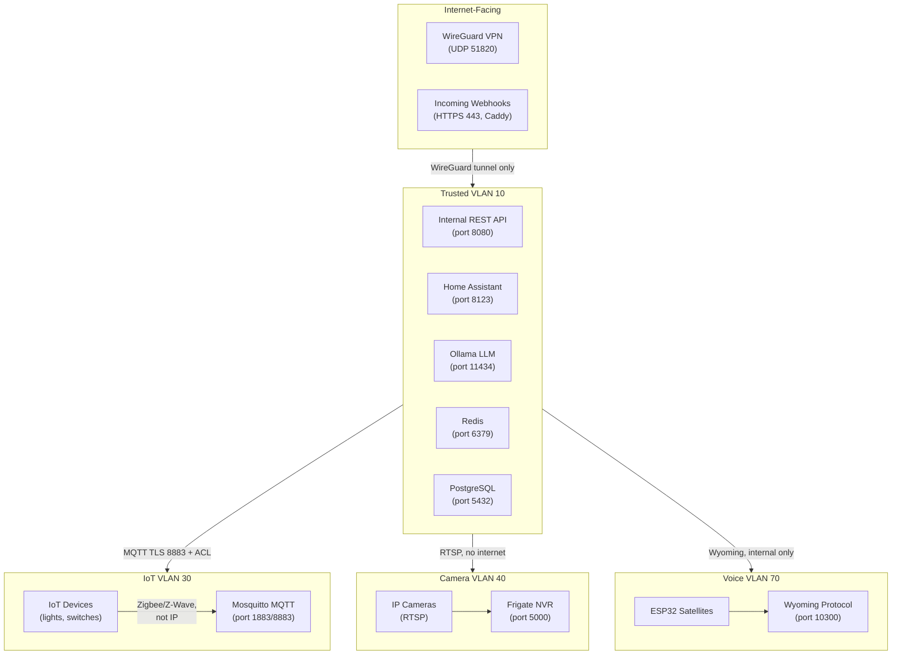

# Chapter 11 — Security Architecture

**AI Home OS Internal Design Specification**  
**Classification:** Internal — Engineering  
**Status:** Draft v1.0  
**Date:** 2026-07-17

---

## Table of Contents

1. [Overview](#1-overview)
2. [Threat Model](#2-threat-model)
3. [Zero Trust Architecture](#3-zero-trust-architecture)
4. [Network Security](#4-network-security)
5. [Identity & Access Management (IAM)](#5-identity--access-management-iam)
6. [Secrets Management](#6-secrets-management)
7. [Transport Security (TLS / mTLS)](#7-transport-security-tls--mtls)
8. [MQTT Security](#8-mqtt-security)
9. [API Security](#9-api-security)
10. [IoT Device Security](#10-iot-device-security)
11. [AI Model Security](#11-ai-model-security)
12. [Data Security & Privacy](#12-data-security--privacy)
13. [Audit Logging & SIEM](#13-audit-logging--siem)
14. [Intrusion Detection (IDS/IPS)](#14-intrusion-detection-idsips)
15. [Vulnerability Management](#15-vulnerability-management)
16. [Incident Response](#16-incident-response)
17. [Physical Security](#17-physical-security)
18. [OWASP Top 10 Mitigations](#18-owasp-top-10-mitigations)
19. [Security Database Schema](#19-security-database-schema)
20. [Security Monitoring Dashboard](#20-security-monitoring-dashboard)
21. [Design Decisions & Trade-offs](#21-design-decisions--trade-offs)
22. [Risks](#22-risks)
23. [Future Improvements](#23-future-improvements)
24. [References](#24-references)

---

## 1. Overview

AI Home OS manages the most sensitive data imaginable — who is home, who is sleeping, where children are, when the house is empty, voice conversations, facial images, health indicators, and financial energy data. A single security failure could expose this data, enable physical intrusion, or grant an attacker remote control over locks, alarm systems, and critical infrastructure.

Security is not a feature added at the end. It is a **first-class design constraint** woven into every layer of the system architecture.

### Security Design Principles

| Principle | Implementation |
|-----------|--------------|
| **Zero Trust** | No implicit trust within the network; every service authenticates |
| **Least Privilege** | Every process, user, and service has only the minimum permissions required |
| **Defence in Depth** | Multiple independent security layers; no single point of failure |
| **Fail Secure** | On any security failure, default to the most restrictive posture |
| **Privacy by Design** | Sensitive data is minimised, anonymised, or kept local by default |
| **Auditability** | Every security-relevant action is logged and signed |
| **Ephemerality** | Short-lived credentials; automatic rotation; no long-lived secrets |

### Security Perimeters

```
Internet
    │  (firewall — port-specific, geo-filtered)
    ▼
Home Router (UniFi UDM-Pro)
    │  (7 VLANs, strict inter-VLAN ACLs)
    ├── VLAN 10 (Trusted) — AI Server, NAS, workstations
    ├── VLAN 20 (Management) — UniFi controller, Proxmox
    ├── VLAN 30 (IoT) — smart devices, no internet access
    ├── VLAN 40 (Cameras) — NVR + cameras, isolated
    ├── VLAN 50 (Sensors) — Zigbee/Z-Wave coordinator
    ├── VLAN 60 (Guest) — isolated, internet only
    └── VLAN 70 (Voice) — ESP32 satellites, MQTT only
```

---

## 2. Threat Model

### 2.1 STRIDE Threat Analysis

| Threat | Category | Example | Mitigation |
|--------|----------|---------|-----------|
| **Spoofing** | Identity | Attacker impersonates family member via voice | Voice biometrics + multi-modal identity fusion |
| **Tampering** | Integrity | Attacker modifies automation rules via MQTT injection | MQTT ACL + signed messages |
| **Repudiation** | Non-repudiation | "I never unlocked the door" (no audit log) | Immutable audit log with timestamps |
| **Information Disclosure** | Confidentiality | Facial images leaked from NAS | Encryption at rest + minimal data retention |
| **Denial of Service** | Availability | Flood MQTT broker, paralyse automation | Rate limiting + circuit breakers |
| **Elevation of Privilege** | Authorisation | Guest user gains admin access | RBAC + token scoping |

### 2.2 Threat Actors

| Actor | Motivation | Capability | Example Attack |
|-------|-----------|-----------|---------------|
| **Remote attacker** | Data theft, ransomware | Medium–High | Exploit exposed service, steal facial data |
| **IoT botnet** | Bandwidth (DDoS) | Low–Medium | Compromise IoT device, join botnet |
| **Malicious guest** | Physical access | Low | Attempt to access security camera feed |
| **Supply chain** | Persistent access | Medium | Compromised firmware on cheap IoT device |
| **Insider threat** | Data exfiltration | Low | Housemate exporting personal data |
| **Physical intruder** | Disable alarm | Low | Pull AI server from rack |

### 2.3 Attack Surface Map



---

## 3. Zero Trust Architecture

Zero Trust means: **never trust, always verify**. Every service must authenticate to every other service, even within the same VLAN.

### 3.1 Core Zero Trust Principles Applied

```
Traditional model:
  [Device on trusted VLAN] → [Service] — NO authentication needed

Zero Trust model:
  [Device on any VLAN] → [Service]
    └── Requires: valid mTLS certificate + valid JWT token + IP allowlist match
```

### 3.2 Service-to-Service Authentication

All internal microservices communicate via mTLS (mutual TLS). Each service holds:
- Its own X.509 certificate signed by the internal CA
- The internal CA root certificate to verify peers

```yaml
# Example: AI Reasoning Engine → Home Assistant bridge
# Every request includes client certificate + Bearer token

service_identity:
  name: ai-reasoning-engine
  certificate: /run/secrets/ai-engine-cert.pem
  private_key: /run/secrets/ai-engine-key.pem
  ca_bundle: /etc/ai-home-os/ca/root-ca.crt

# Allowed callers to HA bridge (allowlist by certificate CN)
ha_bridge:
  allowed_callers:
    - "ai-reasoning-engine"
    - "automation-engine"
    - "energy-service"
  denied_callers: "*"   # Deny all others by default
```

### 3.3 Zero Trust Enforcement Layer

```python
class ZeroTrustMiddleware:
    """
    Enforce Zero Trust on every incoming request to any internal service.
    Applied as ASGI middleware to all FastAPI services.
    """
    async def __call__(self, request: Request, call_next):
        # 1. Verify client certificate (mTLS)
        client_cert = request.scope.get('ssl_object')
        if not client_cert or not self._verify_client_cert(client_cert):
            return Response("Unauthorized: invalid client certificate", status_code=401)

        caller_cn = self._extract_cn(client_cert)

        # 2. Verify JWT (service token, not user token)
        token = request.headers.get('Authorization', '').removeprefix('Bearer ')
        if not token or not self._verify_service_token(token, caller_cn):
            return Response("Unauthorized: invalid service token", status_code=401)

        # 3. Check IP allowlist
        client_ip = request.client.host
        if not self._check_ip_allowlist(client_ip, caller_cn):
            self._log_security_event('ip_not_in_allowlist', caller_cn, client_ip)
            return Response("Forbidden: IP not permitted", status_code=403)

        # 4. Check rate limit per service
        if not await self._check_rate_limit(caller_cn, request.url.path):
            return Response("Too Many Requests", status_code=429)

        # 5. Attach verified identity to request state
        request.state.caller_cn = caller_cn
        request.state.caller_permissions = self._get_permissions(caller_cn)

        return await call_next(request)
```

---

## 4. Network Security

### 4.1 Firewall Rules (UniFi UDM-Pro)

```
# Inter-VLAN rules (enforce strict segmentation)

# VLAN 10 (Trusted) → Allow outbound to specific VLANs
allow VLAN10 → VLAN30:1883    # MQTT (for HA to reach Mosquitto)
allow VLAN10 → VLAN30:8883    # MQTT TLS
allow VLAN10 → VLAN40:5000    # Frigate NVR API
allow VLAN10 → VLAN40:554     # RTSP for camera feeds
allow VLAN10 → VLAN50:any     # Sensor VLAN access
allow VLAN10 → VLAN70:10300   # Wyoming voice protocol
deny  VLAN10 → VLAN60:any     # No access to Guest VLAN

# VLAN 30 (IoT) → Cannot initiate to Trusted
deny  VLAN30 → VLAN10:any
deny  VLAN30 → INTERNET:any   # IoT has no internet access
allow VLAN30 → VLAN30:1883    # MQTT broker on same VLAN

# VLAN 40 (Cameras) → Fully isolated
deny  VLAN40 → INTERNET:any
deny  VLAN40 → VLAN10:any
deny  VLAN40 → VLAN30:any
# Frigate NVR pulls RTSP internally from cameras

# VLAN 60 (Guest) → Internet only
allow VLAN60 → INTERNET:443   # HTTPS
allow VLAN60 → INTERNET:80    # HTTP
deny  VLAN60 → VLAN10:any
deny  VLAN60 → VLAN30:any

# VLAN 70 (Voice/Satellites) → Wyoming only
allow VLAN70 → VLAN10:10300   # Wyoming to AI server
deny  VLAN70 → INTERNET:any
deny  VLAN70 → VLAN30:any
```

### 4.2 WireGuard VPN Configuration

Remote access to the home network is exclusively via WireGuard VPN. No other ports are exposed to the internet.

```ini
# /etc/wireguard/wg0.conf (server — UniFi UDM-Pro / dedicated VPN server)

[Interface]
Address    = 10.200.200.1/24
ListenPort = 51820
PrivateKey = <server-private-key>  # Never commit; stored in secrets manager

# Firewall: Only allow VPN traffic on port 51820
PostUp   = iptables -A FORWARD -i wg0 -j ACCEPT
PostDown = iptables -D FORWARD -i wg0 -j ACCEPT

# Mobile app peer (per-user, per-device)
[Peer]
PublicKey  = <user-device-pubkey>
AllowedIPs = 10.200.200.10/32      # One IP per peer
# No PersistentKeepalive — prevents tracking of connection patterns

# Note: Each household member gets a unique peer configuration.
# Revoking access = remove the [Peer] block + reload wg0
```

### 4.3 Caddy Reverse Proxy (HTTPS Gateway)

All external-facing endpoints (webhooks, mobile app API) terminate TLS at Caddy before forwarding to internal services. Internal services never see raw internet traffic.

```caddyfile
# /etc/caddy/Caddyfile

{
    # ACME via Let's Encrypt (auto-renewal)
    email admin@yourdomain.com
    
    # Security headers
    servers {
        protocols h1 h2 h3
    }
}

# Public webhook endpoint (for utility demand response, calendar events)
webhooks.yourdomain.com {
    # TLS auto-managed by Caddy
    
    # Rate limit: 100 requests/minute per IP
    rate_limit {
        zone webhooks {
            match {
                path /webhook/*
            }
            key {remote_host}
            events 100
            window 1m
        }
    }

    # Validate shared secret before forwarding
    @valid_webhook header X-Webhook-Secret {env.WEBHOOK_SECRET}
    handle @valid_webhook {
        reverse_proxy localhost:8090 {
            header_up X-Real-IP {remote_host}
            header_up X-Forwarded-Proto {scheme}
        }
    }

    respond "Forbidden" 403
}

# Mobile app API (authenticated via JWT, WireGuard preferred)
api.yourdomain.com {
    # Only accessible via WireGuard VPN tunnel — not reachable from internet
    # Bind to VPN interface only
    bind 10.200.200.1

    reverse_proxy localhost:8080 {
        transport http {
            tls
            tls_insecure_skip_verify  # Internal mTLS handled separately
        }
    }
}
```

---

## 5. Identity & Access Management (IAM)

### 5.1 Role-Based Access Control (RBAC)

```python
class Role(str, Enum):
    OWNER           = "owner"           # Full access — all controls
    ADMIN           = "admin"           # Full access except user management
    FAMILY          = "family"          # Personal spaces + shared spaces
    GUEST           = "guest"           # Limited access, no sensitive data
    CHILD           = "child"           # Content-filtered, no security controls
    SERVICE         = "service"         # Machine-to-machine (internal services)
    READONLY        = "readonly"        # View-only (monitoring dashboards)

# Permission matrix
ROLE_PERMISSIONS = {
    Role.OWNER: {
        'security.*': True,             # All security controls
        'automation.*': True,           # Create/modify/delete automations
        'users.*': True,                # Add/remove users
        'energy.*': True,               # All energy controls
        'cameras.view': True,
        'cameras.manage': True,
        'locks.*': True,
        'alarm.*': True,
        'settings.*': True,
        'audit_log.view': True,
    },
    Role.FAMILY: {
        'automation.trigger': True,
        'automation.create_personal': True,  # Only for personal spaces
        'energy.view': True,
        'cameras.view': True,            # Own spaces only
        'cameras.manage': False,
        'locks.own_door': True,
        'alarm.arm_disarm': True,
        'settings.personal': True,
        'users.*': False,
    },
    Role.GUEST: {
        'automation.trigger_public': True,   # Guest-zone automations only
        'energy.view': False,
        'cameras.view': False,
        'locks.*': False,
        'alarm.*': False,
        'settings.*': False,
    },
    Role.CHILD: {
        'automation.trigger_public': True,
        'cameras.view': False,
        'locks.front_door': False,       # Cannot lock/unlock front door alone
        'alarm.*': False,
        'energy.view': True,
    },
}
```

### 5.2 JWT Token Structure

```python
# Service tokens (internal, short-lived)
SERVICE_TOKEN_CLAIMS = {
    "iss": "ai-home-os-auth",           # Issuer
    "sub": "ai-reasoning-engine",       # Service name (= certificate CN)
    "aud": "ha-bridge",                 # Intended audience
    "exp": int(time.time()) + 3600,     # 1-hour expiry
    "iat": int(time.time()),
    "jti": str(uuid4()),                # Unique token ID (for revocation)
    "scopes": ["ha.read", "ha.write"],  # Fine-grained permission scopes
}

# User tokens (from mobile app / wall panel, longer lived)
USER_TOKEN_CLAIMS = {
    "iss": "ai-home-os-auth",
    "sub": "person_uuid_here",          # Person ID from identity system
    "name": "Ahmad",                    # Display name
    "role": "family",
    "exp": int(time.time()) + 86400 * 7,  # 7-day expiry
    "iat": int(time.time()),
    "jti": str(uuid4()),
    "scopes": ["read:own", "write:own", "read:shared"],
    "mfa_verified": True,               # Was MFA checked at login?
    "auth_time": int(time.time()),      # When they authenticated
}
```

### 5.3 Multi-Factor Authentication

```python
class MFAService:
    TOTP_ISSUER = "AI Home OS"

    def enroll_totp(self, person_id: str) -> TOTPEnrollment:
        """Generate a TOTP secret for a person. Store encrypted in DB."""
        secret = pyotp.random_base32()
        totp = pyotp.TOTP(secret)

        # Encrypt secret before storing
        encrypted_secret = secrets_manager.encrypt(secret)
        db.store_mfa_secret(person_id, 'totp', encrypted_secret)

        return TOTPEnrollment(
            secret=secret,
            uri=totp.provisioning_uri(name=person_id, issuer_name=self.TOTP_ISSUER),
            qr_code=self._generate_qr(totp.provisioning_uri(person_id, self.TOTP_ISSUER))
        )

    def verify_totp(self, person_id: str, code: str) -> bool:
        encrypted_secret = db.get_mfa_secret(person_id, 'totp')
        if not encrypted_secret:
            return False
        secret = secrets_manager.decrypt(encrypted_secret)
        totp = pyotp.TOTP(secret)
        # Allow 30s window on each side to account for clock drift
        return totp.verify(code, valid_window=1)

    async def enforce_mfa_for_sensitive_action(
        self,
        person_id: str,
        action: str,
        mfa_token: Optional[str]
    ) -> bool:
        """
        Actions that always require fresh MFA:
        - disarm alarm
        - unlock front door remotely
        - add/remove users
        - view camera footage
        - change security settings
        """
        SENSITIVE_ACTIONS = {
            'alarm.disarm', 'lock.unlock_remote', 'users.add',
            'users.remove', 'cameras.view_historic', 'settings.security'
        }

        if action not in SENSITIVE_ACTIONS:
            return True  # No MFA needed for non-sensitive action

        if not mfa_token:
            return False

        return self.verify_totp(person_id, mfa_token)
```

### 5.4 Session Management

```python
class SessionManager:
    # Maximum session durations
    SESSION_LIMITS = {
        Role.OWNER:     86400 * 30,  # 30 days
        Role.FAMILY:    86400 * 7,   # 7 days
        Role.GUEST:     86400 * 1,   # 24 hours
        Role.CHILD:     86400 * 1,   # 24 hours
    }

    # Idle timeout (auto-logout)
    IDLE_TIMEOUT = {
        Role.OWNER:     3600,        # 1 hour idle
        Role.FAMILY:    1800,        # 30 min idle
        Role.GUEST:     900,         # 15 min idle
    }

    async def revoke_all_sessions(self, person_id: str, reason: str):
        """Immediately invalidate all active sessions for a person."""
        jti_list = await redis.smembers(f"sessions:{person_id}")
        for jti in jti_list:
            await redis.setex(f"revoked_token:{jti}", 86400 * 31, "1")
        await redis.delete(f"sessions:{person_id}")
        await audit_log.record('session_revoked_all', person_id=person_id, reason=reason)
```

---

## 6. Secrets Management

### 6.1 Secrets Hierarchy

All secrets are stored in **HashiCorp Vault** (self-hosted, local-only). Services never have secrets in environment variables or configuration files.

```
Vault (local, encrypted at rest)
├── secret/ai-home-os/
│   ├── database/
│   │   ├── postgres-password
│   │   └── redis-password
│   ├── mqtt/
│   │   ├── broker-cert
│   │   └── service-credentials/
│   │       ├── ai-engine-password
│   │       └── ha-bridge-password
│   ├── api-keys/
│   │   ├── open-meteo-key       # (not needed — free tier)
│   │   ├── tibber-api-key
│   │   └── google-calendar-key
│   ├── tls/
│   │   ├── internal-ca-cert
│   │   ├── internal-ca-key
│   │   └── service-certs/
│   └── encryption-keys/
│       ├── data-at-rest-key
│       └── backup-encryption-key
```

### 6.2 Dynamic Secret Injection

Services receive secrets at startup via Vault Agent, never from environment variables:

```yaml
# docker-compose.yml — Secret injection via Vault Agent
services:
  ai-reasoning-engine:
    image: ai-home-os/reasoning-engine:latest
    volumes:
      - /run/secrets/ai-engine:/run/secrets:ro   # Vault-injected secrets
    environment:
      VAULT_ADDR: "http://vault:8200"
      VAULT_ROLE: "ai-reasoning-engine"
    # NOTE: No passwords or keys in environment variables

  vault-agent:
    image: hashicorp/vault:1.15
    command: agent -config=/vault/agent.hcl
    volumes:
      - ./vault/agent.hcl:/vault/agent.hcl:ro
      - /run/secrets:/vault/secrets
```

```hcl
# vault/agent.hcl — Auto-renew secrets
auto_auth {
    method "approle" {
        config = {
            role_id_file_path   = "/vault/role-id"
            secret_id_file_path = "/vault/secret-id"
        }
    }
}

template {
    source      = "/vault/templates/db.tmpl"
    destination = "/run/secrets/ai-engine/db-password"
    # Auto-renew before expiry
}
```

### 6.3 Secret Rotation Policy

| Secret Type | Rotation Frequency | Method |
|-------------|-------------------|--------|
| TLS certificates (internal) | 90 days | Vault PKI auto-rotation |
| Database passwords | 30 days | Vault dynamic secrets |
| MQTT credentials | 30 days | Vault + Mosquitto reload |
| JWT signing keys | 7 days | Automatic; previous key kept 24h for validation |
| API keys (external) | Manual, on compromise | Alert if not rotated > 180 days |
| Encryption keys (data at rest) | Annual | Key rotation + re-encryption |

---

## 7. Transport Security (TLS / mTLS)

### 7.1 Internal Certificate Authority

AI Home OS operates its own internal Certificate Authority (CA) for all internal TLS:

```bash
# One-time: Bootstrap internal CA (run on secure admin workstation)

# Generate CA key (4096-bit RSA — stays offline after generation)
openssl genrsa -aes256 -out internal-ca.key 4096

# Self-signed CA certificate (10-year validity for root CA)
openssl req -new -x509 -days 3650 \
    -key internal-ca.key \
    -out internal-ca.crt \
    -subj "/C=AE/O=AI Home OS/CN=AI Home OS Internal CA"

# Issue service certificate (1-year, auto-rotated by Vault)
openssl genrsa -out ai-engine.key 2048
openssl req -new \
    -key ai-engine.key \
    -out ai-engine.csr \
    -subj "/C=AE/O=AI Home OS/CN=ai-reasoning-engine"
openssl x509 -req -days 365 \
    -in ai-engine.csr \
    -CA internal-ca.crt -CAkey internal-ca.key \
    -out ai-engine.crt
```

### 7.2 mTLS Configuration (FastAPI Services)

```python
import ssl
from fastapi import FastAPI
import uvicorn

def create_ssl_context() -> ssl.SSLContext:
    ctx = ssl.SSLContext(ssl.PROTOCOL_TLS_SERVER)
    ctx.load_cert_chain(
        certfile='/run/secrets/service-cert.pem',
        keyfile='/run/secrets/service-key.pem'
    )
    # Require client certificate (mutual TLS)
    ctx.verify_mode = ssl.CERT_REQUIRED
    ctx.load_verify_locations('/etc/ai-home-os/ca/root-ca.crt')
    # Modern TLS only
    ctx.minimum_version = ssl.TLSVersion.TLSv1_3
    return ctx

app = FastAPI()

if __name__ == "__main__":
    uvicorn.run(app, host="0.0.0.0", port=8080, ssl=create_ssl_context())
```

### 7.3 TLS Standards

| Parameter | Value | Reason |
|-----------|-------|--------|
| Protocol | TLS 1.3 only | TLS 1.2 deprecated; TLS 1.3 removes weaker cipher suites |
| Key algorithm | RSA 2048 (min) or ECDSA P-256 (preferred) | ECDSA is faster, equally secure |
| Cipher suites | TLS_AES_256_GCM_SHA384, TLS_CHACHA20_POLY1305_SHA256 | NIST-approved, PFS |
| Certificate validity | 90 days (auto-rotate via Vault) | Short-lived reduces blast radius of compromise |
| HSTS (external-facing) | max-age=31536000; includeSubDomains | Prevents SSL stripping |
| OCSP stapling | Enabled | Reduces latency on revocation check |

---

## 8. MQTT Security

MQTT is the primary message bus and must be secured carefully, as all IoT devices use it.

### 8.1 Mosquitto Security Configuration

```ini
# /etc/mosquitto/mosquitto.conf

# Listeners
listener 8883
    # TLS-only on port 8883 (no plaintext 1883 externally)
    cafile   /etc/mosquitto/ca/root-ca.crt
    certfile /etc/mosquitto/certs/broker.crt
    keyfile  /etc/mosquitto/certs/broker.key
    require_certificate true          # mTLS: all clients must present cert
    use_identity_as_username true     # CN from certificate = MQTT username
    tls_version tlsv1.3

listener 1883 localhost
    # Plaintext ONLY on localhost (for local HA integration)

# Authentication plugin (dynamic ACLs)
plugin /usr/lib/mosquitto_dynamic_security.so
plugin_opt_config_file /etc/mosquitto/dynamic-security.json

# Disable anonymous connections
allow_anonymous false

# Message size limit (prevent large payload attacks)
message_size_limit 262144  # 256 KB

# Rate limiting (per client)
max_inflight_messages 20
max_queued_messages 100
```

### 8.2 MQTT ACL (Per-Topic Permissions)

```json
// /etc/mosquitto/dynamic-security.json — role-based topic ACLs

{
  "roles": [
    {
      "rolename": "ai-engine",
      "acls": [
        { "acltype": "publishClientSend", "topic": "ai/+/command", "allow": true },
        { "acltype": "subscribePattern", "topic": "home/+/+/state", "allow": true },
        { "acltype": "subscribePattern", "topic": "ai/+/response", "allow": true }
      ]
    },
    {
      "rolename": "ha-bridge",
      "acls": [
        { "acltype": "publishClientSend", "topic": "home/#", "allow": true },
        { "acltype": "subscribePattern", "topic": "home/#", "allow": true },
        { "acltype": "subscribePattern", "topic": "ai/ha/command", "allow": true }
      ]
    },
    {
      "rolename": "iot-device",
      "acls": [
        { "acltype": "publishClientSend",  "topic": "home/sensor/+/$CLIENTID/+", "allow": true },
        { "acltype": "subscribePattern",   "topic": "home/command/$CLIENTID/#",  "allow": true }
        // Devices can ONLY publish their own sensor data and subscribe to their own commands
      ]
    },
    {
      "rolename": "esp32-satellite",
      "acls": [
        { "acltype": "publishClientSend",  "topic": "voice/satellite/+/audio",   "allow": true },
        { "acltype": "publishClientSend",  "topic": "voice/satellite/+/wake",    "allow": true },
        { "acltype": "subscribePattern",   "topic": "voice/satellite/+/command", "allow": true }
      ]
    }
  ]
}
```

### 8.3 MQTT Message Signing

For critical commands (lock/unlock, alarm arm/disarm), MQTT messages are signed:

```python
import hmac, hashlib, time, json

class MQTTMessageSigner:
    def __init__(self, secret_key: bytes):
        self.key = secret_key

    def sign_payload(self, payload: dict) -> dict:
        payload['ts'] = int(time.time())   # Timestamp for replay protection
        payload['nonce'] = secrets.token_hex(8)
        body = json.dumps(payload, sort_keys=True).encode()
        sig = hmac.new(self.key, body, hashlib.sha256).hexdigest()
        return {**payload, 'sig': sig}

    def verify_payload(self, payload: dict) -> bool:
        received_sig = payload.pop('sig', None)
        if not received_sig:
            return False

        # Replay protection: reject messages older than 30 seconds
        if abs(time.time() - payload.get('ts', 0)) > 30:
            return False

        body = json.dumps(payload, sort_keys=True).encode()
        expected_sig = hmac.new(self.key, body, hashlib.sha256).hexdigest()
        return hmac.compare_digest(received_sig, expected_sig)
```

---

## 9. API Security

### 9.1 Input Validation & Sanitization

```python
from pydantic import BaseModel, validator, constr
import bleach, re

class UserCommandRequest(BaseModel):
    command: constr(min_length=1, max_length=2000)  # Hard length limit
    person_id: str
    room_id: Optional[str] = None

    @validator('command')
    def sanitize_command(cls, v):
        # Remove any HTML/script tags
        v = bleach.clean(v, tags=[], strip=True)

        # Reject prompt injection patterns
        INJECTION_PATTERNS = [
            r'ignore\s+previous\s+instructions',
            r'you\s+are\s+now\s+a',
            r'disregard\s+all',
            r'<\|system\|>',
            r'\[INST\]',
            r'###\s*system',
        ]
        for pattern in INJECTION_PATTERNS:
            if re.search(pattern, v, re.IGNORECASE):
                raise ValueError("Invalid command: potential injection detected")

        return v

    @validator('person_id')
    def validate_person_id(cls, v):
        # UUID format only
        try:
            uuid.UUID(v)
        except ValueError:
            raise ValueError("person_id must be a valid UUID")
        return v
```

### 9.2 Rate Limiting

```python
from fastapi import HTTPException
import aioredis

class RateLimiter:
    LIMITS = {
        'command':      (30, 60),   # 30 requests per 60 seconds
        'auth':         (5, 60),    # 5 auth attempts per 60 seconds (brute-force protection)
        'camera_view':  (10, 60),   # 10 camera requests per 60 seconds
        'automation':   (20, 60),   # 20 automation triggers per 60 seconds
    }

    async def check(self, key: str, endpoint: str, person_id: Optional[str] = None):
        limit, window = self.LIMITS.get(endpoint, (60, 60))
        redis_key = f"ratelimit:{endpoint}:{person_id or key}"

        count = await redis.incr(redis_key)
        if count == 1:
            await redis.expire(redis_key, window)

        if count > limit:
            await audit_log.record(
                'rate_limit_exceeded',
                endpoint=endpoint,
                person_id=person_id,
                ip=key
            )
            raise HTTPException(
                status_code=429,
                detail=f"Rate limit exceeded. Max {limit} requests per {window}s."
            )
```

### 9.3 Response Security Headers

```python
from fastapi.middleware.httpsredirect import HTTPSRedirectMiddleware
from starlette.middleware.base import BaseHTTPMiddleware

class SecurityHeadersMiddleware(BaseHTTPMiddleware):
    async def dispatch(self, request, call_next):
        response = await call_next(request)

        # Prevent clickjacking
        response.headers['X-Frame-Options'] = 'DENY'

        # Prevent MIME sniffing
        response.headers['X-Content-Type-Options'] = 'nosniff'

        # XSS protection (for browsers)
        response.headers['X-XSS-Protection'] = '1; mode=block'

        # Only serve over HTTPS
        response.headers['Strict-Transport-Security'] = \
            'max-age=31536000; includeSubDomains; preload'

        # Restrict resources to same origin
        response.headers['Content-Security-Policy'] = \
            "default-src 'self'; script-src 'self'; style-src 'self';"

        # Disable caching for authenticated responses
        if request.headers.get('Authorization'):
            response.headers['Cache-Control'] = 'no-store'
            response.headers['Pragma'] = 'no-cache'

        # Remove server fingerprint
        response.headers.pop('Server', None)
        response.headers.pop('X-Powered-By', None)

        return response
```

---

## 10. IoT Device Security

### 10.1 Device Onboarding Security

New IoT devices must be enrolled before they can communicate with the system:

```
New IoT Device Onboarding Flow:

1. Physical installation (technician or owner)
2. Owner scans QR code or enters device serial on management panel
3. System generates unique MQTT credentials for this device
4. Device provisioned: certificate + credentials via ESPHome OTA
5. Device added to VLAN 30 allow-list by MAC address
6. Device telemetry baseline established (first 24 hours)
7. Anomaly detection baseline locked after 7 days
```

### 10.2 Device Security Baseline

All IoT devices must meet these requirements before network admission:

| Requirement | Check | Enforcement |
|-------------|-------|-------------|
| Unique credentials | No shared username/password | Device provisioning system |
| No default credentials | Factory password changed | Checked at enrollment |
| Firmware version | Current or within 2 versions | Alert after 30 days; block after 90 days |
| No open management ports | No Telnet, no unauthenticated HTTP | Network scan at enrollment |
| MAC address registered | Unknown MACs blocked | UniFi MAC allow-list |

### 10.3 Rogue Device Detection

```python
class RogueDeviceDetector:
    async def monitor_arp_table(self):
        """
        Periodically scan ARP table.
        Any unknown MAC address on any IoT VLAN triggers an alert.
        """
        known_macs = await db.get_enrolled_device_macs()
        arp_entries = await network.get_arp_table(vlan=30)

        for entry in arp_entries:
            if entry.mac not in known_macs:
                await security_agent.raise_alert(
                    level='HIGH',
                    type='unknown_device',
                    details=f"Unknown MAC {entry.mac} at IP {entry.ip} on IoT VLAN",
                    action=['quarantine_ip', 'notify_owner']
                )
```

### 10.4 Zigbee/Z-Wave Security

```yaml
# Zigbee2MQTT security hardening
mqtt:
  user: zigbee2mqtt-service
  password: "${ZIGBEE2MQTT_MQTT_PASSWORD}"  # From secrets manager

# Require permit_join to be explicitly enabled (off by default)
permit_join: false

# OTA updates — validate firmware signature before applying
ota:
  update_check_interval: 1440  # Check daily
  ikea_ota_use_test_url: false

# Disable network joining after initial setup
homeassistant: true
advanced:
  pan_id: 6754           # Randomize (not default)
  channel: 15            # Non-default channel (avoid interference)
  network_key: GENERATE  # Auto-generate secure network key
  transmit_power: 20     # dBm — only as much as needed
```

---

## 11. AI Model Security

### 11.1 Prompt Injection Prevention

```python
class PromptSanitizer:
    """
    Prevent adversarial inputs from hijacking LLM system prompts.
    Applied to all user inputs before LLM calls.
    """
    MAX_INPUT_LENGTH = 2000

    # Patterns that indicate prompt injection attempts
    INJECTION_PATTERNS = [
        r'ignore\s+(all\s+)?previous\s+instructions',
        r'you\s+are\s+now\s+(a|an)',
        r'disregard\s+(your\s+)?(previous|prior|all)',
        r'(act|pretend|roleplay|behave)\s+as\s+if',
        r'new\s+system\s+prompt',
        r'jailbreak',
        r'<\|im_start\|>',
        r'<\|system\|>',
        r'\[SYSTEM\]',
        r'###\s*instruction',
        r'override\s+(safety|security|rules)',
        r'forget\s+(everything|all)',
        r'developer\s+mode',
        r'dan\s+mode',
    ]

    def sanitize(self, user_input: str, context: dict) -> str:
        # Length check
        if len(user_input) > self.MAX_INPUT_LENGTH:
            user_input = user_input[:self.MAX_INPUT_LENGTH]

        # Pattern detection
        for pattern in self.INJECTION_PATTERNS:
            if re.search(pattern, user_input, re.IGNORECASE):
                audit_log.record('prompt_injection_attempt',
                    pattern=pattern, input_hash=hashlib.sha256(user_input.encode()).hexdigest())
                raise SecurityError("Potential prompt injection detected")

        # Structural escaping: wrap user content in delimiter
        # This prevents user text from escaping the user message role
        sanitized = user_input.replace('<', '&lt;').replace('>', '&gt;')

        return sanitized
```

### 11.2 LLM Output Validation

```python
class LLMOutputValidator:
    """
    Validate all LLM structured outputs before execution.
    LLMs can hallucinate invalid or dangerous tool calls.
    """
    BLOCKED_TOOL_CALLS = {
        'delete_all_recordings',
        'disable_alarm',           # Never via LLM; requires explicit user auth
        'unlock_all_doors',
        'reset_user_passwords',
        'modify_firewall_rules',
    }

    def validate_tool_call(self, tool_name: str, tool_args: dict) -> ValidationResult:
        # Block dangerous tools from LLM invocation
        if tool_name in self.BLOCKED_TOOL_CALLS:
            return ValidationResult(
                valid=False,
                reason=f"Tool '{tool_name}' cannot be invoked by LLM; requires explicit user action"
            )

        # Validate argument types against tool schema
        schema = tool_registry.get_schema(tool_name)
        if schema:
            try:
                schema.validate(tool_args)
            except ValidationError as e:
                return ValidationResult(valid=False, reason=str(e))

        # Check if LLM is hallucinating entity IDs
        if 'entity_id' in tool_args:
            if not ha.entity_exists(tool_args['entity_id']):
                return ValidationResult(
                    valid=False,
                    reason=f"Entity '{tool_args['entity_id']}' does not exist"
                )

        return ValidationResult(valid=True)
```

### 11.3 Model Isolation

All LLM inference happens locally (Ollama). Additional safeguards:

```yaml
# Ollama runs in an isolated container with no network access except to AI server
services:
  ollama:
    image: ollama/ollama:latest
    networks:
      - ai-internal        # Internal only — cannot reach internet
    deploy:
      resources:
        reservations:
          devices:
            - driver: nvidia
              count: 1
              capabilities: [gpu]
    volumes:
      - ollama-models:/root/.ollama/models   # Model storage only
    # No external API keys; no cloud calls allowed
    environment:
      OLLAMA_HOST: "0.0.0.0:11434"
      OLLAMA_ORIGINS: "http://ai-reasoning-engine:8080"  # Allow only from reasoning engine
```

---

## 12. Data Security & Privacy

### 12.1 Encryption at Rest

| Data Type | Storage | Encryption | Key |
|-----------|---------|-----------|-----|
| Facial embeddings | PostgreSQL (pgvector) | Column-level AES-256 | Vault-managed |
| Voice embeddings | PostgreSQL | Column-level AES-256 | Vault-managed |
| Conversation history | PostgreSQL | Table-level encryption | Vault-managed |
| Camera recordings | MinIO / NAS | Object-level AES-256 | Vault-managed |
| LLM context snapshots | Redis | Redis AUTH + TLS | |
| Audit logs | PostgreSQL | Append-only + hash chain | |
| Backup archives | NAS | AES-256-GCM + PBKDF2 | Separate backup key |
| WiFi passwords (VLAN 60 guests) | HashiCorp Vault | Vault encryption | |

```python
# Column-level encryption for sensitive PostgreSQL fields
from cryptography.hazmat.primitives.ciphers.aead import AESGCM
import os

class FieldEncryptor:
    def __init__(self, key_hex: str):
        self.key = bytes.fromhex(key_hex)
        self.aesgcm = AESGCM(self.key)

    def encrypt(self, plaintext: str) -> bytes:
        nonce = os.urandom(12)  # 96-bit nonce
        ct = self.aesgcm.encrypt(nonce, plaintext.encode(), None)
        return nonce + ct  # Prepend nonce for decryption

    def decrypt(self, ciphertext: bytes) -> str:
        nonce = ciphertext[:12]
        ct = ciphertext[12:]
        return self.aesgcm.decrypt(nonce, ct, None).decode()
```

### 12.2 Data Minimization Policy

```python
DATA_RETENTION_POLICY = {
    'raw_audio':            timedelta(seconds=0),    # Never stored
    'facial_images_live':   timedelta(seconds=0),    # Never stored (only embeddings)
    'facial_images_events': timedelta(days=30),      # Known faces: face-to-event link
    'facial_images_unknown': timedelta(days=7),      # Unknown faces: short retention
    'voice_samples':        timedelta(seconds=0),    # Never stored (only embeddings)
    'conversation_text':    timedelta(days=90),      # Summarized after 30 days
    'location_history':     timedelta(days=365),     # Per-person presence history
    'energy_readings':      timedelta(days=365 * 5), # 5-year energy history
    'sensor_readings':      timedelta(days=365 * 2), # 2-year sensor history
    'security_events':      timedelta(days=365 * 7), # 7-year security events
    'audit_logs':           timedelta(days=365 * 7), # 7-year audit logs
}
```

### 12.3 Right to Erasure (GDPR Article 17)

```python
async def erase_person_data(person_id: str, requester_id: str):
    """
    Complete data erasure for a person (GDPR right to erasure).
    Records an audit log entry that the erasure was requested and executed.
    """
    # 1. Revoke all active sessions
    await session_manager.revoke_all_sessions(person_id, reason='gdpr_erasure')

    # 2. Delete biometric data (irreversible)
    await db.execute("DELETE FROM face_embeddings WHERE person_id = %s", (person_id,))
    await db.execute("DELETE FROM voice_embeddings WHERE person_id = %s", (person_id,))

    # 3. Delete conversation history
    await db.execute("DELETE FROM conversation_history WHERE person_id = %s", (person_id,))
    await db.execute("DELETE FROM episodic_memory WHERE person_id = %s", (person_id,))

    # 4. Anonymize presence history (keep for energy/statistics, remove identity)
    await db.execute("""
        UPDATE presence_events
        SET person_id = NULL, person_name = 'Anonymized'
        WHERE person_id = %s
    """, (person_id,))

    # 5. Delete person profile
    await db.execute("DELETE FROM persons WHERE person_id = %s", (person_id,))

    # 6. Remove from vector store
    await qdrant.delete(collection='persons', filter={'person_id': person_id})

    # 7. Audit log (cannot be deleted — legal requirement)
    await audit_log.record(
        'gdpr_erasure_executed',
        subject_person_id=person_id,
        requested_by=requester_id,
        timestamp=datetime.utcnow()
    )
```

---

## 13. Audit Logging & SIEM

### 13.1 Audit Log Design

The audit log is **append-only** with a cryptographic hash chain — each entry includes the SHA-256 hash of the previous entry, making tampering detectable.

```python
@dataclass
class AuditEntry:
    entry_id:       UUID
    timestamp:      datetime
    event_type:     str
    severity:       str         # 'INFO', 'WARN', 'ALERT', 'CRITICAL'
    person_id:      Optional[str]
    service_name:   str
    action:         str
    resource:       Optional[str]
    result:         str         # 'success', 'failure', 'blocked'
    ip_address:     Optional[str]
    details:        dict
    prev_hash:      str         # Hash of previous entry
    entry_hash:     str         # SHA-256 of this entry's fields (excluding entry_hash)

class AuditLogger:
    async def record(self, event_type: str, **kwargs):
        last_entry = await db.fetchrow(
            "SELECT entry_hash FROM audit_log ORDER BY timestamp DESC LIMIT 1"
        )
        prev_hash = last_entry['entry_hash'] if last_entry else '0' * 64

        entry = AuditEntry(
            entry_id=uuid4(),
            timestamp=datetime.utcnow(),
            event_type=event_type,
            service_name=self.service_name,
            prev_hash=prev_hash,
            **kwargs
        )

        # Compute hash of entry content
        content = json.dumps({
            'entry_id': str(entry.entry_id),
            'timestamp': entry.timestamp.isoformat(),
            'event_type': entry.event_type,
            'action': entry.action,
            'prev_hash': entry.prev_hash,
            **kwargs
        }, sort_keys=True)
        entry.entry_hash = hashlib.sha256(content.encode()).hexdigest()

        await db.execute("""
            INSERT INTO audit_log VALUES ($1, $2, $3, $4, $5, $6, $7, $8, $9, $10, $11, $12, $13)
        """, (entry.entry_id, entry.timestamp, entry.event_type, entry.severity,
              entry.person_id, entry.service_name, entry.action, entry.resource,
              entry.result, entry.ip_address, json.dumps(entry.details),
              entry.prev_hash, entry.entry_hash))
```

### 13.2 Security-Critical Events Logged

| Event | Severity | Details Captured |
|-------|---------|-----------------|
| Login success / failure | INFO / WARN | person_id, IP, MFA used |
| MFA bypass attempt | CRITICAL | person_id, IP, action |
| Rate limit exceeded | WARN | endpoint, IP, count |
| Prompt injection attempt | ALERT | input hash, pattern matched |
| Unknown device detected | HIGH | MAC address, IP, VLAN |
| Alarm armed / disarmed | INFO | person_id, method, location |
| Lock state changed | INFO | lock_id, direction, person_id |
| Camera access | INFO | person_id, camera, duration |
| User added / removed | INFO | admin_id, subject_id |
| GDPR erasure | INFO | admin_id, subject_id |
| Secret rotation | INFO | secret_type |
| Rule changed (firewall/RBAC) | ALERT | admin_id, old_value, new_value |
| Intrusion detected (IDS) | CRITICAL | source_ip, attack_type |
| Grid outage | WARN | timestamp, duration |
| AI model output blocked | WARN | tool_name, reason |
| Session revoked | INFO | person_id, reason |

### 13.3 Log Shipping (Loki)

```yaml
# Loki log aggregation — all containers ship logs via Promtail

scrape_configs:
  - job_name: ai-home-os-security
    docker_sd_configs:
      - host: unix:///var/run/docker.sock
    relabel_configs:
      - source_labels: [__meta_docker_container_label_app]
        target_label: app
    pipeline_stages:
      - json:
          expressions:
            event_type: event_type
            severity: severity
            person_id: person_id
      - labels:
          event_type:
          severity:
      - match:
          selector: '{severity="CRITICAL"}'
          stages:
            - output:
                source: message
```

---

## 14. Intrusion Detection (IDS/IPS)

### 14.1 Network Intrusion Detection (Suricata)

```yaml
# Suricata IDS/IPS — runs on UDM-Pro or dedicated LXC container

vars:
  address-groups:
    HOME_NET: "[192.168.10.0/24, 192.168.20.0/24, 192.168.30.0/24]"
    EXTERNAL_NET: "!HOME_NET"

# Alert rules specific to AI Home OS
rule-files:
  - /etc/suricata/rules/ai-home-os.rules
  - /etc/suricata/rules/iot.rules
  - /etc/suricata/rules/emerging-threats.rules
```

```
# /etc/suricata/rules/ai-home-os.rules

# Detect port scan
alert tcp $EXTERNAL_NET any -> $HOME_NET any
    (msg:"Port scan detected"; flags:S; threshold: type both, track by_src, count 10, seconds 60;
     sid:1000001; rev:1;)

# Detect IoT device trying to reach internet (policy violation)
alert ip $IOT_NET any -> $EXTERNAL_NET any
    (msg:"IoT device attempted internet connection"; sid:1000002; rev:1;)

# Detect MQTT on non-standard port (spoofed broker)
alert tcp $HOME_NET any -> $HOME_NET !1883:8883
    (msg:"Possible rogue MQTT on non-standard port"; app-layer-protocol:mqtt;
     sid:1000003; rev:1;)

# Detect brute-force on authentication endpoints
alert http $EXTERNAL_NET any -> $HOME_NET 443
    (msg:"HTTP Auth brute force"; http.uri; content:"/api/auth/login";
     threshold: type both, track by_src, count 5, seconds 60;
     sid:1000004; rev:1;)
```

### 14.2 Application-Layer Anomaly Detection

```python
class AppAnomalyDetector:
    """
    Detect application-level security anomalies using statistical baselines.
    """
    async def detect_anomalies(self):
        await asyncio.gather(
            self._check_auth_anomalies(),
            self._check_api_anomalies(),
            self._check_mqtt_anomalies(),
        )

    async def _check_auth_anomalies(self):
        # Impossible travel: same user authenticated from two distant locations
        # (relevant if VPN is used from travel)
        recent_logins = await db.query("""
            SELECT person_id, ip_address, timestamp
            FROM audit_log
            WHERE event_type = 'login_success'
            AND timestamp > NOW() - INTERVAL '1 hour'
            ORDER BY timestamp
        """)
        # Group by person, check if same person authed from >1 IP in <10 min
        person_ips = defaultdict(list)
        for row in recent_logins:
            person_ips[row.person_id].append((row.ip_address, row.timestamp))

        for person_id, logins in person_ips.items():
            if len(logins) >= 2:
                ip1, t1 = logins[-2]
                ip2, t2 = logins[-1]
                if ip1 != ip2 and (t2 - t1).total_seconds() < 600:
                    await security_agent.raise_alert(
                        level='HIGH',
                        type='impossible_travel_auth',
                        person_id=person_id,
                        details=f"Logins from {ip1} and {ip2} within 10 minutes"
                    )

    async def _check_mqtt_anomalies(self):
        # Device publishing to topic it has never published to before
        new_topic_events = await redis.lrange('mqtt:new_topics', 0, -1)
        for event in new_topic_events:
            data = json.loads(event)
            if not await self._is_known_device_topic(data['client_id'], data['topic']):
                await security_agent.raise_alert(
                    level='MEDIUM',
                    type='mqtt_unexpected_topic',
                    details=f"Client {data['client_id']} published to new topic {data['topic']}"
                )
```

---

## 15. Vulnerability Management

### 15.1 Patch Management Policy

| Component | Check Frequency | Max Unpatched | Auto-Apply |
|-----------|---------------|--------------|-----------|
| Docker base images | Weekly | 14 days | Security patches only |
| Python dependencies | Weekly | 14 days | Minor/patch versions |
| OS (Ubuntu/Debian) | Daily | 7 days (security), 30 days (other) | Yes (unattended-upgrades) |
| Firmware (IoT) | Weekly scan | 90 days | No (manual review) |
| HA integrations | Weekly | 30 days | No (manual review) |
| Ollama models | Monthly | N/A | Manual |

### 15.2 Dependency Scanning

```yaml
# GitHub Actions / local CI pipeline — dependency vulnerability scanning

# Dockerfile — use specific digest, not latest tag
FROM python:3.12.3-slim@sha256:abc123...

# Scan Python dependencies
- name: Scan Python deps
  run: pip-audit --requirement requirements.txt --output json > audit.json

# Scan Docker images
- name: Trivy image scan
  run: trivy image ai-home-os/reasoning-engine:latest --exit-code 1 --severity HIGH,CRITICAL
```

### 15.3 Container Security

```dockerfile
# Dockerfile — hardened base
FROM python:3.12-slim

# Run as non-root user
RUN groupadd -r aihos && useradd -r -g aihos aihos

# Drop all capabilities — add back only what is strictly needed
# (done at docker-compose level)

WORKDIR /app
COPY --chown=aihos:aihos requirements.txt .
RUN pip install --no-cache-dir -r requirements.txt

COPY --chown=aihos:aihos . .

USER aihos

# No shell access in production image
ENTRYPOINT ["python", "-m", "uvicorn", "main:app"]
```

```yaml
# docker-compose.yml — security hardening
services:
  ai-reasoning-engine:
    security_opt:
      - no-new-privileges:true    # Cannot escalate privileges
    cap_drop:
      - ALL                       # Drop all Linux capabilities
    cap_add:
      - NET_BIND_SERVICE          # Only re-add what is needed
    read_only: true               # Read-only filesystem
    tmpfs:
      - /tmp                      # Writable temp in-memory only
    user: "1000:1000"             # Non-root UID
```

---

## 16. Incident Response

### 16.1 Security Alert Levels

| Level | Examples | Response Time | Actions |
|-------|---------|--------------|---------|
| **INFO** | Login from known location | None | Log only |
| **LOW** | Rate limit exceeded | 24 hours | Log; monitor |
| **MEDIUM** | Unknown device on IoT VLAN | 4 hours | Alert owner; quarantine device |
| **HIGH** | Failed MFA on sensitive action; auth from new IP | 1 hour | Alert owner; require re-auth; log |
| **CRITICAL** | Intrusion detected; alarm disabled remotely; brute force success | Immediate | Alert all channels; lock down; preserve evidence |

### 16.2 Automated Incident Response Playbook

```python
class SecurityIncidentResponder:
    async def respond(self, alert: SecurityAlert):
        if alert.level == 'CRITICAL':
            await asyncio.gather(
                self._notify_all_channels(alert),
                self._preserve_evidence(alert),
                self._activate_lockdown(alert),
                self._escalate_to_alarm(alert),
            )

        elif alert.level == 'HIGH':
            await asyncio.gather(
                self._notify_owner(alert),
                self._require_reauth(alert.person_id),
                self._log_extended(alert),
            )

        elif alert.level == 'MEDIUM':
            await asyncio.gather(
                self._notify_owner(alert),
                self._quarantine_device(alert) if alert.type == 'unknown_device' else asyncio.sleep(0),
            )

    async def _activate_lockdown(self, alert: SecurityAlert):
        """
        Security lockdown: suspend non-critical services,
        require re-authentication for all users.
        """
        await session_manager.revoke_all_sessions_global(reason='security_incident')
        await redis.set('security:lockdown', '1', ex=3600)  # 1-hour lockdown
        await mqtt.publish('ai/security/lockdown', json.dumps({
            'active': True,
            'reason': alert.type,
            'alert_id': str(alert.id)
        }), retain=True)

    async def _preserve_evidence(self, alert: SecurityAlert):
        """Snapshot all relevant logs at time of incident."""
        snapshot = {
            'alert': alert.to_dict(),
            'network_connections': await network.get_active_connections(),
            'recent_auth_events': await audit_log.get_recent('auth', minutes=60),
            'mqtt_clients': await mqtt.get_connected_clients(),
        }
        filename = f"incident_{alert.id}_{datetime.utcnow().strftime('%Y%m%d_%H%M%S')}.json"
        await minio.put_object('security-evidence', filename, json.dumps(snapshot))
```

### 16.3 Incident Communication

```
Notification channels (by severity):

INFO:   → Audit log only
LOW:    → Audit log + Prometheus metric
MEDIUM: → Audit log + in-app notification + JARVIS voice announcement
HIGH:   → All above + push notification to owner mobile + email
CRITICAL: → All above + SMS (if configured) + all connected speakers
           + optional external monitoring service webhook
```

---

## 17. Physical Security

### 17.1 Hardware Security

| Component | Security Measure |
|-----------|----------------|
| **AI Server** | Locked server cabinet or dedicated locked room |
| **Network gear** | Locked cabinet; tamper-evident screws |
| **USB ports** | BIOS-disabled; physical blockers on all unused ports |
| **Server console** | BIOS password; boot order locked to internal NVMe |
| **NAS** | Drive encryption (Synology Btrfs encryption) |
| **Zigbee/Z-Wave coordinator** | Internal to server cabinet |

### 17.2 Anti-Tamper Detection

```python
class PhysicalTamperDetector:
    async def monitor(self):
        # USB device insertion detection
        usb_events = await dbus.monitor_usb_events()
        for event in usb_events:
            if event.type == 'inserted':
                await security_agent.raise_alert(
                    level='HIGH',
                    type='usb_device_inserted',
                    details=f"Unknown USB device: {event.vendor_id}:{event.product_id}"
                )
                # Auto-disable USB port (requires kernel module)
                await usb_guard.block_device(event.device_id)

        # Server cabinet door sensor (reed switch → GPIO → MQTT)
        async for msg in mqtt.subscribe('security/cabinet/door'):
            if msg.payload == 'open':
                await security_agent.raise_alert(
                    level='MEDIUM',
                    type='cabinet_door_opened',
                    details="Server cabinet door opened"
                )
```

---

## 18. OWASP Top 10 Mitigations

| OWASP 2021 | Risk | AI Home OS Mitigation |
|------------|------|----------------------|
| **A01 Broken Access Control** | User accesses another user's data or admin functions | RBAC enforced at API layer + resource-level ownership checks |
| **A02 Cryptographic Failures** | Sensitive data exposed due to weak crypto | AES-256-GCM at rest; TLS 1.3 in transit; no deprecated algorithms |
| **A03 Injection** | SQL, command, or prompt injection | Parameterised queries (asyncpg); input sanitization; prompt injection filter |
| **A04 Insecure Design** | Architectural flaws | Zero Trust design; defence-in-depth; STRIDE threat model |
| **A05 Security Misconfiguration** | Default credentials, open ports | Device onboarding checklist; automated config audit (Trivy, Lynis) |
| **A06 Vulnerable Components** | Known CVEs in libraries | Weekly dependency scans (pip-audit, Trivy); auto-patch policy |
| **A07 Auth Failures** | Weak passwords, no MFA | TOTP MFA for sensitive actions; strong JWT; short-lived tokens; brute-force protection |
| **A08 Software/Data Integrity** | Unsigned firmware/updates | Image digest pinning; Vault-signed service tokens; MQTT message signing |
| **A09 Logging/Monitoring Failures** | Attacks not detected | Immutable hash-chained audit log; Loki + Grafana; Suricata IDS |
| **A10 Server-Side Request Forgery** | Attacker forces server to make internal requests | Allowlist of permitted external URLs; no user-controlled redirect targets |

---

## 19. Security Database Schema

```sql
-- Audit log (append-only, hash-chained)
CREATE TABLE audit_log (
    entry_id        UUID PRIMARY KEY DEFAULT gen_random_uuid(),
    timestamp       TIMESTAMPTZ NOT NULL DEFAULT now(),
    event_type      VARCHAR(100) NOT NULL,
    severity        VARCHAR(20) NOT NULL CHECK (severity IN ('INFO','WARN','ALERT','HIGH','CRITICAL')),
    person_id       UUID,
    service_name    VARCHAR(100) NOT NULL,
    action          VARCHAR(200) NOT NULL,
    resource        VARCHAR(200),
    result          VARCHAR(20) CHECK (result IN ('success','failure','blocked')),
    ip_address      INET,
    details         JSONB DEFAULT '{}',
    prev_hash       VARCHAR(64) NOT NULL,
    entry_hash      VARCHAR(64) NOT NULL UNIQUE
);
-- No UPDATE or DELETE permissions on this table
REVOKE UPDATE, DELETE ON audit_log FROM PUBLIC;

-- Security alerts
CREATE TABLE security_alerts (
    alert_id        UUID PRIMARY KEY DEFAULT gen_random_uuid(),
    created_at      TIMESTAMPTZ NOT NULL DEFAULT now(),
    level           VARCHAR(20) NOT NULL,
    type            VARCHAR(100) NOT NULL,
    source_service  VARCHAR(100),
    person_id       UUID,
    ip_address      INET,
    details         JSONB NOT NULL,
    status          VARCHAR(20) DEFAULT 'open',  -- open / acknowledged / resolved
    resolved_at     TIMESTAMPTZ,
    resolved_by     UUID
);

-- RBAC: user role assignments
CREATE TABLE person_roles (
    person_id       UUID NOT NULL REFERENCES persons(person_id),
    role            VARCHAR(30) NOT NULL,
    granted_by      UUID,
    granted_at      TIMESTAMPTZ DEFAULT now(),
    expires_at      TIMESTAMPTZ,   -- NULL = permanent
    PRIMARY KEY (person_id, role)
);

-- Token revocation list (for JWT JTI)
CREATE TABLE revoked_tokens (
    jti             VARCHAR(64) PRIMARY KEY,
    revoked_at      TIMESTAMPTZ DEFAULT now(),
    expires_at      TIMESTAMPTZ NOT NULL,  -- Prune after this time
    reason          VARCHAR(100)
);
CREATE INDEX idx_revoked_tokens_expires ON revoked_tokens(expires_at);

-- MFA credentials
CREATE TABLE mfa_credentials (
    person_id       UUID NOT NULL REFERENCES persons(person_id),
    method          VARCHAR(20) NOT NULL CHECK (method IN ('totp', 'webauthn', 'backup_codes')),
    encrypted_data  BYTEA NOT NULL,       -- Encrypted by Vault key
    created_at      TIMESTAMPTZ DEFAULT now(),
    last_used_at    TIMESTAMPTZ,
    PRIMARY KEY (person_id, method)
);

-- IoT device registry
CREATE TABLE iot_devices (
    device_id       UUID PRIMARY KEY DEFAULT gen_random_uuid(),
    mac_address     MACADDR NOT NULL UNIQUE,
    device_name     VARCHAR(100),
    device_type     VARCHAR(50),
    firmware_version VARCHAR(20),
    enrolled_at     TIMESTAMPTZ DEFAULT now(),
    enrolled_by     UUID REFERENCES persons(person_id),
    last_seen       TIMESTAMPTZ,
    is_active       BOOLEAN DEFAULT TRUE,
    mqtt_username   VARCHAR(100) UNIQUE,
    vlan_id         INT,
    notes           TEXT
);

-- Vulnerability tracking
CREATE TABLE vulnerability_log (
    vuln_id         UUID PRIMARY KEY DEFAULT gen_random_uuid(),
    detected_at     TIMESTAMPTZ NOT NULL DEFAULT now(),
    component       VARCHAR(100) NOT NULL,
    cve_id          VARCHAR(30),
    severity        VARCHAR(10),
    description     TEXT,
    remediated_at   TIMESTAMPTZ,
    remediated_by   UUID
);
```

---

## 20. Security Monitoring Dashboard

```
Security Dashboard — Grafana

┌────────────────────────────────────────────────────────────────────────┐
│  SECURITY OVERVIEW — Last 24 hours                                     │
├────────────────┬───────────────┬───────────────┬───────────────────────┤
│  Auth Events   │  Alerts       │  Devices      │  Network              │
│  ──────────    │  ──────────   │  ──────────   │  ──────────           │
│  Logins: 18    │  CRITICAL: 0  │  Online: 47   │  Blocked: 0           │
│  Failures: 2   │  HIGH: 0      │  Unknown: 0   │  Scanners: 0          │
│  MFA Used: 5   │  MEDIUM: 1    │  Quarantine: 0│  Anomalies: 0         │
│                │  LOW: 3       │               │                       │
│  ✓ Normal      │  ⚠ Review     │  ✓ Clean      │  ✓ Quiet              │
├────────────────┴───────────────┴───────────────┴───────────────────────┤
│  Recent Security Events                                                 │
│  ─────────────────────────────────────────────────────────────────────│
│  14:23  INFO   Ahmad: login success (VPN, MFA verified)                │
│  14:21  WARN   Rate limit: /api/camera/view — 12 requests/min          │
│  09:11  MEDIUM New IoT device: MAC d8:3a:dd:xx:xx — quarantined        │
│  08:45  INFO   JARVIS: service token rotated (ai-reasoning-engine)     │
│  07:00  INFO   Daily security audit: all services healthy              │
├────────────────────────────────────────────────────────────────────────┤
│  Certificate Expiry           │  Patch Status                          │
│  ─────────────────────────    │  ─────────────────────────────────     │
│  ai-engine.crt: 73 days       │  Python deps: ✓ up-to-date             │
│  ha-bridge.crt: 71 days       │  Docker images: ⚠ 1 update pending     │
│  mqtt-broker.crt: 68 days     │  OS packages: ✓ up-to-date             │
│  root-ca.crt: 3,217 days      │  IoT firmware: ✓ 47/47 current         │
└────────────────────────────────────────────────────────────────────────┘
```

---

## 21. Design Decisions & Trade-offs

### 21.1 HashiCorp Vault vs. Docker Secrets vs. Environment Variables

| Approach | Security | Complexity | Auto-Rotation |
|----------|---------|-----------|--------------|
| **Vault (this design)** | ★★★★★ | High | Yes |
| Docker Secrets (Swarm) | ★★★★ | Medium | No |
| Environment variables | ★★ | Low | No |
| Kubernetes Secrets (k3s) | ★★★★ | High | Partial |

**Decision:** Vault for all secrets. Complexity is warranted — a home system stores biometric and family presence data. Docker Secrets is a fallback for smaller deployments where Vault overhead is too high.

### 21.2 mTLS on Every Internal Connection vs. Network Segmentation Only

Network segmentation (VLANs + firewall) is good but insufficient. An attacker who compromises one service on VLAN 10 can reach all others. mTLS ensures a compromised service cannot impersonate another service.

**Decision:** mTLS everywhere on VLAN 10 (trusted services). VLAN 30 (IoT) uses MQTT TLS + ACLs which is a good balance between security and resource constraints of IoT devices.

### 21.3 Self-Hosted CA vs. Let's Encrypt Internal

Let's Encrypt requires a public domain or ACME DNS challenge. Internal services should not depend on external services for authentication. A self-hosted CA provides full control and works offline.

**Decision:** Self-hosted CA for all internal certs. Let's Encrypt only for externally-facing endpoints (Caddy handles this automatically).

---

## 22. Risks

| Risk | Probability | Impact | Mitigation |
|------|-------------|--------|------------|
| Vault becomes unavailable → all services lose secrets | Low | Critical | Vault HA mode (2-node); secrets cached by Vault Agent |
| mTLS certificate expires → service outage | Low | High | 14-day expiry alerts; automated Vault rotation |
| Compromise of IoT device used as pivot point | Medium | High | IoT VLAN fully isolated; no IoT → Trusted traffic |
| Physical access to AI server | Low | Critical | Locked rack; BIOS password; encrypted drives |
| Insider threat (family member with Owner role) | Very Low | High | Audit log reviewed monthly; role review annually |
| Audit log hash chain tampered | Very Low | High | Log shipped to external Loki; nightly hash verification job |
| Dependency CVE in critical service | Medium | High | Weekly scans; 14-day patch SLA for HIGH/CRITICAL |

---

## 23. Future Improvements

| Improvement | Version | Description |
|-------------|---------|-------------|
| WebAuthn / Passkeys | v2 | Replace TOTP with phishing-resistant hardware keys |
| eBPF-based runtime security | v2 | Use Falco + eBPF for kernel-level process monitoring |
| Zero-knowledge proofs for presence | v3 | Prove "someone is home" without revealing who |
| Confidential computing (TEE) | v3 | Run LLM inference in trusted execution environment |
| Decentralised identity (DID) | v3 | W3C DID for household identity without central authority |
| Formal verification of access control | v2 | Use Alloy/TLA+ to prove RBAC policy completeness |
| Hardware Security Module (HSM) | v2 | Store CA key in HSM (YubiHSM 2) instead of Vault |

---

## 24. References

1. **Zero Trust Architecture** — NIST SP 800-207 — https://doi.org/10.6028/NIST.SP.800-207
2. **OWASP Top 10 2021** — https://owasp.org/Top10/
3. **HashiCorp Vault** — https://developer.hashicorp.com/vault/docs
4. **Mosquitto MQTT Security** — https://mosquitto.org/man/mosquitto-conf-5.html
5. **WireGuard VPN** — https://www.wireguard.com/
6. **Suricata IDS** — https://suricata.io/
7. **pyotp — Python TOTP** — https://github.com/pyauth/pyotp
8. **Caddy — Automatic HTTPS** — https://caddyserver.com/docs/
9. **Cryptography (Python)** — https://cryptography.io/
10. **GDPR Article 17 — Right to Erasure** — https://gdpr.eu/right-to-be-forgotten/
11. **STRIDE Threat Modeling** — Microsoft SDL — https://docs.microsoft.com/en-us/azure/security/develop/threat-modeling-tool-threats
12. **Container Security (CIS Benchmark)** — https://www.cisecurity.org/benchmark/docker
13. **Trivy — Container Vulnerability Scanner** — https://github.com/aquasecurity/trivy
14. **pip-audit** — https://github.com/pypa/pip-audit
15. **IEC 62443 — Industrial Cybersecurity** (IoT reference) — https://www.isa.org/standards-and-publications/isa-standards/isa-iec-62443-series-of-standards
16. **Falco — Runtime Security** — https://falco.org/

---

*Previous: [Chapter 10 — Energy Intelligence](Chapter-10-Energy-Intelligence.md)*  
*Next: [Chapter 12 — API & Integration Layer](Chapter-12-API-and-Integration-Layer.md)*

---

> **Document maintained by:** AI Home OS Architecture Team  
> **Last updated:** 2026-07-17  
> **Chapter status:** Draft v1.0 — Open for community review
