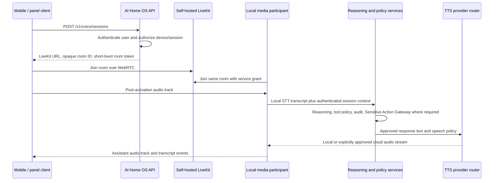

# Chapter 12 — API & Integration Layer

**AI Home OS Internal Design Specification**  
**Classification:** Internal — Engineering  
**Status:** Draft specification v1.0
**Date:** 2026-07-17

> **Implementation status:** Specification only. Nothing in this chapter has been implemented or validated yet. Unless explicitly marked otherwise, code, schemas, configurations, performance figures, and operational flows are illustrative proposals. See [IMPLEMENTATION_STATUS.md](../IMPLEMENTATION_STATUS.md).

---

## Table of Contents

1. [Overview](#1-overview)
2. [API Architecture](#2-api-architecture)
3. [REST API Design](#3-rest-api-design)
4. [WebSocket API](#4-websocket-api)
5. [MQTT Integration Bus](#5-mqtt-integration-bus)
6. [Home Assistant Integration Bridge](#6-home-assistant-integration-bridge)
7. [Webhook System](#7-webhook-system)
8. [Third-Party Integrations](#8-third-party-integrations)
9. [Plugin & Extension SDK](#9-plugin--extension-sdk)
10. [API Authentication & Keys](#10-api-authentication--keys)
11. [API Versioning](#11-api-versioning)
12. [OpenAPI Documentation](#12-openapi-documentation)
13. [Error Handling Standards](#13-error-handling-standards)
14. [Rate Limiting & Quotas](#14-rate-limiting--quotas)
15. [Event Streaming](#15-event-streaming)
16. [gRPC Internal Services](#16-grpc-internal-services)
17. [Integration Adapters](#17-integration-adapters)
18. [API Observability](#18-api-observability)
19. [API Database Schema](#19-api-database-schema)
20. [Design Decisions & Trade-offs](#20-design-decisions--trade-offs)
21. [Risks](#21-risks)
22. [Future Improvements](#22-future-improvements)
23. [References](#23-references)

---

## 1. Overview

The API & Integration Layer is the **nervous system** of the backend-first AI Home OS platform — connecting the AI reasoning engine, sensor layer, Home Assistant, administration web application, mobile app, wall panels, third-party services, and external automations into a unified, coherent platform. Chapter 17 defines the application and deployment boundaries.

The layer provides:

- A **REST API** for the administration web application, mobile app, wall panels, and external integrations
- A **WebSocket API** for real-time push events (state changes, alerts, notifications)
- An **MQTT bus** for all internal IoT and service-to-service messaging
- A **Home Assistant bridge** that translates between AI Home OS and HA's native APIs
- A **webhook engine** for both inbound (utility events, calendar, weather alerts) and outbound (notifications, IFTTT) events
- A **plugin SDK** for extending AI Home OS with custom integrations
- A set of **third-party integration adapters** (Google, Apple, Tibber, Open-Meteo, etc.)

### API Layer Principles

| Principle | Application |
|-----------|------------|
| **Consistent contracts** | All APIs follow the same conventions for pagination, errors, and timestamps |
| **Security by default** | Every endpoint requires authentication; no anonymous access to home data |
| **Event-driven** | State changes flow as events, not polling |
| **Backwards compatible** | API versions are never broken; deprecated endpoints live for minimum 6 months |
| **Observable** | Every API call is traced, metered, and logged |
| **Offline resilient** | The system degrades gracefully when cloud integrations are unavailable |

---

## 2. API Architecture

```mermaid
flowchart TD
    subgraph CLIENTS["API Clients"]
        MOB["Mobile App\n(iOS / Android)"]
        PANEL["Wall Panels\n(Flutter Web touchscreen)"]
        ADMIN["Admin UI\n(Grafana / web)"]
        EXT["External Systems\n(Webhooks, IFTTT)"]
        CLI["Developer CLI\n(aihos-cli)"]
    end

    subgraph GATEWAY["API Gateway Layer"]
        CADDY["Caddy\n(TLS termination)"]
        GATEWAY["API Gateway\n(FastAPI — port 8080)"]
        WS["WebSocket Hub\n(port 8081)"]
        LIVEKIT["Self-hosted LiveKit\nWebRTC media plane"]
    end

    subgraph INTERNAL["Internal APIs"]
        HA_BRIDGE["HA Bridge\n(port 8082)"]
        AI_ENGINE["AI Engine\n(gRPC port 50051)"]
        ENERGY_SVC["Energy Service\n(gRPC port 50052)"]
        IDENTITY_SVC["Identity Service\n(gRPC port 50053)"]
        MEMORY_SVC["Memory Service\n(gRPC port 50054)"]
        MEDIA_AGENT["Conversation Media Participant\n(local agent process)"]
    end

    subgraph EXTERNAL["External Integrations"]
        GOOGLE["Google\n(Calendar / TTS)"]
        WEATHER["Open-Meteo\n(Weather forecast)"]
        TIBBER["Tibber\n(Dynamic tariffs)"]
        UTIL["Utility\n(Demand response)"]
        ELEVEN["ElevenLabs\n(optional cloud TTS)"]
    end

    MOB --> CADDY
    PANEL --> CADDY
    ADMIN --> CADDY
    EXT --> CADDY
    CLI --> CADDY

    CADDY --> GATEWAY
    CADDY --> WS
    CADDY --> LIVEKIT

    GATEWAY --> HA_BRIDGE
    GATEWAY --> AI_ENGINE
    GATEWAY --> ENERGY_SVC
    GATEWAY --> IDENTITY_SVC
    GATEWAY --> MEMORY_SVC
    LIVEKIT <--> MEDIA_AGENT
    MEDIA_AGENT --> AI_ENGINE
    AI_ENGINE -. "consent-gated response text" .-> ELEVEN
    ELEVEN -. "streamed speech" .-> MEDIA_AGENT

    GATEWAY --> GOOGLE
    GATEWAY --> WEATHER
    GATEWAY --> TIBBER
    GATEWAY --> UTIL
```

---

## 3. REST API Design

### 3.1 URL Conventions

```
Base URL (internal, via WireGuard): https://api.home.local/v1/
Base URL (external, via Caddy):     https://api.yourdomain.com/v1/

Resource Naming:
  GET    /v1/rooms                     → list all rooms
  GET    /v1/rooms/{room_id}           → get one room
  GET    /v1/rooms/{room_id}/devices   → nested: devices in a room
  POST   /v1/commands                  → submit a command (action, not resource)
  GET    /v1/events?from=2026-07-01    → filtered collection
  DELETE /v1/persons/{id}             → remove person

Conventions:
  - Plural nouns for resources
  - Lowercase kebab-case for multi-word paths
  - snake_case for JSON body fields
  - ISO 8601 timestamps (UTC, with Z suffix)
  - Cursor-based pagination (not offset)
```

### 3.2 Core REST Endpoints

#### 3.2.1 Commands (Primary AI Interface)

```
POST /v1/commands
```
Submit a natural language or structured command to JARVIS.

**Request:**
```json
{
  "text": "Turn off all lights in the living room",
  "mode": "natural_language",
  "context": {
    "room_id": "living_room",
    "person_id": "uuid-of-ahmad"
  }
}
```

**Response (synchronous, < 3 s):**
```json
{
  "command_id": "cmd_01J4X8...",
  "status": "executed",
  "response_text": "Done — all 4 lights in the living room are now off.",
  "actions_taken": [
    { "entity_id": "light.living_room_main", "action": "turn_off" },
    { "entity_id": "light.living_room_lamp", "action": "turn_off" }
  ],
  "latency_ms": 420,
  "model_used": "phi-4-14b"
}
```

**Response (asynchronous, > 3 s):**
```json
{
  "command_id": "cmd_01J4X9...",
  "status": "processing",
  "poll_url": "/v1/commands/cmd_01J4X9.../status",
  "estimated_ms": 8000
}
```

---

#### 3.2.2 Devices

```
GET    /v1/devices                          → all devices
GET    /v1/devices?room={id}&type=light     → filtered
GET    /v1/devices/{device_id}             → device detail
PATCH  /v1/devices/{device_id}/state       → control device
GET    /v1/devices/{device_id}/history     → state history
```

**Device state PATCH:**
```json
{
  "state": "on",
  "brightness": 80,
  "color_temp": 3000
}
```

**Device detail response:**
```json
{
  "device_id": "light.living_room_main",
  "name": "Living Room Main Light",
  "type": "light",
  "room_id": "living_room",
  "state": {
    "on": true,
    "brightness": 80,
    "color_temp_k": 3000,
    "updated_at": "2026-07-17T14:23:11Z"
  },
  "capabilities": ["on_off", "brightness", "color_temp"],
  "protocol": "zigbee",
  "model": "IKEA TRADFRI E26",
  "firmware": "2.3.087",
  "battery_pct": null,
  "available": true
}
```

---

#### 3.2.3 Rooms & Presence

```
GET  /v1/rooms                          → all rooms with occupancy
GET  /v1/rooms/{room_id}               → room detail + sensors + devices
GET  /v1/rooms/{room_id}/presence      → who is in this room now
GET  /v1/presence                      → home-wide presence summary
GET  /v1/presence/persons/{person_id}  → specific person location
```

**Presence response:**
```json
{
  "home_mode": "home",
  "persons_home": 3,
  "persons": [
    {
      "person_id": "uuid...",
      "name": "Ahmad",
      "room": "office",
      "confidence": 0.94,
      "last_seen": "2026-07-17T14:22:00Z",
      "state": "working"
    },
    {
      "person_id": "uuid...",
      "name": "Sara",
      "room": "kitchen",
      "confidence": 0.88,
      "last_seen": "2026-07-17T14:23:05Z",
      "state": "cooking"
    }
  ],
  "updated_at": "2026-07-17T14:23:11Z"
}
```

---

#### 3.2.4 Automations

```
GET    /v1/automations                       → list automations
POST   /v1/automations                       → create automation
GET    /v1/automations/{id}                 → get automation
PUT    /v1/automations/{id}                 → full update
PATCH  /v1/automations/{id}                 → partial update
DELETE /v1/automations/{id}                 → delete
POST   /v1/automations/{id}/trigger         → manual trigger
GET    /v1/automations/{id}/history         → execution history
POST   /v1/automations/{id}/dry-run         → dry-run (no execution)
```

---

#### 3.2.5 Energy

```
GET  /v1/energy/now                          → real-time power flows
GET  /v1/energy/today                        → today's summary
GET  /v1/energy/history?from=&to=&interval= → historical data
GET  /v1/energy/forecast                     → solar + consumption forecast
GET  /v1/energy/battery                      → battery state
GET  /v1/energy/tariff                       → current tariff + next transitions
GET  /v1/energy/report/monthly?year=&month= → monthly report
POST /v1/energy/schedule                     → schedule a deferrable load
```

---

#### 3.2.6 Persons (Identity)

```
GET    /v1/persons                → list household members
GET    /v1/persons/{id}          → person profile
POST   /v1/persons               → add person (owner/admin only)
PATCH  /v1/persons/{id}          → update profile
DELETE /v1/persons/{id}          → remove + GDPR erase
GET    /v1/persons/{id}/preferences → preference settings
PATCH  /v1/persons/{id}/preferences → update preferences
POST   /v1/persons/{id}/enroll/face  → start face enrollment
POST   /v1/persons/{id}/enroll/voice → start voice enrollment
```

---

#### 3.2.7 Security & Alerts

```
GET    /v1/security/alerts                → active alerts
PATCH  /v1/security/alerts/{id}          → acknowledge / resolve alert
GET    /v1/security/cameras              → camera list
GET    /v1/security/cameras/{id}/stream  → live RTSP stream URL
GET    /v1/security/cameras/{id}/events  → camera events (motion/faces)
GET    /v1/security/alarm                → alarm state
POST   /v1/security/alarm/arm            → arm alarm
POST   /v1/security/alarm/disarm         → disarm alarm (MFA required)
GET    /v1/audit-log?from=&to=&type=    → audit log query
```

These endpoints do not implement independent security rules. All camera access, alarm control, exterior lock/gate control, credential management, and security-setting changes call the Authoritative Sensitive Action Policy in Chapter 11, Section 5.4. Internal services and plugins use the same gateway and cannot call Home Assistant directly for a sensitive action.

---

### 3.3 Standard Response Envelope

Every API response follows a consistent envelope:

```json
{
  "success": true,
  "data": { ... },
  "meta": {
    "request_id": "req_01J4X8...",
    "timestamp": "2026-07-17T14:23:11Z",
    "version": "1.0"
  }
}
```

**Error response:**
```json
{
  "success": false,
  "error": {
    "code": "DEVICE_NOT_FOUND",
    "message": "Device 'light.nonexistent' does not exist",
    "field": null,
    "docs_url": "https://docs.ai-home-os.local/errors/DEVICE_NOT_FOUND"
  },
  "meta": {
    "request_id": "req_01J4X9...",
    "timestamp": "2026-07-17T14:23:12Z"
  }
}
```

### 3.4 Pagination

All list endpoints use **cursor-based pagination**:

```
GET /v1/devices?limit=20&cursor=eyJpZCI6Ij...

Response:
{
  "data": [ ... ],
  "pagination": {
    "limit": 20,
    "next_cursor": "eyJpZCI6Ij...",
    "prev_cursor": "eyJpZCI6Ij...",
    "total": 147,
    "has_more": true
  }
}
```

---

## 4. WebSocket API

### 4.1 WebSocket Connection

The WebSocket API provides real-time push events without polling. The mobile app and wall panels connect and receive live state updates.

```
ws://api.home.local/v1/ws
wss://api.yourdomain.com/v1/ws  (external, via Caddy)

Authentication:
  1. Client uses its bearer token over HTTPS to POST /v1/ws/tickets.
  2. Server returns an opaque, audience-bound, single-use ticket with a
     maximum lifetime of 30 seconds.
  3. Client connects to wss://api.yourdomain.com/v1/ws?ticket=<opaque-ticket>.
  4. The WebSocket gateway atomically consumes the ticket before accepting
     subscriptions. An expired, reused, or wrong-audience ticket is rejected.

After connection, client sends subscription message:
{
  "type": "subscribe",
  "channels": ["devices", "presence", "alerts", "energy"]
}
```

Long-lived access and refresh tokens must never appear in a WebSocket URL. Ticket values are redacted from proxy, gateway, application, analytics, and error logs. A reconnect obtains a new ticket; tickets are never retried or reused. Production connections use `wss://`; cleartext `ws://` is permitted only on explicitly trusted local development networks.

### 4.2 WebSocket Event Schema

```python
@dataclass
class WSEvent:
    event_id:   str          # Unique event ID (for deduplication)
    channel:    str          # 'devices', 'presence', 'alerts', 'energy', 'system'
    type:       str          # Event type within channel
    payload:    dict         # Event-specific data
    timestamp:  str          # ISO 8601 UTC

# Example events:
EVENTS = {
    'devices.state_changed': {
        'device_id': 'light.living_room',
        'state': { 'on': False },
        'changed_by': 'person_uuid',
        'reason': 'voice_command'
    },
    'presence.person_moved': {
        'person_id': 'uuid...',
        'from_room': 'kitchen',
        'to_room': 'office',
        'confidence': 0.91
    },
    'alerts.new_alert': {
        'alert_id': 'uuid...',
        'level': 'HIGH',
        'type': 'unknown_device',
        'message': 'Unknown device on IoT network',
        'requires_action': True
    },
    'energy.power_update': {
        'solar_w': 4200,
        'grid_w': -800,
        'battery_w': 500,
        'home_load_w': 2900,
        'battery_soc': 78
    },
    'system.ai_speaking': {
        'room': 'living_room',
        'text': 'Good morning, Ahmad. Your coffee machine is on.',
        'duration_ms': 3200
    }
}
```

### 4.3 WebSocket Manager Implementation

```python
from fastapi import WebSocket
from typing import Dict, Set
import asyncio, json

class WebSocketManager:
    def __init__(self):
        # Map of channel → set of active connections
        self.subscriptions: Dict[str, Set[WebSocket]] = defaultdict(set)
        self.connections: Dict[str, WebSocket] = {}  # connection_id → ws

    async def connect(self, ws: WebSocket, ticket: str) -> str:
        grant = await ws_ticket_store.consume(ticket, audience='events')
        if not grant:
            await ws.close(code=4001)
            return None

        await ws.accept()
        conn_id = str(uuid4())
        self.connections[conn_id] = ws

        # Send initial state snapshot on connection
        await ws.send_json({
            'type': 'connected',
            'connection_id': conn_id,
            'principal_id': grant.principal_id,
        })

        return conn_id

    async def subscribe(self, conn_id: str, channels: List[str]):
        ws = self.connections.get(conn_id)
        if not ws:
            return
        for channel in channels:
            self.subscriptions[channel].add(ws)

    async def broadcast(self, channel: str, event_type: str, payload: dict):
        """Broadcast event to all subscribers of a channel."""
        message = json.dumps({
            'event_id': str(uuid4()),
            'channel': channel,
            'type': event_type,
            'payload': payload,
            'timestamp': datetime.utcnow().isoformat() + 'Z'
        })

        dead = set()
        for ws in self.subscriptions.get(channel, set()):
            try:
                await ws.send_text(message)
            except Exception:
                dead.add(ws)

        # Clean up dead connections
        for ws in dead:
            self.subscriptions[channel].discard(ws)

    async def disconnect(self, conn_id: str):
        ws = self.connections.pop(conn_id, None)
        if ws:
            for channel_subs in self.subscriptions.values():
                channel_subs.discard(ws)
```

### 4.4 WebSocket Heartbeat

```python
async def ws_endpoint(websocket: WebSocket):
    conn_id = await ws_manager.connect(websocket, ticket=...)

    async def heartbeat():
        while True:
            await asyncio.sleep(30)
            try:
                await websocket.send_json({'type': 'ping'})
            except Exception:
                break

    heartbeat_task = asyncio.create_task(heartbeat())

    try:
        while True:
            data = await websocket.receive_json()
            if data['type'] == 'pong':
                continue
            elif data['type'] == 'subscribe':
                await ws_manager.subscribe(conn_id, data['channels'])
            elif data['type'] == 'command':
                # Structured text/control requests only. Conversational audio
                # uses the LiveKit media plane in Section 4.5.
                await command_router.handle_ws_command(conn_id, data)
    except Exception:
        pass
    finally:
        heartbeat_task.cancel()
        await ws_manager.disconnect(conn_id)
```

### 4.5 LiveKit Conversational Media Plane

The `/v1/ws` connection remains the control and event plane for device state, alerts, energy, presence, and structured commands. Conversational audio uses a separate self-hosted LiveKit WebRTC media plane. This separation keeps binary audio, network adaptation, interruption, and turn-taking out of the general event socket.



`POST /v1/voice/sessions` returns a short-lived LiveKit token containing the minimum room, participant, publish, and subscribe grants. The API derives identity and permissions from the authenticated session; clients cannot choose another principal, home, room, or service role. Room and participant identifiers are opaque. The token is held in memory for that session, never stored in analytics or written to logs, and cannot authorize a different room or participant. Session revocation removes the participant and prevents token refresh. Transport-level reconnect may resume the same authorized session but cannot create a new one.

The local media participant may publish assistant audio and transcript/status data and subscribe to the authorized user audio track. It receives no Home Assistant credential and no direct command-bus access. Transcripts enter the normal command router, and all resulting actions use the same authorization and Sensitive Action Gateway rules as REST, event WebSocket, wall-panel, and room-satellite requests.

Default self-hosted deployment disables recording, composite egress, ingress, SIP, and external room export. Each of those capabilities requires a separate threat model, authorization rule, retention decision, consent record, and audit event before activation. A LiveKit outage affects interactive remote sessions only; local room audio, Snapcast announcements, and the independent safety controller continue without it.

Before implementation is accepted, tests must demonstrate room isolation, least-privilege grants, token expiry and revocation, inability to impersonate the media participant, denial of unauthorized track publication/subscription, interruption behavior, network recovery without duplicate commands, and continued local alert delivery when LiveKit is stopped.

---

## 5. MQTT Integration Bus

### 5.1 MQTT Topic Hierarchy

The MQTT broker is the internal message bus for all IoT devices, sensors, and services. Topics follow a strict hierarchy:

```
home/                           Root namespace
├── {room_id}/                  Per-room subtree
│   ├── {device_type}/          Device type
│   │   └── {device_id}/        Specific device
│   │       ├── state           Current state (retained)
│   │       ├── command         Outbound command (from AI/HA)
│   │       └── availability    online | offline (LWT)

sensor/                         Sensor readings
├── {room_id}/
│   └── {sensor_type}/
│       └── {sensor_id}         Single value payload

ai/                             AI system internal
├── command                     Commands to AI engine
├── response                    AI engine responses
├── context/update              Context change events
└── reasoning/trace             Debug: reasoning traces

voice/                          Voice system
├── satellite/{id}/
│   ├── wake                    Wake word detected
│   ├── audio                   Audio stream start
│   ├── transcript              STT result
│   └── command                 Inbound TTS commands

energy/                         Energy system
├── solar/state                 Current solar generation
├── battery/state               Battery state
├── grid/state                  Grid state
└── schedule/update             Load schedule changes

security/                       Security events
├── alert/{level}               Alert published
├── alarm/state                 Alarm state (retained)
└── camera/{id}/event           Camera motion/face events

system/                         System health
├── heartbeat                   Per-service heartbeat (retained)
├── error                       Error events
└── maintenance                 Maintenance mode
```

### 5.2 MQTT Message Schemas

```python
# All MQTT messages are JSON-serialised dataclasses

@dataclass
class DeviceStateMessage:
    entity_id: str
    state: str                          # on/off or numeric string
    attributes: Dict[str, Any]
    last_changed: str                   # ISO 8601
    source: str                         # who/what changed it

@dataclass
class AICommandMessage:
    command_id: str
    text: Optional[str]                 # Natural language
    action: Optional[str]              # Structured action name
    parameters: Dict[str, Any]
    person_id: Optional[str]
    priority: int                       # 0=low, 5=high, 10=emergency
    reply_topic: str                    # Where to publish response

@dataclass
class SensorReadingMessage:
    sensor_id: str
    room_id: str
    sensor_type: str                    # temperature, humidity, motion, etc.
    value: float
    unit: str
    timestamp: str
    quality: str                        # good, uncertain, stale
```

---

## 6. Home Assistant Integration Bridge

### 6.1 Bridge Architecture

AI Home OS does not replace Home Assistant — it **orchestrates** HA. The bridge is a bidirectional adapter:

```
AI Home OS → Bridge → HA REST API → Physical devices
Physical devices → HA event bus → Bridge → AI Home OS (state sync)
```

```python
class HABridge:
    """
    Bidirectional bridge between AI Home OS and Home Assistant.

    Direction 1: AI → HA (execute commands)
    Direction 2: HA → AI (state change notifications)
    """

    def __init__(self, ha_url: str, ha_token: str):
        self.ha_url = ha_url.rstrip('/')
        self.headers = {
            'Authorization': f'Bearer {ha_token}',
            'Content-Type': 'application/json'
        }
        self.session: Optional[aiohttp.ClientSession] = None

    # ── Direction 1: AI → HA (command execution) ──────────────────────

    async def execute(self, command: HACommand) -> CommandOutcome:
        """
        Execute immediately when possible. If HA remains unavailable, delegate
        to the command's explicit delivery policy. The bridge never decides on
        its own that a physical action is safe to delay.
        """
        for attempt in range(3):
            try:
                result = await self.execute_now(command)
                return CommandOutcome.executed(command.command_id, result)
            except (aiohttp.ClientError, asyncio.TimeoutError) as e:
                if attempt == 2:
                    return await retry_queue.handle_unavailable(command)
                await asyncio.sleep(2 ** attempt)

    async def execute_now(self, command: HACommand) -> dict:
        """Execute once without enqueuing; used by the retry dispatcher."""
        payload = {'entity_id': command.entity_id, **command.arguments}
        url = f"{self.ha_url}/api/services/{command.domain}/{command.service}"
        async with self.session.post(url, json=payload) as resp:
            if resp.status == 200:
                return await resp.json()
            if resp.status == 401:
                raise AuthError("HA token invalid or expired")
            raise HAError(f"HA returned {resp.status}")

    async def get_state(self, entity_id: str) -> dict:
        """Get current state of an entity."""
        url = f"{self.ha_url}/api/states/{entity_id}"
        async with self.session.get(url) as resp:
            if resp.status == 200:
                return await resp.json()
            elif resp.status == 404:
                return None

    async def get_all_states(self) -> List[dict]:
        """Get all entity states (used for initial sync)."""
        url = f"{self.ha_url}/api/states"
        async with self.session.get(url) as resp:
            return await resp.json()

    # ── Direction 2: HA → AI (state change stream) ────────────────────

    async def listen_events(self):
        """
        Connect to HA WebSocket API and forward events to AI Home OS MQTT.
        Reconnects automatically on disconnect.
        """
        ws_url = self.ha_url.replace('http', 'ws') + '/api/websocket'

        while True:
            try:
                async with websockets.connect(ws_url) as ws:
                    # Authenticate
                    await ws.recv()  # auth_required message
                    await ws.send(json.dumps({'type': 'auth', 'access_token': self.token}))
                    auth_resp = json.loads(await ws.recv())
                    if auth_resp['type'] != 'auth_ok':
                        raise AuthError("HA WebSocket auth failed")

                    # Subscribe to state_changed events
                    await ws.send(json.dumps({
                        'id': 1, 'type': 'subscribe_events', 'event_type': 'state_changed'
                    }))

                    async for raw_msg in ws:
                        msg = json.loads(raw_msg)
                        if msg.get('type') == 'event':
                            await self._forward_to_mqtt(msg['event'])

            except (websockets.ConnectionClosed, OSError):
                await asyncio.sleep(5)  # Reconnect after 5s

    async def _forward_to_mqtt(self, ha_event: dict):
        """Translate HA state_changed event to MQTT message."""
        data = ha_event.get('data', {})
        entity_id = data.get('entity_id', '')
        new_state = data.get('new_state', {})

        if not new_state:
            return

        # Route to appropriate MQTT topic
        domain, name = entity_id.split('.', 1)
        room_id = await self._get_room_for_entity(entity_id)
        topic = f"home/{room_id}/{domain}/{entity_id}/state"

        await mqtt.publish(topic, json.dumps({
            'entity_id': entity_id,
            'state': new_state.get('state'),
            'attributes': new_state.get('attributes', {}),
            'last_changed': new_state.get('last_changed'),
            'source': 'home_assistant'
        }), retain=True)
```

### 6.2 Offline Retry Queue

Offline handling is part of each command's safety contract. There is no universal retry window, and security-sensitive physical actions never enter the general retry queue.

| Delivery policy | Typical actions | Behavior while HA is offline |
|-----------------|-----------------|------------------------------|
| `NEVER_QUEUE` | Unlock, alarm disarm, garage/gate open, disable safety device | Fail immediately; require a new authenticated request |
| `IMMEDIATE_ONLY` | Media control, spoken response, transient scene | Fail when the short command deadline passes |
| `LATEST_STATE` | Target temperature, brightness, blind position | Keep only the newest unexpired desired state per coalescing key |
| `DURABLE_EVENT` | Audit record, non-sensitive notification | Queue with expiry and idempotency |
| `SAFETY_LOCAL` | Smoke response, water shutoff | Route to an independent local safety controller; never defer to this queue |

```python
from dataclasses import dataclass
from enum import Enum
from typing import Optional
import time

class DeliveryPolicy(str, Enum):
    NEVER_QUEUE = 'never_queue'
    IMMEDIATE_ONLY = 'immediate_only'
    LATEST_STATE = 'latest_state'
    DURABLE_EVENT = 'durable_event'
    SAFETY_LOCAL = 'safety_local'

@dataclass(frozen=True)
class HACommand:
    command_id: str
    domain: str
    service: str
    entity_id: str
    arguments: dict
    delivery_policy: DeliveryPolicy
    created_at: float
    expires_at: float
    principal_id: str
    authorization_grant_id: str
    required_permission: str
    required_authentication_age_seconds: Optional[int]
    preconditions: dict
    coalescing_key: Optional[str] = None

# These actions are rejected even if a caller mistakenly labels them queueable.
NEVER_DEFER_ACTIONS = {
    ('lock', 'unlock'),
    ('alarm_control_panel', 'alarm_disarm'),
    ('cover', 'open_cover'),       # garage doors and vehicle gates
    ('switch', 'turn_off_safety'),
}

class HARetryQueue:
    async def reject_before_queue(self, command, reason) -> CommandOutcome:
        outcome = CommandOutcome.rejected(command.command_id, reason)
        await outcomes.record_completed(outcome)
        await notifications.send_command_outcome(outcome)
        return outcome

    async def handle_unavailable(self, command: HACommand) -> CommandOutcome:
        # Policy comes from a centrally maintained action registry. A caller
        # cannot make a dangerous action queueable by changing this field.
        registered_policy = command_policy.for_action(
            command.domain, command.service, command.entity_id
        )
        if not registered_policy:
            return await self.reject_before_queue(command, 'unregistered_action')
        if command.delivery_policy != registered_policy.delivery_policy:
            return await self.reject_before_queue(command, 'policy_mismatch')

        if (command.domain, command.service) in NEVER_DEFER_ACTIONS:
            return await self.reject_before_queue(command, 'unsafe_to_queue')

        if command.delivery_policy == DeliveryPolicy.NEVER_QUEUE:
            return await self.reject_before_queue(command, 'not_queued')

        if command.delivery_policy == DeliveryPolicy.SAFETY_LOCAL:
            return await local_safety_controller.execute(command)

        if command.expires_at <= time.time():
            return await self.reject_before_queue(command, 'expired')

        if command.delivery_policy == DeliveryPolicy.IMMEDIATE_ONLY:
            return await self.reject_before_queue(command, 'deadline_missed')

        # A crash can occur after HA performs an action but before the worker
        # stores the result. Only naturally idempotent state assignments, or
        # operations whose receiver honors command_id as an idempotency key,
        # may be retried across that boundary.
        if not registered_policy.retry_safe:
            return await self.reject_before_queue(command, 'unsafe_to_retry')

        if command.delivery_policy == DeliveryPolicy.LATEST_STATE:
            if not command.coalescing_key:
                return await self.reject_before_queue(
                    command, 'missing_coalescing_key'
                )
            superseded_ids = await queue_store.replace_latest(command)
            for command_id in superseded_ids:
                await outcomes.record(command_id, 'superseded')
        elif command.delivery_policy == DeliveryPolicy.DURABLE_EVENT:
            await queue_store.enqueue(command)
        else:
            return await self.reject_before_queue(
                command, 'unknown_delivery_policy'
            )

        await outcomes.record(command.command_id, 'queued')
        return CommandOutcome.queued(command.command_id)

    async def dispatch_next(self) -> Optional[CommandOutcome]:
        # claim_next atomically moves one item from pending to processing and
        # gives it a visibility timeout. An abandoned claim is recoverable.
        command = await queue_store.claim_next()
        if not command:
            return None

        try:
            previous = await outcomes.completed_result(command.command_id)
            if previous:
                await queue_store.ack(command.command_id)
                return previous

            if command.expires_at <= time.time():
                return await self.reject(command, 'expired')

            # Re-evaluate current authorization instead of trusting the
            # authorization decision made before the outage.
            authorization = await authz.revalidate(
                principal_id=command.principal_id,
                grant_id=command.authorization_grant_id,
                required_permission=command.required_permission,
                max_authentication_age=(
                    command.required_authentication_age_seconds
                ),
            )
            if not authorization.allowed:
                return await self.reject(command, authorization.reason)

            current_state = await ha_bridge.get_state(command.entity_id)
            if not preconditions_match(command.preconditions, current_state):
                return await self.reject(command, 'precondition_failed')

            result = await ha_bridge.execute_now(command)
            outcome = CommandOutcome.executed(command.command_id, result)
            # Persist the result before acknowledging the queue item.
            await outcomes.record_completed(outcome)
            await queue_store.ack(command.command_id)
            await notifications.send_command_outcome(outcome)
            return outcome
        except TransientHAError:
            await queue_store.release(command.command_id)
            raise

    async def reject(self, command, reason) -> CommandOutcome:
        outcome = CommandOutcome.rejected(command.command_id, reason)
        await outcomes.record_completed(outcome)
        await queue_store.ack(command.command_id)
        await notifications.send_command_outcome(outcome)
        return outcome
```

`queue_store` uses a reliable pending/processing design such as Redis Streams consumer groups. A worker claim has a visibility timeout, so another worker can recover it after a crash. Queue capacity limits reject new work explicitly; they never silently discard the oldest command.

The action-policy registry is authoritative and deny-by-default. Callers cannot choose a weaker delivery policy. Delayed physical commands must be naturally idempotent state assignments, such as setting a target temperature, or the downstream receiver must enforce `command_id` as an idempotency key. Non-idempotent actions are rejected because a crash after physical execution but before result persistence cannot otherwise provide an exactly-once guarantee.

For `LATEST_STATE`, the coalescing key is the controlled property, for example `climate:master_bedroom:target_temperature`. Replacing a pending command marks the older command `superseded`. Commands with different safety or authorization contexts must not share a coalescing key.

Every request ends with an observable outcome: `executed`, `queued`, `expired`, `superseded`, `authorization_revoked`, `authentication_stale`, `precondition_failed`, `unregistered_action`, `policy_mismatch`, `unsafe_to_queue`, `unsafe_to_retry`, or `execution_failed`. The requesting interface receives the final outcome rather than assuming that a queued command succeeded.

#### 6.2.1 Validation Requirements

Before deployment, offline command handling must demonstrate that:

1. Unlock, alarm disarm, garage/gate open, and safety-disable commands never enter the retry queue.
2. Each queued command has an explicit policy and deadline; unknown policies are rejected.
3. Revoked permission and stale authentication prevent dispatch after reconnection.
4. Changed device or household state causes failed preconditions rather than delayed execution.
5. Multiple desired-state updates execute only the newest unexpired state.
6. Worker failure after claiming an item does not lose it; all retried physical actions are idempotent, and non-idempotent actions never enter the queue without receiver-enforced idempotency.
7. Repeated delivery of a completed `command_id` returns its stored result without repeating the action.
8. Every dropped, rejected, expired, superseded, failed, or executed request produces an audit record and user-visible outcome.

---

## 7. Webhook System

### 7.1 Inbound Webhooks

External systems deliver events to AI Home OS via secure webhooks:

```python
class InboundWebhookRouter:
    """
    Validate and route inbound webhook payloads to the appropriate handler.
    All inbound webhooks share a single HTTPS endpoint at /webhook/{source}.
    """

    REGISTERED_SOURCES = {
        'utility_demand_response': DemandResponseHandler(),
        'google_calendar':         GoogleCalendarHandler(),
        'weather_alert':           WeatherAlertHandler(),
        'doorbell_ring':           DoorbellHandler(),
        'package_delivery':        DeliveryHandler(),
    }

    async def handle(self, source: str, request: Request) -> Response:
        if source not in self.REGISTERED_SOURCES:
            return Response("Unknown webhook source", status_code=404)

        handler = self.REGISTERED_SOURCES[source]

        raw_body = await request.body()
        event_id = request.headers.get('X-Webhook-Id')
        timestamp = request.headers.get('X-Webhook-Timestamp')
        signature = request.headers.get('X-Webhook-Signature')

        # Signature input is: source + timestamp + event_id + raw request body.
        # Comparison is constant-time and the source has a separately managed key.
        if not event_id or not timestamp or not signature or not await handler.verify_signature(
            source=source,
            timestamp=timestamp,
            event_id=event_id,
            raw_body=raw_body,
            signature=signature,
        ):
            audit_log.record('webhook_signature_invalid', source=source,
                             ip=request.client.host)
            return Response("Invalid signature", status_code=401)

        # Reject captured requests outside the narrow replay window.
        if not webhook_clock.within_window(timestamp, maximum_age_seconds=300):
            audit_log.record('webhook_expired', source=source, event_id=event_id)
            return Response("Expired webhook", status_code=401)

        # Validate payload schema
        try:
            payload = json.loads(raw_body)
            validated = handler.schema.parse_obj(payload)
        except (JSONDecodeError, ValidationError) as e:
            return Response(f"Invalid payload: {e}", status_code=422)

        # Atomically claim the validated provider event before any side effect.
        # The durable store is keyed by (source, event_id) and retains records
        # beyond the provider's documented retry period.
        claim = await webhook_events.claim(source, event_id, timestamp)
        if not claim.acquired:
            return Response(status_code=claim.previous_http_status or 202)

        # Handlers use (source, event_id) as the idempotency key for every
        # downstream side effect. A worker resumes an incomplete durable claim;
        # it never starts a second independent execution.
        await handler.process(validated, idempotency_key=f'{source}:{event_id}')
        await webhook_events.complete(source, event_id, http_status=200)

        return Response(status_code=200)
```

Webhook keys are rotated independently per source. Providers with a native signature format may use their documented canonicalization scheme, but they must provide equivalent authenticated timestamp and event-identity guarantees. If a provider supplies no replay-resistant identifier, the gateway derives a bounded deduplication key from the verified raw payload and timestamp bucket and restricts that integration to idempotent handlers.

Before deployment, tests must show that an altered body fails verification, expired requests are rejected, the same event ID cannot execute twice under concurrent delivery, a worker can resume an incomplete claim, and retries return the stored outcome without repeating downstream effects.

### 7.2 Inbound Webhook Handlers

```python
class GoogleCalendarHandler(WebhookHandler):
    schema = GoogleCalendarEvent

    async def process(self, event: GoogleCalendarEvent, idempotency_key: str):
        # Calendar fields and attendees are untrusted external context even
        # though the provider webhook itself has been authenticated.
        if event.type == 'event.created':
            await context_client.add_calendar_event(
                title=event.summary,
                start=event.start,
                end=event.end,
                location=event.location,
                attendees=event.attendees,
                idempotency_key=idempotency_key,
            )

            if 'guest' in event.summary.lower() or len(event.attendees) > 2:
                decision = await calendar_policy.evaluate_guest_mode(
                    calendar_id=event.calendar_id,
                    organizer=event.organizer,
                    event_id=event.id,
                )

                if decision.matches_active_user_rule:
                    await automation_engine.schedule(
                        trigger_time=event.start - timedelta(minutes=30),
                        expires_at=event.end,
                        action='activate_guest_mode',
                        policy_id=decision.policy_id,
                        idempotency_key=f'{idempotency_key}:guest-mode',
                    )
                else:
                    await notifications.suggest_guest_mode(
                        event_id=event.id,
                        expires_at=event.start,
                    )

class WeatherAlertHandler(WebhookHandler):
    async def process(self, alert: WeatherAlert, idempotency_key: str):
        if alert.severity in ('severe', 'extreme'):
            await energy_service.set_battery_reserve(90)
            await tts_service.announce_all_rooms(
                f"Weather alert: {alert.headline}. "
                f"I've set the battery reserve to 90% as a precaution."
            )
```

### 7.3 Outbound Webhooks

AI Home OS can POST events to external systems:

```python
class OutboundWebhookEngine:
    """
    Deliver AI Home OS events to registered external endpoints.
    Retries with exponential backoff on failure.
    """
    async def trigger(self, event_type: str, payload: dict):
        webhooks = await db.get_webhooks_for_event(event_type)

        for webhook in webhooks:
            await self._deliver(webhook, event_type, payload)

    async def _deliver(self, webhook: Webhook, event_type: str, payload: dict):
        body = json.dumps({
            'event_type': event_type,
            'payload': payload,
            'timestamp': datetime.utcnow().isoformat() + 'Z',
            'source': 'ai-home-os'
        })

        # HMAC signature for receiver to verify
        sig = hmac.new(
            webhook.secret.encode(),
            body.encode(),
            hashlib.sha256
        ).hexdigest()

        for attempt in range(5):
            try:
                async with httpx.AsyncClient(timeout=10) as client:
                    resp = await client.post(
                        webhook.url,
                        content=body,
                        headers={
                            'Content-Type': 'application/json',
                            'X-AiHomeOS-Signature': f'sha256={sig}',
                            'X-AiHomeOS-Event': event_type,
                        }
                    )
                if resp.status_code in (200, 201, 202, 204):
                    await db.mark_webhook_delivered(webhook.id, attempt)
                    return

            except httpx.RequestError:
                pass

            await asyncio.sleep(min(2 ** attempt, 60))

        await db.mark_webhook_failed(webhook.id)
        await audit_log.record('outbound_webhook_failed',
                               webhook_id=webhook.id, event_type=event_type)
```

---

## 8. Third-Party Integrations

### 8.1 Integration Registry

| Integration | Category | Protocol | Auth | Local/Cloud |
|-------------|---------|---------|------|------------|
| **Open-Meteo** | Weather | REST/HTTP | None (free) | Cloud |
| **Tibber** | Energy tariffs | GraphQL | OAuth2 | Cloud |
| **Octopus Agile** | Energy tariffs | REST | API key | Cloud |
| **Google Calendar** | Calendar | REST (webhook) | OAuth2 | Cloud |
| **Apple HomeKit** | Smart home | HomeKit | Pairing | Local |
| **Spotify** | Music | REST | OAuth2 | Cloud |
| **Philips Hue** | Lighting | REST | Local | Local |
| **DEWA (Dubai)** | Utility | HTTPS | Account | Cloud |
| **Open Charge Map** | EV | REST | API key | Cloud |
| **Pushover** | Notifications | REST | API key | Cloud |
| **IFTTT** | Automation | Webhooks | API key | Cloud |

### 8.2 Integration Adapter Pattern

All integrations implement a common adapter interface:

```python
from abc import ABC, abstractmethod

class IntegrationAdapter(ABC):
    """Base class for all third-party integrations."""

    name: str                           # 'tibber', 'google_calendar', etc.
    requires_internet: bool = True
    poll_interval_seconds: int = 300

    @abstractmethod
    async def authenticate(self) -> bool:
        """Validate credentials and obtain/refresh access tokens."""

    @abstractmethod
    async def check_health(self) -> HealthStatus:
        """Return health status of this integration."""

    @abstractmethod
    async def fetch(self) -> Any:
        """Fetch data from the integration."""

    async def on_credentials_expired(self):
        """Called when OAuth2 token expires. Default: notify owner."""
        await notification_service.send(
            title=f"{self.name} integration needs re-authorisation",
            body=f"Please re-link your {self.name} account in the app.",
            action_url='/app/settings/integrations'
        )
```

### 8.3 Google Calendar Integration

```python
class GoogleCalendarAdapter(IntegrationAdapter):
    name = 'google_calendar'
    poll_interval_seconds = 300  # Poll every 5 minutes

    async def fetch(self) -> List[CalendarEvent]:
        credentials = await secrets_manager.get('api-keys/google-calendar')
        service = build('calendar', 'v3', credentials=credentials)

        # Fetch events in next 24 hours
        now = datetime.utcnow().isoformat() + 'Z'
        tomorrow = (datetime.utcnow() + timedelta(days=1)).isoformat() + 'Z'

        events_result = service.events().list(
            calendarId='primary',
            timeMin=now,
            timeMax=tomorrow,
            maxResults=20,
            singleEvents=True,
            orderBy='startTime'
        ).execute()

        return [
            CalendarEvent(
                title=e.get('summary', 'Untitled'),
                start=e['start'].get('dateTime', e['start'].get('date')),
                end=e['end'].get('dateTime', e['end'].get('date')),
                location=e.get('location'),
                attendees=[a['email'] for a in e.get('attendees', [])]
            )
            for e in events_result.get('items', [])
        ]
```

### 8.4 Spotify Integration

```python
class SpotifyAdapter(IntegrationAdapter):
    name = 'spotify'

    async def play_in_room(self, room_id: str, context_uri: str = None,
                           query: str = None) -> bool:
        """Play music in a room via Snapcast zone + Spotify Connect."""
        token = await self._get_access_token()

        # Find Snapcast device for this room
        device_id = ROOM_SPOTIFY_DEVICE_MAP.get(room_id)
        if not device_id:
            return False

        if query and not context_uri:
            # Search for content
            results = await self._search(token, query)
            context_uri = results[0].uri if results else None

        if not context_uri:
            return False

        await httpx.AsyncClient().put(
            f"https://api.spotify.com/v1/me/player/play?device_id={device_id}",
            headers={"Authorization": f"Bearer {token}"},
            json={"context_uri": context_uri}
        )
        return True

    async def get_currently_playing(self) -> Optional[NowPlaying]:
        token = await self._get_access_token()
        resp = await httpx.AsyncClient().get(
            "https://api.spotify.com/v1/me/player/currently-playing",
            headers={"Authorization": f"Bearer {token}"}
        )
        if resp.status_code == 200:
            data = resp.json()
            return NowPlaying(
                title=data['item']['name'],
                artist=', '.join(a['name'] for a in data['item']['artists']),
                album=data['item']['album']['name'],
                progress_ms=data['progress_ms'],
                duration_ms=data['item']['duration_ms'],
                is_playing=data['is_playing']
            )
        return None
```

---

## 9. Plugin & Extension SDK

### 9.1 Plugin Architecture

AI Home OS supports community and custom plugins that can:
- Add new device integrations
- Add new AI agent skills
- Add new automation triggers and actions
- Add new dashboard widgets

```
Plugin Structure:
  my-plugin/
  ├── plugin.yaml           ← Manifest
  ├── requirements.txt      ← Python dependencies
  ├── main.py               ← Plugin entry point
  ├── schemas/              ← Pydantic models
  │   └── config.py
  └── README.md
```

**`plugin.yaml`:**
```yaml
name: my-integration
version: 1.2.0
description: "Integrate XYZ smart home device"
author: "Your Name"
license: MIT

# Minimum AI Home OS version required
requires_aihos: ">=1.0.0"

# What this plugin provides
provides:
  - type: integration
    name: xyz_device
    device_types: [light, switch]

  - type: skill
    name: xyz_query
    triggers: ["xyz", "my device"]

# Permissions required (must be explicitly granted by owner)
permissions:
  - devices.read
  - devices.write
  - mqtt.publish:home/xyz/#

# Configuration schema (shown in UI)
config_schema:
  - key: api_key
    label: "XYZ Cloud API Key"
    type: secret
    required: true
  - key: device_ip
    label: "Device Local IP"
    type: string
    required: true
```

### 9.2 Plugin Entry Point

```python
# main.py — Plugin entry point (implements AIHOSPlugin interface)
from aihos_sdk import AIHOSPlugin, PluginContext, DeviceState

class XYZIntegrationPlugin(AIHOSPlugin):

    async def on_load(self, context: PluginContext):
        """Called when plugin is loaded. Set up connections."""
        self.config = context.config
        self.ha = context.ha_bridge
        self.mqtt = context.mqtt
        self.log = context.logger

        # Register devices
        await context.register_device(
            device_id='xyz.my_light',
            name='XYZ Smart Light',
            room_id=self.config.get('room_id', 'living_room'),
            capabilities=['on_off', 'brightness']
        )

        # Subscribe to commands
        await self.mqtt.subscribe(
            f"home/+/light/xyz.+/command",
            self.on_command
        )

        self.log.info("XYZ integration loaded")

    async def on_command(self, topic: str, payload: dict):
        """Handle device command from AI engine."""
        device_id = self._extract_device_id(topic)
        state = payload.get('state')
        brightness = payload.get('brightness')

        # Call device API
        await self._set_device_state(device_id, state, brightness)

    async def on_unload(self):
        """Clean up on plugin unload."""
        pass


# Register the plugin
plugin = XYZIntegrationPlugin()
```

### 9.3 Plugin Trust Boundary and Capability Context

The capability wrappers below reduce accidental access and provide policy enforcement for **trusted first-party plugins**. They are not a sandbox: Python code running in the API process can attempt direct filesystem, network, environment, import, and process-memory access. Only reviewed code signed by an approved first-party key may run in-process.

```python
class TrustedPluginContextFactory:
    """
    Construct audited, least-privilege service clients for a reviewed and
    signed first-party plugin. This is not an isolation boundary.
    """

    def create_context(self, plugin: PluginManifest) -> PluginContext:
        trusted_plugin_registry.require_approved_signature(plugin)

        # Create scoped MQTT client (only allowed topics)
        mqtt_client = ScopedMQTTClient(
            allowed_subscribe=plugin.permissions.get('mqtt.subscribe', []),
            allowed_publish=plugin.permissions.get('mqtt.publish', [])
        )

        # Create scoped HA bridge (only allowed domains)
        ha_client = ScopedHABridge(
            allowed_domains=plugin.permissions.get('ha.domains', [])
        )

        # Create scoped DB client (read-only, plugin-namespaced table only)
        db_client = ScopedDBClient(
            namespace=f"plugin_{plugin.name}",
            readonly=True
        )

        return PluginContext(
            mqtt=mqtt_client,
            ha_bridge=ha_client,
            db=db_client,
            config=PluginConfig(plugin.config),
            logger=PluginLogger(plugin.name)
        )
```

Third-party and community plugins must execute outside the API process using a supported isolation boundary such as a dedicated container, restricted subprocess, or WASM runtime. The boundary must use a separate operating-system identity, read-only code and root filesystem, explicit resource limits, no host socket or secret mounts, a deny-by-default network policy, and a narrow authenticated broker API. The broker rechecks declared capabilities and routes every sensitive action through the Chapter 11 Sensitive Action Gateway. Until that isolated runtime and its escape tests exist, third-party plugin installation is disabled.

---

## 10. API Authentication & Keys

### 10.1 Authentication Methods

| Method | Used By | Token Lifetime | Revocable |
|--------|---------|---------------|-----------|
| **JWT (user)** | Mobile app, wall panels | 7 days (refresh 30 days) | Yes (JTI blocklist) |
| **JWT (service)** | Internal services | 1 hour | Yes |
| **API Key** | Webhooks, CLI, integrations | Until revoked | Yes |
| **mTLS** | Service-to-service | Certificate lifetime (90 days) | Yes (CRL) |

### 10.2 API Key Management

```python
class APIKeyManager:
    """
    API keys for long-lived programmatic access (webhooks, scripts, CLI).
    Keys are hashed before storage — only the prefix is human-readable.
    """
    KEY_PREFIX = "ahos_"
    KEY_LENGTH = 48

    async def create_key(
        self,
        name: str,
        owner_id: str,
        scopes: List[str],
        expires_in_days: Optional[int] = None
    ) -> APIKeyCreation:
        # Generate cryptographically random key
        raw_key = self.KEY_PREFIX + secrets.token_urlsafe(self.KEY_LENGTH)
        key_prefix = raw_key[:12]  # Human-readable prefix (ahos_XXXXXXX)

        # Hash before storing (bcrypt)
        import bcrypt
        key_hash = bcrypt.hashpw(raw_key.encode(), bcrypt.gensalt()).decode()

        expires_at = (
            datetime.utcnow() + timedelta(days=expires_in_days)
            if expires_in_days else None
        )

        key_id = str(uuid4())
        await db.execute("""
            INSERT INTO api_keys (key_id, name, owner_id, key_prefix, key_hash,
                                  scopes, expires_at, created_at)
            VALUES ($1, $2, $3, $4, $5, $6, $7, now())
        """, (key_id, name, owner_id, key_prefix, key_hash,
              json.dumps(scopes), expires_at))

        # Raw key shown ONCE — never retrievable again
        return APIKeyCreation(key_id=key_id, raw_key=raw_key, prefix=key_prefix)

    async def verify_key(self, raw_key: str) -> Optional[APIKeyInfo]:
        if not raw_key.startswith(self.KEY_PREFIX):
            return None

        prefix = raw_key[:12]
        row = await db.fetchrow(
            "SELECT * FROM api_keys WHERE key_prefix = $1 AND is_active = TRUE",
            prefix
        )
        if not row:
            return None

        # Check expiry
        if row['expires_at'] and row['expires_at'] < datetime.utcnow():
            return None

        # Verify hash
        import bcrypt
        if not bcrypt.checkpw(raw_key.encode(), row['key_hash'].encode()):
            return None

        # Update last used
        await db.execute(
            "UPDATE api_keys SET last_used_at = now() WHERE key_id = $1",
            row['key_id']
        )

        return APIKeyInfo(
            key_id=row['key_id'],
            name=row['name'],
            owner_id=row['owner_id'],
            scopes=json.loads(row['scopes'])
        )
```

---

## 11. API Versioning

### 11.1 Versioning Strategy

AI Home OS uses **URI versioning** (`/v1/`, `/v2/`):

```
/v1/devices    ← current stable
/v2/devices    ← next major version (when breaking changes needed)

Deprecation policy:
  - Announce deprecation in response headers: Deprecation: 2026-12-01
  - Keep deprecated version running for minimum 6 months
  - Email registered developers before sunset
  - Sunset header added 30 days before removal: Sunset: Sat, 01 Jun 2027 00:00:00 GMT
```

### 11.2 Version Router

```python
from fastapi import FastAPI

app = FastAPI(title="AI Home OS API")

# Mount versioned routers
from api.v1 import router as v1_router
from api.v2 import router as v2_router

app.include_router(v1_router, prefix="/v1")
app.include_router(v2_router, prefix="/v2")

# Legacy redirect (if v1 endpoint moved to v2)
@app.get("/v1/devices/{device_id}/telemetry", deprecated=True)
async def v1_telemetry_redirect(device_id: str):
    # Returns 301 Moved Permanently with new URL
    from fastapi.responses import RedirectResponse
    return RedirectResponse(f"/v2/devices/{device_id}/history", status_code=301)
```

---

## 12. OpenAPI Documentation

### 12.1 Auto-Generated API Docs

FastAPI generates OpenAPI 3.1 documentation automatically. Served at:

```
https://api.home.local/docs      ← Swagger UI
https://api.home.local/redoc     ← ReDoc (read-friendly)
https://api.home.local/openapi.json ← Raw schema (for code generation)
```

### 12.2 API Documentation Standards

```python
from fastapi import FastAPI, APIRouter
from pydantic import BaseModel, Field

router = APIRouter(prefix="/devices", tags=["Devices"])

class DeviceStateUpdate(BaseModel):
    state: str = Field(..., description="Target state: 'on' or 'off'",
                       examples=["on"])
    brightness: Optional[int] = Field(
        None, ge=0, le=100,
        description="Brightness level 0–100. Only for lights."
    )
    color_temp: Optional[int] = Field(
        None, ge=2000, le=6500,
        description="Colour temperature in Kelvin (2000K warm – 6500K cool)"
    )

@router.patch(
    "/{device_id}/state",
    summary="Control a device",
    description="""
    Update the state of a controllable device.

    Requires `devices.write` scope.

    For lights, you can set brightness and colour temperature simultaneously.
    For switches, only `state` is required.
    """,
    responses={
        200: {"description": "Device state updated successfully"},
        404: {"description": "Device not found"},
        403: {"description": "Insufficient permissions"},
        503: {"description": "Home Assistant unavailable"},
    }
)
async def update_device_state(
    device_id: str,
    update: DeviceStateUpdate,
    current_user = Depends(get_current_user)
):
    ...
```

### 12.3 Client SDK Generation

```bash
# Generate TypeScript client (for mobile app and wall panel)
npx openapi-typescript-codegen \
    --input https://api.home.local/openapi.json \
    --output ./sdk/typescript \
    --name AIHomeOSClient

# Generate Python client (for scripts and plugins)
openapi-python-client generate \
    --url https://api.home.local/openapi.json \
    --output-path ./sdk/python
```

---

## 13. Error Handling Standards

### 13.1 Error Code Registry

```python
class APIError(str, Enum):
    # Authentication
    UNAUTHORIZED            = "UNAUTHORIZED"
    TOKEN_EXPIRED           = "TOKEN_EXPIRED"
    TOKEN_INVALID           = "TOKEN_INVALID"
    MFA_REQUIRED            = "MFA_REQUIRED"
    INSUFFICIENT_SCOPE      = "INSUFFICIENT_SCOPE"

    # Resources
    NOT_FOUND               = "NOT_FOUND"
    DEVICE_NOT_FOUND        = "DEVICE_NOT_FOUND"
    PERSON_NOT_FOUND        = "PERSON_NOT_FOUND"
    ROOM_NOT_FOUND          = "ROOM_NOT_FOUND"
    AUTOMATION_NOT_FOUND    = "AUTOMATION_NOT_FOUND"

    # Validation
    INVALID_REQUEST         = "INVALID_REQUEST"
    VALIDATION_ERROR        = "VALIDATION_ERROR"
    INJECTION_DETECTED      = "INJECTION_DETECTED"

    # Execution
    DEVICE_UNAVAILABLE      = "DEVICE_UNAVAILABLE"
    HA_UNAVAILABLE          = "HA_UNAVAILABLE"
    COMMAND_TIMEOUT         = "COMMAND_TIMEOUT"
    SAFETY_BLOCKED          = "SAFETY_BLOCKED"

    # Rate limiting
    RATE_LIMITED            = "RATE_LIMITED"
    QUOTA_EXCEEDED          = "QUOTA_EXCEEDED"

    # System
    INTERNAL_ERROR          = "INTERNAL_ERROR"
    SERVICE_DEGRADED        = "SERVICE_DEGRADED"
```

### 13.2 Global Error Handler

```python
from fastapi import Request
from fastapi.responses import JSONResponse

@app.exception_handler(Exception)
async def global_exception_handler(request: Request, exc: Exception):
    request_id = request.headers.get('X-Request-ID', str(uuid4()))

    if isinstance(exc, APIException):
        return JSONResponse(
            status_code=exc.http_status,
            content={
                "success": False,
                "error": {
                    "code": exc.code,
                    "message": exc.message,
                    "field": exc.field,
                    "docs_url": f"https://docs.ai-home-os.local/errors/{exc.code}"
                },
                "meta": {"request_id": request_id, "timestamp": utcnow_iso()}
            }
        )

    # Unexpected error — log and return generic response
    logger.exception(f"Unhandled exception on {request.url}: {exc}")
    await audit_log.record('api_unhandled_error', request_id=request_id,
                           path=str(request.url), error=str(exc))

    return JSONResponse(
        status_code=500,
        content={
            "success": False,
            "error": {
                "code": "INTERNAL_ERROR",
                "message": "An unexpected error occurred. Engineers have been notified.",
                "request_id": request_id
            },
            "meta": {"request_id": request_id, "timestamp": utcnow_iso()}
        }
    )
```

---

## 14. Rate Limiting & Quotas

### 14.1 Rate Limit Tiers

| Tier | Who | Requests/min | Requests/hour | Burst |
|------|-----|-------------|--------------|-------|
| **Owner** | Primary admin | 300 | 10,000 | 50 |
| **Family** | Household members | 120 | 5,000 | 30 |
| **Guest** | Temporary guests | 30 | 500 | 10 |
| **API Key (default)** | Scripts, plugins | 60 | 2,000 | 20 |
| **API Key (elevated)** | Approved integrations | 300 | 10,000 | 50 |
| **WebSocket events** | Per connection | N/A | N/A | 10 events/s |

### 14.2 Rate Limit Headers

```
HTTP/1.1 200 OK
X-RateLimit-Limit: 120
X-RateLimit-Remaining: 87
X-RateLimit-Reset: 1721231400
X-RateLimit-Window: 60

HTTP/1.1 429 Too Many Requests
X-RateLimit-Limit: 120
X-RateLimit-Remaining: 0
X-RateLimit-Reset: 1721231460
Retry-After: 18
```

---

## 15. Event Streaming

### 15.1 Server-Sent Events (SSE)

For clients that cannot use WebSockets (simple HTTP clients, scripts), AI Home OS provides Server-Sent Events:

```python
from fastapi.responses import StreamingResponse
import asyncio

@router.get("/v1/events/stream")
async def event_stream(
    channels: str = "devices,presence,energy",
    current_user = Depends(get_current_user)
):
    """
    Server-Sent Events stream for real-time state updates.
    Lower overhead than WebSocket for read-only clients.
    """
    subscribed = channels.split(',')

    async def generate():
        queue = asyncio.Queue(maxsize=100)
        await event_bus.subscribe(queue, subscribed)

        try:
            while True:
                try:
                    event = await asyncio.wait_for(queue.get(), timeout=30)
                    yield f"id: {event.event_id}\n"
                    yield f"event: {event.type}\n"
                    yield f"data: {json.dumps(event.payload)}\n\n"
                except asyncio.TimeoutError:
                    # Keep-alive comment
                    yield ": keepalive\n\n"
        finally:
            await event_bus.unsubscribe(queue)

    return StreamingResponse(
        generate(),
        media_type="text/event-stream",
        headers={
            "Cache-Control": "no-cache",
            "X-Accel-Buffering": "no",  # Disable Nginx buffering
        }
    )
```

### 15.2 Event Bus Implementation

```python
class EventBus:
    """
    In-process event bus that bridges MQTT events to WS/SSE subscribers.
    Acts as a fan-out multiplexer.
    """
    def __init__(self):
        self.subscribers: Dict[str, List[asyncio.Queue]] = defaultdict(list)

    async def publish(self, channel: str, event_type: str, payload: dict):
        event = WSEvent(
            event_id=str(uuid4()),
            channel=channel,
            type=event_type,
            payload=payload,
            timestamp=datetime.utcnow().isoformat() + 'Z'
        )
        # Fan out to all subscribed queues
        for queue in self.subscribers.get(channel, []):
            try:
                queue.put_nowait(event)
            except asyncio.QueueFull:
                pass  # Drop if consumer is slow

    async def subscribe(self, queue: asyncio.Queue, channels: List[str]):
        for channel in channels:
            self.subscribers[channel].append(queue)

    async def unsubscribe(self, queue: asyncio.Queue):
        for channel_list in self.subscribers.values():
            if queue in channel_list:
                channel_list.remove(queue)

event_bus = EventBus()
```

---

## 16. gRPC Internal Services

High-performance internal service-to-service calls use gRPC (protobuf, multiplexed HTTP/2):

### 16.1 Proto Definitions

```protobuf
// proto/reasoning.proto
syntax = "proto3";
package aihos.reasoning.v1;

service ReasoningService {
    rpc ProcessCommand(CommandRequest) returns (CommandResponse);
    rpc ClassifyIntent(IntentRequest) returns (IntentResponse);
    rpc StreamReasoningTrace(CommandRequest) returns (stream ReasoningStep);
}

message CommandRequest {
    string command_id     = 1;
    string text           = 2;
    string person_id      = 3;
    string room_id        = 4;
    bytes  context_json   = 5;  // Serialised context snapshot
}

message CommandResponse {
    string command_id     = 1;
    string status         = 2;  // executed, deferred, blocked, failed
    string response_text  = 3;
    repeated Action actions = 4;
    uint32 latency_ms     = 5;
    string model_used     = 6;
}

message Action {
    string action_type    = 1;
    string entity_id      = 2;
    bytes  parameters     = 3;  // JSON-serialised parameters
}
```

```protobuf
// proto/energy.proto
service EnergyService {
    rpc GetCurrentState(Empty)                  returns (EnergyState);
    rpc GetForecast(ForecastRequest)            returns (SolarForecast);
    rpc ScheduleLoad(LoadScheduleRequest)       returns (LoadScheduleResponse);
    rpc SetBatterySetpoint(BatterySetpoint)     returns (SetpointResult);
    rpc StreamPowerUpdates(Empty)               returns (stream PowerReading);
}
```

### 16.2 gRPC Client Example

```python
import grpc
from proto import reasoning_pb2, reasoning_pb2_grpc

class ReasoningClient:
    def __init__(self, host: str = "ai-reasoning-engine:50051"):
        # mTLS channel (certificate from Vault)
        credentials = grpc.ssl_channel_credentials(
            root_certificates=open('/etc/aihos/ca/root-ca.crt', 'rb').read(),
            private_key=open('/run/secrets/service-key.pem', 'rb').read(),
            certificate_chain=open('/run/secrets/service-cert.pem', 'rb').read()
        )
        self.channel = grpc.aio.secure_channel(host, credentials)
        self.stub = reasoning_pb2_grpc.ReasoningServiceStub(self.channel)

    async def process_command(self, text: str, person_id: str, context: dict) -> CommandResult:
        request = reasoning_pb2.CommandRequest(
            command_id=str(uuid4()),
            text=text,
            person_id=person_id,
            context_json=json.dumps(context).encode()
        )
        response = await self.stub.ProcessCommand(
            request,
            timeout=10,
            metadata=[('authorization', f'Bearer {await get_service_token()}')]
        )
        return CommandResult(
            status=response.status,
            text=response.response_text,
            actions=[Action(a.action_type, a.entity_id) for a in response.actions],
            latency_ms=response.latency_ms
        )
```

---

## 17. Integration Adapters

### 17.1 Optional Cloud Speech Adapter

Cloud speech recognition is disabled by default and is never an automatic consequence of local STT failure. The caller must present a current, feature-specific consent reference and enough session context for the privacy policy to authorize this transmission.

```python
class CloudSpeechAdapter(IntegrationAdapter):
    """
    Optional cloud STT for a single configured provider.
    Raw speech remains personal and biometric data after metadata removal.
    """
    name = 'cloud_speech'
    requires_internet = True

    async def transcribe(
        self,
        captured_audio: CapturedAudio,
        context: AudioPrivacyContext,
    ) -> CloudSpeechResult:
        if not self.config.get('enabled', False):
            return CloudSpeechResult.local_only('cloud_stt_disabled')

        # Authorization checks feature-specific consent, provider, purpose,
        # room, identified speakers, child/guardian policy, and consent expiry.
        decision = await privacy_policy.authorize_audio_egress(
            feature='cloud_stt',
            provider=self.config['provider'],
            consent_id=context.cloud_stt_consent_id,
            room_id=context.room_id,
            speaker_ids=context.speaker_ids,
            guest_mode=context.guest_mode,
            purpose='speech_transcription',
        )
        if not decision.allowed:
            await privacy_audit.record_denial(decision, context)
            return CloudSpeechResult.local_only(decision.reason)

        if (
            context.has_unknown_speaker
            or context.has_unapproved_child
            or context.has_mixed_consent
        ):
            return CloudSpeechResult.local_only('speaker_consent_not_resolved')

        # Include only post-activation speech. Metadata removal minimizes data
        # but does not anonymize a person's voice or spoken content.
        audio_segment = captured_audio.post_activation_only()
        audio_segment.trim_silence()
        audio_segment.exclude_wake_word_preroll()
        if not audio_segment.within_limits(
            max_seconds=self.config['max_audio_seconds'],
            max_bytes=self.config['max_audio_bytes'],
        ):
            audio_segment.discard()
            return CloudSpeechResult.local_only('audio_limit_exceeded')

        # The visible indicator must be active before any network transmission.
        indicator = await privacy_indicators.begin_cloud_processing(
            room_id=context.room_id,
            provider=self.config['provider'],
            data_type='command_audio',
        )
        if not indicator.confirmed:
            audio_segment.discard()
            return CloudSpeechResult.local_only('privacy_indicator_failed')

        request_id = await privacy_audit.record_egress_start(
            feature='cloud_stt',
            provider=self.config['provider'],
            consent_id=decision.consent_id,
            room_id=context.room_id,
            data_category='post_activation_command_audio',
        )

        try:
            # Provider is selected in advance. Failure does not trigger another
            # provider. Retention/training controls are verified at setup.
            response = await self.configured_provider.recognize(
                config=speech.RecognitionConfig(
                    encoding=speech.RecognitionConfig.AudioEncoding.LINEAR16,
                    sample_rate_hertz=16000,
                    language_code=context.language_code,
                ),
                audio=audio_segment.bytes(),
                request_id=request_id,
            )
            await privacy_audit.record_egress_complete(request_id, 'success')
            return CloudSpeechResult.transcribed(response.transcript)
        except ProviderError:
            await privacy_audit.record_egress_complete(request_id, 'failed')
            return CloudSpeechResult.local_only('selected_provider_failed')
        finally:
            audio_segment.discard()
            await privacy_indicators.end_cloud_processing(indicator)
```

Consent is scoped independently for cloud STT, cloud LLM processing, cloud TTS, and diagnostic uploads. Unknown speakers, guest sessions, children without guardian approval, rooms that prohibit cloud audio, and groups with incompatible consent remain local-only. Revocation disables the adapter immediately and removes its provider credential from the active runtime.

The provider configuration must document processing region, retention controls, training-use controls, deletion procedures, and transport security. The audit log contains the provider, consent reference, data category, purpose, timestamp, and outcome; it never contains raw audio or transcript content.

#### 17.1.1 Validation Requirements

1. Local STT failure alone cannot invoke this adapter.
2. Missing, expired, revoked, wrong-provider, or wrong-feature consent blocks transmission.
3. Speaker and room policy uncertainty resolves to local-only processing.
4. No bytes leave the system until the cloud-processing indicator is confirmed.
5. Audio limits and post-activation trimming are applied before transmission.
6. Provider failure cannot cascade to another provider.
7. Revocation takes effect without restarting the adapter.
8. Egress audit records contain metadata about the decision, never audio or transcript content.

#### 17.1.2 Speech Synthesis Provider Adapter

Piper, XTTS, and ElevenLabs implement one internal streaming contract. The registry selects a provider from server-owned policy; callers cannot name a provider to bypass consent, redaction, budget, or availability rules.

```python
class SpeechSynthesisRouter:
    async def stream(
        self,
        response: ApprovedSpeechResponse,
        context: AudioPrivacyContext,
    ) -> AsyncIterator[bytes]:
        selection = await speech_policy.select_provider(response, context)

        if selection.provider in {'piper', 'xtts'}:
            async for chunk in local_tts[selection.provider].stream(
                text=response.text,
                voice=selection.voice_id,
            ):
                yield chunk
            return

        if selection.provider != 'elevenlabs':
            raise PolicyError('unregistered_tts_provider')

        decision = await privacy_policy.authorize_text_egress(
            feature='cloud_tts',
            provider='elevenlabs',
            consent_id=context.cloud_tts_consent_id,
            room_id=context.room_id,
            speaker_ids=context.speaker_ids,
            data_categories=response.data_categories,
            purpose='speech_synthesis',
        )
        if not decision.allowed:
            raise PolicyError(decision.reason)

        redacted = response.redact_for(decision.allowed_data_categories)
        await cloud_budget.reserve_or_reject(
            provider='elevenlabs',
            principal_id=context.principal_id,
            units=len(redacted.text),
        )

        request_id = await privacy_audit.record_egress_start(
            feature='cloud_tts', provider='elevenlabs',
            consent_id=decision.consent_id,
            data_category='redacted_response_text',
        )
        try:
            async for chunk in elevenlabs_tts.stream(
                text=redacted.text,
                voice_id=selection.voice_id,
                request_id=request_id,
            ):
                yield chunk
            await privacy_audit.record_egress_complete(request_id, 'success')
        except ProviderError:
            await privacy_audit.record_egress_complete(request_id, 'failed')
            # Do not send the text to a second cloud provider. The caller may
            # explicitly offer to repeat an ordinary response through Piper.
            raise
```

ElevenLabs credentials are loaded only by the server-side adapter from the secrets service. Voice identifiers are allowlisted. Response text is bounded, classified, and redacted before transmission. Security details, private recordings, credentials, raw tool results, and data categories outside the active consent are rejected. Per-user and household rate limits, monthly spending ceilings, latency/error metrics, and a provider kill switch are mandatory.

ElevenLabs handles synthesis only in this integration. Conversation reasoning, identity, memory, tool selection, authorization, and audit remain within AI Home OS. Adopting an ElevenLabs agent product would be a different architecture and requires a new review because it could move STT, conversation state, or orchestration outside the home.

### 17.2 Home Automation Protocol Adapters

```python
# Adapter registry — maps protocol to bridge implementation
PROTOCOL_ADAPTERS = {
    'zigbee':   ZigbeeBridge(coordinator='192.168.10.15', port=8080),
    'zwave':    ZWaveBridge(controller='192.168.10.15', port=3000),
    'matter':   MatterBridge(fabric_id='...'),
    'esphome':  ESPHomeBridge(api_host='192.168.10.15'),
    'modbus':   ModbusBridge(host='192.168.20.50', port=502),
    'knx':      KNXBridge(gateway='192.168.10.20'),
}

class ProtocolRouter:
    def get_adapter(self, entity_id: str) -> ProtocolAdapter:
        device = device_registry.get(entity_id)
        if not device:
            raise DeviceNotFoundError(entity_id)
        return PROTOCOL_ADAPTERS.get(device.protocol)
```

---

## 18. API Observability

### 18.1 Request Tracing

Every API request gets a distributed trace via OpenTelemetry:

```python
from opentelemetry import trace
from opentelemetry.instrumentation.fastapi import FastAPIInstrumentor
from opentelemetry.exporter.otlp.proto.grpc.trace_exporter import OTLPSpanExporter

# Auto-instrument FastAPI
FastAPIInstrumentor.instrument_app(app)

# Custom span for AI processing
tracer = trace.get_tracer("ai-home-os.api")

async def handle_command(text: str, person_id: str):
    with tracer.start_as_current_span("handle_command") as span:
        span.set_attribute("command.text_length", len(text))
        span.set_attribute("command.person_id", person_id)

        with tracer.start_as_current_span("intent_classification"):
            intent = await reasoning.classify_intent(text)
            span.set_attribute("intent.type", intent.type)

        with tracer.start_as_current_span("ha_execution"):
            result = await ha_bridge.execute(intent)
            span.set_attribute("ha.entities_changed", len(result.changed))
```

### 18.2 Prometheus Metrics

```python
from prometheus_client import Counter, Histogram, Gauge

# API metrics
api_requests_total = Counter(
    'aihos_api_requests_total',
    'Total API requests',
    ['method', 'endpoint', 'status_code', 'role']
)
api_latency = Histogram(
    'aihos_api_latency_seconds',
    'API request latency',
    ['method', 'endpoint'],
    buckets=[0.05, 0.1, 0.25, 0.5, 1.0, 2.5, 5.0, 10.0]
)
websocket_connections = Gauge(
    'aihos_websocket_connections',
    'Active WebSocket connections'
)
command_latency = Histogram(
    'aihos_command_latency_seconds',
    'End-to-end command processing latency',
    buckets=[0.1, 0.25, 0.5, 1.0, 2.0, 5.0, 10.0, 30.0]
)
ha_bridge_errors = Counter(
    'aihos_ha_bridge_errors_total',
    'HA bridge errors',
    ['error_type']
)
webhook_deliveries = Counter(
    'aihos_webhook_deliveries_total',
    'Outbound webhook delivery attempts',
    ['webhook_name', 'result']
)
```

### 18.3 API Health Endpoint

```python
@app.get("/health", include_in_schema=False)
async def health():
    checks = await asyncio.gather(
        _check_database(),
        _check_redis(),
        _check_ha_bridge(),
        _check_mqtt(),
        return_exceptions=True
    )
    labels = ['database', 'redis', 'ha_bridge', 'mqtt']
    results = {
        label: ('ok' if not isinstance(r, Exception) else str(r))
        for label, r in zip(labels, checks)
    }
    all_ok = all(v == 'ok' for v in results.values())

    return {
        "status": "healthy" if all_ok else "degraded",
        "version": "1.0.0",
        "timestamp": datetime.utcnow().isoformat() + 'Z',
        "checks": results
    }
```

---

## 19. API Database Schema

```sql
-- API keys
CREATE TABLE api_keys (
    key_id          UUID PRIMARY KEY DEFAULT gen_random_uuid(),
    name            VARCHAR(100) NOT NULL,
    owner_id        UUID NOT NULL REFERENCES persons(person_id),
    key_prefix      VARCHAR(12) NOT NULL UNIQUE,    -- Human-readable prefix
    key_hash        VARCHAR(255) NOT NULL,           -- bcrypt hash
    scopes          JSONB NOT NULL DEFAULT '[]',
    is_active       BOOLEAN DEFAULT TRUE,
    created_at      TIMESTAMPTZ DEFAULT now(),
    expires_at      TIMESTAMPTZ,
    last_used_at    TIMESTAMPTZ,
    description     TEXT
);

-- Registered webhooks (outbound)
CREATE TABLE webhooks (
    webhook_id      UUID PRIMARY KEY DEFAULT gen_random_uuid(),
    name            VARCHAR(100) NOT NULL,
    owner_id        UUID NOT NULL REFERENCES persons(person_id),
    url             VARCHAR(500) NOT NULL,
    secret          VARCHAR(64) NOT NULL,            -- HMAC secret
    events          JSONB NOT NULL,                  -- Array of subscribed event types
    is_active       BOOLEAN DEFAULT TRUE,
    created_at      TIMESTAMPTZ DEFAULT now(),
    last_triggered  TIMESTAMPTZ,
    failure_count   INT DEFAULT 0,                   -- Consecutive failures
    last_error      TEXT
);

-- Webhook delivery log
CREATE TABLE webhook_deliveries (
    delivery_id     UUID PRIMARY KEY DEFAULT gen_random_uuid(),
    webhook_id      UUID REFERENCES webhooks(webhook_id),
    event_type      VARCHAR(100) NOT NULL,
    payload         JSONB NOT NULL,
    attempted_at    TIMESTAMPTZ NOT NULL DEFAULT now(),
    response_status INT,
    response_ms     INT,
    attempts        INT DEFAULT 1,
    result          VARCHAR(20) NOT NULL    -- 'delivered', 'failed', 'dropped'
);

-- Integration configuration
CREATE TABLE integrations (
    integration_id  UUID PRIMARY KEY DEFAULT gen_random_uuid(),
    name            VARCHAR(50) NOT NULL UNIQUE,
    is_enabled      BOOLEAN DEFAULT FALSE,
    config          JSONB NOT NULL DEFAULT '{}',    -- Non-secret config
    health_status   VARCHAR(20) DEFAULT 'unknown', -- healthy, degraded, error
    last_synced     TIMESTAMPTZ,
    last_error      TEXT,
    created_at      TIMESTAMPTZ DEFAULT now()
);

-- Plugin registry
CREATE TABLE plugins (
    plugin_id       UUID PRIMARY KEY DEFAULT gen_random_uuid(),
    name            VARCHAR(100) NOT NULL UNIQUE,
    version         VARCHAR(20) NOT NULL,
    description     TEXT,
    author          VARCHAR(100),
    is_enabled      BOOLEAN DEFAULT FALSE,
    config          JSONB NOT NULL DEFAULT '{}',
    granted_permissions JSONB NOT NULL DEFAULT '[]',
    installed_at    TIMESTAMPTZ DEFAULT now(),
    last_loaded     TIMESTAMPTZ
);

-- API request log (sampled — 1% for non-error, 100% for errors)
CREATE TABLE api_request_log (
    request_id      VARCHAR(64) PRIMARY KEY,
    timestamp       TIMESTAMPTZ NOT NULL DEFAULT now(),
    method          VARCHAR(10) NOT NULL,
    path            VARCHAR(500) NOT NULL,
    status_code     INT NOT NULL,
    latency_ms      INT NOT NULL,
    person_id       UUID,
    api_key_id      UUID,
    response_size   INT,
    error_code      VARCHAR(50)
);
SELECT create_hypertable('api_request_log', 'timestamp',
    chunk_time_interval => INTERVAL '1 day');
```

---

## 20. Design Decisions & Trade-offs

### 20.1 REST vs. GraphQL

| Approach | Flexibility | Caching | Complexity | Overfetch |
|----------|------------|---------|-----------|----------|
| **REST (this design)** | Medium | Excellent (HTTP caching) | Low | Some |
| GraphQL | High | Poor (POST, no HTTP caching) | High | None |
| gRPC-Web | Medium | None | Very High | None |

**Decision:** REST for external-facing API (client simplicity, caching, tooling). gRPC for internal service-to-service (performance, streaming, typed contracts). GraphQL deferred to v2 if dashboard flexibility demands it.

### 20.2 Control Events and Conversational Media

| Protocol | Assigned responsibility | Why |
|----------|-------------------------|-----|
| **WebSocket `/v1/ws`** | Device state, alerts, presence, energy, structured commands | Simple application events and subscriptions |
| **SSE** | Read-only event fallback | Broad client support and automatic reconnect |
| **Self-hosted LiveKit/WebRTC** | Full-duplex conversational audio and related session data | Media adaptation, interruption, turn-taking, and mobile network handling |
| **Snapcast/local playback** | Synchronized room announcements and offline audio | Local resilience and multi-room timing |

**Decision:** use each transport for its defined plane. LiveKit does not replace the API WebSocket, MQTT, Snapcast, or the independent safety path. LiveKit Cloud remains disabled unless a later privacy and hosting review approves it.

### 20.3 Plugin Isolation and In-Process Trust

| Approach | Security | Overhead | Plugin DX |
|----------|---------|---------|----------|
| In-process capability wrappers | Low for hostile code; acceptable only for reviewed first-party code | Low | Good |
| Subprocess per plugin | High | High | Poor |
| WebAssembly (WASM) | High | Medium | Complex |

**Decision:** Reviewed and signed first-party plugins may run in-process with capability wrappers. Third-party code is disabled until an isolated subprocess, container, or WASM runtime satisfies the controls in Section 9.3. Isolation is a release prerequisite for community-plugin support rather than a deferred hardening feature.

---

## 21. Risks

| Risk | Probability | Impact | Mitigation |
|------|-------------|--------|------------|
| HA bridge downtime interrupts device control | Medium | High | Fail security actions immediately; queue only policy-approved, expiring, retry-safe work; route designated safety actions to an independent local controller |
| WebSocket memory leak (zombie connections) | Medium | Medium | Heartbeat timeout; connection max limit |
| LiveKit room or token grants expose another session | Low | Very High | Opaque rooms; least-privilege short-lived grants; server authorization; revocation and isolation tests |
| LiveKit outage interrupts mobile/panel conversation | Medium | Medium | Typed-command fallback; local satellite, Snapcast, alert, and safety paths remain independent |
| ElevenLabs sends or retains more response data than approved | Low | Very High | Server adapter; redaction; feature-specific consent; provider controls; metadata-only egress audit; kill switch |
| ElevenLabs cost exceeds household policy | Medium | Medium | Piper default; usage quotas; spending ceiling; alerts; no automatic cloud fallback |
| Trusted in-process plugin destabilises or accesses API process | Low | High | First-party review and signature allowlist; capability audit; watchdog; third-party code prohibited in-process |
| Outbound webhook floods external service | Low | Medium | Max retry cap; exponential backoff; circuit breaker |
| API key leaked via logs | Low | High | Keys never logged; prefix-only in logs; log scrubbing |
| gRPC service discovery failure (service restart) | Medium | Medium | Static addresses in Docker network; health check restarts |

---

## 22. Future Improvements

| Improvement | Version | Description |
|-------------|---------|-------------|
| GraphQL subscriptions | v2 | Real-time GraphQL for flexible dashboard queries |
| Isolated community-plugin runtime | Prerequisite for community plugins | Container, restricted subprocess, or WASM boundary with brokered capabilities and escape testing |
| API federation | v3 | Multi-home federation (manage multiple properties from one app) |
| OpenAI-compatible API | v2 | Expose local LLM as OpenAI-compatible endpoint for third-party apps |
| Streaming command responses | v2 | Stream LLM response tokens to mobile app (perceived latency) |
| Home API standard | v3 | Participate in emerging smart home API standards (Matter Data Model) |
| Edge API node | v2 | Lightweight API node on each Raspberry Pi satellite for local fallback |

---

## 23. References

1. **FastAPI** — https://fastapi.tiangolo.com/
2. **WebSocket Protocol** — RFC 6455 — https://tools.ietf.org/html/rfc6455
3. **Server-Sent Events** — https://html.spec.whatwg.org/multipage/server-sent-events.html
4. **gRPC** — https://grpc.io/
5. **Protocol Buffers** — https://protobuf.dev/
6. **MQTT 5.0 Specification** — https://docs.oasis-open.org/mqtt/mqtt/v5.0/
7. **OpenAPI 3.1** — https://spec.openapis.org/oas/v3.1.0
8. **OpenTelemetry Python** — https://opentelemetry.io/docs/instrumentation/python/
9. **Prometheus Python Client** — https://github.com/prometheus/client_python
10. **Pydantic V2** — https://docs.pydantic.dev/
11. **Cursor-based Pagination** — https://relay.dev/graphql/connections.htm
12. **HMAC-based Webhook Security** — GitHub Webhooks docs — https://docs.github.com/en/webhooks/using-webhooks/validating-webhook-deliveries
13. **bcrypt** — https://github.com/pyca/bcrypt/
14. **Google Calendar API** — https://developers.google.com/calendar/api
15. **Tibber Developer API** — https://developer.tibber.com/docs/reference
16. **LiveKit Agents** — https://docs.livekit.io/agents/
17. **LiveKit Self-hosting** — https://docs.livekit.io/transport/self-hosting/
18. **LiveKit Voice Pipeline Types** — https://docs.livekit.io/agents/models/pipelines/
19. **ElevenLabs Streaming TTS WebSocket** — https://elevenlabs.io/docs/eleven-api/guides/how-to/websockets/realtime-tts
20. **ElevenLabs API Pricing** — https://elevenlabs.io/pricing/api

---

*Previous: [Chapter 11 — Security Architecture](Chapter-11-Security-Architecture.md)*  
*Next: [Chapter 13 — Mobile Application](Chapter-13-Mobile-Application.md)*

---

> **Document maintained by:** AI Home OS Architecture Team  
> **Last updated:** 2026-07-17  
> **Chapter status:** Draft v1.0 — Open for community review
