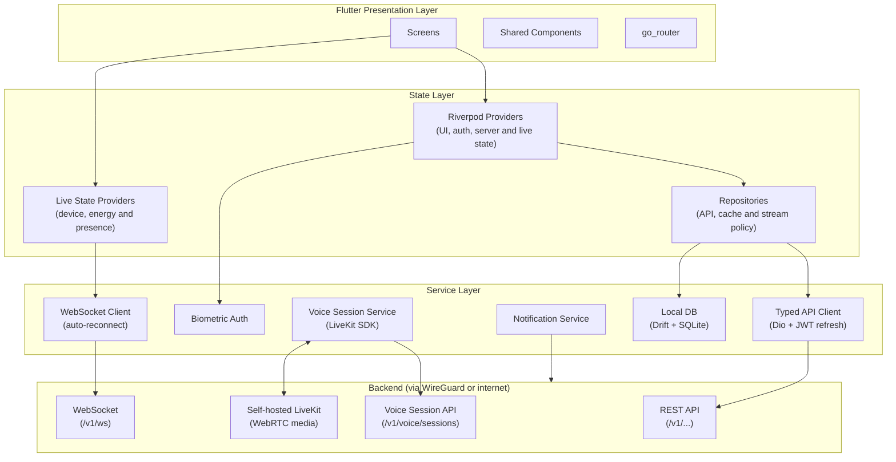

# Chapter 13 — Mobile Application

**AI Home OS Internal Design Specification**  
**Classification:** Internal — Engineering  
**Status:** Draft specification v1.1
**Date:** 2026-09-16

> **Implementation status:** Specification only. Nothing in this chapter has been implemented or validated yet. Unless explicitly marked otherwise, code, schemas, configurations, performance figures, and operational flows are illustrative proposals. See [IMPLEMENTATION_STATUS.md](../IMPLEMENTATION_STATUS.md).

> **Framework decision:** Flutter is the client presentation framework. It does not run the AI, automation, authorization, or device-control backend. Android, iOS, wall-panel web, and application-style administration targets share selected Dart packages while retaining separate permissions and navigation.

---

## Table of Contents

1. [Overview](#1-overview)
2. [Design Philosophy & Visual Language](#2-design-philosophy--visual-language)
3. [Technology Stack](#3-technology-stack)
4. [App Architecture](#4-app-architecture)
5. [Navigation Structure](#5-navigation-structure)
6. [Screen: Onboarding & Authentication](#6-screen-onboarding--authentication)
7. [Screen: Home Dashboard](#7-screen-home-dashboard)
8. [Screen: JARVIS Voice Interface](#8-screen-jarvis-voice-interface)
9. [Screen: Rooms & Devices](#9-screen-rooms--devices)
10. [Screen: Device Detail](#10-screen-device-detail)
11. [Screen: Automations](#11-screen-automations)
12. [Screen: Energy Dashboard](#12-screen-energy-dashboard)
13. [Screen: Security & Cameras](#13-screen-security--cameras)
14. [Screen: Persons & Identity](#14-screen-persons--identity)
15. [Screen: Notifications & Alerts](#15-screen-notifications--alerts)
16. [Screen: Settings](#16-screen-settings)
17. [State Management](#17-state-management)
18. [Real-Time Control Data (WebSocket)](#18-real-time-control-data-websocket)
19. [Offline Mode](#19-offline-mode)
20. [Push Notifications](#20-push-notifications)
21. [Biometric Authentication](#21-biometric-authentication)
22. [Home Screen Widgets](#22-home-screen-widgets)
23. [Accessibility](#23-accessibility)
24. [Performance Targets](#24-performance-targets)
25. [Local Database Schema](#25-local-database-schema)
26. [Design Decisions & Trade-offs](#26-design-decisions--trade-offs)
27. [Risks](#27-risks)
28. [Future Improvements](#28-future-improvements)
29. [References](#29-references)

---

## 1. Overview

The AI Home OS mobile app is the primary interface for household members to interact with JARVIS away from the home, review home status, control devices, manage automations, and respond to security alerts. It is a **companion** to the always-on JARVIS voice interface — not a replacement.

### App Capabilities Summary

| Capability | Description |
|-----------|-------------|
| **Live home status** | See who is home, what is on, energy state, at a glance |
| **Voice commands** | Talk to JARVIS from anywhere via app microphone |
| **Device control** | Control any device in any room |
| **Automation management** | Create, edit, enable, and monitor automations |
| **Energy monitoring** | Live power flows, forecasts, EV charge status, cost |
| **Security** | Live camera feeds, alert management, alarm control |
| **Notifications** | Real-time alerts, energy reports, presence events |
| **Presence** | See where each family member is (home/away/room) |
| **Offline mode** | View cached state; new actions wait for connectivity and then follow the server-owned delivery policy |

The mobile application is a resident interface rather than the infrastructure administration console. Initial setup, Home Assistant entity mapping, service health, backup/recovery, provider configuration, and platform-wide audit inspection belong to the administration web application defined in Chapter 17.

---

## 2. Design Philosophy & Visual Language

### 2.1 Core Design Principles

| Principle | Application |
|-----------|------------|
| **Clarity over decoration** | Every UI element has a clear purpose. No decorative elements. |
| **Information first** | Status and data visible immediately — no buried menus |
| **Dark theme default** | Command centres and control panels are dark; dark reduces eye strain at night |
| **Flat, solid colours** | No gradients. Colour communicates meaning (state, severity) not aesthetics |
| **Touch efficiency** | Critical actions reachable in 2 taps or less from any screen |
| **Readable data** | Numbers, times, and units are large and clearly formatted |

### 2.2 Colour Palette

```
Background:
  Primary bg:    #0F0F11   (near-black)
  Surface:       #1A1A1F   (card background)
  Surface alt:   #24242B   (elevated card / modal)
  Border:        #2E2E38

Text:
  Primary text:  #F0F0F5   (near-white)
  Secondary:     #9090A0
  Disabled:      #505060

Semantic colours (flat, no gradient):
  Active/On:     #2ECC71   (solid green)
  Off/Idle:      #505060   (muted grey)
  Warning:       #F39C12   (amber)
  Danger/Alert:  #E74C3C   (red)
  Info/AI:       #3498DB   (blue — JARVIS accent)
  Energy:        #F1C40F   (solar/energy yellow)
  Security:      #9B59B6   (purple)
  Guest:         #1ABC9C   (teal)

Status indicator dot sizes:
  Small (16px): device state indicators
  Medium (24px): room occupancy
  Large (32px): home mode indicator
```

### 2.3 Typography

```
Font: Inter (variable weight)

Headings:
  H1: 28px / Bold   — screen title
  H2: 22px / SemiBold — section header
  H3: 18px / SemiBold — card title

Body:
  Body:   16px / Regular
  Small:  13px / Regular
  Micro:  11px / Medium — labels, badges

Data/Numbers:
  Metric: 36px / Bold (Tabular Numbers) — energy readings, temps
  Label:  12px / Medium — unit labels under metrics
```

---

## 3. Technology Stack

| Concern | Choice | Rationale |
|---------|--------|-----------|
| **Framework** | Flutter | Shared application framework for Android, iOS, tablets, wall panels, web, and possible desktop clients |
| **Language** | Dart | Sound null safety, ahead-of-time mobile compilation, and one language across supported clients |
| **Navigation** | `go_router` | Declarative routes, deep links, guarded routes, and restoration |
| **State** | Riverpod | Testable dependency injection and explicit asynchronous state |
| **WebSocket** | `web_socket_channel` behind a repository | Control-plane device, energy, and presence updates |
| **HTTP client** | Dio behind a typed API client | JWT refresh, retry policy, cancellation, and request tracing |
| **Local DB** | Drift on SQLite | Typed offline cache, migrations, and observable queries |
| **Voice** | LiveKit Flutter SDK | Full-duplex WebRTC through the self-hosted media plane |
| **Push notifications** | Firebase Messaging with APNs/FCM adapters | Cross-platform push delivery; the server remains authoritative |
| **Biometrics** | `local_auth` | Face ID, Touch ID, and Android biometrics for local confirmation |
| **Secrets** | `flutter_secure_storage` | OS-backed storage for refresh tokens and device credentials |
| **Camera streaming** | WebRTC through a camera-session abstraction | Low-latency feeds without exposing camera credentials |
| **Charts** | Custom painters or a vetted Flutter chart package | Accessible energy charts with flat, solid styling |
| **Icons** | Material Symbols plus project-owned SVG assets | Consistent icons without binding the design system to React packages |
| **Testing** | Dart tests, Flutter widget tests, and `integration_test` | Unit, component, accessibility, and end-to-end coverage |

---

## 4. App Architecture



---

## 5. Navigation Structure

```
Root Navigator (Stack)
├── Auth Stack
│   ├── WelcomeScreen
│   ├── LoginScreen
│   └── MFAScreen
│
└── Main Tab Navigator
    ├── Tab: Home (house icon)
    │   └── HomeScreen
    │       ├── → RoomScreen (room tap)
    │       │   └── → DeviceDetailScreen (device tap)
    │       └── → AlertDetailScreen (alert tap)
    │
    ├── Tab: JARVIS (microphone icon)
    │   └── VoiceScreen
    │
    ├── Tab: Energy (lightning icon)
    │   └── EnergyScreen
    │       └── → EnergyHistoryScreen
    │
    ├── Tab: Security (shield icon)
    │   ├── SecurityScreen
    │   │   ├── → CameraFeedScreen (camera tap)
    │   │   └── → AlertDetailScreen
    │   └── AlertsScreen
    │
    └── Tab: Menu (grid icon)
        ├── AutomationsScreen
        │   ├── → AutomationDetailScreen
        │   └── → AutomationEditorScreen
        ├── PersonsScreen
        │   └── → PersonDetailScreen
        ├── NotificationsScreen
        └── SettingsScreen
            ├── IntegrationsScreen
            ├── SecuritySettingsScreen
            └── AppearanceScreen
```

---

## 6. Screen: Onboarding & Authentication

### 6.1 Welcome Screen

```
┌─────────────────────────────────────┐
│                                     │
│                                     │
│         ●  AI Home OS              │
│                                     │
│    Your home. Intelligent.          │
│                                     │
│                                     │
│    [  Connect to your home  ]       │
│                                     │
│    Don't have a setup yet?          │
│    View setup guide                 │
│                                     │
└─────────────────────────────────────┘

Background: #0F0F11
Logo: solid white circle + "AI Home OS" wordmark
Button: solid #3498DB, rounded 12px
```

### 6.2 Login Screen

```
┌─────────────────────────────────────┐
│  ←                                  │
│                                     │
│  Sign in                            │
│                                     │
│  ┌─────────────────────────────────┐│
│  │ ahmad@home.local                ││
│  └─────────────────────────────────┘│
│                                     │
│  ┌─────────────────────────────────┐│
│  │ Password              [👁]       ││
│  └─────────────────────────────────┘│
│                                     │
│  ┌─────────────────────────────────┐│
│  │         Sign In                 ││
│  └─────────────────────────────────┘│
│                                     │
│  ──────── or ────────               │
│                                     │
│  [  Face ID / Fingerprint  ]        │
│                                     │
│  Forgot password?                   │
└─────────────────────────────────────┘
```

### 6.3 MFA Screen

```
┌─────────────────────────────────────┐
│  ←  Two-factor authentication       │
│                                     │
│  Enter the 6-digit code from        │
│  your authenticator app.            │
│                                     │
│  ┌─────────────────────────────────┐│
│  │     [ ]  [ ]  [ ]  [ ]  [ ]  [ ]││
│  └─────────────────────────────────┘│
│                                     │
│  Code expires in  28s               │
│                                     │
│  Didn't receive it? Resend          │
│                                     │
│  [       Verify       ]             │
└─────────────────────────────────────┘
```

### 6.4 Authentication Flow (Code)

```dart
// Authentication is coordinated by Riverpod; tokens stay in secure storage.
final authControllerProvider = AsyncNotifierProvider<AuthController, AuthSession?>(
  AuthController.new,
);

class AuthController extends AsyncNotifier<AuthSession?> {
  @override
  Future<AuthSession?> build() => ref.read(authRepositoryProvider).restore();

  Future<void> signIn(String email, String password) async {
    state = const AsyncLoading();
    state = await AsyncValue.guard(
      () => ref.read(authRepositoryProvider).signIn(email, password),
    );
  }
}
```

---

## 7. Screen: Home Dashboard

The Home Dashboard is the **primary screen** — users see it immediately after login. It must communicate the complete home state in a single glance.

### 7.1 Home Dashboard Wireframe

```
┌─────────────────────────────────────┐
│  Good morning, Ahmad         14:22  │
│  ● Home · 2 people · Sunny 32°C    │
│                                     │
│ ┌───────────────────────────────┐   │
│ │  ⚡ Solar  3.4 kW             │   │
│ │  🔋 Battery  78%              │   │
│ │  Grid  –0.8 kW (exporting)   │   │
│ └───────────────────────────────┘   │
│                                     │
│  Rooms                    See all   │
│ ┌──────────────┐  ┌──────────────┐  │
│ │  Living Room │  │    Kitchen   │  │
│ │  ● 1 person  │  │  ● 1 person  │  │
│ │  🌡 24°C     │  │  🌡 25°C     │  │
│ │  💡 4 lights  │  │  💡 2 lights  │  │
│ └──────────────┘  └──────────────┘  │
│ ┌──────────────┐  ┌──────────────┐  │
│ │    Office    │  │    Master    │  │
│ │  ● Ahmad     │  │  ○ empty     │  │
│ │  🌡 22°C     │  │  🌡 23°C     │  │
│ │  💡 1 light   │  │  💡 off      │  │
│ └──────────────┘  └──────────────┘  │
│                                     │
│  Recent Activity                    │
│  14:20  Living room lights turned   │
│         off (Ahmad, voice)          │
│  13:45  Front door opened  (Sara)   │
│  09:30  Washing machine started     │
│                                     │
│  ⚠ 1 alert  →  View                │
│                                     │
│ [Home]  [JARVIS]  [Energy] [Security] [Menu] │
└─────────────────────────────────────┘
```

### 7.2 Home Dashboard Implementation

```dart
class HomeDashboard extends ConsumerWidget {
  const HomeDashboard({super.key});

  @override
  Widget build(BuildContext context, WidgetRef ref) {
    final summary = ref.watch(homeSummaryProvider);
    return summary.when(
      loading: () => const Center(child: CircularProgressIndicator()),
      error: (error, _) => ErrorCard(message: error.toString()),
      data: (value) => HomeSummaryView(summary: value),
    );
  }
}
```

### 7.3 Home Status Cards

```dart
class EnergyStatusCard extends StatelessWidget {
  const EnergyStatusCard({required this.energy, super.key});
  final EnergySnapshot energy;

  @override
  Widget build(BuildContext context) => StatusCard(
    label: energy.gridWatts < 0 ? 'Exporting' : 'Importing',
    value: '${energy.gridWatts.abs()} W',
    semanticLabel: 'Grid ${energy.gridWatts < 0 ? 'export' : 'import'}',
  );
}
```

---

## 8. Screen: JARVIS Voice Interface

The Voice screen is the primary way to give complex commands. It mirrors the JARVIS audio experience on the phone.

### 8.1 Voice Screen Wireframe

```
┌─────────────────────────────────────┐
│                              [✕]    │
│                                     │
│                                     │
│         ╔═══════════════╗           │
│         ║               ║           │
│         ║   JARVIS      ║           │
│         ║               ║           │
│         ╚═══════════════╝           │
│                                     │
│     Tap and speak, or type below.   │
│                                     │
│         ┌─────────────┐             │
│         │  ( hold )   │             │  ← Hold-to-talk microphone button
│         └─────────────┘             │     Solid blue when active
│                                     │
│  ───────────────────────────────    │
│                                     │
│  Previous:                          │
│  ╭─────────────────────────────╮   │
│  │ You: Turn off the living     │   │
│  │      room lights.            │   │
│  ╰─────────────────────────────╯   │
│  ╭─────────────────────────────╮   │
│  │ JARVIS: Done — all 4 lights  │   │
│  │ in the living room are off.  │   │
│  ╰─────────────────────────────╯   │
│                                     │
│  ┌─────────────────────────────┐   │
│  │ Type a command...       [→] │   │
│  └─────────────────────────────┘   │
└─────────────────────────────────────┘

States:
  Idle:      Blue ring, static
  Listening: Animated ring pulses (no gradient — opacity animation only)
  Processing: Ring spins
  Speaking:  Audio waveform bars (flat amplitude bars, no fill gradient)
```

### 8.2 Voice Recording Implementation

The mobile client does not stream microphone bytes through `/v1/ws` and does not contact ElevenLabs directly. It asks AI Home OS to create an authorized voice session, then joins the returned self-hosted LiveKit room. AI Home OS owns STT, reasoning, provider selection, consent checks, tool policy, and ElevenLabs credentials.

```dart
class VoiceSessionController extends AsyncNotifier<VoiceSessionState> {
  @override
  Future<VoiceSessionState> build() async => const VoiceSessionState.idle();

  Future<void> connect() async {
    final grant = await ref.read(apiProvider).createVoiceSession();
    final room = Room();
    await room.connect(grant.liveKitUrl, grant.participantToken);
    state = AsyncData(VoiceSessionState.connected(room));
  }
}
```

The client displays the cloud-processing indicator before AI Home OS sends response text to ElevenLabs and keeps it visible until synthesis finishes. The user can end the session or disable the cloud voice at any time. Losing LiveKit connectivity never causes a switch to another cloud path; the interface offers typed input or a new explicitly created session.

### 8.3 JARVIS Avatar Component

```dart
class JarvisOrb extends StatelessWidget {
  const JarvisOrb({required this.state, super.key});
  final VoiceActivityState state;

  @override
  Widget build(BuildContext context) => Semantics(
    label: state.accessibleLabel,
    child: AnimatedContainer(
      duration: const Duration(milliseconds: 180),
      decoration: BoxDecoration(shape: BoxShape.circle, color: state.color),
    ),
  );
}
```

---

## 9. Screen: Rooms & Devices

### 9.1 Rooms Screen Wireframe

```
┌─────────────────────────────────────┐
│  Rooms                    [+ Add]   │
│                                     │
│  ┌───────────────────────────────┐  │
│  │ 🔍 Search rooms or devices... │  │
│  └───────────────────────────────┘  │
│                                     │
│  Ground Floor                       │
│ ┌─────────────────────────────────┐ │
│ │  Living Room          ● Ahmad   │ │
│ │  3 on / 6 total  ·  24°C  65%  │ │
│ │  ░░░░░░░░░░░░░░░░░░░░░░░░░░░ → │ │
│ └─────────────────────────────────┘ │
│ ┌─────────────────────────────────┐ │
│ │  Kitchen              ● Sara    │ │
│ │  2 on / 5 total  ·  25°C  68%  │ │
│ │  ░░░░░░░░░░░░░░░░░░░░░░░░░░░ → │ │
│ └─────────────────────────────────┘ │
│ ┌─────────────────────────────────┐ │
│ │  Entrance             ○ empty   │ │
│ │  0 on / 3 total  ·  24°C       │ │
│ │  ░░░░░░░░░░░░░░░░░░░░░░░░░░░ → │ │
│ └─────────────────────────────────┘ │
│                                     │
│  First Floor                        │
│ ┌─────────────────────────────────┐ │
│ │  Office               ● Ahmad   │ │
│ ...                                 │
└─────────────────────────────────────┘
```

### 9.2 Room Detail Screen Wireframe

```
┌─────────────────────────────────────┐
│  ←  Living Room          ● Ahmad   │
│                                     │
│  24°C   65%RH   420ppm CO₂   Normal│
│                                     │
│  Lights                 All off  ⌄  │
│  ┌────────────┐  ┌────────────┐    │
│  │  Main      │  │  Lamp      │    │
│  │  ●  ON     │  │  ●  ON     │    │
│  │  [——●——]   │  │  [——●——]   │    │  ← brightness slider
│  │  75%  3k K │  │  100% 2.7k │    │
│  └────────────┘  └────────────┘    │
│  ┌────────────┐  ┌────────────┐    │
│  │  Ceiling   │  │  Bookcase  │    │
│  │  ○  OFF    │  │  ○  OFF    │    │
│  │  [●——————] │  │  [●——————] │    │
│  └────────────┘  └────────────┘    │
│                                     │
│  Climate                            │
│  ┌─────────────────────────────┐   │
│  │  A/C   ●  Cooling   [-] 23 [+]  │
│  └─────────────────────────────┘   │
│                                     │
│  Scenes                             │
│  [Movie]  [Dinner]  [Relax]  [Off] │
│                                     │
│  Say something...   🎤              │
└─────────────────────────────────────┘
```

---

## 10. Screen: Device Detail

### 10.1 Light Detail Wireframe

```
┌─────────────────────────────────────┐
│  ←  Main Light — Living Room        │
│                                     │
│         ●  ON                       │
│    [  Turn Off  ]                   │
│                                     │
│  Brightness                     75% │
│  ┌─────────────────────────────┐   │
│  │   ●─────────────────────── │   │  ← flat track
│  └─────────────────────────────┘   │
│                                     │
│  Colour Temperature            3000K│
│  Warm ──────●───────────────── Cool │
│  2700K                        6500K │
│                                     │
│  Schedule                           │
│  ┌─────────────────────────────┐   │
│  │  On at 18:30  weekdays      │   │
│  │  Off at 23:00               │   │
│  │                  [Edit]     │   │
│  └─────────────────────────────┘   │
│                                     │
│  History (today)                    │
│  14:22  Turned off  (Ahmad, voice)  │
│  14:00  Turned on   (automation)    │
│  12:00  Turned off  (Sara, app)     │
│                                     │
│  Device info                        │
│  IKEA TRADFRI E26  ·  Zigbee        │
│  Firmware: 2.3.087  ·  VLAN: 30    │
└─────────────────────────────────────┘
```

### 10.2 Device Control Implementation

```dart
Future<void> setDeviceState(DeviceCommand command, WidgetRef ref) async {
  final previous = ref.read(deviceStateProvider(command.entityId));
  ref.read(deviceStateProvider(command.entityId).notifier).applyOptimistic(command);
  try {
    await ref.read(deviceRepositoryProvider).execute(command);
  } catch (_) {
    ref.read(deviceStateProvider(command.entityId).notifier).replace(previous);
    rethrow;
  }
}
```

---

## 11. Screen: Automations

### 11.1 Automations List Wireframe

```
┌─────────────────────────────────────┐
│  Automations               [+ New]  │
│                                     │
│  [All]  [Active]  [Learned]         │
│                                     │
│  ┌─────────────────────────────┐   │
│  │  🌅 Morning Routine         │   │
│  │  Weekdays 06:30  ·  Always  │   │
│  │  Last run: Today 06:30      │   │
│  │                      ● ─── │   │  ← toggle switch
│  └─────────────────────────────┘   │
│  ┌─────────────────────────────┐   │
│  │  🚗 Arrival — Ahmad         │   │
│  │  When Ahmad arrives home    │   │
│  │  Last run: Today 18:14      │   │
│  │                      ● ─── │   │
│  └─────────────────────────────┘   │
│  ┌─────────────────────────────┐   │
│  │  ☀ Solar Surplus Washer     │   │
│  │  AI learned · 3.2 kW solar  │   │
│  │  Last run: Yesterday 14:00  │   │
│  │                      ● ─── │   │
│  └─────────────────────────────┘   │
│                                     │
│  Create from voice:                 │
│  ┌─────────────────────────────┐   │
│  │ 🎤 "When I get home, turn   │   │
│  │     on the living room..."  │   │
│  └─────────────────────────────┘   │
└─────────────────────────────────────┘
```

### 11.2 Automation Editor Screen

```
┌─────────────────────────────────────┐
│  ←  Edit Automation          [Save] │
│                                     │
│  Name                               │
│  ┌─────────────────────────────┐   │
│  │ Morning Routine             │   │
│  └─────────────────────────────┘   │
│                                     │
│  TRIGGER  ┌──────────────────────┐ │
│  ▼         │  Time  06:30         │ │
│            │  Days: Mon–Fri       │ │
│            └──────────────────────┘ │
│            [+ Add trigger]          │
│                                     │
│  CONDITIONS                         │
│  ▼  ┌────────────────────────────┐ │
│     │ Someone is home            │ │
│     └────────────────────────────┘ │
│     [+ Add condition]               │
│                                     │
│  ACTIONS                            │
│  ▼  ┌────────────────────────────┐ │
│  1  │ Set bedroom lights 20%     │ │
│     │ Transition: 10 min          │ │
│     └────────────────────────────┘ │
│  ┌────────────────────────────┐    │
│  2  │ Play news briefing       │    │
│     └────────────────────────┘     │
│  ┌────────────────────────────┐    │
│  3  │ Set A/C to 22°C          │    │
│     └────────────────────────┘     │
│  [+ Add action]                     │
│                                     │
│  [  Dry Run  ]  [  Delete  ]        │
└─────────────────────────────────────┘
```

---

## 12. Screen: Energy Dashboard

### 12.1 Energy Dashboard Wireframe

```
┌─────────────────────────────────────┐
│  Energy                   Today  ⌄  │
│                                     │
│  ┌─────────────────────────────┐   │
│  │  LIVE                       │   │
│  │                             │   │
│  │   Solar    Battery   Grid   │   │
│  │   ☀ 3.4kW  🔋 78%  ─0.8kW  │   │
│  │              ↕              │   │
│  │         Home: 1.8 kW        │   │
│  └─────────────────────────────┘   │
│                                     │
│  Today                              │
│  ┌─────────────────────────────┐   │
│  │  Generated:    14.7 kWh ☀  │   │
│  │  Used:         11.2 kWh 🏠  │   │
│  │  Exported:      3.5 kWh →   │   │
│  │  Imported:      0.0 kWh ←   │   │
│  │  Net cost:   −0.30 AED  ✓   │   │
│  └─────────────────────────────┘   │
│                                     │
│  Generation (today)                 │
│  ┌─────────────────────────────┐   │
│  │ kW                          │   │
│  │  8│     ▄▄▄▄               │   │
│  │  6│   ▄▄    ▄▄             │   │
│  │  4│  ▄        ▄            │   │  ← solid bar chart (no gradient)
│  │  2│ ▄          ▄           │   │
│  │  0└──────────────────────  │   │
│  │   6  9  12  15  18  21    │   │
│  └─────────────────────────────┘   │
│                                     │
│  Consumption by device              │
│  HVAC       ████████░░░░   4.2 kWh │
│  EV         ██████░░░░░░   3.1 kWh │
│  Pool       ████░░░░░░░░   1.8 kWh │
│  Kitchen    ███░░░░░░░░░   1.2 kWh │
│  Other      ███░░░░░░░░░   0.9 kWh │
│                                     │
│  EV Charging                        │
│  ┌─────────────────────────────┐   │
│  │  Tesla Model 3              │   │
│  │  ⬛⬛⬛⬛⬛⬛⬛⬛⬛░░░  78%    │   │
│  │  Charging  ·  3.4 kW solar  │   │
│  │  Ready by  07:00 (100%)     │   │
│  └─────────────────────────────┘   │
└─────────────────────────────────────┘
```

### 12.2 Power Flow Diagram Component

```dart
class PowerFlow extends StatelessWidget {
  const PowerFlow({required this.snapshot, super.key});
  final EnergySnapshot snapshot;

  @override
  Widget build(BuildContext context) => CustomPaint(
    painter: PowerFlowPainter(snapshot),
    child: Semantics(label: snapshot.accessibleSummary),
  );
}
```

---

## 13. Screen: Security & Cameras

### 13.1 Security Overview Wireframe

```
┌─────────────────────────────────────┐
│  Security                           │
│                                     │
│  Alarm                              │
│  ┌─────────────────────────────┐   │
│  │  ● Armed — Away             │   │
│  │  Triggered by: nobody home  │   │
│  │  [  Disarm  ]  (MFA needed) │   │
│  └─────────────────────────────┘   │
│                                     │
│  Active Alerts  (1)                 │
│  ┌─────────────────────────────┐   │
│  │  ⚠ MEDIUM                  │   │
│  │  Unknown IoT device         │   │
│  │  MAC d8:3a:dd:xx  ·  09:11  │   │
│  │  [Acknowledge]  [Details]   │   │
│  └─────────────────────────────┘   │
│                                     │
│  Cameras                  [2×2] [⊞]│
│                                     │
│  ┌──────────────┐  ┌──────────────┐│
│  │  Front Door  │  │  Back Garden │││
│  │  [live feed] │  │  [live feed] │││
│  │  ● No motion │  │  ● Motion    │││
│  └──────────────┘  └──────────────┘│
│  ┌──────────────┐  ┌──────────────┐│
│  │  Garage      │  │  Entrance    │││
│  │  [live feed] │  │  [live feed] │││
│  │  ● Idle      │  │  ● Person    │││
│  └──────────────┘  └──────────────┘│
│                                     │
│  Recent events                      │
│  14:20  Ahmad — Front Door          │
│  13:58  Motion — Back Garden        │
└─────────────────────────────────────┘
```

### 13.2 Camera Feed Screen

```dart
class CameraFeed extends ConsumerWidget {
  const CameraFeed({required this.cameraId, super.key});
  final String cameraId;

  @override
  Widget build(BuildContext context, WidgetRef ref) {
    final session = ref.watch(cameraSessionProvider(cameraId));
    return session.when(
      data: (feed) => SecureWebRtcView(feed: feed),
      loading: () => const CameraPlaceholder(),
      error: (error, _) => CameraError(message: error.toString()),
    );
  }
}
```

---

## 14. Screen: Persons & Identity

### 14.1 Persons List Wireframe

```
┌─────────────────────────────────────┐
│  People                    [+]      │
│                                     │
│  HOME NOW (2)                       │
│  ┌────────────────────────────────┐ │
│  │  🟢 Ahmad                      │ │
│  │  Office  ·  Confidence: High   │ │
│  │  Last seen: now  ·  Owner      │ │
│  └────────────────────────────────┘ │
│  ┌────────────────────────────────┐ │
│  │  🟢 Sara                       │ │
│  │  Kitchen  ·  Confidence: High  │ │
│  │  Last seen: 2 min ago          │ │
│  └────────────────────────────────┘ │
│                                     │
│  AWAY (1)                           │
│  ┌────────────────────────────────┐ │
│  │  ⚫ Khalid                      │ │
│  │  Last home: 3 hours ago        │ │
│  └────────────────────────────────┘ │
│                                     │
│  GUESTS (1)                         │
│  ┌────────────────────────────────┐ │
│  │  🔵 John (Guest)               │ │
│  │  Expires: Today 23:00          │ │
│  └────────────────────────────────┘ │
└─────────────────────────────────────┘
```

---

## 15. Screen: Notifications & Alerts

### 15.1 Notifications Screen Wireframe

```
┌─────────────────────────────────────┐
│  Notifications              [Clear] │
│                                     │
│  Today                              │
│  ┌─────────────────────────────┐   │
│  │  🔴 MEDIUM ALERT         09:11  │
│  │  Unknown device on IoT VLAN     │
│  │  MAC d8:3a:dd:xx                │
│  └─────────────────────────────┘   │
│  ┌─────────────────────────────┐   │
│  │  ⚡ Energy              14:00  │
│  │  Solar surplus: running         │
│  │  washing machine now            │
│  └─────────────────────────────┘   │
│  ┌─────────────────────────────┐   │
│  │  🚗 EV Charging         08:00  │
│  │  Tesla charged to 80%.          │
│  │  Used 24 kWh solar (free).      │
│  └─────────────────────────────┘   │
│  ┌─────────────────────────────┐   │
│  │  🌅 Good morning        06:30  │
│  │  Briefing: 32°C, sunny.         │
│  │  No meetings today.             │
│  └─────────────────────────────┘   │
│                                     │
│  Yesterday                          │
│  ...                                │
└─────────────────────────────────────┘
```

---

## 16. Screen: Settings

### 16.1 Settings Screen Wireframe

```
┌─────────────────────────────────────┐
│  Settings                           │
│                                     │
│  Account                            │
│  ┌─────────────────────────────┐   │
│  │  Ahmad Al-Rashidi           │   │
│  │  Owner  ·  ahmad@home.local │   │
│  │  [Manage account]        →  │   │
│  └─────────────────────────────┘   │
│                                     │
│  Security                           │
│  Change password               →    │
│  Two-factor authentication  ● ON →  │
│  Active sessions               →    │
│                                     │
│  Connections                        │
│  Home server         Connected  ●   │
│  VPN (WireGuard)       Auto  ● ON   │
│  Notifications         Enabled  ●   │
│                                     │
│  Integrations                       │
│  Google Calendar     Connected  →   │
│  Spotify             Connected  →   │
│  Tibber              Connected  →   │
│  [+ Add integration]                │
│                                     │
│  Appearance                         │
│  Theme:  [Dark]  [Light]  [System]  │
│  Language:  English  →              │
│                                     │
│  Data & Privacy                     │
│  My data & privacy             →    │
│  Delete my account             →    │
│                                     │
│  App                                │
│  Version: 1.0.0 (build 142)        │
│  [Send feedback]                    │
└─────────────────────────────────────┘
```

---

## 17. State Management

### 17.1 Riverpod Authentication Controller

```dart
@riverpod
class AuthSessionController extends _$AuthSessionController {
  @override
  Future<AuthSession?> build() => ref.read(authRepositoryProvider).restore();

  Future<void> signOut() async {
    await ref.read(authRepositoryProvider).clearCredentials();
    state = const AsyncData(null);
  }
}
```

### 17.2 Live-State Stream Provider

```dart
@riverpod
class LiveHomeState extends _$LiveHomeState {
  @override
  Stream<HomeEvent> build() => ref.read(homeEventRepositoryProvider).events();
}
```

---

## 18. Real-Time Control Data (WebSocket)

This socket carries state and application events. LiveKit carries conversational audio as defined in Section 8 and Chapter 12, Section 4.5.

### 18.1 WebSocket Client with Auto-Reconnect

```dart
class HomeSocketClient {
  Stream<HomeEvent> connect(Uri endpoint, String token) async* {
    var delay = const Duration(seconds: 1);
    while (true) {
      try {
        final channel = WebSocketChannel.connect(endpoint, protocols: [token]);
        await for (final message in channel.stream) {
          delay = const Duration(seconds: 1);
          yield HomeEvent.fromJson(jsonDecode(message as String));
        }
      } catch (_) {
        await Future<void>.delayed(delay);
        delay = Duration(seconds: (delay.inSeconds * 2).clamp(1, 30));
      }
    }
  }
}
```

---

## 19. Offline Mode

When the phone cannot reach the home server (no VPN, no internet), the app enters offline mode:

```dart
class PendingCommand {
  PendingCommand({required this.id, required this.command, required this.createdAt});
  final String id;
  final DeviceCommand command;
  final DateTime createdAt;
}

// Only server-declared queueable and idempotent commands may be stored locally.
```

```dart
Future<void> replayPendingCommands() async {
  for (final item in await pendingCommandStore.queue()) {
    final result = await api.execute(item.command, idempotencyKey: item.id);
    if (result.isFinal) await pendingCommandStore.remove(item.id);
  }
}
```

**Offline capabilities:**

| Capability | Offline behaviour |
|-----------|------------------|
| View device states | Shows last cached state from Drift/SQLite |
| Send commands | Apply the Chapter 12 action delivery policy; show the pending or rejected outcome and never queue sensitive actions |
| View energy history | Available from local cache |
| View automations | Available from local cache |
| Receive notifications | Disabled (no server connection) |
| Camera feeds | Unavailable |
| Voice commands | Unavailable; the user may type a new request after reconnecting, subject to the action delivery policy |

---

## 20. Push Notifications

### 20.1 Notification Categories

| Category | Priority | Sound | Wake |
|----------|---------|-------|------|
| `security.critical` | High | Alarm tone | Yes (bypass DND) |
| `security.alert` | High | Alert tone | Yes |
| `presence.arrival` | Normal | Soft chime | No |
| `energy.report` | Normal | None | No |
| `automation.completed` | Low | None | No |
| `system.maintenance` | Low | None | No |

### 20.2 Push Notification Handler

```dart
Future<void> configurePushNotifications() async {
  final permission = await FirebaseMessaging.instance.requestPermission();
  if (permission.authorizationStatus == AuthorizationStatus.authorized) {
    final token = await FirebaseMessaging.instance.getToken();
    if (token != null) await api.registerPushToken(token);
  }
}
```

---

## 21. Biometric Authentication

```dart
Future<bool> confirmSensitiveAction(String reason) async {
  final localAuth = LocalAuthentication();
  return localAuth.authenticate(
    localizedReason: reason,
    options: const AuthenticationOptions(biometricOnly: true),
  );
}
```

---

## 22. Home Screen Widgets

### 22.1 iOS and Android Home-Screen Widgets

```dart
// Home-screen widgets use a small platform channel boundary.
const widgetChannel = MethodChannel('ai.home.os/widgets');

Future<void> refreshHomeWidget(HomeSummary summary) async {
  await widgetChannel.invokeMethod<void>('refresh', summary.toJson());
}
```

---

## 23. Accessibility

| Feature | Implementation |
|---------|--------------|
| **Dynamic type** | Flutter text scaling follows the platform accessibility settings |
| **VoiceOver / TalkBack** | Flutter `Semantics` labels and values on interactive elements |
| **Colour contrast** | All text/background pairs meet WCAG AA (4.5:1) |
| **Touch targets** | Minimum 44×44 pt (Apple HIG) |
| **Semantic elements** | `Semantics` roles, labels, values, and actions for controls |
| **No colour-only information** | Icons + text alongside colour indicators |
| **Motion reduction** | Check platform accessible-navigation settings before animation |

```dart
Semantics(
  button: true,
  label: 'Living room lights',
  value: light.isOn ? 'On, ${light.brightness} percent' : 'Off',
  child: DeviceTile(device: light),
)
```

---

## 24. Performance Targets

| Metric | Target | Measurement |
|--------|--------|------------|
| **App launch (cold)** | < 2.0 s | Flutter DevTools profile build |
| **Home Dashboard render** | < 200 ms | Flutter frame and rebuild profiling |
| **Device state update (WS)** | < 100 ms | WebSocket → UI re-render |
| **Command submission → response** | < 3.0 s | API latency P95 |
| **Camera feed start** | < 3.0 s | WebRTC negotiation |
| **Release download size** | Baseline and budget established during the first mobile prototype | Release artifact analysis |
| **Memory usage (idle)** | < 80 MB | Xcode Instruments |
| **Battery impact (background)** | < 1%/hr | iOS Battery usage report |

### 24.1 Performance Strategies

```dart
class RoomsGrid extends StatelessWidget {
  const RoomsGrid({required this.rooms, super.key});
  final List<RoomSummary> rooms;

  @override
  Widget build(BuildContext context) => GridView.builder(
    itemCount: rooms.length,
    gridDelegate: const SliverGridDelegateWithFixedCrossAxisCount(crossAxisCount: 2),
    itemBuilder: (_, index) => RepaintBoundary(child: RoomCard(room: rooms[index])),
  );
}
```

---

## 25. Local Database Schema

Drift with SQLite provides typed offline state caching and explicit migrations:

```dart
class CachedDevice extends Table {
  TextColumn get entityId => text()();
  TextColumn get stateJson => text()();
  DateTimeColumn get observedAt => dateTime()();
  @override
  Set<Column<Object>> get primaryKey => {entityId};
}
```

---

## 26. Design Decisions & Trade-offs

### 26.1 Flutter vs. Separate Native Applications

| Framework | Code reuse | Performance | Ecosystem | Team fit |
|-----------|-----------|-------------|----------|---------|
| **Flutter (choice)** | High across mobile, web panels, and desktop | Excellent | Mature Dart packages plus platform channels | One shared interface architecture |
| Native (Swift + Kotlin) | 0% | Best | Platform native | 2× development cost |

**Decision:** Flutter is the shared client framework. Mobile builds target Android and iOS, while the wall-panel build targets the web and runs in Chromium kiosk mode. Platform channels and narrowly scoped native extensions handle capabilities that do not have an acceptable cross-platform package. The backend APIs remain independent of Flutter.

### 26.2 Riverpod and Repository Boundaries

| Approach | Boilerplate | Learning curve | Server state | UI state |
|----------|-------------|---------------|-------------|---------|
| **Riverpod + repositories (choice)** | Low | Medium | Explicit cache and stream policy | Excellent |
| Bloc + repositories | Medium | Medium | Explicit | Excellent |
| Provider only | Low | Low | Requires custom conventions | Good |

**Decision:** Riverpod owns presentation and asynchronous state. Repository interfaces own HTTP, WebSocket, LiveKit, persistence, retry, and cache behaviour. Widgets never call transports or databases directly.

### 26.3 Flat Design (No Gradients)

Per project requirements, all UI colours are solid. This enforces:
- Colour communicates **meaning** (green = on, red = alert), not aesthetics
- Strong contrast for readability in daylight and at night
- Simpler implementation (no need for gradient libraries)

---

## 27. Risks

| Risk | Probability | Impact | Mitigation |
|------|-------------|--------|------------|
| iOS App Store rejection (camera/mic access) | Medium | High | Provide clear privacy usage descriptions; review Apple guidelines |
| Push notification delivery failure (DND, battery saver) | High | Medium | Critical alerts use APNs critical notifications (bypass DND) |
| WireGuard VPN battery drain on mobile | Medium | Medium | VPN connects only when home server unreachable without it |
| WebSocket reconnect loop on flaky network | Medium | Medium | Exponential backoff + jitter; max 30s delay |
| LiveKit room token exposed or used for another room | Low | High | Keep token in memory; short expiry and least-privilege room grants; never log; revoke on session end |
| Voice session drops on mobile network transition | Medium | Medium | LiveKit reconnection handling; explicit session state; no duplicate command execution; typed fallback |
| Cloud voice enabled without clear user awareness | Low | High | Server-side consent check and mobile provider indicator before and during ElevenLabs processing |
| Local DB corruption (Drift/SQLite) | Low | Medium | Versioned migrations; rebuild non-authoritative caches from the server |
| Token or biometric control compromised on a rooted or jailbroken device | Medium | High | Treat the device as untrusted; use platform hardware-backed storage where available, short-lived access tokens, refresh-token rotation and revocation, device registration, supported platform attestation signals, and fresh server-verified step-up authentication for sensitive actions; restrict or block sensitive capabilities when integrity requirements fail |

---

## 28. Future Improvements

| Improvement | Version | Description |
|-------------|---------|-------------|
| Apple CarPlay / Android Auto | v2 | Control home from car infotainment |
| Siri / Google Assistant shortcuts | v2 | "Hey Siri, tell JARVIS to turn off lights" |
| Apple Watch / Wear OS companion | v2 | Quick status + basic controls on wrist |
| Live Activities (iOS 16+) | v2 | Show EV charging progress on Lock Screen |
| 3D Touch / Haptic Engine | v2 | Quick actions from app icon |
| Augmented Reality room view | v3 | Point phone at room to see device overlays |
| Local processing fallback | v2 | Whisper.cpp on-device STT when server unreachable |
| Family sharing / multi-account | v2 | Seamless account switching for multiple homes |

---

## 29. References

1. **Flutter documentation** — https://docs.flutter.dev/
2. **Flutter supported platforms** — https://docs.flutter.dev/reference/supported-platforms
3. **Flutter accessibility** — https://docs.flutter.dev/ui/accessibility-and-internationalization/accessibility
4. **Riverpod** — https://riverpod.dev/
5. **go_router** — https://pub.dev/packages/go_router
6. **Dio** — https://pub.dev/packages/dio
7. **Drift** — https://drift.simonbinder.eu/
8. **local_auth** — https://pub.dev/packages/local_auth
9. **flutter_secure_storage** — https://pub.dev/packages/flutter_secure_storage
10. **Firebase Messaging for Flutter** — https://firebase.google.com/docs/cloud-messaging/flutter/client
11. **WCAG 2.2 — Accessibility Guidelines** — https://www.w3.org/TR/WCAG22/
12. **Apple Human Interface Guidelines** — https://developer.apple.com/design/
13. **Material Design 3** — https://m3.material.io/
14. **LiveKit Flutter SDK** — https://docs.livekit.io/home/client/connect/
15. **LiveKit Agents** — https://docs.livekit.io/agents/

---

*Previous: [Chapter 12 — API & Integration Layer](Chapter-12-API-and-Integration-Layer.md)*  
*Next: [Chapter 14 — Wall Panels](Chapter-14-Wall-Panels.md)*

---

> **Document maintained by:** AI Home OS Architecture Team  
> **Last updated:** 2026-09-16
> **Chapter status:** Draft v1.1 — Flutter architecture selected; implementation pending
