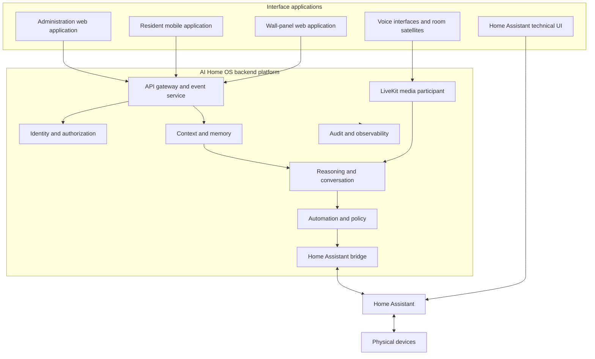
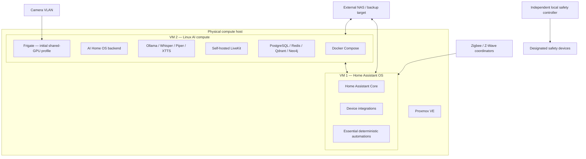

# Chapter 17 — Deployment and Application Architecture

**AI Home OS Internal Design Specification**  
**Classification:** Internal — Engineering  
**Status:** Draft specification v1.0  
**Date:** 2026-09-16

> **Implementation status:** Specification only. Nothing in this chapter has been implemented or validated yet. Resource allocations, topology, configurations, and operational flows are proposals that require measurement on the selected hardware. See [IMPLEMENTATION_STATUS.md](../IMPLEMENTATION_STATUS.md).

---

## Table of Contents

1. [Purpose and Authority](#1-purpose-and-authority)
2. [Product Shape](#2-product-shape)
3. [Application Boundaries](#3-application-boundaries)
4. [Residential Deployment Topology](#4-residential-deployment-topology)
5. [Proxmox Host Design](#5-proxmox-host-design)
6. [Home Assistant VM](#6-home-assistant-vm)
7. [AI Home OS Compute VM](#7-ai-home-os-compute-vm)
8. [Vision and GPU Placement](#8-vision-and-gpu-placement)
9. [Data and Backup Placement](#9-data-and-backup-placement)
10. [Network Flows](#10-network-flows)
11. [Failure Domains and Safety](#11-failure-domains-and-safety)
12. [Deployment Profiles](#12-deployment-profiles)
13. [Build and Validation Sequence](#13-build-and-validation-sequence)
14. [Acceptance Criteria](#14-acceptance-criteria)

---

## 1. Purpose and Authority

This chapter defines how the proposed AI Home OS applications and infrastructure fit together. It is authoritative for:

- the boundary between Home Assistant and AI Home OS;
- the boundary between backend services and user interfaces;
- the initial Proxmox virtual-machine topology;
- GPU, vision, storage, and network placement;
- failure isolation and local safety independence; and
- the order in which an implementation should be built and validated.

Chapter 1 remains authoritative for physical networking, cabling, power, storage hardware, and candidate compute sizing. Chapters 12–14 remain authoritative for APIs, mobile clients, and wall panels. Where those chapters show a single-container host for brevity, the virtual-machine boundary in this chapter takes precedence for the reference residential deployment.

---

## 2. Product Shape

AI Home OS is a **backend-first platform with multiple interfaces**. Its main behavior runs continuously without an open application, browser, or panel session.



Home Assistant is the device abstraction and execution subsystem. AI Home OS imports state, builds higher-level context, proposes and authorizes actions, and asks Home Assistant to execute approved device operations. The LLM, LiveKit, ElevenLabs, mobile app, wall panel, and administration UI never receive direct device credentials.

---

## 3. Application Boundaries

### 3.1 Backend Platform

The backend owns:

- Home Assistant state ingestion and command bridging;
- context, identity, memory, and presence fusion;
- reasoning, conversation, and tool-policy enforcement;
- automation evaluation and delivery policy;
- the Sensitive Action Gateway;
- LiveKit session authorization and the local media participant;
- Piper, XTTS, and optional ElevenLabs provider routing;
- energy, notifications, audit, health, backup, and operations; and
- PostgreSQL, TimescaleDB, Redis, vector, and graph data services.

These functions must continue when every graphical interface is closed.

### 3.2 Administration Web Application

The administration web application serves owners and installers. It is an application-style Flutter Web client that shares authentication, design tokens, domain models, and typed API contracts with the mobile and wall-panel clients. It remains a separately deployed target with stricter routes and permissions. Its planned responsibilities are:

- initial setup and Home Assistant connection;
- entity discovery and room/capability mapping;
- household, role, device, and credential administration;
- identity enrollment and consent management;
- automation creation, approval, simulation, and audit;
- model, speech-provider, LiveKit, retention, and budget settings;
- service health, logs, backups, restoration, and updates; and
- inspection of security decisions and integration outcomes.

The administration application calls the API gateway. Flutter is the presentation layer only: it does not contain AI reasoning, authorization policy, automation execution, or device credentials. It does not connect directly to databases, MQTT, Home Assistant, Proxmox, Vault, or internal service ports. High-risk administrative changes require the Chapter 11 authentication and confirmation policy.

### 3.3 Resident Mobile Application

The mobile application serves day-to-day household use: status, rooms, approved controls, voice sessions, alerts, cameras, energy, privacy choices, and sensitive-action authentication. Chapter 13 defines this client. It is not the primary infrastructure-management interface.

### 3.4 Wall-Panel Application

The wall-panel application is a room-scoped Flutter Web interface for local control, voice, scenes, status, and deliberate credentials at designated panels. It runs in Chromium kiosk mode and is distributed centrally by AI Home OS. Chapter 14 defines this client. A panel receives only the permissions required by its registered room and role.

### 3.5 Voice Interface

Voice is an interface rather than a separate authority. Room satellites use the direct local audio path. Mobile, browser, and capable panels use self-hosted LiveKit sessions. Every transcript enters the same identity, policy, and audit path as typed input. Recognition and verbal confirmation do not satisfy a deliberate credential requirement.

### 3.6 Home Assistant User Interface

The Home Assistant UI remains available for technical device administration, integration troubleshooting, entity inspection, installer work, and manual fallback. AI Home OS interfaces do not duplicate every Home Assistant maintenance screen.

---

## 4. Residential Deployment Topology

The reference residential deployment uses a Proxmox VE host with separate Home Assistant and AI compute virtual machines.



The separation lets Home Assistant remain available while AI services are upgraded, restarted, or intentionally disabled. It does not create physical redundancy: both VMs still fail if the Proxmox host, its power, or its primary storage fails.

---

## 5. Proxmox Host Design

### 5.1 Host Responsibilities

Proxmox provides:

- virtual-machine isolation;
- CPU, memory, storage, NIC, USB, and PCIe assignment;
- controlled snapshots before maintenance;
- scheduled VM-level backups;
- console and recovery access; and
- host health and hardware monitoring.

Proxmox does not replace application-level backups, database-aware backups, Home Assistant backups, or off-host recovery copies.

### 5.2 Host Security

- The Proxmox management interface is reachable only from the management network and approved administrator devices.
- Administrative authentication uses individual accounts and MFA where supported.
- The API and administration web application do not expose Proxmox controls.
- The host is not used as an application server and runs no AI Home OS containers directly.
- VM disks use storage with power-loss protection appropriate to the deployment, and backups leave the host.
- Host upgrades use a tested maintenance procedure with Home Assistant and AI service recovery checks.

### 5.3 Resource Policy

Home Assistant receives reserved CPU and memory so AI inference cannot starve device control. The AI VM may use the remaining compute, but model loading, camera inference, and speech workloads must be bounded. Proposed allocations in this chapter are starting points and become requirements only after measured evidence is linked from `IMPLEMENTATION_STATUS.md`.

---

## 6. Home Assistant VM

The reference VM runs Home Assistant OS rather than a Home Assistant container inside the AI VM.

| Concern | Initial proposal |
|---------|------------------|
| Virtual CPUs | 2–4, reserved where supported |
| Memory | 4–8 GB |
| Disk | 64–128 GB on reliable storage |
| Network | Management network address with explicit bridge rules |
| USB | Direct passthrough for the selected Zigbee/Z-Wave coordinators |
| Backup | Native Home Assistant backup plus Proxmox VM backup, copied off-host |

The VM owns:

- device integrations and the HA entity registry;
- Home Assistant REST and WebSocket APIs;
- essential deterministic automations that must work without AI Home OS;
- device availability and direct manual control; and
- technical dashboards and integration diagnostics.

AI Home OS uses a dedicated least-privilege Home Assistant service identity. It reads authorized entity states and calls approved services through the HA Bridge. No AI Home OS client receives the HA token.

---

## 7. AI Home OS Compute VM

The AI VM runs a supported Linux distribution and Docker Compose for the first residential implementation. It contains the backend modules and their data services while keeping module boundaries explicit.

```text
AI compute VM
├── edge/API
│   ├── API gateway
│   ├── event WebSocket and SSE
│   └── administration web application assets
├── integration
│   ├── Home Assistant bridge
│   ├── MQTT adapters
│   └── optional provider adapters
├── intelligence
│   ├── context and identity
│   ├── memory
│   ├── reasoning and conversation
│   ├── automation and energy
│   └── policy and Sensitive Action Gateway
├── voice
│   ├── self-hosted LiveKit and local media participant
│   ├── faster-whisper
│   ├── Piper / optional XTTS
│   └── optional ElevenLabs server-side adapter
└── data
    ├── PostgreSQL / TimescaleDB
    ├── Redis
    ├── Qdrant or pgvector
    └── Neo4j if retained after implementation evaluation
```

An initial development allocation may begin at 8–16 virtual CPU cores, 32–64 GB RAM, and NVMe-backed storage. This is not a validated production minimum. The selected local models, camera count, concurrency, latency target, and GPU strategy determine the final allocation.

---

## 8. Vision and GPU Placement

Consumer GPU passthrough usually assigns the physical GPU exclusively to one VM. The reference first deployment therefore places GPU-dependent Frigate, Ollama, and Whisper workloads in the same AI compute VM. Containers receive only the GPU capabilities and resource limits they require.

Alternative profiles are:

| Profile | Vision acceleration | AI acceleration | Trade-off |
|---------|---------------------|-----------------|-----------|
| Shared AI VM | One NVIDIA GPU in AI VM | Same GPU | Simplest start; workloads compete for VRAM |
| Coral plus GPU | Coral TPU for Frigate | NVIDIA GPU for Ollama/Whisper | Clearer separation; Coral supports only compatible vision workloads |
| Two accelerators | Dedicated vision GPU/TPU | Dedicated AI GPU | Better isolation; higher cost and power |
| Separate physical hosts | Vision host | AI host | Strongest isolation and scaling; highest operational complexity |

The project does not commit to a model or GPU based only on parameter count. Before hardware procurement, a reproducible evaluation must measure the intended local LLM, quantization, context length, concurrent vision load, STT, TTS, time-to-first-response, p95 latency, RAM/VRAM use, power, thermals, and recovery behavior.

The existing Chapter 1 model and resource tables are planning estimates. They are not validated purchasing requirements. A model that exceeds available VRAM must not silently displace safety, vision, or speech workloads; it is rejected, explicitly offloaded under a measured profile, or replaced with an evaluated smaller model.

---

## 9. Data and Backup Placement

| Data | Primary location | Backup requirement |
|------|------------------|--------------------|
| Home Assistant configuration | HA VM | Native backup plus off-host Proxmox backup |
| AI Home OS relational data | AI VM PostgreSQL volume | Database-aware backup to NAS and tested restore |
| Redis | AI VM | Rebuild or persist only data explicitly classified as durable |
| Vector and graph stores | AI VM | Export/snapshot coordinated with source-of-truth data |
| Model artifacts | AI VM model volume | Checksummed manifest; re-download permitted where licensing allows |
| Camera recordings | Dedicated NVMe/NAS dataset | Retention policy; backup only where explicitly required |
| Audit records | Protected AI VM store with off-host copy | Integrity verification and retention policy |
| Secrets | Approved secrets service | Encrypted recovery procedure; never included in ordinary logs or source control |

Snapshots are not database backups. A restore test must prove that Home Assistant, databases, secrets, entity mappings, and audit continuity can be recovered without depending on the failed host.

---

## 10. Network Flows

Only documented flows are permitted across VM and VLAN boundaries:

| Source | Destination | Purpose |
|--------|-------------|---------|
| AI HA Bridge | Home Assistant API | State queries and approved service calls |
| Home Assistant WebSocket | AI HA Bridge | Authorized state and event stream |
| Authorized clients | AI API gateway | REST, control events, and administration |
| Authorized voice clients | Self-hosted LiveKit | WebRTC signaling and media within configured ranges |
| AI services | MQTT | Normalized events and approved internal messaging |
| Frigate | Approved camera addresses | RTSP/ONVIF streams |
| AI VM | Approved cloud providers | Separately enabled and consented integrations only |
| Proxmox administrator device | Proxmox management | Host administration only |

The HA VM cannot initiate unrestricted connections into AI data services. The AI VM cannot administer Proxmox. Client applications cannot connect directly to MQTT, databases, model servers, Home Assistant service APIs, or internal gRPC endpoints.

---

## 11. Failure Domains and Safety

| Failure | Required behavior |
|---------|-------------------|
| AI VM stopped | Home Assistant, physical controls, and essential deterministic HA automations continue |
| Home Assistant VM stopped | AI Home OS marks HA state unavailable; never assumes cached state is current; sensitive and immediate actions fail closed |
| LiveKit stopped | Mobile/panel voice sessions fail; typed interfaces, room-local alerts, and safety paths remain available |
| Ollama stopped | No model-driven action is inferred; deterministic services and approved HA automations continue |
| GPU unavailable | GPU workloads degrade only according to tested profiles; no uncontrolled model swapping or cloud transmission |
| Proxmox host stopped | Both VMs are unavailable; physical controls and the independent safety controller remain usable |
| NAS unavailable | Services follow bounded local storage policies and alert; backups and recording retention are degraded |

Life-safety behavior does not depend on Proxmox, the AI VM, LiveKit, an LLM, or a cloud provider. The independent local safety controller defined in Chapter 11 owns validated emergency rules and designated safety devices.

For installations requiring Home Assistant to survive loss of the AI physical host, Home Assistant must run on separate physical hardware. VM separation improves maintenance and fault containment but does not remove the shared-host failure domain.

---

## 12. Deployment Profiles

### 12.1 Development Profile

- One development host may run Home Assistant and selected AI services with synthetic or non-sensitive devices.
- No production locks, alarms, safety devices, private recordings, or household credentials are connected.
- Cloud providers use test projects, strict budgets, and non-sensitive test data.

### 12.2 Reference Residential Profile

- One Proxmox host.
- Separate Home Assistant OS and AI compute VMs.
- One accelerator assigned to the AI VM.
- External NAS or other off-host backup destination.
- Independent safety controller and physical device controls.
- Remote access through WireGuard; no default public LiveKit ingress.

### 12.3 Resilient Residential Profile

- Home Assistant on a separate low-power physical host.
- Dedicated AI/GPU server, optionally virtualized.
- Separate NAS and network/UPS protection.
- Failure of the AI server does not stop Home Assistant.

### 12.4 Commercial Profile

Commercial deployment requires a new capacity and availability design. Potential k3s, clustered data, redundant Home Assistant, multiple GPU nodes, and failover are not inherited automatically from the residential profile and require measured validation and site-specific safety assessment.

---

## 13. Build and Validation Sequence

The implementation should proceed as vertical slices rather than building every interface and service simultaneously:

1. Install the development or reference virtualization host and establish backup/recovery access.
2. Deploy Home Assistant OS and connect one non-sensitive test entity.
3. Deploy the minimal AI VM foundation: API, HA Bridge, authentication, policy, audit, and database.
4. Build the minimal Flutter Web administration flow: connect HA, inspect entities, map one entity, execute one safe idempotent command, and view its returned event and audit record.
5. Validate VM isolation, HA availability during AI VM restart, and fail-closed behavior during HA outage.
6. Add one local STT/LLM/TTS conversational path using test data.
7. Add self-hosted LiveKit for one authorized client and validate room/token isolation and network recovery.
8. Evaluate Piper, XTTS, and optional ElevenLabs under the Chapter 4 privacy and quality gates.
9. Add wall-panel and mobile resident workflows after the backend contracts stabilize.
10. Add identity, memory, proactive automation, vision, and energy capabilities incrementally with their own acceptance evidence.

No stage may claim `Prototype`, `Integrated`, or `Validated` until its runnable source, instructions, tests, and measured results are linked from `IMPLEMENTATION_STATUS.md`.

---

## 14. Acceptance Criteria

Before the reference topology is approved for a real household, evidence must demonstrate that:

1. Home Assistant continues basic device control and essential deterministic automations while the AI VM is stopped.
2. AI Home OS receives HA state events and executes an approved safe service call through the HA Bridge without exposing the HA credential to clients or models.
3. Sensitive actions cannot bypass the Sensitive Action Gateway through any UI, voice, API, automation, or HA mapping path.
4. GPU exhaustion cannot starve the HA VM or silently invoke a cloud model or speech provider.
5. LiveKit, ElevenLabs, Ollama, and internet loss do not interrupt local alert and safety paths.
6. Proxmox, HA, database, and secrets recovery procedures restore a clean test deployment from off-host backups.
7. Network tests show that clients cannot reach databases, MQTT, internal model APIs, HA service APIs, or Proxmox management directly.
8. The administration, mobile, wall-panel, voice, and HA interfaces expose only their assigned responsibilities.
9. Resource recommendations are backed by reproducible measurements from the selected models, camera count, concurrency, and hardware.
10. Known limitations, shared-host risks, recovery times, and unsupported deployment modes are documented for the release.

---

*Previous: [Chapter 16 — Future Roadmap](Chapter-16-Future-Roadmap.md)*

---

> **Document maintained by:** AI Home OS Architecture Team  
> **Last updated:** 2026-09-16  
> **Chapter status:** Draft specification v1.0
